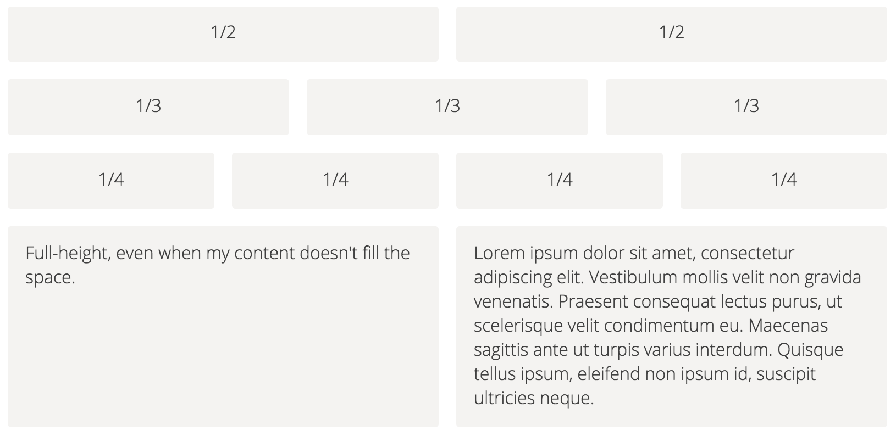
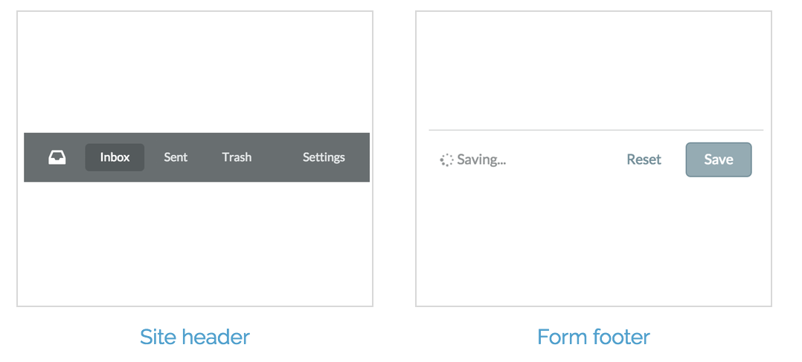

# Flexing your Flexbox muscles 💪🏾

<br />

## Ben Ilegbodu

<br />

[@benmvp](https://twitter.com/benmvp) | [benmvp.com](/) | [@confooca](https://twitter.com/confooca)  

<br />

December 6, 2016  

NOTES:
- My name is Ben Ilegbodu
- Excited to share about the Flexbox module introduced in CSS3
- Posted link to slides on twitter if you want to follow along

/////

<!-- .slide: data-background="url(../../img/giphy/stand-up.gif) no-repeat center" data-background-size="cover" -->

# Stand Up!
<!-- .element: style="-webkit-text-stroke: black 4px" -->

NOTES:
- But first, would like everyone to stand up!
- Let's do some wall sits
- Let's roll our shoulders
- Let's stretch our arms
- Now turn to your neighbors, introduce yourself & say hi
- You don't realize it, but I just tricked you
- Now you can't say that you didn't get anything out of my talk
- You at least got two things:
- Exercise & and met some people you didn't know
- But hopefully you'll get more out of the talk!

=====

# Building linear layouts in CSS has been hard
<!-- .element: class="statement" -->

NOTES:
- HTML was originally designed for displaying text-based documents like papers or articles
- Wasn't made for advanced layout
- We've had CSS positioning, but that assumes that you have fixed dimensions or locations

/////

# Tables

/////

# Floats

/////

# Inline-block

/////

# Solution: Flexbox Layout Module
<!-- .element: class="statement" -->

NOTES:
- Thankfully the CSS flexible box layout module, aka Flexbox, enables us to elegantly solve our layout problems

=====

ben-ilegbodu.json

<div style="display:flex;align-items:center">
	<div style="flex:0 0 50%;">
		<pre class="large"><code class="lang-json">
{
  "name": "Ben Ilegbodu",
  "priorities": [
    "Jesus", "family", "work"
  ],
  "location": "Pittsburg, CA",
  "work": "@Eventbrite",
  "role": "Frontend Eng Mgr",
  "hobbies": [
    "basketball", "DIY", "movies"
  ]
}
			</code></pre>
	</div>
	<div style="flex:0 0 50%;">
		
	</div>
</div>

NOTES:

/////


<!-- .element: style="border: 0; background: none; margin: 0; box-shadow: none;" -->

NOTES:
- Currently a Senior UI Engineer and Frontend Platform Manager at Eventbrite
- Eventbrite is an online ticketing & events platform
- Many conferences use it for registration
- I work on the Frontend Platform team and right now we're in the midst of a transition from Backbone/Marionette to React
- Python/Django backend, but using a Node daemon to render React components server-side

=====

# Flexible Layout Module

> The main idea behind the **flex layout** is to give the container the ability to alter its items' width/height (and order) to best fill the available space (mostly to accommodate to all kind of display devices and screen sizes). A flex container expands items to fill available free space, or shrinks them to prevent overflow.

~Chris Coyer ([Css-Tricks](https://css-tricks.com/snippets/css/a-guide-to-flexbox/))

NOTES:

The main idea behind flexbox is to give the container the ability to alter its items' dimensions to best fill the available space in responsive design. A flex container expands items to fill available free space, or shrinks them to prevent overflow.

/////

# Flexbox layout module

<div style="display:flex;margin-top:2em">
	<div style="flex:0 0 50%;">
		<h3>Container</h3>

		<ul>
			<li><code>display</code></li>
			<li><code>justify-content</code></li>
			<li><code>align-items</code></li>
			<li><code>flex-direction</code></li>
			<li><code>flex-wrap</code></li>
			<li><code>align-content</code></li>
		</ul>
	</div>
	<div style="flex:0 0 50%;">
		<h3>Items</h3>

		<ul>
			<li><code>align-self</code></li>
			<li><code>order</code></li>
			<li><code>flex-grow</code></li>
			<li><code>flex-shrink</code></li>
			<li><code>flex-basis</code></li>
		</ul>
	</div>
</div>

=====


<!-- .element: style="border: 0; background: none; margin: 0; box-shadow: none; width: 75%" -->

/////

###### Container

### `display`

<div class="container-example" style="margin-bottom:80px">
	<div class="item-example item-example-1">one</div>
	<div class="item-example item-example-2">two two</div>
	<div class="item-example item-example-3">three three three</div>
	<div class="item-example item-example-4">four four four four</div>
</div>

```
.container {
	display: flex;
}
```
<!-- .element class="large" -->

<a href="javascript:$('section.stack.present section.present .container-example').css('display', 'inline')">
	<code>inline</code></a> |
<a href="javascript:$('section.stack.present section.present .container-example').css('display', 'block')">
	<em><code>block</code></em></a> |
<a href="javascript:$('section.stack.present section.present .container-example').css('display', 'inline-block')">
	<code>inline-block</code></a> |
<a href="javascript:$('section.stack.present section.present .container-example').css('display', 'flex')">
	<strong><code>flex</code></strong></a> |
<a href="javascript:$('section.stack.present section.present .container-example').css('display', 'inline-flex')">
	<code>inline-flex</code></a>

NOTES:

- So let's go through all of the flexbox properties
- It all starts with `display:flex` (or `display:inline-flex`) on the container
- It enables a flex context for all its direct children.

/////

###### Container

### `justify-content`

<div class="container-example" style="margin-bottom:80px;justify-content:space-between">
	<div class="item-example item-example-1">one</div>
	<div class="item-example item-example-2">two two</div>
	<div class="item-example item-example-3">three three three</div>
	<div class="item-example item-example-4">four four four four</div>
</div>

```
.container {
	justify-content: space-between;
}
```
<!-- .element class="large" -->

<a href="javascript:$('section.stack.present section.present .container-example').css('justify-content', 'center')">
	<code>center</code></a> |
<a href="javascript:$('section.stack.present section.present .container-example').css('justify-content', 'flex-end')">
	<code>flex-end</code></a> |
<a href="javascript:$('section.stack.present section.present .container-example').css('justify-content', 'flex-start')">
	<em><code>flex-start</code></em></a> |
<a href="javascript:$('section.stack.present section.present .container-example').css('justify-content', 'space-around')">
	<code>space-around</code></a> |
<a href="javascript:$('section.stack.present section.present .container-example').css('justify-content', 'space-between')">
	<code><strong>space-between</strong></code></a>

NOTES:

- We can then set `justify-content: space-between` to evenly space
- `justify-content` helps distribute extra free space left over when either all the flex items on a line are inflexible, or are flexible but have reached their maximum size.
- Options:
  - `center`: items are centered along the line
  - `flex-end`: items are packed toward to end line
  - `flex-start`: (default) items are packed toward the start line
  - `space-around`: items are evenly distributed in the line with equal space around them.
  - `space-between`: items are evenly distributed in the line; first item is on the start line, last item on the end line

/////

###### Container

### `align-items`

<div class="container-example" style="margin-bottom:80px;justify-content:space-between;align-items:flex-end">
	<div class="item-example item-example-1">one</div>
	<div class="item-example item-example-2">two two</div>
	<div class="item-example item-example-3">three three three</div>
	<div class="item-example item-example-4">four four four four</div>
</div>

```
.container {
	align-items: flex-end;
}
```
<!-- .element class="large" -->

<a href="javascript:$('section.stack.present section.present .container-example').css('align-items', 'baseline')">
	<code>baseline</code></a> |
<a href="javascript:$('section.stack.present section.present .container-example').css('align-items', 'center')">
	<code>center</code></a> |
<a href="javascript:$('section.stack.present section.present .container-example').css('align-items', 'flex-end')">
	<strong><code>flex-end</code></strong></a> |
<a href="javascript:$('section.stack.present section.present .container-example').css('align-items', 'flex-start')">
	<code>flex-start</code></a> |
<a href="javascript:$('section.stack.present section.present .container-example').css('align-items', 'stretch')">
	<em><code>stretch</code></em></a>

NOTES:

- We can then set `align-items: flex-end` to align at the bottom
- `align-items` defines the default behavior for how flex items are laid out along the cross axis on the current line. Think of it as the `justify-content` version for the cross-axis (perpendicular to the main-axis).
- Options:
  - `baseline`: items are aligned such as the first line is aligned (useful for titles)
  - `center`: items are centered in the cross-axis
  - `flex-end`: cross-end margin edge of the items is placed on the cross-end line
  - `flex-start`: cross-start margin edge of the items is placed on the cross-start line
  - `stretch`: (default) stretch to fill the container (still respect min-width/max-width)

/////

###### Container

### `flex-direction`

<div class="container-example" style="margin-bottom:80px;justify-content:space-between;align-items:flex-end;flex-direction:row">
	<div class="item-example item-example-1">one</div>
	<div class="item-example item-example-2">two two</div>
	<div class="item-example item-example-3">three three three</div>
	<div class="item-example item-example-4">four four four four</div>
</div>

```
.container {
	flex-direction: row;
}
```
<!-- .element class="large" -->

<a href="javascript:$('section.stack.present section.present .container-example').css('flex-direction', 'column')">
	<code>column</code></a> |
<a href="javascript:$('section.stack.present section.present .container-example').css('flex-direction', 'column-reverse')">
	<code>column-reverse</code></a> |
<a href="javascript:$('section.stack.present section.present .container-example').css('flex-direction', 'row')">
	<strong><em><code>row</code></em></strong></a> |
<a href="javascript:$('section.stack.present section.present .container-example').css('flex-direction', 'row-reverse')">
	<code>row-reverse</code></a>

NOTES:
- We are using the default `flex-direction: row` to set the primary axis
- `flex-direction` defines the primary axis for how the items are laid out
- Options:
  - `column`: items are laid out vertically top to bottom
  - `column-reverse`: items are laid out vertically bottom to top
  - `row`: (default) items are laid out horizontally left to right
  - `row-reverse`: items are laid out horizontally right to left

/////

###### Container

### `flex-wrap`

<div class="container-example" style="margin-bottom:80px;justify-content:space-between;align-items:flex-end;flex-wrap:wrap">
	<div class="item-example item-example-1">one</div>
	<div class="item-example item-example-2">two two</div>
	<div class="item-example item-example-3">three three three</div>
	<div class="item-example item-example-4">four four four four</div>
	<div class="item-example item-example-5">five five</div>
	<div class="item-example item-example-6">six six six</div>
	<div class="item-example item-example-7">seven</div>
	<div class="item-example item-example-8">eight eight eight eight</div>
	<div class="item-example item-example-9">nine nine nine</div>
	<div class="item-example item-example-10">ten</div>
</div>

```
.container {
	flex-wrap: wrap;
}
```
<!-- .element class="large" -->

<a href="javascript:$('section.stack.present section.present .container-example').css('flex-wrap', 'nowrap')">
	<code><em>nowrap</em></code></a> |
<a href="javascript:$('section.stack.present section.present .container-example').css('flex-wrap', 'wrap')">
	<strong><code>wrap</code></strong></a> |
<a href="javascript:$('section.stack.present section.present .container-example').css('flex-wrap', 'wrap-reverse')">
	<code>wrap-reverse</code></a>

NOTES:
- We are using the default `flex-wrap: nowrap` to set the primary axis
- `flex-wrap` allows items to wrap as needed
- Options:
  - `nowrap`: (default) single line
  - `wrap`: multi-line
  - `wrap-reverse`: multi-line right to left

/////

###### Container

### `align-content`

<div class="container-example" style="margin-bottom:80px;justify-content:space-between;align-items:flex-end;flex-wrap:wrap;align-content:center;">
	<div class="item-example item-example-1">one</div>
	<div class="item-example item-example-2">two two</div>
	<div class="item-example item-example-3">three three three</div>
	<div class="item-example item-example-4">four four four four</div>
	<div class="item-example item-example-5">five five</div>
	<div class="item-example item-example-6">six six six</div>
	<div class="item-example item-example-7">seven</div>
	<div class="item-example item-example-8">eight eight eight eight</div>
	<div class="item-example item-example-9">nine nine nine</div>
	<div class="item-example item-example-10">ten</div>
</div>

```
.container {
	align-content: center;
}
```
<!-- .element class="large" -->

<a href="javascript:$('section.stack.present section.present .container-example').css('align-content', 'center')">
	<strong><code>center</code></strong></a> |
<a href="javascript:$('section.stack.present section.present .container-example').css('align-content', 'flex-end')">
	<code>flex-end</code></a> |
<a href="javascript:$('section.stack.present section.present .container-example').css('align-content', 'flex-start')">
	<code>flex-start</code></a> |
<a href="javascript:$('section.stack.present section.present .container-example').css('align-content', 'space-around')">
	<code>space-around</code></a> |
<a href="javascript:$('section.stack.present section.present .container-example').css('align-content', 'space-between')">
	<code>space-between</code></a> |
<a href="javascript:$('section.stack.present section.present .container-example').css('align-content', 'stretch')">
	<em><code><strong>stretch</strong></em></code></a>

NOTES:
- We are setting `align-content: center`
- `align-content` aligns container's lines when there's extra space in cross axis
- Options:
  - `center`: lines are packed to center of container
  - `flex-end`: lines are packed toward to end of container
  - `flex-start`: lines are packed to the start of container
  - `space-around`: lines are evenly distributed in the container with equal space around them.
  - `space-between`: lines are evenly distributed in the container; first line is at container start, last item at container end
  - `stretch`: (default) lines are stretched to take up remaining space

=====


<!-- .element: style="border: 0; background: none; margin: 0; box-shadow: none; width: 75%" -->

/////

###### Items

### `align-self`

<div class="container-example" style="margin-bottom:80px;justify-content:space-between;align-items:flex-end;">
	<div class="item-example item-example-1">one</div>
	<div class="item-example item-example-2">two two</div>
	<div class="item-example item-example-3" style="align-self:stretch">three three three</div>
	<div class="item-example item-example-4">four four four four</div>
	<div class="item-example item-example-5">five five</div>
	<div class="item-example item-example-6">six six six</div>
	<div class="item-example item-example-7">seven</div>
	<div class="item-example item-example-8">eight eight eight eight</div>
	<div class="item-example item-example-9">nine nine nine</div>
	<div class="item-example item-example-10">ten</div>
</div>

```
.item-3 {
  align-self: stretch;
}
```
<!-- .element class="large" -->

<a href="javascript:$('section.stack.present section.present .item-example-3).css('align-self', 'baseline')">
  <code>baseline</code></a> |
<a href="javascript:$('section.stack.present section.present .item-example-3').css('align-self', 'center')">
  <code>center</code></a> |
<a href="javascript:$('section.stack.present section.present .item-example-3').css('align-self', 'flex-end')">
  <code>flex-end</code></a> |
<a href="javascript:$('section.stack.present section.present .item-example-3').css('align-self', 'flex-start')">
  <code>flex-start</code></a> |
<a href="javascript:$('section.stack.present section.present .item-example-3').css('align-self', 'stretch')">
  <em><strong><code>stretch</code></strong></em></a>

NOTES:
- We can then set `align-self: stretch` to align the individual item at the top
- `align-self` allows the default alignment (or the one specified by `align-items`) to be overridden for individual flex items.
- Options:
- `baseline`: item is aligned such as their baselines align
- `center`: item is centered in the cross-axis
- `flex-end`: cross-end margin edge of the item is placed on the cross-end line
- `flex-start`: cross-start margin edge of the item is placed on the cross-start line
- `stretch`: (default) stretch to fill the container (still respect min-width/max-width)

/////

###### Items

### `order`

<div class="container-example" style="margin-bottom:80px;justify-content:space-between;align-items:flex-end;">
	<div class="item-example item-example-1" style="order:3">one</div>
	<div class="item-example item-example-2" style="order:10">two two</div>
	<div class="item-example item-example-3" style="align-self:stretch;order:6">three three three</div>
	<div class="item-example item-example-4" style="order:1">four four four four</div>
	<div class="item-example item-example-5" style="order:-1">five five</div>
	<div class="item-example item-example-6" style="order:2">six six six</div>
	<div class="item-example item-example-7" style="order:4">seven</div>
	<div class="item-example item-example-8" style="order:-1">eight eight eight eight</div>
	<div class="item-example item-example-9" style="order:8">nine nine nine</div>
	<div class="item-example item-example-10" style="order:7">ten</div>
</div>

```
.item-1  { order: 3; }   .item-2 { order: 10; }  .item-3 { order: 6; }
.item-4  { order: 1; }   .item-5 { order: -1; }  .item-6 { order: 2; }
.item-7  { order: 4; }   .item-8 { order: -1; }  .item-9 { order: 8; }
.item-10 { order: 7; }
```
<!-- .element class="large" -->

NOTES:

- By default, flex items are laid out in the source order.
- `order` controls the order in which they appear in the flex container.
- The value can be any integer (including negative numbers)
- `order` is really useful when you want to change the display order depending on media queries

/////

###### Items

### `flex-grow`

<div class="container-example" style="margin-bottom:80px;justify-content:space-between;align-items:flex-end;">
	<div class="item-example item-example-1" style="order:3;flex:2">one</div>
	<div class="item-example item-example-2" style="order:10;flex:1">two two</div>
	<div class="item-example item-example-3" style="align-self:stretch;order:6;flex:1">three three three</div>
	<div class="item-example item-example-4" style="order:1;flex:1">four four four four</div>
</div>

```
.item   { flex-grow: 1; }
.item-1 { flex-grow: 2; }
```
<!-- .element class="large" -->

<a href="javascript:$('section.stack.present section.present .item-example-1').css('flex', '0 1 0')">
  <code><em>&nbsp;&nbsp;0&nbsp;&nbsp;</em></code></a> |
<a href="javascript:$('section.stack.present section.present .item-example-1').css('flex', '1 1 0')">
  <code>&nbsp;&nbsp;1&nbsp;&nbsp;</code></a> |
<a href="javascript:$('section.stack.present section.present .item-example-1').css('flex', '2 1 0')">
  <strong><code>&nbsp;&nbsp;2&nbsp;&nbsp;</code></strong></a> |
<a href="javascript:$('section.stack.present section.present .item-example-1').css('flex', '5 1 0')">
  <code>&nbsp;&nbsp;5&nbsp;&nbsp;</code></a>

NOTES:
- `flex-grow` defines the ability for the item to grow if necessary.
- Options:
- 0 is default
- Positive numbers only

/////

###### Items

### `flex-basis`

<div class="container-example" style="margin-bottom:80px;justify-content:space-between;align-items:flex-end;">
	<div class="item-example item-example-1" style="order:3;flex:2">one</div>
	<div class="item-example item-example-2" style="order:10;flex:1">two two</div>
	<div class="item-example item-example-3" style="align-self:stretch;order:6;flex:1">three three three</div>
	<div class="item-example item-example-4" style="order:1;flex:1 1 30%">four four four four</div>
</div>

```
.item   { flex-basis: 0;   }
.item-4 { flex-basis: 30%; }
```
<!-- .element class="large" -->

<a href="javascript:$('section.stack.present section.present .item-example-4').css('flex', '1 1 auto')">
  <code><em>&nbsp;&nbsp;auto&nbsp;&nbsp;</em></code></a> |
<a href="javascript:$('section.stack.present section.present .item-example-4').css('flex', '1 1 0')">
  <code>&nbsp;&nbsp;0&nbsp;&nbsp;</code></a> |
<a href="javascript:$('section.stack.present section.present .item-example-4').css('flex', '1 1 30%')">
  <strong><code>&nbsp;&nbsp;30%&nbsp;&nbsp;</code></strong></a> |
<a href="javascript:$('section.stack.present section.present .item-example-4').css('flex', '1 1 850px')">
  <code>&nbsp;&nbsp;850px&nbsp;&nbsp;</code></a>

NOTES:
- `flex-basis` defines the default size of an element before the remaining space is distributed.
- It's called "basis" because it's not a fixed size. The size can grow as the remaining space is distributed
- Also it's not called "width" or "size" since it depends on the `flex-direction`
- Options:
- `auto` means "look at my width or height property"
- Can be any length measurement

/////

###### Items

### `flex-shrink`

<div class="container-example" style="margin-bottom:80px;justify-content:space-between;align-items:flex-end;">
	<div class="item-example item-example-1" style="order:3;flex:2 1 30%">one</div>
	<div class="item-example item-example-2" style="order:10;flex:1 10 30%">two two</div>
	<div class="item-example item-example-3" style="align-self:stretch;order:6;flex:1 1 30%;">three three three</div>
	<div class="item-example item-example-4" style="order:1;flex:1 1 30%">four four four four</div>
</div>

```
.item   { flex-basis: 30%; flex-shrink: 1; }
.item-2 { flex-shrink: 10; }
```
<!-- .element class="large" -->

<a href="javascript:$('section.stack.present section.present .item-example-2').css('flex', '1 0 30%')">
  <code>&nbsp;&nbsp;0&nbsp;&nbsp;</code></a> |
<a href="javascript:$('section.stack.present section.present .item-example-2').css('flex', '1 1 30%')">
  <em><code>&nbsp;&nbsp;1&nbsp;&nbsp;</code></em></a> |
<a href="javascript:$('section.stack.present section.present .item-example-2').css('flex', '1 5 30%')">
  <code>&nbsp;&nbsp;5&nbsp;&nbsp;</code></a> |
<a href="javascript:$('section.stack.present section.present .item-example-2').css('flex', '1 10 30%')">
  <strong><code>&nbsp;&nbsp;10&nbsp;&nbsp;</code></strong></a>

NOTES:
- `flex-shrink` defines the ability for the item to shrink if necessary.
- Options:
- `1` is the default
- Positive numbers only

/////

###### Items

### `flex`

```
.item {
	flex: <flex-grow> <flex-shrink> <flex-basis>;
}
```
<!-- .element class="large" style="margin:2em 0" -->

Use the shorthand for intelligent defaults!

```
.item {
	flex: 1; /* set grow only; default shrink/basis */
}
```
<!-- .element class="large" style="margin-top:2em" -->

=====

# Flexbox layout module

<div style="display:flex;margin-top:2em">
	<div style="flex:0 0 50%;">
		<h3>Container</h3>

		<ul>
			<li><code>display</code></li>
			<li><code>justify-content</code></li>
			<li><code>align-items</code></li>
			<li><code>flex-direction</code></li>
			<li><code>flex-wrap</code></li>
			<li><code>align-content</code></li>
		</ul>
	</div>
	<div style="flex:0 0 50%;">
		<h3>Items</h3>

		<ul>
			<li><code>align-self</code></li>
			<li><code>order</code></li>
			<li><code>flex-grow</code></li>
			<li><code>flex-basis</code></li>
			<li><code>flex-shrink</code></li>
		</ul>
	</div>
</div>

=====

# Flexbox can do what?!?!

> Flexbox just does what I want it to do...

~Ben Ilegbodu

NOTES:
- Start looking at what it looks like when we combine multiple properties

=====

## Vertical alignment


https://philipwalton.github.io/solved-by-flexbox/demos/vertical-centering/

NOTES:
- General lack of sufficient solutions for vertical alignment
- The obvious `vertical-align` property rarely works!

/////

###### Vertical centering

<div style="display:flex;align-items:center;justify-content:space-between">
	<div style="flex:0 0 60%;">
		<pre class="large"><code><div class="container">
  <div class="item">...</div>
  <div class="item item--bot">...</div>
  <div class="item item--top">...</div>
</div></code></pre>
		<pre class="large"><code class="lang-html">.container {
  display: flex;
  align-items: center;
  justify-content: center;
}
.item--top { align-self: flex-start; }
.item--bot { align-self: flex-end; }</code></pre>
	</div>
	<div style="flex:0 0 36%;">
		<div class="container-example" style="width:100%;height:750px;align-items:center;justify-content:center">
			<div class="item-example">Centered</div>
			<div class="item-example" style="align-self:flex-end">Bottom</div>
			<div class="item-example" style="align-self:flex-start">Top</div>
		</div>
	</div>
</div>

NOTES:
- The items are still horizontally aligned in the center
- That's what "Centered" is first, then "Bottom", and "Top"
- Remember default for `align-items` is `stretch`
- Default for `justify-content` is `flex-start`
- If you remove the `align-self` they'd all be vertically-centered

=====

## Sticky footer

https://philipwalton.github.io/solved-by-flexbox/demos/sticky-footer/

=====

## Media object

https://philipwalton.github.io/solved-by-flexbox/demos/media-object/

=====

## Input add-ons

https://philipwalton.github.io/solved-by-flexbox/demos/input-add-ons/

=====

## Grid system



https://philipwalton.github.io/solved-by-flexbox/demos/grids/

/////

###### Grid System

```
.grid { display: flex; }     .gcell { flex: 1; }
```
<!-- .element class="large" -->

<div style="display:flex;align-items:center;justify-content:space-between">
	<div style="flex:0 0 48%;">
		<pre><code class="lang-html"><div class="grid">
	<div class="gcell"> ... </div>
	<div class="gcell"> ... </div>
</div></code></pre>
	</div>
	<div style="flex:0 0 48%;">
		<div class="grid">
			<div class="grid-cell"><div class="grid-cell-ex">1/2</div></div>
			<div class="grid-cell"><div class="grid-cell-ex">1/2</div></div>
		</div>
	</div>
</div>

<div style="display:flex;align-items:center;justify-content:space-between">
	<div style="flex:0 0 48%;">
		<pre><code class="lang-html"><div class="grid">
	<div class="gcell"> ... </div>
	<div class="gcell"> ... </div>
	<div class="gcell"> ... </div>
</div></code></pre>
	</div>
	<div style="flex:0 0 48%;">
		<div class="grid">
			<div class="grid-cell"><div class="grid-cell-ex">1/3</div></div>
			<div class="grid-cell"><div class="grid-cell-ex">1/3</div></div>
			<div class="grid-cell"><div class="grid-cell-ex">1/3</div></div>
		</div>
	</div>
</div>

<div style="display:flex;align-items:center;justify-content:space-between">
	<div style="flex:0 0 48%;">
		<pre><code class="lang-html"><div class="grid">
	<div class="gcell"> ... </div>
	<div class="gcell"> ... </div>
	<div class="gcell"> ... </div>
	<div class="gcell"> ... </div>
</div></code></pre>
	</div>
	<div style="flex:0 0 48%;">
		<div class="grid">
			<div class="grid-cell"><div class="grid-cell-ex">1/4</div></div>
			<div class="grid-cell"><div class="grid-cell-ex">1/4</div></div>
			<div class="grid-cell"><div class="grid-cell-ex">1/4</div></div>
			<div class="grid-cell"><div class="grid-cell-ex">1/4</div></div>
		</div>
	</div>
</div>

NOTES:
- Grid systems usually come with a myriad of sizing options
- But the vast majority of the time you just want two or three elements side-by-side.
- And we required to put sizing classes on every single cell?
- With Flexbox, by default, each grid cell is the same width and height as every other cell in the row.
- Basically they all size to fit by default.
- Edge-to-edge w/ no margins

/////

###### Grid System

## Gutters

```
.grid--gutters { margin: -1em 0 0 -1em; }
.grid--gutters .gcell { padding: 1em 0 0 1em; }
```
<!-- .element class="large" style="margin:1.5em 0" -->

<div style="display:flex;align-items:center;justify-content:space-between">
	<div style="flex:0 0 48%;">
		<pre><code class="lang-html"><div class="grid grid--gutters">
	<div class="gcell"> ... </div>
	<div class="gcell"> ... </div>
</div></code></pre>
	</div>
	<div style="flex:0 0 48%;">
		<div class="grid grid--gutters">
			<div class="grid-cell"><div class="grid-cell-ex">1/2</div></div>
			<div class="grid-cell"><div class="grid-cell-ex">1/2</div></div>
		</div>
	</div>
</div>

<div style="display:flex;align-items:center;justify-content:space-between">
	<div style="flex:0 0 48%;">
		<pre><code class="lang-html"><div class="grid grid--gutters">
	<div class="gcell"> ... </div>
	<div class="gcell"> ... </div>
	<div class="gcell"> ... </div>
	<div class="gcell"> ... </div>
</div></code></pre>
	</div>
	<div style="flex:0 0 48%;">
		<div class="grid grid--gutters">
			<div class="grid-cell"><div class="grid-cell-ex">1/4</div></div>
			<div class="grid-cell"><div class="grid-cell-ex">1/4</div></div>
			<div class="grid-cell"><div class="grid-cell-ex">1/4</div></div>
			<div class="grid-cell"><div class="grid-cell-ex">1/4</div></div>
		</div>
	</div>
</div>

NOTES:
- Grid systems usually come with a myriad of sizing options
- But the vast majority of the time you just want two or three elements side-by-side.
- And we required to put sizing classes on every single cell?
- With Flexbox, by default, each grid cell is the same width and height as every other cell in the row.
- Basically they all size to fit by default.
- Edge-to-edge w/ no margins

/////

###### Grid System

## Individual Sizing

<div style="display:flex;align-items:center;justify-content:space-between">
	<div style="flex:0 0 48%;">
		<pre class="large"><code class="lang-css">.gcell--1of3 {
  flex: 0 0 auto;
  width: 33.3333%;
}
.gcell--1of4 {
  flex: 0 0 auto;
  width: 25%;
}</code></pre>
		<pre><code class="lang-html"><div class="grid grid--gutters">
  <div class="gcell gcell--1of3"> </div>
  <div class="gcell"> </div>
  <div class="gcell gcell--1of4"> </div>
</div></code></pre>
	</div>
	<div style="flex:0 0 48%;">
		<div class="grid grid--gutters">
			<div class="grid-cell grid-cell--1of3"><div class="grid-cell-ex">1/3</div></div>
			<div class="grid-cell"><div class="grid-cell-ex">auto<br />auto<br />auto<br />auto<br />auto</div></div>
			<div class="grid-cell grid-cell--1of4"><div class="grid-cell-ex">1/4</div></div>
		</div>
	</div>
</div>

NOTES:
- Grid systems usually come with a myriad of sizing options
- But the vast majority of the time you just want two or three elements side-by-side.
- And we required to put sizing classes on every single cell?
- With Flexbox, by default, each grid cell is the same width and height as every other cell in the row.
- Basically they all size to fit by default.
- Edge-to-edge w/ no margins

/////

###### Grid System

## Reponsive Sizing

<div style="display:flex;align-items:center;justify-content:space-between">
	<div style="flex:0 0 48%;">
		<pre class="large"><code class="lang-css">.gcell--1of2 {
  flex: 0 0 auto;
  width: 50%;
}
@media (min-width: 48em) {
  .gcell-small--1of2 {
    width: 50%;
  }
}</code></pre>
		<pre><code class="lang-html"><div class="grid grid--gutters">
  <div class="gcell gcell--1of3"> </div>
  <div class="gcell"> </div>
  <div class="gcell gcell--1of4"> </div>
</div></code></pre>
	</div>
	<div style="flex:0 0 48%;">
		<div class="grid grid--gutters">
			<div class="grid-cell grid-cell-lg--1of2"><div class="grid-cell-ex">Full / Half</div></div>
			<div class="grid-cell grid-cell-lg--1of2"><div class="grid-cell-ex">Full / Half</div></div>
		</div>
	</div>
</div>

NOTES:
- Grid systems usually come with a myriad of sizing options
- But the vast majority of the time you just want two or three elements side-by-side.
- And we required to put sizing classes on every single cell?
- With Flexbox, by default, each grid cell is the same width and height as every other cell in the row.
- Basically they all size to fit by default.
- Edge-to-edge w/ no margins

=====

# Holy grail layout

https://philipwalton.github.io/solved-by-flexbox/demos/holy-grail/

=====

## Browser support

[](http://caniuse.com/#feat=flexbox)

IE10+, Edge, Chrome, Firefox, Opera, Safari 8+, Android 4.1+, iOS

http://caniuse.com/#feat=flexbox

NOTES:
- Not supported in IE8 or IE9
- But those should be dead or dying soon

=====

# Looking ahead

/////

# Grid

/////

  <!-- .element: style="width: 300px" -->  
Rachel Andrew

<br />

[<h2>The New CSS Layout</h2>](/)

Tomorrow @ 10am in Pavilion A

/////

# Shapes

=====

[](http://www.w3.org/TR/css3-flexbox/)

[Flexbox layout module specification](http://www.w3.org/TR/css3-flexbox/)

/////

[](https://css-tricks.com/snippets/css/a-guide-to-flexbox/)

[A Complete Guide to Flexbox](https://css-tricks.com/snippets/css/a-guide-to-flexbox/)

/////

[](http://philipwalton.github.io/solved-by-flexbox/)

[Solved by Flexbox](http://philipwalton.github.io/solved-by-flexbox/)

/////

[](http://www.flexboxpatterns.com/home)

[Flexbox Patterns](http://www.flexboxpatterns.com/home)

/////

[](http://flexboxfroggy.com/)

[Flexbox froggy](http://flexboxfroggy.com/)

/////

[](http://www.flexboxdefense.com/)

[Flexbox defense](http://www.flexboxdefense.com/)


=====


<!-- .element: style="width: 60%" -->

/////


<!-- .element: style="width: 100%;border: 0; background: none; margin: 0; box-shadow: none;" -->

NOTES:
- Vance
- Jesse
- Amanda

/////


<!-- .element: style="border: 0; background: none; margin: 0; box-shadow: none;" -->

/////

# YOU!

NOTES:
- It's my hope that, the main reason I do this, is so you can feel excited & confident to start using ES6 syntax in your code to make it clearer and more succinct
- Any feedback would be appreciated!

=====

# THANKS!


<!-- .element: style="width: 75%" -->

NOTES:

/////

# Questions?

<br />

## Ben Ilegbodu

[benmvp.com](/) | [@benmvp](https://twitter.com/benmvp) | [ben@benmvp.com](mailto:ben@benmvp.com)

<br />

### _Sweet ES6_, Tomorrow @ 4pm in Fontaine F

<br />

Ask me anything! [benmvp.com/ama](http://www.benmvp.com/ama/)

NOTES:
- Slides are available on Twitter
- Ask questions on Twitter, via email or AMA!
