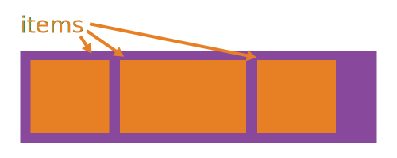
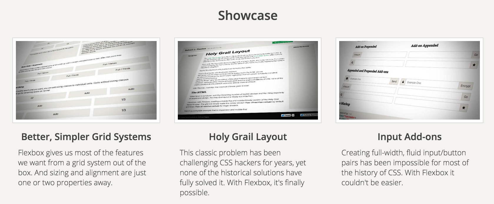
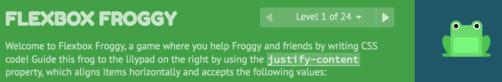
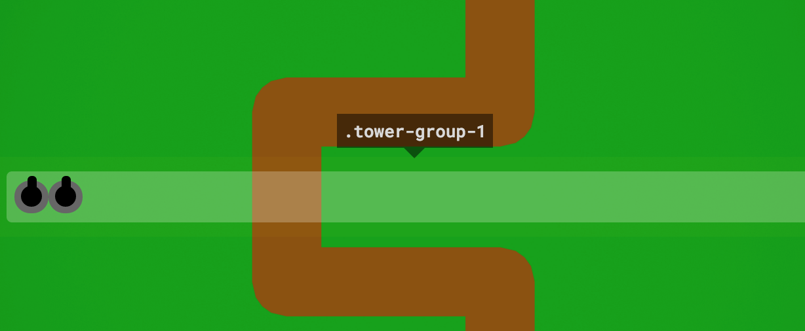

# Flexing your Flexbox muscles 💪🏾

<br />

## Ben Ilegbodu

<br />

[@benmvp](https://twitter.com/benmvp) | [benmvp.com](/) | [@confooca](https://twitter.com/confooca)  

<br />

December 6, 2016  

NOTES:
- My name is Ben Ilegbodu
- Excited to share about the Flexbox module introduced in CSS3
- Posted link to slides on twitter if you want to follow along

/////

<!-- .slide: data-background="url(../../img/giphy/stand-up.gif) no-repeat center" data-background-size="cover" -->

# Stand Up!
<!-- .element: style="-webkit-text-stroke: black 4px" -->

NOTES:
- But first, would like everyone to stand up!
- Let's do some wall sits
- Let's roll our shoulders
- Let's stretch our arms
- Now turn to your neighbors, introduce yourself & say hi
- You don't realize it, but I just tricked you
- Now you can't say that you didn't get anything out of my talk
- You at least got two things:
- Exercise & and met some people you didn't know
- But hopefully you'll get more out of the talk!

=====

# Building linear layouts in CSS has been hard
<!-- .element: class="statement" -->

NOTES:
- HTML was originally designed for displaying text-based documents like papers or articles
- Wasn't made for advanced layout
- We've had CSS positioning, but that assumes that you have fixed dimensions or locations
- Trying to solve problem of two things on the same line that won't overlap, but take up only necessary space is challenging

/////

## Tables

<table class="data-table">
	<thead>
		<tr>
			<th>&nbsp;</th>
			<th>Pavilion A</th>
			<th>Pavilion B</th>
			<th>Pavilion C</th>
			<th>Junior A</th>
			<th>Junior B</th>
			<th>Junior D</th>
		</tr>
	</thead>
	<tbody>
		<tr>
			<th>7:30<br />9:00</th>
			<td colspan="6" align="center">Registration and coffee</td>
		</tr>
		<tr>
			<th>9:00<br />9:45</th>
			<td colspan="6" align="center">Opening keynote</td>
		</tr>
		<tr>
			<th>10:00<br />10:45</th>
			<td>Nine New Things in Java 9</td>
			<td>Foundations of Zend Framework</td>
			<td>Flexing your Flexbox Muscles 💪🏾</td>
			<td>7 Steps to Pragmatic Mobile Testing</td>
			<td>MVC - What Rails and a Mozart Violin Concerto have in Common</td>
			<td>Know your Enemy - An Introduction to Threat Modeling</td>
		</tr>
		<tr>
			<th>11:00<br />11:45</th>
			<td>phpdbg for Fun and Profit</td>
			<td>Massively Scalable .NET Web Services with Project Orleans</td>
			<td>Learning HTTP</td>
			<td>Undo for the Rest of Us</td>
			<td>Outgrowing Spreadsheets, Moving to Rails</td>
			<td>Five Database Mistakes You Are Making and How to Fix 'em</td>
		</tr>
		<tr>
			<th>11:45<br />13:00</th>
			<td colspan="6" align="center">Lunch</td>
		</tr>
		<tr>
			<th>13:00<br />13:45</th>
			<td>What's Happening in PHP?</td>
			<td>MySQL Performance for Non-DBAs</td>
			<td>OpenAPI (Swagger) REST Code Generation w/ AutoRest</td>
			<td>Python for non-Python developers</td>
			<td>Ruby Can Too Scale: Highly Performant Microservices in Ruby</td>
			<td>How We Run Successful Web Projects</td>
		</tr>
	</tbody>
</table>

NOTES:
- Originally we used to use tables for layout
- Tables were great because they were flexible
- Vertical alignment is easy and you can align columns
- But tables are for tabular data; there was public shaming
- Because of all of the calculations involved in a table, would render all at once
- Biggest drawback: Not responsive

/////

## Floats


<p style="text-align:justify;">Bacon ipsum dolor amet alcatra laborum kevin, consequat consectetur labore ribeye officia ullamco ut laboris in in fatback excepteur. Dolore strip steak duis jerky exercitation anim. Sunt pork belly laboris elit labore. Fugiat ribeye eiusmod tempor do sirloin.</p>

<p style="text-align:justify;">Duis rump venison, consectetur mollit meatloaf reprehenderit velit pariatur non. Pariatur sed irure, pig strip steak laborum alcatra salami. Aliquip qui meatloaf, aute drumstick ut sausage capicola jerky prosciutto exercitation rump adipisicing deserunt. Occaecat rump strip steak exercitation short ribs, beef minim fugiat cupidatat ribeye nulla. Tongue drumstick ipsum strip steak fugiat swine. Reprehenderit shoulder pancetta nulla.</p>


<p style="text-align:justify;">Veniam short loin lorem salami kevin fatback. Beef ribs turkey irure short loin. Occaecat fatback eu cupidatat nostrud qui meatloaf. Biltong jerky ham, short loin incididunt ham hock ribeye filet mignon occaecat enim et turkey quis.</p>

NOTES:
- Then w/o tables we resorted to CSS floats
- But floats were actually intended for wrapping images around text in articles
- With floats, we ran into the collapsing `<div>` issue
- Clearing the floats after was also a pain
- Trying to get items floated left & right but not run into each other
- Libraries like Bootstrap & Foundation became popular in part because of this need

/////

## Inline-block

<p style="text-align:justify;">Duis rump venison, consectetur mollit meatloaf reprehenderit velit pariatur non. Pariatur sed irure, pig strip steak laborum alcatra salami. Aliquip qui meatloaf, aute drumstick ut sausage capicola jerky prosciutto exercitation rump adipisicing deserunt.  Occaecat rump strip steak exercitation short ribs, beef minim fugiat cupidatat ribeye nulla. Tongue drumstick ipsum strip steak fugiat swine. Reprehenderit shoulder pancetta nulla.</p>

NOTES:
- Another option has been `display: inline-block`
- Combination of block-level and inline elements
- Essentially inline elements that can set vertical dimension and margin/padding
- Whitespace adds in unwanted built-in horizontal margin
- Difficult to have two things on the same line coming from different directions
- Before the setting inline block was just for images

/////

# Solution: Flexbox Layout Module
<!-- .element: class="statement" -->

NOTES:
- Thankfully the CSS flexible box layout module, aka Flexbox, enables us to elegantly solve our linear layout problems
- Gives us a real solution to build linear layouts

=====

ben-ilegbodu.json

<div style="display:flex;align-items:center">
	<div style="flex:0 0 50%;">
		<pre class="large"><code class="lang-json">
{
  "name": "Ben Ilegbodu",
  "priorities": [
    "Jesus", "family", "work"
  ],
  "location": "Pittsburg, CA",
  "work": "@Eventbrite",
  "role": "Frontend Eng Mgr",
  "hobbies": [
    "basketball", "DIY", "movies"
  ]
}
			</code></pre>
	</div>
	<div style="flex:0 0 50%;">
		
	</div>
</div>

NOTES:

/////


<!-- .element: style="border: 0; background: none; margin: 0; box-shadow: none;" -->

NOTES:
- Currently a Senior UI Engineer and Frontend Platform Manager at Eventbrite
- Eventbrite is an online ticketing & events platform
- Many conferences use it for registration
- I work on the Frontend Platform team and right now we're in the midst of a transition from Backbone/Marionette to React

=====

# Flexible Layout Module

> The main idea behind the **flex layout** is to give the container the ability to alter its items' width/height (and order) to best fill the available space (mostly to accommodate to all kind of display devices and screen sizes). A flex container expands items to fill available free space, or shrinks them to prevent overflow.

~Chris Coyer ([Css-Tricks](https://css-tricks.com/snippets/css/a-guide-to-flexbox/))

NOTES:

- The main idea behind flexbox is to give the container the ability to alter its items' dimensions to best fill the available space in responsive design. A flex container expands items to fill available free space, or shrinks them to prevent overflow.
- Sounds like exactly what we want

/////

# Flexbox layout module

<div style="display:flex;margin-top:2em">
	<div style="flex:0 0 50%;">
		<h3>Container</h3>

		<ul>
			<li><code>display</code></li>
			<li><code>justify-content</code></li>
			<li><code>align-items</code></li>
			<li><code>flex-direction</code></li>
			<li><code>flex-wrap</code></li>
			<li><code>align-content</code></li>
		</ul>
	</div>
	<div style="flex:0 0 50%;">
		<h3>Items</h3>

		<ul>
			<li><code>align-self</code></li>
			<li><code>order</code></li>
			<li><code>flex-grow</code></li>
			<li><code>flex-shrink</code></li>
			<li><code>flex-basis</code></li>
		</ul>
	</div>
</div>

NOTES:
- There are 11 Flexbox-related properties you can set on container & items
- Wanna walk through all of them and demonstrate how they work

=====


<!-- .element: style="border: 0; background: none; margin: 0; box-shadow: none; width: 75%" -->

NOTES:

- First we'll start with properties on the entire flex container

/////

###### Container

### `display`

<div class="container-example" style="margin-bottom:80px">
	<div class="item-example item-example-1">one</div>
	<div class="item-example item-example-2">two two</div>
	<div class="item-example item-example-3">three three three</div>
	<div class="item-example item-example-4">four four four four</div>
</div>

```
.container {
	display: flex;
}
```
<!-- .element class="large" -->

<a href="javascript:$('section.stack.present section.present .container-example').css('display', 'inline')">
	<code>inline</code></a> |
<a href="javascript:$('section.stack.present section.present .container-example').css('display', 'block')">
	<em><code>block</code></em></a> |
<a href="javascript:$('section.stack.present section.present .container-example').css('display', 'inline-block')">
	<code>inline-block</code></a> |
<a href="javascript:$('section.stack.present section.present .container-example').css('display', 'flex')">
	<strong><code>flex</code></strong></a> |
<a href="javascript:$('section.stack.present section.present .container-example').css('display', 'inline-flex')">
	<code>inline-flex</code></a>

NOTES:

- So let's go through all of the flexbox properties
- It all starts with `display:flex` (or `display:inline-flex`) on the container
- It enables a flex context for all its direct children.
- Since the slides are web-based, we practice Flexbox right in the slides

/////

###### Container

### `justify-content`

<div class="container-example" style="margin-bottom:80px;justify-content:space-between">
	<div class="item-example item-example-1">one</div>
	<div class="item-example item-example-2">two two</div>
	<div class="item-example item-example-3">three three three</div>
	<div class="item-example item-example-4">four four four four</div>
</div>

```
.container {
	justify-content: space-between;
}
```
<!-- .element class="large" -->

<a href="javascript:$('section.stack.present section.present .container-example').css('justify-content', 'center')">
	<code>center</code></a> |
<a href="javascript:$('section.stack.present section.present .container-example').css('justify-content', 'flex-end')">
	<code>flex-end</code></a> |
<a href="javascript:$('section.stack.present section.present .container-example').css('justify-content', 'flex-start')">
	<em><code>flex-start</code></em></a> |
<a href="javascript:$('section.stack.present section.present .container-example').css('justify-content', 'space-around')">
	<code>space-around</code></a> |
<a href="javascript:$('section.stack.present section.present .container-example').css('justify-content', 'space-between')">
	<code><strong>space-between</strong></code></a>

NOTES:

- `justify-content` helps distribute extra free space left over when either all the flex items on a line are inflexible, or are flexible but have reached their maximum size.
- Options:
  - `center`: items are centered along the line
  - `flex-end`: items are packed toward to end line
  - `flex-start`: (default) items are packed toward the start line
  - `space-around`: items are evenly distributed in the line with equal space around them.
  - `space-between`: items are evenly distributed in the line; first item is on the start line, last item on the end line
- Look at all we can do w/ just one property!
- Think about how hard it would be to do `space-around` or `space-between`

/////

###### Container

### `align-items`

<div class="container-example" style="margin-bottom:80px;justify-content:space-between;align-items:flex-end">
	<div class="item-example item-example-1">one</div>
	<div class="item-example item-example-2">two two</div>
	<div class="item-example item-example-3">three three three</div>
	<div class="item-example item-example-4">four four four four</div>
</div>

```
.container {
	align-items: flex-end;
}
```
<!-- .element class="large" -->

<a href="javascript:$('section.stack.present section.present .container-example').css('align-items', 'baseline')">
	<code>baseline</code></a> |
<a href="javascript:$('section.stack.present section.present .container-example').css('align-items', 'center')">
	<code>center</code></a> |
<a href="javascript:$('section.stack.present section.present .container-example').css('align-items', 'flex-end')">
	<strong><code>flex-end</code></strong></a> |
<a href="javascript:$('section.stack.present section.present .container-example').css('align-items', 'flex-start')">
	<code>flex-start</code></a> |
<a href="javascript:$('section.stack.present section.present .container-example').css('align-items', 'stretch')">
	<em><code>stretch</code></em></a>

NOTES:

- `align-items` defines the default behavior for how flex items are laid out along the cross axis on the current line. Think of it as the `justify-content` version for the cross-axis (perpendicular to the main-axis).
- Options:
  - `baseline`: items are aligned such as the first line is aligned (useful for titles)
  - `center`: items are centered in the cross-axis
  - `flex-end`: cross-end margin edge of the items is placed on the cross-end line
  - `flex-start`: cross-start margin edge of the items is placed on the cross-start line
  - `stretch`: (default) stretch to fill the container (still respect min-width/max-width)
- Outside of tables vertical alignment is so tough
- Flexbox makes it dead simple

/////

###### Container

### `flex-direction`

<div class="container-example" style="margin-bottom:80px;justify-content:space-between;align-items:flex-end;flex-direction:row">
	<div class="item-example item-example-1">one</div>
	<div class="item-example item-example-2">two two</div>
	<div class="item-example item-example-3">three three three</div>
	<div class="item-example item-example-4">four four four four</div>
</div>

```
.container {
	flex-direction: row;
}
```
<!-- .element class="large" -->

<a href="javascript:$('section.stack.present section.present .container-example').css('flex-direction', 'column')">
	<code>column</code></a> |
<a href="javascript:$('section.stack.present section.present .container-example').css('flex-direction', 'column-reverse')">
	<code>column-reverse</code></a> |
<a href="javascript:$('section.stack.present section.present .container-example').css('flex-direction', 'row')">
	<strong><em><code>row</code></em></strong></a> |
<a href="javascript:$('section.stack.present section.present .container-example').css('flex-direction', 'row-reverse')">
	<code>row-reverse</code></a>

NOTES:
- The items don't have to just go horizontally, they can also go vertically
- `flex-direction` defines the primary axis for how the items are laid out
- Options:
  - `column`: items are laid out vertically top to bottom
  - `column-reverse`: items are laid out vertically bottom to top
  - `row`: (default) items are laid out horizontally left to right
  - `row-reverse`: items are laid out horizontally right to left
- Because we have `align-items: flex-end` they're all right-aligned
- Can do some interesting things when you combine `flex-direction`, `justify-content` & `align-items`
- We'll see examples later

/////

###### Container

### `flex-wrap`

<div class="container-example" style="margin-bottom:80px;justify-content:space-between;align-items:flex-end;flex-wrap:wrap">
	<div class="item-example item-example-1">one</div>
	<div class="item-example item-example-2">two two</div>
	<div class="item-example item-example-3">three three three</div>
	<div class="item-example item-example-4">four four four four</div>
	<div class="item-example item-example-5">five five</div>
	<div class="item-example item-example-6">six six six</div>
	<div class="item-example item-example-7">seven</div>
	<div class="item-example item-example-8">eight eight eight eight</div>
	<div class="item-example item-example-9">nine nine nine</div>
	<div class="item-example item-example-10">ten</div>
</div>

```
.container {
	flex-wrap: wrap;
}
```
<!-- .element class="large" -->

<a href="javascript:$('section.stack.present section.present .container-example').css('flex-wrap', 'nowrap')">
	<code><em>nowrap</em></code></a> |
<a href="javascript:$('section.stack.present section.present .container-example').css('flex-wrap', 'wrap')">
	<strong><code>wrap</code></strong></a> |
<a href="javascript:$('section.stack.present section.present .container-example').css('flex-wrap', 'wrap-reverse')">
	<code>wrap-reverse</code></a>

NOTES:
- Let's talk about a lesser-used property: `flex-wrap`
- `flex-wrap` allows items to wrap as needed
- Options:
  - `nowrap`: (default) single line
  - `wrap`: multi-line
  - `wrap-reverse`: multi-line right to left

/////

###### Container

### `align-content`

<div class="container-example" style="margin-bottom:80px;justify-content:space-between;align-items:flex-end;flex-wrap:wrap;align-content:center;">
	<div class="item-example item-example-1">one</div>
	<div class="item-example item-example-2">two two</div>
	<div class="item-example item-example-3">three three three</div>
	<div class="item-example item-example-4">four four four four</div>
	<div class="item-example item-example-5">five five</div>
	<div class="item-example item-example-6">six six six</div>
	<div class="item-example item-example-7">seven</div>
	<div class="item-example item-example-8">eight eight eight eight</div>
	<div class="item-example item-example-9">nine nine nine</div>
	<div class="item-example item-example-10">ten</div>
</div>

```
.container {
	align-content: center;
}
```
<!-- .element class="large" -->

<a href="javascript:$('section.stack.present section.present .container-example').css('align-content', 'center')">
	<strong><code>center</code></strong></a> |
<a href="javascript:$('section.stack.present section.present .container-example').css('align-content', 'flex-end')">
	<code>flex-end</code></a> |
<a href="javascript:$('section.stack.present section.present .container-example').css('align-content', 'flex-start')">
	<code>flex-start</code></a> |
<a href="javascript:$('section.stack.present section.present .container-example').css('align-content', 'space-around')">
	<code>space-around</code></a> |
<a href="javascript:$('section.stack.present section.present .container-example').css('align-content', 'space-between')">
	<code>space-between</code></a> |
<a href="javascript:$('section.stack.present section.present .container-example').css('align-content', 'stretch')">
	<em><code><strong>stretch</strong></em></code></a>

NOTES:
- `align-content` aligns container's lines when there's extra space in cross axis
- Options:
  - `center`: lines are packed to center of container
  - `flex-end`: lines are packed toward to end of container
  - `flex-start`: lines are packed to the start of container
  - `space-around`: lines are evenly distributed in the container with equal space around them.
  - `space-between`: lines are evenly distributed in the container; first line is at container start, last item at container end
  - `stretch`: (default) lines are stretched to take up remaining space

=====


<!-- .element: style="border: 0; background: none; margin: 0; box-shadow: none; width: 75%" -->

NOTES:
- Those were the 6 properties that let you configure the container
- Just start thinking about all you can do with those properties
- Let's look at properties you can set on the flex items

/////

###### Items

### `align-self`

<div class="container-example" style="margin-bottom:80px;justify-content:space-between;align-items:flex-end;">
	<div class="item-example item-example-1">one</div>
	<div class="item-example item-example-2">two two</div>
	<div class="item-example item-example-3" style="align-self:stretch">three three three</div>
	<div class="item-example item-example-4">four four four four</div>
	<div class="item-example item-example-5">five five</div>
	<div class="item-example item-example-6">six six six</div>
	<div class="item-example item-example-7">seven</div>
	<div class="item-example item-example-8">eight eight eight eight</div>
	<div class="item-example item-example-9">nine nine nine</div>
	<div class="item-example item-example-10">ten</div>
</div>

```
.item-3 {
  align-self: stretch;
}
```
<!-- .element class="large" -->

<a href="javascript:$('section.stack.present section.present .item-example-3').css('align-self', 'auto')">
  <em><code>auto</code></em></a> |
<a href="javascript:$('section.stack.present section.present .item-example-3').css('align-self', 'baseline')">
  <code>baseline</code></a> |
<a href="javascript:$('section.stack.present section.present .item-example-3').css('align-self', 'center')">
  <code>center</code></a> |
<a href="javascript:$('section.stack.present section.present .item-example-3').css('align-self', 'flex-end')">
  <code>flex-end</code></a> |
<a href="javascript:$('section.stack.present section.present .item-example-3').css('align-self', 'flex-start')">
  <code>flex-start</code></a> |
<a href="javascript:$('section.stack.present section.present .item-example-3').css('align-self', 'stretch')">
  <strong><code>stretch</code></strong></a>

NOTES:
- We can then set `align-self: stretch` to align the individual item at the top
- `align-self` allows the default alignment (or the one specified by `align-items`) to be overridden for individual flex items.
- Options:
  - `baseline`: item is aligned such as their baselines align
  - `center`: item is centered in the cross-axis
  - `flex-end`: cross-end margin edge of the item is placed on the cross-end line
  - `flex-start`: cross-start margin edge of the item is placed on the cross-start line
  - `stretch`: (default) stretch to fill the container (still respect min-width/max-width)
- You can set item properties on one, some or all items

/////

###### Items

### `order`

<div class="container-example" style="margin-bottom:80px;justify-content:space-between;align-items:flex-end;">
	<div class="item-example item-example-1" style="order:3">one</div>
	<div class="item-example item-example-2" style="order:10">two two</div>
	<div class="item-example item-example-3" style="align-self:stretch;order:6">three three three</div>
	<div class="item-example item-example-4" style="order:1">four four four four</div>
	<div class="item-example item-example-5" style="order:-1">five five</div>
	<div class="item-example item-example-6" style="order:2">six six six</div>
	<div class="item-example item-example-7" style="order:4">seven</div>
	<div class="item-example item-example-8" style="order:-1">eight eight eight eight</div>
	<div class="item-example item-example-9" style="order:8">nine nine nine</div>
	<div class="item-example item-example-10" style="order:7">ten</div>
</div>

```
.item-1  { order: 3; }   .item-2 { order: 10; }  .item-3 { order: 6; }
.item-4  { order: 1; }   .item-5 { order: -1; }  .item-6 { order: 2; }
.item-7  { order: 4; }   .item-8 { order: -1; }  .item-9 { order: 8; }
.item-10 { order: 7; }
```
<!-- .element class="large" -->

NOTES:

- By default, flex items are laid out in the source order.
- `order` controls the order in which they appear in the flex container.
- The value can be any integer (including negative numbers)
- `order` is really useful when you want to change the display order depending on media queries
- Or you want something to be earlier in source for SEO, but displayed later
- Ties go to source order
- Typically use negative numbers to force something to be first

/////

###### Items

### `flex-grow`

<div class="container-example" style="margin-bottom:80px;justify-content:space-between;align-items:flex-end;">
	<div class="item-example item-example-1" style="order:3;flex:2">one</div>
	<div class="item-example item-example-2" style="order:10;flex:1">two two</div>
	<div class="item-example item-example-3" style="align-self:stretch;order:6;flex:1">three three three</div>
	<div class="item-example item-example-4" style="order:1;flex:1">four four four four</div>
</div>

```
.item   { flex-grow: 1; }
.item-1 { flex-grow: 2; }
```
<!-- .element class="large" -->

<a href="javascript:$('section.stack.present section.present .item-example-1').css('flex', '0 1 0')">
  <code><em>&nbsp;&nbsp;0&nbsp;&nbsp;</em></code></a> |
<a href="javascript:$('section.stack.present section.present .item-example-1').css('flex', '1 1 0')">
  <code>&nbsp;&nbsp;1&nbsp;&nbsp;</code></a> |
<a href="javascript:$('section.stack.present section.present .item-example-1').css('flex', '2 1 0')">
  <strong><code>&nbsp;&nbsp;2&nbsp;&nbsp;</code></strong></a> |
<a href="javascript:$('section.stack.present section.present .item-example-1').css('flex', '5 1 0')">
  <code>&nbsp;&nbsp;5&nbsp;&nbsp;</code></a>

NOTES:
- Remaining 3 properties are around the size of items
- How to distribute any remaining space
- Probably the most confusing parts of flexbox IMO
- `flex-grow` defines the ability for the item to grow if necessary.
- Unitless values
- Options:
  - 0 is default
  - Positive numbers only

/////

###### Items

### `flex-basis`

<div class="container-example" style="margin-bottom:80px;justify-content:space-between;align-items:flex-end;">
	<div class="item-example item-example-1" style="order:3;flex:2">one</div>
	<div class="item-example item-example-2" style="order:10;flex:1">two two</div>
	<div class="item-example item-example-3" style="align-self:stretch;order:6;flex:1">three three three</div>
	<div class="item-example item-example-4" style="order:1;flex:1 1 30%">four four four four</div>
</div>

```
.item   { flex-basis: 0;   }
.item-4 { flex-basis: 30%; }
```
<!-- .element class="large" -->

<a href="javascript:$('section.stack.present section.present .item-example-4').css('flex', '1 1 auto')">
  <code><em>&nbsp;&nbsp;auto&nbsp;&nbsp;</em></code></a> |
<a href="javascript:$('section.stack.present section.present .item-example-4').css('flex', '1 1 0')">
  <code>&nbsp;&nbsp;0&nbsp;&nbsp;</code></a> |
<a href="javascript:$('section.stack.present section.present .item-example-4').css('flex', '1 1 30%')">
  <strong><code>&nbsp;&nbsp;30%&nbsp;&nbsp;</code></strong></a> |
<a href="javascript:$('section.stack.present section.present .item-example-4').css('flex', '1 1 850px')">
  <code>&nbsp;&nbsp;850px&nbsp;&nbsp;</code></a>

NOTES:
- `flex-basis` defines the default size of an element before the remaining space is distributed.
- It's called "basis" because it's not a fixed size. The size can grow as the remaining space is distributed
- Also it's not called "width" or "size" since it depends on the `flex-direction`
- Options:
  - `auto` means "look at my width or height property"
  - `0` no dimension all size will come back from stretching
  - Can be any length measurement
- Setting all the items to `0`, but then making the 4th one 30%
- Rest of the space is then distributed
- Remember item #1 has stretch of 2 while the others have 1

/////

###### Items

### `flex-shrink`

<div class="container-example" style="margin-bottom:80px;justify-content:space-between;align-items:flex-end;">
	<div class="item-example item-example-1" style="order:3;flex:2 1 30%">one</div>
	<div class="item-example item-example-2" style="order:10;flex:1 10 30%">two two</div>
	<div class="item-example item-example-3" style="align-self:stretch;order:6;flex:1 1 30%;">three three three</div>
	<div class="item-example item-example-4" style="order:1;flex:1 1 30%">four four four four</div>
</div>

```
.item   { flex-basis: 30%; flex-shrink: 1; }
.item-2 { flex-shrink: 10; }
```
<!-- .element class="large" -->

<a href="javascript:$('section.stack.present section.present .item-example-2').css('flex', '1 0 30%')">
  <code>&nbsp;&nbsp;0&nbsp;&nbsp;</code></a> |
<a href="javascript:$('section.stack.present section.present .item-example-2').css('flex', '1 1 30%')">
  <em><code>&nbsp;&nbsp;1&nbsp;&nbsp;</code></em></a> |
<a href="javascript:$('section.stack.present section.present .item-example-2').css('flex', '1 5 30%')">
  <code>&nbsp;&nbsp;5&nbsp;&nbsp;</code></a> |
<a href="javascript:$('section.stack.present section.present .item-example-2').css('flex', '1 10 30%')">
  <strong><code>&nbsp;&nbsp;10&nbsp;&nbsp;</code></strong></a>

NOTES:
- `flex-shrink` defines the ability for the item to shrink if necessary.
- Options:
  - `1` is the default
  - Positive numbers only
- We have the 4 items that have `flex-basis` of `30%` which is obviously greater than 100%
- So now the items are going to have to be shrunk to fit in the space
- By setting #2 to shrink `10` it will shrink 10 times as much

/////

###### Items

### `flex`

```
.item {
	flex: <flex-grow> <flex-shrink> <flex-basis>;
}
```
<!-- .element class="large" style="margin:2em 0" -->

Use the shorthand for intelligent defaults!

```
.item {
	flex: 1; /* set grow only; default shrink/basis */
}
```
<!-- .element class="large" style="margin-top:2em" -->

=====

# Flexbox layout module

<div style="display:flex;margin-top:2em">
	<div style="flex:0 0 50%;">
		<h3>Container</h3>

		<ul>
			<li><code>display</code></li>
			<li><code>justify-content</code></li>
			<li><code>align-items</code></li>
			<li><code>flex-direction</code></li>
			<li><code>flex-wrap</code></li>
			<li><code>align-content</code></li>
		</ul>
	</div>
	<div style="flex:0 0 50%;">
		<h3>Items</h3>

		<ul>
			<li><code>align-self</code></li>
			<li><code>order</code></li>
			<li><code>flex-grow</code></li>
			<li><code>flex-basis</code></li>
			<li><code>flex-shrink</code></li>
		</ul>
	</div>
</div>

/////


<!-- .element: style="width: 75%" -->

NOTES:

=====

# Flexbox can do what?!?!

> Just a couple of lines of Flexbox solves real-world use cases that we previously could only achieve with hacks on hacks on hacks...

~Ben Ilegbodu

NOTES:
- Start applying Flexbox in real-world use cases
- Start looking at what it looks like when we combine multiple properties

/////

## Vertical centering

<div style="display:flex;align-items:center;justify-content:space-between">
	<div style="flex:0 0 60%;">
		<pre class="large"><code><div class="container">
  <h1>Welcome!</h1>
  <p>Thanks for...</p>
  <button>Start tour</button>
</div></code></pre>
		<pre class="large"><code class="lang-css">.container {
  display: flex;
  flex-direction: column;  // y-axis
  justify-content: center; // v-center
  align-items: center;     // h-center
}</code></pre>
	</div>
	<div style="flex:0 0 36%;">
		<div class="container-example" style="width:100%;height:650px;align-items:center;justify-content:center;flex-direction:column;color:#222;font-size:smaller">
			<h3 style="color:#222">Welcome!</h3>
			<p>Thanks for signing up. Let's take a look around...</p>
			<button class="inputAddOn__item" style="font-size:30px">Start tour</button>
		</div>
	</div>
</div>


NOTES:
- General lack of sufficient solutions for vertical alignment
- The obvious `vertical-align` property rarely works!

/////

## Input add-ons

<div style="display:flex;align-items:center;justify-content:space-between">
	<div style="flex:0 0 60%;">
		<pre class="large"><code><div class="ioa">
  <input class="ioa__field" />
  <button class="ioa__item"></button>
</div>

<div class="ioa">
  <span class="ioa__item"></span>
  <input class="ioa__field" />
</div>

<div class="ioa">
  <span class="ioa__item"></span>
  <input class="ioa__field" />
  <button class="ioa__item"></button>
</div></code></pre>
	</div>
	<div style="flex:0 0 36%;">
			<pre class="large" style="margin-bottom:2em"><code class="lang-css">.ioa {
  display: flex;
  align-items: stretch;
}
.ioa\__field { flex: 1; }</code></pre>
		<div>
			<div class="inputAddOn">
				<input class="inputAddOn__field" type="text" />
				<button class="inputAddOn__item">GO</button>
			</div>
			<div class="inputAddOn">
				<span class="inputAddOn__item">😀</span>
				<input class="inputAddOn__field" type="text" />
			</div>
			<div class="inputAddOn">
				<span class="inputAddOn__item">✉️</span>
				<input class="inputAddOn__field" type="text" />
				<button class="inputAddOn__item">Send</button>
			</div>
		</div>
	</div>
</div>

NOTES:
- Not that easy to append/prepend an item to an input and have input take up remaining space
- Flexbox solves this problem
- Get same height of input & item for free (cuz of `align-items: stretch`)
- Don't need to do anything fancy with CSS just put the add-ons where you want in HTML

/////

## Media object

<div style="display:flex;align-items:center;justify-content:space-between">
	<div style="flex:0 0 60%;">
		<pre class="large"><code><div class="media">
  
  <div class="media__body"> </div>
</div></code></pre>
		<pre class="large"><code class="lang-css">.media {
  display: flex;
  align-items: flex-start;
  padding: .5em;
}
.media\__image { margin-right: 1em; }
.media\__body { flex: 1; }</code></pre>
	</div>
	<div style="flex:0 0 36%;">
		<div style="display:flex;align-items:flex-start;background:whitesmoke;border-radius:5px;padding:.5em">
			
			<div>
				<h4 style="color:#222;text-align:left;text-transform:none">Media Title</h4>
				<p style="color:#222;font-size:25px;text-align:left;">Bacon ipsum dolor amet alcatra laborum kevin, consequat consectetur labore ribeye officia ullamco ut laboris in in fatback excepteur. Dolore strip steak duis jerky exercitation anim. Sunt pork belly laboris elit labore. Fugiat ribeye eiusmod tempor do sirloin.</p>
				<p style="color:#222;font-size:25px;text-align:left;">Duis rump venison, consectetur mollit meatloaf reprehenderit velit pariatur non. Pariatur sed irure, pig strip steak laborum alcatra salami. Aliquip qui meatloaf, aute drumstick ut sausage capicola jerky prosciutto exercitation rump adipisicing deserunt.</p>
			</div>
		</div>
	</div>
</div>


NOTES:
- `align-items` to `flex-start` instead of default `stretch` in cross-axis
- `flex: 1` for the body means it'll stretch to fill whatever remaining space there is

/////

## Pinned footer

<div style="display:flex;align-items:flex-start;justify-content:space-between">
	<div style="flex:0 0 60%;">
		<pre class="large"><code><div class="modal">
  <header class="modal__header"></header>
  <main class="modal__body"></main>
  <footer class="modal__footer"></footer>
</div></code></pre>
		<pre class="large"><code class="lang-css">.modal {
  display: flex;
  flex-direction: column;
  align-items: stretch;
  height: 75vh;
}
.modal\__body { flex: 1; }</code></pre>
	</div>
	<div style="flex:0 0 36%;">
		<aside id="modal" style="display:flex;flex-direction:column;background:whitesmoke;border-radius:5px;height:750px">
			<header style="background:#0093d7;padding:0.25em;">
				<h4>Modal Title</h4>
			</header>
			<main style="flex:1;overflow-y:auto;font-size:30px;color:#222;padding:0.25em;text-align:left">
				<p>Duis rump venison, consectetur mollit meatloaf reprehenderit velit pariatur non. Pariatur sed irure, pig strip steak laborum alcatra salami. Aliquip qui meatloaf, aute drumstick ut sausage capicola jerky prosciutto exercitation rump adipisicing deserunt. Occaecat rump strip steak exercitation short ribs, beef minim fugiat cupidatat ribeye nulla. Tongue drumstick ipsum strip steak fugiat swine. Reprehenderit shoulder pancetta nulla.</p>
			</main>
			<footer style="background:#008b44;">
				<p>This is pinned to the bottom</p>
			</footer>
		</aside>
		<p>
			<a href="javascript:$('.reveal #modal').height(500)">contract ⬆️</a> |
			<a href="javascript:$('.reveal #modal').height(750)">expand ⬇️</a>
		</p>
	</div>
</div>


NOTES:
- `flex-direction: column` to get vertical layout
- `flex: 1` for the body means it'll stretch to fill whatever remaining space there is
- `align-items` is defaulted to `stretch` in cross (horizontal) axis so fills the width
- Usually for the pinned footer we'd have to position absolute to the bottom
- Then add `margin-bottom` to the body so it doesn't scroll underneath
- Don't need to know the size of anything

/////

## Grid system


NOTES:
- Grid systems are used to abstract a lot of the work of aligning items
- Foundation & Bootstrap use flexbox in the latest versions of their grids

/////

# Holy grail layout


NOTES:
- Flexbox _can_ also be used to create the holy grail layout
- However, it's not really intended to be used for 2-D page layouts
- Nesting Flexbox at such a high-level can impact rendering because of all the calculations
- CSS is introducing a new feature to handle this which I'll mention in a second

=====

## Browser support

[](http://caniuse.com/#feat=flexbox)

IE10+, Edge, Chrome, Firefox, Opera, Safari 8+, Android 4.1+, iOS

([Flexibility](https://github.com/jonathantneal/flexibility): _a JavaScript polyfill for Flexbox_)

NOTES:
- Not supported in IE8 or IE9
- But those should be dead or dying soon
- There also is Flexibility which uses JavaScript to polyfill Flexbox

=====

# Looking ahead

### Future CSS Layout Features

/////

## CSS Grid Layout


<!-- .element: style="border: 0; background: none; margin: 0; box-shadow: none; width:50%" -->

[A Complete Guide to Grid](https://css-tricks.com/snippets/css/complete-guide-grid/)

NOTES:
- The new CSS Grid Layout is designed to solve overall site layout issues
- It's basically flexbox but in 2D instead of only a single axis
- It has even more configuration so it can feel complicated
- But it's super powerful and makes difficult things easy, and impossible things possible

/////


Rachel Andrew

<br />

## [The New CSS Layout](https://confoo.ca/en/yvr2016/session/the-new-css-layout-1)

Tomorrow @ 10am in Pavilion A

/////

## CSS Shapes Module


<!-- .element: style="border: 0; background: none; margin: 0; box-shadow: none; width:60%" -->

[Getting Started with CSS Shapes](https://www.html5rocks.com/en/tutorials/shapes/getting-started/)

NOTES:
- There's also the CSS Shapes Module that'll let you wrap text around shapes

=====

# Flexbox Resources

/////

[](http://www.w3.org/TR/css3-flexbox/)

[Flexible box layout module specification](http://www.w3.org/TR/css3-flexbox/)

/////

[](https://css-tricks.com/snippets/css/a-guide-to-flexbox/)

[A Complete Guide to Flexbox](https://css-tricks.com/snippets/css/a-guide-to-flexbox/)

/////

[](http://philipwalton.github.io/solved-by-flexbox/)

[Solved by Flexbox](http://philipwalton.github.io/solved-by-flexbox/)

/////

[](http://www.flexboxpatterns.com/home)

[Flexbox Patterns](http://www.flexboxpatterns.com/home)

/////

[](http://flexboxfroggy.com/)

[Flexbox froggy](http://flexboxfroggy.com/)

/////

[](http://www.flexboxdefense.com/)

[Flexbox defense](http://www.flexboxdefense.com/)

=====


<!-- .element: style="width: 60%" -->

/////


<!-- .element: style="width: 100%;border: 0; background: none; margin: 0; box-shadow: none;" -->

NOTES:
- Vance
- Jesse
- Amanda

/////


<!-- .element: style="border: 0; background: none; margin: 0; box-shadow: none;" -->

/////

# YOU!
<!-- .element: style="font-size:12em" -->

NOTES:
- It's my hope that, the main reason I do this, is so you can feel excited & confident to start using ES6 syntax in your code to make it clearer and more succinct
- Any feedback would be appreciated!

=====

# THANKS!


<!-- .element: style="width: 75%" -->

NOTES:

/////

# Questions?

<br />

## Ben Ilegbodu

[benmvp.com](/) | [@benmvp](https://twitter.com/benmvp) | [ben@benmvp.com](mailto:ben@benmvp.com)

<br />

### _Sweet ES6_, Tomorrow @ 4pm in Fontaine F

<br />

Ask me anything! [benmvp.com/ama](http://www.benmvp.com/ama/)

NOTES:
- Slides are available on Twitter
- Ask questions on Twitter, via email or AMA!
