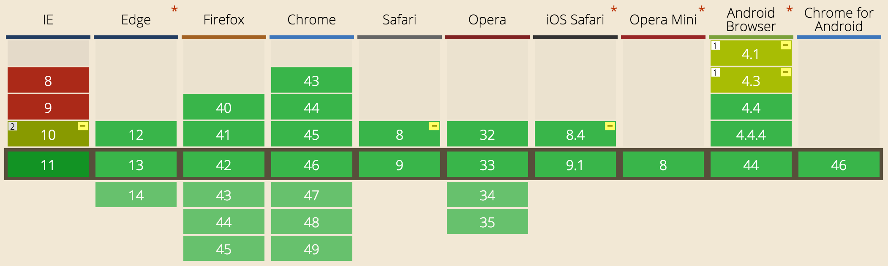

# Flexing your Flexbox muscles 💪🏾

 

## Ben Ilegbodu

 

[@benmvp](https://twitter.com/benmvp) | [benmvp.com](/) | [@confooca](https://twitter.com/confooca)  

 

December 6, 2016  

NOTES:
- My name is Ben Ilegbodu
- Excited to share about the Flexbox module introduced in CSS3
- Posted link to slides on twitter if you want to follow along

/////

<!-- .slide: data-background="url(../../img/giphy/stand-up.gif) no-repeat center" data-background-size="cover" -->

# Stand Up!
<!-- .element: style="-webkit-text-stroke: black 4px" -->

NOTES:
- But first, would like everyone to stand up!
- Let's do some wall sits
- Let's roll our shoulders
- Let's stretch our arms
- Now turn to your neighbors, introduce yourself & say hi
- You don't realize it, but I just tricked you
- Now you can't say that you didn't get anything out of my talk
- You at least got two things:
- Exercise & and met some people you didn't know
- But hopefully you'll get more out of the talk!

=====

# Building linear layouts in CSS has been hard
<!-- .element: class="statement" -->

NOTES:
- HTML was originally designed for displaying text-based documents like papers or articles
- Wasn't made for advanced layout
- We've had CSS positioning, but that assumes that you have fixed dimensions or locations

/////

# Tables

/////

# Floats

/////

# Inline-block

/////

# Solution: Flexbox Layout Module
<!-- .element: class="statement" -->

NOTES:
- Thankfully the CSS flexible box layout module, aka Flexbox, enables us to elegantly solve our layout problems

=====

ben-ilegbodu.json

	

		<pre class="large"><code class="lang-json">
{
  "name": "Ben Ilegbodu",
  "priorities": [
    "Jesus", "family", "work"
  ],
  "location": "Pittsburg, CA",
  "work": "@Eventbrite",
  "role": "Frontend Eng Mgr",
  "hobbies": [
    "basketball", "DIY", "movies"
  ]
}
			</code></pre>
	

	

		
	

NOTES:
_[1 minute]_

/////

<!-- .element: style="border: 0; background: none; margin: 0; box-shadow: none;" -->

NOTES:
- Currently a Senior UI Engineer and Frontend Platform Manager at Eventbrite
- Eventbrite is an online ticketing & events platform
- Many conferences use it for registration
- I work on the Frontend Platform team and right now we're in the midst of a transition from Backbone/Marionette to React
- Python/Django backend, but using a Node daemon to render React components server-side

=====

# Flexible Layout Module

> The main idea behind the **flex layout** is to give the container the ability to alter its items' width/height (and order) to best fill the available space (mostly to accommodate to all kind of display devices and screen sizes). A flex container expands items to fill available free space, or shrinks them to prevent overflow.

~Chris Coyer ([Css-Tricks](https://css-tricks.com/snippets/css/a-guide-to-flexbox/))

NOTES:

The main idea behind flexbox is to give the container the ability to alter its items' dimensions to best fill the available space in responsive design. A flex container expands items to fill available free space, or shrinks them to prevent overflow.

=====

# Containers

=====

# Items

=====

# Flexbox layout module

	

		<h3>Container</h3>

		<ul>
			<li><code>display</code></li>
			<li><code>justify-content</code></li>
			<li><code>align-items</code></li>
			<li><code>flex-direction</code></li>
			<li><code>flex-wrap</code></li>
			<li><code>align-content</code></li>
		</ul>
	

	

		<h3>Items</h3>

		<ul>
			<li><code>align-self</code></li>
			<li><code>order</code></li>
			<li><code>flex-grow</code></li>
			<li><code>flex-shrink</code></li>
			<li><code>flex-basis</code></li>
		</ul>
	

=====

# Solved by Flexbox

> Flexbox just does what I want it to do...

~Ben Ilegbodu

/////

# Grid systems

https://philipwalton.github.io/solved-by-flexbox/demos/grids/

/////

# Vertical centering

https://philipwalton.github.io/solved-by-flexbox/demos/vertical-centering/

/////

# Sticky footer

https://philipwalton.github.io/solved-by-flexbox/demos/sticky-footer/

/////

# Media object

https://philipwalton.github.io/solved-by-flexbox/demos/media-object/

/////

# Input add-ons

https://philipwalton.github.io/solved-by-flexbox/demos/input-add-ons/

/////

# Holy grail layout

https://philipwalton.github.io/solved-by-flexbox/demos/holy-grail/

=====

## Browser support

IE10+, Edge, Chrome, Firefox, Opera, Safari 8+, Android 4.1+, iOS

http://caniuse.com/#feat=flexbox

NOTES:
- Not supported in IE8 or IE9
- But those should be dead or dying soon

=====

# Looking ahead

/////

# Grid

/////

  <!-- .element: style="width: 300px" -->  
Rachel Andrew

 

[<h2>The New CSS Layout</h2>](/)

Tomorrow @ 10am in Pavilion A

/////

# Shapes

=====

[Flexbox layout module specification](http://www.w3.org/TR/css3-flexbox/)

/////

[A Complete Guide to Flexbox](https://css-tricks.com/snippets/css/a-guide-to-flexbox/)

/////

[Solved by Flexbox](http://philipwalton.github.io/solved-by-flexbox/)

/////

[Flexbox Patterns](http://www.flexboxpatterns.com/home)

/////

[Flexbox froggy](http://flexboxfroggy.com/)

/////

[Flexbox defense](http://www.flexboxdefense.com/)

=====

<!-- .element: style="width: 60%" -->

/////

<!-- .element: style="width: 100%;border: 0; background: none; margin: 0; box-shadow: none;" -->

NOTES:
- Vance
- Jesse
- Amanda

/////

<!-- .element: style="border: 0; background: none; margin: 0; box-shadow: none;" -->

/////

# YOU!

NOTES:
- It's my hope that, the main reason I do this, is so you can feel excited & confident to start using ES6 syntax in your code to make it clearer and more succinct
- Any feedback would be appreciated!

=====

# THANKS!

<!-- .element: style="width: 75%" -->

NOTES:

/////

# Questions?

 

## Ben Ilegbodu

[benmvp.com](/) | [@benmvp](https://twitter.com/benmvp) | [ben@benmvp.com](mailto:ben@benmvp.com)

 

### _Sweet ES6_, Tomorrow @ 4pm in Fontaine F

 

Ask me anything! [benmvp.com/ama](http://www.benmvp.com/ama/)

NOTES:
- Slides are available on Twitter
- Ask questions on Twitter, via email or AMA!
