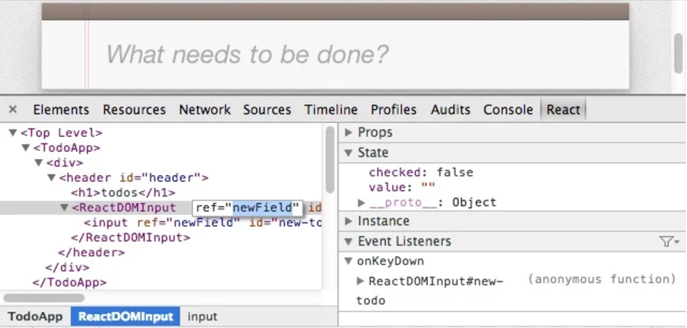

# Navigating the React Ecosystem

<br />

## Ben Ilegbodu

<br />

[@benmvp](https://twitter.com/benmvp) | [benmvp.com](/) | [@connect_js](https://twitter.com/connect_js)  

<br />

October 21, 2016  

NOTES:
- My name is Ben Ilegbodu
- Posted link to slides on twitter if you want to follow along

=====

ben-ilegbodu.json

<div style="display:flex">
	<div style="flex:0 0 50%;">
		<pre class="large"><code class="lang-json">
{
  "name": "Ben Ilegbodu",
  "priorities": [
    "Jesus", "family", "work"
  ],
  "location": "Pittsburg, CA",
  "work": "@Eventbrite",
  "role": "Frontend Eng Mgr",
  "hobbies": [
    "basketball", "DIY", "movies"
  ]
}
			</code></pre>
	</div>
	<div style="flex:0 0 50%;">
		
	</div>
</div>

NOTES:
_[1 minute]_

/////


<!-- .element: style="border: 0; background: none; margin: 0; box-shadow: none;" -->

NOTES:
- Currently a Frontend Engineering Manager at Eventbrite
- Eventbrite is an online ticketing & events platform
- Many conferences & events use it for registration
- I work on our Frontend Platform team and we're wrapping up a huge push to transition from Backbone/Marionette to React
- But I've been in the industry for a while now

=====

## In the beginning...

```html
<html>
    <head>
        <title>My Awesome site!</title>
        <link rel="styles.css" />
        <script src="script.js"></script> <!-- in the <head>! -->
    </head>
    <body>
        <!-- Lots o' markup -->
    </body>
</html>
```
<!-- .element: class="large" -->

NOTES:
- When I first started building websites they looked much like this
- Pretty much all markup with a little bit of CSS and even less JavaScript
- Scripts were vanilla JS (no `jQuery`) and were still in the `<head>`

/////


<!-- .element: style="width: 75%;background:white;" -->

NOTES:
- And we could get away with targeting specific versions of specific browsers

/////


<!-- .element: style="width: 75%;" -->

Yahoo!, 2001

NOTES:
- And for the most part, company websites were built the same way
- You could actually read their source and understand
- No minification nor obfuscation
- No DevTools so it was the primary way of learning

/////


<!-- .element: style="width: 75%;" -->

Yahoo!, 2016

NOTES:
- Company websites started getting more complex as browsers got more advanced
- We realized we could replace Flash w/ web code
- Started building SPAs w/ AJAX; whole Web 2.0 craze

/////


<!-- .element: style="width: 75%;border: 0; background: none; margin: 0; box-shadow: none;" -->

NOTES:

- At first we used used jQuery, but we quickly realized that wasn't enough for our needs
- Still had to write a lot of JS

/////

<div style="display:flex;align-items:center;justify-content:space-between;margin-bottom:5%">
	<div style="flex:0 0 33%;">
        
    </div>
	<div style="flex:0 0 33%;">
        
    </div>
	<div style="flex:0 0 33%;">
        
    </div>
</div>

["walled gardens"](https://www.nczonline.net/newsletter/archive/fcdd7d1cc5/) ~Nicholas C. Zakas

NOTES:
- First came the full-fledged JavaScript frameworks
- Nicholas C. Zakas calls them “walled gardens”
- Back then: YUI
- Now: Angular & Ember
- But folks started feeling like this frameworks were too large & inflexible
- They were easy to get started with, but hard to configure to suite your needs

/////

## Micro Libraries


<!-- .element: style="width: 45%;border: 0; background: none; margin: 0; box-shadow: none;" class="fragment" -->

NOTES:
- A huge movement towards micro libraries instead
- Instead of a full framework, have micro-libraries that are added together to create the architecture you need
- Positives: Get a lot of control, so you can pick and choose different pieces suited specifically to your needs.
- Negatives: Big upfront cost of evaluating each of the pieces. You need to know the pieces in the first place!
- React is such a micro-library.

=====

## React ecosystem

## image/diagram of ecosystem

NOTES:
- If you're new to React you might hear that on top of learning React, you need to know ES6, Redux, inline styles, server-side rendering, etc.
- It can be so overwhelming
- So I want to walk through the different "levels" in the React ecosystem so you can get an idea of how to prioritize what to learn

=====

## image/diagram of ecosystem

## Level 0 - React

NOTES:
- At the core of this ecosystem obviously is React

/////

<div style="display:flex;align-items:center;justify-content:space-around;">
    
    <div>
		<h2><a href="https://facebook.github.io/react/docs/top-level-api.html">Narrow API</a></h2>
		<h2><a href="https://facebook.github.io/react/docs/reconciliation.html">Virtual DOM</a></h2>
		<h2><a href="https://facebook.github.io/react/docs/jsx-in-depth.html">Declarative JSX</a></h2>
        <h2><a href="https://facebook.github.io/react/docs/interactivity-and-dynamic-uis.html#components-are-just-state">Uni-directional</a></h2>
		<h2><a href="https://facebook.github.io/react/docs/reusable-components.html#stateless-functions">Functional & Reactive</a></h2>
    </div>
</div>

NOTES:
- Learn React and learn it _really_ well
- React is highly functional & reactive with a uni-directional data flow
- If you're used to MVC with Backbone or Ember, it'll take some time to wrap your head around the concepts
- Then of course there's JSX syntax
- Ensuring that you're fully leveraging the Virtual DOM and not directly manipulating DOM nodes takes time
- But thankfully the API is really narrow so there's not that much learn
- More about _how_ as opposed to _what_
- You can build a lot of great UIs with just JSX & the React API

/////

## Imperative jQuery

```html
<div>
	<input type="text" class="valueBox" value="0" />
	<button class="btnUp">+</button>
</div>
```
<!-- .element: class="large" -->

```js
$('.btnUp').click(function() {
	var $valueBox = $('.valueBox'),
		currentValue = parseInt($valueBox.val(), 10);

	$valueBox.value(currentValue + 1);
});
```
<!-- .element: class="large" -->

NOTES:
- For simple task, imperative code is easy to follow

/////

## Declarative React

```js
export default class Incrementer extends React.Component {
  state = {value: 0}

  _handleClick() {
	this.setState({value: this.state.value + 1});
  }

  render() {
	return (
	  <div>
		<input type="text" value={this.state.value} />
		<button onClick={this._handleClick.bind(this)}>+</button>
	  </div>
    );
  }
}
```
<!-- .element: class="large" -->

NOTES:
- Combining the markup with the JavaScript
- Updating state causes an optimized re-render via Virtual DOM
- As the UI gets more sophisticated React will scale much better

/////


<!-- .element: style="width: 75%;" -->

[React official tutorial](https://facebook.github.io/react/docs/tutorial.html) app

NOTES:
- With the official React tutorial you can learn how to use React by including a couple of script tags
- It teaches all the core concepts
- It's written in ES5, so you don't even have to worry about having to transpile ES6
- However...

=====

## image/diagram of ecosystem

## Level 1 - JavaScript

NOTES:
- React IMO is even easier to write with ES6+
- Outside of the JSX syntax, React is just JavaScript, so learning ES6+ makes writing it easier
- Chances are if you learn React, you're gonna learn it with some ES6+ concepts

/////

## Useful ES2015+ features w/ React

- Modules
- Classes
- Spread operator
- Destructuring
- Block scoping
- Arrow functions
- Object literal shorthand
- and more...

NOTES:
- Let's take a super quick look at some features

/////

```js
_handleSubmit(e) {
    e.preventDefault();

    let author = this.state.author;
    let text = this.state.text;

    if (!text || !author) {
        return;
    }

    this.props.onCommentSubmit({author: author, text: text});
    this.setState(INITIAL_STATE);
}
```
<!-- .element: class="large" -->

NOTES:
- Back to our code using `let`
- You will see that we're pulling out `author` & `text` from `this.state` and assigning to variables of the same name

/////

Single assignment statement + object literal shorthand!

```js
_handleSubmit(e) {
    e.preventDefault();

    let {author, text} = this.state;

    if (!text || !author) {
        return;
    }

    this.props.onCommentSubmit({author, text});
    this.setState(INITIAL_STATE);
}
```
<!-- .element: class="large" -->

NOTES:
- With destructuring we can combine the two statements into one
- Also using object literal shorthand!

/////

Object destructuring!

```js
// before
let author = this.state.author;
let text = this.state.text;

// after
let {author, text} = this.state;
```
<!-- .element: class="large" -->

```js
// before
let authorName = this.state.author;
let fullText = this.state.text;

// after
let {author: authorName, text: fullText} = this.state;
```
<!-- .element: class="large" -->

NOTES:
- We can also create a differently named variable

/////

Named parameters + arrow functions!

```js
// before
function MyComponent(props) {
    return (
        <div style={props.style}>{props.content}</div>
    );
}

// after
const MyComponent = ({style, content}) => (
    <div style={style}>{content}</div>
);
```
<!-- .element: class="large" -->

NOTES:
- If you've got a stateless function you can immediately destructure `props` into the properties you need

/////

## [React + ES.next = ♥](https://www.youtube.com/watch?v=Fs4bJr1b7UU&list=PLQ0rErbcJANon4Dyy32o2EZnhHr-VWqhL&index=3)

<iframe width="1333" height="750" src="https://www.youtube.com/embed/Fs4bJr1b7UU?list=PLQ0rErbcJANon4Dyy32o2EZnhHr-VWqhL" frameborder="0" allowfullscreen></iframe>

### Front Porch Austin 2016

NOTES:
- I gave a talk call _React + ES.next = ♥_ at Front Porch Austin earlier this year
- What I just talked about was just a small snippet of all the different features
- Feel free to watch the video (not now)

=====

## image/diagram of ecosystem

## Level 2 - Tooling

NOTES:
- Here's where things start getting a bit gnarly
- There's been a lot of talk about "JavaScript Fatigue" and a lot of it is aimed at the tooling challenge
- I think there problem is that there's so much choice and you need to know how the tools work before you can get up and running

/////

## React Dev Tools

Help debug React props & state


<!-- .element: style="width: 75%;" -->

Available for [Chrome](https://chrome.google.com/webstore/detail/react-developer-tools/fmkadmapgofadopljbjfkapdkoienihi?hl=en) and [Firefox](https://addons.mozilla.org/en-US/firefox/addon/react-devtools/)

NOTES:
- Let's start easy
- The React Dev Tools are super helpful in debugging React props & state
- You just browse the React component tree just like the DOM tree and you can look at the component props as well as the state
- Available for Chrome & Firefox. Sorry Edge users.

/////

## Package managers

Help include & manage helper libraries

<div style="display:flex;align-items:flex-end;justify-content:space-between;margin-top:5%">
	<div style="flex:0 0 30%;">
        <a href="https://www.npmjs.com"></a>
		<a href="https://www.npmjs.com">NPM</a>
    </div>
	<div style="flex:0 0 30%;">
        <a href="https://bower.io"></a>
		<a href="https://bower.io">Bower</a>
    </div>
	<div style="flex:0 0 30%;" class="fragment">
        <a href="https://yarnpkg.com/"></a>
		<a href="https://yarnpkg.com/">Yarn</a> (NEW!)
    </div>
</div>

NOTES:
- Two major players are NPM & Bower
- But pretty much everyone uses NPM
- Never used Bower before, but have seen some older packages that area available on both
- Funniest thing: you install Bower with NPM!

/////

<div style="display:flex;align-items:center;justify-content:space-around;margin-bottom: 5%">
	<div style="flex:0 0 50%;">
		
	</div>
    <div style="flex:0 0 45%;">
        <h2>Offline Mode</h2>
        <h2>Deterministic</h2>
        <h2>Network Performance</h2>
        <h2>Multiple Registries</h2>
        <h2>Network Resilience</h2>
        <h2>Flat Mode</h2>
    </div>
</div>

NOTES:
- Offline Mode: If you've installed a package before, you can install it again without any internet connection.
- Deterministic: The same dependencies will be installed the same exact way across every machine regardless of install order.
- Network Performance: Yarn efficiently queues up requests and avoids request waterfalls in order to maximize network utilization.
- Multiple Registries: Install any package from either npm or Bower and keep your package workflow the same.
- Network Resilience: A single request failing won't cause an install to fail. Requests are retried upon failure.
- Flat Mode: Resolve mismatching versions of dependencies to a single version to avoid creating duplicates.

/////

## Bundlers

Help gather dependencies, transpile ES6+, etc.

<div style="display:flex;align-items:flex-end;justify-content:space-around;margin-top:5%">
	<div style="flex:0 0 18%;">
        <a href="https://webpack.github.io/"></a>
		<a href="https://webpack.github.io/">Webpack</a>
    </div>
	<div style="flex:0 0 18%;">
        <a href="http://browserify.org/"></a>
		<a href="http://browserify.org/">Browserify</a>
    </div>
	<div style="flex:0 0 18%;">
        <a href="http://rollupjs.org/"></a>
		<a href="http://rollupjs.org/">Rollup</a>
    </div>
	<div style="flex:0 0 18%;">
        <a href="http://jspm.io/"></a>
		<a href="http://jspm.io/">JSPM</a>
    </div>
    <div style="flex:0 0 18%;">
        <a href="http://requirejs.org/"></a>
		<a href="http://requirejs.org/">RequireJS</a> (no!)
    </div>
</div>

NOTES:
- This is space has a lot of players
- Webpack is the prevailing bundler right now; it just came on the same 2 years ago w/ much fanfare
- Browserify came before and was the main bundler, but as it's name states, it focused on the browser
- Rollup seems to be the up-and-comer that lots of folks are excited about now. I think it has to do w/ "Webpack fatigue"
- It works specifically with ES6 modules and has a "tree-shaking" feature that results in less generated code
- JSPM is another option that...
- RequireJS is the original, but just isn't well suited at all for modern web development practices
- Haven't used Browserify or Rollup, used Webpack & RequirejS heavily, used JSPM once in a workshop
- I'd say go with Webpack, espeically because of `webpack-dev-server`
- It's at this step where the "JavaScript fatigue" really kicks in. Your typical JS developer doesn't want to or know how to configure these bundlers

/////

## Rollup Tree-Shaking

<div style="display:flex;justify-content:space-between;margin-top:1%">
	<div style="flex:0 0 48%;">
		ES2015 modules go in...
		<pre><code class="lang-js">// math.js

// This function isn't used anywhere, so
// Rollup excludes it from the bundle...
export function square(x) {
	return x \* x;
}

// This function gets included
export function cube(x) {
	return x \* x \* x;
}
		</code></pre>

		<pre><code class="lang-js">// main.js
import {cube} from './maths.js';

console.log(cube(5)); // 125
		</code></pre>
	</div>
	<div style="flex:0 0 48%;">
		...bundle comes out
		<pre><code class="lang-js">// This function isn't used anywhere, so
// Rollup excludes it from the bundle...

// This function gets included
function cube(x) {
	return x \* x \* x;
}

console.log(cube(5)); // 125
		</pre>
	</div>
</div>

NOTES:
- With Rollup's tree-shaking functions in a reference module that aren't used don't get bundled

/////

## Simple Webpack Configuration

```js
// webpack.config.js
module.exports = {
	entry: [
        'webpack-dev-server/client?http://localhost:8080',
        'webpack/hot/only-dev-server',
        './src/index'
    ],
    output: {
        path: path.join(__dirname, 'src/dist'),
        filename: 'bundle.js'
    },
    module: {
        loaders: [
            {
                test: /\.js?$/,
                loader: 'babel',
                include: path.join(__dirname, 'src')
            }
        ]
    }
}
```

NOTES:
- Here's an example webpack config
- It will transpile ES2015+ and bundle into `bundle.js`
- But I'm also running a webpack dev server with hot reloading

/////

## Task runners

Help execute shell commands, generate files, etc.

<div style="display:flex;align-items:flex-end;justify-content:space-around;margin-top:5%">
	<div style="flex:0 0 20%;">
        <a href="http://gruntjs.com/"></a>
		<a href="http://gruntjs.com/">Grunt</a>
    </div>
	<div style="flex:0 0 20%;">
        <a href="http://gulpjs.com/" style="display:block"></a>
		<a href="http://gulpjs.com/">Gulp</a>
    </div>
	<div style="flex:0 0 20%;">
        <a href="nav-react.html"></a>
		<a href="nav-react.html">Burp</a>
    </div>
	<div style="flex:0 0 20%">
        <a href="http://www.benmvp.com"></a>
		<a href="https://docs.npmjs.com/misc/scripts">NPM</a>
    </div>
</div>

NOTES:
- Build files, run shell scripts, etc.
- Grunt was the original & dominant
- Then because grunt files were unmanageable
- So gulp approached it with streams in a functional way
- But with "building fatigue" and the fact that webpack could do so much of this for us
- NPM scripts have lately become the rage. Essentially wrappers around command line calls
- If things are simple, use npm scripts.
- If things are complex, use gulp since it's functional

/////

## NPM Scripts

```json
{
  "scripts": {
    "start": "webpack-dev-server --hot --inline --open",
    "build": "webpack --progress --colors",
    "eslint": "eslint .",
    "lint": "npm run scss-lint && npm run eslint",
    "scss-lint": "scss-lint .",
	"test": "mocha tests/*.spec.js",
	"validate": "npm run lint && npm run test"
  }
}
```
<!-- .element: class="large" -->

```
$> npm run validate
```
<!-- .element: class="large" -->

NOTES:
- For something simple like this, NPM scripts are great!
- But I have some package.json files that have 25+ scripts that generate files, etc
- In that case, and actual build system like gulp makes sense
- But it's good to always have NPM scripts to abstract the build system
- So if things change underneath the commands the user calls stay the same
- Speaking of linting...

/////

## Static Analyzers

Help catch errors in written code before runtime

<div style="display:flex;align-items:flex-end;justify-content:space-around;margin-top:5%">
	<div style="flex:0 0 30%;">
        <a href="http://eslint.org/"></a>
		<a href="http://eslint.org/">ESLint</a>
    </div>
	<div style="flex:0 0 30%;">
        <a href="https://flowtype.org/" style="display:block"></a>
		<a href="https://flowtype.org/">Flow</a>
    </div>
	<div style="flex:0 0 30%;">
        <a href="https://www.typescriptlang.org/"></a>
		<a href="https://www.typescriptlang.org/">TypeScript</a>
    </div>
</div>

NOTES:
- The static analyzers help you catch errors in your code before it ever executes
- ESLint: originally just for stylistic code preferences but can catch common errors including in JSX
- Flow & Typescript are both static type checkers
- Flow is exclusively for type checking
- TypeScript is a superset of JavaScript that includes type checking plus future language constructs
- It introduced classes before they were in ES2015. It has interfaces with JS does not
- I like the idea of static type-checking, but TypeScript might be too far into the C#/Java realm
- I haven't used Flow yet, but hoping it can be happy medium

/////

## Flow type inference

```js
/* @flow */
const foo = (x) => (
  x * 10
);
foo('Hello, world!');
```
<!-- .element: class="large" -->

```
$> flow
3:   x * 10
     ^ string. This type is incompatible with
3:   x * 10     
     ^ number
```
<!-- .element: class="large" -->

NOTES:
- Flow supports type inference
- So without even changing the code, it can start providing helpful feedback
- In this case we're trying to multiple a passed string by `10` which is obviously wrong

/////

## Flow type assertions

```js
/* @flow */
const foo = (x: ?number): string => {
  if (x) {
    return x;
  }
  return "default string";
}
```
<!-- .element: class="large" -->

```
$> flow
4:  return x;
           ^ number. Incompatible with the expected return type of
2: const foo = (x: ?number): string => {
                             ^ string
```
<!-- .element: class="large" -->

NOTES:
- If you decide to add type assertions, it can get even smarter

/////

## Tooling Recap

- React Dev Tools
- Package Managers (npm)
- Bundlers (webpack)
- Task Runners (npm)
- Static Analyzers (eslint)

NOTES:
- So this is everything you need to set up your React app
- And I didn't even go into a bunch of nitty gritty details
- This has been the biggest complaint about React. How to get started
- So the fine folks at Facebook did something about it...

/////

## React Create App

Create React apps with no build configuration

```
$> npm install -g create-react-app

$> create-react-app awesome-app

$> cd awesome-app

$> npm start
```
<!-- .element: class="large" style="margin:5% 0" -->

NPM, Webpack, ESLint, and more!

NOTES:
- They created React Create App
- Allows you to bootstrap super quick

/////

## Tooling resources

- [Node Version Manager](https://github.com/creationix/nvm)
- [Awesome npm resources and tips](https://github.com/sindresorhus/awesome-npm)
- [Introducing Yarn](https://code.facebook.com/posts/1840075619545360)
- [JSPM vs Webpack](http://ilikekillnerds.com/2015/07/jspm-vs-webpack/)
- [webpack dev server](https://webpack.github.io/docs/webpack-dev-server.html)
- [Flow + React](https://flowtype.org/docs/react.html)
- [React Create App](https://github.com/facebookincubator/create-react-app)

NOTES:
- Here are some miscellaneous resources regarding the tools we talked about

=====

## image/diagram of ecosystem

## Level 3 - Styling

NOTES:
- Let's talking about styling because visuals are just as important as interaction
- There are _at least_ 4 ways to tackle the styling problem

/////

## Global CSS

Use CSS that exists on the page outside of React

```js
export default class Card extends React.Component {
  render() {
	let {title, imageUrl, message} = this.props;
	return (
	  <div className="card">
	    <h2 className="card__title">{title}</h2>
		
		<p className="card_message">{message}</p>
	  </div>
    );
  }
}
```
<!-- .element: class="large" style="margin:5% 0" -->

NOTES:
- You'd use the Global CSS option if you are transitioning to React and already have your CSS being built by some other process
- You probably already have components that you're transitioning to React so you keep the same "global" CSS classes


/////

## Global CSS

Use CSS that exists on the page outside of React

```css
/* global.scss */

/* lots of other styles before */

.card { }
.card__tile { }
.card__image { }
.card__message { }

/* lots of other styles after */
```
<!-- .element: class="large" style="margin:5% 0" -->

NOTES:
- Use BEM syntax as a convention to prevent name collisions

/////

## Component CSS

Associate React components with CSS snippet

```js
import './Card.scss';
export default class Card extends React.Component {
  render() {
	let {title, imageUrl, message} = this.props;
	return (
	  <div className="card">
	    <h2 className="card__title">{title}</h2>
		
		<p className="card_message">{message}</p>
	  </div>
    );
  }
}
```
<!-- .element: class="large" style="margin:5% 0" -->

NOTES:
- This is the exact same as Global CSS except the CSS is imported by the Component
- Therefore if the Component isn't used the CSS won't be included in the bundle

/////

## Component CSS

Associate React components with CSS snippet

```css
/* Card.scss */

.card { }
.card__tile { }
.card__image { }
.card__message { }
```
<!-- .element: class="large" style="margin:5% 0" -->

NOTES:
- Same BEM style CSS class names convention because eventually it'll all be merged
- If the convention is broken you could still have collisions

/////

## CSS Modules

Automatically scope CSS class names to the component

```js
import css from './Card.scss';
export default class Card extends React.Component {
  render() {
	let {title, imageUrl, message} = this.props;
	return (
	  <div className={css.root}>
	    <h2 className={css.title}>{title}</h2>
		
		<p className={css.message}>{message}</p>
	  </div>
    );
  }
}
```
<!-- .element: class="large" style="margin:5% 0" -->

NOTES:
- Similar to Component CSS except the import of the CSS will return an object lookup with a generated class name

/////

## CSS Modules

Automatically scope CSS class names to the component

```css
/* Card.scss (source) */

.root { }
.tile { }
.image { }
.message { }
```
<!-- .element: class="large" style="margin:5% 0" -->

NOTES:
- No need for naming conventions
- Just name the classes what they are w/o worry about collision

/////

## CSS Modules

Automatically scope CSS class names to the component

```css
/* Card.scss (generated) */

.Card__root___d74hQ { }
.Card__tile___37fhU { }
.Card__image___ndh2e { }
.Card__message___84QQj { }
```
<!-- .element: class="large" style="margin:5% 0" -->

NOTES:
- The generated CSS classes will be unique so there's no way they can collide
- The generated markup will also have the same class names

/////

## Inline styles

Forgo CSS classes in favor of inline styles

```js
const styles = { /* */ };
export default class Card extends React.Component {
  render() {
	let {title, imageUrl, message} = this.props;
	return (
	  <div style={styles.root}>
	    <h2 style={styles.title}>{title}</h2>
		
		<p style={styles.message}>{message}</p>
	  </div>
    );
  }
}
```
<!-- .element: class="large" style="margin:5% 0" -->

NOTES:
- The last option is to just go with inline styles
- As a result there's no chance of class name collisions or unexpected CSS cascade
- There's been a big huge for this in React mainly because of React Native because it doesn't support CSS
- If you want to share components across React & React Native you can't use CSS

/////

## Inline styles

Forgo CSS classes in favor of inline styles
<!-- .element: style="margin-bottom:5%" -->

- Pseudo-classes (i.e. `:hover`)
- Media queries
- Keyframe animations

NOTES:
- Inline styles do have drawbacks
- Things that are pretty simple in CSS become work in JS

/////

## Styling resources

- [CSS Modules](https://github.com/css-modules/css-modules) & [React CSS Modules](https://github.com/gajus/react-css-modules)
- [React-Bootstrap](https://react-bootstrap.github.io/)
- [Material UI](http://www.material-ui.com/#/)
- [React + Foundation](https://react.foundation/)
- [Classnames](https://github.com/JedWatson/classnames)
- [PostCSS](http://postcss.org/) & [`postcss-loader`](https://github.com/postcss/postcss-loader)
- [`style-loader`](https://github.com/webpack/style-loader), [`css-loader`](https://github.com/webpack/css-loader) & [`sass-loader`](https://github.com/jtangelder/sass-loader)

NOTES:
- Here are some miscellaneous resources regarding styling

=====

## image/diagram of ecosystem

## Level 4 - Single-Page Apps (SPAs)

NOTES:
- Moving along to libraries needed for Single Page Apps

/////

## Fetch API

Handle AJAX natively

```js
fetch('http://www.benmvp.com/speaking-engagements.html', {
	method: 'get'
}).then((response) => {
	// do something w/ response
}).catch((err) => {
	// handle error
});
```
<!-- .element: class="large" style="margin:5% 0" -->

NOTES:
- Your favorite "walled garden" JS framework had a mechanism for making AJAX requests
- React does not come with a way because it's just the UI side
- You could use jQuery, but that could lead you to to using it improperly with React
- Instead we're going to a native AJAX implementation, new Fetch API
- Works with ES2015 Promises

/////

## Fetch API

Handle AJAX natively
<!-- .element: style="margin-bottom:5%" -->

- [Using Fetch](https://developer.mozilla.org/en-US/docs/Web/API/Fetch_API/Using_Fetch)
- [ES6 Promises](http://www.benmvp.com/learning-es6-promises/)
- [`window.fetch` polyfill](https://github.com/github/fetch)
- [Load Initial Data via AJAX](https://facebook.github.io/react/tips/initial-ajax.html)

NOTES:
-

/////

## Routing

Keep your UI in sync with the URL
<!-- .element: style="margin-bottom:5%" -->

- [**React Router**](https://github.com/ReactTraining/react-router)
- [uniloc](http://unicornstandard.com/packages/uniloc.html)
- [Aviator](https://github.com/swipely/aviator)
- [...and more](https://github.com/facebook/react/wiki/Complementary-Tools#routing)

NOTES:
- React Router is the obvious choice. Major player

/////

## React Router

```js
// index.js
import About from './modules/About'
import Repos from './modules/Repos'

render((
  <Router history={hashHistory}>
    <Route path="/" component={App}/>
    <Route path="/repos" component={Repos}/>
    <Route path="/about" component={About}/>
  </Router>
), document.getElementById('app'));
```
<!-- .element: class="large" style="margin:5% 0" -->

NOTES:
- Can set up your routes with the same JSX syntax pointing to components

/////

## React Router

```js
// modules/App.js
import {Link} from 'react-router';

export default class App extends React.Component {
  render() {
    return (
      <div>
        <h1>React Router Tutorial</h1>
        <ul role="nav">
          <li><Link to="/about">About</Link></li>
          <li><Link to="/repos">Repos</Link></li>
        </ul>
      </div>
    );
  }
}
```
<!-- .element: class="large" -->

NOTES:
- Then replace `<a>` tags with special `<Link>` tags

=====

## image/diagram of ecosystem

## Level 5 - Testing

NOTES:
- Now the TDD proponents are prolly shaking their fists at me that this is Level 5!

/////

## Testing Frameworks

<div style="display:flex;align-items:flex-end;justify-content:space-around;margin-top:5%">
	<div style="flex:0 0 30%;">
        <a href="https://mochajs.org"></a>
        <a href="http://chaijs.com/"></a>
		<a href="https://mochajs.org">Mocha</a> + <a href="http://chaijs.com/">Chai</a>
    </div>
	<div style="flex:0 0 30%;">
        <a href="https://facebook.github.io/jest/"></a>
		<a href="https://facebook.github.io/jest/" style="display:block">Jest</a>
    </div>
	<div style="flex:0 0 30%;">
        <a href="https://github.com/avajs/ava"></a>
		<a href="https://github.com/avajs/ava">Ava</a>
    </div>
</div>

NOTES:
- Much like how there are many options for JS frameworks, there are many for JS testing frameworks
- Some are micro libraries like Mocha & Chai that do specific things (Chai is just for assertions)
- Others are like Jest (built on Jasmine) that do it all
- Jest also has auto-mocking so dependencies are mocked by default
- There's also Ava that had some buzz around it, but it seems like for React testing it hasn't caught on

/////

## React Renderers

Render React components in an isolated environment

<!-- .element style="margin-bottom:5%" -->

- [`ReactTestUtils`](https://facebook.github.io/react/docs/test-utils.html)
- [**Enzyme**](https://github.com/airbnb/enzyme)
- [`react-test-renderer`](https://github.com/facebook/react/tree/master/packages/react-test-renderer)

NOTES:
- `ReactTestUtils` came first but pretty sad
- Enzyme from Airbnb makes it easy to assert, manipulate, and traverse your React Components' output
- `react-test-renderer` is an experimental React renderer that can be used to render React components to pure JavaScript objects, without depending on the DOM or a native mobile environment
- Combining it with Jest you're able to take a "snapshot" of the render and compare it previous snapshots

/////

## Mocha + Chai + Enzyme

```js
it('should render a checked checkbox if it is selected', () => {
    let wrapper = mount(<Component isSelected={true} />);
    let checkboxWrapper = wrapper.find(Checkbox);

    expect(checkboxWrapper).to.have.prop('isChecked', true);
});
```
<!-- .element class="large" style="margin:5% 0" -->

(See: [`chai-enzyme`](https://github.com/producthunt/chai-enzyme))

/////

## Testing Resources

- [Eventbrite React Testing Best Practices](https://github.com/eventbrite/javascript/blob/master/react/testing.md)
- [Jest 14.0: React Tree Snapshot Testing](https://facebook.github.io/jest/blog/2016/07/27/jest-14.html)
- [Ava + React](https://github.com/avajs/ava/blob/master/docs/recipes/react.md)

=====

## image/diagram of ecosystem

## Level 6 - Performance & SEO

NOTES:
- Chances are if you're building an app of significant size SEO & initial render speed will matter
- Rendering server-side can help both
- This is called "Isomorphic/Universal React"
- Rendering the same components server-side improves initial startup performance because content is already there
- Google includes rendering speed in their ranking algorithm which affects SEO

/////

## Server-side Rendering
<!-- .element style="margin-bottom: 5%" -->

### With a Node back-end...
<!-- .element style="margin-bottom: 2.5%" -->

- [Express](https://expressjs.com/) server
- [`node-fetch`](https://github.com/bitinn/node-fetch) or [`isomorphic-fetch`](https://github.com/matthew-andrews/isomorphic-fetch)
- React Router

/////

## Server-side Rendering
<!-- .element style="margin-bottom: 5%" -->

### Without a Node back-end...
<!-- .element style="margin-bottom: 2.5%" -->

- Django / Rails / .NET server
- Watch _"Isomorphic React w/o Node??"_ talk for details! 😉

NOTES:

=====

## image/diagram of ecosystem

## Level Level 7 - App Data Management

NOTES:
- We're starting to get further out from the center
- Starting to use libraries that work well with React, but not exclusively
- Up until this point, the data for the app probably just was in `state` of top-level component
- Once the data becomes too complex or too many components want to modify that data it's time for a data management library!

/////

## Flux Design pattern


<!-- .element style="width:90%" -->

NOTES:
- If you've seen anything about Flux, no doubt you've seen this diagram
- And if you're like me, the first time it was explained to you, it didn't make sense
- And if you're like me, it didn't make sense the second time either
- I think I had to see it at least 3 or four times until I really got it
- And really it wasn't until I fully understood React, that I could grasp what the Flux pattern was conveying
- That's why I think it's so bad that workshops try to teach React AND Redux at the same time!

/////

## Flux Implementations

Make application state mutations predictable

- [Flux](http://facebook.github.io/flux/)
- [**Redux**](http://redux.js.org/) (+ [`react-redux`](http://redux.js.org/docs/basics/UsageWithReact.html))
- [Reflux](https://github.com/reflux/refluxjs)
- [Alt](http://alt.js.org/)
- [Fluxxor](http://fluxxor.com/)

NOTES:
- At Eventbrite we created our own Flux implementation using Backbone (not that great)

/////

## Immutability
Provide immutable collections for JavaScript

- [Immutable](https://facebook.github.io/immutable-js/)
- [`seamless-immutable`](https://github.com/rtfeldman/seamless-immutable)

<!-- .element="margin-top:5%" -->

NOTES:
- By default, JavaScript arrays, objects and other collections are mutable
- Normally you would just enforce a standard that data cannot be mutated. That's how React works
- This leads to a lot of defensive copying with the spread operator
- Instead you can use a library like Immutable or `seamless-immutable` to have true immutable objects
- Immutable is the big player, another library from Facebook
- Only used it a bit, but found the API a bit cumbersome and then I was constantly going to and from Immutable objects. Don't _really_ want my React components to have to care, just Redux
- `seamless-immutable` is an alternative that has data structures that are backwards-compatible
- The work just like Arrays or Objects except throws errors when you try to mutate and have extra functionality

/////

## `seamless-immutable`

```js
var array = Immutable(["totally", "immutable", {hammer: "no!"}]);

array[1] = "I'm going to mutate you!";
console.log(array[1]); // "immutable"

array[2].hammer = "hm, surely I can mutate this nested object...";
console.log(array[2].hammer); // "no!"

console.log(JSON.stringify(array));
// '["totally", "immutable", {"hammer":"no!"}]'
```
<!-- .element class="large" -->

NOTES:
- Looks and acts just like arrays and objects and can pass to libraries like underscore or lodash

=====


<!-- .element: style="width: 60%" -->

/////


<!-- .element: style="width: 50%;border: 0; background: none; margin: 0; box-shadow: none;" -->

/////


<!-- .element: style="border: 0; background: none; margin: 0; box-shadow: none;" -->

NOTES:

/////

# YOU!

NOTES:
- It's my hope that, the main reason I do this, is so you can feel excited & confident to start using ES6 syntax in your code to make it clearer and more succinct

=====

# THANKS!


<!-- .element: style="width: 60%" -->

NOTES:

/////

# Questions?

<br />

## Ben Ilegbodu

<br />

[benmvp.com](/) | [@benmvp](https://twitter.com/benmvp) | [ben@benmvp.com](mailto:ben@benmvp.com)  
[github/benmvp](https://github.com/benmvp)

<br />

[#RWReact](https://twitter.com/hashtag/RWReact)  
