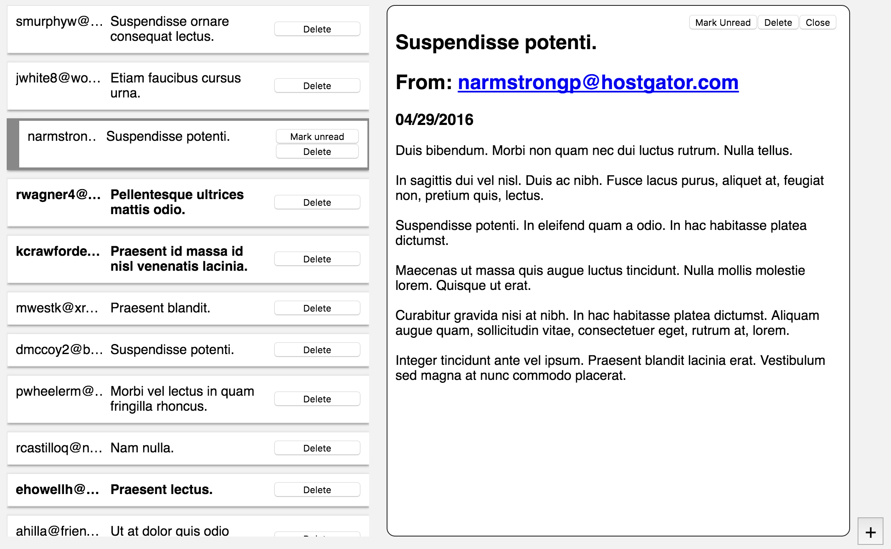
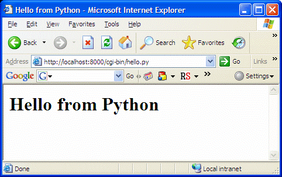
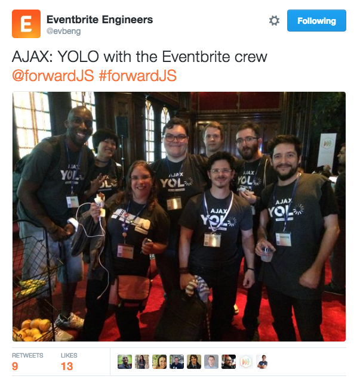
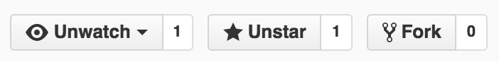

# React Fundamentals Workshop

## Frontend Foundry

### May 26, 2016

  

https://github.com/benmvp/react-workshop

=====

# DEMO

<!-- .element: style="width:50%" -->

/////

## Agenda

1. [JSX & Components](https://github.com/benmvp/react-workshop/blob/master/01-core-components)
1. [Environment setup](https://github.com/benmvp/react-workshop/blob/master/02-env-setup)
1. [Fetching from server](https://github.com/benmvp/react-workshop/blob/master/03-fetch)
1. [Long polling](https://github.com/benmvp/react-workshop/blob/master/04-polling)
1. [Email View](https://github.com/benmvp/react-workshop/blob/master/05-email-view)
1. [Email Form](https://github.com/benmvp/react-workshop/blob/master/06-email-form)
1. [Submit email form](https://github.com/benmvp/react-workshop/blob/master/07-submit-email-form)
1. [Optimistic updating](https://github.com/benmvp/react-workshop/blob/master/08-optimistic-updating)
1. [Delete email](https://github.com/benmvp/react-workshop/blob/master/09-delete-email)
1. [Mark unread/read](https://github.com/benmvp/react-workshop/blob/master/10-mark-unread)
1. [Styling](https://github.com/benmvp/react-workshop/blob/master/11-styling)
1. [Email Form Modal](https://github.com/benmvp/react-workshop/blob/master/12-email-form-modal)
1. [API lib](https://github.com/benmvp/react-workshop/blob/master/13-api-lib)
1. [Action-Reducers](https://github.com/benmvp/react-workshop/blob/master/14-action-reducers)

=====

    
    

        <h2 class="fragment">JS UI Library</h2>
        <h2 class="fragment">Declarative</h2>
        <h2 class="fragment">Reactive</h2>
    

=====

# Web Backstory...

/////

## Pre-AJAX (pre-2005)

    

        <h2 class="fragment">Server-driven</h2>
        <h2 class="fragment">Re-render UX</h2>
        <h2 class="fragment">Inefficient</h2>
    

    

/////

## AJAX!

    
    

        <h2 class="fragment">jQuery 🍜!</h2>
        <h2 class="fragment">DOM state storage</h2>
        <h2 class="fragment">Event-driven UI updates</h2>
    

/////

## MVC

    

        <h2 class="fragment">Code separation</h2>
        <h2 class="fragment">Multiple templates</h2>
        <h2 class="fragment">Multi-directional</h2>
    

    

        
        
        
    

/////

    
    

        <h2 class="fragment">Reactive Components</h2>
        <h2 class="fragment">Virtual DOM</h2>
        <h2 class="fragment">JSX</h2>
        <h2 class="fragment">Composable</h2>
        <h2 class="fragment">Uni-directional</h2>
        <h2 class="fragment">Narrow API</h2>
    

=====

## Diagram Component Hierarchy

<!-- .element: style="width:50%" -->

=====

# Coding Time!

=====

=====

# More functionality

- Animation
- Redux
- Routing
- Form validation
- Server rendering
- Testing

=====

# React at Eventbrite

=====

<!-- .element: style="width:75%" -->

=====

<!-- .slide: data-background="url(../../img/giphy/thanks-zac-efron.gif) no-repeat center" data-background-size="contain"-->

/////

# Questions?

  

## Frontend Foundry

 

https://github.com/benmvp/react-workshop
