<!-- .slide: data-background="url(../../img/giphy/no-no-no-mutombo.gif) no-repeat center" data-background-size="contain" style="background-color:rgba(0,0,0,.25);bottom:0;" -->

# You don't need JavaScript for that!

## Ben Ilegbodu

[@benmvp](https://twitter.com/benmvp) | [benmvp.com](/) | [@SyntaxCon](https://twitter.com/syntaxcon)  

May 7, 2016  

NOTES:
- How many folks here would call themselves web developers?
- How many of you use toolkits/libraries like jQuery?
- The goal of this talk is to highlight ways that you can use HTML & CSS to replace functionality we previously could only accomplish w/ JavaScript
- I'm not hating on JavaScript
  - Giving a talk tomorrow on new functionality added to JS with ES6
  - JavaScript doesn't need to be the hammer for _every_ nail

=====

ben-ilegbodu.json

<div style="display:flex">
	<div style="flex:0 0 50%;">
		<pre class="large"><code class="lang-json">
{
  "name": "Ben Ilegbodu",
  "priorities": [
    "Jesus", "family", "work"
  ],
  "location": "Pittsburg, CA",
  "work": "@Eventbrite",
  "role": "Sr. UI Engineer",
  "hobbies": [
    "basketball", "movies"
  ]
}
			</code></pre>
	</div>
	<div style="flex:0 0 50%;">
		
	</div>
</div>

NOTES:
_[1 minute]_

/////


NOTES:
- Currently a Senior UI Engineer at Eventbrite
- Eventbrite is an online ticketing & events platform
- Many conferences use it for registration
- I work on the Frontend Architecture team and right now we're in the midst of a transition from Backbone/Marionette to React

/////

<!-- .slide: data-background="url(../../img/giphy/james-harden-pot-cook.gif) no-repeat center" data-background-size="contain"-->

NOTES:
- I also absolutely love basketball - both playing & watching
- But enough about me, let's dive into our topic

=====

# Agenda

1. Interactivity
1. Functionality
1. Layout
1. Animation

NOTES:
_[2 minutes]_

- Here's what we'll be talking about today in our session
- We'll look at how we can implement interactivity, functionality, layout & animation
- Without using any JavaScript! (or at least very little)
- The rationale being that if we use HTML/CSS, the browser executes the interaction which will typically be more performant
- This is a lot to cover in less than an hour, so this will be an overview and I'll provide links for more details

=====

# Interactivity

with CSS `:hover`

<br />

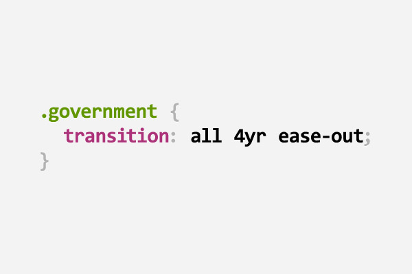

NOTES:
_[3 minutes]_

- Let's start simple looking at interactivity with `:hover`
- This doesn't require any HTML5 or CSS3 fanciness
- Just some fun CSS pseudo-class code
- By the way this pun has nothing to do with our topic. Just fun!
- **_[WATER BREAK]_**

/////

###### Interactivity

## Header navigation example

<iframe src="../../no-js/interactivity.html" style="width:100%;height:82px"></iframe>

NOTES:
- Header navigation menu that enables interactivity using the `:hover` CSS pseudo selector.
- On hover of a menu item:
  - the text goes from dark to light
  - the item background image goes from light to dark
  - the icon color goes from black to orange
  - the icon goes from a "dormant" to "active" state.

/////

###### Interactivity

<iframe src="../../no-js/interactivity.html" style="width:100%;height:82px"></iframe>

Uses an icon font!

NOTES:
_[4 minutes]_

- Use an icon font from Font Awesome instead of traditional image
- Normally you would use `` for images or `background-image` for image sprite
- Icon fonts are fonts just like Arial or Comic Sans, but instead of comprising text characters, they contain custom monochrome image glyphs.
- Icon fonts are awesome because:
  - Super lightweight compared to traditional images (63kb)
  - Can easily change their size, color and any other text property.
- SVG is also making its way to the web with the best of both worlds
  - Full color
  - Still lightweight

/////

###### Interactivity

<iframe src="../../no-js/interactivity.html" style="width:100%;height:82px"></iframe>

```html
<header class="global-header">
  <ul class="header-nav">
    <li class="header-nav-item header-nav-item--home">
      <a class="header-nav-item__link" href="#home">Home</a>
    </li>
    <li class="header-nav-item header-nav-item--search">
      <a class="header-nav-item__link" href="#search">Search</a>
    </li>
    <li class="header-nav-item header-nav-item--cart">
      <a class="header-nav-item__link" href="#cart">Cart</a>
    </li>
    <li class="header-nav-item header-nav-item--me">
      <a class="header-nav-item__link" href="#account">Me</a>
    </li>
  </ul>
</header>
```

[SMACSS](https://smacss.com/): Scalable and Modular Architecture for CSS  
[BEM](https://css-tricks.com/bem-101/): Block, Element, Modifier


NOTES:
_[5 minutes]_

- Using semantic HTML5 `<header>` tag & `<ul>` + `<li>`
- Also using SMACSS + BEM CSS class naming
  - SMACSS: Scalable and Modular Architecture for CSS
  - BEM: Block, Element, Modifier
  - a way to organize CSS and prevent class name collisions
- Element class for all of the items + modifier class for each item

/////

###### Interactivity

<iframe src="../../no-js/interactivity.html" style="width:100%;height:82px"></iframe>

```
.header-nav-item {
  list-style: none;  float: left;
  background: #ddd;  font-size: 28px;  width: 25%;
}
.header-nav-item__link { color: #222; }
```
<!-- .element: class="large" -->

```
.header-nav-item:before {
  font-family: FontAwesome;  font-size: 25px;  color: #222;
}
.header-nav-item--home:before { content: "\f015"; }
.header-nav-item--search:before { content: "\f002"; }
```
<!-- .element: class="large" -->

Custom font via [`@font-face`](https://css-tricks.com/html-for-icon-font-usage/)

NOTES:
_[6 minutes]_

- We set the background of each item to gray & float them to keep them on same line
- We set the link color to black
- The interesting part is the second section defining the CSS for the icons
- Use `:before` pseudo-class to add content to each item
- Set the `font-family` for all of them
- `FontAwesome` web font is defined via `@font-face`
- Set unique content for each item

/////

###### Interactivity

## Hover support

<iframe src="../../no-js/interactivity.html" style="width:100%;height:82px"></iframe>

The JavaScript way:

```js
$('.header-nav-item').hover(
  function() {
	// change background: dark, text: light, image: "active"
  },
  function() {
    // revert background: light, text: dark & image: "dormant"
  }
);
```
<!-- .element: class="large" -->

NOTES:
_[7 minutes]_

- Not sure why you would use JS/jquery but if you're unaware of how to use `:hover` pseudo-class, this might be the only other way
- There's nothing functionally wrong with this approach, but you have to write code to do what the browser can easily do for you
- Plus there's now styling in the JS, which we like to keep separate
- There's a better way!

/////

###### Interactivity

## Hover support

<iframe src="../../no-js/interactivity.html" style="width:100%;height:82px"></iframe>

The CSS way:

```
.header-nav-item:hover { background: #222; }
.header-nav-item:hover .header-nav-item__link { color: #00a8f2; }
```
<!-- .element: class="large" -->

```
.header-nav-item:hover:before { color: #ff8000; }
.header-nav-item--home:hover:before { content: "\f1ad"; }
.header-nav-item--search:hover:before { content: "\f00e"; }
.header-nav-item--cart:hover:before { content: "\f217"; }
.header-nav-item--me:hover:before { content: "\f234"; }
```
<!-- .element: class="large" -->

NOTES:
_[8 minutes]_

- The key is the `:hover` pseudo-class
- We set the background of the item to black on hover
- When we hover over the item we set the color of the link to blue
- We change the color of the icons to orange on hover
  - Notice the double pseuo-classes: `:hover` & `:before`
  - Also change the icons to + versions

/////

###### Interactivity

## `@font-face` Browser support

[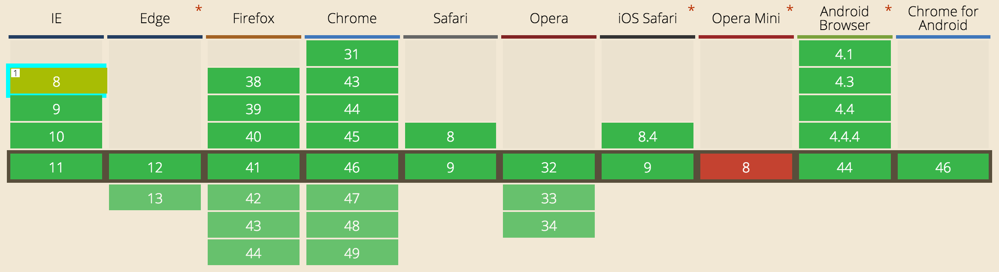](http://caniuse.com/#feat=fontface)

IE8+, Edge, Chrome, Firefox, Opera, Safari 8+, Android 4.1+, iOS

http://caniuse.com/#feat=fontface

NOTES:
_[9 minutes]_

- Mentioned that it uses `@font-face` for custom fonts
- Here is the current browser support

/////

###### Interactivity

[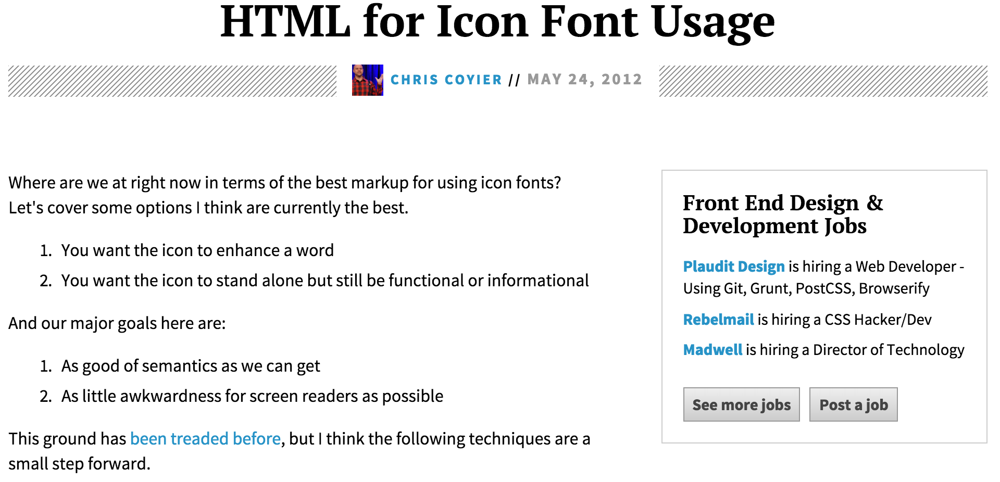](https://css-tricks.com/html-for-icon-font-usage/)

https://css-tricks.com/html-for-icon-font-usage/

NOTES:
- If you want to learn more about the ins & outs of how font icons work, check out this article on CSS-Tricks

/////

<!-- .slide: data-background="url(../../img/giphy/unimpressed-squidward.gif) no-repeat center" data-background-size="contain"-->

NOTES:
- Outside of the icon font stuff there was nothing really new here
- It's all vanilla HTML & CSS
- Some let's jump into some HTML5

=====

# Functionality

with new HTML5 `<input>` types

<br />

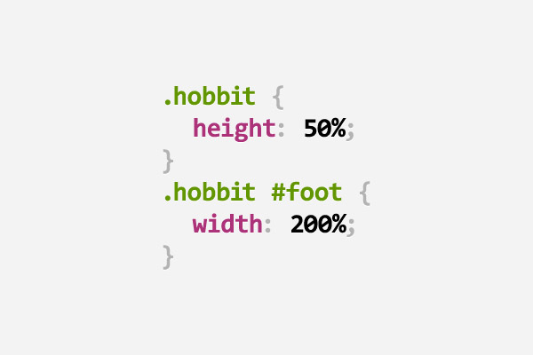

NOTES:
_[10 minutes]_

/////

###### Functionality

<iframe src="../../no-js/functionality.html" style="width:100%;height:660px;"></iframe>

NOTES:
- We'll be working off of this beautiful form example
- Clicking labels focuses field
- Placeholder text where appropriate
- Fancy new fields like date picker, slider, color picker & auto-suggest
- Ability to style required vs. optional fields
- Ability to style valid vs invalid fields
- Spending the rest of our time in this section dissecting this form

/////

###### Functionality

<div style="display:flex;justify-content:space-between;align-items:center;">
  <div style="flex:0 0 45%;">

    <iframe src="../../no-js/functionality.html" style="width:100%;height:660px;"></iframe>

    <p class="fragment">Doesn't even require HTML5 support!</p>

  </div>
  <div style="flex:0 0 52%;">

    <code>&lt;label&gt;</code> &amp; <code>for</code> attribute

    <pre class="large"><code class="lang-html">
<label for="name">Full Name\*:</label>
<input id="name" type="text" />

<label for="email">Email\*:</label>
<input id="email" type="email" />
      </code></pre>

Equivalent JavaScript
    <pre class="large"><code class="lang-js">
$('label').click(function() {
  var inputId = $(this).attr('for');

  $('#' + inputId).focus();
});
      </code></pre>

  </div>
</div>

NOTES:
_[11 minutes]_

- Using the `<label>` tag with the `for` attribute automatically focus field when clicked
- The equivalent JavaScript is simple enough, but unnecessary!
- This doesn't require any HTML5 support **[NEXT]**, you can use this in any browser!
- Personally hate it when I have a tiny checkbox and a long label and i **have** to click the checkbox

/////

###### Functionality

HTML5 `placeholder` attribute

<input type="text" class="input-example" placeholder="Enter URL" />

```html
<input type="text" placeholder="Enter URL" />
```
<!-- .element: class="large" -->
<br />
<br />
Equivalent JavaScript

- `onload`: `placeholder` &#8594; `value` if `value` is empty
- `onfocus`: Clear `value` if it equals `placeholder`
- `onblur`: `placeholder` &#8594; `value` if `value` is empty

NOTES:
- Trying to build a robust JS implementation is tricky
- There have been times I've used sites that have built it themselves and I'll click in and the placeholder text doesn't go away

/////

###### Functionality

`<input>` type `email`

<input class="input-example" type="email" placeholder="Enter email" required />

```html
<input type="email" placeholder="Enter email" required />
```
<!-- .element: class="large" -->
<br />
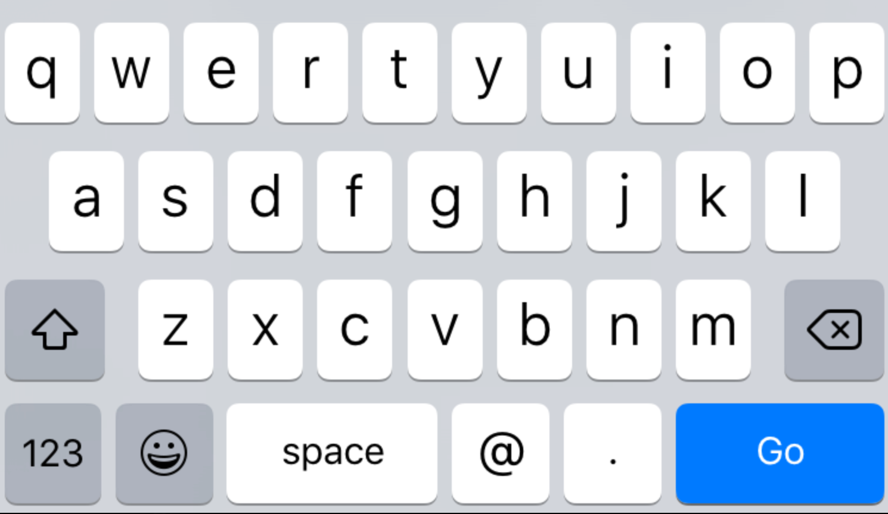<br />
special email-focused software keyboard!

NOTES:
_[12 minutes]_

- Instead of `type="text"`, it's `type="email"`
- Provides email-focused software keyboard where applicable
- Default email validation (more on that later)

/////

###### Functionality

`<input>` type `url`

<input class="input-example" type="url" placeholder="Enter URL" />

```html
<input type="url" placeholder="Enter url" />
```
<!-- .element: class="large" -->
<br />
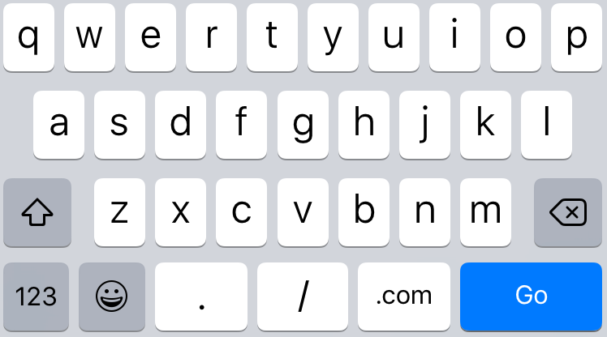<br />
special URL-focused software keyboard!

NOTES:
_[13 minutes]_

- Instead of `type="text"`, it's `type="url"`
- Provides url-focused software keyboard where applicable
- Default url validation (more on that later)

/////

###### Functionality

`<input>` type `number`

<input class="input-example" type="number" min="10" max="48" step="2" />

```html
<input type="number" step="2" min="10" max="48" />
```
<!-- .element: class="large" -->
<br />
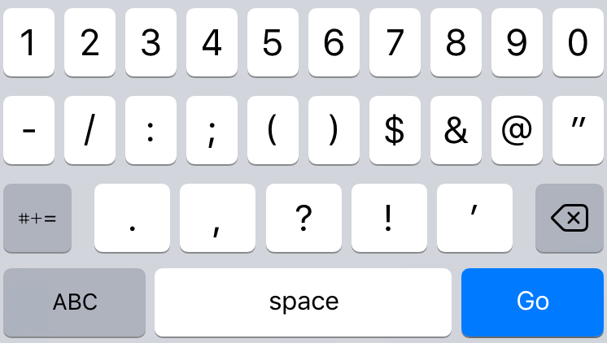<br />
special number-focused software keyboard!

NOTES:
_[14 minutes]_

- Instead of `type="text"`, it's `type="number"`
- Provides number-focused software keyboard where applicable
- `min` & `max` dictate bounds
- `step` dictates up/down arrows as well as validation (no decimals)
- Can't type in non numbers
- Default number validation (more on that later)

/////

###### Functionality

`<input>` type `tel`

<input class="input-example" type="tel" placeholder="###-###-####" />

```html
<input type="tel" placeholder="###-###-####" />
```
<!-- .element: class="large" -->
<br />
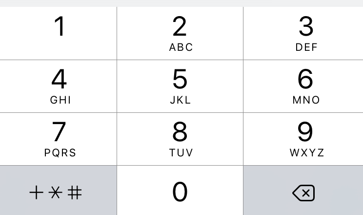<br />
special telephone-focused software keyboard!

NOTES:
_[15 minutes]_

- Instead of `type="text"`, it's `type="tel"`
- Provides telephone-focused software keyboard where applicable
- No validation or character prevention

/////

###### Functionality

`<input>` type `range`
<br />
<br />
<input type="range" placeholder="0 - 10" min="0" max="10" step="1" style="width:660px" />
<br />
<br />
```html
<input type="range" placeholder="0 - 10" min="0" max="10" step="1" />
```
<!-- .element: class="large" -->
<br />
native slider UI!

NOTES:
- Instead of `type="text"`, it's `type="range"`
- Provides native slider UI where applicable
- Default to a text field

/////

###### Functionality

`<input>` type `date`

<input class="input-example" type="date" placeholder="MM/DD/YYYY" pattern="^\d{2}/\d{2}/\d{4}$" />

```html
<input type="date" pattern="^\d{2}/\d{2}/\d{4}$" placeholder="MM/DD/YYYY" />
```
<!-- .element: class="large" -->
<br />
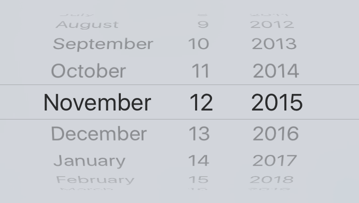<br />
native date picker UI!

NOTES:
_[16 minutes]_

- Instead of `type="text"`, it's `type="date"`
- Provides native date picker UI where applicable
- Use `pattern` & `placeholder` as fallback since not all browsers support the UI

/////

###### Functionality

`<input>` type `color`

<input type="color" class="input-example" placeholder="#XXXXXX" value="#00008b" style="width:250px;height:100px" pattern="#[0-9a-fA-F]{6}" />

```html
<input type="color" value="#00008b" pattern="#[0-9a-fA-F]{6}" placeholder="#XXXXXX" />
```
<!-- .element: class="large" -->
<br />
native color picker UI!

NOTES:
_[17 minutes]_

- Instead of `type="text"`, it's `type="color"`
- Provides native color picker UI where applicable
- Use `pattern` w/ `placeholder` as a fallback since not all browsers support

/////

###### Functionality

`<input>` & `<datalist>`

<input type="text" class="input-example" list="suggested-names" />
<datalist id="suggested-names">
  <option>Simone</option>
  <option>Suzie</option>
  <option>Susane</option>
  <option>Scott</option>
  <option>Simon<option>
  <option>Sully</option>
  <option>Stephanie</option>
  <option>Shelly</option>
</datalist>

```html
<input type="text" list="suggested-names" />
<datalist id="suggested-names">
  <option>Simone</option>     <option>Suzie</option>
  <option>Susane</option>     <option>Scott</option>
  <option>Simon<option>       <option>Sully</option>
  <option>Stephanie</option>  <option>Shelly</option>
</datalist>
```
<!-- .element: class="large" -->
<br />
native auto-suggest UI!

NOTES:
_[18 minutes]_

- Create a `<datalist>` with 0 or more `<option>`s and `id` attribute
- Reference in `<input>` with `list` attribute
- Drop down for all suggestions
- Start typing for matches
- Different than list of suggestions the browser suggests based on forms you've submitted

/////

###### Functionality

### Validation

<div style="display:flex;justify-content:space-between;">
  <div style="flex:0 0 48%;">

<h4>HTML attributes</h4>

<ul>
  <li><code>type</code></li>
  <li><code>required</code></li>
  <li><code>minlength</code></li>
  <li><code>min</code></li>
  <li><code>max</code></li>
  <li><code>step</code></li>
  <li><code>pattern</code> (regex)</li>
</ul>

  </div>
  <div style="flex:0 0 48%;">

<h4>CSS psuedo selectors</h4>

<ul>
  <li><code>:required</code></li>
  <li><code>:optional</code></li>
  <li><code>:valid</code></li>
  <li><code>:invalid</code></li>
  <li><code>:in-range</code></li>
  <li><code>:out-of-range</code></li>
</ul>

  </div>
</div>

NOTES:
_[19 minutes]_

/////

###### Functionality

<div style="display:flex;justify-content:space-between;align-items:center;">
  <div style="flex:0 0 48%;">
    <iframe src="../../no-js/functionality.html" style="width:100%;height:660px;"></iframe>
  </div>
  <div class="fragment" style="flex:0 0 48%;">
    <h4>JavaScript</h4>
    <pre class="large"><code data-trim>
$('.form').submit(function(e) {
  $(this).addClass('form-submitted');
  if (!this.checkValidity()) {
    e.preventDefault();
  }
});
	</code></pre>

    <h4>CSS</h4>
    <pre class="large"><code data-trim>
.form-submitted input:valid {
  background: #ccff90;
}
.form-submitted input:invalid {
  background: #ff8a80;
}
	</code></pre>
  </div>
</div>

NOTES:
_[20 minutes]_

- Put everything together and we get our original form
- Confession: I'm using a little bit of JS
  - `:valid` and `:invalid` selectors apply even before first form submit
  - Using JS to add a class to the form after first submit so form doesn't load w/ errors
  - Essentially applying CSS state via JavaScript
  - Going to cover this concept in detail in the Animation section

/////

###### Functionality


<div style="display:flex;justify-content:space-between;align-items:center;">
  <div style="flex:0 0 48%;">
    <iframe src="../../no-js/functionality.html" style="width:100%;height:660px;"></iframe>
  </div>
  <div style="flex:0 0 48%;">
    <h4>Pros</h4>

    <ul>
      <li>Native UIs</li>
      <li>Type-focused software keyboards</li>
      <li>Form element validation for _free_</li>
    </ul>

    <br /><br />
    <h4>Cons</h4>

    <ul>
      <li>Minimal style control of UI elements</li>
      <li>Not supported in old browsers</li>
      <li>Cross-element validation</li>
    </ul>
  </div>
</div>

NOTES:
_[21 minutes]_

/////

###### Functionality

[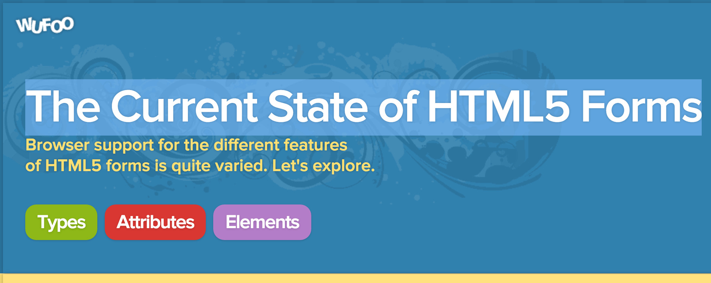](http://www.wufoo.com/html5/)

http://www.wufoo.com/html5/

NOTES:
- Wufoo has a extremely detailed posts about all of the HTML5 input types and attributes
  - Browser support too

=====

# Layout

with CSS3 `display:flex`

<br />

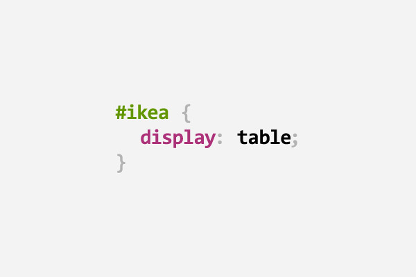

NOTES:
_[22 minutes]_

/////

###### Layout

## Linear layout

<div class="container-example" style="justify-content:space-between;align-items:flex-end;margin-bottom:80px">
	<div class="item-example item-example-1" style="order:3">11111111111<br>11111111111<br>11111111111</div>
	<div class="item-example item-example-2" style="order:1">2222222<br>2222222<br>2222222<br>2222222</div>
	<div class="item-example item-example-3" style="order:4;align-self:stretch">333333333333333333</div>
	<div class="item-example item-example-4" style="order:2">4444444444444<br>4444444444444</div>
</div>

```
<div class="container">
  <div class="item item-1">11111111111<br>11111111111<br>11111111111</div>
  <div class="item item-2">2222222<br>2222222<br>2222222<br>2222222</div>
  <div class="item item-3">333333333333333333</div>
  <div class="item item-4">4444444444444<br>4444444444444</div>
</div>
```
<!-- .element: class="large" -->

NOTES:
- In this section we want to build the following horizontal layout given this HTML markup
  - Items are evenly spaced
  - Bottom-aligned, except for last which is stretched top to bottom
  - Reordered
- HTML was originally designed for displaying text-based documents like papers or articles
- Wasn't made for advanced layout
- We've had CSS positioning, but that assumes that you have fixed dimensions or locations
- Prior to CSS3 all we've had to use is `float:left` or `display:inline-block`
- So we'd have to result to some amount of JavaScript to get this sort of layout

/////


## Flexbox

> The main idea behind the **flex layout** is to give the container the ability to alter its items' width/height (and order) to best fill the available space (mostly to accommodate to all kind of display devices and screen sizes). A flex container expands items to fill available free space, or shrinks them to prevent overflow.

~Chris Coyer ([Css-Tricks](https://css-tricks.com/snippets/css/a-guide-to-flexbox/))

NOTES:

The main idea behind flexbox is to give the container the ability to alter its items' dimensions to best fill the available space in responsive design. A flex container expands items to fill available free space, or shrinks them to prevent overflow.

/////

###### Layout

### `display` (container)

<div class="container-example" style="margin-bottom:80px">
	<div class="item-example item-example-1">11111111111<br>11111111111<br>11111111111</div>
	<div class="item-example item-example-2">2222222<br>2222222<br>2222222<br>2222222</div>
	<div class="item-example item-example-3">333333333333333333</div>
	<div class="item-example item-example-4">4444444444444<br>4444444444444</div>
</div>

```
.container {
	display: flex;
}
```
<!-- .element class="large" -->

<a href="javascript:$('section.stack.present section.present .container-example').css('display', 'block')">
	<em><code>block</code></em></a> |
<a href="javascript:$('section.stack.present section.present .container-example').css('display', 'flex')">
	<strong><code>flex</code></strong></a> |
<a href="javascript:$('section.stack.present section.present .container-example').css('display', 'inline-flex')">
	<code>inline-flex</code></a>

NOTES:
_[24 minutes]_

- So let's go through all of the flexbox properties
- It all starts with `display:flex` (or `display:inline-flex`) on the container
- It enables a flex context for all its direct children.

/////

###### Layout

### `justify-content` (container)

<div class="container-example" style="margin-bottom:80px;justify-content:space-between">
	<div class="item-example item-example-1">11111111111<br>11111111111<br>11111111111</div>
	<div class="item-example item-example-2">2222222<br>2222222<br>2222222<br>2222222</div>
	<div class="item-example item-example-3">333333333333333333</div>
	<div class="item-example item-example-4">4444444444444<br>4444444444444</div>
</div>

```
.container {
	justify-content: space-between;
}
```
<!-- .element class="large" -->

<a href="javascript:$('section.stack.present section.present .container-example').css('justify-content', 'center')">
	<code>center</code></a> |
<a href="javascript:$('section.stack.present section.present .container-example').css('justify-content', 'flex-end')">
	<code>flex-end</code></a> |
<a href="javascript:$('section.stack.present section.present .container-example').css('justify-content', 'flex-start')">
	<em><code>flex-start</code></em></a> |
<a href="javascript:$('section.stack.present section.present .container-example').css('justify-content', 'space-around')">
	<code>space-around</code></a> |
<a href="javascript:$('section.stack.present section.present .container-example').css('justify-content', 'space-between')">
	<code><strong>space-between</strong></code></a>

NOTES:
_[25 minutes]_

- We can then set `justify-content: space-between` to evenly space
- `justify-content` helps distribute extra free space left over when either all the flex items on a line are inflexible, or are flexible but have reached their maximum size.
- Options:
  - `center`: items are centered along the line
  - `flex-end`: items are packed toward to end line
  - `flex-start`: (default) items are packed toward the start line
  - `space-around`: items are evenly distributed in the line with equal space around them.
  - `space-between`: items are evenly distributed in the line; first item is on the start line, last item on the end line

/////

###### Layout

### `align-items` (container)

<div class="container-example" style="margin-bottom:80px;justify-content:space-between;align-items:flex-end">
	<div class="item-example item-example-1">11111111111<br>11111111111<br>11111111111</div>
	<div class="item-example item-example-2">2222222<br>2222222<br>2222222<br>2222222</div>
	<div class="item-example item-example-3">333333333333333333</div>
	<div class="item-example item-example-4">4444444444444<br>4444444444444</div>
</div>

```
.container {
	align-items: flex-end;
}
```
<!-- .element class="large" -->

<a href="javascript:$('section.stack.present section.present .container-example').css('align-items', 'baseline')">
	<code>baseline</code></a> |
<a href="javascript:$('section.stack.present section.present .container-example').css('align-items', 'center')">
	<code>center</code></a> |
<a href="javascript:$('section.stack.present section.present .container-example').css('align-items', 'flex-end')">
	<strong><code>flex-end</code></strong></a> |
<a href="javascript:$('section.stack.present section.present .container-example').css('align-items', 'flex-start')">
	<code>flex-start</code></a> |
<a href="javascript:$('section.stack.present section.present .container-example').css('align-items', 'stretch')">
	<em><code>stretch</code></em></a>

NOTES:
_[26 minutes]_

- We can then set `align-items: flex-end` to align at the bottom
- `align-items` defines the default behavior for how flex items are laid out along the cross axis on the current line. Think of it as the `justify-content` version for the cross-axis (perpendicular to the main-axis).
- Options:
  - `baseline`: items are aligned such as the first line is aligned (useful for titles)
  - `center`: items are centered in the cross-axis
  - `flex-end`: cross-end margin edge of the items is placed on the cross-end line
  - `flex-start`: cross-start margin edge of the items is placed on the cross-start line
  - `stretch`: (default) stretch to fill the container (still respect min-width/max-width)

/////

###### Layout

### `align-self` (items)

<div class="container-example" style="margin-bottom:80px;justify-content:space-between;align-items:flex-end">
	<div class="item-example item-example-1">11111111111<br>11111111111<br>11111111111</div>
	<div class="item-example item-example-2">2222222<br>2222222<br>2222222<br>2222222</div>
	<div class="item-example item-example-3" style="align-self:stretch">333333333333333333</div>
	<div class="item-example item-example-4">4444444444444<br>4444444444444</div>
</div>

```
.item-3 {
	align-self: stretch;
}
```
<!-- .element class="large" -->

<a href="javascript:$('section.stack.present section.present .item-example-3).css('align-self', 'baseline')">
	<code>baseline</code></a> |
<a href="javascript:$('section.stack.present section.present .item-example-3').css('align-self', 'center')">
	<code>center</code></a> |
<a href="javascript:$('section.stack.present section.present .item-example-3').css('align-self', 'flex-end')">
	<code>flex-end</code></a> |
<a href="javascript:$('section.stack.present section.present .item-example-3').css('align-self', 'flex-start')">
	<code>flex-start</code></a> |
<a href="javascript:$('section.stack.present section.present .item-example-3').css('align-self', 'stretch')">
	<em><strong><code>stretch</code></strong></em></a>

NOTES:
_[27 minutes]_

- We can then set `align-self: stretch` to align the individual item at the top
- `align-self` allows the default alignment (or the one specified by `align-items`) to be overridden for individual flex items.
- Options:
  - `baseline`: item is aligned such as their baselines align
  - `center`: item is centered in the cross-axis
  - `flex-end`: cross-end margin edge of the item is placed on the cross-end line
  - `flex-start`: cross-start margin edge of the item is placed on the cross-start line
  - `stretch`: (default) stretch to fill the container (still respect min-width/max-width)

/////

###### Layout

### `order` (items)

<div class="container-example" style="margin-bottom:80px;justify-content:space-between;align-items:flex-end">
	<div class="item-example item-example-1" style="order:3">11111111111<br>11111111111<br>11111111111</div>
	<div class="item-example item-example-2" style="order:1">2222222<br>2222222<br>2222222<br>2222222</div>
	<div class="item-example item-example-3" style="order:4;align-self:stretch">333333333333333333</div>
	<div class="item-example item-example-4" style="order:2">4444444444444<br>4444444444444</div>
</div>

```
.item-1 { order: 3; }
.item-2 { order: 1; }
.item-3 { order: 4; }
.item-4 { order: 2; }
```
<!-- .element class="large" -->

NOTES:
_[28 minutes]_

- By default, flex items are laid out in the source order.
- `order` controls the order in which they appear in the flex container.
- The value can be any integer (including negative numbers)
- `order` is really useful when you want to change the display order depending on media queries

/////

###### Layout

## Flexbox layout module

<div style="display:flex">
	<div style="flex:0 0 50%;">
		<h3>Container</h3>

		<ul>
			<li>**<code>display</code>**</li>
			<li>**<code>justify-content</code>**</li>
			<li>**<code>align-items</code>**</li>
			<li><code>flex-direction</code></li>
			<li><code>flex-wrap</code></li>
			<li><code>align-content</code></li>
		</ul>
	</div>
	<div style="flex:0 0 50%;">
		<h3>Items</h3>

		<ul>
			<li>**<code>align-self</code>**</li>
			<li>**<code>order</code>**</li>
			<li><code>flex-grow</code></li>
			<li><code>flex-shrink</code></li>
			<li><code>flex-basis</code></li>
		</ul>
	</div>
</div>

NOTES:
_[28 minutes]_

- Here's the full list of flexbox-related styles
- We covered about half of them
- They all can be useful in different cases

/////

###### Layout

## Linear layout

<div class="container-example" style="margin-bottom:80px;justify-content:space-between;align-items:flex-end">
	<div class="item-example item-example-1" style="order:3">11111111111<br>11111111111<br>11111111111</div>
	<div class="item-example item-example-2" style="order:1">2222222<br>2222222<br>2222222<br>2222222</div>
	<div class="item-example item-example-3" style="order:4;align-self:stretch">333333333333333333</div>
	<div class="item-example item-example-4" style="order:2">4444444444444<br>4444444444444</div>
</div>

<div style="display:flex;justify-content: space-between">
	<div style="flex:0 0 45%;">
		<h3>container</h3>
		<pre><code data-trim>
.container {
  display: flex;
  justify-content: space-between;
  align-items: flex-end;
}
		</code></pre>
	</div>
	<div style="flex:0 0 50%;">
		<h3>Items</h3>
		<pre><code data-trim>
.item-1 { order: 3; }
.item-2 { order: 1; }
.item-3 { order: 4; align-self: stretch; }
.item-4 { order: 2; }
		</code></pre>
	</div>
</div>

NOTES:

- Once again here's the result of all of our work to make a linear layout!
- So simple!

/////

###### Layout

## CSS3 Flexbox Browser support

[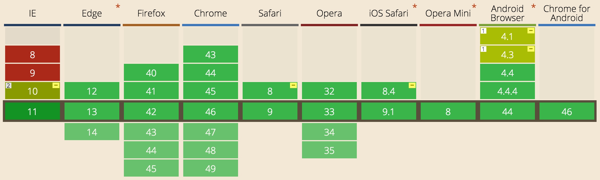](http://caniuse.com/#feat=flexbox)

IE10+, Edge, Chrome, Firefox, Opera, Safari 8+, Android 4.1+, iOS

http://caniuse.com/#feat=flexbox

NOTES:
- Not supported in IE8 or IE9
- But those should be dead or dying soon

/////

###### Layout

[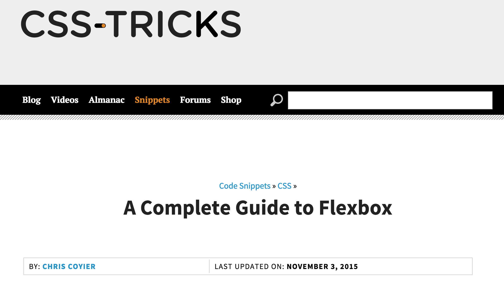](https://css-tricks.com/snippets/css/a-guide-to-flexbox/)

/////

###### Layout

[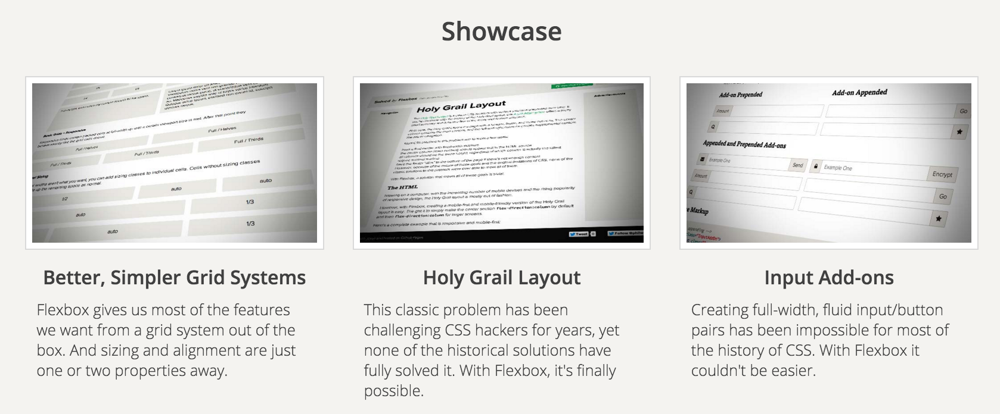](http://philipwalton.github.io/solved-by-flexbox/)

[Solved by Flexbox](http://philipwalton.github.io/solved-by-flexbox/)

/////

###### Layout

[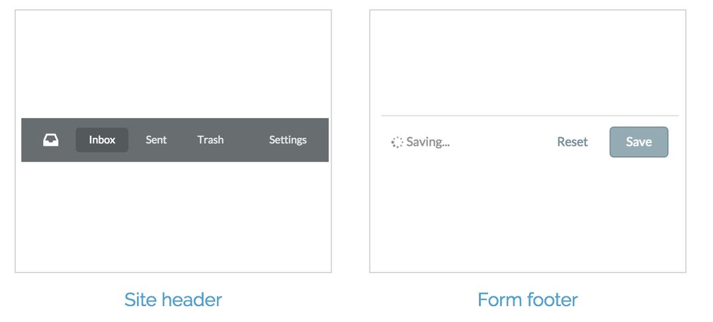](http://www.flexboxpatterns.com/home)

[Flexbox Patterns](http://www.flexboxpatterns.com/home)

/////

###### Layout

[](http://flexboxfroggy.com/)

[Flexbox froggy](http://flexboxfroggy.com/)

/////

###### Layout

[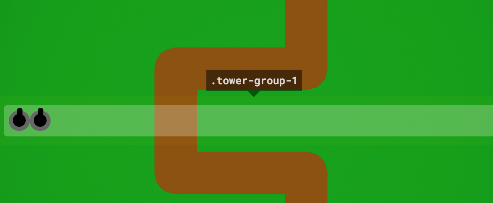](http://www.flexboxdefense.com/)

[Flexbox defense](http://www.flexboxdefense.com/)

=====

# Animation

with CSS3 `transition`

<br />

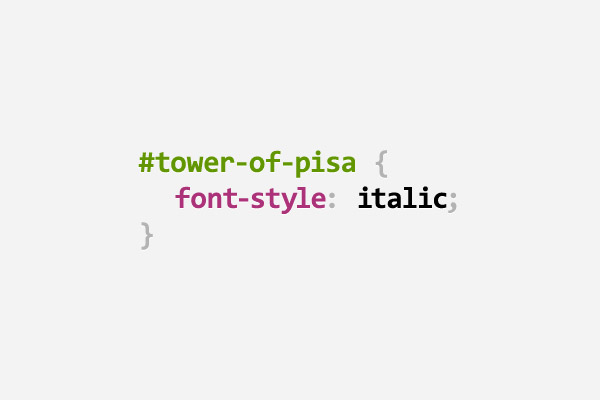

NOTES:
_[29 minutes]_

/////

###### Animation

<div class="canvas">
	<div class="square">
		<span>SQUARE</span>
	</div>
</div>

```js
$('.canvas').hover(
  function() { $(this).animate({backgroundColor:'#222'}, 1000) },
  function() { $(this).animate({backgroundColor:'#ddd'}, 1000) }
);
$('.square').hover(
  function() { $(this).delay(1000).animate(newStyles, 5000) },
  function() { $(this).delay(1000).animate(oldStyles, 5000) }
);
```

<!-- .element class="fragment large" -->

NOTES:
- Canvas has its background animated over 1s from grey -> black
- After a delay of 1s & over 5s:
  - Square grows in size
  - Border color, width & radius change
  - Font size & color change
  - Background color changes
  - Opacity changes to 50%
- The delay is both on-enter & on-leave
- You're going to be tempted to want to use the jQuery `animate` method after `hover` w/ `delay`...

/////

###### Animation

<div class="canvas" style="transition:none">
	<div class="square" style="transition:none">
		<span>SQUARE</span>
	</div>
</div>

<div style="display:flex;justify-content: space-between">
	<div style="flex:0 0 45%;">
		<pre><code data-trim>
<div class="canvas">
  <div class="square">
	<span>SQUARE</span>
  </div>
</div>
		</code></pre>
		<pre><code data-trim>
.canvas {
  background: #ccc;
  border: 10px solid black;
}
.canvas:hover {
  background: #222;
}
		</code></pre>
	</div>
	<div style="flex:0 0 50%;">
		<pre><code data-trim>
.square {
  background: #f00;
  border: 3px solid #00f;
  color: #000;
  cursor: pointer;
}
.square:hover {
  background: #008b00;
  border: 30px solid #ff0;
  border-radius: 50%;
  color: #ddd;
  font-size: 100px;
  height: 350px;
  width: calc(100% - 20px);
}
		</code></pre>
	</div>
</div>

NOTES:
_[30 minutes]_

- Before we look at how `transition` works, lets look at our HTML/CSS
- Want to point out `calc()` which is a way to do math in CSS so we don't need JS
  - Different than math in preprocessors like SASS because it's based on calculated values
- So we define the begin & end states and we'll use CSS3 `transition` to handle "tweening"

/////

###### Animation

[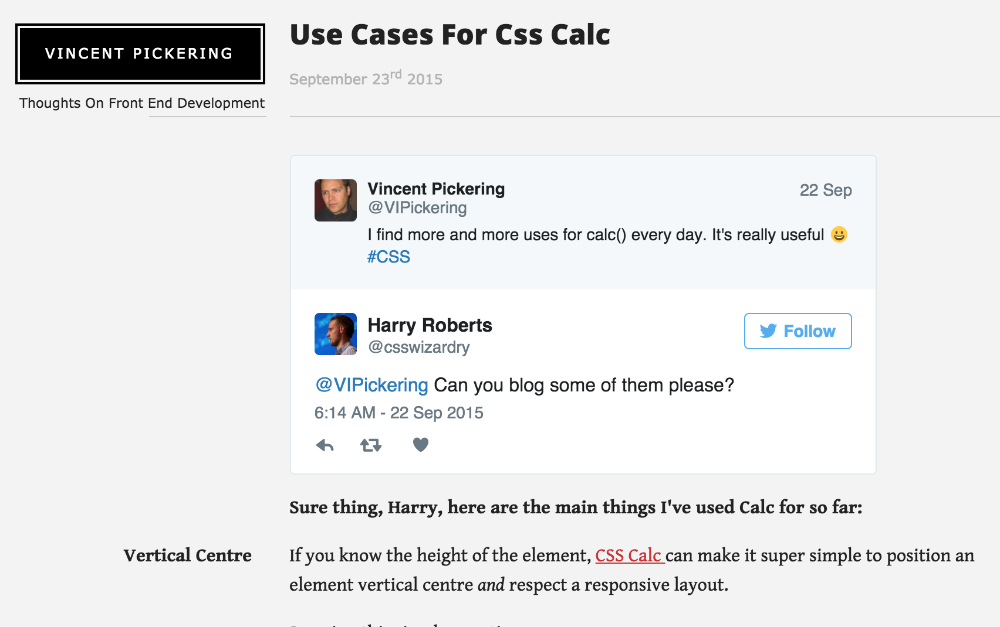](http://vincentp.me/blog/use-cases-for-calc)

NOTES:
- Vincent Pickering wrote a helpful blog posts on real-world use cases for `calc()`

/////

###### Animation

### `transition-property`

<div class="canvas">
	<div class="square" style="transition-delay:0s">
		<span>SQUARE</span>
	</div>
</div>

```
.square {
  transition-property: all;
}
```
<!-- .element class="large" -->

<a href="javascript:$('section.stack.present section.present .square').css('transition-property', 'none')">
	<em><code>none</code></em></a> |
<a href="javascript:$('section.stack.present section.present .square').css('transition-property', 'border-radius')">
	<code>border-radius</code></a> |
<a href="javascript:$('section.stack.present section.present .square').css('transition-property', 'width,height')">
	<code>width,height</code></a> |
<a href="javascript:$('section.stack.present section.present .square').css('transition-property', 'all')">
	<strong><code>all</code></strong></a>

NOTES:
_[31 minutes]_

- Used to define what property, or properties, you want to apply a transition effect to.
- `none` means no animation, just regular hover
- Only "range" style properties can be animated (like numbers & colors)
- You can set an individual property, so the others change immediately, but `border-radius` animates
- Multiple properties are separated by comma, others changed immediately
- There's the special `all` value, which will animate any properties that change (and can be animated)
- I try to avoid using `all` but prefer listing properties so that I don't accidentally transition a property I don't intend (especially w/ cascading)

/////

###### Animation

### `transition-duration`

<div class="canvas">
	<div class="square" style="transition-delay:0s">
		<span>SQUARE</span>
	</div>
</div>

```
.square {
  transition-duration: 5s;
}
```
<!-- .element class="large" -->

<a href="javascript:$('section.stack.present section.present .square').css('transition-duration', '0s')">
	<em><code>0s</code></em></a> |
<a href="javascript:$('section.stack.present section.present .square').css('transition-duration', '200ms')">
	<code>200ms</code></a> |
<a href="javascript:$('section.stack.present section.present .square').css('transition-duration', '0.5s')">
	<code>0.5s</code></a> |
<a href="javascript:$('section.stack.present section.present .square').css('transition-duration', '1s')">
	<code>1s</code></a> |
<a href="javascript:$('section.stack.present section.present .square').css('transition-duration', '5s')">
	<strong><code>5s</code></strong></a>

NOTES:
_[32 minutes]_

- `0s` means no transition should take place (default)
- Values can be specified in seconds (`s`) or milliseconds (`ms`)
- Values can also be decimals
- Anything under about 300ms is quick enough to not feel laggy while still provided smoothness

/////

###### Animation

<iframe src="../../no-js/interactivity.html" style="width:100%;height:82px"></iframe>

```
.header-nav-item {
  trandition-property: background-color;
  transition-duration: 200ms;
}
.header-nav-item__link {
  trandition-property: color;
  transition-duration: 200ms;
}
.header-nav-item:before {
  trandition-property: color;
  transition-duration: 200ms;
}
```
<!-- .element class="large" -->

NOTES:
_[33 minutes]_

- Remember our header menu example from the Interactivity section?
- Not sure if you noticed, but we had transitions on hover for smoother transitions
- Here's what the code would look like

/////

###### Animation

### `transition-delay`

<div class="canvas">
	<div class="square">
		<span>SQUARE</span>
	</div>
</div>

```
.square {
  transition-delay: 1s;
}
```
<!-- .element class="large" -->

<a href="javascript:$('section.stack.present section.present .square').css('transition-delay', '0s')">
	<em><code>0s</code></em></a> |
<a href="javascript:$('section.stack.present section.present .square').css('transition-delay', '200ms')">
	<code>200ms</code></a> |
<a href="javascript:$('section.stack.present section.present .square').css('transition-delay', '0.5s')">
	<code>0.5s</code></a> |
<a href="javascript:$('section.stack.present section.present .square').css('transition-delay', '1s')">
	<strong><code>1s</code></strong></a> |
<a href="javascript:$('section.stack.present section.present .square').css('transition-delay', '5s')">
	<code>5s</code></a>

NOTES:
_[34 minutes]_

- `0s` means no transition delay (defualt)
- Values can be specified in seconds (`s`) or milliseconds (`ms`)
- Values can also be decimals

/////

###### Animation

### `transition-timing-function`

<div class="track-shell">
	<div class="track-name">
		<code>linear</code>
	</div>
	<div class="track">
		<span class="ball" style="transition-timing-function:linear"></span>
	</div>
</div>
<div class="track-shell">
	<div class="track-name">
		<code>ease</code>
	</div>
	<div class="track">
		<span class="ball" style="transition-timing-function:ease"></span>
	</div>
</div>
<div class="track-shell">
	<div class="track-name">
		<code>ease-in</code>
	</div>
	<div class="track">
		<span class="ball" style="transition-timing-function:ease-in"></span>
	</div>
</div>
<div class="track-shell">
	<div class="track-name">
		<code>ease-out</code>
	</div>
	<div class="track">
		<span class="ball" style="transition-timing-function:ease-out"></span>
	</div>
</div>
<div class="track-shell">
	<div class="track-name">
		<code>ease-in-out</code>
	</div>
	<div class="track">
		<span class="ball" style="transition-timing-function:ease-in-out"></span>
	</div>
</div>

<a href="javascript:$('section.stack.present section.present .track').addClass('active')">
	Forward &rarr;</a> |
<a href="javascript:$('section.stack.present section.present .track').removeClass('active')">
	&larr; Backward</a>

NOTES:
_[35 minutes]_

- The last `transition` attribute is `transition-timing-function`
- The easiest way to show it is by transitioning the position of an element so you can see how it changes over time
- Valid values are:
  - linear
  - ease (default)
  - ease-in
  - ease-out
  - ease-in-out

/////

###### Animation

### `transition-timing-function`

<div class="canvas">
	<div class="square">
		<span>SQUARE</span>
	</div>
</div>

```
.square {
  transition-timing-function: ease-in-out;
}
```
<!-- .element class="large" -->

/////

###### Animation

### Putting it together

<div class="canvas">
	<div class="square">
		<span>SQUARE</span>
	</div>
</div>

```
.canvas {
  transition: all 1s;
}
.square {
  transition: all 5s ease-in-out 1s;
}
```
<!-- .element class="large" -->

NOTES:
_[36 minutes]_

- Instead of specifying each transition-based property you can group them together w/ `transition` shorthand

/////

###### Animation

### Using (a little) JavaScript

<div style="display:flex;">
	<div style="flex:0 0 28%;">
		<iframe src="../../no-js/animation.html" style="width:475px;height:800px"></iframe>
	</div>
	<div style="flex:0 0 70%;">
		<pre class="large"><code data-trim>
.mobile-page {
    display: flex;
    width: 469px; height: 783px; }
.mobile-page-nav {
    flex-grow: 0; flex-basis: 0;
    transition: flex-basis 500ms; }
.mobile-page.active .mobile-page-nav {
    flex-basis: 250px; }
.mobile-page-content {
    flex-grow: 0; flex-basis: 100%; }
		</code></pre>
		<pre class="large"><code data-trim>
$('.menu-toggle').click(function() {
	$('.mobile-page').toggleClass('active');
});
		</code></pre>

	</div>
</div>

NOTES:
_[37 minutes]_

- Most of the time you need a different interaction than hover
- Most of the time you want to click something to trigger a transition
- That's when JavaScript comes in
- But all the JavaScript needs to do is set a class which will ultimately cause the transition to happen
- There's so no need to use `jQuery.animate()`

/////

###### Animation

## Keyframe `animation` demo

[](http://www.impressivewebs.com/demo-files/css3-animated-scene/)

NOTES:
_[38 minutes]_

- The `transition` property is good for simple animations where you're going from beginning to end
- There's another animation-related CSS3 property called `animation` that allows for keyframe animations

/////

###### Animation

## Pros

- Faster than JavaScript*
- Progressive enhancement

NOTES:
_[39 minutes]_

- Browser can optimize the handling of transitions by doing animation calculations in separate process
- Animation can be added for those browsers that support it, older browsers will just get immediate jump
  - Don't make older/slower browsers even older

/////

###### Animation

## Cons

- Event-handling
- `transition-property` overwrites

NOTES:
_[40 minutes]_

- Event-handling is tricky
  - There is `transitionend` event for when transition is done
  - But no progress interface
  - Trickier to sequence animations
- `transition-property` overwrites, so if a later style rule wants to add an additional property to transition it must reduplicate all the existing ones

/////

###### Animation

## \*Javascript libraries

- [Web Animations API](https://w3c.github.io/web-animations/)
- [GSAP (GreenSock Animation Platform)](http://greensock.com/gsap)

NOTES:
_[41 minutes]_

- Web Animations API is a new standard that will be the best of both worlds
  - Speed of CSS (native implementation)
  - Event-handling of JavaScript
  - Browser support is very minimal
- GASP is a proprietary library available for purchase which is super-fast alternative to jQuery
  - In some benchmarks it's somehow faster than CSS3 animations

/////

  <!-- .element: style="width: 400px" -->  
[Zach Schnackel](https://2016.syntaxcon.com/speaker/zach-schnackel/)

<br />

## [What the GSAP?!](https://2016.syntaxcon.com/session/what-the-gsap/)

Today @ 11:30p in Front-End II

/////

###### Animation

## CSS3 `transition` Browser support

[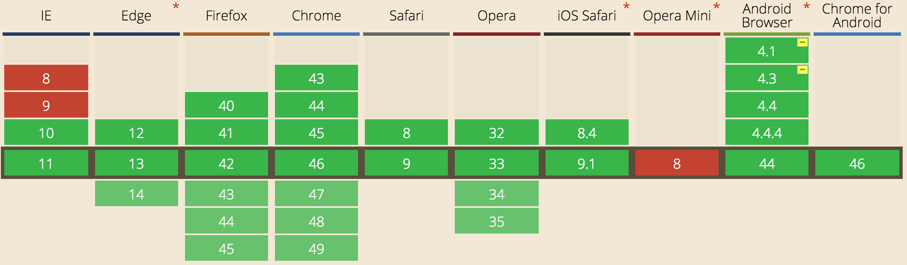](http://caniuse.com/#feat=css-transitions)

IE10+, Edge, Chrome, Firefox, Opera, Safari 8+, Android 4.1+, iOS

http://caniuse.com/#feat=css-transitions

/////

###### Animation

[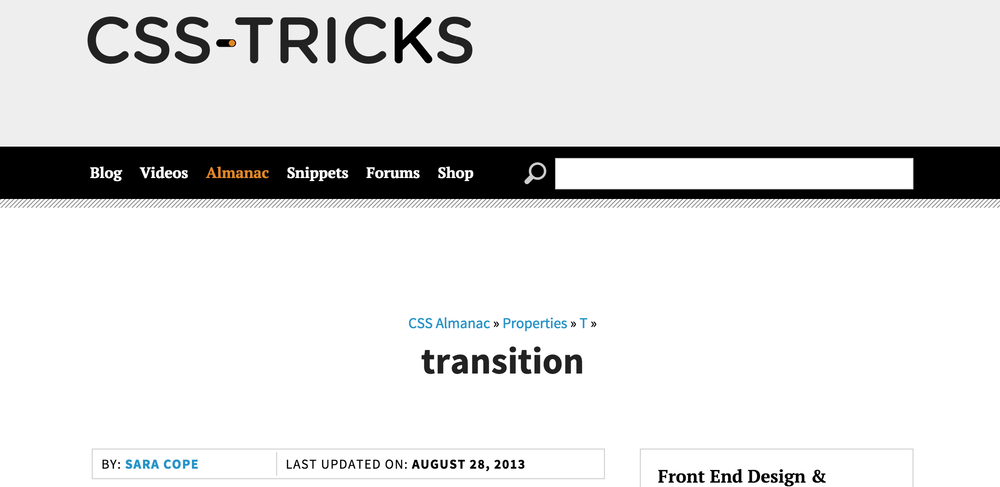](https://css-tricks.com/almanac/properties/t/transition/)

/////

###### Animation

## CSS3 `animation` Browser support

[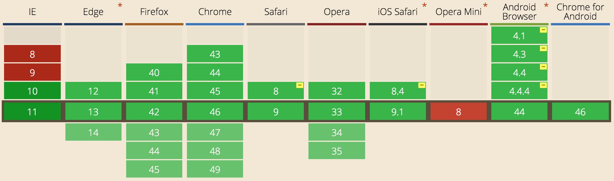](http://caniuse.com/#feat=css-animation)

IE10+, Edge, Chrome, Firefox, Opera, Safari 8+, Android 4.1+, iOS

http://caniuse.com/#feat=css-animation

/////

###### Animation

[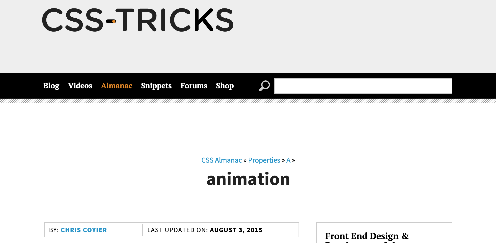](https://css-tricks.com/almanac/properties/a/animation/)

=====

# Recap

1. Interactivity
1. Functionality
1. Layout
1. Animation

NOTES:
_[42 minutes]_

- Interactivity with `:hover`
- Functionality with HTML5 `<input>`
- Layout with CSS3 `flexbox`
- Animation with CSS3 `transition` & `animation`

/////

<!-- .slide: data-background="url(../../img/giphy/that-wasnt-so-bad.gif) no-repeat center" data-background-size="contain"-->

=====

# Shoutouts

/////

   <!-- .element: style="width: 50%;background:#015697" -->

/////


## We're hiring!   <!-- .element: class="fragment" -->

/////

# YOU!

=====

<!-- .slide: data-background="url(../../img/giphy/thanks-jack-sparrow.gif) no-repeat center" data-background-size="contain" class="thanks-slide"-->

# THANKS!     <!-- .element: style="-webkit-text-stroke: black 2px" -->

NOTES:
_[43 minutes]_

/////

# Questions?

<br />

## Ben Ilegbodu

[benmvp.com](/) | [@benmvp](https://twitter.com/benmvp) | [ben@benmvp.com](mailto:ben@benmvp.com)  
[github.com/benmvp](https://github.com/benmvp/)  

<br />
Code examples: [benmvp.com/you-dont-need-js-for-that/](/you-dont-need-js-for-that/)

NOTES:
- Slides are on my Twitter profile and blog
- I'll be speaking tomorrow at 1PM in Ambassador 2 on ES6
