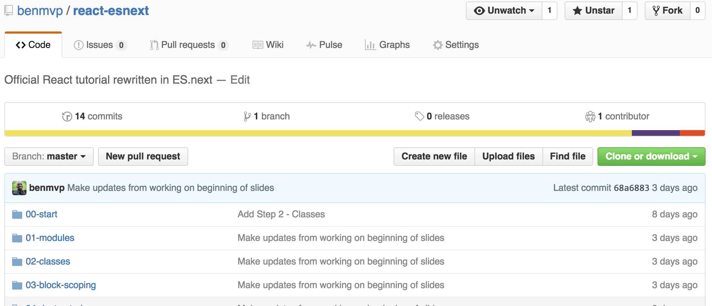

# React + ES.next = ♥

<br />

## Ben Ilegbodu

<br />

[@benmvp](https://twitter.com/benmvp) | [benmvp.com](/) | [@BuzzJS](https://twitter.com/BuzzJS)  

<br />

January 27, 2017  

NOTES:
- My name is Ben Ilegbodu
- Super excited to talk about my two favorite things
- React and what I'm calling ES.next
- And how they go so well together
- Posted link to slides on twitter if you want to follow along

/////

<!-- .slide: data-background="url(../../img/giphy/stand-up.gif) no-repeat center" data-background-size="cover" -->

# Stand Up!
<!-- .element: style="-webkit-text-stroke: black 4px" -->

NOTES:
- But first, would like everyone to stand up!
- Let's do some wall sits
- Let's roll our shoulders
- Let's stretch our arms
- Now turn to your neighbors, introduce yourself & say hi
- You don't realize it, but I just tricked you
- Now you can't say that you didn't get anything out of my talk
- You at least got two things:
- Exercise & and met some people you didn't know
- But hopefully you'll get more out of the talk!

=====

## What this talk is **not** about... 😐

<br />

- Why to use React
- How to develop in React
- Every detail about ES2015+
- How to transpile ES2015+

NOTES:
- Just so we're clear...

/////

## What this talk is about! 😄

<br />

- Learning ES2015+ ➜ ➜ ➜ applying in React
- Lots of code
- Fast-paced!

NOTES:
- However!

=====

ben-ilegbodu.json

<div style="display:flex;align-items:center">
	<div style="flex:0 0 50%;">
		<pre class="large"><code class="lang-json">
{
  "name": "Ben Ilegbodu",
  "priorities": [
    "Jesus", "family", "work"
  ],
  "location": "Pittsburg, CA",
  "work": "@Eventbrite",
  "role": "Frontend Eng Mgr",
  "hobbies": [
    "basketball", "DIY", "movies"
  ]
}
			</code></pre>
	</div>
	<div style="flex:0 0 50%;">
		
	</div>
</div>

NOTES:
_[1 minute]_

/////


<!-- .element: style="border: 0; background: none; margin: 0; box-shadow: none;" -->

NOTES:
- Currently a Senior UI Engineer and Frontend Platform Manager at Eventbrite
- Eventbrite is an online ticketing & events platform
- Many conferences use it for registration
- I work on the Frontend Platform team and right now we're in the midst of a transition from Backbone/Marionette to React
- Python/Django backend, but using a Node daemon to render React components server-side

/////

<!-- .slide: data-background="url(../../img/giphy/joakim-noah-free-throw.gif) no-repeat center" data-background-size="cover"-->

NOTES:
- I also absolutely love basketball - both playing & watching
- But you didn't come to hear about me. At least I hope not
- You came to here about...

=====

## Agenda

0. Modules <!-- .element: class="fragment highlight-green" data-fragment-index="0" -->  
0. Classes <!-- .element: class="fragment highlight-green" data-fragment-index="0" -->  
0. Block scoping <!-- .element: class="fragment highlight-green" data-fragment-index="0" -->  
0. Destructuring <!-- .element: class="fragment highlight-green" data-fragment-index="0" -->  
0. Arrow functions <!-- .element: class="fragment highlight-green" data-fragment-index="0" -->  
0. Enhanced object literals <!-- .element: class="fragment highlight-green" data-fragment-index="0" -->  
0. Rest operator <!-- .element: class="fragment highlight-green" data-fragment-index="0" -->  
0. Spread operator <!-- .element: class="fragment highlight-blue" data-fragment-index="0" -->  
0. Promises <!-- .element: class="fragment highlight-blue" data-fragment-index="0" -->  
0. Default parameters <!-- .element: class="fragment highlight-blue" data-fragment-index="0" -->  
0. String APIs <!-- .element: class="fragment highlight-blue" data-fragment-index="0" -->  
0. Array APIs <!-- .element: class="fragment highlight-blue" data-fragment-index="0" -->  

NOTES:

- Green for Components
- Blue for Data APIs
- Highly suggest you just sit back and take it all in

/////


<!-- .element: style="width: 75%"-->

[React official tutorial](https://facebook.github.io/react/tutorial/tutorial.html) app

NOTES:
- The original official React tutorial was written in ES5, presumably to make it easy to develop
- We'll be transforming it to ES2015+/ES.next
- There's a Comment Form, Comment List, Comment & App

=====

# Components

=====

How can we modularize this code?

```js
// globals: React, ReactDOM, Remarkable, jQuery

var Comment = React.createClass({
    // code using Remarkable dependency
})
var CommentList = React.createClass({
    // code using Comment
})
var CommentForm = React.createClass({
    // code w/ no dependencies
})
var App = React.createClass({
    // code using CommentForm & CommentList
})
ReactDOM.render(<App url="/api/comments" pollInterval={2000} />,
    document.getElementById('app'))
```
<!-- .element: class="large" -->

NOTES:
- Start with birds-eye view
- One big JS file
- Relying on `React`, `ReactDOM` & other dependencies being included by `<script>` tags in global scope
- React is all about reusable & composable components, but these aren't really reusable
- Also going to need data/API/utility libraries
- This obviously isn't scalable

/////

# Modules

Replace one file with many files

<br />
<br />

[_ECMAScript 6 Modules: the final syntax_](http://www.2ality.com/2014/09/es6-modules-final.html)

/////

###### Modules

`/components/Comment.js`
```js
import React from 'react'
import Remarkable from 'remarkable'

var Comment = React.createClass({
    // code using Remarkable module
})

export default Comment
```

`/components/CommentList.js`
```js
import React from 'react'
import Comment from './Comment'

var CommentList = React.createClass({
    // code using Comment
})

export default CommentList
```

NOTES:
- After some Babel & Webpack magic...
- We have separate files that use ES6 `import` & `export`
- Explicitly using `React` & `Remarkable`
- `Comment.js` exports `Comment` as default `export`, so...
- `CommentList` component can `import` as default
- Exporting implicitly makes the file a module enabling it be reused

/////

###### Modules

`/containers/App.js`
```js
import React from 'react'
import CommentList from '../components/CommentList'
import CommentForm from '../components/CommentForm'

var App = React.createClass({
    // code using CommentForm & CommentList
})

export default App
```

`/index.js`
```js
import React from 'react'
import ReactDOM from 'react-dom'
import App from './containers/App'

ReactDOM.render(
    <App url="/api/comments" pollInterval={2000} />,
    document.getElementById('app')
)
```

NOTES:
- Skipping `CommentForm` - nothing special
- `App.js` is similar to `CommentList.js`. It imports both `CommentList` & `CommentForm`
- `index.js` is now its own file pulling in `React`, `ReactDOM` and `App`. It's the only file that's not a module

/////

<!-- .slide: data-background="url(../../img/giphy/unimpressed-squidward.gif) no-repeat center" data-background-size="contain"-->

NOTES:
- Chances are if you're using React, you're already modularizing your code, so this is nothing new
- Starting slow, trying to tackle the overall structure first before delving into smaller features

=====

Class factory creates component

```js
var CommentForm = React.createClass({
    propTypes: {
        onCommentSubmit: React.PropTypes.func.isRequired
    },
    getInitialState: function() {
        return {author: '', text: ''}
    },
    _handleSubmit: function() {
        // form submission handling
    },
    render: function() {
        return (
            <form onSubmit={this._handleSubmit} />
        )
    }
})
```
<!-- .element: class="large" -->

NOTES:
- Now lets take a look at `CommentForm`
- The React component is a JS "class" with static properties & methods
- `React.createClass` is a class factory function that takes a huge object literal and creates the class
- This is certainly better than creating a class "manually" via constructor functions
- It basically allows for a lot of "magic" to happen before the class is actually created
- Callback handlers are auto-bound

/////

# Classes

Replace class factories with `class` syntax

<br />
<br />

[_Learning ES6: Classes_](http://www.benmvp.com/learning-es6-classes/)

NOTES:
- Now we can replace assigning to the prototype or using custom class factories with native class syntax

/////

ES6 class structure

```js
class MyClass extends BaseClass {
    constructor() { }
    static staticMethodA() { }
    static staticMethodB() { }
    methodOne() { }
    methodTwo() { }
}
```
<!-- .element: class="large" -->

NOTES:
- `class` keyword
- `extends` base class
- supports `constructor`, instance & `static` methods
- doesn't support properties (yet)

/////

###### Classes

React with ES6 classes!

```js
class CommentForm extends React.Component {
    constructor() {
        this.state = {author: '', text: ''}
    }
    _handleSubmit() {
        // form submission handling
    }
    render() {
        return (
            <form onSubmit={this._handleSubmit.bind(this)} />
        )
    }
}
CommentForm.propTypes = {
    onCommentSubmit: React.PropTypes.func.isRequired
}
```
<!-- .element: class="large" -->

NOTES:
- `class` keyword
- `extends` `React.Component`
- `propTypes` now added afterwards as static properties
- Methods don't have `function` keyword
- Have to `.bind(this)` (no more auto-binding)
- React had to do a lot of work to make this all work
- `this.state` in `constructor` instead of `getInitialState`
- Annoying that static properties have to be defined after

/////

###### Classes

```js
class CommentForm extends React.Component {
    static propTypes = {
        onCommentSubmit: React.PropTypes.func.isRequired
    }
    state = {author: '', text: ''}

    _handleSubmit() {
        // form submission handling
    }
    render() {
        return (
            <form onSubmit={this._handleSubmit.bind(this)} />
        )
    }
}
```
<!-- .element: class="large" -->

[Public class fields](https://tc39.github.io/proposal-class-public-fields/) (Stage 2)

NOTES:
- Using class property declarations we can bring everything within the `class` definition

/////

###### Classes

Named imports + immediate export!

```js
import React, {Component} from 'react'

export default class CommentForm extends Component {

}
```
<!-- .element: class="large" -->

<br />

-----

##### Before

```js
import React from 'react'

class CommentForm extends React.Component {

}

export default CommentForm
```
<!-- .element: class="large" -->

NOTES:
- We can pull out the named imports, `Component` & `PropTypes`
- Can also immediately export the class as `default`

/////

###### Classes

Pull out `INITIAL_STATE` as a constant

```js
import React, {Component, PropTypes} from 'react'

var INITIAL_STATE = {author: '', text: ''}

export default class CommentForm extends Component {
    static propTypes = {
        onCommentSubmit: PropTypes.func.isRequired
    }
    state = INITIAL_STATE

    render() {
        return (
            <form onSubmit={this._handleSubmit.bind(this)} />
        )
    }
}
```
<!-- .element: class="large" -->

NOTES:
- One last thing, is to pull out the initial state into a constant variable so that later you can reset the state when the form is submitted
- But what if there was a way to really make it a constant...

=====

# Block scoping

Replace `var` with `let` & `const`

<br />
<br />

[_Learning ES6: Block Scoping with let & const_](http://www.benmvp.com/learning-es6-block-level-scoping-let-const/)

NOTES:
- In fact there are two: `let` & `const`
- Together they're called Block scoping
- With block scoping we can replace `var` with `let` & `const`

/////

###### Block scoping

Real constants!

```js
import React, {Component, PropTypes} from 'react'

const INITIAL_STATE = {author: '', text: ''}

export default class CommentForm extends Component {
    static propTypes = {
        onCommentSubmit: PropTypes.func.isRequired
    }
    state = INITIAL_STATE

    render() {
        return (
            <form onSubmit={this._handleSubmit.bind(this)} />
        )
    }
}
```
<!-- .element: class="large" -->

NOTES:
- We use `const` because it's a constant! Finally!
- Variable declared `const` cannot be reassigned
- Also a variable declared `const` must be initialized

/////

###### Block scoping

[`var` hoisting](https://developer.mozilla.org/en-US/docs/Web/JavaScript/Reference/Statements/var#var_hoisting)

```js
_handleSubmit(e) {
    var author,
        text

    e.preventDefault()

    author = this.state.author
    text = this.state.text

    if (!text || !author) {
        return
    }

    this.props.onCommentSubmit({author: author, text: text})
    this.setState(INITIAL_STATE)
}
```
<!-- .element: class="large" -->

NOTES:
- Let's zoom into the `_handleSubmit` method
- We've got a couple of `var` declarations up top
- We really want to call `e.preventDefault()` immediately, but `var` declarations need to be first because of variable hoisting
- No time to explain variable hoisting

/////

###### Block scoping

No more variable hoisting!

```js
_handleSubmit(e) {
    e.preventDefault()

    let author = this.state.author
    let text = this.state.text

    if (!text || !author) {
        return
    }

    this.props.onCommentSubmit({author: author, text: text})
    this.setState(INITIAL_STATE)
}
```
<!-- .element: class="large" -->

NOTES:
- No more variable hoisting!
- But now, you will see that we're pulling out `author` & `text` from `this.state` and assigning to variables of the same name

/////

# Destructuring

Replace multiple assignments with a single one

<br />
<br />

[_Learning ES6: Destructuring_](http://www.benmvp.com/learning-es6-destructuring/)

NOTES:
- It's called Destructuring
- With destructuring we can reduce multiple assignments down to one
- Be advised, destructuring is probably the most "out there" syntax addition
- It's ok if you don't understand it at first

/////

<!-- .slide: data-background="url(../../img/giphy/i-hate-you-brad-pitt.gif) no-repeat center" data-background-size="contain"-->

NOTES:
- I'm afraid that after we cover destructuring, you'll feel like this...
- But stick with me...

/////

<!-- .slide: data-background="url(../../img/giphy/brad-pitt-dancing.gif) no-repeat center" data-background-size="contain"-->

NOTES:
- Eventually I think you'll be super excited about them

/////

###### Destructuring

Single assignment statement!

```js
_handleSubmit(e) {
    e.preventDefault()

    let {author, text} = this.state

    if (!text || !author) {
        return
    }

    this.props.onCommentSubmit({author: author, text: text})
    this.setState(INITIAL_STATE)
}
```
<!-- .element: class="large" -->

NOTES:
- With destructuring we can combine the two statements into one
- Uses object literal pattern
- Since this one is a bit tricky, let's look at some examples

/////

###### Destructuring

Object destructuring!

```js
// before
let author = this.state.author
let text = this.state.text

// after
let {author, text} = this.state
```
<!-- .element: class="large" -->

```js
// before
let authorName = this.state.author
let fullText = this.state.text

// after
let {author: authorName, text: fullText} = this.state
```
<!-- .element: class="large" -->

NOTES:
- We can also create a differently named variable

/////

###### Destructuring

Named parameters!

```js
// after
function MyComponent({style, content}) {
    return (
        <div style={style}>{content}</div>
    )
}

// before
function MyComponent(props) {
    return (
        <div style={props.style}>{props.content}</div>
    )
}
```
<!-- .element: class="large" -->

NOTES:
- React supports stateless functions which receive the `props` as a parameter
- You can immediately destructure `props` into the properties you need

===== <!-- .slide: data-transition="fade" -->

Where's the bug?

```js
// in App.js

_loadCommentsFromServer() {
    $.ajax({
        url: this.props.url,
        success: function(comments) {
            this.setState({comments: comments})
        }
    })
}
```
<!-- .element: class="large" -->

NOTES:

- Let's take jump to a different piece of code
- `_loadCommentsFromServer` method in `App.js`
- Can anyone spot the mistake in this code?
- We're passing a callback to `success` of the `ajax` request
- The callback calls `this.setState` with the returned data

///// <!-- .slide: data-transition="fade" -->

Undefined [`this`](https://developer.mozilla.org/en/docs/Web/JavaScript/Reference/Operators/this)!

```js
// in App.js

_loadCommentsFromServer() {
    $.ajax({
        url: this.props.url,
        success: function(comments) {
            // `this` is undefined!
            this.setState({comments: comments})
        }
    })
}
```
<!-- .element: class="large" -->

NOTES:
- `this` is `undefined` in the callback function in strict mode
- `this` is the global scope (window) in loose mode
- Something that newbies scratch their head about
- Experienced JavaScript developers still run into it
- _[Water break]_

/////

ES3 fix

```js
// in App.js

_loadCommentsFromServer: function() {
    var self = this // store reference to `this`

    $.ajax({
        url: this.props.url,
        success: function(comments) {
            // `self` is available in scope
            self.setState({comments: comments})
        }
    })
}
```
<!-- .element: class="large" -->

NOTES:
- In ES3, we solved this by storing a reference to `this` in a variable so that it’s available in the scope of the anonymous function
- Works, but pretty much every method has to assign `self` variable

/////

ES5 fix

```js
// in App.js

_loadCommentsFromServer: function() {
    $.ajax({
        url: this.props.url,
        success: function(comments) {
            this.setState({comments: comments})
        }.bind(this) // pass in proper `this` context
    })
}
```
<!-- .element: class="large" -->

NOTES:
- `bind()` was introduced in ES5 and it creates a new function, passing the specified `this`
- Underscore and other shim have a bind method so it can work with ES3 browsers
- This is what the React tutorial does
- Works, but messy syntax
- We need something better!

/////

# Arrow functions

Replace anonymous functions with arrow functions

<br />
<br />

[_Learning ES6: Arrow functions_](http://www.benmvp.com/learning-es6-arrow-functions/)

NOTES:
- With arrow functions we can stop using anonymous functions

/////

###### Arrow functions

Arrow functions works how you would expect!

```js
$.ajax({
    url: this.props.url,
    success: (comments) => {
        this.setState({comments: comments})
    }
})
```
<!-- .element: class="large" -->

<br />

-----

#### ES5 way

```js
$.ajax({
    url: this.props.url,
    success: function(comments) {
        this.setState({comments: comments})
    }.bind(this) // pass in proper `this` context
})
```
<!-- .element: class="large" -->


NOTES:
- Arrow functions in ES6 solve this problem
- Arrow functions use what’s called “lexical scoping” for `this`
  - It's implicitly “inherited” from the enclosing scope, which in our case would be the class method
  - Essentially arrow functions work how you would expect it to
- An arrow function is literally an arrow (fat arrow) between parameters and body

/////

###### Arrow functions

```js
let squares = [1, 2, 3].map(value => value * value)
```
<!-- .element: class="large" -->

```js
let sum = [9, 8, 7, 6].reduce((prev, value) => prev + value, 0)
```
<!-- .element: class="large" -->

```js
$('button').click(e => {
  alert('Hello world!')
})
```
<!-- .element: class="large" -->

```js
setTimeout(() => {
  console.log('delayed for 1 second')
  console.log('using arrow function')
}, 1000)
```
<!-- .element: class="large" -->

```js
const MyComponent = ({style, content}) => (
    <div style={style}>{content}</div>
)
```
<!-- .element: class="large" -->

NOTES:
- You’ll find that arrow functions come in handy most when used as a callback function.
  - The various higher-order functional programming array methods that were introduced with ECMAScript 5 (like `map`, `forEach`, `reduce`, etc.) work well with arrow functions.
  - Arrow functions can also be used as callback functions for event handlers (like `click`, `keydown`, etc)
- This also shows the different formats of arrow functions
  - Parentheses can be omitted if there is one parameter
  - Curly braces can be omitted if there's just a single `return` line
- The last example is a stateless function using arrow functions with header destructuring

=====

```js
_handleSubmit(e) {
    e.preventDefault()

    let {author, text} = this.state

    if (!text || !author) {
        return
    }

    this.props.onCommentSubmit({author: author, text: text})
    this.setState(INITIAL_STATE)
}
```
<!-- .element: class="large" -->

NOTES:
- Let's pick on `CommentForm` and its `_handleSubmit()` method
- If you recall with destructuring we combined the declarations of `author` & `text` into one to reduce duplication
- But now there's duplication in the call to `this.props.onCommentSubmit`
- The name of the key matches the name of the variable

/////

# Enhanced object literals

Write less code than before

<br />
<br />

[_Learning ES6: Enhanced object literals_](http://www.benmvp.com/learning-es6-enhanced-object-literals)

/////

###### Enhanced object literals

Object literal shorthand

```js
_handleSubmit() {
    let {author, text} = this.state

    this.props.onCommentSubmit({author, text})
}
```
<!-- .element: class="large" -->

<br />

-----

#### Before

```js
_handleSubmit() {
    let {author, text} = this.state

    this.props.onCommentSubmit({author: author, text: text})
}
```
<!-- .element: class="large" -->

NOTES:
- Now we can just omit the `: value` when the variable name & key match
- Just a little bit of shorthand
- It's interesting that both literals look the exact same, but do different things

/////

###### Enhanced object literals

```js
_updateFormFieldState(name, e) {
    let newState = {}

    newState[name] = e.target.value

    this.setState(newState)
}
```
<!-- .element: class="large" -->

Variable object literal keys haven't been possible...

NOTES:
- There's this other helper method in `CommentForm` called `_updateFormFieldState`
- It basically wants to dynamically set state based on the passed in `name`
- But to create the object, we first have to create the empty object and then mutate the object to index into it
- This has always been a minor pet peeve of mine, until now...

/////

###### Enhanced object literals

...until object literal computed keys!

```js
_updateFormFieldState(name, e) {
    this.setState({
        [name]: e.target.value
    })
}
```
<!-- .element: class="large" -->

-----

#### Before

```js
_updateFormFieldState(name, e) {
    let newState = {}

    newState[name] = e.target.value

    this.setState(newState)
}
```
<!-- .element: class="large" -->

NOTES:
- ES6 introduces object literal computed keys so that you can have a dynamic key right in the object literal definition!

=====

Parameters list is unclear

```js
function join(separator) {
  var values = []

  // arguments is not an array, just "array-like"
  for (var i = 1; i < arguments.length; i++) {
      values.push(arguments[i])
  }

  return values.join(separator)
}

// output: tic-tac-toe
join('-', 'tic', 'tac', 'toe')
```
<!-- .element: class="large" -->

NOTES:
- Ok this next ES6 feature wasn't present in any of my conversion code, but it's come up a lot in my usual React development
- Let me set the stage
- We have here a `join` method that takes a separator string followed by an unlimited number of parameters to join
- The fact that `join` takes more than one parameter is unclear let alone that it accepts an arbitrary number of them
- Because `join` uses the `separator` parameter the implementation has to start at index `1` of `arguments`
- And even if it could start at 0, `arguments` is only array-like so it doesn't have the `join` method that arrays have
- **NEED:** is an easy way to get an array of the parameters after `separator`
- And guess what? There's an ES6 feature for that

/////

# Rest operator

Replace `arguments` with an array

<br />
<br />

[_Learning ES6: Parameter handling_](http://www.benmvp.com/learning-es6-parameter-handling/#rest-parameters/)

/////

###### Rest operator

Clearer function signature!

```js
const join = (separator, ...values) => values.join(separator)

// output: tic-tac-toe
join('-', 'tic', 'tac', 'toe')
```
<!-- .element: class="large" -->

-----

#### Before

```js
function join(separator) {
  var values = []

  // arguments is not an array, just "array-like"
  for (var i = 1; i < arguments.length; i++) {
      values.push(arguments[i])
  }

  return values.join(separator)
}
```

NOTES:
- That's it!
- The three dots, called the rest operator, before the parameter make it a rest parameter
  - The rest parameter is an `Array` containing the rest of the parameters
  - Hence the name!
- Because `values` is a true array in the example, we can call join on it
- It’s also much **clearer** to see that `join()` takes an infinite number of parameters
- Rest parameter should pretty much replace all uses of the `arguments` keyword!

/////

###### Rest operator

Object destructuring + rest operator!

```js
export default class TextInput extends Component {
    render() {
        let {type, defaultValue, ...inputProps} = this.props
        // `inputProps` has everything in `this.props`
        // except `type` & `defaultValue`

        /* render stuff */
    }
}
```
<!-- .element: class="large" -->

[Rest Properties](https://github.com/sebmarkbage/ecmascript-rest-spread) (Stage 3)

NOTES:
- Rest properties are coming in soon to ECMAScript. They're in Stage 3
- Not in ES2015, not ES2016, but future JavaScript (maybe ES2017)

=====

# Data APIs

NOTES:
- So that was all the features used in Components
- But it's only part of the story
- React's API is very narrow
- Most of the code you write will be in helper methods
- So let's look at some of that functionality

=====

`Math.max.apply`???

```js
var maxValueNormal = Math.max(33, 2, 9),
    arrayOfValues = [33, 2, 9],
    maxValueFromArray = Math.max.apply(null, arrayOfValues)

// output: 33  33
console.log(maxValueNormal, maxValueFromArray)
```
<!-- .element: class="large" -->

NOTES:
_[21 minutes]_

- `Math.max` accepts an arbitrary number of numeric parameters and returns the maximum one
- If you want to get the maximum value of an array of numbers, you have to call `Math.max.apply`
- `apply` converts the array of values into a sequence of parameters
- But it's kind of esoteric
  - Plus you have to specify `null` as the context
- Maybe there's an ES6 feature for this?

/////

# Spread operator

Replace `apply` with the spread operator

<br />
<br />

[_Learning ES6: Parameter handling_](http://www.benmvp.com/learning-es6-parameter-handling/#spread-operator)

/////

###### Spread operator

No more `apply`!

```js
let arrayOfValues = [33, 2, 9]
let maxValueFromArray = Math.max(...arrayOfValues)

// output: 33
console.log(maxValueFromArray)
```
<!-- .element: class="large" -->

<br />

-----

#### ES5 way

```js
var arrayOfValues = [33, 2, 9],
    maxValueFromArray = Math.max.apply(null, arrayOfValues)

// output: 33
console.log(maxValueFromArray)
```
<!-- .element: class="large" -->

NOTES:
- Instead of calling `apply` we can use the spread operator
- It's 3 dots preceding a parameter in a function call
- The spread operator _spreads_ out the array into individual parameters

/////

###### Spread operator

### Spread operator
Array ➞ multiple parameters (function call)

```js
let arrayOfValues = [33, 2, 9]
let maxValueFromArray = Math.max(...arrayOfValues)
    // just like: Math.max(33, 2, 9)
```
<!-- .element: class="large" -->

-----

### Rest operator
Multiple parameters ➞ array (function header)

```js
function join(separator, ...values) {
  // values = ['tic', 'tac', 'toe']
}

join('-', 'tic', 'tac', 'toe')
```
<!-- .element: class="large" -->

NOTES:
- Spread operator & rest operator look the exact same
- The spread operator works w/ function _call_ parameters
  - Takes an array literal and converts each element to individual parameters
- The rest operator works w/ function _header_ parameters
  - Takes individual parameters and puts them together into an array
- They are opposites of each other

/////

###### Spread operator

Maintain immutability!

```js
let start = ['do', 're', 'mi']
let end = ['la', 'ti']
let scaleFromLiteral = [...start, 'fa', 'so', ...end]

// output: ['do', 're', 'mi', 'fa', 'so', 'la', 'ti']
console.log(scaleFromLiteral)
```
<!-- .element: class="large" -->

-----

#### ES5 way

```js
let start = ['do', 're', 'mi']
let end = ['la', 'ti']
let scaleFromConcat = start.concat(['fa', 'so']).concat(end)

// output: ['do', 're', 'mi', 'fa', 'so', 'la', 'ti']
console.log(scaleFromConcat)
```


NOTES:
- When we spread multiple arrays into an array literal we're constructing a new array with all of those values
- Therefore using the spread operator within an array literal can replace using `concat`
- We can use the spread operator to maintain immutability by cloning an array before adding to it all in one statement
- It'd be nice if we could that with objects

/////

###### Spread operator

Spread operator with object literals!

```js
let warriors = {Steph: 95, Klay: 82, Draymond: 79}
let newWarriors = {
    ...warriors,
    Kevin: 97
}
```
<!-- .element: class="large" -->

-----

#### ES5 way

```js
let warriors = {Steph: 95, Klay: 82, Draymond: 79}
let newWarriors = _.assign({}, warriors, {
    Kevin: 97
})
```

[Spread Properties](https://github.com/sebmarkbage/ecmascript-rest-spread) (Stage 3)

NOTES:
- Now we copy objects while adding new properties in one object literal definition
- It's a Stage 3 ES feature
- The ES5 way was to use `_.assign()`
- ES6 did introduce Object.assign() to handle this as well, but I'll always prefer syntax

/////

###### Spread operator

[JSX spread attributes](https://facebook.github.io/react/docs/jsx-spread.html)!

```js
export default class TextInput extends Component {
    render() {
        let {type, defaultValue, ...inputProps} = this.props

        return (
            <input
                {...inputProps}
                type={type}
                defaultValue={defaultValue}
            />
        )
    }
}
```
<!-- .element: class="large" -->

NOTES:
- Similar to object spread, are JSX spread attributes
- It allows you to take an object and make all of its properties attributes on a component
- I tend to avoid it in favor of being explicit about the attributes I'm setting

=====

<!-- .slide: data-background="url(../../img/giphy/mario-out-of-time.gif) no-repeat center" data-background-size="contain"-->


NOTES:
- Unfortunately there isn't too much time left...

=====

## [Fetch API](https://developer.mozilla.org/en-US/docs/Web/API/Fetch_API) / [Promises](http://www.benmvp.com/learning-es6-promises/)

```js
fetch(this.props.url)
    .then((res) => res.json())
    .then((comments) => this.setState({comments}))
    .catch((ex) => console.error(this.props.url, ex))
```
<!-- .element: class="large" -->

-----

#### jQuery way

```js
$.ajax({
    url: this.props.url,
    dataType: 'json',
    success: (comments) => this.setState({comments}),
    error: (xhr, status, err) => console.error(this.props.url, status, err.toString())
})
```

NOTES:
- I'd love to talk in detail about the new Fetch API and how it uses ES6 promises to completely rid our need for jQuery

=====

## [Default Parameters](http://www.benmvp.com/learning-es6-parameter-handling/#default-parameters)

```js
function getWidth() {
  console.log('getWidth')
  return 7
}
function makeRect(w=getWidth(), h=w*2, opts={color:'red'}) {
  console.log(w, h, opts)
}
```

```
> makeRect()
getWidth
7  14  {color:'red'}

> makeRect(17)
17  34  {color:'red'}

> makeRect(4, 11)
4  11  {color:'red'}

> makeRect(2, 1, {color:'blue'})
2  1  {color:'blue'}
```

NOTES:
- Or how default parameters can save us from defaulting logic in our code

=====

## String API

- [**`String.prototype.endsWith`**](https://developer.mozilla.org/en-US/docs/Web/JavaScript/Reference/Global_Objects/String/endsWith)
- [**`String.prototype.includes`**](https://developer.mozilla.org/en-US/docs/Web/JavaScript/Reference/Global_Objects/String/includes)
- [`String.prototype.repeat`](https://developer.mozilla.org/en-US/docs/Web/JavaScript/Reference/Global_Objects/String/repeat)
- [`String.prototype.padEnd`](https://developer.mozilla.org/en-US/docs/Web/JavaScript/Reference/Global_Objects/String/padEnd)
- [`String.prototype.padStart`](https://developer.mozilla.org/en-US/docs/Web/JavaScript/Reference/Global_Objects/String/padStart)
- [**`String.prototype.startsWith`**](https://developer.mozilla.org/en-US/docs/Web/JavaScript/Reference/Global_Objects/String/startsWith)
- [`String.raw`](https://developer.mozilla.org/en-US/docs/Web/JavaScript/Reference/Global_Objects/String/raw)

NOTES:
- Just want to alert you to some new methods introduced with ES6+ for `String`

=====

## Array API

- [**`Array.from`**](https://developer.mozilla.org/en-US/docs/Web/JavaScript/Reference/Global_Objects/Array/from)
- [`Array.of`](https://developer.mozilla.org/en-US/docs/Web/JavaScript/Reference/Global_Objects/Array/of)
- [`Array.prototype.copyWithin`](https://developer.mozilla.org/en-US/docs/Web/JavaScript/Reference/Global_Objects/Array/copyWithin)
- [`Array.prototype.fill`](https://developer.mozilla.org/en-US/docs/Web/JavaScript/Reference/Global_Objects/Array/fill)
- [**`Array.prototype.find`**](https://developer.mozilla.org/en-US/docs/Web/JavaScript/Reference/Global_Objects/Array/find)
- [`Array.prototype.findIndex`](https://developer.mozilla.org/en-US/docs/Web/JavaScript/Reference/Global_Objects/Array/findIndex)
- [**`Array.prototype.includes`**](https://developer.mozilla.org/en-US/docs/Web/JavaScript/Reference/Global_Objects/Array/includes)

NOTES:
- Also some useful methods for `Array` too

=====

## Recap

0. Modules <!-- .element: class="fragment highlight-green" data-fragment-index="0" -->  
0. Classes <!-- .element: class="fragment highlight-green" data-fragment-index="0" -->  
0. Block scoping <!-- .element: class="fragment highlight-green" data-fragment-index="0" -->  
0. Destructuring <!-- .element: class="fragment highlight-green" data-fragment-index="0" -->  
0. Arrow functions <!-- .element: class="fragment highlight-green" data-fragment-index="0" -->  
0. Enhanced object literals <!-- .element: class="fragment highlight-green" data-fragment-index="0" -->  
0. Rest operator <!-- .element: class="fragment highlight-green" data-fragment-index="0" -->  
0. Spread operator <!-- .element: class="fragment highlight-blue" data-fragment-index="0" -->  
0. Promises <!-- .element: class="fragment highlight-blue" data-fragment-index="0" -->  
0. Default parameters <!-- .element: class="fragment highlight-blue" data-fragment-index="0" -->  
0. String APIs <!-- .element: class="fragment highlight-blue" data-fragment-index="0" -->  
0. Array APIs <!-- .element: class="fragment highlight-blue" data-fragment-index="0" -->  

NOTES:
- So here's what we discussed
- I kind of cheated and only talked about the first 8, but I have helpful links for the others
- Feel free to grab the slides

=====

[](https://github.com/benmvp/react-esnext)

[github/benmvp/react-esnext](https://github.com/benmvp/react-esnext)

NOTES:
- And to be even more helpful I crated a repo where I take the ES5 React tutorial and go step-by-step converting it to ES2015+
- Feel free to star the repo 😉

=====

## Additional resources

- [React official tutorial](https://facebook.github.io/react/tutorial/tutorial.html)
- [_Learning ES6_ series](/learning-es6-series/)
- [ECMAScript 6 Compatibility Table](http://kangax.github.io/compat-table/es6/)
- [Eventbrite React coding styleguide](https://github.com/eventbrite/javascript/tree/master/react)
- [Eventbrite React ESLint configuration](https://github.com/eventbrite/javascript/tree/master/packages/eslint-config-eventbrite-react)

=====


<!-- .element: style="width: 60%" -->

/////


<!-- .element: style="width: 50%;border: 0; background: none; margin: 0; box-shadow: none;" -->

NOTES:
-

/////


<!-- .element: style="border: 0; background: none; margin: 0; box-shadow: none;" -->

/////

# YOU!
<!-- .element: style="font-size:12em" -->

NOTES:
- It's my hope that, the main reason I do this, is so you can feel excited & confident to start using ES6 syntax in your code to make it clearer and more succinct
- Any feedback would be appreciated!

=====

# THANKS!


<!-- .element: style="width: 60%" -->

NOTES:

/////

# Questions?

<br />

## Ben Ilegbodu

[benmvp.com](/) | [@benmvp](https://twitter.com/benmvp) | [ben@benmvp.com](mailto:ben@benmvp.com)

<br />

Code examples: [github/benmvp/react-esnext](https://github.com/benmvp/react-esnext)

<br />

Ask me anything! [benmvp.com/ama](http://www.benmvp.com/ama/)

NOTES:
- Slides are available on Twitter
- Github repo
- Ask questions on Twitter, via email or AMA!
