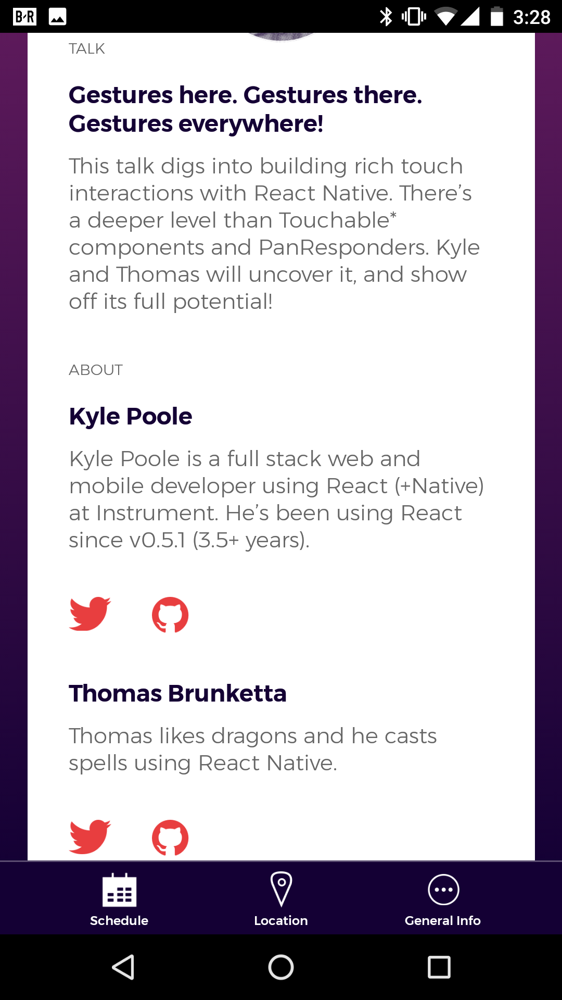

# React Native + ES.next = ♥

<br />

## Ben Ilegbodu

<br />

[@benmvp](https://twitter.com/benmvp) | [benmvp.com](/) | [#ChainReact2017](https://twitter.com/hashtag/ChainReact2017)    

<br />

July 10, 2017  

NOTES:
- My name is Ben Ilegbodu
- Here to talk about React Native + ES.next

/////

<!-- .slide: data-background="url(../../img/giphy/stand-up.gif) no-repeat center" data-background-size="cover" -->

# Stand Up!
<!-- .element: style="-webkit-text-stroke: black 4px; color: white" -->

NOTES:
- But first, would like everyone to stand up!
- Let's do 10 squats
- Now turn to your neighbors, introduce yourself & say hi
- You don't realize it, but I just tricked you
- Now you can't say that you didn't get anything out of my talk
- You at least got two things:
- Exercise & and met some people you didn't know
- But hopefully you'll get more out of the talk!

=====

ben-ilegbodu.json

<div style="display:flex;align-items:center">
	<div style="flex:0 0 50%;">
		<pre class="large"><code class="lang-json">
{
  "name": "Ben Ilegbodu",
  "priorities": [
    "Jesus", "family", "work"
  ],
  "location": "Pittsburg, CA",
  "work": "Eventbrite",
  "role": "Engineering Manager",
  "hobbies": [
    "basketball", "DIY", "movies"
  ]
}
			</code></pre>
	</div>
	<div style="flex:0 0 50%;">
		
	</div>
</div>

NOTES:
_[1 minute]_

/////


<!-- .element: style="border: 0; background: none; margin: 0; box-shadow: none;" -->

NOTES:
- Currently an Engineering Manager at Eventbrite
- Eventbrite is an online ticketing & events platform
- Probably used Eventbrite before, but because an organizer told you to buy your tickets on Eventbrite
- This conference is using Eventbrite, so thank you very much :)
- But I'm leading the team tasked with making Eventbrite a Destination

/////

## Backstory

<br />

- [Jul 2015] [_Learning ES6 series_](http://www.benmvp.com/learning-es6-series)
- [Jan 2016] [React official tutorial (old)](https://github.com/facebook/react/blob/8cac523beaaacfeae179ca14a1d8a46d82892016/docs/docs/tutorial.md)
- [Nov 2016] [React Native Express](http://www.reactnativeexpress.com/) training course by [Devin Abbott](https://twitter.com/devinaabbott)

NOTES:
- Two years ago (Jul 2015) I began learning ES6 by writing a blog series called _Learning ES6_
- 6 months later (Jan 2016) I began learning React starting w/ the official tutorial
- It was the comments app still written in ES5 back then, but rewrote in ES6 to apply knowledge
- End of last year (Nov 2016) took a React Native workshop from Devin Abbott
- Blew my mind how React Native was just like React, just in a different environment
- Outside of JSX, React is just JavaScript, so naturally ES.next (future JavaScript) will apply well
- Given ES.next & React go well together, and React & React Native are very similar
- I’m going to spend time talking about how ES.Next & React Native go so well together


=====

## Agenda

0. Destructuring
0. Arrow functions
0. Spread operator
0. Classes

NOTES:
- Here's the agenda
- Focusing on the features you're most likely to use while building UI in React Native
- As opposed to features for APIs/Redux/etc
- Wish I could talk about everything but that's 40+ features
- Reason picking these 5 features is because they'll help write clear & concise code
- They target a wide range of audiences
- We'll see other features along the way that I will explain quickly

/////


<!-- .element: style="border: 0; background: none; margin: 0; box-shadow: none; width: 75%" -->

[github/infinitered/ChainReactApp](https://github.com/infinitered/ChainReactApp)

NOTES:
- All of the examples I'll show come from the Chain React Conference app
- Some of the examples are code "improvements"; what I thought should've been done
- I considered submitting a "code improvements" PR
- But didn't wanna be _that_ guy nor get uninvited to speak 😉

/////


<!-- .element: style="border: 0; background: none; margin: 0; box-shadow: none;" -->

NOTES:
- I gave my first ES6 talk in October 2015 right after the ES2015 spec was released, and 2 years later speaking on it
- Some people know everything & others know absolutely nothing
- For some of you, a lot of what I'll talk about will be new, and that's ok
- Others will know the core concepts, but I hope to remind of details
- There'll be some of you who have been doing it longer than me that will know most of this stuff
- Hoping there's at least one thing that maybe you forgot or hadn't used it in a way
- But even if you do know **EVERYTHING** you can teach others!

=====


<!-- .element: style="border: 0; background: none; margin: 0; box-shadow: none; width: 25%" -->

NOTES:
- First feature relates to the Schedule Screen
- It has a list of the talks happening today and tomorrow

/////

```js
// App/Containers/ScheduleScreen.js
render() {
  return (
    <PurpleGradient style={styles.linearGradient}>
      <DayToggle activeDay={activeDay} />
      <FlatList
        data={data}
        extraData={this.props}
        renderItem={this.renderItem}
        keyExtractor={(item, idx) => item.eventStart}
        contentContainerStyle={styles.listContent}
        showsVerticalScrollIndicator={false}
      />
    </PurpleGradient>
  )
}
```
<!-- .element: class="large" -->

NOTES:
- Rendering a `FlatList` component to display talks and breaks
- We'll talk more about this `render()` method later when we discuss classes
- Connects to the `data` that's in state
- Each talk itself is rendered via `renderItem`

/////

```js
// App/Containers/ScheduleScreen.js

renderItem(info) {
  // create vars from properties in `state`
  let currentTime = this.state.currentTime
  let isCurrentDay = this.state.isCurrentDay

  // create vars from properties in `info.item`
  let eventType = info.item.type
  let eventStart = info.item.eventStart
  let eventEnd = info.item.eventStart

  // render <Talk /> or <Break /> component
}
```
<!-- .element: class="large" -->

NOTES:
- And that's where the fun happens
- We're pulling lots of properties out of `state` and `info.item` param to create variables
- Helps code below be more redable with out constantly dereferencing those objects
- BTW - using `let` keyword instead of `var` that came with ES6
- BTW - This isn't what the actual app's code looks like

/////

# Destructuring

Replace multiple assignments with a single one

<br />
<br />

[_Learning ES6: Destructuring_](http://www.benmvp.com/learning-es6-destructuring/)

NOTES:
- It's called Destructuring
- With destructuring we can reduce multiple assignments down to one
- Be advised, destructuring is probably the most "out there" syntax addition
- It's ok if you don't understand it at first

/////

<!-- .slide: data-background="url(../../img/giphy/i-hate-you-brad-pitt.gif) no-repeat center" data-background-size="contain"-->

NOTES:
- I'm afraid that after we cover destructuring, you'll feel like this...
- Really just shooting the messenger
- But stick with me...

/////

<!-- .slide: data-background="url(../../img/giphy/brad-pitt-dancing.gif) no-repeat center" data-background-size="contain"-->

NOTES:
- Eventually I think you'll be super excited about them

/////

###### Destructuring

"DRY-er" assignment!

```js
renderItem(info) {
  let {currentTime, isCurrentDay} = this.state
  let {type: eventType, eventStart, eventEnd} = info.item
}
```
<!-- .element: class="large" -->

-----

##### Before

```js
renderItem(info) {
  let currentTime = this.state.currentTime
  let isCurrentDay = this.state.isCurrentDay

  let eventType = info.item.type
  let eventStart = info.item.eventStart
  let eventEnd = info.item.eventStart
}
```
<!-- .element: class="large" -->

NOTES:
- Uses object literal pattern
- Removes the duplication of `this.state` & `info.item`
- We can also create a differently named variable
- This is more or less how the actual code looks like

/////

###### Destructuring

Nested destructuring!

```js
renderItem(info) {
  let {currentTime, isCurrentDay} = this.state
  let {item: {type: eventType, eventStart, eventEnd}} = info
}
```
<!-- .element: class="large" -->

-----

##### Before

```js
renderItem(info) {
  let {currentTime, isCurrentDay} = this.state
  let {type: eventType, eventStart, eventEnd} = info.item
}
```
<!-- .element: class="large" -->

NOTES:
- Before we were still doing `info.item`
- So we can changed that to be a nested destructuring pattern!
- Just taking the pattern from before, but nesting it w/in `item`

/////

###### Destructuring

Destructured parameters!

```js
renderItem({item: {type: eventType, eventStart, eventEnd}}) {
  let {currentTime, isCurrentDay} = this.state
}
```
<!-- .element: class="large" -->

-----

##### Before

```js
renderItem(info) {
  let {currentTime, isCurrentDay} = this.state
  let {item: {type: eventType, eventStart, eventEnd}} = info
}
```
<!-- .element: class="large" -->

NOTES:
- Now it's clear precisely what properties of the `info` param are needed
- `info` isn't even available
- Even with the inline destructuring, someone could still dereference `info` or `info.item` later

/////

###### Destructuring

### After

```js
renderItem({item: {type: eventType, eventStart, eventEnd}}) {
  let {currentTime, isCurrentDay} = this.state
}
```
<!-- .element: class="large" -->

-----

### Before

```js
renderItem(info) {
  let currentTime = this.state.currentTime
  let isCurrentDay = this.state.isCurrentDay

  let eventType = info.item.type
  let eventStart = info.item.eventStart
  let eventEnd = info.item.eventStart
}
```
<!-- .element: class="large" -->

NOTES:
- Look how much more concise are code is with using destructuring!
- To be honest, the new syntax takes a lot of time to get used
- Way more curly braces in places you wouldn't expect to see them
- But I think the conciseness & clarity is worth it

=====


<!-- .element: style="border: 0; background: none; margin: 0; box-shadow: none; width: 25%" -->

NOTES:
- Next feature is on the talk detail screen of the app
- At the top is the author picture (clipped)
- Below is the talk title + description
- Then info about the author
- In the case of this talk (happening later today) there are two authors

/////

```js
{ /* App/Containers/TalkDetailScreen.js */ }

<View style={styles.card}>
  <Text style={styles.sectionHeading}>TALK</Text>
  <Text style={styles.heading}>{title}</Text>
  <Text style={styles.description}>{description}</Text>
  <Text style={styles.sectionHeading}>ABOUT</Text>
  {renderSpeakers()}
</View>
```
<!-- .element: class="large" -->

NOTES:
- All that text is just a series of `<Text>` components w/in a `<View>`
- The interesting part is in `renderSpeakers()`

/////

Where's the bug?

```js
// App/Containers/TalkDetailScreen.js

renderSpeakers() {
  let {speakers} = this.props

  return speakers.map(function(speaker, index) {
    return this.renderSpeaker(speaker, index)
  })
}
```
<!-- .element: class="large" -->

NOTES:
- `renderSpeakers` is a method that takes the list of speakers & returns array of speaker components
- But there's a sneaky bug in the code
- Can anyone spot the mistake in this code?
- _[Water break]_

///// <!-- .slide: data-transition="fade" -->

Undefined [`this`](https://developer.mozilla.org/en/docs/Web/JavaScript/Reference/Operators/this)!

```js
// App/Containers/TalkDetailScreen.js

renderSpeakers() {
  let {speakers} = this.props

  return speakers.map(function(speaker, index) {
	// `this` is undefined!
    return this.renderSpeaker(speaker, index)
  })
}
```
<!-- .element: class="large" -->

NOTES:
- `this` is `undefined` in the callback function in strict mode
- `this` is the global scope (window) in loose mode
- Something that newbies scratch their head about
- Experienced JavaScript developers still run into it

/////

ES3 fix

```js
// App/Containers/TalkDetailScreen.js

renderSpeakers() {
  let self = this // store reference to `this`
  let {speakers} = this.props

  return speakers.map(function(speaker, index) {
    return self.renderSpeaker(speaker, index)
  })
}
```
<!-- .element: class="large" -->

NOTES:
- In ES3, we solved this by storing a reference to `this` in a variable so that it’s available in the scope of the anonymous function
- Works, but pretty much every method has to assign `self` variable

/////

ES5 fix

```js
// App/Containers/TalkDetailScreen.js

renderSpeakers() {
  let {speakers} = this.props

  return speakers.map(function(speaker, index) {
    return this.renderSpeaker(speaker, index)
  }.bind(this))  // pass in proper `this` context
}
```
<!-- .element: class="large" -->

NOTES:
- `bind()` was introduced in ES5 and it creates a new function, passing the specified `this`
- Underscore and other shim have a bind method so it can work with ES3 browsers
- This is what the React tutorial does
- Works, but messy syntax
- We need something better!

/////

# Arrow functions

Replace anonymous functions with arrow functions

<br />
<br />

[_Learning ES6: Arrow functions_](http://www.benmvp.com/learning-es6-arrow-functions/)

NOTES:
- With arrow functions we can stop using anonymous functions

/////

###### Arrow functions

Arrow functions works how you would expect!

```js
let {speakers} = this.props

return speakers.map(
  (speaker, index) => this.renderSpeaker(speaker, index)
)
```
<!-- .element: class="large" -->

-----

#### ES5 way

```js
let {speakers} = this.props

return speakers.map(function(speaker, index) {
  return self.renderSpeaker(speaker, index)
}.bind(this))  // pass in proper `this` context
```
<!-- .element: class="large" -->


NOTES:
- Arrow functions in ES6 solve this problem
- Arrow functions use what’s called “lexical scoping” for `this`
- It's implicitly “inherited” from the enclosing scope, which in our case would be the class method
- Essentially arrow functions work how you would expect it to
- An arrow function is literally an arrow (fat arrow) between parameters and body

/////

###### Arrow functions

```js
let squares = [1, 2, 3].map(value => value * value)
  // [1, 4, 9]
```
<!-- .element: class="large" -->

```js
let sum = [9, 8, 7, 6].reduce((prev, value) => prev + value, 0)
  // 30
```
<!-- .element: class="large" -->

```js
const log = (message) => {
  console.log(message)
})
```
<!-- .element: class="large" -->

```js
setTimeout(() => {
  log('delayed for 1 second')
  log('using arrow function')
}, 1000)
```
<!-- .element: class="large" -->

```js
const MyComponent = ({style, content}) => (
  <View style={style}>{content}</View>
)
```
<!-- .element: class="large" -->

NOTES:
- You’ll find that arrow functions come in handy most when used as a callback function.
- The various higher-order functional programming array methods that were introduced with ECMAScript 5 (like `map`, `forEach`, `reduce`, etc.) work well with arrow functions.
- Arrow functions can also be used as callback functions for event handlers (like `click`, `keydown`, etc)
- This also shows the different formats of arrow functions
- Parentheses can be omitted if there is one parameter
- Curly braces can be omitted if there's just a single `return` line
- The last example is a stateless function using arrow functions with parameter destructuring

=====

=====

## Recap

0. Destructuring
0. Arrow functions
0. Spread operator
0. Classes

NOTES:

/////

## Additional resources

- [React Native Official Tutorial](https://facebook.github.io/react-native/docs/tutorial.html)
- [_Learning ES6_ series](/learning-es6-series/)
- [Chain React Conference App](https://github.com/infinitered/ChainReactApp)
- [Eventbrite ES6+ coding style guide](https://github.com/eventbrite/javascript/tree/master/es6)
- [Eventbrite React coding style guide](https://github.com/eventbrite/javascript/tree/master/react)
- [Eventbrite React ESLint configuration](https://github.com/eventbrite/javascript/tree/master/packages/eslint-config-eventbrite-react)

=====


<!-- .element: style="width: 60%" -->

NOTES:
- So some quick shoutouts before I wrap

/////


<!-- .element: style="width: 50%; border: 0; background: none; margin: 0; box-shadow: none;" -->

NOTES:
- Truly an honor & privilege to be here
- A year ago I didn't even know React Native
- And now I'm here sharing with you at the first React Native conf in the US
- Simply amazing
- Thanks to Tom, Ben, Beth & the rest of the team for the opportunity

/////


<!-- .element: style="border: 0; background: none; margin: 0; box-shadow: none;" -->

NOTES:
- I'm here in part because Eventbrite allowed my Frontend Platform team to make the transition from Backbone to React
- So thanks to the leadership for that trust
- Also thanks for continued support in speaking at conference to share what I know and what we've been doing

/////

# YOU!
<!-- .element: style="font-size:12em" -->

NOTES:
- It's my hope that, the main reason I do this, is so you learn something new to make you a better developer
- Any feedback would be appreciated!

=====


<!-- .element: style="width: 70%" -->

NOTES:

/////

# Questions?

<br />

## Ben Ilegbodu

[benmvp.com](/) | [@benmvp](https://twitter.com/benmvp) | [ben@benmvp.com](mailto:ben@benmvp.com)  
[github/benmvp](https://github.com/benmvp)

<br />

Ask me anything! [benmvp.com/ama](http://www.benmvp.com/ama/)

NOTES:
- Slides are available on Twitter and Blog
- Ask questions on Twitter, via email or AMA!
