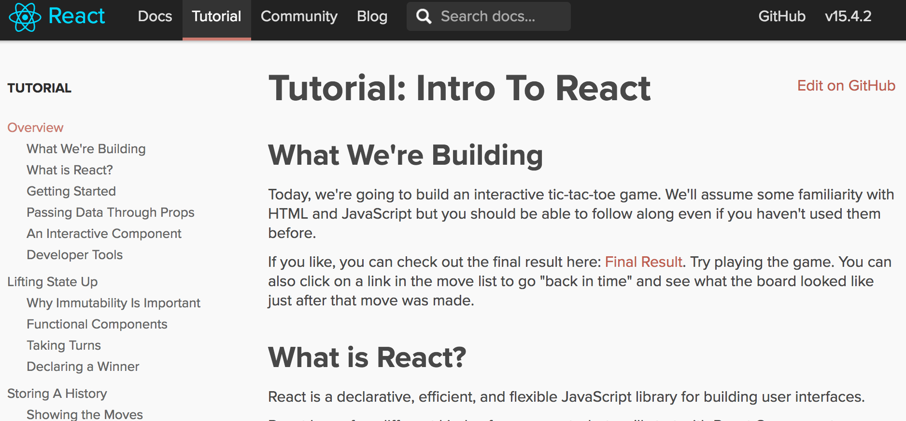
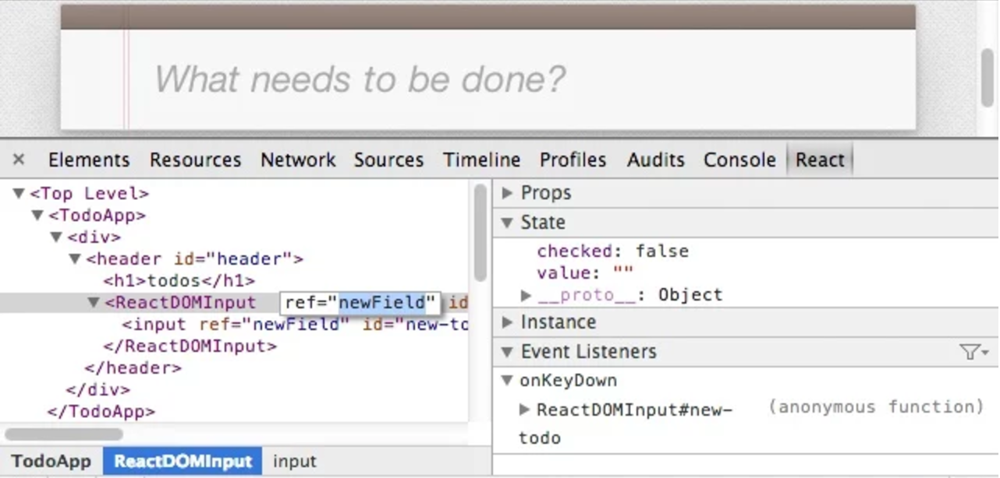

# Navigating the React Solar System

<br />

## Ben Ilegbodu

<br />

[@benmvp](https://twitter.com/benmvp) | [benmvp.com](/) | [@moderndotweb](https://twitter.com/moderndotweb)

<br />

May 23, 2017  

NOTES:
- My name is Ben Ilegbodu
- If you're new to React you might hear that on top of learning React, you need to know ES6, Redux, inline styles, server-side rendering, etc.
- It can be so overwhelming
- So I want to walk through the different "planets" in the React solar system so you can get an idea of how to prioritize what to learn
- Posted link to slides on twitter if you want to follow along

/////

<!-- .slide: data-background="url(../../img/giphy/stand-up.gif) no-repeat center" data-background-size="cover" -->

# Stand Up!
<!-- .element: style="-webkit-text-stroke: black 4px; color: white" -->

NOTES:
- But first, would like everyone to stand up!
- Let's do some wall sits
- Let's roll our shoulders
- Let's stretch our arms
- Now turn to your neighbors, introduce yourself & say hi
- You don't realize it, but I just tricked you
- Now you can't say that you didn't get anything out of my talk
- You at least got two things:
- Exercise & and met some people you didn't know
- But hopefully you'll get more out of the talk!

=====

ben-ilegbodu.json

<div style="display:flex;align-items:center">
	<div style="flex:0 0 50%;">
		<pre class="large"><code class="lang-json">
{
  "name": "Ben Ilegbodu",
  "priorities": [
    "Jesus", "family", "work"
  ],
  "location": "Pittsburg, CA",
  "work": "Eventbrite",
  "role": "Engineering Manager",
  "hobbies": [
    "basketball", "DIY", "movies"
  ]
}
			</code></pre>
	</div>
	<div style="flex:0 0 50%;">
		
	</div>
</div>

NOTES:
- Now that you've all met, more about me...

/////


<!-- .element: style="border: 0; background: none; margin: 0; box-shadow: none;" -->

NOTES:
- Currently Frontend Platform Manager at Eventbrite
- We've built up a whole new React-based stack to replace Backbone/Marionette

/////

<!-- .slide: data-background="url(../../img/giphy/james-harden-pot-cook.gif) no-repeat center" data-background-size="contain" -->

=====

<!-- .slide: data-background="url(../../img/nav-react/solar-system.jpg) no-repeat center" data-background-size="cover" -->

# React solar system
<!-- .element: style="-webkit-text-stroke: black 4px; color: white" -->

NOTES:

/////

## Agenda

0. React
0. JavaScript
0. Tooling
0. Styling
0. Single-Page Apps
0. Testing
0. Performance & SEO
0. App Data Management
0. API Optimization

=====

<!-- .slide: data-background="url(../../img/nav-react/sun.jpg) no-repeat center" data-background-size="cover" -->

# The Sun: React
<!-- .element: style="-webkit-text-stroke: black 4px; color: white" -->

NOTES:
- At the center of this solar system obviously is React
- Make sense that it'd be the sun because React is on fire right now!

/////

<div style="display:flex;align-items:center;justify-content:space-around;">
    
    <div>
		<h2><a href="https://facebook.github.io/react/docs/reusable-components.html#stateless-functions">Functional & Reactive</a></h2>
		<h2><a href="https://facebook.github.io/react/docs/interactivity-and-dynamic-uis.html#components-are-just-state">Uni-directional</a></h2>
		<h2><a href="https://facebook.github.io/react/docs/jsx-in-depth.html">Declarative JSX</a></h2>
		<h2><a href="https://facebook.github.io/react/docs/reconciliation.html">Virtual DOM</a></h2>
		<h2><a href="https://facebook.github.io/react/docs/top-level-api.html">Narrow API</a></h2>
    </div>
</div>

NOTES:
- Learn React and learn it _really_ well
- I could just leave it at that
- Don't have time to explain it
- React is highly functional & reactive with a uni-directional data flow
- If you're used to MVC with Backbone or Ember, it'll take some time to wrap your head around the concepts
- Then of course there's JSX syntax
- Ensuring that you're fully leveraging the Virtual DOM and not directly manipulating DOM nodes takes time
- But thankfully the API is really narrow so there's not that much learn
- You can build a lot of great UIs with just JSX & the React API

/////

## Imperative jQuery

```html
<div>
	<input type="text" class="valueBox" value="0" />
	<button class="btnUp">+</button>
</div>
```
<!-- .element: class="large" -->

```js
$('.btnUp').click(function() {
	var $valueBox = $('.valueBox'),
		currentValue = parseInt($valueBox.val(), 10);

	$valueBox.val(currentValue + 1);
});
```
<!-- .element: class="large" -->

<div>
	<input type="text" class="valueBox" value="0" size="1" style="font-size: 2em;text-align: center" />
	<button class="btnUp" style="font-size: 2em" onclick="$('.valueBox').val(+$('.valueBox').val() + 1)">&nbsp;&nbsp;+&nbsp;&nbsp;</button>
</div>

NOTES:
- For simple task, imperative code is easy to follow

/////

## Declarative React

```js
export default class Incrementer extends React.PureComponent {
  state = {value: 0}

  _handleClick() {
	this.setState((prevState) => ({value: prevState.value + 1}))
  }
  render() {
	return (
	  <div>
		<input type="text" defaultValue={this.state.value} />
		<button onClick={this._handleClick.bind(this)}>+</button>
	  </div>
    )
  }
}
```
<!-- .element: class="large" -->

NOTES:
- Combining the markup with the JavaScript
- Updating state causes an optimized re-render via Virtual DOM
- As the UI gets more sophisticated React will scale much better

/////


<!-- .element: style="width: 85%;" -->

[React official tutorial](https://facebook.github.io/react/tutorial/tutorial.html)

NOTES:
- With the official React tutorial you can learn how to use React by including a couple of script tags
- It teaches all the core concepts
- It's written in ES6, so...

/////

## [React exposed! 😮](http://www.benmvp.com/slides/2017/forwardjs/react-exposed.html)

<iframe width="1333" height="750" src="https://www.youtube.com/embed/cAYMqBU7Qko" frameborder="0" allowfullscreen></iframe>

### ForwardJS Spring 2017

NOTES:
- I gave a talk call _React exposed! 😮_ at ForwardJS earlier in March
- Talk about some details about _how_ React works in order to explain _why_ we have to write some of the React code we write
- Feel free to watch the video (not now)

=====

<!-- .slide: data-background="url(../../img/nav-react/mercury.jpg) no-repeat center" data-background-size="cover" -->

# Mercury: JavaScript
<!-- .element: style="-webkit-text-stroke: black 4px; color: white" -->

NOTES:
- React IMO is even easier to write with ES6+
- Outside of the JSX syntax, React is just JavaScript, so learning ES6+ makes writing it easier
- Chances are if you learn React, you're gonna learn it with some ES6+ concepts

/////

## Useful ES2015+ features w/ React

- Modules
- Classes
- Spread operator
- Destructuring
- Block scoping
- Arrow functions
- Object literal shorthand
- Async functions
- and more...

NOTES:
- Let's take a super quick look at some features

/////

## [React + ES.next = ♥](http://www.benmvp.com/slides/2017/reactconf/react-esnext.html)

<iframe width="1333" height="750" src="https://www.youtube.com/embed/jh_Qzi-yHU0" frameborder="0" allowfullscreen></iframe>

### ReactConf 2017

NOTES:
- I gave a talk call _React + ES.next = ♥_ at ReactConf 2017
- What I just talked about was just a small snippet of all the different features
- Feel free to watch the video (not now)

/////

## JavaScript Resources

- [_Learning ES6_ series](/learning-es6-series/)
- [ES6 Katas](http://es6katas.org/)
- [Eventbrite ES6+ coding style guide](https://github.com/eventbrite/javascript/tree/master/es6)
- [Eventbrite ES6+ ESLint configuration](https://github.com/eventbrite/javascript/tree/master/packages/eslint-config-eventbrite)

=====

<!-- .slide: data-background="url(../../img/nav-react/venus.jpg) no-repeat center" data-background-size="cover" -->

# Venus: Tooling
<!-- .element: style="-webkit-text-stroke: black 4px; color: white" -->

NOTES:
- Here's where things start getting a bit gnarly
- Probably the biggest complaint w/ React isn't React itself, but the tooling needed to get setup
- I think there problem is that there's so much choice and you need to know how the tools work before you can get up and running

/////

## React Dev Tools

Help debug React props & state


<!-- .element: style="width: 75%;" -->

Available for [Chrome](https://chrome.google.com/webstore/detail/react-developer-tools/fmkadmapgofadopljbjfkapdkoienihi?hl=en) and [Firefox](https://addons.mozilla.org/en-US/firefox/addon/react-devtools/)

NOTES:
- Let's start easy
- The React Dev Tools are super helpful in debugging React props & state
- You just browse the React component tree just like the DOM tree and you can look at the component props as well as the state
- Available for Chrome & Firefox. Sorry Edge users.

/////

## Package managers

Help include & manage helper libraries

<div style="display:flex;align-items:flex-end;justify-content:space-between;margin-top:5%">
	<div style="flex:0 0 30%;">
        <a href="https://www.npmjs.com"></a>
		<a href="https://www.npmjs.com">NPM</a>
    </div>
	<div style="flex:0 0 30%;">
        <a href="https://bower.io"></a>
		<a href="https://bower.io">Bower</a>
    </div>
	<div style="flex:0 0 30%;">
        <a href="https://yarnpkg.com/"></a>
		<a href="https://yarnpkg.com/">Yarn</a> (new-ish)
    </div>
</div>

NOTES:
- Two major players are NPM & Bower
- But pretty much everyone uses NPM
- Never used Bower before, but have seen some older packages that area available on both
- Funniest thing: you install Bower with NPM!
- Facebook just released Yarn last October!

/////

<div style="display:flex;align-items:center;justify-content:space-around;margin-bottom: 5%">
	<div style="flex:0 0 50%;">
		
	</div>
    <div style="flex:0 0 45%;">
		<h2>Flat Mode</h2>
        <h2>Offline Mode</h2>
        <h2>Deterministic</h2>
		<h2>Multiple Registries</h2>
		<h2>Network Resilience</h2>
        <h2>Network Performance</h2>
    </div>
</div>

NOTES:
- Flat Mode: Resolve mismatching versions of dependencies to a single version to avoid creating duplicates.
- Offline Mode: If you've installed a package before, you can install it again without any internet connection.
- Deterministic: The same dependencies will be installed the same exact way across every machine regardless of install order.
- Multiple Registries: Install any package from either npm or Bower and keep your package workflow the same.
- Network Resilience: A single request failing won't cause an install to fail. Requests are retried upon failure.
- Network Performance: Yarn efficiently queues up requests and avoids request waterfalls in order to maximize network utilization.

/////

## Bundlers

Help gather dependencies, transpile ES6+, etc.

<div style="display:flex;align-items:flex-end;justify-content:space-around;margin-top:5%">
	<div style="flex:0 0 18%;">
        <a href="https://webpack.github.io/"></a>
		<a href="https://webpack.github.io/">Webpack</a>
    </div>
	<div style="flex:0 0 18%;">
        <a href="http://browserify.org/"></a>
		<a href="http://browserify.org/">Browserify</a>
    </div>
	<div style="flex:0 0 18%;">
        <a href="http://rollupjs.org/"></a>
		<a href="http://rollupjs.org/">Rollup</a>
    </div>
	<div style="flex:0 0 18%;">
        <a href="http://jspm.io/"></a>
		<a href="http://jspm.io/">JSPM</a>
    </div>
    <div style="flex:0 0 18%;">
        <a href="http://requirejs.org/"></a>
		<a href="http://requirejs.org/">RequireJS</a> (no!)
    </div>
</div>

NOTES:
- This is space has a lot of players
- Webpack is the prevailing bundler right now; it just came on the scene 2 years ago w/ much fanfare
- Browserify came before and was the main bundler, but as it's name states, it focused on the browser
- Rollup & SystemJS seem to be the new up-and-comers that lots of folks are excited about now. I think it has to do w/ "Webpack config fatigue"
- Rolup works specifically with ES6 modules and has a "tree-shaking" feature that results in less generated code
- JSPM is another option that...
- RequireJS is the original, but just isn't well suited at all for modern web development practices
- Haven't used Browserify or Rollup, used Webpack & RequirejS heavily, used JSPM once in a workshop
- I'd say go with Webpack, espeically because of `webpack-dev-server`
- Webpack 2.0 has "tree-shaking" too
- It's at this step where the "JavaScript fatigue" really kicks in. Your typical JS developer doesn't want to or know how to configure these bundlers

/////

## Tree-Shaking

<div style="display:flex;justify-content:space-between;margin-top:1%">
	<div style="flex:0 0 48%;">
		ES2015 modules go in...
		<pre><code class="lang-js">// math.js

// This function isn't used anywhere, so
// Rollup excludes it from the bundle...
export const square = (x) => x \* x

// This function gets included
export const cube = (x) => x \* x \* x
		</code></pre>

		<pre><code class="lang-js">// main.js
import {cube} from './math.js'

console.log(cube(5)) // 125
		</code></pre>
	</div>
	<div style="flex:0 0 48%;">
		...bundle comes out
		<pre><code class="lang-js">// This function isn't used anywhere, so
// Rollup excludes it from the bundle...

// This function gets included
function cube(x) {
	return x \* x \* x
}

console.log(cube(5)) // 125
		</pre>
	</div>
</div>

NOTES:
- With Rollup's tree-shaking functions in a reference module that aren't used don't get bundled

/////

## Task runners

Help execute shell commands, generate files, etc.

<div style="display:flex;align-items:flex-end;justify-content:space-around;margin-top:5%">
	<div style="flex:0 0 25%;">
        <a href="http://gruntjs.com/"></a>
		<a href="http://gruntjs.com/">Grunt</a>
    </div>
	<div style="flex:0 0 25%;">
        <a href="http://gulpjs.com/" style="display:block"></a>
		<a href="http://gulpjs.com/">Gulp</a>
    </div>
	<div style="flex:0 0 25%">
        <a href="http://www.benmvp.com"></a>
		<a href="https://docs.npmjs.com/misc/scripts">NPM</a>
    </div>
</div>

NOTES:
- Build files, run shell scripts, etc.
- Grunt was the original & dominant
- Then because grunt files were unmanageable
- So gulp approached it with streams in a functional way
- But with "building fatigue" and the fact that webpack could do so much of this for us
- NPM scripts have lately become the rage. Essentially wrappers around command line calls
- If things are simple, use npm scripts.
- If things are complex, use gulp since it's functional

/////

## NPM/Yarn Scripts

```json
{
  "scripts": {
    "start": "webpack-dev-server --hot --inline --open",
    "build": "webpack --progress --colors",
    "eslint": "eslint .",
    "lint": "yarn run scss-lint && yarn run eslint",
    "scss-lint": "scss-lint .",
	"test": "mocha tests/*.spec.js",
	"validate": "yarn run lint && yarn run test"
  }
}
```
<!-- .element: class="large" -->

```
$> yarn run validate
```
<!-- .element: class="large" -->

NOTES:
- For something simple like this, NPM scripts are great!
- But I have some package.json files that have 25+ scripts that generate files, etc
- In that case, and actual build system like gulp makes sense
- But it's good to always have NPM scripts to abstract the build system
- So if things change underneath the commands the user calls stay the same
- Speaking of linting...

/////

## Static Analyzers

Help catch errors in written code before runtime

<div style="display:flex;align-items:flex-end;justify-content:space-around;margin-top:5%">
	<div style="flex:0 0 30%;">
        <a href="http://eslint.org/"></a>
		<a href="http://eslint.org/">ESLint</a>
    </div>
	<div style="flex:0 0 30%;">
        <a href="https://flowtype.org/" style="display:block"></a>
		<a href="https://flowtype.org/">Flow</a>
    </div>
	<div style="flex:0 0 30%;">
        <a href="https://www.typescriptlang.org/"></a>
		<a href="https://www.typescriptlang.org/">TypeScript</a>
    </div>
</div>

NOTES:
- The static analyzers help you catch errors in your code before it ever executes
- ESLint: originally just for stylistic code preferences but can catch common errors including in JSX
- Flow & Typescript are both static type checkers
- Flow is exclusively for type checking
- TypeScript is a superset of JavaScript that includes type checking plus future language constructs
- It introduced classes before they were in ES2015. It has interfaces which JS does not
- I like the idea of static type-checking, but TypeScript might be too far into the C#/Java realm
- I have used Flow, and in practice is not so great

/////

## Flow type inference

```js
/* @flow */
const foo = (x) => x * 10

foo('Hello, world!')
```
<!-- .element: class="large" -->

```
$> flow

2:   x * 10
     ^ string. This type is incompatible with
2:   x * 10     
     ^ number
```
<!-- .element: class="large" -->

NOTES:
- Flow supports type inference
- So without even changing the code, it can start providing helpful feedback
- In this case we're trying to multiple a passed string by `10` which is obviously wrong

/////

## Tooling Recap

- React Dev Tools
- Package Managers (yarn)
- Bundlers (webpack)
- Task Runners (npm/yarn)
- Static Analyzers (eslint)

NOTES:
- So this is everything you need to set up your React app
- And I didn't even go into a bunch of nitty gritty details
- This has been the biggest complaint about React. How to get started
- So the fine folks at Facebook did something about it...

/////

## Create React App

Create React apps with no build configuration

```
$> yarn global add create-react-app

$> create-react-app awesome-app

$> cd awesome-app

$> yarn start
```
<!-- .element: class="large" style="margin:5% 0" -->

NPM/Yarn, Webpack 2, ESLint, and more!

NOTES:
- They created Create React App
- Allows you to bootstrap super quick
- Folks familiar with Ember are probably laughing at how excited the React community is with this

/////

## Tooling resources

- [Create React App](https://facebook.github.io/react/blog/2016/07/22/create-apps-with-no-configuration.html)
- [Node Version Manager](https://github.com/creationix/nvm)
- [Awesome npm resources and tips](https://github.com/sindresorhus/awesome-npm)
- [Yarn vs NPM: Everything You Need to Know](https://www.sitepoint.com/yarn-vs-npm/)
- [JSPM vs Webpack](http://ilikekillnerds.com/2015/07/jspm-vs-webpack/)
- [webpack dev server](https://webpack.github.io/docs/webpack-dev-server.html)
- [Flow + React](https://flowtype.org/docs/react.html)

NOTES:
- Here are some miscellaneous resources regarding the tools we talked about

=====

<!-- .slide: data-background="url(../../img/nav-react/earth.jpg) no-repeat center" data-background-size="cover" -->

# Earth: Styling
<!-- .element: style="-webkit-text-stroke: black 4px; color: white" -->

NOTES:
- Let's talking about styling because visuals are just as important as interaction
- There are _at least_ 4 ways to tackle the styling problem

/////

## Global CSS

Use CSS that exists on the page outside of React

```js
const Card = ({title, imageUrl, message}) => (
  <div className="card">
    <h2 className="card__title">{title}</h2>
	
	<p className="card__message">{message}</p>
  </div>
)
```
<!-- .element: class="large" style="margin:5% 0" -->

NOTES:
- You'd use the Global CSS option if you are transitioning to React and already have your CSS being built by some other process
- You probably already have components that you're transitioning to React so you keep the same "global" CSS classes


/////

## Global CSS

Use CSS that exists on the page outside of React

```css
/* global.scss */

/* lots of other styles before */

.card { }
.card__title { }
.card__image { }
.card__message { }

/* lots of other styles after */
```
<!-- .element: class="large" style="margin:5% 0" -->

NOTES:
- Use BEM syntax as a convention to prevent name collisions

/////

## Component CSS

Associate React components with CSS snippet

```js
import './Card.scss'

const Card = ({title, imageUrl, message}) => (
  <div className="card">
    <h2 className="card__title">{title}</h2>
	
	<p className="card__message">{message}</p>
  </div>
)
```
<!-- .element: class="large" style="margin:5% 0" -->

NOTES:
- This is the exact same as Global CSS except the CSS is imported by the Component
- Therefore if the Component isn't used the CSS won't be included in the bundle

/////

## Component CSS

Associate React components with CSS snippet

```css
/* Card.scss */

.card { }
.card__title { }
.card__image { }
.card__message { }
```
<!-- .element: class="large" style="margin:5% 0" -->

NOTES:
- Same BEM style CSS class names convention because eventually it'll all be merged
- If the convention is broken you could still have collisions
- Hopefully your global CSS was already modularized, so this transition shouldn't be tough

/////

## CSS Modules

Automatically scope CSS class names to the component

```js
import css from './Card.scss'

const Card = ({title, imageUrl, message}) => (
  <div className={css.root}>
    <h2 className={css.title}>{title}</h2>
	
	<p className={css.message}>{message}</p>
  </div>
)
```
<!-- .element: class="large" style="margin:5% 0" -->

NOTES:
- Similar to Component CSS except the import of the CSS will return an object lookup with a generated class name

/////

## CSS Modules

Automatically scope CSS class names to the component

```css
/* Card.scss (source) */

.root { }
.title { }
.image { }
.message { }
```
<!-- .element: class="large" style="margin:5% 0" -->

NOTES:
- No need for naming conventions
- Just name the classes what they are w/o worry about collision

/////

## CSS Modules

Automatically scope CSS class names to the component

```css
/* Card.scss (generated) */

.Card__root___d74hQ { }
.Card__title___37fhU { }
.Card__image___ndh2e { }
.Card__message___84QQj { }
```
<!-- .element: class="large" style="margin:5% 0" -->

NOTES:
- The generated CSS classes will be unique so there's no way they can collide
- The generated markup will also have the same class names

/////

## Inline styles

Forgo CSS classes in favor of inline styles

```js
import styles from './Card.styles'

const Card = ({title, imageUrl, message}) => (
  <div style={styles.root}>
    <h2 style={styles.title}>{title}</h2>
	
	<p style={styles.message}>{message}</p>
  </div>
)
```
<!-- .element: class="large" style="margin:5% 0" -->

NOTES:
- The last option is to just go with inline styles
- As a result there's no chance of class name collisions or unexpected CSS cascade
- There's been a big huge for this in React mainly because of React Native because it doesn't support CSS
- If you want to share components across React & React Native you can't use CSS

/////

## Inline styles

Forgo CSS classes in favor of inline styles

```js
const styles = {
  root: {
	  display: 'flex',
	  flexDirection: 'row'
  },
  title: {
	  fontWeight: 'bold',
	  fontSize: '2em'
  }
  ...
}
export default styles
```
<!-- .element: class="large" style="margin:5% 0" -->

/////

## Styling resources

- [Glamorous](https://github.com/paypal/glamorous#inspiration)
- [Radium](https://formidable.com/open-source/radium/)
- [CSS Modules](https://github.com/css-modules/css-modules) & [React CSS Modules](https://github.com/gajus/react-css-modules)
- [React-Bootstrap](https://react-bootstrap.github.io/) / [Material UI](http://www.material-ui.com/#/) / [React + Foundation](https://react.foundation/)
- [Classnames](https://github.com/JedWatson/classnames)
- [PostCSS](http://postcss.org/)

NOTES:
- Here are some miscellaneous resources regarding styling
- React CSS Modules is cool because you don't even have to use the css object, but use special `styleName` attribute and it figures it all out for you

=====

<!-- .slide: data-background="url(../../img/nav-react/mars.jpg) no-repeat center" data-background-size="cover" -->

# Mars: Single-Page Apps
<!-- .element: style="-webkit-text-stroke: black 4px; color: white" -->

NOTES:
- Moving along to libraries needed for Single Page Apps

/////

## Fetch API

Handle AJAX natively

```js
fetch('http://www.benmvp.com/', {method: 'get'})
  .then((response) => {
	// do something w/ response
  })
  .catch((err) => {
	// handle error
  })
```
<!-- .element: class="large" style="margin:5% 0" -->

NOTES:
- Your favorite "walled garden" JS framework had a mechanism for making AJAX requests
- React does not come with a way because it's just the UI side
- You could use jQuery, but that could lead you to to using it improperly with React
- Instead we're going to a native AJAX implementation, new Fetch API
- Works with ES2015 Promises

/////

## Fetch API

Handle AJAX natively
<!-- .element: style="margin-bottom:5%" -->

- [Using Fetch](https://developer.mozilla.org/en-US/docs/Web/API/Fetch_API/Using_Fetch)
- [Learning ES6: Promises](http://www.benmvp.com/learning-es6-promises/)
- [`window.fetch` polyfill](https://github.com/github/fetch)
- [Load Initial Data via AJAX](https://facebook.github.io/react/tips/initial-ajax.html)

NOTES:
-

/////

## Routing

Keep your UI in sync with the URL

<div style="display:flex;align-items:flex-end;justify-content:space-around;margin-top:5%">
	<div style="flex:0 0 45%;">
        <a href="https://github.com/ReactTraining/react-router"></a>
		<a href="https://github.com/ReactTraining/react-router">React Router</a>
    </div>
	<div style="flex:0 0 45%;text-align:center">
        <a href="https://github.com/swipely/aviator"></a>
		<a href="https://github.com/swipely/aviator" style="display:block">Aviator</a>
    </div>
</div>

NOTES:
- React Router is the obvious choice. Major player
- There are many others but most aren't actively developed anymore

/////

## React Router

```js
import {render} from 'react-dom'
import {BrowserRouter, Route, Link} from 'react-router-dom'
// import App, About & Repos components

render((
  <BrowserRouter>
    <ul role="nav">
	  <li><Link to="/about">About</Link></li>
	  <li><Link to="/repos">Repos</Link></li>
    </ul>

    <Route exact={true} path="/" component={App}/>
    <Route path="/repos" component={Repos}/>
    <Route path="/about" component={About}/>
  </BrowserRouter>
), document.getElementById('app'))
```
<!-- .element: class="large" -->

NOTES:
- Can set up your routes with the same JSX syntax pointing to components
- Then replace `<a>` tags with special `<Link>` tags

=====

<!-- .slide: data-background="url(../../img/nav-react/asteroid-belt.jpg) no-repeat center" data-background-size="cover" -->

# Asteroid Belt
<!-- .element: style="-webkit-text-stroke: black 4px; color: white" -->

NOTES:
- At this point we've hit the asteroid belt
- We actually have everything we need to build apps
- But there's more to cover
- Moving into the needs of large-scale apps

=====

<!-- .slide: data-background="url(../../img/nav-react/jupiter.jpg) no-repeat center" data-background-size="cover" -->

# Jupiter: Testing
<!-- .element: style="-webkit-text-stroke: black 4px; color: white" -->

NOTES:
- Now the TDD proponents are prolly shaking their fists at me that this is all the way at Jupiter!

/////

## Testing Stacks

<div style="display:flex;align-items:flex-end;justify-content:space-around;margin-top:5%">
	<div style="flex:0 0 30%;">
        <a href="https://mochajs.org"></a>
        <a href="http://chaijs.com/"></a>
		<a href="https://mochajs.org">Mocha</a> + <a href="http://chaijs.com/">Chai</a>
    </div>
	<div style="flex:0 0 30%;">
        <a href="https://facebook.github.io/jest/"></a>
		<a href="https://facebook.github.io/jest/" style="display:block">Jest</a>
    </div>
	<div style="flex:0 0 30%;">
        <a href="https://github.com/avajs/ava"></a>
		<a href="https://github.com/avajs/ava">Ava</a>
    </div>
</div>

NOTES:
- Much like how there are many options for JS frameworks, there are many for JS testing frameworks
- Some are micro libraries like Mocha & Chai that do specific things (Chai is just for assertions)
- Others are like Jest (built on Jasmine) that do it all
- Jest also has auto-mocking so dependencies are mocked by default
- Makes life easy if you have a lot of dependencies you don't want executed while testing
- There's also Ava that had some buzz around it, but it seems like for React testing it hasn't caught on

/////

## Jest + Enzyme

```js
import {mount} from 'enzyme'
import toJson from 'enzyme-to-json'
import Link from './Link'

it('renders correctly', () => {
  let wrapper = mount(
     <Link page="http://www.facebook.com">Facebook</Link>
  )

  expect(toJson(wrapper)).toMatchSnapshot()
})
```
<!-- .element class="large" style="margin:5% 0" -->

(See: [`enzyme-to-json`](https://github.com/adriantoine/enzyme-to-json))

/////

## Jest Snapshots

```js
exports[`Link renders correctly 1`] = `
<a
  className="normal"
  href="http://www.facebook.com"
  onMouseEnter={[Function]}
  onMouseLeave={[Function]}>
  Facebook
</a>
`;
```
<!-- .element class="large" -->

/////

## Testing Resources

- [Eventbrite React Testing Best Practices](https://github.com/eventbrite/javascript/blob/master/react/testing.md)
- [Jest 14.0: React Tree Snapshot Testing](https://facebook.github.io/jest/blog/2016/07/27/jest-14.html)
- [Ava + React](https://github.com/avajs/ava/blob/master/docs/recipes/react.md)

=====

<!-- .slide: data-background="url(../../img/nav-react/saturn.jpg) no-repeat center" data-background-size="cover" -->

# Saturn: Performance & SEO
<!-- .element: style="-webkit-text-stroke: black 4px; color: white" -->

NOTES:
- Chances are if you're building an app of significant size SEO & initial render speed will matter
- Rendering server-side can help both
- This is called "Isomorphic/Universal React"
- Rendering the same components server-side improves initial startup performance because content is already there
- Google includes rendering speed in their ranking algorithm which affects SEO
- There's also Open Graph previews as well
- React provides a method that will render the component tree to a string which you can include in server response

/////

## Server-side Rendering
<!-- .element style="margin-bottom: 5%" -->

### With a Node back-end...
<!-- .element style="margin-bottom: 2.5%" -->

- [Express](https://expressjs.com/) server
- [`node-fetch`](https://github.com/bitinn/node-fetch) or [`isomorphic-fetch`](https://github.com/matthew-andrews/isomorphic-fetch)
- React Router

NOTES:
- If your back-end is on Node, the solution is pretty easy

/////

## Server-side Rendering

### [Without a Node back-end...](http://www.benmvp.com/slides/2017/render/iso-react.html)

<iframe width="1333" height="750" src="https://www.youtube.com/embed/zxtcr8Zuvfs" frameborder="0" allowfullscreen></iframe>

NOTES:
- If your backend is in Django / Rails / .Net / etc. it's a bit more challenging
- But I have a talk that explains it all!

=====

<!-- .slide: data-background="url(../../img/nav-react/uranus.jpg) no-repeat center" data-background-size="cover" -->

# Uranus: App Data Management
<!-- .element: style="-webkit-text-stroke: black 4px; color: white" -->

NOTES:
- We're starting to get further out from the center
- Gonna call it Uranus, but as we'll see learning these libraries can be a pain in the Uranus
- Up until this point, we've been using React to store application data
- Once the data becomes too complex or too many components want to modify that data it's time for a data management library!

/////

## Flux Design pattern


<!-- .element style="width:90%" -->

NOTES:
- Enter the Flux design pattern
- If you've seen anything about Flux, no doubt you've seen this diagram
- And if you're like me, the first time it was explained to you, it didn't make sense
- And if you're like me, it didn't make sense the second time either
- I think I had to see it at least 3 or four times until I really got it
- And really it wasn't until I fully understood React, that I could grasp what the Flux pattern was conveying
- That's why I think workshops are doing newbies a disservice by trying to teach React _AND_ Flux at the same time
- The Flux pattern is basically about making application state mutations predictable

/////

## Flux Implementations

Make application state mutations predictable

<div style="display:flex;align-items:flex-end;justify-content:space-around;margin-top:5%">
	<div style="flex:0 0 18%;">
        <a href="http://facebook.github.io/flux/"></a>
		<a href="http://facebook.github.io/flux/">Flux</a>
    </div>
	<div style="flex:0 0 18%;">
        <a href="http://redux.js.org/"></a>
		<a href="http://redux.js.org/">Redux</a>
    </div>
	<div style="flex:0 0 18%;">
        <a href="http://mobxjs.github.io/mobx/"></a>
		<a href="http://mobxjs.github.io/mobx/">MobX</a>
    </div>
    <div style="flex:0 0 18%;">
		<a href="https://github.com/reflux/refluxjs">Reflux</a>
    </div>
	<div style="flex:0 0 18%;">
        <a href="http://alt.js.org/"></a>
		<a href="http://alt.js.org/">Alt</a>
    </div>
</div>

NOTES:
- Number of implementations of Flux
- Originally there was just the pattern and we're on our own
- At Eventbrite we created our own Flux implementation using Backbone (not that great)
- The Facebook came out with Flux due to demand
- Later Dan Ambramov created Redux which has been basically the main implementation that everyone uses
- Look we're talking about Redux wayyyy later!

/////

## Immutability

Provide immutable collections for JavaScript

<div style="display:flex;align-items:center;justify-content:space-around;margin-top:5%">
	<div style="flex:0 0 45%;">
        <a href="https://facebook.github.io/immutable-js/"></a>
    </div>
    <div style="flex:0 0 45%;">
		<a href="https://github.com/rtfeldman/seamless-immutable"><code>seamless-immutable</code></a>
    </div>
</div>

NOTES:
- While on the subject of mutating state...
- By default, JavaScript arrays, objects and other collections are mutable
- Normally you would just enforce a standard that data cannot be mutated. That's how React works
- This leads to a lot of defensive copying with the spread operator
- Making lots of copies can hurt performance
- Instead you can use a library like Immutable or `seamless-immutable` to have true immutable objects
- Immutable is the big player, yet another library from Facebook
- Only used it a bit, but found the API a bit cumbersome and then I was constantly going to and from Immutable objects. Don't _really_ want my React components to have to care, just Redux
- `seamless-immutable` is an alternative that has data structures that are backwards-compatible
- The work just like Arrays or Objects except they don't mutate and have extra functionality
- A lot lighter than Immutable

/////

## `seamless-immutable`

```js
let array = Immutable(['totally', 'immutable', {hammer: 'no!'}])

array[1] = `I'm going to mutate you!`
console.log(array[1]) // "immutable"

array[2].hammer = 'hm, surely I can mutate this nested object...'
console.log(array[2].hammer) // "no!"

console.log(JSON.stringify(array))
// '["totally", "immutable", {"hammer":"no!"}]'
```
<!-- .element class="large" -->

NOTES:
- Looks and acts just like arrays and objects and can pass to libraries like underscore or lodash

=====

<!-- .slide: data-background="url(../../img/nav-react/neptune.jpg) no-repeat center" data-background-size="cover" -->

# Neptune: API Optimization
<!-- .element: style="-webkit-text-stroke: black 4px; color: white" -->

NOTES:

- As your app grows larger you may find that you're making lots of Rest API requests
- A single user action can result in 3 or more AJAX requests because of how the micro-services are divided
- There are cutting-edge technologies to tackle this problem

/////

## API Optimization

<div style="display:flex;align-items:center;justify-content:space-around;margin-top:5%">
	<div style="flex:0 0 30%;">
        <a href="https://facebook.github.io/relay/"></a>
		<a href="https://facebook.github.io/relay/">Relay</a>
    </div>
	<div style="flex:0 0 30%;">
        <a href="http://dev.apollodata.com/"></a>
		<a href="http://dev.apollodata.com/">Apollo</a>
    </div>
	<div style="flex:0 0 30%;">
        <a href="http://netflix.github.io/falcor/"></a>
		<a href="http://netflix.github.io/falcor/" style="display:block">Falcor</a>
    </div>
</div>

NOTES:
- Facebook & Netflix tackled the same problem with different approaches
- Facebook came up with GraphQL, a generic query language for APIs
- Relay is a connection of React to GraphQL
- Falcor models all backend data as a single Virtual JSON object & clients request a subset of the model on-demand
- It has a JavaScript API
- In both cases you get only the data you want, nothing more, nothing less
- Gotta change your traditional REST API to be compatible

=====

## Review

0. React
0. JavaScript
0. Tooling
0. Styling
0. Single-Page Apps
0. Testing
0. Performance & SEO
0. App Data Management
0. API Optimization

NOTES:
- Excited that there are now only 8 planets.
- If Pluto was still a planet I would've had to develop a new set of libraries just to make my metaphor work

/////

## Facebook Libraries

<div style="display:flex;flex-wrap:wrap;align-items:center;justify-content:center">
	<div style="flex:0 0 25%">
		<a href="https://facebook.github.io/react/"></a>
	</div>
	<div style="flex:0 0 25%">
		<a href="https://yarnpkg.com/"></a>
	</div>
	<div style="flex:0 0 25%">
		<a href="https://flowtype.org/" style="display:block"></a>
	</div>
	<div style="flex:0 0 25%">
		<a href="https://facebook.github.io/jest/"></a>
	</div>
	<div style="flex:0 0 25%">
		<a href="http://redux.js.org/"></a>
	</div>
	<div style="flex:0 0 25%">
		<a href="http://facebook.github.io/flux/"></a>
	</div>
	<div style="flex:0 0 25%">
		<a href="http://graphql.org/"></a>
	</div>
	<div style="flex:0 0 25%">
		<a href="https://facebook.github.io/relay/"></a>
	</div>
</div>

NOTES:
- So here are ALL the open-source libraries Facebook has put out
- I think all that's missing is routing (react-router) & bundling (Webpack)
- Makes me wonder if Facebook is a social networking company or an OSS company

=====


<!-- .element: style="width: 60%" -->

NOTES:
- So some quick shoutouts before I wrap

/////


<!-- .element: style="width: 50%;border: 0; background: none; margin: 0; box-shadow: none;" -->

NOTES:
-

/////


<!-- .element: style="border: 0; background: none; margin: 0; box-shadow: none;" -->

/////

# YOU!
<!-- .element: style="font-size:12em" -->

NOTES:
- It's my hope that, the main reason I do this, is so you learn something new to make you a better developer
- Any feedback would be appreciated!

=====


<!-- .element: style="width: 60%" -->

# THANKS!     <!-- .element: style="-webkit-text-stroke: white 2px" -->

NOTES:

/////

# Questions?

<br />

## Ben Ilegbodu

[benmvp.com](/) | [@benmvp](https://twitter.com/benmvp) | [ben@benmvp.com](mailto:ben@benmvp.com)  
[github/benmvp](https://github.com/benmvp)

<br />

Ask me anything! [benmvp.com/ama](http://www.benmvp.com/ama/)

NOTES:
- Slides are available on Twitter and Blog
- Ask questions on Twitter, via email or AMA!
