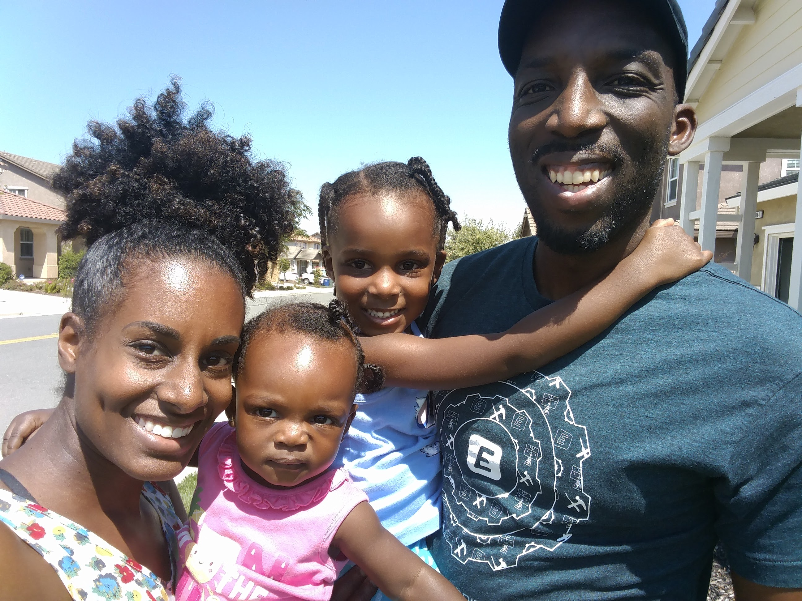
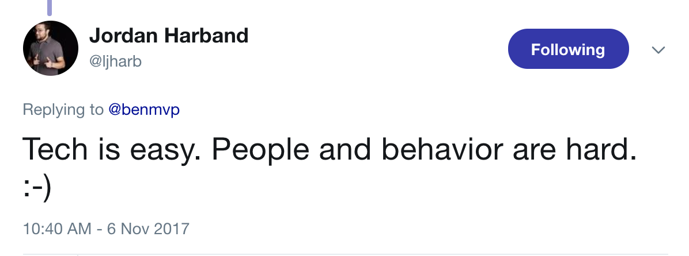

# Why choose React?

 

## Ben Ilegbodu

 

[@benmvp](https://twitter.com/benmvp) | [benmvp.com](/) | [#nodevember2017](https://twitter.com/hashtag/nodevember2017)  

 

November 28, 2017  

NOTES:
- My name is Ben Ilegbodu
- Here to pull back the covers on how Eventbrite decided to make the switch from Backbone to React
- Posted link to slides on twitter if you want to follow along

/////

NOTES:
- Beyond excited to be giving the CLOSING KEYNOTE here at Nodevember
- Truly an honor
- Because 2 years ago I was novice speaker hoping for a chance
- Had such a great time sharing about ES6 and learn so much
- And now I'm back

=====

## What this talk is **not** about... 😞

 

- Intro to React
- React is better than _X_
- React 💕 fest

NOTES:
- The goal of this talk is not to teach you React, so you can go off and build the next app that's gonna change the game
- Even if I wanted to, not possible in an hour
- Also not gonna be framework bashing; talking about how React is better than Angular or Vue
- Although I am basically saying it's better than Backbone since switched
- Lastly, not gonna be a React love-fest
- There's no perfect framework; there are trade-offs and I'll point them out
- So hopefully if you're still investigating, you'll get a somewhat balanced opinion

/////

## What this talk is about! 😄

 

- Rationales explained in code
- For everyone!
- Shameless plugs

NOTES:
- Wanna walk through the many reasons why we made the switch
- But not just talk about; I want to demonstrate it w/ code
- Also, given that this is a keynote for everyone I wanted to make it useful to everyone
- So if you've never used React, it should be a good primer
- But if you're hardcore React, hopefully I can hit you w/ some tips
- Heads up!
- I've had the opportunity now to speak about a variety of different React topics over the last year
- Throughout the talk I'll be giving shameless plugs to those talks
- Forewarning you now, so you can get all of your eye rolls out early

=====

<!-- .slide: data-background="url(../../img/giphy/stand-up.gif) no-repeat center" data-background-size="cover" -->

# Stand Up!
<!-- .element: style="-webkit-text-stroke: black 4px; color: white" -->

NOTES:
- But first, would like everyone to stand up!
- Let's do some wall sits
- Let's roll our shoulders
- Let's stretch our arms
- Now turn to your neighbors, introduce yourself & say hi
- You don't realize it, but I just tricked you
- Now you can't say that you didn't get anything out of my talk
- You at least got two things:
- Exercise & and met some people you didn't know
- But hopefully you'll get more out of the talk!

/////

## me.json

	

		
	

	

		<pre class="large"><code class="lang-json">
{
  "name": "Ben Ilegbodu",
  "priorities": [
    "Jesus", "family", "work"
  ],
  "location": "Pittsburg, CA",
  "work": "Eventbrite",
  "role": "Principal UI Engineer",
  "hobbies": [
    "basketball", "DIY", "movies"
  ]
}
			</code></pre>
	

NOTES:

/////

<!-- .element: style="border: 0; background: none; margin: 0; box-shadow: none;" -->

NOTES:

/////

<!-- .element: style="width: 85%" -->

NOTES:
- So I'm from Houston
- And although basketball is my sport
- I was definitely watching the Astros in the World Series

=====

# Why choose React?

NOTES:
- Let's jump right in

/////

NOTES:
- I've been in the industry for about a dozen years
- And I've come to realize that software development isn't just the code you commit
- There's an equal human element to it
- Whenever doing something buy-in is equally as important as the technical approach
- When difficulties arise, the difference between folks complaining or rallying to find a solution, is buy-in
- We had tried React a couple of times, ran into issues, and people threw out the baby w/ the bathwater
- So this time, in early 2016, I put together a loooong document to explain why our Frontend Platform team thought we should make the switch
- The rest of the talk is a talk-friendly distillation of that doc

=====

# Declarative JSX

=====

# Component-driven

=====

# All JavaScript*

=====

# State-driven

=====

# Sophisticated reconciler

### (Virual DOM)

=====

# Server-side rendering

=====

# Testing

=====

# React Native

### (...and other renderers)

=====

# Unopionated

=====

# Other stuff...

=====

## Recap

- Declarative JSX
- Component-driven
- All JavaScript*
- State-driven
- Sophisticated reconciler
- Server-side rendering
- Testing
- React Native
- Unopionated
- ...and more!

NOTES:
- Again these are the reasons **we** made the switch to React
- I'm sure there are plenty other great reasons as well

=====

## Additional resources

NOTES:

=====

<!-- .element: style="width: 35%" -->

## Ben Ilegbodu

[benmvp.com](/) | [@benmvp](https://twitter.com/benmvp) | [ben@benmvp.com](mailto:ben@benmvp.com)  
[github/benmvp](https://github.com/benmvp)
  

Ask me anything! [benmvp.com/ama](http://www.benmvp.com/ama/)

NOTES:
- So that's it!
- Wanted to thank Nodevember for inviting me to share with you
- Let's celebrate them for putting on another great conference
- Thanks to Eventbrite too for sponsoring and flying me out
- We're hiring!
- Also thank YOU for attending and sticking around!
- My goal is for you to learn at least one thing you can take away to be a better dev
- Slides are available on Twitter and Blog
- Ask questions on Twitter, via email or AMA!
- Thanks and enjoy the rest of the conference!
