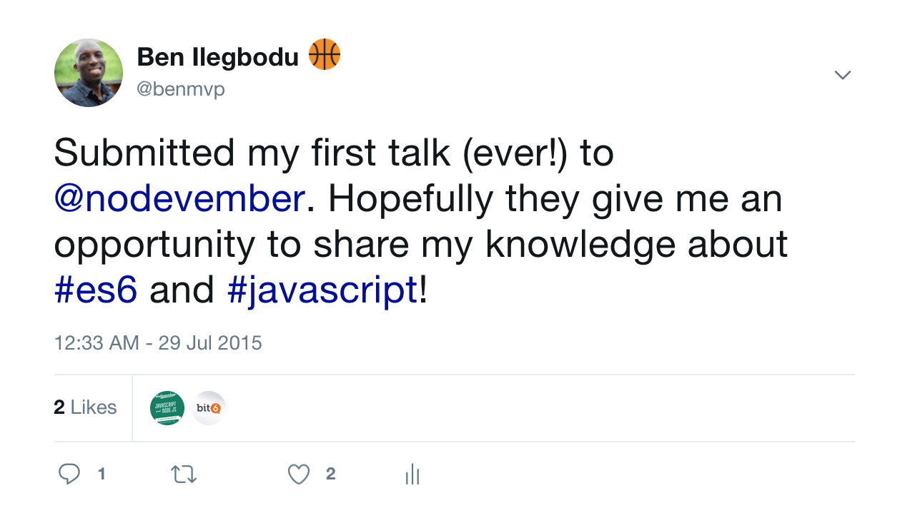

# Why choose React?

<br />

## Ben Ilegbodu

<br />

[@benmvp](https://twitter.com/benmvp) | [benmvp.com](/) | [#nodevember2017](https://twitter.com/hashtag/nodevember2017)  

<br />

November 28, 2017  

NOTES:
- My name is Ben Ilegbodu
- Here to pull back the covers on how Eventbrite decided to make the switch from Backbone to React
- Posted link to slides on twitter if you want to follow along

/////

[](https://twitter.com/benmvp/status/626294349148483584)

NOTES:
- Beyond excited to be giving the CLOSING KEYNOTE here at Nodevember
- Truly an honor
- Because 2 years ago I was novice speaker hoping for a chance
- Had such a great time sharing about ES6 and learn so much
- And now I'm back

=====

## What this talk is **not** about... 😞

<br />

- Intro to React
- React is better than _X_
- React 💕 fest

NOTES:
- The goal of this talk is not to teach you React, so you can go off and build the next app that's gonna change the game
- Even if I wanted to, not possible in an hour
- Also not gonna be framework bashing; talking about how React is better than Angular or Vue
- Although I am basically saying it's better than Backbone since switched
- Lastly, not gonna be a React love-fest
- There's no perfect framework; there are trade-offs and I'll point them out
- So hopefully if you're still investigating, you'll get a somewhat balanced opinion

/////

## What this talk is about! 😄

<br />

- Rationales explained in code
- For everyone!
- Shameless plugs

NOTES:
- Wanna walk through the many reasons why we made the switch
- But not just talk about; I want to demonstrate it w/ code
- Also, given that this is a keynote for everyone I wanted to make it useful to everyone
- So if you've never used React, it should be a good primer
- But if you're hardcore React, hopefully I can hit you w/ some tips
- And if not this can be an example of how to explain besides "it's awesome"
- Heads up!
- I've had the opportunity now to speak about a variety of different React topics over the last year
- Throughout the talk I'll be giving shameless plugs to those talks
- Forewarning you now, so you can get all of your eye rolls out early

=====

<!-- .slide: data-background="url(../../img/giphy/stand-up.gif) no-repeat center" data-background-size="cover" -->

# Stand Up!
<!-- .element: style="-webkit-text-stroke: black 4px; color: white" -->

NOTES:
- But first, would like everyone to stand up!
- Let's do some wall sits
- Let's roll our shoulders
- Let's stretch our arms
- Now turn to your neighbors, introduce yourself & say hi
- You don't realize it, but I just tricked you
- Now you can't say that you didn't get anything out of my talk
- You at least got two things:
- Exercise & and met some people you didn't know
- But hopefully you'll get more out of the talk!

/////

## me.json

<div style="display:flex;align-items:center">
	<div style="flex:0 0 50%;">
		
	</div>
	<div style="flex:0 0 50%;">
		<pre class="large"><code class="lang-json">
{
  "name": "Ben Ilegbodu",
  "priorities": [
    "Jesus", "family", "work"
  ],
  "location": "Pittsburg, CA",
  "work": "Eventbrite",
  "role": "Principal UI Engineer",
  "hobbies": [
    "basketball", "DIY", "movies"
  ]
}
			</code></pre>
	</div>
</div>

NOTES:

/////


<!-- .element: style="border: 0; background: none; margin: 0; box-shadow: none;" -->

NOTES:

/////


<!-- .element: style="width: 75%" -->


[xxhomey19/nba-go](https://github.com/xxhomey19/nba-go)

NOTES:
- I'm a huge basketball fan; love playing & watching
- Got so excited when I found this NBA Go CLI
- I use VS Code, which has the terminal pane right at the bottom
- So I could literally be following the game and coding at the same time!

=====

# Why choose React?

NOTES:
- Let's jump right in

/////

[](https://twitter.com/ljharb/status/927606717793296384)

NOTES:
- I've been in the industry for about a dozen years
- And I've come to realize that software development isn't just the code you commit
- There's an equal human element to it
- Whenever doing something buy-in is equally as important as the technical approach
- When difficulties arise, the difference between folks complaining or rallying to find a solution, is buy-in
- We had tried React a couple of times, ran into issues, and people threw out the baby w/ the bathwater
- So this time, in early 2016, I put together a loooong document to explain why our Frontend Platform team thought we should make the switch
- The rest of the talk is a talk-friendly distillation of that doc

=====

# Declarative JSX

/////

```js
class Incrementer extends React.Component {
  state = {value: 0}

  _handleClick = () => {
	this.setState((prevState) => ({value: prevState.value + 1}))
  }
  render() {
	return (
	  <div>
		<span className="val">{this.state.value}</span>
		<button onClick={this._handleClick}>+</button>
	  </div>
    )
  }
}
```
<!-- .element: class="large" -->

NOTES:
- Here's a rather simple component
- All it does is increment the value every time you click the button
- Want to zero on the `render()` method which is return this HTML-link syntax in our JavaScript
- Many people didn't like the syntax at first
- But I find it very approachable

/////

## JSX

```js
<div>
  <span className="val">{this.state.value}</span>
  <button onClick={this._handleClick}>+</button>
</div>
```
<!-- .element: class="large" -->

NOTES:
- Here it is close up


/////

## Transpiled JSX

```js
React.createElement(
  "div",
  null,
  React.createElement("span", {className: "val"}, value),
  React.createElement("button", {onClick: this._handleClick}, "+")
);
```
<!-- .element: class="large" -->

NOTES:
- Here it is transpiled; it's just JavaScript
- Thanks to the power of build tooling (Babel)
- We can write our code in friendly JSX
- But out comes normal JS
- I couldn't imagine building my React components like this

/////

## Collocated markup, logic & data

```js
class Incrementer extends React.Component {
  state = {value: 0}

  _handleClick = () => {
    this.setState((prevState) => ({value: prevState.value + 1}))
  }
  render() {
    return (
      <div>
        <span className="val">{this.state.value}</span>
        <button onClick={this._handleClick}>+</button>
      </div>
    )
  }
}
```
<!-- .element: class="large" -->

NOTES:
- With React, a component contains...
  * Markup (`render()`)
  - Logic (`_handleClick`)
  - Data (`this.state`)
- You can also include styling too, but not trying to start a flamewar over css-in-js right now
- So everything is collocated, which is very different than traditional MVC like Backbone

/////

## Traditional MVC equivalent

Backbone Model & View
```
var IncrementerModel = Backbone.Model.extend({
  defaults: {value: 0}
})
var IncrementerView = Backbone.View.extend({
  template: Handlebars.compile($('#tempalte').html()),
  events: {
    'click .js-btn': 'increment'
  },
  initialize: function() {
    this.listenTo(this.model, 'change', this.render)
  },
  increment: function() {
    this.model.set({value: this.model.get('value') + 1})
  },
  render: function() {
    this.$el.html(this.template(this.mode.attributes))
  }
})
```

NOTES:
- This is the traditional MVC equivalent in Backbone
- You have a separate file for template (markup), model & view (logic)
- Here's the logic
- THe idea is that we wanted to have a "separation of concerns"
- But it didn't happen in practice; especially as things got complex
- We used `js-*` prefix in our templates to safely reference them in views
- If the template changed, you needed to change the view
- If the model changed, you needed to change the tmeplate, and so on
- As things got complicated, hard to know the effects changing one would have on the other
- BTW - we're re-rendering everytime the model changes for simplicity, but bad perf

/////

## Traditional MVC equivalent

Handlebars template
```
<div>
  <span class="val">{{value}}</span>
  <button class="js-btn">+</button>
</div>
```
<!-- .element: class="large" -->

NOTES:
- Here's the template; it's simple enough
- But the templating languages were intended to be _just_ markup, so limited logic...

/////

## Logic in the template

```html
<select>
  {{#each values}}
    {{option_value}}
  {{/each}}
</select>
```
<!-- .element: class="large" -->

```js
Handlebars.registerHelper('option_value', function() {
  if (shouldShow(this)) {
    return new Handlebars.SafeString(
      '<option value="' + this.value + '">'
        + this.display + '</option>'
    )
  }
})
```
<!-- .element: class="large" -->

NOTES:
- And doing any kind of fancy logic got really, really messy
- Plus we'd basically have to basically learn a new language
- We created "helpers" so we could call functions in templates
- Alternative is to do a whole lot of pre-computation in the view to enable the template to be dumb
- Handlebars didn't even have `else-if`
- So we'd have a nested `if` w/in an `else`

/////

## Logic in React Component

```js
class Selector extends React.Component {
  render() {
    let options = this.props.values.map((info) => {
      if (this._shouldShow(info)) {
        return (
          <option key={info.value} value={info.value}>
            {info.display}
          </option>
        )
      }
    })

    return (<select>{options}</select>)
  }
}
```
<!-- .element: class="large" -->

NOTES:
- But with React, since our markup is in JavaScript
- We have the full use of JavaScript at our dispoable to build up the markup
- We also have linting, editor autocmoplete, and more around JavaScript the language
- There's no need, IMO, to invent a new language for logic

/////

## JSX is not HTML!

```
class Label extends React.Component {
  render() {
    return (
      <label className="is-hidden" htmlFor={this.props.inputId}>
        {this.props.children}
      </label>
    )
  }
}
```
<!-- .element: class="large" style="margin-bottom: 1em" -->

React JSX props mirror HTML DOM properties!

```
let labelNode = document.getElementById('label')
labelNode.className = 'is-hidden'
labelNode.htmlFor = inputId
```
<!-- .element: class="large" -->

NOTES:
- One con or gotcha, is that although JSX looks like HTML, it's not
- It's the `className` & `htmlFor` prop which make it **really** clear that this isn't HTML
- React chose to mirror the JS DOM API for its props which are all camelCase
- And that's why its `className` & `htmlFor` instead of the HTML `class` & `for`
- It's also why it's `onClick`, `onChange`, etc.
- React is pretty good at giving great warnings if you forget or mess up
- Especially with React 16

/////

## [React exposed! 😮](http://www.benmvp.com/slides/2017/forwardjs/react-exposed.html)

<iframe width="1333" height="750" src="https://www.youtube.com/embed/cAYMqBU7Qko" frameborder="0" allowfullscreen></iframe>

### ForwardJS Spring 2017

NOTES:
- Shameless plug alert!
- I gave a talk call _React exposed! 😮_ at ForwardJS earlier this year
- I go through several JSX gotchas among other topics
- Feel free to watch the video (not now)

=====

# Component-driven

/////

## Everything is a component!

```js
class FormField extends React.Component {
  render() {
    let name = this.props.name
    return (
      <div>
        <Label inputId={name}>{this.props.label}</Label>
        <TextInput
          id={name}
          value={this.props.value}
          onChange={this.props.onChange}
        />
      </div>
    )
  }
}
```
<!-- .element: class="large" -->

NOTES:
- The sole way you build your UI in React is with "custom" components
- Everything is a component!
- And you build bigger components by combining smaller components w/ markup
- Here we have a FormField component made up of `Label` & `TextInput` components
- It defines 4 `props`, which are how the component is configured

/////

## Everything is a component!

```js
import FormField from './FormField'
class NameForm extends React.Component {
  render() {
    return (
      <form onSubmit={this._handleSubmit}>
        <FormField
          name="fName"
          label="First"
          value={this.props.fields.first}
          onChange={this._handleFieldChange.bind(null, 'fName')}
        />
        <FormField name="lName" ... />
      </form>
    )
  }
}
```
<!-- .element: class="large" -->

NOTES:
- You include the component by importing it and then using it in `render()` like an HTML tag
- And you configure the props by passing them in via attributes, just like HTML
- Although we're in Javascript using JSX, the HTML-like syntax should feel familiar
- Then you can combine one or more `FormField` components to create a bigger form component
- And keep doing that until you have a full-fledged app

/////

## Eventbrite Design System


<!-- .element: style="border: 0; background: none; margin: 0; width: 85%" -->

NOTES:
- At Eventbrite we created our own component library
- It's filled with dozens of React components big and small
- But it's more than a component library; it's a design system
- Talks about _why_ components should be used, etc

/////

<div style="display:flex;align-items:center">
	<div style="flex:0 0 50%;">
		
	</div>
	<div style="flex:0 0 50%;">
		
	</div>
</div>

NOTES:
- Component-driven development seems pretty obvious right?
- All the popular libraries/frameworks are component-driven in their own way
- But not Backbone; you simply could not nest Backbone views
- Now we were also using Marionette; an architecture layer on top of Backbone
- The version we were using had Layouts, which could contain Views, which could _be_ layouts so nesting was possible
- But it was not nearly as effortless as what I just showed w/ React
- Configuring the nested views wasn't simple either
- It's the difference between components being the core vs. being an add-on
- We were stuck on the latest v1 version that came out mid-2014; think about how JS has changed since then

/////

## Explicitly passing data DOWN the tree

`App.js`
```
<NameForm fields={ ... } />
```
<!-- .element: class="large" style="margin-bottom: 1.5em" -->

`NameForm.js`
```
<FormField name="first" value={props.fields.first} />
```
<!-- .element: class="large" style="margin-bottom: 1.5em" -->

`FormField.js`
```
<TextInput value={props.value} />
```
<!-- .element: class="large" style="margin-bottom: 1.5em" -->

`TextInput.js`
```
<input type="text" value={props.value} />
```
<!-- .element: class="large" -->

NOTES:
- It's not all sunshine & roses; at least not for everyone
- If in my `App` I want to set the value of the HTML input for the first name...
- I pass it from `App` -> `NameForm` -> `FormField` -> `TextInput` that reners `<input>`
- This is _very_ explicit; you can clearly see how data flows down the component hierarchy
- I personally don't have a problem with it because I prefer the clarity; especially in code reviews
- But some find it verbose. If they could, they'd rather jump levels of the hierarchy to get it where it should
- But I've seen that introduce other gnarliness

/////

## Explicitly passing data UP the tree 

`App.js`
```
<NameForm onFieldChange={this._handleFieldChange} />
```
<!-- .element: class="large" style="margin-bottom: 1.5em" -->

`NameForm.js`
```
<FormField onChange={props.onFieldChange.bind(null, 'first')} />
```
<!-- .element: class="large" style="margin-bottom: 1.5em" -->

`FormField.js`
```
<TextInput onChange={props.onChange} />
```
<!-- .element: class="large" style="margin-bottom: 1.5em" -->

`TextInput.js`
```
<input type="text" onChange={props.onChange} />
```
<!-- .element: class="large" -->

NOTES:
- Similarly getting data back **up** the tree is also explicit
- Let's say the top-level App wants to react to changes in the `<input>` field
- Well we have to pass callback handlers down the tree as props
- So when `onChange` happens on `TextInput` -> `FormField` -> `NameForm` -> `App`
- In Backbone/Marionette we had global "radios" & components could register channels
- But no enforcement on who was sending/receiving

/////

## `<App />`

## ↓ &nbsp;&nbsp;&nbsp;&nbsp;&nbsp;&nbsp; ↑

## `<NameForm />`

## ↓ &nbsp;&nbsp;&nbsp;&nbsp;&nbsp;&nbsp; ↑

## `<FormField />`

## ↓ &nbsp;&nbsp;&nbsp;&nbsp;&nbsp;&nbsp; ↑

## `<TextInput />`

## ↓ &nbsp;&nbsp;&nbsp;&nbsp;&nbsp;&nbsp; ↑

## `<input />`


NOTES:
- This one-way circular data flow is a completely different way of thinking than traditional MVC
- It's probably the hardest thing to grasp in React, but one you do everything else falls into place

=====

# All JavaScript*

NOTES:
- Have the asterisk there because obviously we're building web apps so CSS is definitely involved

/////

[](https://twitter.com/dan_abramov/status/929136989085093890)

(...but [StackOverflow](https://stackoverflow.com/questions/22876978/loop-inside-react-jsx))

NOTES:
- Dan tweeted this in response to an RFC to add conditionals and loops into JSX
- I ❤️ JavaScript so the more I can do in JS the better
- I'm glad that I don't have to learn a new API to do conditionals/loops in JS
- Because it's JS, I can do whatever JS can do
- For some though, this is a drawback because you _have_ to know JS pretty well
- Before if you were solid at HTML/CSS, you could throw some jQuery around and do well
- I would say it's not intuitive: there's a StackOveflow question about loops that has > 300k views!
- Now it's JS or bust, which takes some getting used to

/////

## Conditional JSX

```
class Section extends React.Component {
  render() {
    let headingText = this.props.headingText

    return (
      <section className="section-correct">
        if (headingText) {
          <h1>{headingText}</h1>
        }
        <p>{this.props.children}</p>
      </section>
    )
  }
}
```
<!-- .element: class="large" -->

NOTES:
- All the string-based templating languages provide some facility for conditionally including markup
- In those cases, you're trying to replicate logic in the template
- May be tempted to do something like this
- Or... more likely just wonder how to accomplish conditionally including code
- Cuz this obviously looks like broken syntax
- Trying to include the `<h1>` only if `headingText` is defined
- This is a syntax error

/////

## Conditional JSX

```
class Section extends React.Component {
  render() {
    let headingText = this.props.headingText
    let headingElem

    if (headingText) {
      headingElem = (<h1>{headingText}</h1>)
    }
    return (
      <section className="section-correct">
        {headingElem}
        <p>{this.props.children}</p>
      </section>
    )
  }
}
```
<!-- .element: class="large" -->

NOTES:
- React doesn't have any special API to do loops or conditionals
- It just piggybacks on JavaScript
- Here's how I would do the conditional
- We can use normal JS to do conditionals instead of muddying up our JSX
- Conditionally assign a variable, and put that in our JSX

/////

## Conditional JSX

```
class Section extends React.Component {
  render() {
    let headingText = this.props.headingText
    let headingElem

    if (headingText) {
      headingElem = React.createElement('h1', null, headingText)
    }
    return React.createElement(
      'section',
      {className: 'section-correct'},
      headingElem,
      React.createElement('p', null, children)
    )
  }
}
```
<!-- .element: class="large" -->

NOTES:
- This is what the JSX would be transformed into
- So it really **is** all JavaScript
- It seems like a lot more code, so...

/////

## Conditional JSX

```
class Section extends React.Component {
  render() {
    let headingText = this.props.headingText

    return (
      <section className="section-correct">
        {headingText ? (<h1>{headingText}</h1>) : null}
	      <p>{this.props.children}</p>
      </section>
    )
  }
}
```
<!-- .element: class="large" -->

NOTES:
- Many people use a ternary for this to keep things short
- But at Eventbrite we strive to keep the JSX as "clean" as possible
- This might be "okay", but would get out of hand quickly
- I've seen ternaries spanning 10+ lines

/////

## React + ES.next = ❤️

```
class Section extends React.Component {
  render() {
    let headingText = this.props.headingText
    let headingElem

    if (headingText) {
      headingElem = (<h1>{headingText}</h1>)
    }
    return (
      <section className="section-correct">
        {headingElem}
        <p>{this.props.children}</p>
      </section>
    )
  }
}
```
<!-- .element: class="large" -->

NOTES:
- The nice thing about React, the JS UI lib, tying itself to JS instead of its own API is that as JS evolves it auto-evolves
- You probably already noticed that we were using `class`es to creat our React components
- That's ES6 that's become standard with React
- But we can take the previous `Section` component...

/////

## React + ES.next = ❤️

```
const Section = ({headingText, children}) => {
  let headingElem

  if (headingText) {
    headingElem = (<h1>{headingText}</h1>)
  }

  return (
    <section className="section-correct">
      {headingElem}
      <p>{children}</p>
    </section>
  )
}
```
<!-- .element: class="large" -->

NOTES:
- ...rewrite it using the latest JavaScript
- React components can be written as functions of their props
- Here we're using an arrow function instead of a standard function
- And we're immediately destructuring the props into `headerText` & `children`
- There's plenty more we can do too

/////

## Gotta have a build system

<div style="display:flex;align-items:flex-end;justify-content:space-around;margin: 2em 0">
	<div style="flex:0 0 22%;">
        <a href="https://babeljs.io/"></a>
		<a href="https://babeljs.io/">Babel</a>
  </div>
	<div style="flex:0 0 22%;">
        <a href="https://webpack.github.io/"></a>
		<a href="https://webpack.github.io/">Webpack</a>
  </div>
	<div style="flex:0 0 22%;">
        <a href="https://www.typescriptlang.org/"></a>
		<a href="https://www.typescriptlang.org/">TypeScript</a>
  </div>
	<div style="flex:0 0 22%;">
        <a href="http://rollupjs.org/"></a>
		<a href="http://rollupjs.org/">Rollup</a>
  </div>
</div>

Fun features like [tree-shaking](https://webpack.js.org/guides/tree-shaking/) & [code splitting](https://webpack.js.org/guides/code-splitting/)!

NOTES:
- But all this goodness comes at a cost
- We basically are forced to have a build system
- And that's where some combo of Babel, Webpack, TypeScript, Rollup, etc. come in
- Chances are for production apps you already had _some_ sort of build system
- Compile SASS -> CSS, minify & bundle JS, etc
- Paying the upfront cost of the build system enables cool features: tree-shaking & code splitting

/////

## Create React App

Create React apps with no build configuration

```
$> yarn add global create-react-app

$> create-react-app awesome-app

$> cd awesome-app

$> yarn start
```
<!-- .element: class="large" style="margin:5% 0" -->

Babel, Webpack 3, ESLint, and more!

NOTES:
- And you don't have to roll your own build system; at least not initially
- Create React App let's you bootstrap an app to start React-ing quickly

/////

## [React + ES.next = ♥](http://www.benmvp.com/slides/2017/reactconf/react-esnext.html)

<iframe width="1333" height="750" src="https://www.youtube.com/embed/jh_Qzi-yHU0" frameborder="0" allowfullscreen></iframe>

### ReactConf 2017

NOTES:
- Shameless plug alert!
- I gave a talk call _React + ES.next = ♥_ at React Conf back in March
- I go through a handful of ES.next features that go great with React
- Feel free to watch the video (not now)

=====

# State-driven

NOTES:
- So far we've basically been creating static user-interfaces; not user interaction
- To do that the state of the UI has to change over time

=====

# Sophisticated reconciler

### (Virual DOM)

=====

# Server-side rendering

=====

# Testing

=====

# React Native

### (...and other renderers)

=====

# Unopionated

=====

# Miscellaneous

=====

## Recap

- Declarative JSX
- Component-driven
- All JavaScript*
- State-driven
- Sophisticated reconciler
- Server-side rendering
- Testing
- React Native
- Unopionated
- ...and more!

NOTES:
- Again these are the reasons **we** made the switch to React
- I'm sure there are plenty other great reasons as well

=====

## Additional resources

- [Babel REPL](https://babeljs.io/repl/)
- [Eventbrite React coding styleguide](https://github.com/eventbrite/javascript/tree/master/react)


NOTES:

=====


<!-- .element: style="width: 35%" -->

## Ben Ilegbodu

[benmvp.com](/) | [@benmvp](https://twitter.com/benmvp) | [ben@benmvp.com](mailto:ben@benmvp.com)  
[github/benmvp](https://github.com/benmvp)
<br /><br />

Ask me anything! [benmvp.com/ama](http://www.benmvp.com/ama/)

NOTES:
- So that's it!
- Wanted to thank Nodevember for inviting me to share with you
- Let's celebrate them for putting on another great conference
- Thanks to Eventbrite too for sponsoring and flying me out
- We're hiring!
- Also thank YOU for attending and sticking around!
- My goal is for you to learn at least one thing you can take away to be a better dev
- Slides are available on Twitter and Blog
- Ask questions on Twitter, via email or AMA!
- Thanks and enjoy the rest of the conference!
