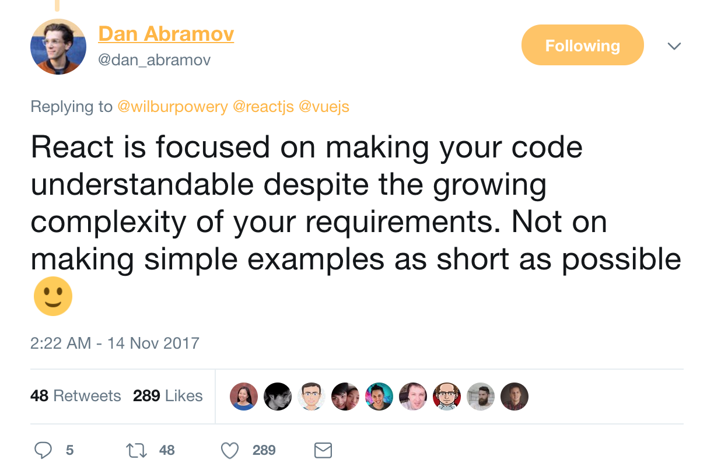
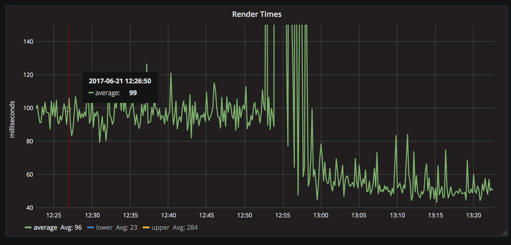
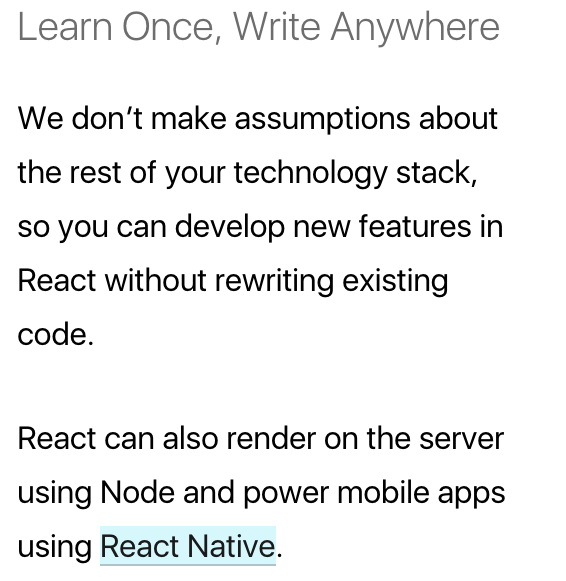

# Why choose React?

<br />

## Ben Ilegbodu

<br />

[@benmvp](https://twitter.com/benmvp) | [benmvp.com](/) | [#nodevember2017](https://twitter.com/hashtag/nodevember2017)  

<br />

November 28, 2017  

NOTES:
- My name is Ben Ilegbodu
- It was nearly 2 years ago that we embarked on the journey of transitioning our frontend from Backbone to React
- So this talk is about the first part of that transition: convincing everyone that it was a good idea 😀
- Wanna pull back the covers on the rationale we used to make that switch
- And if you're in the same boat, you'll have some solid reasons besides "everyone is doing it"
- Posted link to slides on twitter if you want to follow along

/////

[](https://twitter.com/benmvp/status/626294349148483584)

NOTES:
- Beyond excited to be giving the CLOSING KEYNOTE here at Nodevember
- Truly an honor
- Because 2 years ago I was novice speaker hoping for a chance
- And Nodevember gave me that chance
- Had such a great time sharing about ES6 and learned so much
- And now I'm back to talk about React

=====

## What this talk is **not** about... 😞

<br />

- Intro to React
- React is better than _X_
- React 💕 fest

NOTES:
- Quick heads up
- The goal of this talk is not to teach you React, so you can go off and build the next app that's gonna change the game
- Even if I wanted to, not possible in an hour
- Also not gonna be framework bashing; talking about how React is better than Angular or Vue
- Although I am basically saying it's better than Backbone since we switched
- Lastly, not gonna be a React love-fest
- There's no perfect framework; there are trade-offs and I'll try to point them out
- So hopefully if you're still investigating, you'll get a somewhat balanced opinion

/////

## What this talk is about! 😄

<br />

- Rationales explained in code
- For everyone!
- Shameless plugs

NOTES:
- Wanna walk through the many reasons why we made the switch
- But not just talk about; I want to demonstrate it w/ a lil' code
- Also, given that this is a keynote for everyone I wanted to make it useful to everyone
- So if you've never used React, it should be a good primer
- But if you're hardcore React, hopefully I can hit you w/ some tips
- And if not this can be an example of how to explain to others besides "it's awesome"
- Heads up!
- I've had the opportunity now to speak about a variety of different React topics over the last year
- Throughout the talk I'll be giving shameless plugs to those talks
- Forewarning you now, so you can get all of your eye rolls out early

=====

<!-- .slide: data-background="url(../../img/giphy/stand-up.gif) no-repeat center" data-background-size="cover" -->

# Stand Up!
<!-- .element: style="-webkit-text-stroke: black 4px; color: white" -->

NOTES:
- But first, would like everyone to stand up!
- Let's do some wall sits
- Let's roll our shoulders
- Let's stretch our arms
- Now turn to your neighbors, introduce yourself & say hi
- You don't realize it, but I just tricked you
- Now you can't say that you didn't get anything out of my talk
- You at least got two things:
- Exercise & and met some people you didn't know
- But hopefully you'll get more out of the talk!

/////

## me.json

<div style="display:flex;align-items:center">
	<div style="flex:0 0 50%;">
		
	</div>
	<div style="flex:0 0 50%;">
		<pre class="large"><code class="lang-json">
{
  "name": "Ben Ilegbodu",
  "priorities": [
    "Jesus", "family", "work"
  ],
  "location": "Pittsburg, CA",
  "work": "Eventbrite",
  "role": "Principal UI Engineer",
  "hobbies": [
    "basketball", "DIY", "movies"
  ]
}
			</code></pre>
	</div>
</div>

NOTES:

/////


<!-- .element: style="border: 0; background: none; margin: 0; box-shadow: none;" -->

NOTES:

/////


<!-- .element: style="width: 75%" -->


[xxhomey19/nba-go](https://github.com/xxhomey19/nba-go)

NOTES:
- I'm a huge basketball fan; love playing & watching
- Got so excited when I was told about the NBA Go CLI
- I use VS Code, which has the terminal pane right at the bottom
- So I could literally be following the game and coding at the same time!

=====

# Why choose React?

NOTES:
- Why choose React??
- Let's jump right in

/////

[](https://twitter.com/ljharb/status/927606717793296384)

NOTES:
- I've been in the industry for about a dozen years now
- And I've come to realize that software development isn't just the code you commit
- There's an equally important human element to it
- Whenever doing something buy-in is just as important as the technical approach
- When difficulties arise, it can be the difference between folks complaining or rallying to find a solution, is buy-in
- We had actually tried React a couple of times, ran into issues, and people concluded "React is no good"
- So this time, in early 2016, I put together a loooong document to explain why our Frontend Platform team thought we should make the switch
- And as I said "cuz everybody is using it!" wasn't a good enough reason 😉
- The rest of the talk is a talk-friendly distillation of that doc

=====

# 1. Declarative JSX

NOTES:
- The first reason why we wanted to migrate from Backbone to React was its Declarative JSX

/////

```js
class Incrementer extends React.Component {
  state = {value: 0}

  _handleClick = () => {
    this.setState((prevState) => ({value: prevState.value + 1}))
  }
  render() {
    return (
      <div>
        <span className="val">{this.state.value}</span>
        <button onClick={this._handleClick}>+</button>
      </div>
    )
  }
}
```
<!-- .element: class="large" -->

NOTES:
- Here's a rather simple component
- All it does is increment the value every time you click the button
- Want to zero on the `render()` method which is returning this HTML-link syntax in JavaScript
- Many people didn't like the syntax at first
- But I find it very approachable

/////

## JSX

```js
<div>
  <span className="val">{this.state.value}</span>
  <button onClick={this._handleClick}>+</button>
</div>
```
<!-- .element: class="large" -->

NOTES:
- Here it is close up
- Got a `<div>` wrapping a `<span>` display and a `<button>`
- What you may not realize is that this JSX gets converted into JavaScript


/////

## Transpiled JSX

```js
React.createElement(
  "div",
  null,
  React.createElement("span", {className: "val"}, value),
  React.createElement("button", {onClick: this._handleClick}, "+")
);
```
<!-- .element: class="large" -->

NOTES:
- Here it is transpiled; it's just JavaScript ultimately
- Thanks to the power of build tooling (aka Babel)
- We can write our code in friendly JSX
- But out comes normal JS
- I couldn't imagine building my React components like this

/////

## Collocated markup, logic & data

```js
class Incrementer extends React.Component {
  state = {value: 0}

  _handleClick = () => {
    this.setState((prevState) => ({value: prevState.value + 1}))
  }
  render() {
    return (
      <div>
        <span className="val">{this.state.value}</span>
        <button onClick={this._handleClick}>+</button>
      </div>
    )
  }
}
```
<!-- .element: class="large" -->

NOTES:
- With React, a component contains...
  * Markup (`render()`)
  - Data (`this.props` & `this.state`)
  - Logic (`_handleClick`)
- You can also include styling too, but not trying to start a flamewar over css-in-js right now
- So everything is collocated, which is very different than traditional MVC like Backbone

/////

## Traditional MVC equivalent

Backbone Model & View
```
var IncrementerModel = Backbone.Model.extend({
  defaults: {value: 0}
})
var IncrementerView = Backbone.View.extend({
  template: Handlebars.compile($('#template').html()),
  events: {
    'click .js-btn': 'increment'
  },
  initialize: function() {
    this.listenTo(this.model, 'change', this.render)
  },
  increment: function() {
    this.model.set({value: this.model.get('value') + 1})
  },
  render: function() {
    this.$el.html(this.template(this.mode.attributes))
  }
})
```

NOTES:
- This is the traditional MVC equivalent in Backbone
- You have a separate file for model & view (logic) as well as the template (markup)
- Here's the logic
- The idea is that we wanted to have a "separation of concerns"
- But it didn't happen in practice; especially as things got complex
- We used `js-*` prefix in our templates to safely reference them in views
- If the template changed, you needed to change the view
- If the model changed, you needed to change the template, and so on
- As things got complicated, hard to know the effects changing one would have on the other
- BTW - we're re-rendering everytime the model changes for simplicity, but bad perf

/////

## Traditional MVC equivalent

Handlebars template
```
<div>
  <span class="val">{{value}}</span>
  <button class="js-btn">+</button>
</div>
```
<!-- .element: class="large" -->

NOTES:
- Here's the template; it's simple enough
- A non-JS expert could come in and make changes in a familiar env
- But the templating languages were intended to be _just_ markup, so limited logic...

/////

## Logic in the template

```html
<select>
  {{#each values}}
    {{option_value}}
  {{/each}}
</select>
```
<!-- .element: class="large" -->

```js
Handlebars.registerHelper('option_value', function() {
  if (shouldShow(this)) {
    return new Handlebars.SafeString(
      '<option value="' + this.value + '">'
        + this.display + '</option>'
    )
  }
})
```
<!-- .element: class="large" -->

NOTES:
- And doing any kind of fancy logic got really, really messy
- Plus we'd basically have to basically learn a new language
- We created "helpers" so we could call functions in templates
- Alternative is to do a whole lot of pre-computation in the view to enable the template to be dumb
- Ya know, handlebars didn't even have `else-if`
- So we'd have a nested `if` w/in an `else`

/////

## Logic in React Component

```js
class Selector extends React.Component {
  render() {
    let options = this.props.values.map((info) => {
      if (this._shouldShow(info)) {
        return (
          <option key={info.value} value={info.value}>
            {info.display}
          </option>
        )
      }
    })

    return (<select>{options}</select>)
  }
}
```
<!-- .element: class="large" -->

NOTES:
- But with React, since our markup is in JavaScript
- We have the full use of JavaScript at our dispoable to build up the JSX to return
- We also have linting, editor auto-complete, and more around JavaScript the language
- There's no need, IMO, to invent a new language for logic

/////

## JSX is not HTML!

```
class Label extends React.Component {
  render() {
    return (
      <label className="is-hidden" htmlFor={this.props.inputId}>
        {this.props.children}
      </label>
    )
  }
}
```
<!-- .element: class="large" style="margin-bottom: 1em" -->

React JSX props mirror HTML DOM properties!

```
let labelNode = document.getElementById('label')
labelNode.className = 'is-hidden'
labelNode.htmlFor = inputId
```
<!-- .element: class="large" -->

NOTES:
- One con or gotcha, is that although JSX looks like HTML, it's not
- It's the `className` & `htmlFor` prop which make it **really** clear that this isn't HTML
- React chose to mirror the JS DOM API for its props which are all camelCase
- And that's why its `className` & `htmlFor` instead of the HTML `class` & `for`
- It's also why it's `onClick`, `onChange`, etc.
- React is pretty good at giving great warnings if you forget or mess up
- Especially with React 16

/////

## [React exposed! 😮](http://www.benmvp.com/slides/2017/forwardjs/react-exposed.html)

<iframe width="1333" height="750" src="https://www.youtube.com/embed/cAYMqBU7Qko" frameborder="0" allowfullscreen></iframe>

### ForwardJS Spring 2017

NOTES:
- Shameless plug alert!
- I gave a talk called _React exposed! 😮_ at ForwardJS earlier this year
- I go through several JSX gotchas among other topics

=====

# 2. Component-driven

NOTES:
- The next motivation for the transition was React's component-based architecture

/////

## Everything is a component!

```js
class FormField extends React.Component {
  render() {
    let name = this.props.name
    return (
      <div>
        <Label inputId={name}>{this.props.label}</Label>
        <TextInput
          id={name}
          value={this.props.value}
          onChange={this.props.onChange}
        />
      </div>
    )
  }
}
```
<!-- .element: class="large" -->

NOTES:
- The sole way you build your UI in React is with "custom" components
- Everything is a component!
- And you build bigger components by combining smaller components w/ markup
- Here we have a FormField component made up of `Label` & `TextInput` components
- It defines 4 `props` (`name`, `label`, `value` & `onChange`), which are how the component is configured
- It lays out the `Label` & `TextInput` and then passes along those props as configuration

/////

## Everything is a component!

```js
import FormField from './FormField'
class NameForm extends React.Component {
  render() {
    return (
      <form onSubmit={this._handleSubmit}>
        <FormField
          name="fName"
          label="First"
          value={this.props.fields.first}
          onChange={this._handleFieldChange.bind(null, 'fName')}
        />
        <FormField name="lName" ... />
      </form>
    )
  }
}
```
<!-- .element: class="large" -->

NOTES:
- You include the component by importing it and then using it in `render()` like an HTML tag
- And you configure the props by passing them in via attributes, just like HTML
- Although we're in Javascript using JSX, the HTML-like syntax should feel familiar
- Then you can combine one or more `FormField` components to create a bigger form component
- And keep doing that until you have a full-fledged app

/////

<div style="display:flex;align-items:center">
	<div style="flex:0 0 50%;">
    <a href="http://backbonejs.org/" target="_blank">
		  
    </a>
	</div>
	<div style="flex:0 0 50%;">
    <a href="https://marionettejs.com" target="_blank">
		  
    </a>
	</div>
</div>

NOTES:
- Component-driven development seems pretty obvious right?
- All the modern libraries/frameworks are component-driven in their own way
- But not Backbone; you simply could not nest Backbone views
- Began to use Marionette; an architecture layer on top of Backbone to help w/ more complex UIs
- The version we were using had Layouts, which could contain Views, which could _be_ layouts so nesting was possible
- But it was not nearly as effortless as what I just showed w/ React
- Configuring the nested views wasn't simple either
- It's the difference between components being the core vs. being an add-on
- Also, we were stuck on the latest v1 version that came out mid-2014; think about how JS has changed since then
- Marionette is still in active development: version 3

=====

# 3. All JavaScript*

NOTES:
- The 3rd reason was React being exclusively JavaScript based
- I have the asterisk there because obviously we're building web apps so CSS is obviously involved
- But I'm conveniently ignoring that for now 😀

/////

[](https://twitter.com/dan_abramov/status/929136989085093890)

(...but [StackOverflow](https://stackoverflow.com/questions/22876978/loop-inside-react-jsx))

NOTES:
- Dan tweeted this in response to a request to add conditionals and loops into JSX
- I ❤️ JavaScript so the more I can do in JS the better
- I'm glad that I don't have to learn a new API to do conditionals/loops in JS
- Because it's JS, I can do whatever JS can do
- But for some though, this is a drawback because you _have_ to know JS pretty well to be effective
- Before if you were solid at HTML/CSS, you could throw in some jQuery do really well
- Looping and conditionals in JSX is not intuitive
- That's a StackOveflow question about loops that has > 300k views and 520 upvote!
- Now it's JS or bust, which takes some getting used to

/////

## React + ES.next = ❤️

```
class Section extends React.Component {
  render() {
    let headingText = this.props.headingText
    let headingElem

    if (headingText) {
      headingElem = (<h1>{headingText}</h1>)
    }
    return (
      <section className="section-correct">
        {headingElem}
        <p>{this.props.children}</p>
      </section>
    )
  }
}
```
<!-- .element: class="large" -->

NOTES:
- The nice thing about React, the JS UI lib, tying itself to JS instead of its own API is that as JS evolves it auto-evolves
- You probably already noticed that we were using `class` keyword to create our React components
- That's ES6 and it's become standard with React
- This `Section` component _[describe what it does]_
- But we can take it and...

/////

## React + ES.next = ❤️

```
const Section = ({headingText, children}) => {
  let headingElem

  if (headingText) {
    headingElem = (<h1>{headingText}</h1>)
  }

  return (
    <section className="section-correct">
      {headingElem}
      <p>{children}</p>
    </section>
  )
}
```
<!-- .element: class="large" -->

NOTES:
- ...rewrite it using the latest JavaScript
- React components can be written as functions of their props
- Here we're using an arrow function instead of a standard function
- And we're immediately destructuring the props into `headerText` & `children`
- There's plenty more we can do too

/////

## Gotta have a build system

<div style="display:flex;align-items:flex-end;justify-content:space-around;margin: 2em 0">
	<div style="flex:0 0 22%;">
        <a href="https://babeljs.io/"></a>
		<a href="https://babeljs.io/">Babel</a>
  </div>
	<div style="flex:0 0 22%;">
        <a href="https://webpack.github.io/"></a>
		<a href="https://webpack.github.io/">Webpack</a>
  </div>
	<div style="flex:0 0 22%;">
        <a href="https://www.typescriptlang.org/"></a>
		<a href="https://www.typescriptlang.org/">TypeScript</a>
  </div>
	<div style="flex:0 0 22%;">
        <a href="http://rollupjs.org/"></a>
		<a href="http://rollupjs.org/">Rollup</a>
  </div>
</div>

Fun features like [tree-shaking](https://webpack.js.org/guides/tree-shaking/) & [code splitting](https://webpack.js.org/guides/code-splitting/)!

NOTES:
- But all this goodness comes at a cost
- We basically are forced to have a build system
- And that's where some combo of Babel, Webpack, TypeScript, Rollup, etc. come in
- Chances are for production apps you already had _some_ sort of build system
- Compile SASS -> CSS, minify & bundle JS, CoffeeScript, etc
- But paying the upfront cost of the build system enables cool features: tree-shaking & code splitting

/////

## Create React App

Create React apps with no build configuration

```
$> yarn add global create-react-app

$> create-react-app awesome-app

$> cd awesome-app

$> yarn start
```
<!-- .element: class="large" style="margin:5% 0" -->

Babel, Webpack 3, ESLint, and more!

NOTES:
- Thankfully though, you don't have to roll your own build system; at least not initially
- Create React App is a tool that let's you bootstrap an app to start React-ing quickly

/////

## [React + ES.next = ♥](http://www.benmvp.com/slides/2017/reactconf/react-esnext.html)

<iframe width="1333" height="750" src="https://www.youtube.com/embed/jh_Qzi-yHU0" frameborder="0" allowfullscreen></iframe>

### ReactConf 2017

NOTES:
- Shameless plug alert!
- I gave a talk called _React + ES.next = ♥_ at React Conf back in March
- I go through a handful of ES.next features that go great with React
- So if some of the features I was talking about didn't quite make sense, check it out!

=====

# 4. State-driven

NOTES:
- So far we've talked about (1) JSX, (2) Component-driven & (3) JavaScript
- And so far we've basically been creating static user-interfaces; not user interaction
- To do that the state of the UI has to change over time
- React components are state-driven instead of the more familiar event-driven
- This is the hardest thing to wrap your head around if you're new to React
- It's just a different way of building UIs
- But I've found it to be very compelling
- And this is the 4th motivator for the transition away from Backbone to React

/////

## Event-driven jQuery

```html
<div>
  <span class="val">0</span>
  <button class="btnUp">+</button>
</div>
```
<!-- .element: class="large" -->

```js
$('.btnUp').click(function() {
  var $val = $('.val'),
      currentValue = parseInt($val.html(), 10);

  $val.html(currentValue + 1);
});
```
<!-- .element: class="large" -->

<div>
	<span class="val" style="font-size: 2em;text-align: center;margin: 0 1em">0</span>
	<button class="btnUp" style="font-size: 2em" onclick="$('.val').html(+$('.val').html() + 1)">&nbsp;&nbsp;+&nbsp;&nbsp;</button>
</div>

NOTES:
- Here's some event-driven jQuery code that should be pretty familiar
- It's the jQuery equivalent of the `Incrementer` component we saw earlier when talking about JSX
- Click a button and update `<span>`
- The driver is the event
- The only way to get the app so that it displays 10 is to click the button 10 times
- If you were using Backbone you may have a model that you update as well, but it's basically same flow
- This is _really_ easy to follow (imperative), but as app grows in complexity, code turns into hot spaghetti

/////

## State-driven React

```js
class Incrementer extends React.Component {
  state = {value: 0}

  _handleClick = () => {
    this.setState((prevState) => ({value: prevState.value + 1}))
  }
  render() {
    return (
      <div>
        <span className="val">{this.state.value}</span>
        <button onClick={this._handleClick}>+</button>
      </div>
    )
  }
}
```
<!-- .element: class="large" -->

NOTES:
- Contrast this with the React code
- Used ES.next to keep my example as concise as possible
- Explanation of code...
- It's the handler that does the logic of incrementing the value; separation of concerns!
- And since `value` is already in `state` we don't have to get it from the DOM
- Then calling `setState` causes `render` to be called again
- Click again and the cycle continues
- In the old world `_handleClick` would've directly manipulated the DOM
- But instead we update the state and that will indirectly update the DOM
- Layer of indirection is hard to wrap head around

/////

## State-driven React

Dev work in React can be boiled down to 2 main areas...
<!-- .element: style="margin: 2em 0" -->

1. `render()` based on `props` & `state`
1. `onEvent` → transform data to generate new `state`
1. Profit 🎉

NOTES:
- So basically we do work in two main areas:
- 1) Define what we're going to `render()` based on `props` & `state`
- Can have conditional logic, loops, other sophisticated logic to determine what to render
- 2) When events happen, do stuff to transform data to generate new `state` (and `render` again)
- Where algorithms become really useful to transform data efficiently
- Can also do async transformation by making API calls

/////

[](https://twitter.com/dan_abramov/status/930380316463726593)

NOTES:
- When folks look at simple examples of "reactivity" in React, they find it to be too verbose; and it is
- But with React trades conciseness for predictability
- So you end up spending more time explicitly wiring things up together
- Buuuut... structure of your code can more or less stay the same as complexity grows
- Certainly not the case with jQuery or Backbone; things got cray
- But prepare yourself for the fact that it'll feel like you're writing "more code" in the beginning

=====

# 5. Sophisticated reconciler

### (aka Virtual DOM)

NOTES:
- Let's talk about our 5th reason for the transition:
- The killer feature of React: the Reconciler aka Virtual DOM
- Whenever anyone talks about React it's the cool feature they talk about
- So up until this point, it's looked like `render()` was rendering to the DOM
- But it's not...

/////

## React reconciler makes efficient updates easy 💯

```js
class Incrementer extends React.Component {
  state = {value: 0}

  _handleClick = () => {
    this.setState((prevState) => ({value: prevState.value + 1}))
  }
  render() {
    return (
      <div>
        <span className="val">{this.state.value}</span>
        <button onClick={this._handleClick}>+</button>
      </div>
    )
  }
}
```
<!-- .element: class="large" -->

NOTES:
- Let's take our example from before...
- When we call `setState` React calls `render()` w/ updated state
- So it looks like are re-rendering the `<div>` + children each time
- When we know all we _really_ are updating is _just_ the `innerHTML` of `<span>`
- `render()` is **not** updating DOM, but building up element hierarchy
- Basically a _new_ virtual representation of the DOM
- The reconciler (aka "Virtual DOM") keeps a copy of DOM, compares w/ newly rendered DOM and only updates changes
- So we don't have to do the hard work of figuring out how to make the "micro updates"
- We can just write our code the easy way: like it re-renders everything
- And React does the hard work of figuring out micro updates

/////

## No reconciler in Backbone 😩

```
var IncrementerView = Backbone.View.extend({
  template: Handlebars.compile($('#template').html()),
  events: {
    'click .js-btn': 'increment'
  },
  initialize: function() {
    this.listenTo(this.model, 'change', this.render)
  },
  increment: function() {
    this.model.set({value: this.model.get('value') + 1})
  },
  render: function() {
    this.$el.html(this.template(this.mode.attributes))
  }
})
```
<!-- .element: class="large" -->

NOTES:
- Here again is the equivalent Backbone code written to be "reactive"
- Probably not how it would normally be written; hard not to after knowing React
- It's really simple; `increment()` updates model & `model` calls `render()`
- But this will actually re-render the whole template blowing away prev DOM
- This is super inefficient especially for bigger chunks of DOM; will get flashes

/////

## Manual update in Backbone 😭

```
var IncrementerView = Backbone.View.extend({
  template: Handlebars.compile($('#template').html()),
  events: {
    'click .js-btn': 'increment'
  },
  increment: function() {
    this.model.set({value: this.model.get('value') + 1})
    $('.val').html(this.model.get('value'))
  },
  render: function() {
    this.$el.html(this.template(this.mode.attributes))
  }
})
```
<!-- .element: class="large" -->

NOTES:
- Instead of listening to model changes and re-rendering
- We _should_ just update the `innerHTML` of the `<span>` ourselves after updating the model
- Full `render` would only be for the initial render
- This is fine for this simple case; very easy to follow
- Nightmare when there are lots of events
- Confession: when I _have_ to go back to Backbone I just do it the easy way!
- If you see some UI flashing on Eventbrite, I may be to blame 😂

/////

## New Fiber Reconciler
<!-- .element: style="margin-bottom: 1em" -->

- Rewrite of reconciler
- Prioritizes UI updates
- Enables async rendering
- Improves perceived performance
- In recent major React version (v16)

NOTES:
- React recently released React 16, which included a complete rewrite of the reconciler now codenamed Fiber
- The Fiber reconciler can prioritize UI updates, which means that the UI can render asynchronously
- As a result we get greater perceived performance because the higher priority updates happen first
- And this is all happening in React 16 - the next major version

/////

## Update Priorities

<br />

- Synchronous
- Task
- Animation
- High
- Low
- Offscreen

NOTES:
- With the Fiber reconciler you'll be able to distinguish between different types of updates
- Synchronous (just like stack reconciler)
- Task        (next tick: keyboard)
- Animation   (before next frame)
- High        (pretty soon)
- Low         (delays are ok: API responses)
- Offscreen   (prep for display/scroll, not being rendered)

/////

## "Secret" code to enable (partial) async scheduling 🤐

<br />

- Open `node_modules/react-dom/cjs/react-dom.development.js`
- Replace "`fiberAsyncScheduling: false`" ➜ "`fiberAsyncScheduling: true`"

<br />

```
// make low-priority update
ReactDOM.unstable_deferredUpdates(() => {
  this.setState((state, props) => {
    // return updated state
  })
});
```
<!-- .element: class="large" -->

Source: [`react-fiber-resources`](https://github.com/koba04/react-fiber-resources#try-react-fiber-with-asynchronous-scheduling)

NOTES:
- Async scheduling is turned off in React 16
- Will be a opt-in feature flag to turn it on in future release
- But you can still try it out!
- First need to manually turn on async scheduling by turning on flag in `react-dom`
- Then you can use the unstable API `unstable_deferredUpdates` in `ReactDOM`
- This makes the `setState` a "low priority"
- Great for the results of API calls that can wait a bit
- Using `setState` updater function is even more important now
- `react-fiber-resources` has a sample app

/////

## [Layperson's guide to React Fiber](http://www.benmvp.com/slides/2017/reactrally/fiber.html)

<iframe width="1333" height="750" src="https://www.youtube.com/embed/q6QTxq_pFn0" frameborder="0" allowfullscreen></iframe>

### React Rally 2017

NOTES:
- Shameless plug alert!
- I gave a talk called _Layperson's guide to React Fiber_ at React Rally in August
- I talk a little bit about React Fiber and other goodies in React 16

=====

# 6. Server-side rendering

### (aka "Isomorphic React")

NOTES:
- Now we're halfway...
- Let's talk about the 6th reason: server-side rendering or "Isomorphic React"
- "Isomorphic JavaScript" or "Isomorphic React" is the idea of using the same templates rendered client-side on initial server render

/////

## "Isomorphic" vs. "Universal"


<!-- .element: style="width: 65%;" -->


<!-- .element: style="width: 65%;" -->

NOTES:
- _Isomorphic_ basically means two things that _look the same_, but actually _aren't the same_
- _Universal_ basically means that it works everywhere
- So when we talk about our components rendering client-side as well as server-side and React Native, _universal_ makes more sense
- But I actually still prefer "Isomorphic React" because it sounds cooler
- I feel like I sound smarter saying it

/////

## Isomorphic React

<div style="display:flex;align-items:center;justify-content:space-around;">
    
    <div>
		<h2>Performance</h2>
        <h2>SEO</h2>
        <h2>Open Graph</h2>
    </div>
</div>

NOTES:
- Three reasons:
- Performance: initial page render
- SEO: google includes page render speed in ranking algorithm
- Open Graph: media previews
- React, unlike other JS frameworks/libraries, is setup to render server-side, as we'll see
- Again, we're talking about the _initial_ render

/////

## React components only define **WHAT** to render!

```js
class Incrementer extends React.Component {
  state = {value: 0}

  _handleClick = () => {
    this.setState((prevState) => ({value: prevState.value + 1}))
  }
  render() {
    return (
      <div>
        <span className="val">{this.state.value}</span>
        <button onClick={this._handleClick}>+</button>
      </div>
    )
  }
}
```
<!-- .element: class="large" -->

NOTES:
- Let's return to our old friend the Incrementer component
- Up until this point I've kind of made it seem like `render()` was rendering to the DOM
- But that's not true!
- `render()` just informs what elements & child components should be rendered
- It doesn't dictate _how_ they should be rendered
- Which is actually a great thing!

/////

## DOM rendering happens at the root

```js
import React from 'react'
import ReactDOM from 'react-dom'
import App from './App'

const props = window.__SERVER_DATA__ || {};

ReactDOM.render(
  <App {..props} />, 
  document.getElementById('root')
)
```
<!-- .element: class="large" -->

NOTES:
- That typically happens in the entry point of your app
- You'll import from `react-dom` and use it's `render()` function
- Inserts your app into the DOM location
- And then when your app updates it produces a new component hierarchy
- `react-dom` is what takes that difference and applies it to the DOM

/////

## Render to string server-side!

```js
import React from 'react'
import ReactDOMServer from 'react-dom/server'
import App from './App'

const props = {
  // Data coalesced from DB / SOA calls
  // Data coalesced from Express GET/POST params
  // Data coalesced from other environment params
}

let markup = ReactDOMServer.renderToString(<App {...props} />)

// return `markup` in HTML response
```
<!-- .element: class="large" -->

NOTES:
- I bring up that distinction because that separation between building your UI and rendering to DOM...
- Allows for us to render the _exact same_ UI server-side to a string!
- This is such a huge feature!
- Before this, all UI libraries just assumed the DOM and you were manipulating DOM elements
- So getting your templates to run server-side was at best a pain; at worst in possible

/////

## Run your Node server in production mode!


<!-- .element: style="border: 0; background: none; margin: 0; box-shadow: none; width: 65%" -->

[github/aickin/react-16-ssr-perf](https://github.com/aickin/react-16-ssr-perf)

NOTES:
- If you do render server, make sure you run your Node server in production mode!
- Comparing Raw React 15, compiled React 15, and compiled React 16 beta 2
- Latest Node 4, 6 & 8
- 17x improvement just by upgrading systems
- At Eventbrite we didn't set `process.env=PRODUCTION` for like 6 months

/////

## Run your Node server in production mode! 🤦🏾‍♂️


<!-- .element: style="border: 0; background: none; margin: 0; box-shadow: none; width: 85%" -->

🤣🤣🤣

NOTES:
- Can you guess when we turned on the env var?? 🤣
- 2x improvement just by adding that env variable
- We went through this so you don't have to!

/////

<div style="display:flex;align-items:center;justify-content:space-between;margin-top:5%">
    <div style="flex:0 0 40%;">
        
    </div>
    <div style="flex: 0 0 5%;text-align:center">
        <h1>+</h1>
    </div>
    <div style="flex:0 0 45%;">
        
    </div>
</div>

([pybars](https://github.com/wbond/pybars3))

NOTES:
- At Eventbrite our backend is in Python/Django
- Currently solved the “dual rendering issue” using a lib called Pybars
- Our JS templates are written in Handlebars & Pybars converts the Handlebars into Python functions that return a string
- It's like what happens in the original JS
- Except it's super-duper slow because it was poorly written
- Tried to speed it up, but it was still like 10x slower than rendering in Django/Mako templates

/////

## [Isomorphic React sans Node??](http://www.benmvp.com/slides/2017/render/iso-react.html)

<iframe width="1333" height="750" src="https://www.youtube.com/embed/zxtcr8Zuvfs" frameborder="0" allowfullscreen></iframe>

### Render Conf 2017

NOTES:
- Shameless plug alert!
- I gave a talk called _Isomorphic React sans Node??_ at Render Conf earlier this year
- Because backend is Django, makes server-side rendering w/ React a bit tricky
- But we created a small Node service just for rendering components
- Passed it the path to the component and its props and it would give back the HTML
- This talk goes into all of the nitty gritty details plus various gotchas

=====

# 7. Testing

NOTES:
- The same component-based architecture that makes server-side rendering easy, also makes testing React easy
- Like any good UI lib/framework you wanna separate data logic from the UI
- The logic that help update state: utility functions, API, etc
- Vanilla Backbone was good at this; the Model architecture created a separation that was easily testable
- But when it came to testing UI logic: this markup should display based on a condition or a user action should call a handler
- Backbone like all the DOM-based UI libraries was bad
- Pretty much have to run tests in a browser or headless browser which brings a host of issues
- So the 7th reason for transition is about making testing life far simpler

/////

## Test public API only!

```js
class Incrementer extends React.Component {
  state = {value: 0}

  _handleClick = () => {
    this.setState((prevState) => ({value: prevState.value + 1}), () => {
      this.props.onIncrement(this.state.value)
    })
  }

  render() {
    return (
      <div>
        <span className="val">{this.state.value}</span>
        <button onClick={this._handleClick}>+</button>
      </div>
    )
  }
}
```

```
<Incrementer onIncrement={this._handleIncrement} />
```
<!-- .element: class="large" -->

NOTES:
- Again we have ol' faithful the `Incrementer` component
- Except this time after we click and update state, we also call `onIncrement` event handler prop
- At the bottom is an example of how you would call it
- We want to test the component's **public** API:
- The markup that it renders and the callback handlers it calls
- That's it! Don't want to test implementation details like `state` changes

/////

## Testing Render

```js
import {shallow} from 'enzyme'

it('renders a `.val`', () => {
  let wrapper = shallow(<Incrementer />)

  expect(wraper.find('.val')).toBePresent()
})
```
<!-- .element: class="large" -->

[Jest](https://facebook.github.io/jest/) + [Enzyme](http://airbnb.io/enzyme/) + [`jest-enzyme`](https://yarnpkg.com/en/package/jest-enzyme) = 😍

NOTES:
- We can test incrementer using Jest & Enzyme
- Here we're asserting that `Incremener` renders an element with `.val` class
- Enzyme has a jQuery-like interface for manipulating React components
- All w/o a browser
- "Rendering" is creating an enzyme wrapper
- Using Jest as the test framework; also created by Facebook
- `jest-enzyme` provides additional enzyme-specific assertions to Jest

/////

## Testing callbacks

```js
import {shallow} from 'enzyme';

it('calls `onIncrement` prop with current value', () => {
  let onIncrement = jest.fn()
  let wrapper = shallow(<Incrementer onIncrement={onIncrement} />)
  let button = wrapper.find('button')

  // simulate clicking twice
  button.simulate('click')
  button.simulate('click')

  expect(onIncrement).toHaveBeenCalledTimes(2)
  expect(onIncrement).toHaveBeenLastCalledWith(2)
})
```
<!-- .element: class="large" -->

NOTES:
- If you recall, when we click the button we call our `onIncrement` handler
- Well with enzyme we can simulate clicking the button w/o running in a browser!
- And with Jest we can provide a mock function using `jest.fn()`
- Then we can assert things on that mock:
- How many times it was called (twice for 2 clicks)
- What arguments it was last called with (2)
- So we shouldn't inspect the `state` of the component (which would be 2)
- Instead we assert on the value in the handler (the public API)
- Being able to unit test like this is a game-changer

/////

## Jest Snapshots and Beyond

<iframe width="1333" height="750" src="https://www.youtube.com/embed/HAuXJVI_bUs" frameborder="0" allowfullscreen></iframe>

### React Conf 2017

NOTES:
- I haven't given a talk on React testing, although maybe I should
- But Rogelio (Jest core team) gave a talk at React Conf earlier this year called _Jest Snapshots and Beyond_
- And he talks about another fun way to test React components with "snapshots"

=====

# 8. React Native

### (...and other renderers)

NOTES:
- Let's jump to the 8th reason for transitioning
- Eventbrite has 4 native apps: 2 on iOS & 2 on Android
- One set for people running events (organizer) / other set for people attending (attendee)
- We don't have any plans to replace our apps with React Native
- But should we need other apps, being able to use React Native is appealing

/////


<!-- .element: style="width: 50%" -->

NOTES:
- One of the benefits React mentions on its home page is that you can "Learn Once, Write Anywhere"
- Basically saying that once you learn React and its paradigms, you can build apps for any environment

/////

## React for the Web

```js
class Incrementer extends React.Component {
  state = {value: 0}

  _handleClick = () => {
    this.setState((prevState) => ({value: prevState.value + 1}))
  }
  render() {
    return (
      <div>
        <span className="val">{this.state.value}</span>
        <button onClick={this._handleClick}>+</button>
      </div>
    )
  }
}
```
<!-- .element: class="large" -->

NOTES:
- Let's bring back our good friend the `Incrementer` component one more time
- Here's what it looks like if we were writing for React in the web
- We're using HTML elements: `<div>`, `<span>` & `<button>`
- But...

/////

## React Native 😄

```js
import {View, Text, TouchableOpacity} from 'react-native'
class Incrementer extends React.Component {
  state = {value: 0}
  _handlePress = () => {
    this.setState((prevState) => ({value: prevState.value + 1}))
  }
  render() {
    return (
      <View>
        <Text style={...}>{this.state.value}</span>
        <TouchableOpacity onPress={this._handlePress}>+</TouchableOpacity>
      </View>
    )
  }
}
```
<!-- .element: class="large" -->

NOTES:
- If replaced `<div>`, `<span>` & `<button>` w/ `View`, `Text` & `TouchableOpacity` components from `react-native`
- You've got the makings a native app!
- I remember when I wen to my first React Native workshop and was blown away
- Everything I learned building React web apps, I could leverage in React Native
- Just like w/ the web there are special considerations for native of course
- Layout engine is different
- But there are a bunch more pre-built components
- And React is not just for mobile devices...

/////

## Fiber makes React renderers easier to build

<div style="columns:3;-webkit-columns:3;-moz-columns:3;margin: 2em 0">
  [`ink`](https://github.com/vadimdemedes/ink)  
  [`noop-renderer`](https://github.com/facebook/react/blob/master/src/renderers/noop/ReactNoop.js)  
  [`rax`](https://github.com/alibaba/rax)  
  [`react-art`](https://github.com/reactjs/react-art)  
  [`react-blessed`](https://github.com/Yomguithereal/react-blessed)  
  [`react-canvas`](https://github.com/Flipboard/react-canvas)  
  [_**`react-dom`**_](https://github.com/facebook/react/tree/master/packages/react-dom)  
  [`react-fs-renderer`](https://github.com/ericvicenti/react-fs-renderer)  
  [`React-Gibbon`](http://techblog.netflix.com/2017/01/crafting-high-performance-tv-user.html)  
  [`React-GL`](https://github.com/PixelsCommander/React-GL)  
  [`react-hardware`](https://github.com/iamdustan/react-hardware)  
  [`react-html-email`](https://github.com/chromakode/react-html-email)  
  [`react-konsul`](https://github.com/mohebifar/konsul)  
  [_**`react-native`**_](https://github.com/facebook/react-native)  
  [`react-pdf`](https://github.com/diegomura/react-pdf)  
  [_**`react-sketchapp`**_](https://github.com/airbnb/react-sketchapp)  
  [_**`react-test-renderer`**_](https://www.npmjs.com/package/react-test-renderer)  
  [`react-three`](https://github.com/Izzimach/react-three)  
  [`react-titanium`](https://github.com/yuchi/react-titanium)  
  [`react-tvml`](https://github.com/ramitos/react-tvml)  
  [_**`react-vr`**_](https://github.com/facebookincubator/react-vr)  
  [`react-worker-dom`](https://github.com/web-perf/react-worker-dom)  
  [`react-x11`](https://github.com/sidorares/react-x11)  
  [`ReactLiberty`](https://github.com/LibertyGlobal/ReactLiberty)  
</div>

Source: [`awesome-react-renderer`](https://github.com/chentsulin/awesome-react-renderer)

NOTES:
- React is everywhere! Got 24 renderers listed here!
- And the new Fiber architecture should make building new renderers easier
- Remember the Reconciler determines what in the UI should change on re-render
- The renderer actually applies the changes in the environment
- We're pretty excited about `react-sketchapp` from Airbnb
- Just discovered `react-html-email`; need to look into that one!
- These are all links so feel free to check them out!

/////

## React as a Platform

<iframe width="1333" height="750" src="https://www.youtube.com/embed/JaRtmgaNZos" frameborder="0" allowfullscreen></iframe>

### Chain React 2017

NOTES:
- Also I haven't given a talk about React Native, although I have an idea for one
- But Leland (Airbnb) gave a talk at Chain React earlier this year called _React as a Platform: A path towards a truly cross-platform UI_
- And he talks about a path to a world where we can actually write the _same_ code for Web & Native
- Sucky: building the same app for Web & Native would mean lots of code duplication for developer(s)
- Need core set of components (primitives) that exist for every renderer
- Build everything on top of that

=====

# 9. Unopinionated

NOTES:
- Honestly this 9th reason can be seen as a pro or con depending on how you look at it
- React is pretty unopinionated on how your apps should be built

/////

## Decisions decisions...

- Tooling (bundlers, task runners, static analyzers)
- Styling (global css, [css modules](https://github.com/gajus/react-css-modules), inline styles, css-in-js 🔥)
- Testing ([jest](https://facebook.github.io/jest/), [mocha](https://mochajs.org) + [chai](https://mochajs.org))
- State management ([`setState`](https://reactjs.org/docs/react-component.html#setstate), [redux](http://redux.js.org/), [mobx](http://mobxjs.github.io/mobx/))
- API (REST + [fetch](https://developer.mozilla.org/en-US/docs/Web/API/Fetch_API/Using_Fetch), [relay](https://facebook.github.io/relay/), [apollo](http://dev.apollodata.com/), [falcor](http://netflix.github.io/falcor/))

<!-- .element: style="margin: 2em 0" -->

Decision fatigue?

NOTES:
- React is just a UI library; it's a great one IMO, but just a UI library
- So to create apps you need to build up your own stack
- **Tooling:** probably Webpack, but need to configure it; gulp/grunt; eslint/flow/Typescript;
- Create React App helps w/ getting started; eject later
- **Styling:** glamorous, styled-components, radium, aphrodite
- You really get to tailor your own stack
- But if you're just getting started it's "decision fatigute"

/////

## Moar decisions decisions...

- ["`setState` Gate"](https://medium.com/javascript-scene/setstate-gate-abc10a9b2d82)
- [Inline functions debate](https://cdb.reacttraining.com/react-inline-functions-and-performance-bdff784f5578)
- [`redux-thunk`](https://github.com/gaearon/redux-thunk) vs [`redux-saga`](https://github.com/redux-saga/redux-saga)
- [Higher-order components vs Render props](https://cdb.reacttraining.com/use-a-render-prop-50de598f11ce)
- [Logic & JSX](https://github.com/eventbrite/javascript/tree/master/react#logic-and-jsx)

<!-- .element: style="margin: 2em 0" -->

There's no **React way™** 🤷🏾‍♂️

NOTES:
- But even when you have the stack down, there are still more "opportunities" for decisions
- Do you always use component classes or use stateless functions until you need state?
- _Other decisions_
- Can be a "pro" because you can look at the team and make decisions based on the skillset
- This is how you can from one team to another doing React and it'll be done completely differently
- Especially with React 16

/////

## [Navigating the React Solar System](http://www.benmvp.com/slides/2017/modernweb/nav-react.html)

<iframe width="1333" height="750" src="https://www.youtube.com/embed/-6gfOJwwXvs" frameborder="0" allowfullscreen></iframe>

### Modern Web Meetup May 2017

NOTES:
- Shameless plug alert!
- I gave a talk called _Navigating the React Solar System_ at ForwardJS earlier this year
- Go through all the important pieces that make up a React stack
- Talk about the different options and show code examples

=====

# 10. Miscellaneous

NOTES:
- Ok, the final reason for the migration is a sort of catch-all
- There are many other reason for React
- Don't really deserve their own section, but still important...

/////

## Other considerations

<div style="columns:2;-webkit-columns:2;-moz-columns:2;margin: 2em 0">
  <h3>Deep commitment by Facebook</h3>
  <h3>Dedicated Facebook dev staff</h3>
  <h3>Rapid feedback loop</h3>
  <h3>Huge ecosystem</h3>
  <h3>Simple API</h3>
  <h3>Popular</h3>
  <h3>Stable</h3>
  <h3>Evolving</h3>
  <h3>Codemods</h3>
  <h3>Developer Tools</h3>
  <h3>Browser compatibility</h3>
  <h3>Composable with existing apps</h3>
</div>

Thanks [Cory House 🏠](https://twitter.com/housecor/status/909145686498775040)!

NOTES:
- **Commitment**: Facebook uses it in their own products so less likely to go away
- **Staff**: is a big reason; it's not just some folks doing it in their spare time
- **Popular**: not a good enough reason by itself but doesn't hurt for recruiting/perception
- **Simple API**: I rarely have to go to the docs (except for prop types)
- **Ecosystem**: Similarly the eco-system is huge so if you need to do something probably already exists
- **Feedback**: React + webpack makes developing a sync with webpack dev server
- **Evolving + Stable**: React continues to grow greatly (Fiber) but few breaking changes & there are long deprecations
- **Codemods**: enable switching code when features are deprecated
- **Existing apps**: React _can_ be used with other libs like Backbone for a gradual transition (what we're doing)
- This list was lifted from a tweet from Cory, so thanks!

=====

## Recap

1. Declarative JSX
1. Component-driven
1. All JavaScript*
1. State-driven
1. Sophisticated reconciler
1. Server-side rendering
1. Testing
1. React Native
1. Unopionated
1. ...and more!

NOTES:
- Again these are the reasons **we** made the switch to React
- I really wish I could've gone into more details on each one
- Each one literally could be its own talk
- Talked about how JSX provides great developer ergonomics
- The fact that it's component-driven not only makes it easy to build UIs
- But also enables the reconciler, server-side rendering, testing & dozens of other renders
- It's state-driven instead of event-driven and we can use lots of ES.next in our apps
- And much more!

=====

# The Process

NOTES:
- After presenting our compelling argument we got the greenlight to start React transition
- Started building up stack and Design team came to us w/ opportunity also update visual design
- Began building out a design system

/////

## Eventbrite Design System


<!-- .element: style="border: 0; background: none; margin: 0; width: 85%" -->

NOTES:
- At Eventbrite we created our own component library
- It's filled with dozens of React components big and small
- But it's more than a component library; it's a design system
- Talks about _why_ components should be used, etc

/////

## Eventbrite + React in the wild

- [Sign-in / Sign-up](http://www.eventbrite.com/signin)
- [Checkout Widget](https://www.speednashvilledating.com/event-schedule/)
- [Organizer Onboarding](https://www.eventbrite.com/organizer/onboarding/)
- [City Browse](https://www.eventbrite.com/d/tn--nashville/events/?janus_fv=exp_eb_60058_city_browse%3DB)
- [Trending Searches](https://www.eventbrite.com/trending/searches/tn--nashville/daily/)
- Event Creation (Beta)
- Event Management Navigation
- Event Management Dashboard
- Admin Tools

NOTES:
- Eventbrite is not one single app, but made up multiple smaller apps
- First consumer was team building ambitious new event creation experience
- Existing experience pre-dates Backbone and mostly written in jQuery soup; complete rewrite
- Over time built up EDS and more teams began creating apps
- No plan to stop and convert everything over; opportunistic rewrites
- We have a number of React apps out there now
- Checkout widget takes you to speednashviledating.com FYI
- Event Management Navigation was an example where we mixed React & Backbone
- Dozens of management pages that share the same nav, so redid the nav in React
- So that when pages got rewritten or added, the IA would seem consistent

=====

## Additional resources

- [Babel REPL](https://babeljs.io/repl/)
- [React Fundamentals Workshop](https://github.com/benmvp/react-workshop)
- [Eventbrite React coding styleguide](https://github.com/eventbrite/javascript/tree/master/react)
- [Eventbrite ES6+ coding styleguide](https://github.com/eventbrite/javascript/tree/master/es6)
- [Eventbrite React Testing Best Practices](https://github.com/eventbrite/javascript/blob/master/react/testing.md)
- [React/Redux Links](https://github.com/markerikson/react-redux-links)


NOTES:
- Mark (w/ help) has collection a bazillion links to resources covering React, Redux, ES6 and more!

=====


<!-- .element: style="width: 35%" -->

## Ben Ilegbodu

[benmvp.com](/) | [@benmvp](https://twitter.com/benmvp) | [ben@benmvp.com](mailto:ben@benmvp.com)  
[github/benmvp](https://github.com/benmvp)
<br /><br />

Ask me anything! [benmvp.com/ama](http://www.benmvp.com/ama/)

NOTES:
- So that's it!
- Wanted to thank Nodevember for inviting me to share with you
- Let's celebrate them for putting on another great conference
- Thanks to Eventbrite too for sponsoring and flying me out
- We're hiring!
- Also thank YOU for attending and sticking around!
- My goal is for you to learn at least one thing you can take away to be a better dev
- Hopefully if you are in the same boat of wanting to transition, you've got some good material
- Slides are available on Twitter and Blog
- Would love to hear from you about things that were unclear, wanna know more about or general questions
- Ask on Twitter, via AMA or email
- Thanks and I hope you enjoyed the conference
