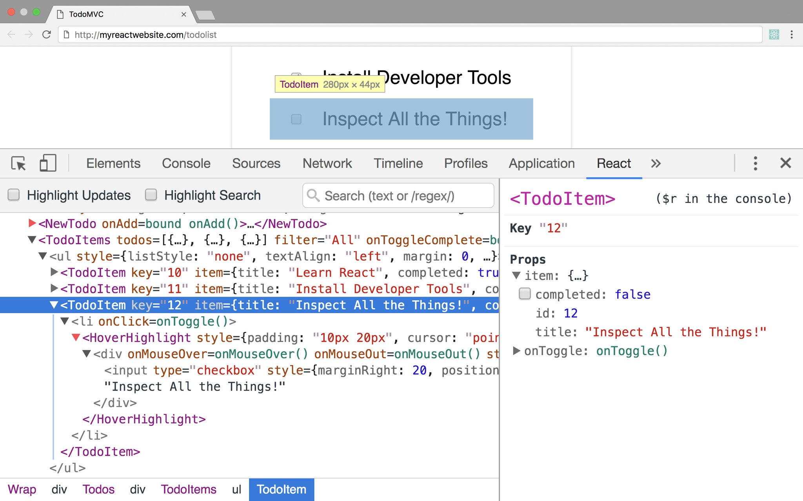

# React Properly

 

## Ben Ilegbodu

 

[@benmvp](https://twitter.com/benmvp) | [benmvp.com](/) | [#OSCON](https://twitter.com/hashtag/OSCON)    

 

May 10, 2017  

NOTES:
- My name is Ben Ilegbodu

/////

<!-- .slide: data-background="url(../../img/giphy/stand-up.gif) no-repeat center" data-background-size="cover" -->

# Stand Up!
<!-- .element: style="-webkit-text-stroke: black 4px" -->

NOTES:
- But first, would like everyone to stand up!
- Let's do some wall sits
- Let's roll our shoulders
- Let's stretch our arms
- Now turn to your neighbors, introduce yourself & say hi
- You don't realize it, but I just tricked you
- Now you can't say that you didn't get anything out of my talk
- You at least got two things:
- Exercise & and met some people you didn't know
- But hopefully you'll get more out of the talk!

=====

ben-ilegbodu.json

	

		<pre class="large"><code class="lang-json">
{
  "name": "Ben Ilegbodu",
  "priorities": [
    "Jesus", "family", "work"
  ],
  "location": "Pittsburg, CA",
  "work": "Eventbrite",
  "role": "Engineering Manager",
  "hobbies": [
    "basketball", "DIY", "movies"
  ]
}
			</code></pre>
	

	

		
	

NOTES:
_[1 minute]_

/////

<!-- .slide: data-background="url(../../img/giphy/james-harden-pot-cook.gif) no-repeat center" data-background-size="contain" -->

NOTES:
- I also absolutely love basketball - both playing & watching
- But you didn't come to hear about me. At least I hope not

/////

<!-- .element: style="border: 0; background: none; margin: 0; box-shadow: none;" -->

NOTES:
- Currently an Engineering Manager at Eventbrite
- Eventbrite is an online ticketing & events platform
- Many conferences use it for registration
- Historically we've just been a ticketing platform, but moving to being an events destination
- I am the engineering manager of that team
- Previously I was on the Frontend Platform team and where we transitioning Eventbrite from Backbone to React
- Didn’t want to introduce immediate tech debt from people ramping up
- Reviewed dozens of coding exercises written in React which showed how poorly code can be written in a hurry :)
- Instituted from the beginning React best practices (which we modified over time)
- Best practices helped level up our team in React
- Target audience: those who have done a little bit of React dev

=====

## What this talk is **not** about... 😐

 

- Why to use React
- How to develop in React
- How to transition from Backbone to React

NOTES:
- Just so we're clear...

/////

## What this talk is about! 😄

 

- Overview of Eventbrite React coding styleguide
- Lots of code examples
- Fast-paced!

NOTES:
- However!

/////

## Just to be clear...

NOTES:
- These are guidelines and rules that **we** at Eventbrite have adopted
- They are not hard fast rules
- But if you're looking coding best practices this may be a great place to start

=====

## Agenda

0. Developer Tools
0. ESLint

NOTES:

=====

## React Developer Tools

<!-- .element: style="width: 55%" -->

Available for [Chrome](https://chrome.google.com/webstore/detail/react-developer-tools/fmkadmapgofadopljbjfkapdkoienihi?hl=en) and [Firefox](https://addons.mozilla.org/en-US/firefox/addon/react-devtools/)

NOTES:
- Before we start looking at code, gotta suggest React DevTools
- It's a debugging lifesaver

=====

## ESLint

    
    

		<h2>Enforce style</h2>
        <h2>Prevent errors</h2>
        <h2>Promote a11y</h2>
    

Extend Eventbrite’s [React ESLint Config](https://github.com/eventbrite/javascript/tree/master/packages/eslint-config-eventbrite-react)!

NOTES:
- Definitely definitely use ESLint rules
- Keeps code syntax consistent so folks new to code can focus on code logic instead of code style
- Enforcing style (like no empty tags)
- Preventing errors (using `class` instead of `className`)
- Promoting a11y (ensuring ARIA roles are correct)
-

=====

## Recap

0. Developer Tools
0. ESLint

NOTES:
- So here's what we discussed
- Feel free to grab the slides

=====

## Additional resources

- [Eventbrite React coding styleguide](https://github.com/eventbrite/javascript/tree/master/react)
- [Eventbrite React ESLint configuration](https://github.com/eventbrite/javascript/tree/master/packages/eslint-config-eventbrite-react)

=====

<!-- .element: style="width: 60%" -->

NOTES:
- So some quick shoutouts before I wrap

/////

<!-- .element: style="width: 60%; border: 0; background: none; margin: 0; box-shadow: none;" -->

NOTES:
-

/////

<!-- .element: style="border: 0; background: none; margin: 0; box-shadow: none;" -->

/////

# YOU!
<!-- .element: style="font-size:12em" -->

NOTES:
- It's my hope that, the main reason I do this, is so you learn something new to make you a better developer
- Any feedback would be appreciated!

=====

<!-- .element: style="width: 80%" -->

# THANKS!     <!-- .element: style="-webkit-text-stroke: white 2px" -->

NOTES:

/////

# Questions?

 

## Ben Ilegbodu

[benmvp.com](/) | [@benmvp](https://twitter.com/benmvp) | [ben@benmvp.com](mailto:ben@benmvp.com)

 

Code examples: [github/benmvp/react-esnext](https://github.com/benmvp/react-esnext)

 

Ask me anything! [benmvp.com/ama](http://www.benmvp.com/ama/)

NOTES:
- Slides are available on Twitter
- Github repo
- Ask questions on Twitter, via email or AMA!
