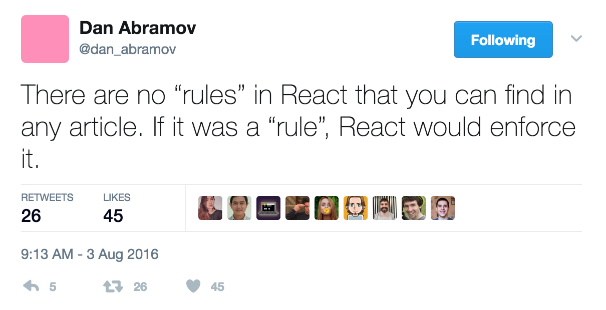
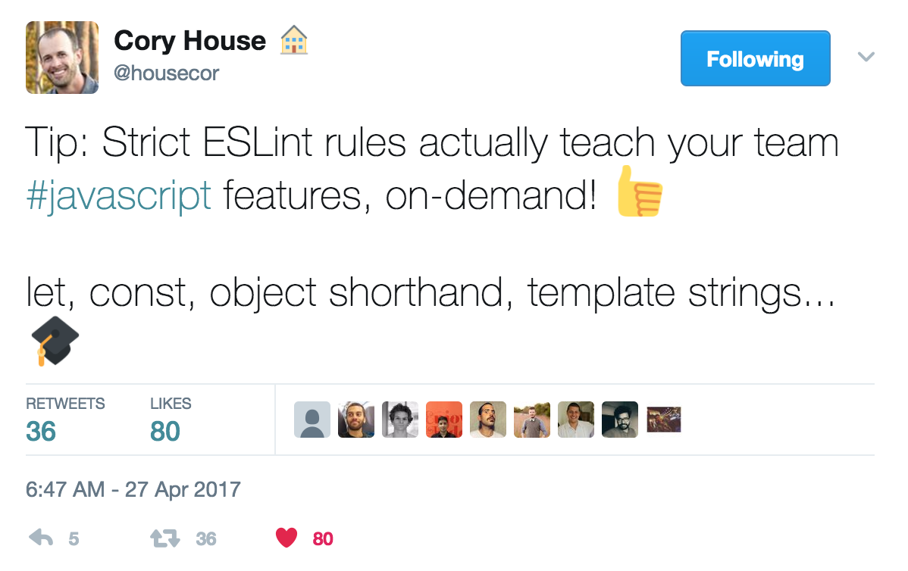
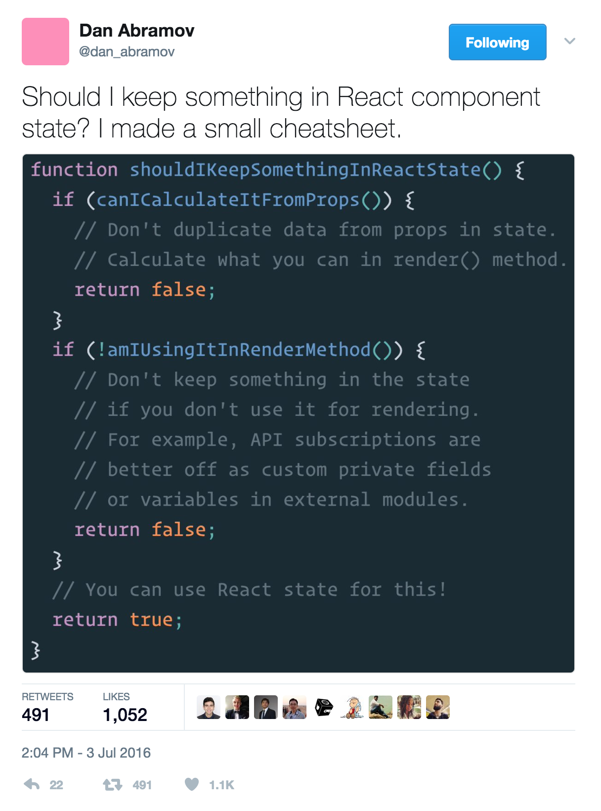
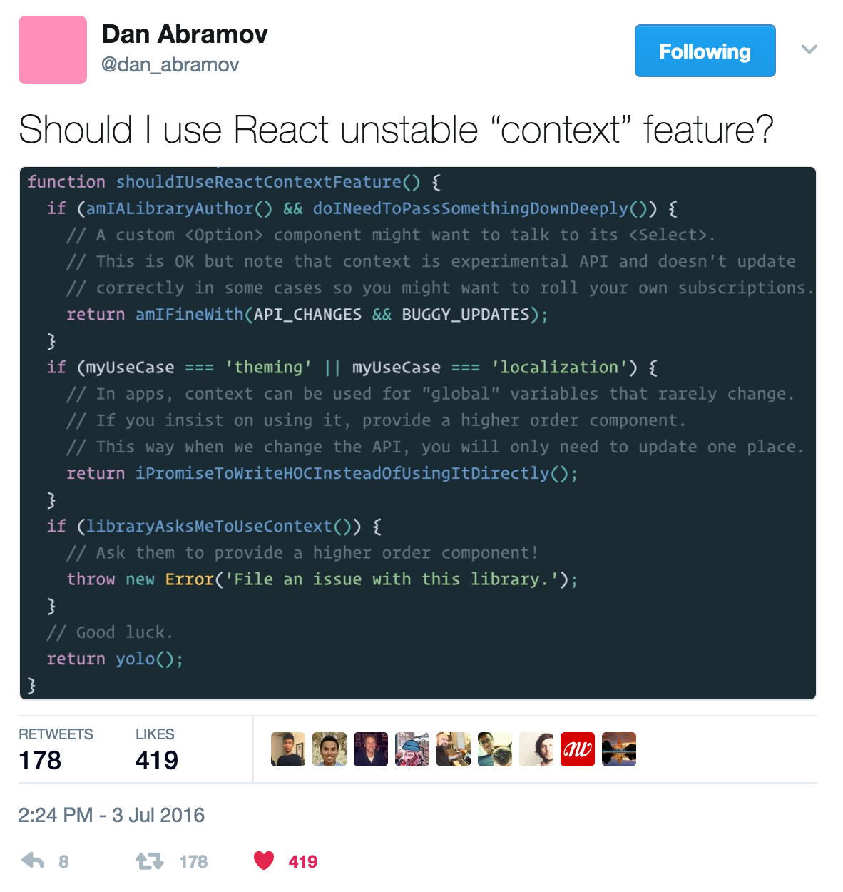

# React Properly

<br />

## Ben Ilegbodu

<br />

[@benmvp](https://twitter.com/benmvp) | [benmvp.com](/) | [#OSCON](https://twitter.com/hashtag/OSCON)    

<br />

May 10, 2017  

NOTES:
- My name is Ben Ilegbodu

/////

<!-- .slide: data-background="url(../../img/giphy/stand-up.gif) no-repeat center" data-background-size="cover" -->

# Stand Up!
<!-- .element: style="-webkit-text-stroke: black 4px" -->

NOTES:
- But first, would like everyone to stand up!
- Let's do some wall sits
- Let's roll our shoulders
- Let's stretch our arms
- Now turn to your neighbors, introduce yourself & say hi
- You don't realize it, but I just tricked you
- Now you can't say that you didn't get anything out of my talk
- You at least got two things:
- Exercise & and met some people you didn't know
- But hopefully you'll get more out of the talk!

=====

ben-ilegbodu.json

<div style="display:flex;align-items:center">
	<div style="flex:0 0 50%;">
		<pre class="large"><code class="lang-json">
{
  "name": "Ben Ilegbodu",
  "priorities": [
    "Jesus", "family", "work"
  ],
  "location": "Pittsburg, CA",
  "work": "Eventbrite",
  "role": "Engineering Manager",
  "hobbies": [
    "basketball", "DIY", "movies"
  ]
}
			</code></pre>
	</div>
	<div style="flex:0 0 50%;">
		
	</div>
</div>

NOTES:

/////

<!-- .slide: data-background="url(../../img/giphy/james-harden-pot-cook.gif) no-repeat center" data-background-size="contain" -->

NOTES:
- I also absolutely love basketball - both playing & watching
- But you didn't come to hear about me. At least I hope not

/////


<!-- .element: style="border: 0; background: none; margin: 0; box-shadow: none;" -->

NOTES:
- Currently an Engineering Manager at Eventbrite
- Eventbrite is an online ticketing & events platform
- Historically we've just been a ticketing platform, but moving to being an events destination
- Previously I was on the Frontend Platform team and where we transitioning Eventbrite from Backbone to React
- Didn’t want to introduce immediate tech debt from people ramping up
- Reviewed dozens of coding exercises written in React which showed how poorly code can be written in a hurry :)
- Instituted from the beginning React best practices (which we modified over time)
- Best practices helped level up our team in React
- Target audience: those who have done a little bit of React dev

=====

## Just to be clear...

[](https://twitter.com/dan_abramov/status/760871101526310912)

NOTES:
- These are guidelines and rules that **we** at Eventbrite have adopted
- They are not hard fast rules
- But if you're looking coding best practices this may be a great place to start
- Many devs don't like to be told how to code, but having a solid baseline to start is great

/////

## What this talk is **not** about... 😐

<br />

- Why to use React
- How to develop in React
- How to transition from Backbone to React
- Mandatory rules on writing React code

NOTES:
- There will be no public shaming

/////

## What this talk is about! 😄

<br />

- Opinionated guidance on writing healthy React code
- Lots of code examples
- Fast-paced!

NOTES:
- However!


=====

## Agenda

0. ESLint
0. Props
0. Rendering
0. Event Handling
0. State
0. Context

NOTES
- Here's what we'll be talking about in the areas of writing healthy code

=====

## ESLint

<div style="display:flex;align-items:center;justify-content:space-around;">
    
    <div>
		<h2>Prevent errors</h2>
		<h2>Enforce style</h2>
        <h2>Promote a11y</h2>
    </div>
</div>

Extend Eventbrite’s [React ESLint Config](https://github.com/eventbrite/javascript/tree/master/packages/eslint-config-eventbrite-react)!

NOTES:
- Definitely definitely use ESLint rules
- Keeps code syntax consistent so folks new to code can focus on code logic instead of code style
- Enforcing style (initial aim)
- Try our best to have all style rules enforced by ESLint
- Preventing errors
- Promoting a11y
- ESLint config was inspired by Airbnb's

/////

[](https://twitter.com/housecor/status/857591914727694336)

NOTES:
- Great async teaching tool for best practices because violating them causes failures

/////

## ESLint: Errors

```js
const HelloWord = () => (
	<div class="hello">Hello World</div>
)
```
<!-- .element: class="large" -->

<br /><br />

```
Unknown property 'class' found, use 'className' instead (react/no-unknown-property)
```

[`react/no-unknown-property`](https://github.com/yannickcr/eslint-plugin-react/blob/master/docs/rules/no-unknown-property.md)

NOTES:
- So helpful in catching little bugs, especially when the linter is incorporated in IDE

/////

## ESLint: Style

```js
class MyComponent extends PureComponent {
	static propTypes = {
		style: PropTypes.string
	}

	state = {value: ''}

	componentDidMount() { }
	componentWillReceiveProps() { }
	componentWillUnmount() { }

	_helperMethod() { }

	render() {
		return (<div />)
	}
}
```

[`react/sort-comp`](https://github.com/yannickcr/eslint-plugin-react/blob/master/docs/rules/sort-comp.md)

NOTES:
- For example, We use the `react/sort-comp` eslint rule to ensure that our components are organized in a consistent way
- `static` propTypes are always first
- Then `state`
- The lifecycle methods in a specific order
- Any other helper methods
- And finally `render()` is always last

/////

## ESLint: Style

```js
class MyComponent extends PureComponent {
	render() {
		return (<div />)
	}

	static propTypes = {
		style: PropTypes.string
	}

	...

	_helperMethod() { }
}
```
<!-- .element: class="large" -->

```
render should be placed after _helperMethod (react/sort-comp)
```

NOTES:
- So if I decided to put `render()` first like I've seen some folks doing, it'll complain
- Keeps code syntax consistent so folks new to code can focus on code logic instead of code style

/////

## ESLint - A11y

```js
const ClickableThang = ({onAction}) => (
	<div onClick={onAction}>
		Do the thang
	</div>
)
```
<!-- .element: class="large" -->

<br /><br />

```
Visible, non-interactive elements with click handlers
must have role attribute. (jsx-a11y/no-static-element-interactions)
```

<br />

[`jsx-a11y/no-static-element-interactions`](https://github.com/evcohen/eslint-plugin-jsx-a11y/blob/master/docs/rules/no-static-element-interactions.md)

NOTES:
- I'll take a wild guess and say that most developers don't know the ends and outs of making an app accessible
- Well ESLint rules can help with some of the baseline things
- For instance clickable elements _should_ only be interactive elements like `<button>` but we're notorious for sticking `onclick` on `<div>`
- If we do, for a11y among other things it needs to have the proper ARIA role to indicate that it is playing the role of a button

=====

## Props: API

```js
// good
class TextInput extends PureComponent {
    static propTypes = {
        type: PropTypes.string,
        defaultValue: PropTypes.string
    }
}

// bad (adds `propTypes` after class definition)
const TextInput = class extends PureComponent {

}

TextInput.propTypes = {
    type: PropTypes.string,
    defaultValue: PropTypes.string
}
```

[Public class fields](https://tc39.github.io/proposal-class-public-fields/) (Stage 2)

NOTES:
- Props help clearly define the component's API
- React doesn't require you to define `propTypes` for your props, but we require that they are defined
- Help validate your data and that you're passing in the right stuff
- Use `static` class property syntax to define `propTypes` (stage 2 public class fields)
- Also don't use ambiguous like `PropTypes.object` or `PropTypes.array`

/////

## Props: Boolean

```js
// good
export default class Banner extends PureComponent {
    static propTypes = {
        hideIcon: PropTypes.bool
    }
    static defaultProps = {
        hideIcon: false
    }
}
```
<!-- .element: class="large" -->

```js
const Header = () => (
	<header>
		<Banner />
	</header>
)
```
<!-- .element: class="large" -->

NOTES:
- Name boolean `propTypes` for a component so that their default value is `false`
- This means that you may need to name a prop negatively so that its default value will be `false`
- This way, omitting a boolean value in the JSX using the component is the same as specifying the boolean value as `false`

/////

## Props: Boolean

```js
// bad (icon-related prop is mis-named such that default is true)
export default class Banner extends PureComponent {
    static propTypes = {
        showIcon: PropTypes.bool
    }
    static defaultProps = {
        showIcon: true
    }
}
```
<!-- .element: class="large" -->

```
const Header = () => (
	<header>
		<Banner showIcon={false} />
	</header>
)
```
<!-- .element: class="large" -->

NOTES:
- To not have an icon you have to explicitly set `false`
- And not specifying the prop will actually show it
- Small detail, but we've found it to be helpful

/////

## Props: Initializing State

```js
// good
export default class Togglr extends React.Component {
    constructor(props, context) {
        super(prop, context)
        this.state = {visible: props.defaultVisible}
    }

    // rest of the component
}

// bad (confusingly-named prop)
export default class Togglr extends React.Component {
    constructor(props, context) {
        super(prop, context)
        this.state = {visible: props.visible}
    }

    // rest of the component
}
```

NOTES:
- In general, using props to generate state is an anti-pattern because it results in duplicate "sources of truth"
- But if your props is properly named to indicate that it's only used as seed data for the component's internally-controlled state, it's no longer an anti-pattern.
- We tend to prefix these types of props with `default*` to match the `defaultValue` prop React uses for input elements. `initial*` is also a good prefix.
- In the "bad" example, both `props` and `state` have a property called `visible`, which is very confusing.
- Should you use `this.props.visible` or `this.state.visible`. The one in `props` cannot change, while the one in `state` can.
- Naming the prop `defaultVisible` (as shown in the "good" example) makes things clearer.

=====

## Rendering: Logic & JSX

```js
// bad (expressions in JSX)
render() {
  let {includeHeader} = this.props

  return (
    <div>
      {includeHeader ? (<h2>Pagination</h2>) : null}
      {[1, 2, 3, 4, 5].map((page) => (
        <Button
          key={page}
          onClick={() => this.setState({page})}
		/>
      ))}
    </div>
  )
}
```

NOTES:
- React and JSX supporting logic and markup in the same file allows for substantial complexity in markup generation over other traditional templating languages
- But with that increased complexity can come a decrease in readability.
- I see a lot of code like this that has ternary operators, `map`s and other code mixed right in the JSX
- The above "bad" example doesn't seem so bad right?
- But as we know, code tends to grow over time.
- If we add more expressions, add more markup to the header, or the map gets more more logic, the code will become unwieldy.

/////

## Rendering: Logic & JSX

```js
// good
render() {
    let {includeHeader} = this.props
    let buttons = [1, 2, 3, 4, 5].map((page) => (
        <Button key={page} onClick={this._handlePageClick.bind(this, page)} />
    ))
    let header

    if (includeHeader) {
        header = (<h2>Pagination</h2>)
    }

    return (
        <div>
            {header}
            {buttons}
        </div>
    )
}
```

NOTES:
- In order to maximize both complexity and readability, we suggest keeping all logic out of JSX, except variable references and method calls.
- Expressions, particularly ternary expressions, should be stored in variables outside of JSX.
- Also using a bound reference to `_handlePageClick` instead of using an anonymous function in the JSX
- We also always surround JSX in parentheses as a convention to signal changing "contexts"

/////

## Rendering: Helper Components

```js
// bad (longer, less maintainable render)
render() {
    let {allTlds, currentTld, seoLinks} = this.props
    let seoItems = seoLinks.map( ... )
    let domainItems = allTlds.filter( ... ).map( ... )

    return (
        <footer className="global-footer">
            <ul className="global-footer__site-links">
                <li><a href="/about">About</a></li>
                <li><a href="/blog">Blog</a></li>
                <li><a href="/help">Help</a></li>
                <li><a href="/careers">Careers</a></li>
            </ul>
            <ul className="global-footer__seo-links">
                {seoItems}
            </ul>
            <ul className="global-footer__domain-links">
                {domainItems}
            </ul>
        )
        </footer>
    )
}
```
<!-- .element: class="small" -->

NOTES:
- Even when you do remove logic from JSX, `render()` can still get super long
- Here we have a global footer containing a whole bunch of link sections
- There's actually a lot of logic driving the markup

/////

## Rendering: Helper Components

```js
// using arrow functions for stateless functions
const SiteLinks = () => (
    <ul className="global-footer__site-links">
        <li><a href="/about">About</a></li>
        <li><a href="/blog">Blog</a></li>
        <li><a href="/help">Help</a></li>
        <li><a href="/careers">Careers</a></li>
    </ul>
)
```
<!-- .element: class="small" -->

```js
// good (clean render w/ help of helper components)
render() {
    let {allTlds, currentTld, seoLinks} = this.props

    return (
        <footer className="global-footer">
            <SiteLinks />
            <SeoLinks links={seoLinks} />
            <DomainLinks allTlds={allTlds} currentTld={currentTld} />
        </footer>
    )
}
```
<!-- .element: class="small" -->

NOTES:
- We chunk up markup into private helper components
- As you can see, with this best practice, the `render()` of `GlobalFooter` is really clean.
- It's immediately obvious that the global footer consists of site, SEO and domain links.
- Easy to add code to a sectino w/o bloating `GlobalFooter` `render()`
- Use stateless functions instead of class declarations for these helper components.
- Because they are only useful to the main component and only exist to keep `render()` lean, don’t place these helper components in their own files, nor `export` them within the main component.

/////

## Rendering: Hiding Markup

```js
// bad (uses CSS to hide element instead of not rendering)
render() {
    let {visible} = this.state
    let messageClassName

    if (!visible) {
        messageClassName = 'hidden'
    }

    return (
        <div>
            <Button click={this._handleToggle.bind(this)}>Toggle!</Button>
            <p className={messageClassName}>
                This message is toggled on/off with CSS 🙁!
            </p>
        </div>
    )
}
```

NOTES:
- Typically when you want to conditionally hide markup you would update its style or add a class that'd hide it
- It's tempting to do the same thing in React, but it's not necessary!

/////

## Rendering: Hiding Markup

```js
// good
render() {
    let {visible} = this.state
    let message

    if (visible) {
        message = (
            <p>This message is toggled on/off with React not CSS!</p>
        )
    }

    return (
        <div>
            <Button click={this._handleToggle.bind(this)}>Toggle!</Button>
            {message}
        </div>
    )
}
```

NOTES:
- With React's optimized re-rendering via its Virtual DOM abstraction, you should never need to hide elements with CSS
- (except maybe with some sophisticated CSS animations).
- Instead, don't render the element when it shouldn't be visible, and render it when it should

=====

## Event Handling: DOM events

```js
// bad (_handleChange passes entire event object back)
// bad (blur event isn't wrapped, which implicitly passed back event object)
class TextInput extends PureComponent {
    static propTypes = {
        onChange: PropTypes.func.isRequired,
        onBlur: PropTypes.func.isRequired
    }

    _handleChange(e) {
        this.props.onChange(e)
    }

    render() {
        return (
            <input
                type="text"
                onChange={this._handleChange.bind(this)}
                onBlur={this.props.onBlur}
            />
        )
    }
}
```
<!-- .element: class="small" -->

NOTES:
- The above example is a simple wrapper of a text input DOM element
- However, it's bad because it's passing the entire event object back in its two callbacks.
- It's a leaky interface. The parent now has access to `event.taget` (among other properties)
- It's a poor interface. The parent now has to navigate within the event object to get the data it wants.
- It's a fragile interface. If you later want to change how the event is triggered, a parent may now have to check the _type_ of event object it receives

/////

## Event Handling: DOM events

```js
class TextInput extends PureComponent {
    static propTypes = {
        onChange: PropTypes.func.isRequired,
        onBlur: PropTypes.func.isRequired
    }
    _handleChange(e) {
		// only the value is passed back
        this.props.onChange(e.target.value)
    }
    _handleBlur() {
		// blur is explicitly handled even though it's a basic wrapper
        this.props.onBlur()
    }
    render() {
        return (
            <input
                type="text"
                onChange={this._handleChange.bind(this)}
                onBlur={this._handleBlur.bind(this)}
            />
        )
    }
}
```
<!-- .element: class="small" -->

NOTES:
- When handling a DOM event that will be passed to the parent via a callback, avoid passing the entire DOM event object.
- Instead, narrow the component's API by passing only the minimal data required.
- As a result, this means that you must **always** handle DOM events it within the component even if it's just a wrapper.
- Otherwise the event object will still be implicitly returned

/////

## Event Handling: Loops

```js
const TEAMS = {
    'warriors': {
        name: 'Golden State Warriors',
        url: 'http://www.nba.com/warriors'
    },
    '49ers': {
        name: 'San Francisco 49ers',
        url: 'http://www.49ers.com'
    },
    'raiders': {
        name: 'Oakland Raiders',
        url: 'http://www.raiders.com'
    },
    'giants': {
        name: 'San Francisco Giants',
        url: 'http://sanfrancisco.giants.mlb.com'
    },
    'athletics': {
        name: 'Oakland Athletics',
        url: 'http://oakland.athletics.mlb.com'
    }
}
```
<!-- .element: class="small" -->

NOTES:
- If you pass event handlers to child components created in a loop
- Chances are you will need a way to uniquely identify which child component caused the event handler to occur.
- Say we had this data set of professional sports teams in the SF Bay Area

/////

## Event Handling: Loops

```js
// bad (stores the teamId in the DOM `data-teamId` in order to retrieve it onClick)
class TeamPicker extends PureComponent {
    _handleTeamClick(e) {
        let teamId = e.target.dataset.teamId

        console.log(TEAMS[teamId].url)
    }
    render() {
        let teamButtons = Object.keys(TEAMS).map((teamId) => (
            <button data-teamId={teamId} onClick={this._handleTeamClick.bind(this)} key={teamId}>
                {TEAMS[team].name}
            </button>
        ))

        return (
            <div>
                <h2>Pick your team</h2>
                <div>{teamButtons}</div>
            </div>
        )
    }
}
```
<!-- .element: class="small" -->

NOTES:
- I have seen folks still stuck in the old way of thinking store the ID on the DOM using `data-*` attribute
- The reason that this is "bad" is because the code now has to unnecessarily touch the DOM in order to retrieve `teamId`
- JavaScript already has the value

/////

## Event Handling: Loops

```js
class TeamPicker extends PureComponent {
    _handleTeamClick(teamId) {
        console.log(TEAMS[teamId].url)
    }

    render() {
        let teamButtons = Object.keys(TEAMS).map((teamId) => (
            <button onClick={this._handleTeamClick.bind(this, teamId)} key={teamId}>
                {TEAMS[team].name}
            </button>
        ))

        return (
            <div>
                <h2>Pick your team</h2>
                <div>{teamButtons}</div>
            </div>
        )
    }
}
```

NOTES:
- In this _good_ example, we pass the `teamId` to the `.bind()` method
- When the `onClick` handler is invoked, the `teamId` is the first parameter in `_handleTeamClick`.
-  In this contrived example, the performance difference between _good_ and _bad_ is likely negligible
- But at scale, a lot of unnecessary DOM accesses can really slow down an app
- Always adhering to this good practice should prevent the need to go hunting for performance bottlenecks in an existing large app.

=====

<a href="https://twitter.com/dan_abramov/status/749710501916139520">
	
</a>

/////

## State: Computed data

```js
// bad (keeps computed `area` value)
class Box extends PureComponent {
  static propTypes = {height: PropTypes.number.isRequired}
  constructor(props) {
    super(props)
    this.state = {width: 10, area: props.height * 10}
  }
  _handleChange(e) {
    let width = e.target.value

    this.setState({width, area: width * this.props.height})
  }
  render() {
    return (
      <div>
        <input value={this.state.width} onChange={this._handleChange.bind(this)} />
        <span>Area: {this.state.area}</span>
      </div>
    )
  }
}
```

NOTES:
- We have an example of a Box component that just display the area
- Height comes from props
- Width comes from text input that's updated in state
- May be tempted to also put `area` in state as in the example since we need the value
- But you should only keep the minimal amount in state as possible.
- Instead....

/////

## State: Computed data

```js
class Box extends PureComponent {
  static propTypes = {height: PropTypes.number.isRequired}
  state = {width: 10}

  _handleChange(e) {
    this.setState({width: e.target.value})
  }
  render() {
    let width = this.state.width
    let area = width * this.props.height;

    return (
      <div>
        <input value={width} onChange={this._handleChange.bind(this)} />
        <span>Area: {area}</span>
      </div>
    )
  }
}
```

NOTES:
- Only keep `width` in state
- Calculate `area` as part of `render`
- This way you don't have to worry about `width` & `area` remaining in sync

/////

## State: Dependent updates

```js
// bad (doesn't use updater function for dependent state)
class Incrementer extends PureComponent {
  state = {value: 0}

  _handleClick() {
	this.setState({value: this.state.value + 1})
  }

  render() {
	return (
	  <div>
		<span>{this.state.value}</span>
		<button onClick={this._handleClick.bind(this)}>+</button>
	  </div>
    )
  }
}
```

NOTES:
- Lets say you have a simple `Incrementer` component and all it does is update the state and display it
- The simplest implementation is this:
- But it's "bad" because of the way `setState` works
- `setState()` enqueues changes to the component state; it's a request rather than an immediate command
- React may delay the update and update several components in a single pass
- So if the user clicks the button quickly enough, `this.state.value` may still have the same value in successive calls to `_handleClick`
- So it'll be as if the increment only happened once

/////

## State: Dependent updates

```js
class Incrementer extends PureComponent {
  state = {value: 0}

  _handleClick() {
	this.setState((prevState) => ({
		value: prevState.value + 1
	}))
  }

  render() {
	return (
	  <div>
		<span>{this.state.value}</span>
		<button onClick={this._handleClick.bind(this)}>+</button>
	  </div>
    )
  }
}
```

NOTES:
- The better way is to call `setState` with an updater function
- This function will get called with the previous state when it's ready to actually set the state
- So you know you'll be getting the correct previous value
- React actually suggests that we **always** use this updater function syntax instead of just setting an object
- But I'm not yet convinced the syntax overhead is worth it when it's not state dependent

/////

## State: Dependent updates

<br />

[`setState`](https://facebook.github.io/react/docs/react-component.html#setstate)

```js
setState(updaterFunc, [callbackFunc])
```
<!-- .element: class="large" -->

<br />

`updaterFunc`

```js
(prevState, props) => stateChangeObj
```
<!-- .element: class="large" -->

NOTES:
- Here is more detail about the function signatures of `setState` & the `updaterFunc`

=====

<a href="https://twitter.com/dan_abramov/status/749715530454622208">
	
</a>

NOTES:
- Context is the mechanism within React to pass information automatically down through the component tree.
- Don't use it!
- If you want to use it in order to "avoid typing", still don't use it!
- Context in React is the equivalent of global variables in a program; using context makes it harder to track the flow of data through your React components.
- Instead, be explicit and specifically pass props down the component tree.

/////

## Context

setting context

```js
class App = () => {

}

export default addTheme(App)
```
<!-- .element: class="large" -->

reading context

```js
class LeftNav = ({theme}) => {
	// theme is now a prop
}

export default withTheme(LeftNav)
```
<!-- .element: class="large" -->


NOTES:
- You should never need to define context for components that are in the middle of the component hierarchy
- If context does need to be defined, it'll be defined at the top-level container App in order to provide truly App-global data.
- Only used for localization, user state, theming, etc.
- When you do use context, avoid using it directly
- The context API is still considered experimental and likely to change in future releases.
- Instead wrap your use of the component API in a higher-order component
- We have two HOCs: one to set the context at the top-level & one to read context for any of the descendant components

/////

## Context

```js
const withTheme = (Component) => (
	class ThemedComponent extends PureComponent {
		static contextTypes = {theme: PropTypes.string}

		render() {
			let {theme} = this.context

			return (<Component theme={theme} {...this.props} />)
		}
	}
)
```
<!-- .element: class="large" -->

[Context API](https://facebook.github.io/react/docs/context.html)

NOTES:
- Don't have time to really go over higher-order components
- Will provide resource links
- But they are basically functions that take in a component, and return a new modified version of it
- I like to call them "component enhancers" cuz that's more like what they do
- Here's an example of the `withTheme` HOC
- In the end, the wrapped component would get `theme` as a prop
- The equivalent `addTheme` HOC would set the context

=====

## Recap

0. ESLint
0. Props
0. Rendering
0. Event Handling
0. State
0. Context

NOTES:
- So here's what we discussed
- Feel free to grab the slides

=====

## Additional resources

- [Eventbrite React coding styleguide](https://github.com/eventbrite/javascript/tree/master/react)
- [Eventbrite React ESLint configuration](https://github.com/eventbrite/javascript/tree/master/packages/eslint-config-eventbrite-react)
- [Eventbrite ES6+ coding style guide](https://github.com/eventbrite/javascript/tree/master/es6)
- [_Learning ES6_ series](/learning-es6-series/)
- [_Mixins Are Dead. Long Live Composition_](https://medium.com/@dan_abramov/mixins-are-dead-long-live-higher-order-components-94a0d2f9e750#.q8tqxgdkp)

=====


<!-- .element: style="width: 60%" -->

NOTES:
- So some quick shoutouts before I wrap

/////


<!-- .element: style="width: 75%; border: 0; background: none; margin: 0; box-shadow: none;" -->

NOTES:
-

/////


<!-- .element: style="border: 0; background: none; margin: 0; box-shadow: none;" -->

NOTES:
- I'm up here presenting this talk, but all of the content comes from a lot of EB engineers

/////

# YOU!
<!-- .element: style="font-size:12em" -->

NOTES:
- It's my hope that, the main reason I do this, is so you learn something new to make you a better developer
- Any feedback would be appreciated!

=====


<!-- .element: style="width: 80%" -->

# THANKS!     <!-- .element: style="-webkit-text-stroke: white 2px" -->

NOTES:

/////

# Questions?

<br />

## Ben Ilegbodu

[benmvp.com](/) | [@benmvp](https://twitter.com/benmvp) | [ben@benmvp.com](mailto:ben@benmvp.com)

<br />

Ask me anything! [benmvp.com/ama](http://www.benmvp.com/ama/)

NOTES:
- Slides are available on Twitter
- Github repo
- Ask questions on Twitter, via email or AMA!
