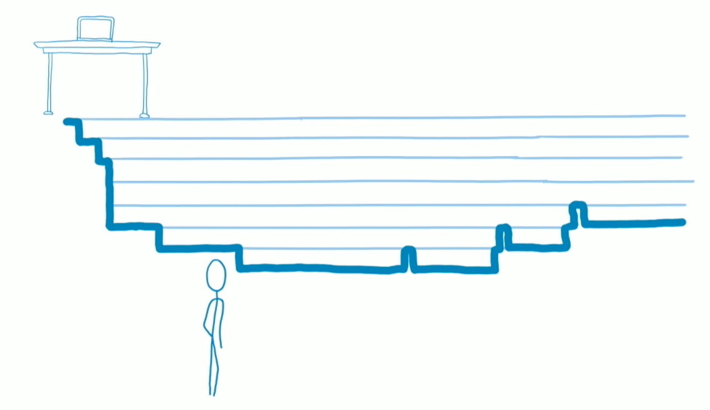
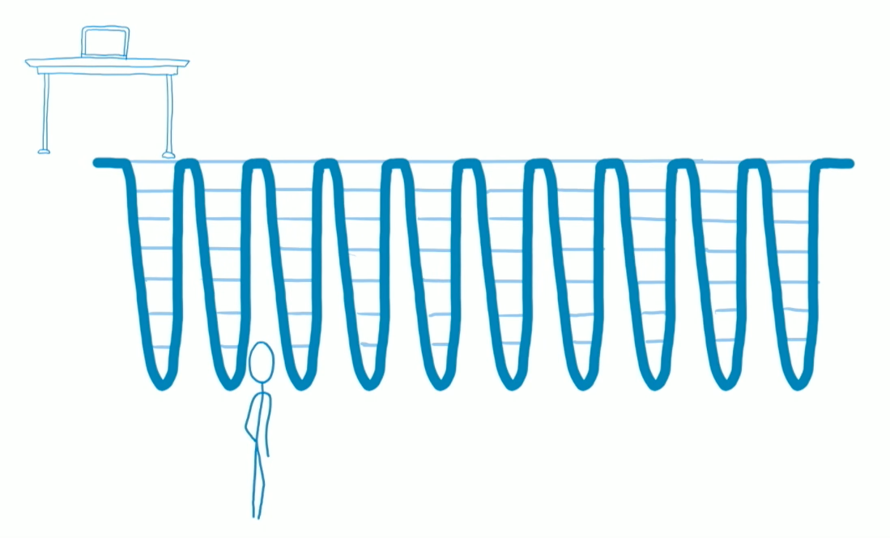
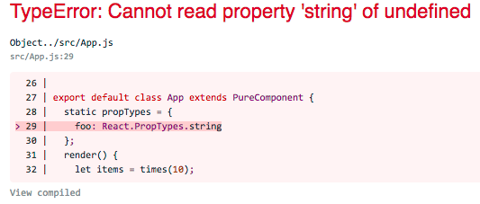
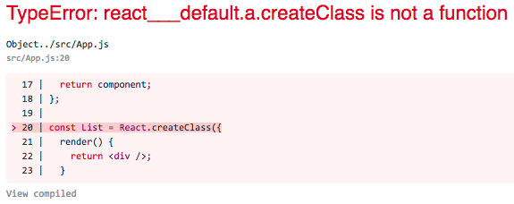
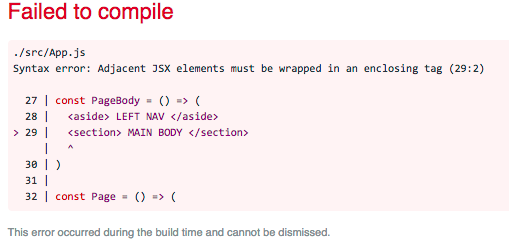
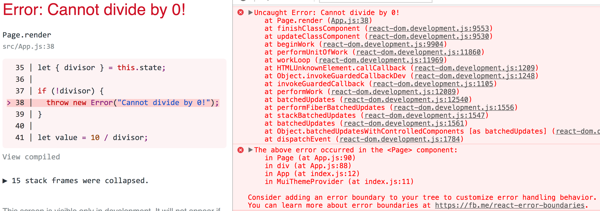
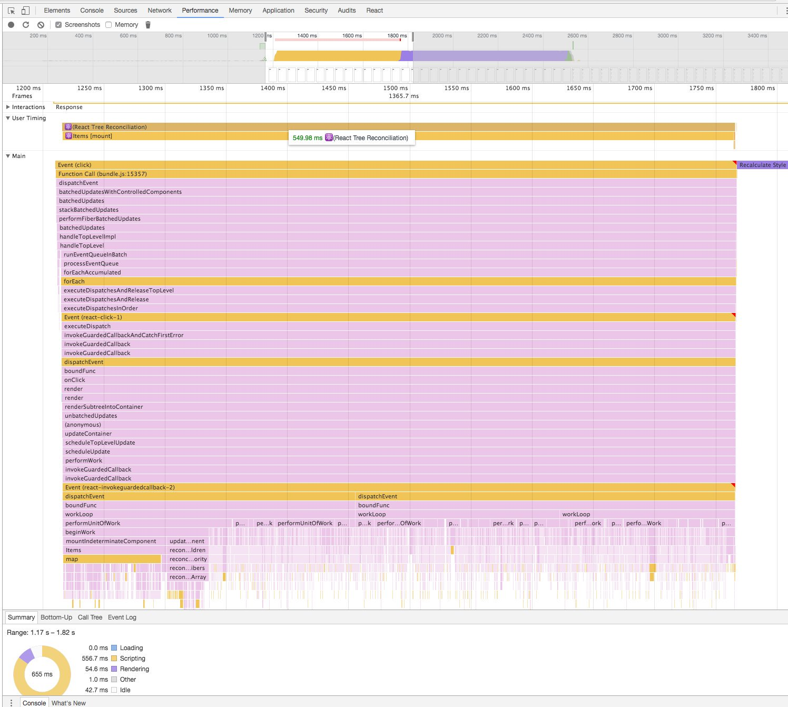
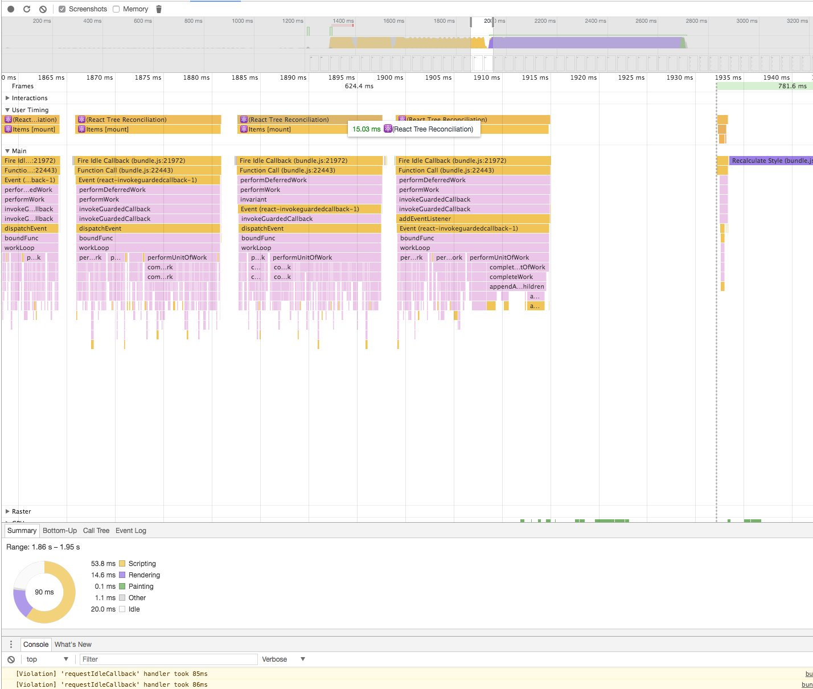
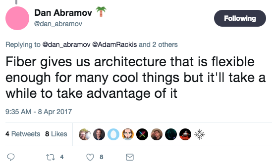

# React Fiber for the rest of us!

<br />

## Ben Ilegbodu

<br />

[@benmvp](https://twitter.com/benmvp) | [benmvp.com](/) | [#ReactBoston](https://twitter.com/hashtag/ReactBoston)    

<br />

September 24, 2017  

NOTES:
- My name is Ben Ilegbodu
- Here to talk about Fiber & React 16
- Instead of talking about the technical implementation & architecture
- Focusing on how Fiber & React 16 will affect how we develop & build React apps
- Tweeted out a link to my slides!

/////

<!-- .slide: data-background="url(../../img/giphy/stand-up.gif) no-repeat center" data-background-size="cover" -->

# Stand Up!
<!-- .element: style="-webkit-text-stroke: black 4px; color: white" -->

NOTES:
- But first, would like everyone to stand up!
- Let's do 10 squats
- Now turn to your neighbors, introduce yourself & say hi
- You don't realize it, but I just tricked you
- Now you can't say that you didn't get anything out of my talk
- You at least got two things:
- Exercise & and met some people you didn't know
- But hopefully you'll get more out of the talk!

=====

## me.json

<div style="display:flex;align-items:center">
	<div style="flex:0 0 50%;">
		
	</div>
	<div style="flex:0 0 50%;">
		<pre class="large"><code class="lang-json">
{
  "name": "Ben Ilegbodu",
  "priorities": [
    "Jesus", "family", "work"
  ],
  "location": "Pittsburg, CA",
  "work": "Eventbrite",
  "role": "Lead UI Engineer",
  "hobbies": [
    "basketball", "DIY", "movies"
  ]
}
			</code></pre>
	</div>
</div>

NOTES:
_[1 minute]_

/////


<!-- .element: style="width: 65%" -->

NOTES:
- Huge basketball fan
- Love playing as well as watching
- Small intersection between those who love React & Basketball
- Only a strong bball fan will know this moment
- Tell me if you do!

/////


<!-- .element: style="border: 0; background: none; margin: 0; box-shadow: none;" -->

NOTES:
- Currently a Lead UI Engineer at Eventbrite
- Eventbrite is an online ticketing & events platform
- Rect Boston is using Eventbrite!
- We've transitioned from Backbone to React
- Bunch of new major apps being written in React
- I'm actually on the Frontend Platform team with Kaylie
- Speaking of Kaylie, yesterday was her first conference talk!
- Didn't tell you that she implemented selective resolution
- She's been at Eventbrite for 1.5 years; Graduated for Hackbright
- Part of Eventbrite Bootcamp & now has come back to the team
- I really value her opinion; she & another bootcamp grad are responsible FE infra
- 1) want to embarass her & 2) highlight that you don't have to have a CS degree
- Kaylie got her degree in Art History & worked at the Smithsonian
- Inspiration: those from non-traditional backgrounds
- Call-to-action: those making hiring decisions

=====
<!-- .slide: data-background="#ddd" -->

<div style="display:flex;align-items:center;justify-content:space-around;">
    <div style="flex: 0 0 50%">
      
    </div>
    <div>
      <h1>React Fiber</h1>
    </div>
</div>

NOTES:
- Let's talk about React Fiber
- Show of hands
  * Who has heard of React? (control)
  * Who has built React apps?
  * Who has heard of React Fiber (before right now)?
  * Who has tried out Fiber?

/////

### Rewrite of reconciler
### Prioritizes UI updates
### Enables async rendering
### Improves perceived performance
### In next major React version (v16)

NOTES:
- The _reconciler_ has historically gone by the name of "Virtual DOM"
- It's the "killer feature" of React that let's us just right our code as if it's going to re-render everything
- But it's able to _reconcile_ the difference before and after a state change and tell the render the optimized updates to make
- The Fiber reconciler can prioritize UI updates, which means that the UI can render asynchronously
- As a result we get greater perceived performance because the higher priority updates happen first
- And this is all happening in React 16 - the next major version

/////


<!-- .element: style="border: 0; background: none; margin: 0; box-shadow: none;" -->

## Stack reconciler

NOTES:
- The current (soon-to-be-previous) reconciler has been posthumously given the name Stack reconciler
- Basically when an update needs to happen, the Stack reconciler traverses the entire component tree and does all the rendering for as long as it takes
- Then it reliquishes control back to the JS engine
- For deep or expensive updates this can have a noticeable impact on performance even w/ intelligent reconciliation

/////


<!-- .element: style="border: 0; background: none; margin: 0; box-shadow: none;" -->

## Fiber reconciler

NOTES:
- Instead the forthcoming Fiber reconciler will do some work and then relinquish control back to the engine
- So rendering becomes asynchronous because it can render a higher priority update before returning to the original update
- Imagine you have a text input field and then long list of results being populated by API response
- You want typing to have immediate feedback where as the list of results can be lower priority because it's coming from API
- These sorts of optimizations give a higher perceived performance

/////

## Update Priorities

<br />

- Synchronous
- Task
- Animation
- High
- Low
- Offscreen

NOTES:
- Synchronous (just like stack reconciler)
- Task        (next tick)
- Animation   (before next frame)
- High        (pretty soon)
- Low         (delays are ok)
- Offscreen   (prep for display/scroll, not being rendered)

/////

## A Cartoon Intro to Fiber

<iframe width="1333" height="750" src="https://www.youtube.com/embed/ZCuYPiUIONs" frameborder="0" allowfullscreen></iframe>

### ReactConf 2017

NOTES:
- That's all I want to say about the Fiber architecture itself
- Because Lin did an AMAZING job giving a deep-dive on how it works back at ReactConf
- In fact I snagged those previous two graphics from her talk :)
- Everywhere I looked at info about Fiber this video was linked
- Instead, I want to spend time talking about how Fiber & React 16 will affect how we'll dev moving forward

=====
<!-- .slide: data-background="#ddd" -->

<div style="display:flex;align-items:center;justify-content:space-around;">
    <div style="flex: 0 0 50%">
      
    </div>
    <div>
      <h2>1. React Packages</h2>
    </div>
</div>

NOTES:
- Let's start easy; nothing too complicated
- Talking about the React packages themselves

/////

<div style="display:flex;align-items:center">
	<div style="flex:0 0 50%;">
    <h3>25% smaller React bundle!</h3>
		<pre class="large"><code class="lang-sh">$ jsize react@next react-dom@next
react@next        2.88 kB (gzipped)
react-dom@next    34.6 kB (gzipped)</code></pre>

    <br /><br />

    <h3>Before</h3>
		<pre class="large"><code class="lang-sh">$ jsize react@15 react-dom@15
react@15        7.22 kB (gzipped)
react-dom@15    43.9 kB (gzipped)</code></pre>

    <br />

    (<a href="https://github.com/antonmedv/jsize" target="_blank"><code>jsize</code></a> utility)
	</div>
	<div style="flex:0 0 50%;">
		
	</div>
</div>

NOTES:
- Now: 37.48kb, Before: 51.12kb
- 25%+ reduction!

/////

## React 15.5 deprecations ➜ React 16 errors

<div style="display:flex;align-items:center;justify-content: space-between">
	<div style="flex:0 0 48%;">
		
    <pre><code class="lang-js">import PropTypes from 'prop-types'</code></pre>
	</div>
	<div style="flex:0 0 48%;">
		
    <pre><code class="lang-js">import createClass from 'create-react-class'</code></pre>
	</div>
</div>

<br />

[`react-codemod`](https://github.com/reactjs/react-codemod)

```sh
jscodeshift -t react-codemod/transforms/React-PropTypes-to-prop-types.js <path>
```
```sh
jscodeshift -t react-codemod/transforms/class.js <path>
```


NOTES:
- Use the `prop-types` lib for prop types
- Use ES6 classes or `create-react-class` lib for components
- React has codemods to be able to programmatically change
- I'm guessing removing these helped with smaller build size

=====
<!-- .slide: data-background="#ddd" -->

## 2. Custom Attributes


<!-- .element: style="border: 0; background: none; margin: 0; box-shadow: none; width: 80%" -->

NOTES:
- Continuing on
- Let's talk about some changes to custom attributes

/////

## Custom attributes are supported!

<div style="display:flex;align-items:center;justify-content: space-between; margin: 2em 0">
	<div style="flex:0 0 45%;">
    React 15 JSX
    <pre class="large"><code class="lang-js">&lt;svg foo="bar" /></code></pre>
	</div>
	<div style="flex:0 0 45%;">
		React 15 HTML
    <pre class="large"><code class="lang-html"><svg></svg></code></pre>
	</div>
</div>

<div style="display:flex;align-items:center;justify-content: space-between">
	<div style="flex:0 0 45%;">
    React 16 JSX
    <pre class="large"><code class="lang-js">&lt;svg foo="bar" /></code></pre>
	</div>
	<div style="flex:0 0 45%;">
		React 16 HTML
    <pre class="large"><code class="lang-html"><svg foo="bar"></svg></code></pre>
	</div>
</div>

NOTES:
- In React 15, unknown attributes were not rendered to DOM
- React would also warn you of "unknown prop on `<svg>`"
- Prevented custom attributes: browser-specific, new APIs or 3rd-party
- React had to maintain a (growing) whitelist of **all** standard DOM attributes
- `<svg>` was biggest problem and always would be missing attributes
- Custom attributes are now supported in React 16!
- Able to shave off more package size

/////

### Still get some helpful warnings...

`<div class="foo">` (wrong form)
```js
Warning: Invalid DOM property `class`. Did you mean `className`?
```
<!-- .element: style="margin-bottom: 1.5em" -->

`<div classname="foo">` (all-lowercase)
```js
Warning: Invalid DOM property `classname`. Did you mean `className`?
```
<!-- .element: style="margin-bottom: 1.5em" -->

`<div classNam="foo">` (misspelled camelCase)
```js
React does not recognize the `classNam` prop on a DOM element. If you intentionally 
want it to appear in the DOM as a custom attribute, spell it as lowercase `classnam` 
instead. If you accidentally passed it from a parent, remove it from the DOM element.
```
<!-- .element: style="margin-bottom: 1.5em" -->

`<div clas="foo">` / `<div classnam="foo">` (misspelled lowercase)
```js
NO WARNING! Assumed custom attribute!
```

NOTES:
- React will still give some helpful warnings for known attributes
- Knows to watch out for `class` (React follows JS DOM API)
- An unknown all-lowercase attribute cannot match a camelCase version
- Unknown camelCase attributes are invalid
- Unknown all lowercase are assumed custom attributes
- All these cases the attributes are rendered in the DOM!


=====
<!-- .slide: data-background="#ddd" -->

<div style="display:flex;align-items:center;justify-content:space-around;">
    <div>
      <h2>3. New return values for components</h2>
    </div>
    <div style="flex: 0 0 50%">
      
    </div>
</div>

NOTES:
- Next, let's make some folks happy talking about return values for components

/////

```js
const PageBody = () => (
  <aside> LEFT NAV </aside>
  <section> MAIN BODY </section>
)

const Page = () => (
  <main>
    <h1> HEADING </h1>
    <PageBody />
  </main>
)
```
<!-- .element: class="large" -->

Adjancent JSX elements are invalid

NOTES:
- When you were new to React, you may have tried to do something like this
- You know you want to stick the contents of `PageBody` in `Page`
- Maybe you're using flexbox or grid, and you need the `<h1>`, `<aside>` & `<section>` to be siblings

/////


<!-- .element: style="border: 0; background: none; margin: 0; box-shadow: none; width: 80%" -->

# 😭

NOTES:
- However, this results in an error saying you have to wrap in an enclosing tag
- Not valid JavaScript
- The result is a lot of "tag bloat" because you needed enclosing tags everywhere
- And this breaks flexbox

/////

Adjacent JSX elements is _still_ an error in React 16...

```js
const PageBody = () => ([
  <aside key="aside"> LEFT NAV </aside>,
  <section key="section"> MAIN BODY </section>,
])

const Page = () => (
  <main>
    <h1> HEADING </h1>
    <PageBody />
  </main>
)
```
<!-- .element: class="large" -->

...but arrays **ARE** valid component return values in React 16! 👏🏾

NOTES:
- Adjacent JSX elements is also an error in React 16
- Because it result in invalid JavaScript
- However, React 16 allows returning an array from a component!
- Arrays weren't allowed as return values in React 15
- We can get rid of so many enclosing `<div>`s
- Pretty ugly syntax for static markup
- Unique `key` is needed (to hide warning)

/////

## React 16 + "self-eradicating" component 😎

```js
const Aux = (props) => props.children
const PageBody = () => (
  <Aux>
    <aside> LEFT NAV </aside>
    <section> MAIN BODY </section>
  </Aux>
)
const Page = () => (
  <main>
    <h1> HEADING </h1>
    <PageBody />
  </main>
)
```
<!-- .element: class="large" -->

Source: [github/gajus/react-aux](https://github.com/gajus/react-aux)

NOTES:
- An interesting solve I just came across is to use a "self-eradicating" component
- `Aux` just returns its children. In React 15 if `children` was an array, it'd fail. But in React 16 it won't!
- So even though it looks like `PageBody` has a container element around the elements, the `<h1>`, `<aside>` & `<section>` will be siblings
- And now we can have fixed markup without having to deal with that weird mix of arrays and JSX
- And not having to specify the `key`s
- In general, this is when returning arrays will be most useful; when it's a variable (usually from `map`)
- BTW, `react-aux` is literally just that component
- No more empty `<div>` or `<span>` tags!

/////

Strings are also valid return values in React 16! 👍🏾  

```js
const Localized = ({msg, tokens}) => {
  let translated = i18n(msg)

  translated = interpolate(translated, tokens)

  return translated
}

export default const App = () => (
  <main>
    <Localized msg="Hello {name}!" tokens={{name: 'Ben'}} />
  </main>
)
```
<!-- .element: class="large" -->

(numbers & booleans too)

NOTES:
- In React 16 string values are valid return values
- It's likely that this isn't so big of a deal for you
- The only real-world use case I've found for this is I18N components
- We basically want a utility function wrapped in the convenience of a declarative component that can optionally handle markup
- Other scalar values like numbers & booleans are also valid

=====
<!-- .slide: data-background="#ddd" -->

## 4. Handling errors


<!-- .element: style="border: 0; background: none; margin: 0; box-shadow: none; width: 70%" -->

NOTES:
- Talked about 1) changes to React packages 2) custom attributes 3) new return values
- Now, let's talk about handling errors

/////

## Uncaught errors now unmount your app!


<!-- .element: style="border: 0; background: none; margin: 0; box-shadow: none; width: 100%" -->

# 🤔

NOTES:
- In React 16, uncaught errors unmount your entire app
- React team debated this decision, but felt it's worse to leave a corrupted UI
- In DEV mode you will see something like this, especially w/ Create React App
- In migrating to React 16 you may uncover existing crashes that you may not have noticed unless you had dev tools open
- Super helpful error message mentions using error boundaries w/ link on learning more
- But I'm going to tell you all about them!

/////

## New `componentDidCatch` lifecycle method!

<br />

```js
export default class ErrorBoundary extends PureComponent {
  componentDidCatch(error, errorInfo) {

  }
}
```
<!-- .element: class="large" -->

NOTES:
- React is adding new lifecycle method called `componentDidCatch`
- In that method you receive the error/exception and additional information like the stack trace

/////

```js
export default class ErrorBoundary extends PureComponent {
  state = {
    hasError: false
  }
  componentDidCatch(error, errorInfo) {
    this.setState({hasError: true})
    Bugsnag.notifiyException(error, 'ReactError');
  }
  render() {
    if (!this.state.hasError) {
      return this.props.children
    }

    return (<h1>Something went wrong 😿!</h1>)
  }
}
```
<!-- .element: class="large" -->

NOTES:
- So we can create what's called an "error boundary" component
- It maintains state whether or not an error has occurred
- When one has ocurred, set state to `true` & probably also log to error reporting service
- In `render()` when there's an error, we'll display the error message
- When no error, just render the children (which works because we can return any type from components)

/////

## Error boundary component

<br />

```js
<ErrorBoundary>
  <BuggyComponent />
</ErrorBoundary>
```
<!-- .element: class="large" -->

<br />

(used like any other component)

NOTES:

- Any errors that happen within `BuggyComponent` or lower in the tree will trigger `componentDidCatch` in `ErrorBoundary`
- So if you have sections of an app that are independent, you can wrap them and if one part fails, the whole thing doesn't
- **IMPORTANT:** It cannot catch errors within itself. That would get bubbled up to a error boundary component higher in the tree

/////

```js
const App = () => (
  <div>
    <nav>
      <Link to="/dashboard">Dashboard</Link>
    </nav>
    <main>
      <ErrorBoundary>
        <Route path="/dashboard" component={Dashboard} />
      </ErrorBoundary>
    </main>
  </div>
)
```
<!-- .element: class="large" -->

Wrap top-level route components in error boundary components

NOTES:
- You can use error boundary components anywhere
- Most sense is wrapping top-level route components
- Can have a page-level error boundary that looks much like the 500 page your server would generate
- But at least now you can have some nav UI around it

=====
<!-- .slide: data-background="#ddd" -->

<div style="display:flex;align-items:center;justify-content:space-around;">
    <div>
      <h2>5. Server rendering</h2>
    </div>
    <div style="flex: 0 0 50%">
      
    </div>
</div>

NOTES:
-  `renderToString` is used server-side to render React into HTML markup to return in response body
- Killer feature of React
- Server-side rendering is good for user performance & SEO
- Both Sasha & Natalie talked about this

/////

## Server-side markup in React <= 15

<br />

```html
<div class="App" data-reactroot="" data-reactid="1" data-react-checksum="1334994557">
  <nav data-reactid="2">
    <a href="/dashboard" data-reactid="3">Dashboard</a>
  </nav>
  <main data-reactid="4">
    <section data-reactid="5"> ... </section>
  </main>
</div>
```
<!-- .element: class="large" -->

NOTES:
- In React 15, the markup is filled `data-reactid` attributes
- Used by React to correlate server rendered code w/ client-side render & attach event handlers
- Although there's gzip, it's still adds a lot of additional markup
- There is `renderToStaticMarkup` for just static sites
- Still need it for interactive sites...

/////

## No more `data-reactid` attributes from server!

```html
<div class="App" data-reactroot="">
  <nav>
    <a href="/dashboard">Dashboard</a>
  </nav>
  <main>
    <section> ... </section>
  </main>
</div>
```
<!-- .element: class="large" -->

<br />

### Use new `ReactDOM.hydrate()` on client

```js
ReactDOM.hydrate(<App />, document.getElementById('root'))
```
<!-- .element: class="large" -->

NOTES:
- No more `data-reactid` attributes!
- React tries it's best to do the proper correlation & attach handlers
- Use `ReactDOM.hydrate()` instead of usual `ReactDOM.render()` on the client
- Deprecate in React 16, will be removed in React 17

/////

### Helpful warnings with `ReactDOM.hydrate()`

Element text mismatch:
```js
Warning: Text content did not match. Server: " HEADIN " Client: " HEADING "
```
<!-- .element: style="margin-bottom: 2em" -->

Tag name mismatch:
```js
Warning: Expected server HTML to contain a matching <h1> in <main>.
```
<!-- .element: style="margin-bottom: 2em" -->

Extra attributes from server:
```js
Warning: Extra attributes from the server: class
```
<!-- .element: style="margin-bottom: 2em" -->

Extra attributes on client:
```js
Warning: Prop `title` did not match. Server: null Client: "hello"
```

NOTES:
- `ReactDOM.hydrate()` comes with a lot of helpful warning messages when server markup doesn't match client render

/////


<!-- .element: style="border: 0; background: none; margin: 0; box-shadow: none; width: 75%" -->

[github/aickin/react-16-ssr-perf](https://github.com/aickin/react-16-ssr-perf)

NOTES:
- Comparing Raw React 15, compiled React 15, and compiled React 16 beta 3
- Latest Node 4, 6 & 8
- Upcoming Node 8.3 RC shipped with high-performant V8 6.0 w/ Turbofan
- At Eventbrite we didn't set `process.env=PRODUCTION` for like 6 months
- Even with speed-ups, rendering to string is still sub-optimal:
  0. Server can't send out response until entire HTML is created, so browsers can't paint until `renderToString` is finished
  0. Server has to allocate memory for entire HTML string
  0. Single call to `renderToString` can dominate CPU


/////

## First-class server-side streaming support! 🎉

```js
import {renderToNodeStream} from 'react-dom/server'

app.get('/', (req, res) => {
  res.write('<html><head><title>EB</title><body><div id="root">')

  renderToNodeStream(<App />)
    .pipe(res, {end: false})
    .on('end', () => {
      res.write('</div></body></html>')
      res.end()
    })
})
```
<!-- .element: class="large" -->

Prior art: [`react-dom-stream`](https://github.com/aickin/react-dom-stream)

NOTES:
- React now supports server-side streaming!
- With streaming, the browser can render pages before entire response is finished
- Even further performance gains
- FYI: Server features were the last to be developed, so they're likely to still be buggy

=====
<!-- .slide: data-background="#ddd" -->

<div style="display:flex;align-items:center;justify-content:space-around;">
    <div style="flex: 0 0 50%">
      
    </div>
    <div>
      <h2>6. Portals</h2>
    </div>
</div>

NOTES:
- Talked about 1) changes to React packages 2) custom attributes 3) new return values 4) error handling 5) server-rendering
- Now let's finish and talk about portals!

/////
<!-- .slide: data-background-video="../../img/react-fiber/city-browse-boston-share.m4v" data-background-video-loop="true" data-background-size="cover" -->

NOTES:
- Here we have a brand new React app we've built at Eventbrite
- It allows you to browse events for a city
- So we're browsing Boston seeing what's Popular and good in Music
- Each one of these is an "event card"
- To share, I click the share button on a card, which pop-ups a share modal
- This modal sits on top of the whole page, it doesn't render _in_ the event card
- We're not using portals to accomplish this, but we could!
- We want the modal to be rendered directly in the `document.body`

/////

## Displaying Modals

```js
class EventCard extends PureComponent {
  state = {showModal: false}

  _handleShare() { this.setState({showModal: true}) }
  render() {
    let {showModal} = this.state
    return (
      <section>
        <h1>{title}</h1>
        <button onClick={this._handleShare}>Share</button>
        <Modal shown={showModal}>Share Modal Content</Modal>
      </section>
    )
  }
}
```
<!-- .element: class="large" -->

NOTES:
- Have an event card and want to show a modal when user clicks share
- In the "React way" the `Modal` would be a child of `EventCard`
- Would render **in** in the event card, which is bad
- We want our modals/lightboxes/loading overlays directly within `<body>`
- This way they can render on top of everything

/////

## `Modal` uses `Portal` to render outside of hierarchy

```js
const Modal = ({title, children, shown}) => {
  if (!shown) {
    return null
  }
  
  return (
    <Portal>
      <dialog>
        <h1>{title}</h1>
        <main>{children}</main>
      </dialog>
    </Portal>
  )
}
```
<!-- .element: class="large" -->

NOTES:
- `Modal` uses a `Portal` component that we can create to render outside of component hierarchy
- Instead of `Modal` being a child of `EventCard` it'll be rendered outside as a sibling of App

/////

## (Oversimplified) `Portal` Component


```js
import {createPortal} from 'react-dom'

const Portal = ({children}) => (
  createPortal(children, document.body)
)
```
<!-- .element: class="large" style="margin: 2em 0" -->

Prior art: [`react-portal`](https://github.com/tajo/react-portal)

NOTES:
- New `createPortal` method in `react-dom`
- Give it the elements and the DOM container to actually render it
- `createPortal` returns a special kind of React element called a "portal"
- Gross oversimplification cuz not doing any cleanup on unmount
- Relies on `react-dom` so not portable; working on decoupling
- Just became official API 2 weeks ago
- No docs!; reverse-engineered from reading tests

=====

## Fiber makes React renderers easier to build

<div style="columns:3;-webkit-columns:3;-moz-columns:3;margin: 2em 0">
  [`ink`](https://github.com/vadimdemedes/ink)  
  [`noop-renderer`](https://github.com/facebook/react/blob/master/src/renderers/noop/ReactNoop.js)  
  [`rax`](https://github.com/alibaba/rax)  
  [`react-art`](https://github.com/reactjs/react-art)  
  [`react-blessed`](https://github.com/Yomguithereal/react-blessed)  
  [`react-canvas`](https://github.com/Flipboard/react-canvas)  
  [_**`react-dom`**_](https://github.com/facebook/react/tree/master/packages/react-dom)  
  [`react-fs-renderer`](https://github.com/ericvicenti/react-fs-renderer)  
  [`React-Gibbon`](http://techblog.netflix.com/2017/01/crafting-high-performance-tv-user.html)  
  [`React-GL`](https://github.com/PixelsCommander/React-GL)  
  [`react-hardware`](https://github.com/iamdustan/react-hardware)  
  [`react-konsul`](https://github.com/mohebifar/konsul)  
  [_**`react-native`**_](https://github.com/facebook/react-native)  
  [`react-pdf`](https://github.com/diegomura/react-pdf)  
  [_**`react-sketchapp`**_](https://github.com/airbnb/react-sketchapp)  
  [_**`react-test-renderer`**_](https://www.npmjs.com/package/react-test-renderer)  
  [`react-three`](https://github.com/Izzimach/react-three)  
  [`react-titanium`](https://github.com/yuchi/react-titanium)  
  [`react-tvml`](https://github.com/ramitos/react-tvml)  
  [_**`react-vr`**_](https://github.com/facebookincubator/react-vr)  
  [`react-worker-dom`](https://github.com/web-perf/react-worker-dom)  
  [`react-x11`](https://github.com/sidorares/react-x11)  
  [`ReactLiberty`](https://github.com/LibertyGlobal/ReactLiberty)  
</div>

Source: [`awesome-react-renderer`](https://github.com/chentsulin/awesome-react-renderer)

NOTES:
- By rewritting the reconciler, it creates a clean separation between the singular reconciler
- And the many type of rendering environments (23 total listed)
- All of these renderers will make use of all the improvements of the Fiber reconciler
- These are the ones that exist **now**. There'll be even more!

=====

## Installation

<br />

```sh
yarn add react@next react-dom@next
```
<!-- .element: class="large" -->

or

```sh
npm install --save react@next react-dom@next
```
<!-- .element: class="large" -->

<br />

(Async scheduling is turned off 😐)

NOTES:
- So that's basically it for the new features with React 16!
- There are a bunch of other little things here and there
- Installing is as simple as getting `@next` (rc 3)
- Should be releasing next week w/ new MIT license!
- Totally stable - Facebook is using RC-2 in production
- Provided that you've addressed all warnings you should be good
- React team focus was more on backwards compat with React 15 w/ new reconciler
- Biggest issue will be 3rd-party libraries
- Async scheduling (the big feature) is turned off in initial release
- Will be a opt-in feature flag to turn it on in future release

/////


<!-- .element: style="border: 0; background: none; margin: 0; box-shadow: none; width: 50%" -->

NOTES:
- However, if we can keep this between us...

/////

## "Secret" code to enable (partial) async scheduling 🤐

<br />

- Open `node_modules/react-dom/cjs/react-dom.development.js`
- Replace "`fiberAsyncScheduling: false`" ➜ "`fiberAsyncScheduling: true`"

<br />

```
// make low-priority update
ReactDOM.unstable_deferredUpdates(() => {
  this.setState((state, props) => {
    // return updated state
  })
});
```
<!-- .element: class="large" -->

Source: [`react-fiber-resources`](https://github.com/koba04/react-fiber-resources#try-react-fiber-with-asynchronous-scheduling)

NOTES:
- First need to manually turn on async scheduling by turning on flag in `react-dom`
- Then you can use the unstable API `unstable_deferredUpdates` in `ReactDOM`
- This makes the `setState` a "low priority"
- Great for the results of API calls that can wait a bit
- Using `setState` updater function is even more important now
- `react-fiber-resources` has a sample app

/////

## React Fiber Synchronous Scheduling 😞 

<a href="https://twitter.com/koba04/status/854924460352192520">
  
</a>

NOTES:
- `fiberAsyncScheduling: false`
- With a very heavy update
- You can go from a performance profile that looks like this
- Where the browser is spending so much time updating your UI that it can't do anything else
- To...

/////

## React Fiber Asynchronous Scheduling! 🤗

<a href="https://twitter.com/koba04/status/854924460352192520">
  
</a>

NOTES:
- `fiberAsyncScheduling: true`
- This where the browser has time to come up for air
- This it really happening in a browser

=====

<a href="https://twitter.com/dan_abramov/status/850748912373813249">
  
</a>

NOTES:
- There's so much hype about Fiber; mythical unicorn to solve all our problems
- It was announced over a year ago in July 2016 so excitement has been building
- But React 16 is just the beginning of all the great stuff coming our way

/////

## Additional resources

<br />

- [React 16 RC](https://github.com/facebook/react/issues/10294) / [CHANGELOG](https://github.com/facebook/react/blob/master/CHANGELOG.md)
- [A Cartoon Intro to Fiber](https://www.youtube.com/watch?v=ZCuYPiUIONs) by [Lin Clark](https://twitter.com/linclark)
- [React Fiber resources](https://github.com/koba04/react-fiber-resources) by [Toru Kobayashi](https://twitter.com/koba04)
- [Error Handling in React 16](https://facebook.github.io/react/blog/2017/07/26/error-handling-in-react-16.html) by [Dan Abramov](https://twitter.com/dan_abramov)
- [DOM Attributes in React 16](https://facebook.github.io/react/blog/2017/09/08/dom-attributes-in-react-16.html) by [Dan Abramov](https://twitter.com/dan_abramov)
- [What's New in React 16 and Fiber Explanation](https://medium.com/@treyhuffine/react-16-features-and-fiber-explanation-e779544bb1b7) by [Trey Huffine](https://twitter.com/treyhuffine)
- [Using React v16 to create self-destructing components](https://medium.com/@gajus/using-react-v16-to-create-self-destructing-components-de8e4eb61d0f) by [Gajus Kuizinas](https://twitter.com/kuizinas)

=====


<!-- .element: style="width: 40%" -->

## Ben Ilegbodu

[benmvp.com](/) | [@benmvp](https://twitter.com/benmvp) | [ben@benmvp.com](mailto:ben@benmvp.com)  
[github/benmvp](https://github.com/benmvp)
<br /><br />

Ask me anything! [benmvp.com/ama](http://www.benmvp.com/ama/)

NOTES:
- So that's it!
- Thanks for keynote opp: Andrew, Michele & Marisa
- Celebrate: first React conf in Northeast
- Hopefully you learned a thing or 12 and are excited!
- Love feedback: good or bad
- If anything didn't make sense, please let me know
- Ask questions on Twitter, via email or AMA!
- Slides are available on Twitter and Blog
- Thanks!
- Enjoy rest of conference!
