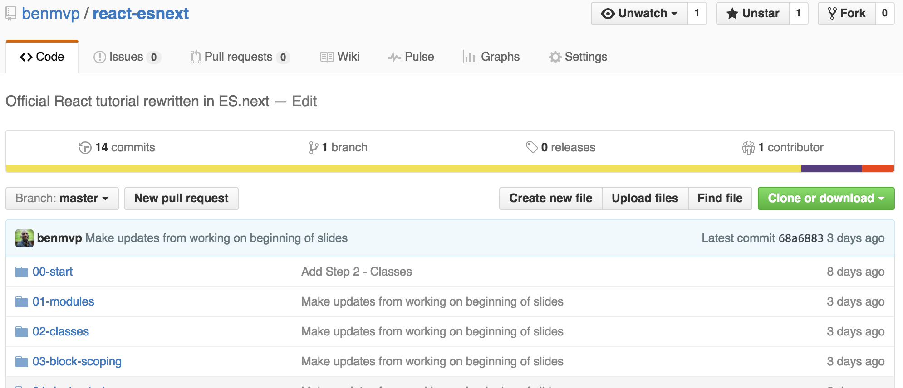

# React + ES.next = ♥

<br />

## Ben Ilegbodu

<br />

[@benmvp](https://twitter.com/benmvp) | [benmvp.com](/) | [#reactconf](https://twitter.com/hashtag/reactconf)    

<br />

March 13, 2017  

NOTES:
- My name is Ben Ilegbodu
- Super excited to talk about my two favorite things
- React and what I'm calling ES.next
- And how they go so well together
- Posted link to slides on twitter if you want to follow along

/////

<!-- .slide: data-background="url(../../img/giphy/stand-up.gif) no-repeat center" data-background-size="cover" -->

# Stand Up!
<!-- .element: style="-webkit-text-stroke: black 4px" -->

NOTES:
- But first, would like everyone to stand up!
- Let's do some wall sits
- Let's roll our shoulders
- Let's stretch our arms
- Now turn to your neighbors, introduce yourself & say hi
- You don't realize it, but I just tricked you
- Now you can't say that you didn't get anything out of my talk
- You at least got two things:
- Exercise & and met some people you didn't know
- But hopefully you'll get more out of the talk!

=====

ben-ilegbodu.json

<div style="display:flex;align-items:center">
	<div style="flex:0 0 50%;">
		<pre class="large"><code class="lang-json">
{
  "name": "Ben Ilegbodu",
  "priorities": [
    "Jesus", "family", "work"
  ],
  "location": "Pittsburg, CA",
  "work": "@Eventbrite",
  "role": "Frontend Eng Mgr",
  "hobbies": [
    "basketball", "DIY", "movies"
  ]
}
			</code></pre>
	</div>
	<div style="flex:0 0 50%;">
		
	</div>
</div>

NOTES:
_[1 minute]_

/////


<!-- .element: style="border: 0; background: none; margin: 0; box-shadow: none;" -->

NOTES:
- Currently a Senior UI Engineer and Frontend Platform Manager at Eventbrite
- Eventbrite is an online ticketing & events platform
- Many conferences use it for registration
- I work on the Frontend Platform team and right now we're in the midst of a transition from Backbone/Marionette to React
- Python/Django backend, but using a Node daemon to render React components server-side

/////

<!-- .slide: data-background="url(../../img/giphy/james-harden-pot-cook.gif) no-repeat center" data-background-size="contain" -->

NOTES:
- I also absolutely love basketball - both playing & watching
- But you didn't come to hear about me. At least I hope not
- You came to here about...

=====

## Agenda

0. Destructuring
0. Arrow functions
0. Spread operator
0. Promises
0. Async functions

NOTES:
- Here's the agenda
- One of the things I like about React is that it's basically JavaScript, outside JSX & lifecycle things
- So in the little time we have together wanted to focus on the features you're most likely to use building apps
- And then throw in some fun at the end

/////


<!-- .element: style="width: 75%"-->

NOTES:
- The original official React tutorial was written in ES5, presumably to make it easy to develop

/////

## ES5

```js
_handleCommentSubmit: function(comment) {
  var comments = this.state.comments;
  var newComment = comment;
  var newComments;

  newComment.id = Date.now();

  newComments = comments.concat([newComment]);
  this.setState({comments: newComments});

  $.ajax({
	url: this.props.url,
	type: 'POST',
	data: comment,
	success: function(resComments) {
		this.setState({comments: resComments});
	}.bind(this),
	error: function(xhr, status, err) {
		this.setState({comments: comments});
		console.error(this.props.url, status, err.toString());
	}.bind(this)
  });
}
```
<!-- .element: class="small" -->

NOTES:
- Here's just one method in the original ES5 code
- Handles submission of the form via AJAX (w/ optimistic updates)
- Uses `concat` to maintain immutability when adding `newComment`
- Uses jQuery to make AJAX call
- Ugly use of `.bind()` in callbacks

/////

## ES.next

```js
async _handleCommentSubmit(comment) {
  let {comments} = this.state
  let newComment = {...comment, id: Date.now()}
  let newComments = [...comments, newComment]

  this.setState({comments: newComments})

  try {
    let res = await fetch(this.props.url, {
      method: 'POST',
      body: JSON.stringify(comment)
    })
    newComments = res.json()
  } catch(ex) {
	console.error(this.props.url, ex)
    newComments = comments
  }

  this.setState({comments: newComments})
}
```

=====

## Recap

0. Destructuring
0. Arrow functions
0. Spread operator
0. Promises
0. Async functions

NOTES:
- So here's what we discussed
- I kind of cheated and only talked about the first 8, but I have helpful links for the others
- Feel free to grab the slides

=====

[](https://github.com/benmvp/react-esnext)

[github/benmvp/react-esnext](https://github.com/benmvp/react-esnext)

NOTES:
- And to be even more helpful I crated a repo where I take the ES5 React tutorial and go step-by-step converting it to ES2015+
- Feel free to star the repo 😉

=====

## Additional resources

- [React official tutorial](https://facebook.github.io/react/tutorial/tutorial.html)
- [_Learning ES6_ series](/learning-es6-series/)
- [_Async functions_](http://exploringjs.com/es2016-es2017/ch_async-functions.html)
- [Eventbrite React coding styleguide](https://github.com/eventbrite/javascript/tree/master/react)
- [Eventbrite React ESLint configuration](https://github.com/eventbrite/javascript/tree/master/packages/eslint-config-eventbrite-react)

=====


<!-- .element: style="width: 60%" -->

NOTES:
- So some quick shoutouts before I wrap

/////


<!-- .element: style="width: 50%; border: 0; background: none; margin: 0; box-shadow: none;" -->

NOTES:
-

/////


<!-- .element: style="border: 0; background: none; margin: 0; box-shadow: none;" -->

/////

# YOU!
<!-- .element: style="font-size:12em" -->

NOTES:
- It's my hope that, the main reason I do this, is so you learn something new to make you a better developer
- Any feedback would be appreciated!

=====


<!-- .element: style="width: 80%" -->

# THANKS!     <!-- .element: style="-webkit-text-stroke: white 2px" -->

NOTES:

/////

# Questions?

<br />

## Ben Ilegbodu

[benmvp.com](/) | [@benmvp](https://twitter.com/benmvp) | [ben@benmvp.com](mailto:ben@benmvp.com)

<br />

Code examples: [github/benmvp/react-esnext](https://github.com/benmvp/react-esnext)

<br />

Ask me anything! [benmvp.com/ama](http://www.benmvp.com/ama/)

NOTES:
- Slides are available on Twitter
- Github repo
- Ask questions on Twitter, via email or AMA!
