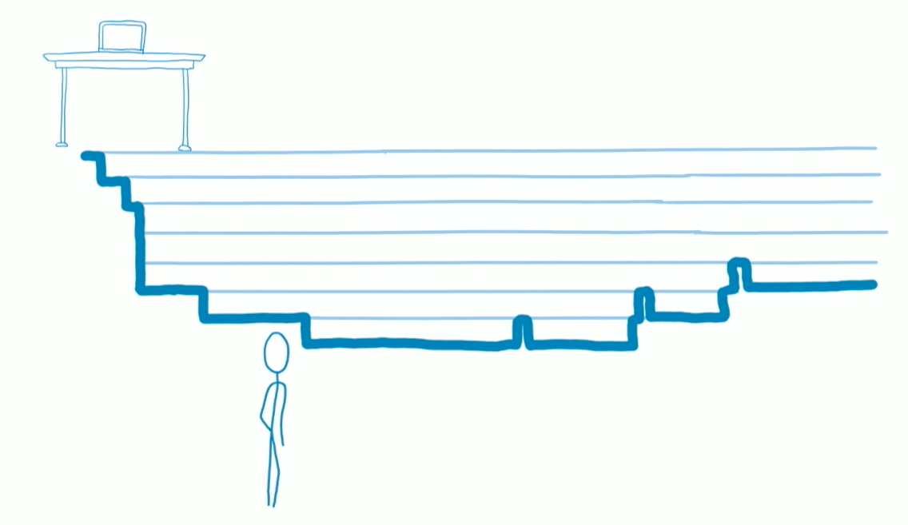
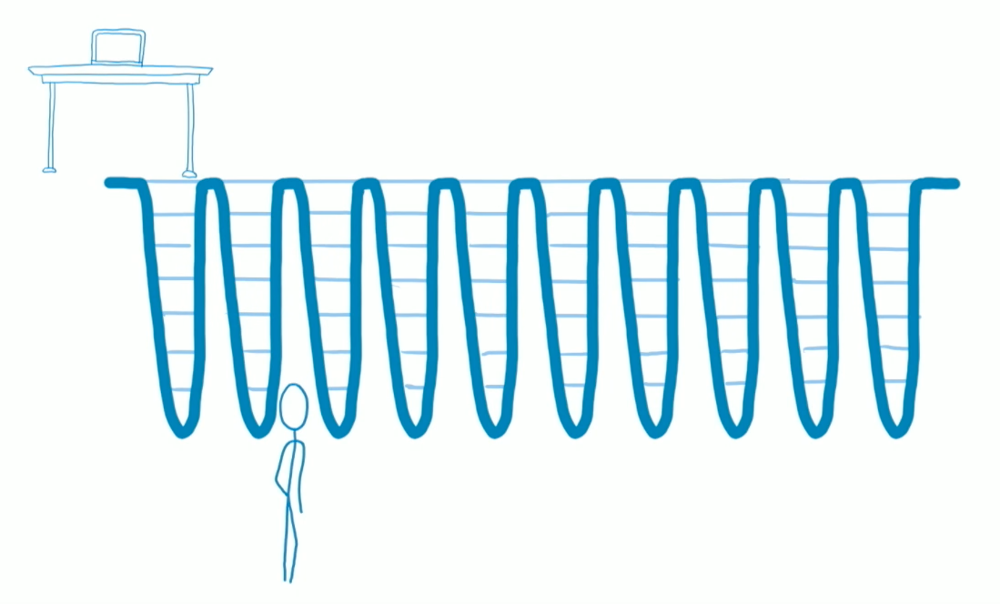
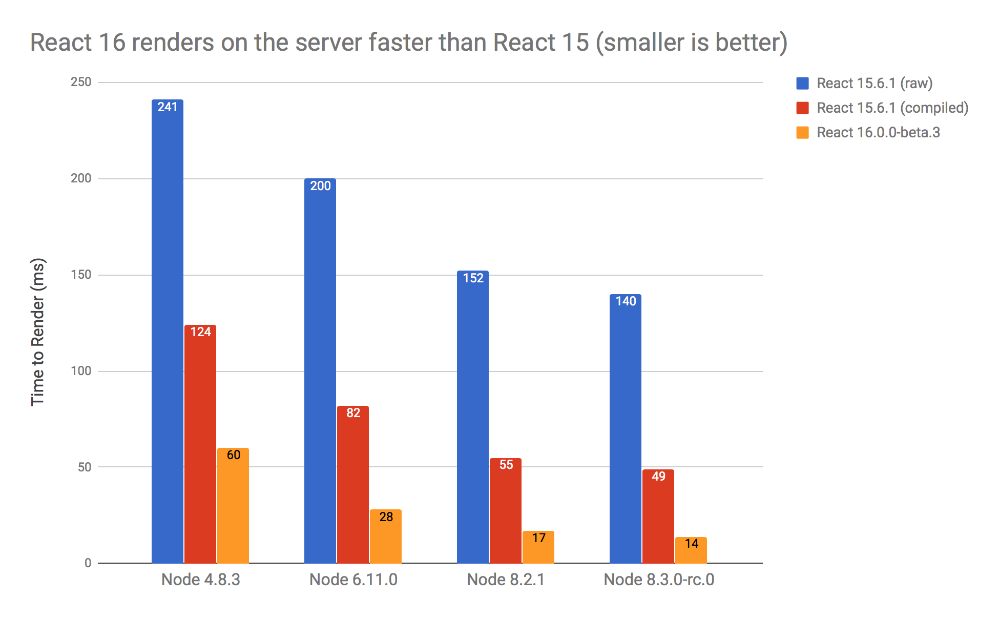
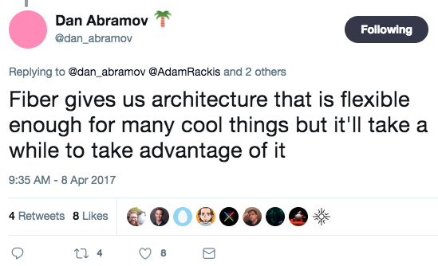

# Layperson's guide to React Fiber

<br />

## Ben Ilegbodu

<br />

[@benmvp](https://twitter.com/benmvp) | [benmvp.com](/) | [#ReactRally](https://twitter.com/hashtag/ReactRally)    

<br />

August 24, 2017  

NOTES:
- My name is Ben Ilegbodu
- Here to talk about Fiber & React 16
- Instead of talking about the technical implementation & architecture
- Focusing on how Fiber & React 16 will affect how we develop

/////

<!-- .slide: data-background="url(../../img/giphy/stand-up.gif) no-repeat center" data-background-size="cover" -->

# Stand Up!
<!-- .element: style="-webkit-text-stroke: black 4px; color: white" -->

NOTES:
- But first, would like everyone to stand up!
- Let's do 10 squats
- Now turn to your neighbors, introduce yourself & say hi
- You don't realize it, but I just tricked you
- Now you can't say that you didn't get anything out of my talk
- You at least got two things:
- Exercise & and met some people you didn't know
- But hopefully you'll get more out of the talk!

=====

## me.json

<div style="display:flex;align-items:center">
	<div style="flex:0 0 50%;">
		<pre class="large"><code class="lang-json">
{
  "name": "Ben Ilegbodu",
  "priorities": [
    "Jesus", "family", "work"
  ],
  "location": "Pittsburg, CA",
  "work": "Eventbrite",
  "role": "Engineering Manager",
  "hobbies": [
    "basketball", "DIY", "movies"
  ]
}
			</code></pre>
	</div>
	<div style="flex:0 0 50%;">
		
	</div>
</div>

NOTES:
_[1 minute]_

/////


<!-- .element: style="border: 0; background: none; margin: 0; box-shadow: none;" -->

NOTES:
- Currently an Engineering Manager at Eventbrite
- Eventbrite is an online ticketing & events platform
- Unfortunately React Rally is using our competitor, but no hard feelings
- Probably used Eventbrite before, but because an organizer told you to buy your tickets on Eventbrite
- But I'm leading the team tasked with making Eventbrite a Destination
- But at Eventbrite we've transitioned from Backbone to React
- Bunch of new major apps being written in React

/////


<!-- .element: style="width: 75%" -->

NOTES:
- I hate the Utah Jazz
- Prevented us from going to the '97 Finals to face Jordan
- Now that I've gotten that off my chest...

=====

<div style="display:flex;align-items:center;justify-content:space-around;">
    
    <div>
      <h3>Rewrite of reconciler</h3>
      <h3>Prioritizes UI updates</h3>
      <h3>Enables async rendering</h3>
      <h3>Improves perceived performance</h3>
      <h3>In next major React version (v16)</h3>
    </div>
</div>

NOTES:
- The _reconciler_ has historically gone by the name of "Virtual DOM"
- It's the "killer feature" of React that let's us just right our code as if it's going to re-render everything
- But it's able to _reconcile_ the difference before and after and then make optimized updates
- "Virtual DOM" is a misnomer because, as we know, React exists in other environments besides DOM

/////


<!-- .element: style="border: 0; background: none; margin: 0; box-shadow: none;" -->

## Stack reconciler

NOTES:
- The current (soon-to-be-previous) reconciler has been posthumously given the name Stack reconciler
- Basically when an update needs to happen, the Stack reconciler traverses the entire component tree and does all the rendering for as long as it takes
- Then it reliquishes control back to the JS interpreter
- For deep or expensive updates this can have a noticeable impact on performance even w/ intelligent reconciliation

/////


<!-- .element: style="border: 0; background: none; margin: 0; box-shadow: none;" -->

## Fiber reconciler

NOTES:
- Instead the forthcoming Fiber reconciler will do some work and then relinquish control back to the interpreter
- So rendering becomes asynchronous because it can render a higher priority update before returning to the original update
- Imagine you have a text input field and then long list of results being populated by API response
- You want typing to have immediate feedback where as the list of results can be lower priority because it's coming from API
- These sorts of optimizations give a higher perceived performance

/////

## Update Priorities

<br />

- Synchronous
- Task
- Animation
- High
- Low
- Offscreen

NOTES:
- Synchronous (just like stack reconciler)
- Task        (next tick)
- Animation   (before next frame)
- High        (pretty soon)
- Low         (delays are ok)
- Offscreen   (prep for display/scroll)

/////

## A Cartoon Intro to Fiber

<iframe width="1333" height="750" src="https://www.youtube.com/embed/ZCuYPiUIONs" frameborder="0" allowfullscreen></iframe>

### ReactConf 2017

NOTES:
- That's all I want to say about the Fiber architecture itself
- Because Lin did an AMAZING job giving a deep-dive on how it works back at ReactConf
- In fact I snagged those previous two graphics from her talk :)
- Everywhere I looked at info about Fiber this video was linked
- It's got like 75k views! The ReactJS repo only has...
- Instead, I want to spend time talking about how Fiber & React 16 will affect how we'll dev moving forward

=====

<div style="display:flex;align-items:center">
	<div style="flex:0 0 50%;">
    <h3>20% smaller React bundle!</h3>
		<pre class="large"><code class="lang-sh">$ jsize react@next react-dom@next
react@next        2.95 kB (gzipped)
react-dom@next    37.3 kB (gzipped)</code></pre>

    <br /><br />

    <h3>Before</h3>
		<pre class="large"><code class="lang-sh">$ jsize react@15 react-dom@15
react@15        7.22 kB (gzipped)
react-dom@15    43.9 kB (gzipped)</code></pre>

    <br />

    (<a href="https://github.com/antonmedv/jsize" target="_blank"><code>jsize</code></a> utility)
	</div>
	<div style="flex:0 0 50%;">
		
	</div>
</div>

NOTES:
- Now: 40.25kb, Before: 51.12kb
- 20%+ reduction!

=====

## React 15.5 deprecations ➜ React 16 errors

<div style="display:flex;align-items:center;justify-content: space-between">
	<div style="flex:0 0 48%;">
		
    <pre><code class="lang-js">import PropTypes from 'prop-types'</code></pre>
	</div>
	<div style="flex:0 0 48%;">
		
    <pre><code class="lang-js">import createClass from 'create-react-class'</code></pre>
	</div>
</div>

<br />

```sh
jscodeshift -t react-codemod/transforms/React-PropTypes-to-prop-types.js <path>
```
```sh
jscodeshift -t react-codemod/transforms/class.js <path>
```

[`react-codemod`](https://github.com/reactjs/react-codemod)

NOTES:
- Use the `prop-types` lib for prop types
- Use ES6 classes or `create-react-class` lib for components
- I'm guessing removing these helped with smaller build size

=====

```js
const PageBody = () => (
  <aside> LEFT NAV </aside>
  <section> MAIN BODY </section>
)

const Page = () => (
  <main>
    <h1> HEADING </h1>
    <PageBody />
  </main>
)
```
<!-- .element: class="large" -->

Adjancent JSX elements are invalid

NOTES:
- When you were new to React, you may have tried to do something like this
- You know you want to stick the contents of `PageBody` in `Page`
- Maybe you're using flexbox or grid, and you need the `<h1>`, `<aside>` & `<section>` to be siblings

/////


<!-- .element: style="border: 0; background: none; margin: 0; box-shadow: none; width: 80%" -->

# 😭

NOTES:
- However, this results in an error saying you have to wrap in an enclosing tag
- The result is a lot of "tag bloat" because you needed enclosing tags everywhere
- And this breaks flexbox

/////

Adjacent JSX elements is _still_ an error in React 16...

```js
const PageBody = () => ([
  (<aside key="aside"> LEFT NAV </aside>),
  (<section section="section"> MAIN BODY </section>),
])

const Page = () => (
  <main>
    <h1> HEADING </h1>
    <PageBody />
  </main>
)
```
<!-- .element: class="large" -->

...but arrays **ARE** valid return values in React 16! 👏🏾

NOTES:
- Adjacent JSX elements is also an error in React 16
- Because it result in invalid JavaScript
- However, React 16 allows returning an array from a component!
- Arrays weren't allowed as return values in React 15
- You could use arrays w/in JSX, but not as component return values
- We can get rid of so many enclosing `<div>`s
- Unique `key` is needed (to hide warning)
- Wrapping JSX in parentheses, but this isn't necessary
- Whenever I use JSX in the midst of regular JSX I surround in parentheses to indicate different "context"
- Pretty ugly syntax for fixed markup

/////

## React 16 + "self-eradicating" component 😎

```js
const Aux = (props) => props.children
const PageBody = () => (
  <Aux>
    <aside> LEFT NAV </aside>
    <section> MAIN BODY </section>
  </Aux>
)
const Page = () => (
  <main>
    <h1> HEADING </h1>
    <PageBody />
  </main>
)
```
<!-- .element: class="large" -->

Source: [github/gajus/react-aux](https://github.com/gajus/react-aux)

NOTES:
- An interesting solve I just came across is to use a "self-eradicating" component
- `Aux` just returns its children. In React 15 if `children` was an array, it'd fail. But in React 16 it won't!
- So even though it looks like `PageBody` has a container element around the elements, the `<h1>`, `<aside>` & `<section>` will be siblings
- And now we can have fixed markedup with having to deal with that weird mix of arrays and JSX
- And not having to specify the `key`s
- In general, this is when array returning will be most useful; when it's a variable (usually from `map`)
- BTW, `react-aux` is literally just that component

=====

## Strings are also valid return values in React 16! 👍🏾  

```js
const Localized = ({msg, tokens}) => {
  let translated = i18n(msg)

  translated = interpolate(formatMsg, tokens)

  return translated
}

export default const App = () => (
  <main>
    <Localized msg="Hello {name}!" tokens={{name: 'Ben'}} />
  </main>
)
```
<!-- .element: class="large" -->

(numbers & booleans too)

NOTES:
- In React 16 string values are valid return values
- It's likely that this isn't so big of a deal for you
- The only real-world use case I've found for this is I18N components
- We basically want a utility function wrapped in the convenience of a declarative component that can optionally handle markup
- Other scalar values like numbers & booleans are also valid

=====

## Uncaught errors now unmount your app!


<!-- .element: style="border: 0; background: none; margin: 0; box-shadow: none; width: 100%" -->

# 🤔

NOTES:
- In React 16, uncaught errors unmount your entire app
- React team debated this decision, but felt it's worse to leave a corrupted UI
- In DEV mode you will see something like this, especially w/ Create React App
- In migrating to React 16 you may uncover existing crashes that you may not have noticed unless you had dev tools open
- Helpful error message mentions using error boundaries w/ link on learning more
- But I'm ging to tell you all about them!

/////

## New `componentDidCatch` lifecycle method!

<br />

```js
export default class ErrorBoundary extends PureComponent {
  componentDidCatch(error, errorInfo) {

  }
}
```
<!-- .element: class="large" -->

NOTES:
- However, React 16 introduces new lifecycle method called `componentDidCatch`
- In that method you receive the error/exception and additional information like the stack trace

/////

```js
export default class ErrorBoundary extends PureComponent {
  state = {
    hasError: false
  }
  componentDidCatch(error, errorInfo) {
    this.setState({hasError: true})
    Bugsnag.notifiyException(error, 'ReactError');
  }
  render() {
    if (!this.state.hasError) {
      return this.props.children
    }

    return (<h1>Something went wrong 😿!</h1>)
  }
}
```
<!-- .element: class="large" -->

NOTES:
- So we can create what's called an "error boundary" component
- It maintains state whether or not an error has occurred
- When one has ocurred, set state to `true` & probably also log to error reporting service
- In `render()` when there's an error, we'll display the error message
- When no error, just render the children (which works because we can return any type from components)

/////

## Error boundary component

<br />

```js
<ErrorBoundary>
  <Buggyomponent />
</ErrorBoundary>
```
<!-- .element: class="large" -->

<br />

(used like any other component)

NOTES:

- Any errors that happen within `Buggyomponent` or lower in the tree will trigger `componentDidCatch` in `ErrorBoundary`
- **IMPORTANT:** It cannot catch errors within itself. That would get bubbled up to a error boundary component higher in the tree
- So if you have sections of an app that are independent, you can wrap them and if one part fails, the whole thing doesn't

/////

```js
const App = () => (
  <div>
    <nav>
      <Link to="/dashboard">Dashboard</Link>
    </nav>
    <main>
      <ErrorBoundary>
        <Route path="/dashboard" component={Dashboard} />
      </ErrorBoundary>
    </main>
  </div>
)
```
<!-- .element: class="large" -->

Wrap top-level route components in error boundary components

NOTES:
- You can use error boundary components anywhere
- Most sense is wrapping top-level route components
- Can have a page-level error boundary that looks much like the 500 page your server would generate
- But at least now you can have some nav UI around it

=====

## No more `data-reactid` attributes from server!

```html
<div class="App" data-reactroot="">
  <nav>
    <a href="/dashboard">Dashboard</a>
  </nav>
  <main>
    <section> ... </section>
  </main>
</div>
```
<!-- .element: class="large" -->

<br />

### Use new `ReactDOM.hydrate()` on client

```js
ReactDOM.hydrate(<App />, document.getElementById('root'))
```
<!-- .element: class="large" -->

NOTES:
-  `renderToString` is used server-side to render HTML markup to return in response body
- Server-side rendering is good for user performance & SEO
- In React <= 15, markup with flodded with `data-reactid` attributes which React used to correlate markup
- React tries it's best to do the proper correlation & attach handlers
- Use `ReactDOM.hydrate()` instead of usual `ReactDOM.render()` on the client
- Deprecate in React 16, will be removed in React 17

/////


<!-- .element: style="border: 0; background: none; margin: 0; box-shadow: none; width: 75%" -->

[github/aickin/react-16-ssr-perf](https://github.com/aickin/react-16-ssr-perf)

NOTES:
- Comparing Raw React 15, compiled React 15, and compiled React 16 beta 3
- Latest Node 4, 6 & 8
- Upcoming Node 8.3 RC shipped with high-performant V8 6.0 w/ Turbofan
- Event with speed-ups, rendering to string is still sub-optimal:
  0. Server can't send out response until entire HTML is created, so browsers can't paint until `renderToString` is finished
  0. Server has to allocate memory for entire HTML string
  0. Single call to `renderToString` can dominate CPU


/////

## First-class server-side streaming support! 🎉

```js
import {renderToNodeStream} from 'react-dom/server'

app.get('/', (req, res) => {
  // write opening <html>, <head>, <body> tags streamed

  renderToNodeStream(<App />)
    .pipe(res)
    .on('end', () => {
      // write rest of page, <body>, <html>
      res.end()
    })
})
```
<!-- .element: class="large" -->

Prior art: [`react-dom-stream`](https://github.com/aickin/react-dom-stream)

NOTES:
- React now supports server-side streaming!
- With streaming, the browser can render pages before entire response is finished
- Even further performance gains
- We should be aware that all the server features were the last to be developed, so they're likely to still be buggy

=====

## Fiber makes React renderers easier to build

<div style="columns:3;-webkit-columns:3;-moz-columns:3;margin: 2em 0">
  [`ink`](https://github.com/vadimdemedes/ink)  
  [`noop-renderer`](https://github.com/facebook/react/blob/master/src/renderers/noop/ReactNoop.js)  
  [`rax`](https://github.com/alibaba/rax)  
  [`react-art`](https://github.com/reactjs/react-art)  
  [`react-blessed`](https://github.com/Yomguithereal/react-blessed)  
  [`react-canvas`](https://github.com/Flipboard/react-canvas)  
  [_**`react-dom`**_](https://github.com/facebook/react/tree/master/packages/react-dom)  
  [`react-fs-renderer`](https://github.com/ericvicenti/react-fs-renderer)  
  [`React-Gibbon`](http://techblog.netflix.com/2017/01/crafting-high-performance-tv-user.html)  
  [`React-GL`](https://github.com/PixelsCommander/React-GL)  
  [`react-hardware`](https://github.com/iamdustan/react-hardware)  
  [`react-konsul`](https://github.com/mohebifar/konsul)  
  [_**`react-native`**_](https://github.com/facebook/react-native)  
  [`react-pdf`](https://github.com/diegomura/react-pdf)  
  [_**`react-sketchapp`**_](https://github.com/airbnb/react-sketchapp)  
  [_**`react-test-renderer`**_](https://www.npmjs.com/package/react-test-renderer)  
  [`react-three`](https://github.com/Izzimach/react-three)  
  [`react-titanium`](https://github.com/yuchi/react-titanium)  
  [`react-tvml`](https://github.com/ramitos/react-tvml)  
  [_**`react-vr`**_](https://github.com/facebookincubator/react-vr)  
  [`react-worker-dom`](https://github.com/web-perf/react-worker-dom)  
  [`react-x11`](https://github.com/sidorares/react-x11)  
  [`ReactLiberty`](https://github.com/LibertyGlobal/ReactLiberty)  
</div>

Source: [`awesome-react-renderer`](https://github.com/chentsulin/awesome-react-renderer)

NOTES:
- By rewritting the reconciler, it creates a clean separation between the singular reconciler
- And the many type of rendering environments (23 total listed)
- All of these renderers will make use of all the improvements of the Fiber reconciler

=====

## Installation

<br />

```sh
yarn add react@next react-dom@next
```
<!-- .element: class="large" -->

or

```sh
npm install --save react@next react-dom@next
```
<!-- .element: class="large" -->

<br />

(Async scheduling is turned off 😐)

NOTES:
- So that's basically it for the new features with React 16!
- There are a bunch of other little things here and there
- Installing is as simple as getting `@next` (beta 5)
- Provided that you've addressed all warnings you should be good
- React team focus was more on backwards compat with React 15 w/ new reconciler
- Async scheduling (the big feature) is turned off in initial release
- Will be a opt-in feature flag to turn it on in future release

/////


<!-- .element: style="border: 0; background: none; margin: 0; box-shadow: none; width: 50%" -->

NOTES:
- However, if we can keep this between us...

/////

## "Secret" code to enable async scheduling 🤐

<br />

- Open `node_modules/react-dom/cjs/react-dom.development.js`
- Replace "`fiberAsyncScheduling: false`" ➜ "`fiberAsyncScheduling: true`"

<br />

```
// make low-priority update
ReactDOM.unstable_deferredUpdates(() => {
  this.setState((state, props) => {
    // return updated state
  })
});
```
<!-- .element: class="large" -->

Source: [`react-fiber-resources`](https://github.com/koba04/react-fiber-resources#try-react-fiber-with-asynchronous-scheduling)

NOTES:
- First need to manually turn on async scheduling by turning on flag in `react-dom`
- Then you can use the unstable API `unstable_deferredUpdates` in `ReactDOM`
- This makes the `setState` a "low priority"
- Great for the results of API calls that can wait a bit
- Using `setState` updater function is even more important now
- `react-fiber-resources` has a sample app

/////

## React Fiber Synchronous Scheduling 😞 

<a href="https://twitter.com/koba04/status/854924460352192520">
  
</a>

NOTES:
- `fiberAsyncScheduling: false`
- With a very heavy update
- You can go from a performance profile that looks like this
- Where the browser is spending so much time updating your UI that it can't do anything else
- To...

/////

## React Fiber Asynchronous Scheduling! 🤗

<a href="https://twitter.com/koba04/status/854924460352192520">
  
</a>

NOTES:
- `fiberAsyncScheduling: true`
- This where the browser has time to come up for air
- This it really happening in a browser

/////

<a href="https://twitter.com/dan_abramov/status/850748912373813249">
  
</a>

NOTES:
- There's so much hype about Fiber; mythical unicorn to solve all our problems
- It was announced over a year ago in July 2016 so it's been building
- But React 16 is just the beginning of all the great stuff coming our way

=====

## Additional resources

<br />

- [React 16 beta](https://github.com/facebook/react/issues/10294)
- [A Cartoon Intro to Fiber](https://www.youtube.com/watch?v=ZCuYPiUIONs) by [Lin Clark](https://twitter.com/linclark)
- [React Fiber resources](https://github.com/koba04/react-fiber-resources) by [Toru Kobayashi](https://twitter.com/koba04)
- [Error Handling in React 16](https://facebook.github.io/react/blog/2017/07/26/error-handling-in-react-16.html) by [Dan Abramov](https://twitter.com/dan_abramov)
- [What's New in React 16 and Fiber Explanation](https://medium.com/@treyhuffine/react-16-features-and-fiber-explanation-e779544bb1b7) by [Trey Huffine](https://twitter.com/treyhuffine)
- [Using React v16 to create self-destructing components](https://medium.com/@gajus/using-react-v16-to-create-self-destructing-components-de8e4eb61d0f)

=====


<!-- .element: style="width: 50%" -->

NOTES:
- So some quick shoutouts before I wrap

/////


<!-- .element: style="width: 50%; border: 0; background: none; margin: 0; box-shadow: none;" -->

NOTES:
- Truly an honor & privilege to be here
- 2 years ago I didn't know React
- I hadn't even spoken publicly before
- And I know I'm here. Bananas!
- Crazy thing is that the organizers were as excited for me to be here as I am

/////


<!-- .element: style="border: 0; background: none; margin: 0; box-shadow: none;" -->

## We're hiring!   <!-- .element: class="fragment" -->

NOTES:
- Also thanks for continued support in speaking at conference to share what I know and what we've been doing
- Gonna ask you to sort a linked list in C++...
- on the back of a cocktail napkin...
- in crayon 😂

/////

# YOU!
<!-- .element: style="font-size:12em" -->

NOTES:
- Thanks to you all for being here; taking the time out and attending the conference
- I love that moment when I hear a conference talk that encourages me to learn more or go apply what I learned
- Or I go to the office like "yo, we gotta start doing this!" or we gotta stop doing this!"
- It's my hope that, the main reason I do this, is so you learn something new to make you a better developer
- Any feedback would be appreciated!

=====


<!-- .element: style="width: 50%" -->

## Ben Ilegbodu

[benmvp.com](/) | [@benmvp](https://twitter.com/benmvp) | [ben@benmvp.com](mailto:ben@benmvp.com)  
[github/benmvp](https://github.com/benmvp)
<br /><br />

Ask me anything! [benmvp.com/ama](http://www.benmvp.com/ama/)

NOTES:
- So that's it!
- Slides are available on Twitter and Blog
- Ask questions on Twitter, via email or AMA!
- Better yet, just come up to me during the breaks - it can be awkward or cool, it doesn't matter
- Just not awkward in the bathroom; that's off limits
- And don't let me know you're a Jazz fan
- Thanks!
