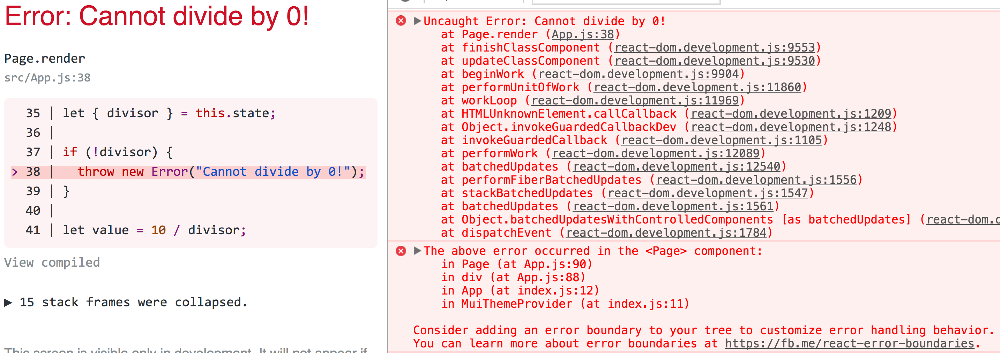

# Layperson's guide to React Fiber

<br />

## Ben Ilegbodu

<br />

[@benmvp](https://twitter.com/benmvp) | [benmvp.com](/) | [#ReactRally](https://twitter.com/hashtag/ReactRally)    

<br />

August 24, 2017  

NOTES:
- My name is Ben Ilegbodu
- Here to talk about React 16 & Fiber
- Funny thing: When I submitted the talk back in April I assumed 16 would be out


/////

[](http://isfiberreadyyet.com/)

[isfiberreadyyet.com](http://isfiberreadyyet.com/)

NOTES:
- I mean it's ready!
- But it is in Beta
- It's been about 4 weeks or so
- So maybe soon?


/////

<!-- .slide: data-background="url(../../img/giphy/stand-up.gif) no-repeat center" data-background-size="cover" -->

# Stand Up!
<!-- .element: style="-webkit-text-stroke: black 4px; color: white" -->

NOTES:
- But first, would like everyone to stand up!
- Let's do 10 squats
- Now turn to your neighbors, introduce yourself & say hi
- You don't realize it, but I just tricked you
- Now you can't say that you didn't get anything out of my talk
- You at least got two things:
- Exercise & and met some people you didn't know
- But hopefully you'll get more out of the talk!

=====

ben-ilegbodu.json

<div style="display:flex;align-items:center">
	<div style="flex:0 0 50%;">
		<pre class="large"><code class="lang-json">
{
  "name": "Ben Ilegbodu",
  "priorities": [
    "Jesus", "family", "work"
  ],
  "location": "Pittsburg, CA",
  "work": "Eventbrite",
  "role": "Engineering Manager",
  "hobbies": [
    "basketball", "DIY", "movies"
  ]
}
			</code></pre>
	</div>
	<div style="flex:0 0 50%;">
		
	</div>
</div>

NOTES:
_[1 minute]_

/////


<!-- .element: style="border: 0; background: none; margin: 0; box-shadow: none;" -->

NOTES:
- Currently an Engineering Manager at Eventbrite
- Eventbrite is an online ticketing & events platform
- Unfortunately React Rally is using our competitor, but no hard feelings
- Probably used Eventbrite before, but because an organizer told you to buy your tickets on Eventbrite
- But I'm leading the team tasked with making Eventbrite a Destination
- But at Eventbrite we've transitioned from Backbone to React
- Bunch of new major apps being written in React

/////


<!-- .element: style="width: 75%" -->

NOTES:
- I hate the Utah Jazz
- Prevented us from going to the '97 Finals to face Jordan

=====

<div style="display:flex;align-items:center;justify-content:space-around;">
    
    <div>
      <h3>Next major React version (v16)</h3>
      <h3>Rewrite of reconciler</h3>
      <h3>Enables async rendering</h3>
      <h3>UI update prioritization</h3>
      <h3>Improves perceived performance</h3>
    </div>
</div>

NOTES:
- 

/////


<!-- .element: style="border: 0; background: none; margin: 0; box-shadow: none;" -->

## Stack reconciler

/////


<!-- .element: style="border: 0; background: none; margin: 0; box-shadow: none;" -->

## Fiber reconciler

/////

## A Cartoon Intro to Fiber

<iframe width="1333" height="750" src="https://www.youtube.com/embed/ZCuYPiUIONs" frameborder="0" allowfullscreen></iframe>

### ReactConf 2017

NOTES:
- That's all I want to say about the Fiber architecture itself
- Because Lin did an AMAZING job giving a deep-dive on how it works back at ReactConf
- In fact I snagged those previous two graphics from her talk :)

=====

<div style="display:flex;align-items:center">
	<div style="flex:0 0 50%;">
    <h3>20% smaller React bundle!</h3>
		<pre class="large"><code class="lang-sh">$ jsize react@next react-dom@next
react@next        2.95 kB (gzipped)
react-dom@next    37.3 kB (gzipped)</code></pre>

    <br /><br />

    <h3>Before</h3>
		<pre class="large"><code class="lang-sh">$ jsize react@15 react-dom@15
react@15        7.22 kB (gzipped)
react-dom@15    43.9 kB (gzipped)</code></pre>

    <br />

    (<a href="https://github.com/antonmedv/jsize" target="_blank"><code>jsize</code></a> utility)
	</div>
	<div style="flex:0 0 50%;">
		
	</div>
</div>

NOTES:
- Now: 40.25kb, Before: 51.12
- 20%+ reduction!

=====

React 15 deprecations ➜ React 16 errors

<div style="display:flex;align-items:center;justify-content: space-between">
	<div style="flex:0 0 48%;">
		
	</div>
	<div style="flex:0 0 48%;">
		
	</div>
</div>

<br />

```sh
jscodeshift -t react-codemod/transforms/React-PropTypes-to-prop-types.js <path>
```
```sh
jscodeshift -t react-codemod/transforms/class.js <path>
```

[`react-codemod`](https://github.com/reactjs/react-codemod)

NOTES:
- Use the `prop-types` lib for prop types
- Use ES6 classes or `create-react-class` lib for components
- I'm guessing this helped with smaller bundle size

=====

```js
const FormatMessage = ({msg, tokens}) => {
  let formatMsg = i18n(msg)

  formatMsg = interpolate(formatMsg, tokens)

  return formatMsg
}

export default const App = () => (
  <div>
    <FormatMessage msg="Hello {name}!" tokens={{name: 'Ben'}} />
  </div>
)
```
<!-- .element: class="large" -->

Strings are not valid return values for components in React <= 15!

NOTES:
- Strings are not valid return values for components in React <= 15

/////


<!-- .element: style="border: 0; background: none; margin: 0; box-shadow: none; width: 100%" -->

# 😢

/////

Must wrap strings in element/component in React <= 15

```js
const FormatMessage = ({msg, tokens}) => {
  let formatMsg = i18n(msg)

  formatMsg = interpolate(formatMsg, tokens)

  return (<span>formatMsg</span>)
}

export default const App = () => (
  <div>
    <FormatMessage msg="Hello {name}!" tokens={{name: 'Ben'}} />
  </div>
)
```
<!-- .element: class="large" -->

NOTES:
- Instead we had to wrap the string in an element or component
- Even though we _know_ it's going to go right there in that `<div>`
- This leads to what I call "tag bloat"

/////

```js
const FormatMessage = ({msg, tokens}) => {
  let formatMsg = i18n(msg)

  formatMsg = interpolate(formatMsg, tokens)

  return formatMsg
}

export default const App = () => (
  <div>
    <FormatMessage msg="Hello {name}!" tokens={{name: 'Ben'}} />
  </div>
)
```
<!-- .element: class="large" -->

Strings **ARE** valid return values in React 16! 👍🏾

NOTES:
- However, now in React 16 w/ Fiber string values are valid return values
- It's likely that this isn't so big of a deal for you
- The only real-world use case I've found for this is I18N components
- We basically want a utility function wrapped in the convenience of a declarative component
- However...

=====

```js
const PageBody = () => (
  <aside> LEFT NAV </aside>
  <section> MAIN BODY </section>
)

const Page = () => (
  <main>
    <h1> HEADING </h1>
    <PageBody />
  </main>
)
```
<!-- .element: class="large" -->

Adjancent JSX elements are invalid

NOTES:
- If you're coming from a templating background like Handlebars you may try to use JSX like this
- You know you want to stick the contents of `PageBody` in `Page`

/////


<!-- .element: style="border: 0; background: none; margin: 0; box-shadow: none; width: 80%" -->

# 😭

NOTES:
- However, this results in an error saying you have to wrap in an enclosing tag
- Literally one of the first things you learn/experience in React

/////

Transpiled adjacent JSX elements is not valid JavaScript

```js
const PageBody = () => (
  <aside> LEFT NAV </aside>
  <section> MAIN BODY </section>
)
```
<!-- .element: class="large" -->

<br />

```
const PageBody = () => (
  React.createElement('aside', null, ' LEFT NAV ')
  React.createElement('section', null, ' MAIN BODY ')
)
```
<!-- .element: class="large" -->

NOTES:
- So when trying to return back those two DOM nodes
- We're actually trying to return back two objects, which we know is not possible
- Only one thing can be returned: one array, object, string, boolean, etc.

/////

Must wrap adjacent JSX element in element/component in React <= 15

```js
const PageBody = () => (
  <div>
    <aside> LEFT NAV </aside>
    <section> MAIN BODY </section>
  </div>
)
```
<!-- .element: class="large" -->


```js
const PageBody = () => (
  React.createElement(
	'div',
	null,
	React.createElement('aside', null, ' LEFT NAV '),
    React.createElement('section', null, ' MAIN BODY ')
  )
)
```
<!-- .element: class="large" -->

NOTES:
- So that's why you end up having to wrap the contents in a `<div>`
- This is the main culprit of "tag bloat"
- Was looking through our design system and we have so many `<div>`s with no styling
- They exist just to contain the adjacent JSX elements we want to return

/////

Adjacent JSX elements is _still_ an error in React 16...

```js
const PageBody = () => ([
  (<aside key="aside"> LEFT NAV </aside>),
  (<section section="section"> MAIN BODY </section>),
])

const Page = () => (
  <main>
    <h1> HEADING </h1>
    <PageBody />
  </main>
)
```
<!-- .element: class="large" -->

...but arrays **ARE** valid return values in React 16! 👏🏾

NOTES:
- Adjacent JSX elements is also an error in React 16
- Because it result in invalid JavaScript
- However, React 16 allows returning an array from a component!
- Arrays, like strings, weren't allowed as return values in React 15
- We can get rid of so many container `<div>`s
- Unique `key` is needed (to hide warning)
- Wrapping JSX in parentheses, but this isn't necessary
- Whenever I use JSX in the midst of regular JSX I surround in parentheses to indicate different "context"

=====

Uncaught errors now unmount your app!


<!-- .element: style="border: 0; background: none; margin: 0; box-shadow: none; width: 100%" -->

# 🤔

NOTES:
- In React 16, uncaught errors unmount your entire app
- React team debated this decision, but felt it's worse to leave a corrupted UI
- In DEV mode you will see something like this, especially w/ Create React App
- In migrating to React 16 you may uncover existing crashes that you may not have noticed unless you had dev tools open
- Helpful error message mentions using error boundaries w/ link on learning more
- But I'm ging to tell you all about them!

/////

New `componentDidCatch` lifecycle method!

```js
export default class ErrorBoundary extends PureComponent {
  componentDidCatch(error, errorInfo) {

  }
}
```
<!-- .element: class="large" -->

NOTES:
- However, React 16 introduces new lifecycle method called `componentDidCatch`
- In that method you receive the error/exception and additional information like the stack trace

/////

```js
export default class ErrorBoundary extends PureComponent {
  state = {
    hasError: false
  }
  componentDidCatch(error, errorInfo) {
    this.setState({hasError: true})
    Bugsnag.notifiyException(error, 'ReactError');
  }
  render() {
    if (!this.state.hasError) {
      return this.props.children
    }

    return (<h1>Something went wrong!</h1>)
  }
}
```
<!-- .element: class="large" -->

NOTES:
- So we can create what's called an "error boundary" component
- It maintains state whether or not an error has occurred
- When one has ocurred, set state to `true` & probably also log to error reporting service
- In `render()` when there's an error, we'll display the error message
- When no error, just render the children

/////

Error boundary component works like any other component

<br />

```js
<ErrorBoundary>
  <BrokenComponent />
</ErrorBoundary>
```
<!-- .element: class="large" -->

NOTES:

- Any errors that happen within `BrokenComponent` or lower in the tree will trigger `componentDidCatch` in `ErrorBoundary`
- **IMPORTANT:** It cannot catch errors within itself. That would get bubbled up to a error boundary component higher in the tree

/////

```js
const App = () => (
  <div>
    <nav>
      <Link to="/dashboard">Dashboard</Link>
    </nav>
    <main>
      <ErrorBoundary>
        <Route path="/dashboard" component={Dashboard} />
      </ErrorBoundary>
    </main>
  </div>
)
```
<!-- .element: class="large" -->

Wrap top-level route components in error boundary components

NOTES:
- You can use error boundary components anywhere
- Most sense is wrapping top-level route components
- Can have a page-level error boundary that looks much like the 500 page your server would generate
- But at least now you can have some nav UI around it
- But can also wrap smaller independent interactive components on a page

=====

## Installation

<br />

```sh
yarn add react@next react-dom@next
```
<!-- .element: class="large" -->

or

```sh
npm install --save react@next react-dom@next
```
<!-- .element: class="large" -->

NOTES:
- Right now the latest version is beta 5

=====

## Recap

<br />

0. Smaller footprint
0. React 15 warnings are errors in React 16
0. Components can return strings & arrays
0. Component error boundaries
0. Server-side rendering
0. Update prioritization

NOTES:

/////

## Additional resources

<br />

- [A Cartoon Intro to Fiber](https://www.youtube.com/watch?v=ZCuYPiUIONs) by [Lin Clark](https://twitter.com/linclark)
- [React Fiber resources](https://github.com/koba04/react-fiber-resources) by [Toru Kobayashi](https://twitter.com/koba04)
- [Error Handling in React 16](https://facebook.github.io/react/blog/2017/07/26/error-handling-in-react-16.html) by [Dan Abramov](https://twitter.com/dan_abramov)
- [What's New in React 16 and Fiber Explanation](https://medium.com/@treyhuffine/react-16-features-and-fiber-explanation-e779544bb1b7) by [Trey Huffine](https://twitter.com/treyhuffine)
- [React 16 beta](https://github.com/facebook/react/issues/10294)

=====


<!-- .element: style="width: 50%" -->

NOTES:
- So some quick shoutouts before I wrap

/////


<!-- .element: style="width: 50%; border: 0; background: none; margin: 0; box-shadow: none;" -->

NOTES:
- Truly an honor & privilege to be here
- 2 years ago I didn't know React
- I hadn't even spoken publicly before
- And I know I'm here. Bananas!
- Crazy thing is that the organizers were as excited for me to be here as I am

/////


<!-- .element: style="border: 0; background: none; margin: 0; box-shadow: none;" -->

## We're hiring!   <!-- .element: class="fragment" -->

NOTES:
- Also thanks for continued support in speaking at conference to share what I know and what we've been doing
- Gonna ask you to sort a linked list in C++...
- on the back of a cocktail napkin...
- in crayon 😂

/////

# YOU!
<!-- .element: style="font-size:12em" -->

NOTES:
- Thanks to you all for being here; taking the time out and attending the conference
- I love that moment when I hear a conference talk that encourages me to learn more or go apply what I learned
- Or I go to the office like "yo, we gotta start doing this!" or we gotta stop doing this!"
- It's my hope that, the main reason I do this, is so you learn something new to make you a better developer
- Any feedback would be appreciated!

=====


<!-- .element: style="width: 50%" -->

## Ben Ilegbodu

[benmvp.com](/) | [@benmvp](https://twitter.com/benmvp) | [ben@benmvp.com](mailto:ben@benmvp.com)  
[github/benmvp](https://github.com/benmvp)
<br /><br />

Ask me anything! [benmvp.com/ama](http://www.benmvp.com/ama/)

NOTES:
- So that's it!
- Slides are available on Twitter and Blog
- Ask questions on Twitter, via email or AMA!
- Better yet, just come up to me during the breaks - it can be awkward or cool, it doesn't matter
- Just not awkward in the bathroom; that's off limits
- And don't let me know you're a Jazz fan
- Thanks
