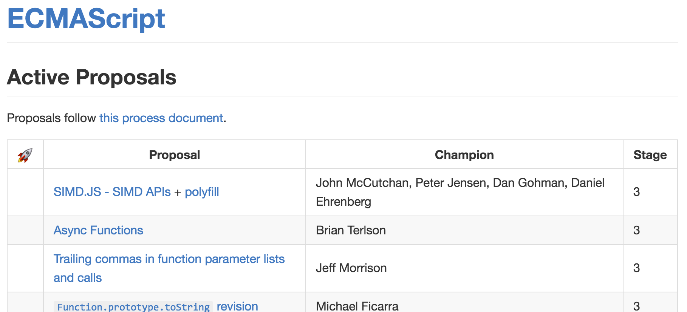
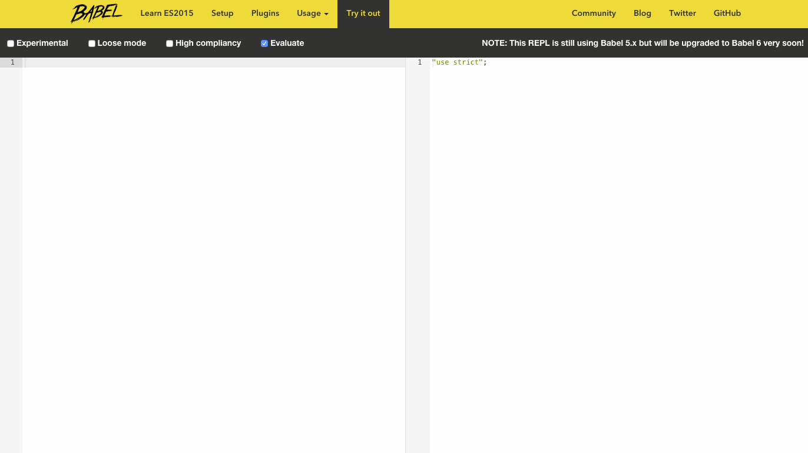

# ES.next Fundamentals Workshop

<br />

## Ben Ilegbodu

<br />

[@benmvp](https://twitter.com/benmvp) | [benmvp.com](/) | [@WeSabio](https://twitter.com/WeSabio)  

<br />

February 21, 2017  

NOTES:
- Posted link to slides on twitter if you want to follow along
- This is Sweet ECMAScript 6 aka ES6, the latest version of JavaScript
- Technically it's called ES2015, because the spec was released last year in 2015

/////

## Agenda
<!-- .element: style="margin-bottom: 1em" -->

0. ES.next overview
0. Quizzes
0. Exercises

NOTES:
- First hour will be an overview of ES.next as a presentation
- Ask questions as we go!
- Take a break, then do some quizzes to warm up
- Then spend the rest of the time working individually on exercises
- You can listen to me all you want
- But the best way to learn is by doing

=====

ben-ilegbodu.json

<div style="display:flex;align-items:center">
	<div style="flex:0 0 50%;">
		<pre class="large"><code class="lang-json">
{
  "name": "Ben Ilegbodu",
  "priorities": [
    "Jesus", "family", "work"
  ],
  "location": "Pittsburg, CA",
  "work": "@Eventbrite",
  "role": "Frontend Eng Mgr",
  "hobbies": [
    "basketball", "DIY", "movies"
  ]
}
			</code></pre>
	</div>
	<div style="flex:0 0 50%;">
		
	</div>
</div>

NOTES:
_[1 minute]_

/////


<!-- .element: style="border: 0; background: none; margin: 0; box-shadow: none;" -->

NOTES:
- Currently a Senior UI Engineer and Frontend Platform Manager at Eventbrite
- Eventbrite is an online ticketing & events platform
- Many conferences use it for registration
- I work on the Frontend Platform team and right now we're in the midst of a transition from Backbone/Marionette to React

/////

<!-- .slide: data-background="url(../../img/giphy/james-harden-pot-cook.gif) no-repeat center" data-background-size="contain"-->

=====

# ECMAScript.next

<br />
<br />

[The _Learning ES6_ series](http://www.benmvp.com/learning-es6-series)

NOTES:
_[2 minutes]_

- So let's talk about it
- Show of hands:
  1. Heard of ECMAScript 6 before today?
  1. Played around with it?
  1. Using in live code?
- Got a pretty diverse audience
- Newbies: nice intro
- Experienced: nugget or 2
- Blog has details

/////

## History of JavaScript

- May 1995 - JavaScript
- Jun 1997 - ES1
- Jun 1998 - ES2
- Dec 1999 - ES3
- Dec 2009 - ES5
- Jun 2015 - ES6/ES2015
- Jun 2016 - ES7/ES2016
- ??? 2017 - ES2017

NOTES:
- How many folks have coded in ES6+/ES2015+?
- ECMAScript is the standard
- JavaScript is the implementation (there was also JScript & ActionScript)
- JavaScript is now 21 years old
- Brendan Eich created it back in '95; added to Netscape Navigator 2.0
- ES6/ES2015 released last year
- ES7/ES2016 released this August
- Features are in a yearly proposal process (don't know when exactly they'll be released)

/////

## ES6/ES2015

#### Syntax

<div style="columns:3;-webkit-columns:3;-moz-columns:3;font-size:smaller;margin-bottom:2em">
    <code>\_\_proto\_\_</code>  
    Arrow functions  
    Classes  
    Default parameters  
    Destructuring  
    Enhanced object literals  
    Modules  
    Rest parameters  
    Spread operator  
    Tagged templates  
    Template literals  
</div>

#### Functionality

<div style="columns:3;-webkit-columns:3;-moz-columns:3;font-size:smaller">
  Array APIs  
  Block scoping  
  `for-of`  
  Generators  
  Iterators  
  Maps  
  Math APIs  
  Module loaders  
  Number APIs  
  Object APIs  
  Promises  
  Proxies  
  Reflect API  
  RegExp APIs  
  Sets  
  String APIs  
  Subclassable built-ins  
  Symbols  
  Tail calls  
  Typed arrays  
  Unicode  
  WeakMaps  
  WeakSets  
</div>

NOTES:
- Full list of features included in the ES6 specification
- That's 30+ features!

/////

## ES7/ES2016

<br />

- [`Array.prototype.includes`](https://developer.mozilla.org/en-US/docs/Web/JavaScript/Reference/Global_Objects/Array/includes)
- [Exponentiation operator (`**`)](https://developer.mozilla.org/en-US/docs/Web/JavaScript/Reference/Operators/Arithmetic_Operators#Exponentiation_(**)

<br />

[_Final feature set of ECMAScript 2016_](http://www.2ality.com/2016/01/ecmascript-2016.html)

NOTES:
- Just 2 features made it to the final stage 4 by the January 2016 cut-off date to make it into ES2016
- So _all_ those features we called ES7 features were still in the proposal process

/////

## ES2017

<br />

- [`Object.values` / `Object.entries`](https://github.com/tc39/proposal-object-values-entries)
- [`Object.getOwnPropertyDescriptors`](https://github.com/tc39/proposal-object-getownpropertydescriptors)
- [Trailing function commas](https://github.com/tc39/proposal-trailing-function-commas)
- [String padding](https://github.com/tc39/proposal-string-pad-start-end)
- [`async` / `await`](https://github.com/tc39/ecmascript-asyncawait)

<br />

[TC39 Finished Proposals](https://github.com/tc39/proposals/blob/master/finished-proposals.md)

NOTES:
- Here are the features that have already reached Stage 4 and are all but assured to be in ES2017

/////

[TC39 Active Proposals](https://github.com/tc39/proposals)

[](https://github.com/tc39/proposals)

NOTES:
- There are still some features in Stage 3 that could make it before the end-of-January cut-off
- Particularly interested in Rest/Spread properties as we'll see

/////

## Features

0. Block scoping
0. Default parameters
0. Destructuring
0. Rest parameters
0. Spread operator
0. Arrow functions
0. Template literals
0. Classes
0. Object literal shorthand
0. String APIs
0. Array APIs
0. Object APIs

NOTES:
- Here's what we'll be covering
- Focusing on the syntactic sugar features **[NEXT]** because they are the ones your more likely to use immediately to make your code clearer
- Spicy features -> whole talk about generators
- We're going to cover these 10 features in less than 40 minutes
  - Buckle your seat belts!

=====

How can we clean/shorten this code up?

```js
function log(msg, opts) {
  var type, delay, useColor;

  if (!opts)
    opts = {};

  type = opts.type || 'info';
  delay = opts.delay;
  useColor = opts.color === undefined ? true : opts.color;

  // log message
}

log('Hi!');
log('Hi!', {type: 'error'});
log('Hi!', {type: 'warn', color: false});
```
<!-- .element: class="large" -->

NOTES:
_[3 minutes]_

- Take a look at this code for a bit while I talk
- It's a function that will log a message
  - There are a few options on how the message will be logged
- I'm sure we've all written code like this
- It's not bad but it feels like it could be cleaner.
- Let's try to fix these problems with some ES6 features
- The first issue is the separate declarations from assignments
- Ideally we'd move the declarations to after we default `options`
  - But we need to keep `var` declarations on top to be safe from `var` hoisting
  - The JS interpreter essentially moves all `var` declarations to the top of the function
- What we need is for a variable declaration that does __not__ hoist
- There's an ES6 feature for that!

/////

# Block scoping

Replace `var` with `let` & `const`

<br />
<br />

[_Learning ES6:_ Block-level scoping with `let` & `const`](http://www.benmvp.com/learning-es6-block-level-scoping-let-const/)

NOTES:
- In fact there are two: `let` & `const`
- Together they're called Block scoping
- With block scoping we can replace `var` with `let` & `const`

/////

Unified declarations with assignments!

```js
function log(msg, opts) {
  if (!opts)
    opts = {};

  let type = opts.type || 'info';
  let delay = opts.delay;
  let useColor = opts.color === undefined ? true : opts.color;
}
```
<!-- .element: class="large" -->

-----

#### Before

```js
function log(msg, opts) {
  var type, delay, useColor;

  if (!opts)
    opts = {};

  type = opts.type || 'info';
  delay = opts.delay;
  useColor = opts.color === undefined ? true : opts.color;
}
```

NOTES:

- Now with `let` we can safely move the declarations down w/ the assignments
- No more worries about variable hoisting

/////

<!-- .slide: data-background="url(../../img/giphy/unimpressed-squidward.gif) no-repeat center" data-background-size="contain"-->

NOTES:
- But really this is pretty unimpressive
- Bug fix masquerading as a feature
- It's really how `var` should've worked all along
- More so fixing a deficiency rather than supplying new functionality

/////

`const`

```js
const NAME_KEY = 'name';
const data = {key: 'adam', value: 'eve'};
const token;  // ReferenceError for not assigning a value

NAME_KEY = 'key'; // TypeError for changing a const value

data.key = 'moses'; // mutations are not an error!
```
<!-- .element: class="large" -->

Use [`Object.freeze()`](https://developer.mozilla.org/en-US/docs/Web/JavaScript/Reference/Global_Objects/Object/freeze) for objects!

<!-- .element: class="fragment" -->

Use [Immutable.js](https://facebook.github.io/immutable-js/) or [`seamless-immutable`](https://github.com/rtfeldman/seamless-immutable)!

<!-- .element: class="fragment" -->

NOTES:
- `const` is pretty straightforward
- Can’t change a value that is declared `const`
- Must assign an initial value if declared `const`
- One interesting thing is that if an object is `const` its properties are not
  - You can still assign to them
  - Need to use `Object.freeze`
  - Or Immutable.js from Facebook
  - This probably why other type-safe languages prevent `const` objects

/////

```js
function log(msg, opts) {
  if (!options)
    options = {};

  let type = opts.type || 'info';
  let delay = opts.delay;
  let useColor = opts.color === undefined ? true : opts.color;

  // log message
}

log('Hi!');
log('Hi!', {type: 'error'});
log('Hi!', {type: 'warn', color: false});
```
<!-- .element: class="large" -->

NOTES:
- Back to our code...
- One problem down, a few more to go
- It'd be nice if we didn't have to default `opts` in code
- It'd also be nice if it were clear to function callers that `opts` does get defaulted
- There's an ES6 feature for that!

=====

# Default parameters

Replace function body code with function header defaults

<br />
<br />

[_Learning ES6:_ Parameter handling](http://www.benmvp.com/learning-es6-parameter-handling/#default-parameters)

NOTES:
_[4 minutes]_

- It's called default parameters
- With default parameters we can move our defaulting logic into the function header

/////

Defaulting logic in header!

```js
function log(msg, opts = {}) {
  let type = opts.type || 'info';
  let delay = opts.delay;
  let useColor = opts.color === undefined ? true : opts.color;
}
```
<!-- .element: class="large" -->

-----

#### Before  

```js
function log(msg, opts) {
  if (!options)
    options = {};

  let type = opts.type || 'info';
  let delay = opts.delay;
  let useColor = opts.color === undefined ? true : opts.color;
}
```
<!-- .element: class="large" -->

NOTES:
_[5 minutes]_

- `opts` is now defaulted to an empty object in the function header
- Nothing earth-shattering. We're used to this from other programming languages
- However...

/////

```js
function getWidth() {
  console.log('getWidth');
  return 7;
}
function makeRect(w=getWidth(), h=w*2, opts={color:'red'}) {
  console.log(w, h, opts);
  // create rectangle
}
```
<!-- .element: class="large" -->

```
> makeRect()
getWidth
7  14  {color:'red'}

> makeRect(17)
17  34  {color:'red'}

> makeRect(4, 11)
4  11  {color:'red'}

> makeRect(2, 1, {color:'blue'})
2  1  {color:'blue'}
```

NOTES:
_[6 minutes]_

- ...take a look at this code and corresponding console output
- Unlike other programming languages that support default values (like C#), a default value in ES6 does not have to be a primitive value
  - It can be an `Object`, expression or even a functional call
- But function calls aren’t executed if the variable doesn’t need to be defaulted
  - As you can see in the sample terminal on the right, `getWidth` isn’t called when a value for `width` is specified
- Another thing to note, is that the default value for `height` is an expression that uses the `width` parameter
  - You’re free to use the value of any parameter that comes before
- Lastly, you can have non defaults after default parameters

/////

```js
function log(msg, opts = {}) {
  let type = opts.type || 'info';
  let delay = opts.delay;
  let useColor = opts.color === undefined ? true : opts.color;

  // log message
}

log('Hi!');
log('Hi!', {type: 'error'});
log('Hi!', {type: 'warn', color: false});
```
<!-- .element: class="large" -->

NOTES:

- But back to the code we're trying to fix
- With the multiple assignments we're essentially mapping object property values that may or may not exist to variables
- There's an ES6 feature for that!

=====

# Destructuring

Replace multiple assignments with a single one

<br />
<br />

[_Learning ES6:_ Destructuring](http://www.benmvp.com/learning-es6-destructuring/)

NOTES:
_[7 minutes]_

- It's called Destructuring
- With destructuring we can reduce multiple assignments down to one
- Be advised, destructuring is probably the most "out there" syntax addition
- It's ok if you don't understand it at first

/////

<!-- .slide: data-background="url(../../img/giphy/i-hate-you-brad-pitt.gif) no-repeat center" data-background-size="contain"-->

NOTES:
- I'm afraid that after we cover destructuring, you'll feel like this...
- But stick with me...

/////

<!-- .slide: data-background="url(../../img/giphy/brad-pitt-dancing.gif) no-repeat center" data-background-size="contain"-->

NOTES:
- Eventually I think you'll be super excited about them

/////

Single assignment statement!

```js
function log(msg, opts = {}) {
  let {type = 'info', delay, color: useColor = true} = opts;

  // log message
}
```
<!-- .element: class="large" -->

<br />

-----

#### Before

```js
function log(msg, opts = {}) {
  let type = opts.type || 'info';
  let delay = opts.delay;
  let useColor = opts.color === undefined ? true : opts.color;

  // log message
}
```
<!-- .element: class="large" -->

NOTES:
_[8 minutes]_

- So now with object destructuring, we can collapse multiple assignments in to one
- Uses an object literal pattern to map properties of an object into multiple variables
- Doing 3 things here!
  1. Declaring 3 variables
  2. Assigning variables from object properties
  3. Defaulting when `undefined`
- But we still have the problem of not knowing what properties in `opts` are supported without looking at the function body
- There's an ES6 feature for that!

/////

Named parameters!

```js
function log(msg, {type='info', delay, color: useColor=true} = {}) {
  // log message
}
```
<!-- .element: class="large" -->

<br />

-----

#### Before

```js
function log(msg, opts = {}) {
  let {type='info', delay, color: useColor=true} = opts;

  // log message
}
```
<!-- .element: class="large" -->

NOTES:
_[10 minutes]_

- It's called object destructuring again! lol
- Object destructuring can also be done in function headers to simulate named parameters
- Now, not only is `opts` defaulted in the function header, but it's immediately destructured into the variables the function cares about
- And now anyone looking at the function header can tell what properties matter

/////

### After

```js
function log(msg, {type='info', delay, color: useColor=true} = {}) {
  // log message
}
```
<!-- .element: class="large" -->

-----


### Before

```js
function log(msg, opts) {
  var type, delay, useColor;

  if (!opts)
    opts = {};

  type = opts.type || 'info';
  delay = opts.delay;
  useColor = opts.color === undefined ? true : opts.color;

  // log message
}
```

NOTES:
_[11 minutes]_

- Took 6-8 lines of imperative code in the function body and replaced with 0 lines
- All of our code has moved into declarations in the function header!

/////

<!-- .slide: data-background="url(../../img/giphy/no-way-mickey-mouse.gif) no-repeat center" data-background-size="contain"-->

NOTES:
- How many people find destructuring to actually make the code _less_ readable?
  - You're not alone!
  - I feel the same way too!
  - Of all the ES6 syntactic sugar features, destructuring seems the least readable to me
  - But I hope that as we all get familiar with the syntax, it'll become more readable
- Let's go ahead and take a look at array destructuring while we're here...

/////

### Array destructuring

```js
let [a, b, c] = [8, true, 11];
    // a=8, b=true, c=11
let [a, b, c = 9] = ['no'];
    // a='no', b=undefined, c=9
let [, mo, day, yr] = /^(\d\d)-(\d\d)-(\d\d)$/.exec('02-21-17');
    // mo='02', day='21', yr='17'
```
<!-- .element: class="large" -->

```js
function hi(a, [b, , d]) {
    // a='hello', b=1, d=3
}
hi('hello', [1, 2, 3]);
```
<!-- .element: class="large" -->

NOTES:
- Array destructuring works much the same way as object destructuring
- The main difference is:
  - Array destructuring uses an array literal pattern on the left hand side of the assignment
  - And the order in the pattern determines the assignment matching
- Focus on the third example which is a real-world use case with regular expression matches
  - Don't need to maintain the intermediate array
- Works kind of how tuples work in Python
- Work in function headers too!

/////

```js
let {
    name,
    nicknames: [primaryNick],
    misc: {
      netWorth: netWorthThousands=0
    }
  } = {
    name: 'Sean Combs',
    nicknames: ['Puffy', 'Puff Daddy', 'Diddy'],
    misc: {
      netWorth: 735000,
      birthdate: '1969-11-04'
    }
  };
```
<!-- .element: class="large" -->

Object + array + nested destructuring!

NOTES:
- You thought destructuring was unreadable
- What about when you combine object & array destructuring?
- And what about when you also leverage nested destructuring?
- Your brain explodes! That's what.
- This conveys the point that just because you _can_ do it doesn't mean you _should_
- You can revisit this slide if you really want to try and understand what's going on

=====

# Quick Hits

=====

```js
function join(separator) {
  var values = [];

  // arguments is not an array, just "array-like"
  for (var i = 1; i < arguments.length; i++) {
      values.push(arguments[i]);
  }

  return values.join(separator);
}

// output: tic-tac-toe
join('-', 'tic', 'tac', 'toe');
```
<!-- .element: class="large" -->

Parameters list is unclear

NOTES:
- We have here a `join` method that takes a separator string followed by an unlimited number of parameters to join
- The fact that `join` takes more than one parameter is unclear let alone that it accepts an arbitrary number of them
- Because `join` uses the `separator` parameter the implementation has to start at index `1` of `arguments`
- And even if it could start at 0, `arguments` is only array-like so it doesn't have the `join` method that arrays have
- **NEED:** is an easy way to get an array of the parameters after `separator`
- And guess what? There's an ES6 feature for that

/////

# Rest parameters

Replace `arguments` with an array

<br />
<br />

[_Learning ES6:_ Parameter handling](http://www.benmvp.com/learning-es6-parameter-handling/#rest-parameters)

/////

Clearer function signature!

```js
function join(separator, ...values) {
  return values.join(separator);
}

// output: tic-tac-toe
join('-', 'tic', 'tac', 'toe');
```
<!-- .element: class="large" -->

-----

#### Before

```js
function join(separator) {
  var values = [];

  // arguments is not an array, just "array-like"
  for (var i = 1; i < arguments.length; i++) {
      values.push(arguments[i]);
  }

  return values.join(separator);
}
```

NOTES:
- That's it!
- The three dots, called the rest operator, before the parameter make it a rest parameter
  - The rest parameter is an `Array` containing the rest of the parameters
  - Hence the name!
- Because `values` is a true array in the example, we can call join on it
- It’s also much **clearer** to see that `join()` takes an infinite number of parameters
- Rest parameter should pretty much replace all uses of the `arguments` keyword!

/////

Destructuring + rest parameters!

```js
let list = [9, 8, 7, 6, 5];
let [first, ...rest] = list;

// output: 9  [8, 7, 6, 5]
console.log(first, rest);
```
<!-- .element: class="large" -->

<br />

-----

#### ES5 way
```js
var list = [9, 8, 7, 6, 5],
    first = list[0],
    rest = list.slice(1);

// output: 9  [8, 7, 6, 5]
console.log(first, rest);
```
<!-- .element: class="large" -->

NOTES:
- One last thing with rest parameters
- They can be combined with array destructuring to replace `slice`
- Now, let's take a look at yet another problem

=====

```js
var maxValueNormal = Math.max(33, 2, 9),
    arrayOfValues = [33, 2, 9],
    maxValueFromArray = Math.max.apply(null, arrayOfValues);

// output: 33  33
console.log(maxValueNormal, maxValueFromArray);
```
<!-- .element: class="large" -->

`Math.max.apply`???

NOTES:
_[21 minutes]_

- `Math.max` accepts an arbitrary number of numeric parameters and returns the maximum one
- If you want to get the maximum value of an array of numbers, you have to call `Math.max.apply`
- `apply` converts the array of values into a sequence of parameters
- But it's kind of esoteric
  - Plus you have to specify `null` as the context
- Maybe there's an ES6 feature for this?

/////

# Spread operator

Replace `apply` with the spread operator

<br />
<br />

[_Learning ES6:_ Parameter handling](http://www.benmvp.com/learning-es6-parameter-handling/#spread-operator)

/////

No more `apply`!

```js
let arrayOfValues = [33, 2, 9];
let maxValueFromArray = Math.max(...arrayOfValues);

// output: 33
console.log(maxValueFromArray);
```
<!-- .element: class="large" -->

<br />

-----

#### ES5 way

```js
var arrayOfValues = [33, 2, 9],
    maxValueFromArray = Math.max.apply(null, arrayOfValues);

// output: 33
console.log(maxValueFromArray);
```
<!-- .element: class="large" -->

NOTES:
- Instead of calling `apply` we can use the spread operator
- It's 3 dots preceding a parameter in a function call
- The spread operator _spreads_ out the array into individual parameters

/////

### Spread operator
Array &#8594; multiple parameters (function call)

```js
let arrayOfValues = [33, 2, 9];
let maxValueFromArray = Math.max(...arrayOfValues);
    // just like: Math.max(33, 2, 9)
```
<!-- .element: class="large" -->

-----

### Rest operator
Multiple parameters &#8594; array (function header)

```js
function join(separator, ...values) {
  // values = ['tic', 'tac', 'toe']
}

join('-', 'tic', 'tac', 'toe');
```
<!-- .element: class="large" -->

NOTES:
- Spread operator & rest operator look the exact same
- The spread operator works w/ function _call_ parameters
  - Takes an array literal and converts each element to individual parameters
- The rest operator works w/ function _header_ parameters
  - Takes individual parameters and puts them together into an array
- They are opposites of each other

/////

Maintain immutability!

```js
let start = ['do', 're'];
let middle = ['mi', 'fa', 'so'];
let end = ['la', 'ti'];
let scaleFromLiteral = [...start, ...middle, ...end];

// output: ['do', 're', 'mi', 'fa', 'so', 'la', 'ti']
console.log(scaleFromLiteral);
```
<!-- .element: class="large" -->

-----

#### ES5 way

```js
let start = ['do', 're'];
let middle = ['mi', 'fa', 'so'];
let end = ['la', 'ti'];
let scaleFromConcat = start.concat(middle).concat(end);

// output: ['do', 're', 'mi', 'fa', 'so', 'la', 'ti']
console.log(scaleFromConcat);
```
<!-- .element: class="large" -->


NOTES:
- When we spread multiple arrays into an array literal we're constructing a new array with all of those values
- Therefore using the spread operator within an array literal can replace using `concat`

/////

Spread operator with object literals!

```js
let warriors = {Steph: 95, Klay: 82, Draymond: 79}
let newWarriors = {
    ...warriors,
    Kevin: 97
}
```
<!-- .element: class="large" -->

-----

#### ES5 way

```js
let warriors = {Steph: 95, Klay: 82, Draymond: 79}
let newWarriors = _.assign({}, warriors, {
    Kevin: 97
})
```

[Spread Properties](https://github.com/sebmarkbage/ecmascript-rest-spread) (Stage 3)

NOTES:
- Now we copy objects while adding new properties in one object literal definition
- It's a Stage 3 ES feature
- The ES5 way was to use `_.assign()`
- ES6 did introduce Object.assign() to handle this as well, but I'll always prefer syntax


===== <!-- .slide: data-transition="fade" -->

```js
'use strict';

MyObj.prototype.update = function() {
	$.get(this._url).done(function(responseData) {

		this._data = responseData;
	});
};
```
<!-- .element: class="large" -->

Where's the bug?

NOTES:

- Can anyone spot the mistake in this code?
- We're passing a callback to `done` of the `get` ajax request

///// <!-- .slide: data-transition="fade" -->

```js
'use strict';

MyObj.prototype.update = function() {
	$.get(this._url).done(function(responseData) {
		// `this` is undefined!
		this._data = responseData;
	});
};
```
<!-- .element: class="large" -->

Undefined [`this`](https://developer.mozilla.org/en/docs/Web/JavaScript/Reference/Operators/this)!

NOTES:
- `this` is `undefined` in the callback function in strict mode
- `this` is the global scope (window) in loose mode
- Something that newbies scratch their head about
- Experienced JavaScript developers still run into it
- _[Water break]_

/////

```js
MyObj.prototype.update = function() {
	var self = this; // store reference to `this`

	$.get(self._url).done(function(responseData) {
		// `self` is available in scope
		self._data = responseData;
	});
};
```
<!-- .element: class="large" -->

ES3 fix

NOTES:
- In ES3, we solved this by storing a reference to `this` in a variable so that it’s available in the scope of the anonymous function
- Works but pretty much every method has to assign `self` variable

/////

```js
MyObj.prototype.update = function() {
	$.get(this._url).done((function(responseData) {
		this._data = responseData;
	}).bind(this)); // pass in proper `this` context
};
```
<!-- .element: class="large" -->

ES5 fix

NOTES:
- `bind()` was introduced in ES5 and it creates a new function, passing the specified `this`
- Underscore and other shim have a bind method so it can work with ES3 browsers
- Works, but messy syntax
- We need something better!

/////

# Arrow functions

Replace anonymous functions with arrow functions

<br />
<br />

[_Learning ES6:_ Arrow functions](http://www.benmvp.com/learning-es6-arrow-functions/)

NOTES:
- With arrow functions we can stop using anonymous functions

/////

Arrow functions works how you would expect!

```js
MyObj.prototype.update = function() {
	$.get(this._url).done((responseData) => {
		// `this` uses "lexical scoping"
		this._data = responseData;
	});
};
```
<!-- .element: class="large" -->

<br />

-----

#### ES5 way

```js
MyObj.prototype.update = function() {
  $.get(this._url).done((function(responseData) {
    this._data = responseData;
  }).bind(this)); // pass in proper `this` context
};
```
<!-- .element: class="large" -->


NOTES:
- Arrow functions in ES6 solve this problem
- Arrow functions use what’s called “lexical scoping” for `this`
  - It's implicitly “inherited” from the enclosing scope, which in our case would be the class method
  - Essentially arrow functions work how you would expect it to
- An arrow function is literally an arrow (fat arrow) between parameters and body

/////

```js
let squares = [1, 2, 3].map(value => value * value);
```
<!-- .element: class="large" -->

```js
let sum = [9, 8, 7, 6].reduce((prev, value) => prev + value, 0);
```
<!-- .element: class="large" -->

```js
$('button').click(e => {
  alert('Hello world!');
});
```
<!-- .element: class="large" -->

```js
setTimeout(() => {
  console.log('delayed for 1 second');
  console.log('using arrow function');
}, 1000);
```
<!-- .element: class="large" -->

```js
$.ajax({url: 'test.html', cache: false})
    .done((html) => {
        $('#results').append(html);
        console.log(html);
    });
```
<!-- .element: class="large" -->

NOTES:
- You’ll find that arrow functions come in handy most when used as a callback function.
  - The various higher-order functional programming array methods that were introduced with ECMAScript 5 (like `map`, `forEach`, `reduce`, etc.) work well with arrow functions.
  - Arrow functions can also be used as callback functions for event handlers (like `click`, `keydown`, etc)
- This also shows the different formats of arrow functions
  - Perentheses can be omitted if there is one parameter
  - Curly braces can be omitted if there's just a single `return` line

=====

```js
var first = 'Ben', last = 'Ilegbodu';

console.log('He said, "It\'s your fault!"');
    // He said, "It's your fault!"

console.log('Name: ' + last + ', ' + (14 + 18));
    // Name: Ilegbodu, 32

console.log('This is multi-line text, so\n' +
    'that newline characters are not\n' +
    'needed. Whitespace is respected\n');
```
<!-- .element: class="large" -->

Good ol' string concatenation

NOTES:

- Let's jump to another issue
- We usually don’t build string in JS anymore
- But we do sometimes have to provide messages to the user that have dynamic data

To make this easier, ES6 introduces...

/////

# Template literals

Replace string concatenation with template literals

<br />
<br />

[_Learning ES6:_ Template literals & tagged templates](http://www.benmvp.com/learning-es6-template-literals-tagged-templates/)

NOTES:
- With template literals, we can stop using string concatenation

/////

String interpolation + multi-line!

```js
let first = 'Ben', last = `Ilegbodu`;

console.log(`He said, "It's your fault!"`);
    // He said, "It's your fault!"

console.log(`Name: ${last}, ${14 + 18}`);
    // Name: Ilegbodu, 32

console.log(`This is multi-line text, so
    that newline characters are not
    needed. Whitespace is respected
`);
```
<!-- .element: class="large" -->

NOTES:
- ES6 template literals are a brand new type of string literal, delimited by backticks (`` ` ``)
  - That’s not a typo!
  - That character to the left of the 1 key
  - Because of backticks, you no longer need to escape single or double quotes
- Template literals natively support string interpolation (token substitution)
  - Any JavaScript expression can be substituted inside ${ }
  - It will ultimately be coerced into a string
- Multi-line strings are now supported as well
  - Any whitespace you put will be in the string, including tabs and newlines
- You can actually always use template literals, but I tend to only use them when interpolating


=====

```js
function Todo(content, completed) {
    this.content = content;
    this.completed = completed;
}
Todo.prototype.toString = function() {
    return 'Content: ' + this.content +
        '\nCompleted: ' + this.completed;
};

var myTodo = new Todo('Learn ES6', true);
console.log(myTodo.toString());
```
<!-- .element: class="large" -->

Create classes via constructor functions

NOTES:
_[32 minutes]_

- Hitting the home stretch now
- Does anybody these days create "classes" using vanilla JavaScript these days?
- I think Angular 1 code might have
- Only done them as interview questions

/////

```js
var Todo = Backbone.Model.extend({
  toString: function() {
    return 'Content: ' + this.get('content') +
        '\nCompleted: ' + this.get('completed');
  }
});

var myTodo = new Todo({content: 'Learn ES6', completed: true});
console.log(myTodo.toString());
```
<!-- .element: class="large" -->

Create classes via class factories

NOTES:
- Instead we create classes using class factory methods provided by our favorite library
- Here's an example in Backbone
- We create a class by calling the `extend` static method on `Backbone.Model`
- We pass a giant object literal that has all the methods or properties to define
- Typically these methods will do more work than just create the class
  - They'll do some processing of the data prior to creating the class
- In the case of `Backbone.Model.extend()` it sets up a bucket of attributes you can set on the model

/////

# Classes

Replace class factories with `class` syntax

<br />
<br />

[_Learning ES6:_ Classes](http://www.benmvp.com/learning-es6-classes/)

NOTES:
- Now we can replace assigning to the prototype or using custom class factories with native class syntax

/////

New ES6 `class` keyword

```js
class Todo {
  constructor(content, completed) {
    this.content = content;
    this.completed = completed;
  }
  toString() {
    return `Content: ${this.content}
        Completed: ${this.completed}`;
  }
}
```
<!-- .element: class="large" -->

NOTES:
- ES6 introduces the `class` keyword that defines a JavaScript "class"
- This isn't something new; it's just syntactic sugar over the ES5 constructor function
- But I feel like it's way more syntax friendly
- Methods within a class are just the name followed by parentheses. No need for `function` keyword
- The constructor is a special named method called `constructor`

/////

```js
function ColorTodo(content, completed, color) {
  Todo.call(this, content, completed);
  this.color = color;
}
ColorTodo.prototype = new Todo();

ColorTodo.prototype.toString = function() {
  return Todo.prototype.toString.call(this) +
    '\nColor: ' + this.color;
};

let myColorTodo = new ColorTodo('Learn ES6', true, 'red');
console.log(myColorTodo.toString());
```
<!-- .element: class="large" -->

Extending classes with **ES3/ES5**

NOTES:
- This is how you extend classes in ES3
- I'm assuming no one here has done this
- And this is actually the simplistic version without safety checks in ES5
- Just looking at the code it's hard to reason about what's going on here
- It's not all that clear that we're defining a `ColorTodo` class to inherit from `Todo`

/////

```js
class ColorTodo extends Todo {
  constructor(content, completed, color) {
    super(content, completed);
    this.color = color;
  }
  toString() {
    return `${super.toString()}
	  Color: ${this.color}`;
  }
}

let myColorTodo = new ColorTodo('Learn ES6', true, 'red');
console.log(myColorTodo.toString());
```
<!-- .element: class="large" -->

Extending classes with **ES6**

NOTES:
- The ES6 class syntax also supports extending or inheriting classes using the `extends` keyword
- Within the constructor, you can just call `super()` to call the base class' constructor
- You **must** call `super()` before you can access `this` in the constructor
- Similarly you can override methods in inherited classes and call base methods by calling `super.` as we have in the `toString()` method
- To me, this is far clearer than the ES5 approach

/////

ES6 static methods

```js
class Todo {
  ...

  static add() {

  }
}
```
<!-- .element: class="large" -->

-----

#### ES5 way

```js
function Todo(content, completed) {
  ...
}
Todo.add = function() {

}
```
<!-- .element: class="large" -->

NOTES:
- ES6 class syntax also supports static methods with the `static` keyword
- The static method is defined within the `class` container
- In ES5 you would just add a named function directly to the constructor function

/////

ES6 class structure

```js
class MyClass extends BaseClass {
  constructor() { }
  methodOne() { }
  methodTwo() { }
  static staticMethodA() { }
  static staticMethodB() { }
}
```
<!-- .element: class="large" -->

NOTES:
- Here's the complete structure of ES6 classes
- I really like the new syntax & try to use it all the time

/////

## Future class support

<br />


```js
class Todo {
  static todoCount = 0;
  completed = false;

  constructor() {
    console.log(this.completed);
    console.log(Todo.todoCount);
  }
}
```
<!-- .element: class="large" -->

[Public class fields](https://tc39.github.io/proposal-class-public-fields/) (Stage 2)

<!-- .element: style="font-size:smaller" -->

NOTES:
- Static & instance properties aren't supported in ES6
- In our previous examples we assigned properties in the `constructor`
- It's the only way to know that certain properties are defined
- Defining properties makes it clear what properties are supported and allows us to provide defaults
- There is a proposal to add support that's currently only in Stage 2

=====

```js
_handleSubmit(e) {
    e.preventDefault()

    let {author, text} = this.state

    if (!text || !author) {
        return
    }

    this.props.onCommentSubmit({author: author, text: text})
    this.setState(INITIAL_STATE)
}
```
<!-- .element: class="large" -->

NOTES:
- Let's pick on `CommentForm` and its `_handleSubmit()` method
- If you recall with destructuring we combined the declarations of `author` & `text` into one to reduce duplication
- But now there's duplication in the call to `this.props.onCommentSubmit`
- The name of the key matches the name of the variable

/////

# Enhanced object literals

Write less code than before

<br />
<br />

[_Learning ES6: Enhanced object literals_](http://www.benmvp.com/learning-es6-enhanced-object-literals)

/////


Object literal shorthand

```js
_handleSubmit() {
  let {author, text} = this.state

  this.props.onCommentSubmit({author, text})
}
```
<!-- .element: class="large" -->

<br />

-----

#### Before

```js
_handleSubmit() {
  let {author, text} = this.state

  this.props.onCommentSubmit({author: author, text: text})
}
```
<!-- .element: class="large" -->

NOTES:
- Now we can just omit the `: value` when the variable name & key match
- Just a little bit of shorthand
- It's interesting that both literals look the exact same, but do different things

/////

```js
_updateFormFieldState(name, e) {
    let newState = {}

    newState[name] = e.target.value

    this.setState(newState)
}
```
<!-- .element: class="large" -->

Variable object literal keys haven't been possible...

NOTES:
- There's this other helper method in `CommentForm` called `_updateFormFieldState`
- It basically wants to dynamically set state based on the passed in `name`
- But to create the object, we first have to create the empty object and then mutate the object to index into it
- This has always been a minor pet peeve of mine, until now...

/////

...until object literal computed keys!

```js
_updateFormFieldState(name, e) {
    this.setState({
        [name]: e.target.value
    })
}
```
<!-- .element: class="large" -->

-----

#### Before

```js
_updateFormFieldState(name, e) {
    let newState = {}

    newState[name] = e.target.value

    this.setState(newState)
}
```
<!-- .element: class="large" -->

NOTES:
- ES6 introduces object literal computed keys so that you can have a dynamic key right in the object literal definition!

=====

## String API

- [**`String.prototype.endsWith`**](https://developer.mozilla.org/en-US/docs/Web/JavaScript/Reference/Global_Objects/String/endsWith)
- [**`String.prototype.includes`**](https://developer.mozilla.org/en-US/docs/Web/JavaScript/Reference/Global_Objects/String/includes)
- [`String.prototype.repeat`](https://developer.mozilla.org/en-US/docs/Web/JavaScript/Reference/Global_Objects/String/repeat)
- [`String.prototype.padEnd`](https://developer.mozilla.org/en-US/docs/Web/JavaScript/Reference/Global_Objects/String/padEnd)
- [`String.prototype.padStart`](https://developer.mozilla.org/en-US/docs/Web/JavaScript/Reference/Global_Objects/String/padStart)
- [**`String.prototype.startsWith`**](https://developer.mozilla.org/en-US/docs/Web/JavaScript/Reference/Global_Objects/String/startsWith)
- [`String.raw`](https://developer.mozilla.org/en-US/docs/Web/JavaScript/Reference/Global_Objects/String/raw)

NOTES:
- Just want to alert you to some new methods introduced with ES6+ for `String`

=====

## Array API

- [**`Array.from`**](https://developer.mozilla.org/en-US/docs/Web/JavaScript/Reference/Global_Objects/Array/from)
- [`Array.of`](https://developer.mozilla.org/en-US/docs/Web/JavaScript/Reference/Global_Objects/Array/of)
- [`Array.prototype.copyWithin`](https://developer.mozilla.org/en-US/docs/Web/JavaScript/Reference/Global_Objects/Array/copyWithin)
- [`Array.prototype.fill`](https://developer.mozilla.org/en-US/docs/Web/JavaScript/Reference/Global_Objects/Array/fill)
- [**`Array.prototype.find`**](https://developer.mozilla.org/en-US/docs/Web/JavaScript/Reference/Global_Objects/Array/find)
- [`Array.prototype.findIndex`](https://developer.mozilla.org/en-US/docs/Web/JavaScript/Reference/Global_Objects/Array/findIndex)
- [**`Array.prototype.includes`**](https://developer.mozilla.org/en-US/docs/Web/JavaScript/Reference/Global_Objects/Array/includes)

NOTES:
- Also some useful methods for `Array` too

=====

## Object API

- [**`Object.assign`**](https://developer.mozilla.org/en-US/docs/Web/JavaScript/Reference/Global_Objects/Object/assign)
- [`Object.entries`](https://developer.mozilla.org/en-US/docs/Web/JavaScript/Reference/Global_Objects/Object/entries)
- [`Object.is`](https://developer.mozilla.org/en-US/docs/Web/JavaScript/Reference/Global_Objects/Object/is)
- [`Object.setPrototypeOf`](https://developer.mozilla.org/en-US/docs/Web/JavaScript/Reference/Global_Objects/Object/setPrototypeOf)
- [**`Object.values`**](https://developer.mozilla.org/en-US/docs/Web/JavaScript/Reference/Global_Objects/Object/values)

NOTES:
- Also some useful methods for `Object` too

=====

## Review

0. Block scoping
0. Default parameters
0. Destructuring
0. Rest parameters
0. Spread operator
0. Template literals
0. Arrow functions
0. Classes
0. Object literal shorthand
0. String APIs
0. Array APIs
0. Object APIs

NOTES:
- As a reminder, here's what we covered to make our code clearer and more succinct
- I know I went through it pretty quickly, so if you didn't get it at all, they're recording this talk so you can always revisit later

=====

# Using ES6 now

Native execution vs. Transpiling

<br />
<br />

[_Learning ES6:_ Using ES6 right now](http://www.benmvp.com/learning-es6-using-es6-right-now/)

NOTES:
- Before we wrap up, let's quickly talk about how we can use these features now

/////

## Native JavaScript engine support

<br />
<br />

<div style="display:flex;align-items:flex-end;justify-content:space-between;">
	<div style="flex:0 0 10%;">
	  
	  97%
	</div>
	<div style="flex:0 0 10%">
	  
	  96%
	</div>
	<div style="flex:0 0 10%">
	  
	  93%
	</div>
	<div style="flex:0 0 10%">
	  
	  100%
	</div>
	<div style="flex:0 0 10%">
	  
	  97%
	</div>
	<div style="flex:0 0 10%">
	  
	  100%
	</div>
	<div style="flex:0 0 10%">
	  
	  97%
	</div>
	<div style="flex:0 0 10%">
	  
	  100%
	</div>
</div>

<br />
<br />

[ECMAScript 6 Compatibility Table](http://kangax.github.io/compat-table/es6/)

NOTES:
- ES6 support is pretty good now.
- iOS is still lagging behind
- You may notice IE missing from the list. None of them support ES6
- Only option is transpiling

/////

### Transpiling ES6 &#8594; ES3/ES5

[](https://babeljs.io/repl/)

NOTES:
- Transpiling lets you compile your ES6 code down to ES3/ES5 code for cross-browser compatibility
- So basically what you would do is write your code in ES6
- Then in your build step when converting SASS to vanilla CSS, minifying and so forth
- You would also run the transpiler to convert your ES6 code to ES5

/////

## Transpilers

<div style="display:flex; align-items:flex-end; justify-content:space-between;">
    <div style="flex:0 0 25%">
      [](https://github.com/google/traceur-compiler)
      [Traceur](https://github.com/google/traceur-compiler)  
      56%
    </div>
    <div style="flex:0 0 25%">
      [](https://babeljs.io/)   
      [Babel](https://babeljs.io/)   
      71%
    </div>
    <div style="flex:0 0 25%">
      [](http://www.typescriptlang.org/)  
      [TypeScript](http://www.typescriptlang.org/)  
      59%
    </div>
</div>

NOTES:
- There are 3 major ES6 transpilers
- Traceur
- Babel
- TypeScript
- As you can see, Babel has the most support
- I actually prefer it over the others, but they more or less accomplish the same tasks
- If you visit the websites they have interactive transpilers you can play around with
- The previous animation was the Babel online REPL
- Babel is super popular because it also supports React's JSX syntax

=====

## Additional Resources

- **[_Learning ES6_](/learning-es6-series/) by Ben Ilegbodu**
- [ES6 Katas](http://es6katas.org/) by Wolfram Kriesing
- [_Exploring ES6_](http://exploringjs.com/es6/) by Axel Rauschmayer
- [_Understanding ECMAScript 6_](https://leanpub.com/understandinges6/) by Nicholas C. Zakas
- [_ES6 in Depth_](https://hacks.mozilla.org/category/es6-in-depth/) by Jason Orendorff
- [_ES6 in Depth_](http://ponyfoo.com/articles/tagged/es6-in-depth) by Nicolas Bevacqua
- [_Setting up ES6_](https://leanpub.com/setting-up-es6/read) by Axel Rauschmayer
- [Eventbrite ES6+ coding styleguide](https://github.com/eventbrite/javascript/tree/master/es6)

NOTES:
_[45 minutes]_

- Shameless plug!
- You can also check out my blog where I go into detail about every feature I covered
- Other great books & blogs about ES6 too!

=====

# Questions?

<br />

## Ben Ilegbodu

[benmvp.com](/) | [@benmvp](https://twitter.com/benmvp) | [ben@benmvp.com](mailto:ben@benmvp.com)

<br />

Ask me anything! [benmvp.com/ama](http://www.benmvp.com/ama/)

=====

# Quiz Time

=====

# Exercises Time
<!-- .element: style="margin-bottom: 1.5em" -->

[github.com/kentcdodds/es6-workshop](https://github.com/kentcdodds/es6-workshop)

=====


<!-- .element: style="width: 60%" -->

/////


<!-- .element: style="width: 100%;" -->

NOTES:
- Vance
- Jesse
- Amanda

/////


<!-- .element: style="border: 0; background: none; margin: 0; box-shadow: none;" -->

/////

# YOU!
<!-- .element: style="font-size:12em" -->

NOTES:
- It's my hope that, the main reason I do this, is so you can feel excited & confident to start using ES6 syntax in your code to make it clearer and more succinct
- Any feedback would be appreciated!

=====

# THANKS!


<!-- .element: style="width: 70%" -->

NOTES:

/////

# Ben Ilegbodu

[benmvp.com](/) | [@benmvp](https://twitter.com/benmvp) | [ben@benmvp.com](mailto:ben@benmvp.com)

<br />

Ask me anything! [benmvp.com/ama](http://www.benmvp.com/ama/)

NOTES:
- Slides are available on Twitter
- Ask questions on Twitter, via email or AMA!
