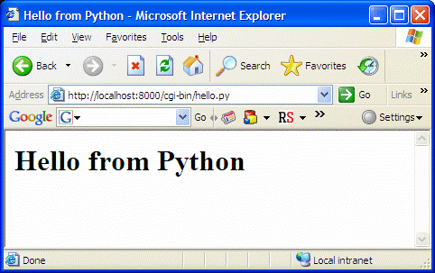

# React Fundamentals Workshop

 

## Ben Ilegbodu

 

[@benmvp](https://twitter.com/benmvp) | [benmvp.com](/) | [#strangeloop](https://twitter.com/hashtag/strangeloop)    

 

September 28, 2017  

 

## https://github.com/benmvp/react-workshop

=====

# DEMO

<!-- .element: style="width:65%" -->

/////

## Agenda

1. [JSX](https://github.com/benmvp/react-workshop/blob/master/01-jsx/)
1. [Environment setup](https://github.com/benmvp/react-workshop/blob/master/02-components/)
1. [Lists](https://github.com/benmvp/react-workshop/blob/master/03-lists/)
1. [Fetching from server](https://github.com/benmvp/react-workshop/blob/master/04-fetch/)
1. [Email View](https://github.com/benmvp/react-workshop/blob/master/05-email-view/)
1. [Email Form](https://github.com/benmvp/react-workshop/blob/master/06-email-form/)
1. [Submit email form](https://github.com/benmvp/react-workshop/blob/master/07-submit-email-form/)

=====

    
    

        <h2>JS UI Library</h2>
        <h2>Declarative</h2>
        <h2>Reactive</h2>
    

=====

# Web Backstory...

/////

## Pre-AJAX (pre-2005)

    

        <h2>Server-driven</h2>
        <h2>Re-render UX</h2>
        <h2>Inefficient</h2>
    

    

/////

## AJAX!

    
    

        <h2>jQuery 🍜!</h2>
        <h2>DOM state storage</h2>
        <h2>Event-driven UI updates</h2>
    

/////

## MVC

    

        <h2>Code separation</h2>
        <h2>Multiple templates</h2>
        <h2>Multi-directional</h2>
    

    

        
        
        
    

/////

    
    

        <h2>JSX</h2>
        <h2>Narrow API</h2>
        <h2>Composable</h2>
        <h2>"Virtual DOM"</h2>
        <h2>Uni-directional</h2>
        <h2>Reactive Components</h2>
    

=====

## Diagram Component Hierarchy

<!-- .element: style="width:65%" -->

=====

<!-- .element: style="width:50%" -->

=====

=====

# More functionality

- Redux
- Testing
- Routing
- Animation
- Form validation
- Server rendering

=====

<!-- .element: style="width: 50%" -->

## Ben Ilegbodu

[benmvp.com](/) | [@benmvp](https://twitter.com/benmvp) | [ben@benmvp.com](mailto:ben@benmvp.com)  
[github/benmvp](https://github.com/benmvp)
  

Ask me anything! [benmvp.com/ama](http://www.benmvp.com/ama/)

NOTES:
- So that's it!
- Slides are available on Twitter and Blog
- Ask questions on Twitter, via email or AMA!
- Better yet, just come up to me during the breaks - it can be awkward or cool, it doesn't matter
- Just not awkward in the bathroom; that's off limits
- And don't let me know you're a Jazz fan
- Thanks!
