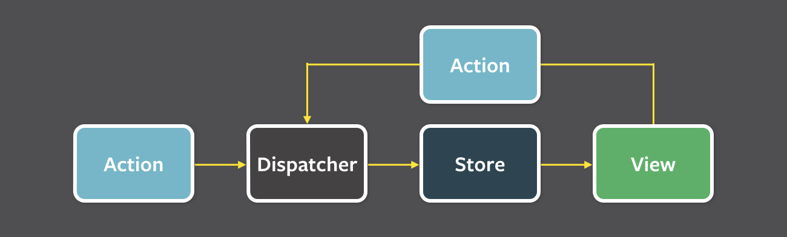

<!-- .slide: data-background="url(../../img/nav-react/solar-system.jpg) no-repeat center" data-background-size="cover" -->

<div style="display: flex; align-items:center; justify-content: flex-end">
	<div style="width: 45%;" class="content-overlay">
  
  <h1>Navigating the React Solar System</h1>

  <br />

  <h2>Ben Ilegbodu</h2>

  <br />

  <p>[@benmvp](https://twitter.com/benmvp) | [benmvp.com](/) | [#NDCSydney](https://twitter.com/hashtag/ndcsydney)</p>

  <br />

  <p>20 September 2018</p>
  
  
  </div>
</div> 

NOTES:
- Good morning NDC Sydney!
- Excited to be here in Australia, Land Down Under
  * Expected to see kangaroos hoping by but I guess that's a stereotype


- If you're new to React you might hear that on top of learning React
  * You need to know ES6, Redux, inline styles, server-side rendering, etc.
  * It can be so overwhelming
- So I want to walk through the different "planets" in the React solar system
  * So you can get an idea of how to prioritize what to learn


- Tweeted a link to slides cuz there will be **a lot** of resources

/////

<!-- .slide: data-background="url(../../img/giphy/stand-up.gif) no-repeat center" data-background-size="cover" -->

<div style="display:flex; justify-content: center">
  <div class="content-overlay">
    <h1 style="font-size: 5em">Stand Up!</h1>
  </div>
</div>

NOTES:

=====

<!-- .slide: data-background="url(../../img/family-selfie-madrid.jpg) no-repeat center" data-background-size="cover" -->

NOTES:
- Christian, Husband, Father
- We live in a small town outside of San Francisco

/////


<!-- .element: class="plain" style="width: 85%" -->

NOTES:
- I'm a Principal Frontend Engineer at Eventbrite
- We're an online Events & Ticketing platform
- Work on our Frontend Platform team
  * Doing FE infra + design system work
  * We've been using React for 2.5 years
  * Migrated from Backbone and have never looked back

/////

<!-- .slide: data-background="url(../../img/giphy/james-harden-pot-cook.gif) no-repeat center" data-background-size="contain" -->

NOTES:
- Originally from Houston
- Love Basketball
- Favorite team in the NBA is the rockets

=====

<!-- .slide: data-background="url(../../img/nav-react/solar-system.jpg) no-repeat center" data-background-size="cover" -->

NOTES:
- Ok, enough about me
- Let's talk about the React Solar Systems

=====

<!-- .slide: data-background="url(../../img/nav-react/sun.jpg) no-repeat center" data-background-size="cover" -->

<div style="display:flex; justify-content: flex-end">
  <div class="content-overlay">
    <h1>1. React</h1>
  </div>
</div>

NOTES:
- At the center of this solar system obviously is React
- Make sense that it'd be the **Sun** because React is on fire right now!

/////
<!-- .slide: data-background="url(../../img/nav-react/sun.jpg) no-repeat center" data-background-size="cover" -->

<div style="display:flex; justify-content: flex-end">
  <div class="content-overlay" style="width: 75%">
    <div style="display:flex;align-items:center;justify-content:space-between;">
      
      <div>
        <h2><a href="https://facebook.github.io/react/docs/reusable-components.html#stateless-functions">Functional & Reactive</a></h2>
        <h2><a href="https://facebook.github.io/react/docs/interactivity-and-dynamic-uis.html#components-are-just-state">Uni-directional</a></h2>
        <h2><a href="https://facebook.github.io/react/docs/jsx-in-depth.html">Declarative JSX</a></h2>
        <h2><a href="https://facebook.github.io/react/docs/reconciliation.html">"Virtual DOM"</a></h2>
        <h2><a href="https://facebook.github.io/react/docs/top-level-api.html">Narrow API</a></h2>
      </div>
    </div>
  </div>
</div>


NOTES:
- First learn React and learn it _really_ well
  * I could just leave it at that
  * Don't have time to teach it
- React is highly functional & reactive with a uni-directional data flow
- If you're used to MVC with Backbone or Ember (or backend)
  * It'll take some time to wrap your head around the concepts
- Then of course there's JSX syntax
- Ensuring that you're fully leveraging the Virtual DOM
  * Not directly manipulating DOM nodes takes time
- But thankfully the API is really narrow so there's not that much learn
- You can build a lot of great UIs with just JSX & the React API

/////
<!-- .slide: data-background="url(../../img/nav-react/sun.jpg) no-repeat center" data-background-size="cover" -->

<div style="display:flex; justify-content: flex-end">
  <div class="content-overlay">
    <h2>Imperative jQuery</h2>
      <pre class="large"><code class="lang-html"><div>
  <input type="number" value="0" />
  <button>+</button>
</div></code></pre>
      <pre class="large"><code class="lang-javascript">$('button').click(function() {
  var $input = $('input'),
    value = parseInt($input.val(), 10);

  $input.val(value + 1);
});</code></pre>

    <div>
      <input type="text" class="valueBox" value="0" size="1" style="font-size: 2em;text-align: center" />
      <button class="btnUp" style="font-size: 2em" onclick="$('.valueBox').val(+$('.valueBox').val() + 1)">&nbsp;&nbsp;+&nbsp;&nbsp;</button>
    </div>
  </div>
</div>

NOTES:
- For simple task, imperative code is easy to follow

/////
<!-- .slide: data-background="url(../../img/nav-react/sun.jpg) no-repeat center" data-background-size="cover" -->

<div style="display:flex; justify-content: flex-end">
  <div class="content-overlay">
    <h2>Declarative React</h2>
      <pre class="large"><code class="lang-javascript">class Incrementer extends React.Component {
  state = {value: 0}

  _handleClick = () => {
    this.setState((prevState) => ({value: prevState.value + 1}))
  }
  render() {
    return (
      <div>
        &lt;input type="number" defaultValue={this.state.value} />
        &lt;button onClick={this._handleClick}>+&lt;/button>
      </div>
    )
  }
}</code></pre>
  </div>
</div>

NOTES:
- Combining the markup with the JavaScript
- Updating state causes an optimized re-render via Virtual DOM
- As the UI gets more sophisticated React will scale much better

/////
<!-- .slide: data-background="url(../../img/nav-react/sun.jpg) no-repeat center" data-background-size="cover" -->

<div style="display:flex; justify-content: flex-end">
  <div class="content-overlay" style="width: 65%">
    <a href="https://facebook.github.io/react/tutorial/tutorial.html" target="_blank">
      
    </a>

    <p>
      <a href="https://facebook.github.io/react/tutorial/tutorial.html" target="_blank">
        React official tutorial
      </a>
    </p>
  </div>
</div>

NOTES:
- With the official React tutorial you can learn how to use React by including a couple of script tags
- It teaches all the core concepts

/////
<!-- .slide: data-background="url(../../img/nav-react/sun.jpg) no-repeat center" data-background-size="cover" -->

<div style="display:flex; justify-content: flex-end">
  <div class="content-overlay" style="width: 65%">
    <a href="https://github.com/benmvp/react-workshop/tree/master/src/react" target="_blank">
      
    </a>

    <p>
      <a href="https://github.com/benmvp/react-workshop/tree/master/src/react" target="_blank">
        React FUNdamentals Workshop
      </a>
    </p>
  </div>
</div>

NOTES:
- I've also created my own step-by-step workshop
  * Called "React FUNdamentals Workshop"
- Both the official tutorial and my workshop are written in ES6, so...

/////
<!-- .slide: data-background="url(../../img/nav-react/sun.jpg) no-repeat center" data-background-size="cover" -->

<div style="display:flex; justify-content: flex-end">
  <div class="content-overlay">
    <h2>Useful ES.next features w/ React</h2>

    <ul>
      <li><a href="http://www.2ality.com/2014/09/es6-modules-final.html" target="_blank">Modules</a></li>
      <li><a href="http://www.benmvp.com/learning-es6-classes/" target="_blank">Classes</a></li>
      <li><a href="http://2ality.com/2016/10/rest-spread-properties.html" target="_blank">Spread operator</a></li>
      <li><a href="http://www.benmvp.com/learning-es6-destructuring/" target="_blank">Destructuring</a></li>
      <li><a href="http://www.benmvp.com/learning-es6-block-level-scoping-let-const/" target="_blank">Block scoping</a></li>
      <li><a href="http://www.benmvp.com/learning-es6-arrow-functions/" target="_blank">Arrow functions</a></li>
      <li><a href="http://www.benmvp.com/learning-es6-enhanced-object-literals" target="_blank">Object literal shorthand</a></li>
      <li><a href="https://developer.mozilla.org/en-US/docs/Web/JavaScript/Reference/Statements/async_function" target="_blank">Async functions</a></li>
      <li>and more...</li>
    </ul>    
  </div>
</div>

NOTES:
- React IMO is even easier to write with ES6+
- Outside of the JSX syntax, React is just JavaScript, so learning ES6+ makes writing it easier
- Chances are if you learn React, you're gonna learn it with some ES6+ concepts
- Let's take a super quick look at some features

/////
<!-- .slide: data-background="url(../../img/nav-react/sun.jpg) no-repeat center" data-background-size="cover" -->

<div style="display:flex; justify-content: flex-end">
  <div class="content-overlay">
    <h2><a href="http://www.benmvp.com/slides/2017/reactconf/react-esnext.html" target="_blank">React + ES.next = ♥</a></h2>
  
    <iframe width="888" height="500" src="https://www.youtube.com/embed/jh_Qzi-yHU0" frameborder="0" allowfullscreen></iframe>

    <p>ReactConf 2017</p>
  </div>
</div>

NOTES:
- I gave a talk call _React + ES.next = ♥_ at ReactConf 2017
- What I just talked about was just a small snippet of all the different features
- Feel free to watch the video (not now)

/////
<!-- .slide: data-background="url(../../img/nav-react/sun.jpg) no-repeat center" data-background-size="cover" -->

<div style="display:flex; justify-content: flex-end">
  <div class="content-overlay">
    <h2>JavaScript Resources</h2>
  
    <ul>
      <li><a href="/learning-es6-series/" target="_blank">_Learning ES6_ series</a></li>
      <li><a href="http://es6katas.org/" target="_blank">ES6 Katas</a></li>
      <li><a href="https://github.com/eventbrite/javascript/tree/master/es6" target="_blank">Eventbrite ES6+ coding style guide</a></li>
      <li><a href="https://github.com/eventbrite/javascript/tree/master/packages/eslint-config-eventbrite" target="_blank">Eventbrite ES6+ ESLint configuration</a></li>
    </ul>
  </div>
</div>

=====
<!-- .slide: data-background="url(../../img/nav-react/mercury.jpg) no-repeat center" data-background-size="cover" -->

<div style="display:flex; justify-content: flex-start">
  <div class="content-overlay">
    <h1>2. Tooling</h1>
  </div>
</div>

NOTES:
- First planet: Mercury
- Probably the biggest complaint w/ React isn't React itself
  * But the tooling needed to get setup
- I think there problem is that there's so much choice
  * You need to know how the tools work before you can get up and running

/////
<!-- .slide: data-background="url(../../img/nav-react/mercury.jpg) no-repeat center" data-background-size="cover" -->

<div style="display:flex; justify-content: flex-start">
  <div class="content-overlay" style="width: 50%">
    <h2>React Dev Tools</h2>
    <p>Help debug React props, state & perf</p>

    

    <p>Available for <a href="https://chrome.google.com/webstore/detail/react-developer-tools/fmkadmapgofadopljbjfkapdkoienihi?hl=en" target="_blank">Chrome</a> and <a href="https://addons.mozilla.org/en-US/firefox/addon/react-devtools/" target="_blank">Firefox</a></p>
  </div>
</div>

NOTES:
- Let's start easy
- The React Dev Tools are super helpful in debugging React props & state
- You just browse the React component tree just like the DOM tree and you can look at the component props as well as the state
- Available for Chrome & Firefox. Sorry Edge users.
- And just recently with the release of React 16.5.0 enabling performance debugging

/////
<!-- .slide: data-background="url(../../img/nav-react/mercury.jpg) no-repeat center" data-background-size="cover" -->

<div style="display:flex; justify-content: flex-start">
  <div class="content-overlay" style="width: 50%">
    <h2>Package managers</h2>
    <p>Help install & manage dependencies</p>

    <div style="display:flex;align-items:flex-end;justify-content:space-between;margin-top:5%">
      <div style="flex:0 0 45%;">
        <a href="https://www.npmjs.com" target="_blank"></a>
        <a href="https://www.npmjs.com" target="_blank">NPM</a>
      </div>
      <div style="flex:0 0 45%;">
        <a href="https://yarnpkg.com/" target="_blank"></a>
        <a href="https://yarnpkg.com/" target="_blank">Yarn</a>
      </div>
    </div>
  </div>
</div>


NOTES:
- Two major players are NPM & Bower
- But pretty much everyone uses NPM
- Never used Bower before, but have seen some older packages that area available on both
- Funniest thing: you install Bower with NPM!
- Facebook just released Yarn last October!

/////
<!-- .slide: data-background="url(../../img/nav-react/mercury.jpg) no-repeat center" data-background-size="cover" -->

<div style="display:flex; justify-content: flex-start">
  <div class="content-overlay" style="width: 70%">

    <div style="display:flex;align-items:center;justify-content:space-around;margin-bottom: 5%">
      <div style="flex:0 0 40%;">
        
      </div>
      <div style="flex:0 0 55%;">
        <h2>Flat Mode</h2>
        <h2>Offline Mode</h2>
        <h2>Deterministic</h2>
        <h2>Multiple Registries</h2>
        <h2>Network Resilience</h2>
        <h2>Network Performance</h2>
      </div>
    </div>
  </div>
</div>

NOTES:
- Yarn changed the game
  * There was really only NPM and they weren't innovating IMO
  * Yarn's feature-set caused NPM to update as well and now they match
- **Flat Mode:** Resolve mismatching versions of dependencies to a single version to avoid creating duplicates.
- **Offline Mode:** If you've installed a package before, you can install it again without any internet connection.
- **Deterministic:** The same dependencies will be installed the same exact way across every machine regardless of install order.
- **Multiple Registries:** Install any package from either npm or Bower and keep your package workflow the same.
- **Network Resilience:** A single request failing won't cause an install to fail. Requests are retried upon failure.
- **Network Performance:** Yarn efficiently queues up requests and avoids request waterfalls in order to maximize network utilization.

/////
<!-- .slide: data-background="url(../../img/nav-react/mercury.jpg) no-repeat center" data-background-size="cover" -->

<div style="display:flex; justify-content: flex-start">
  <div class="content-overlay" style="width: 70%">
    <h2>Bundlers</h2>
    <p>Help gather dependencies, transpile ES6+, etc.</p>

    <div style="display:flex;align-items:flex-end;justify-content:space-around;margin-top:5%">
      <div style="flex:0 0 22%;">
        <a href="https://webpack.github.io/" target="_blank"></a>
        <a href="https://webpack.github.io/" target="_blank">Webpack</a>
      </div>
      <div style="flex:0 0 22%;">
        <a href="http://rollupjs.org/" target="_blank"></a>
        <a href="http://rollupjs.org/" target="_blank">Rollup</a>
      </div>
      <div style="flex:0 0 22%;">
        <a href="http://prepack.io/" target="_blank"></a>
        <a href="http://prepack.io/" target="_blank">Prepack*</a>
      </div>
      <div style="flex:0 0 25%;">
        <a href="http://requirejs.org/" target="_blank"></a>
        <a href="http://requirejs.org/" target="_blank">RequireJS</a> (no!)
      </div>
    </div>
  </div>
</div>

NOTES:
- This is space has a lot of players
- Webpack is the prevailing bundler right now
- Rollup works specifically with ES6 modules
  * Introduced the concept of "tree-shaking" feature that results in less generated code
  * Instead of bundling the code into one file, it transpiles individual files
  * Good for libraries
- Prepack is a new tool for making JS code run faster
  * From Facebook
  * Computations that can be done at compile-time instead of run-time get eliminated
  * Still in early DEV stage so not quite ready for production
- RequireJS is the original, but just isn't well suited at all for modern web development practices
- I'd say go with Webpack, especially because of `webpack-dev-server`
  * Webpack has "tree-shaking" too
- It's at this step where the "JavaScript fatigue" really kicks in
  * Your typical JS developer doesn't want to or know how to configure these bundlers
  * Just work please

/////
<!-- .slide: data-background="url(../../img/nav-react/mercury.jpg) no-repeat center" data-background-size="cover" -->

<div style="display:flex; justify-content: flex-start">
  <div class="content-overlay" style="width: 90%">
    <h2>Tree-Shaking</h2>

    <div style="display:flex;justify-content:space-between;margin-top:1%">
      <div style="flex:0 0 63%;">
        ES2015 modules go in...
        <pre class="large"><code class="lang-js">// maths.js

// This function gets excluded
export const square = (x) => x \* x

// This function gets included
export const cube = (x) => x \* x \* x</code></pre>

		    <pre class="large"><code class="lang-js">// main.js
import {cube} from './maths.js'

console.log(cube(5)) // 125</code></pre>
	    </div>
	    <div style="flex:0 0 33%;">
		    ...bundle comes out
		    <pre class="large"><code class="lang-js">function cube(x) {
  return x \* x \* x
}

console.log(cube(5))</code></pre>
      </div>
    </div>
  </div>
</div>

NOTES:
- With tree-shaking, functions in a reference module that aren't used don't get bundled

/////
<!-- .slide: data-background="url(../../img/nav-react/mercury.jpg) no-repeat center" data-background-size="cover" -->

<div style="display:flex; justify-content: flex-start">
  <div class="content-overlay" style="width: 60%">
    <h2>Task runners</h2>
    <p>Help execute shell commands, generate files, etc.</p>

    <div style="display:flex;align-items:flex-end;justify-content:space-around;margin-top:5%">
      <div style="flex:0 0 25%;">
        <a href="http://gruntjs.com/" target="_blank" style="display:block"></a>
        <a href="http://gruntjs.com/" target="_blank">Grunt</a>
      </div>
      <div style="flex:0 0 25%;">
        <a href="http://gulpjs.com/" target="_blank" style="display:block"></a>
        <a href="http://gulpjs.com/" target="_blank">Gulp</a>
      </div>
      <div style="flex:0 0 25%">
        <a href="https://docs.npmjs.com/misc/scripts" target="_blank" style="display:block"></a>
        <a href="https://docs.npmjs.com/misc/scripts" target="_blank">NPM</a>
      </div>
    </div>
  </div>
</div>

NOTES:
- Build files, run shell scripts, etc.
- Grunt was the original & dominant
  * Then because grunt files became so unmanageable
- Gulp approached it with streams in a functional way
- But with "building fatigue" and the fact that webpack could do so much of this for us
- NPM scripts have lately become the rage
  * Essentially wrappers around command line calls
- If things are simple, use npm scripts.
- If things are complex, use Gulp since it's functional

/////
<!-- .slide: data-background="url(../../img/nav-react/mercury.jpg) no-repeat center" data-background-size="cover" -->

<div style="display:flex; justify-content: flex-start">
  <div class="content-overlay">
    <h2>NPM/Yarn Scripts</h2>

    <pre class="large"><code class="lang-json">{
  "scripts": {
    "start": "webpack-dev-server --hot --inline --open",
    "build": "webpack --progress --colors",
    "eslint": "eslint .",
    "lint": "yarn run scss-lint && yarn run eslint",
    "scss-lint": "scss-lint .",
    "test": "jest",
    "validate": "yarn run lint && yarn run test"
  }
}</code></pre>
    <pre class="large"><code class="lang-json">$> yarn run validate</code></pre>
  </div>
</div>


NOTES:
- For something simple like this, NPM scripts are great!
- But I have some package.json files that have 25+ scripts that generate files, etc
- In that case, and actual build system like gulp makes sense
- But it's good to always have NPM scripts to abstract the build system
- So if things change underneath the commands the user calls stay the same
- Speaking of linting...

/////
<!-- .slide: data-background="url(../../img/nav-react/mercury.jpg) no-repeat center" data-background-size="cover" -->

<div style="display:flex; justify-content: flex-start">
  <div class="content-overlay" style="width: 60%">
    <h2>Static Analyzers</h2>
    <p>Help catch errors in written code before runtime</p>

    <div style="display:flex;align-items:flex-end;justify-content:space-around;margin-top:5%">
      <div style="flex:0 0 30%;">
        <a href="http://eslint.org/" target="_blank"></a>
        <a href="http://eslint.org/" target="_blank">ESLint</a>
      </div>
      <div style="flex:0 0 30%;">
        <a href="https://flowtype.org/" target="_blank" style="display:block"></a>
        <a href="https://flowtype.org/" target="_blank">Flow</a>
      </div>
	    <div style="flex:0 0 30%;">
        <a href="https://www.typescriptlang.org/" target="_blank"></a>
		    <a href="https://www.typescriptlang.org/" target="_blank">TypeScript</a>
      </div>
    </div>
  </div>
</div>


NOTES:
- The static analyzers help you catch errors in your code before it ever executes
- **ESLint:** originally just for stylistic code preferences
  * Can catch common errors, including in JSX
- Flow & Typescript are both static _type_ checkers
- Flow is exclusively for type checking
- TypeScript is a superset of JavaScript that includes type checking plus future language constructs
- It introduced classes before they were in ES2015
  * It has interfaces which JS does not
- I have used Flow, and in practice is not so great
  * Leaning more towards TypeScript
  * Seems to just be better at typing
  * But it's more "all-in" than Flow

/////
<!-- .slide: data-background="url(../../img/nav-react/mercury.jpg) no-repeat center" data-background-size="cover" -->

<div style="display:flex; justify-content: flex-start">
  <div class="content-overlay">
    <h2>Flow type inference</h2>

    <pre class="large"><code class="lang-javascript">// @flow
const foo = (x) => x \* 10

foo('Hello, world!')</code></pre>
    <pre class="large"><code>$> flow

2:   x \* 10
     ^ string. This type is incompatible with number</code></pre>
  </div>
</div>

NOTES:
- Flow supports type inference
- So without even changing the code, it can start providing helpful feedback
- Just add `@flow` to the top
- In this case we're trying to multiply a passed string by `10` which is obviously wrong
  * Flow won't compile and will let us know something is wrong

/////
<!-- .slide: data-background="url(../../img/nav-react/mercury.jpg) no-repeat center" data-background-size="cover" -->

<div style="display:flex; justify-content: flex-start">
  <div class="content-overlay">
    <h2>Create React App</h2>
    <p>Create React apps with no build configuration</p>

    <pre class="large" style="margin:5% 0"><code>$> npx create-react-app awesome-app

$> cd awesome-app

$> yarn start</code></pre>

    <p>NPM/Yarn, Babel, Webpack, ESLint, and more!</p>

    <p>(<a href="https://github.com/zkat/npx" target="_blank">`npx`</a>)</p>
  </div>
</div>


NOTES:
- So this is everything you need to set up your React app!
  * And I didn't even go into a bunch of nitty gritty details
- This had been the biggest complaint about React
  * How to get started


- So the fine folks at Facebook did something about it...
  * They created Create React App
  * Allows you to bootstrap super quick
  * And if you need to do something it doesn't support you can "eject"
  * Get the existing configuration

/////
<!-- .slide: data-background="url(../../img/nav-react/mercury.jpg) no-repeat center" data-background-size="cover" -->

<div style="display:flex; justify-content: flex-start">
  <div class="content-overlay">
    <h2>Tooling resources</h2>

    <ul>
      <li><a href="https://facebook.github.io/react/blog/2016/07/22/create-apps-with-no-configuration.html" target="_blank">Create React App</a></li>
      <li><a href="https://github.com/creationix/nvm" target="_blank">Node Version Manager</a></li>
      <li><a href="https://github.com/sindresorhus/awesome-npm" target="_blank">Awesome npm resources and tips</a></li>
      <li><a href="https://blog.risingstack.com/yarn-vs-npm-node-js-package-managers/" target="_blank">Yarn vs NPM</a></li>
      <li><a href="https://webpack.github.io/docs/webpack-dev-server.html" target="_blank">`webpack-dev-server`</a></li>
      <li><a href="https://flowtype.org/docs/react.html" target="_blank">Flow + React</a></li>
      <li><a href="https://www.typescriptlang.org/docs/handbook/react-&-webpack.html" target="_blank">TypeScript & React</a></li>
    </ul>
  </div>
</div>

NOTES:
- Here are some miscellaneous resources regarding all the tools we talked about

=====
<!-- .slide: data-background="url(../../img/nav-react/venus.jpg) no-repeat center" data-background-size="cover" -->

<div style="display:flex; justify-content: flex-start">
  <div class="content-overlay">
    <h1>3. Styling</h1>
  </div>
</div>


NOTES:
- Next planet is Venus
- Let's talking about styling because visuals are just as important as interaction
- There are _at least_ 5 ways to tackle the styling problem

/////
<!-- .slide: data-background="url(../../img/nav-react/venus.jpg) no-repeat center" data-background-size="cover" -->

<div style="display:flex; justify-content: flex-start">
  <div class="content-overlay">
    <h2>Global CSS</h2>
    <p>Use CSS that exists on the page outside of React</p>

    <pre class="large"><code class="lang-javascript">const Card = ({title, imageUrl, message}) => (
  &lt;div className="card">
    &lt;h2 className="card\__title">{title}&lt;/h2>
    &lt;img src={imageUrl} className="card\__image" />
    &lt;p className="card\__message">{message}&lt;/p>
  &lt;/div>
)</code></pre>
  </div>
</div>

NOTES:
- You'd use the Global CSS option if you are transitioning to React
  * Already have your CSS being built by some other process
- You probably already have components that you're transitioning to React so you keep the same "global" CSS classes
- Bootstrap or Foundation would call under this as well


/////
<!-- .slide: data-background="url(../../img/nav-react/venus.jpg) no-repeat center" data-background-size="cover" -->

<div style="display:flex; justify-content: flex-start">
  <div class="content-overlay">
    <h2>Global CSS</h2>

    <pre class="large"><code class="lang-css">
/\* global.scss \*/

/\* lots of other styles before \*/

.card { }
.card\__title { }
.card\__image { }
.card\__message { }

/\* lots of other styles after \*/</code></pre>

  <p>
    <a href="http://getbem.com/" target="_blank">BEM</a>,
    <a href="https://smacss.com/" target="_blank">SMACSS</a> or
    <a href="https://github.com/stubbornella/oocss/wiki">OOCSS</a> for class name-spacing
  </p>
  </div>
</div>

NOTES:
- Use BEM syntax as a convention to prevent name collisions

/////
<!-- .slide: data-background="url(../../img/nav-react/venus.jpg) no-repeat center" data-background-size="cover" -->

<div style="display:flex; justify-content: flex-start">
  <div class="content-overlay">
    <h2>Component CSS</h2>
    <p>Associate React components with CSS snippet</p>

    <pre class="large"><code class="lang-javascript">import './Card.scss'

const Card = ({title, imageUrl, message}) => (
  &lt;div className="card">
    &lt;h2 className="card\__title">{title}&lt;/h2>
    &lt;img src={imageUrl} className="card\__image" />
    &lt;p className="card\__message">{message}&lt;/p>
  &lt;/div>
)</code></pre>
  </div>
</div>

NOTES:
- This is the exact same as Global CSS except the CSS is imported by the Component
- Therefore if the Component isn't used the CSS won't be included in the bundle

/////
<!-- .slide: data-background="url(../../img/nav-react/venus.jpg) no-repeat center" data-background-size="cover" -->

<div style="display:flex; justify-content: flex-start">
  <div class="content-overlay">
    <h2>Component CSS</h2>
    <p>Associate React components with CSS snippet</p>

    <pre class="large"><code class="lang-css">/\* Card.scss \*/

.card { }
.card\__title { }
.card\__image { }
.card\__message { }</code></pre>
  </div>
</div>

NOTES:
- Same BEM style CSS class names convention because eventually it'll all be merged
- If the convention is broken you could still have collisions
- Hopefully your global CSS was already modularized, so this transition shouldn't be tough

/////
<!-- .slide: data-background="url(../../img/nav-react/venus.jpg) no-repeat center" data-background-size="cover" -->

<div style="display:flex; justify-content: flex-start">
  <div class="content-overlay">
    <h2>CSS Modules</h2>
    <p>Automatically scope CSS class names to the component</p>

    <pre class="large"><code class="lang-javascript">import css from './Card.scss'

const Card = ({title, imageUrl, message}) => (
  &lt;div className={css.root}>
    &lt;h2 className={css.title}>{title}&lt;/h2>
    &lt;img src={imageUrl} className={css.image} />
    &lt;p className={css.message}>{message}&lt;/p>
  &lt;/div>
)</code></pre>
  </div>
</div>


NOTES:
- Similar to Component CSS except the import of the CSS will return an object lookup with a generated class name

/////
<!-- .slide: data-background="url(../../img/nav-react/venus.jpg) no-repeat center" data-background-size="cover" -->

<div style="display:flex; justify-content: flex-start">
  <div class="content-overlay">
    <h2>CSS Modules</h2>
    <p>Automatically scope CSS class names to the component</p>

    <pre class="large"><code class="lang-css">/\* Card.scss (source) \*/

.root { }
.title { }
.image { }
.message { }</code></pre>
  </div>
</div>

NOTES:
- No need for naming conventions
- Just name the classes what they are w/o worry about collision

/////
<!-- .slide: data-background="url(../../img/nav-react/venus.jpg) no-repeat center" data-background-size="cover" -->

<div style="display:flex; justify-content: flex-start">
  <div class="content-overlay">
    <h2>CSS Modules</h2>
    <p>Automatically scope CSS class names to the component</p>

    <pre class="large"><code class="lang-css">/\* Card.scss (generated) \*/

.Card\__root\__\_d74hQ { }
.Card\__title\__\_37fhU { }
.Card\__image\__\_ndh2e { }
.Card\__message\__\_84QQj { }</code></pre>
  </div>
</div>

NOTES:
- The generated CSS classes will be unique so there's no way they can collide
- The generated markup will also have the same class names

/////
<!-- .slide: data-background="url(../../img/nav-react/venus.jpg) no-repeat center" data-background-size="cover" -->

<div style="display:flex; justify-content: flex-start">
  <div class="content-overlay">
    <h2>Inline styles</h2>
    <p>Forgo CSS classes in favor of inline styles</p>

    <pre class="large"><code class="lang-javascript">import styles from './Card.styles'

const Card = ({title, imageUrl, message}) => (
  &lt;div style={styles.root}>
    &lt;h2 style={styles.title}>{title}&lt;/h2>
    &lt;img src={imageUrl} style={styles.image} />
    &lt;p style={styles.message}>{message}&lt;/p>
  &lt;/div>
)</code></pre>
  </div>
</div>


NOTES:
- The last option is to just go with inline styles
- As a result there's no chance of class name collisions or unexpected CSS cascade
- There's been a big huge for this in React mainly because of React Native because it doesn't support CSS
- If you want to share components across React & React Native you can't use CSS

/////
<!-- .slide: data-background="url(../../img/nav-react/venus.jpg) no-repeat center" data-background-size="cover" -->

<div style="display:flex; justify-content: flex-start">
  <div class="content-overlay">
    <h2>Inline styles</h2>
    <p>Forgo CSS classes in favor of inline styles</p>

    <pre class="large"><code class="lang-javascript">export default {
  root: {
    display: 'flex',
    flexDirection: 'row'
  },
  title: {
    fontWeight: 'bold',
    fontSize: '2em'
  },
  ...
}</code></pre>
  </div>
</div>

/////
<!-- .slide: data-background="url(../../img/nav-react/venus.jpg) no-repeat center" data-background-size="cover" -->

<div style="display:flex; justify-content: flex-start">
  <div class="content-overlay" style="width: 75%">
    <h2>`css-in-js`</h2>
    <p>Define your CSS using JavaScript</p>
    
    <div style="display:flex;align-items:flex-end;justify-content:space-around;margin-top:5%">
      <div style="flex:0 0 22%;">
        <a href="https://emotion.sh/" target="_blank"></a>
        <a href="https://emotion.sh/" target="_blank">Emotion</a>
      </div>
      <div style="flex:0 0 24%;">
        <a href="https://github.com/cssinjs/react-jss" target="_blank"></a>
        <a href="https://github.com/cssinjs/react-jss" target="_blank">JSS</a>
      </div>
      <div style="flex:0 0 24%;">
        <a href="https://formidable.com/open-source/radium/" target="_blank"></a>
        <a href="https://formidable.com/open-source/radium/" target="_blank">Radium</a>
      </div>
      <div style="flex:0 0 28%;">
        <a href="http://styled-components.com/" target="_blank"></a>
        <a href="http://styled-components.com/" target="_blank">styled components</a>
      </div>
    </div>
  </div>
</div>


NOTES:
- Problem with inline styles is that it only supports what inline styles support
- No media queries, pseudo-selectors, etc
- New libraries have popped up to try to solve that issue in various clever ways
- Most take what's defined as inline styles but map to unique CSS classes

/////
<!-- .slide: data-background="url(../../img/nav-react/venus.jpg) no-repeat center" data-background-size="cover" -->

<div style="display:flex; justify-content: flex-start">
  <div class="content-overlay">
    <h2>Emotion</h2>

    <pre class="large"><code class="lang-javascript">import styled from 'react-emotion'

const Root = styled.div({display: 'flex'})
const Title = styled.h2({fontWeight: 'bold'})
const Image = styled.img({ ... })
const Message = styled.p({ ... })

const Card = ({title, imageUrl, message}) => (
  &lt;Root>
    &lt;Title>{title}&lt;/Title>
    &lt;Image src={imageUrl} />
    &lt;Message>{message}&lt;/Message>
  &lt;/Root>
)</code></pre>
  </div>
</div>


NOTES:
- Quick look at how Emotion works
- Create a custom elements/components with the styling you want
- Supports all CSS syntax including media queries, keyframe animations & pseudo-selectors!

/////
<!-- .slide: data-background="url(../../img/nav-react/venus.jpg) no-repeat center" data-background-size="cover" -->

<div style="display:flex; justify-content: flex-start">
  <div class="content-overlay">
    <h2>Emotion</h2>
    <p>Auto-generated class names</p>

    <pre class="large"><code class="lang-html"><div class="css-1sa0cvf">
  <h2 class="css-1un7ufz">Card Title</h2>
  
  <p class="css-1b9v3at">Card message</p>
</div></code></pre>
  </div>
</div>

NOTES:
- Here's what the generated markup will look like

/////
<!-- .slide: data-background="url(../../img/nav-react/venus.jpg) no-repeat center" data-background-size="cover" -->

<div style="display:flex; justify-content: flex-start">
  <div class="content-overlay">
    <h2>Styling Resources</h2>
  
    <ul>
      <li><a href="https://medium.com/seek-blog/a-unified-styling-language-d0c208de2660" target="_blank">_A Unified Styling Language_</a></li>
      <li><a href="https://github.com/gajus/react-css-modules" target="_blank">React CSS Modules</a></li>
      <li><a href="https://react-bootstrap.github.io/" target="_blank">React-Bootstrap</a> / <a href="http://www.material-ui.com/" target="_blank">Material UI</a> / <a href="https://react.foundation/" target="_blank">React + Foundation</a></li>
      <li><a href="https://github.com/JedWatson/classnames" target="_blank">`classnames`</a></li>
      <li><a href="https://polished.js.org/" target="_blank">polished</a></li>
      <li><a href="http://postcss.org/" target="_blank">PostCSS</a></li>
    </ul>
  </div>
</div>

NOTES:
- Here are some miscellaneous resources regarding styling
- React CSS Modules is cool because you don't even have to use the css object, but use special `styleName` attribute and it figures it all out for you


=====
<!-- .slide: data-background="url(../../img/nav-react/earth.jpg) no-repeat center" data-background-size="cover" -->

<div style="display:flex; justify-content: flex-end">
  <div class="content-overlay">
    <h1>4. Single-Page Apps</h1>
  </div>
</div>

NOTES:
- Moving along to libraries needed for Single Page Apps

/////
<!-- .slide: data-background="url(../../img/nav-react/earth.jpg) no-repeat center" data-background-size="cover" -->

<div style="display:flex; justify-content: flex-end">
  <div class="content-overlay">
    <h2>Fetch API</h2>
    <p>Handle AJAX natively</p>

    <pre class="large"><code class="lang-javascript">fetch('api.benmvp.com', {method: 'GET'})
  .then((response) => {
    // do something w/ response
  })
  .catch((err) => {
    // handle error
  })</code></pre>
  </div>
</div>

NOTES:
- Your favorite "walled garden" JS framework had a mechanism for making AJAX requests
- React does not come with a way because it's just the UI side
- You could use jQuery, but that could lead you to to using it improperly with React
- Instead we're going to a native AJAX implementation, new Fetch API
- Works with ES2015 Promises

/////
<!-- .slide: data-background="url(../../img/nav-react/earth.jpg) no-repeat center" data-background-size="cover" -->

<div style="display:flex; justify-content: flex-end">
  <div class="content-overlay">
    <h2>Fetch Resources</h2>
  
    <ul>
      <li><a href="https://developer.mozilla.org/en-US/docs/Web/API/Fetch_API/Using_Fetch" target="_blank">Using Fetch</a></li>
      <li><a href="http://www.benmvp.com/learning-es6-promises/" target="_blank">Learning ES6: Promises</a></li>
      <li><a href="https://github.com/github/fetch" target="_blank">`window.fetch` polyfill</a></li>
      <li><a href="https://github.com/benmvp/react-workshop/blob/master/04-fetch/" target="_blank">React Fundamentals Workshop - Fetch</a></li>
    </ul>
  </div>
</div>

NOTES:
-

/////
<!-- .slide: data-background="url(../../img/nav-react/earth.jpg) no-repeat center" data-background-size="cover" -->

<div style="display:flex; justify-content: flex-end">
  <div class="content-overlay" style="width: 45%">
    <h2>Routing</h2>
    <p>Keep your UI in sync with the URL</p>
  
   <div style="display:flex;align-items:flex-end;justify-content:space-around;margin-top:5%">
      <div style="flex:0 0 45%;">
        <a href="https://github.com/ReactTraining/react-router" target="_blank"></a>
        <a href="https://github.com/ReactTraining/react-router" target="_blank">React Router</a>
      </div>
    </div>
  </div>
</div>


NOTES:
- React Router is the obvious choice. Major player
- There are many others but most aren't actively developed anymore

/////
<!-- .slide: data-background="url(../../img/nav-react/earth.jpg) no-repeat center" data-background-size="cover" -->

<div style="display:flex; justify-content: flex-end">
  <div class="content-overlay">
    <h2>React Router</h2>

    <pre class="large"><code class="lang-javascript">import {BrowserRouter, Route, Link} from 'react-router-dom'

const App = () => (
  &lt;BrowserRouter>
    &lt;ul role="nav">
      &lt;li>&lt;Link to="/about">About&lt;/Link>&lt;/li>
      &lt;li>&lt;Link to="/repos">Repos&lt;/Link>&lt;/li>
    &lt;/ul>

    &lt;Route exact={true} path="/" component={Home}/>
    &lt;Route path="/repos" component={Repos}/>
    &lt;Route path="/about" component={About}/>
  &lt;/BrowserRouter>
)</code></pre>
  </div>
</div>

NOTES:
- Can set up your routes with the same JSX syntax pointing to components
- Then replace `<a>` tags with special `<Link>` tags

=====

<!-- .slide: data-background="url(../../img/nav-react/mars.jpg) no-repeat center" data-background-size="cover" -->

=====
<!-- .slide: data-background="url(../../img/nav-react/asteroid-belt.jpg) no-repeat center" data-background-size="cover" -->

<div style="display:flex; justify-content: center">
  <div class="content-overlay">
    <h1>Asteroid Belt</h1>
  </div>
</div>

NOTES:
- At this point we've hit the asteroid belt
- We actually have everything we need to build apps
- But there's more to cover
- Moving into the needs of large-scale apps

=====
<!-- .slide: data-background="url(../../img/nav-react/jupiter.jpg) no-repeat center" data-background-size="cover" -->

<div style="display:flex; justify-content: flex-end">
  <div class="content-overlay">
    <h1>5. Testing</h1>
  </div>
</div>

NOTES:
- I hate to put testing so far, but the previous 4 really are more important

/////
<!-- .slide: data-background="url(../../img/nav-react/jupiter.jpg) no-repeat center" data-background-size="cover" -->

<div style="display:flex; justify-content: flex-end">
  <div class="content-overlay" style="width: 65%">
    <h2>Testing Stacks</h2>

    <div style="display:flex;align-items:flex-end;justify-content:space-between ;margin-top:5%">
      <div style="flex:0 0 30%;">
        <a href="https://mochajs.org"></a>
        <a href="http://chaijs.com/"></a>
        <a href="https://mochajs.org">Mocha</a> + <a href="http://chaijs.com/">Chai</a>
      </div>
      <div style="flex:0 0 30%;">
        <a href="https://facebook.github.io/jest/"></a>
        <a href="https://facebook.github.io/jest/" style="display:block">Jest</a>
      </div>
      <div style="flex:0 0 30%;">
        <a href="https://github.com/avajs/ava"></a>
        <a href="https://github.com/avajs/ava">Ava</a>
      </div>
    </div>
  </div>
</div>


NOTES:
- Much like how there are many options for JS frameworks, there are many for JS testing frameworks
- Some are micro libraries like Mocha & Chai that do specific things (Chai is just for assertions)
- Others are like Jest (built on Jasmine) that do it all
- Jest also has auto-mocking so dependencies are mocked by default
- Makes life easy if you have a lot of dependencies you don't want executed while testing
- There's also Ava that had some buzz around it, but it seems like for React testing it hasn't caught on

/////
<!-- .slide: data-background="url(../../img/nav-react/jupiter.jpg) no-repeat center" data-background-size="cover" -->

<div style="display:flex; justify-content: flex-end">
  <div class="content-overlay">
    <h2>Jest + Enzyme</h2>

    <pre class="large"><code class="lang-javascript">import {mount} from 'enzyme'
import Button from './Button'

it('adds CSS class for style primary', () => {
  const component = mount(
    &lt;Button style="primary">Go&lt;/Button>
  )
  const container = component.find('button')

  expect(container).toHaveClassName('btn--primary')
})</code></pre>
  </div>
</div>

/////
<!-- .slide: data-background="url(../../img/nav-react/jupiter.jpg) no-repeat center" data-background-size="cover" -->

<div style="display:flex; justify-content: flex-end">
  <div class="content-overlay">
    <h2>Testing Resources</h2>
  
    <ul>
      <li><a href="http://airbnb.io/enzyme/" target="_blank">Enzyme</a></li>
      <li><a href="https://github.com/benmvp/react-workshop/tree/master/src/testing" target="_blank">React Testing FUNdamentals Workshop</a></li>
      <li><a href="https://github.com/eventbrite/javascript/blob/master/react/testing.md" target="_blank">Eventbrite React Testing Best Practices</a></li>
      <li><a href="https://github.com/FormidableLabs/enzyme-matchers" target="_blank">`jest-enzyme`</a></li>
      <li><a href="https://facebook.github.io/jest/blog/2016/07/27/jest-14.html" target="_blank">Jest 14.0: React Tree Snapshot Testing</a></li>
      <li><a href="https://github.com/avajs/ava/blob/master/docs/recipes/react.md" target="_blank">Ava + React</a></li>
    </ul>
  </div>
</div>

=====

<!-- .slide: data-background="url(../../img/nav-react/saturn.jpg) no-repeat center" data-background-size="cover" -->

# Saturn: Performance & SEO
<!-- .element: style="-webkit-text-stroke: black 4px; color: white" -->

NOTES:
- Chances are if you're building an app of significant size SEO & initial render speed will matter
- Rendering server-side can help both
- This is called "Isomorphic/Universal React"
- Rendering the same components server-side improves initial startup performance because content is already there
- Google includes rendering speed in their ranking algorithm which affects SEO
- There's also Open Graph previews as well
- React provides a method that will render the component tree to a string which you can include in server response

/////

## Server-side Rendering
<!-- .element style="margin-bottom: 5%" -->

### With a Node back-end...
<!-- .element style="margin-bottom: 2.5%" -->

- [Express](https://expressjs.com/) server
- React Router
- [`node-fetch`](https://github.com/bitinn/node-fetch) or [`isomorphic-fetch`](https://github.com/matthew-andrews/isomorphic-fetch)

NOTES:
- If your back-end is on Node, the solution is pretty easy

/////

## Server-side Rendering

### [Without a Node back-end...](http://www.benmvp.com/slides/2017/render/iso-react.html)

<iframe width="1333" height="750" src="https://www.youtube.com/embed/zxtcr8Zuvfs" frameborder="0" allowfullscreen></iframe>

NOTES:
- If your backend is in Django / Rails / .Net / etc. it's a bit more challenging
- But I have a talk that explains it all!

=====

<!-- .slide: data-background="url(../../img/nav-react/uranus.jpg) no-repeat center" data-background-size="cover" -->

# Uranus: App Data Management
<!-- .element: style="-webkit-text-stroke: black 4px; color: white" -->

NOTES:
- We're starting to get further out from the center
- Gonna call it Uranus, but as we'll see learning these libraries can be a pain in the Uranus
- Up until this point, we've been using React to store application data
- Once the data becomes too complex or too many components want to modify that data it's time for a data management library!

/////

## Flux Design pattern


<!-- .element style="width:90%" -->

NOTES:
- Enter the Flux design pattern
- If you've seen anything about Flux, no doubt you've seen this diagram
- And if you're like me, the first time it was explained to you, it didn't make sense
- And if you're like me, it didn't make sense the second time either
- I think I had to see it at least 3 or four times until I really got it
- And really it wasn't until I fully understood React, that I could grasp what the Flux pattern was conveying
- That's why I think workshops are doing newbies a disservice by trying to teach React _AND_ Flux at the same time
- The Flux pattern is basically about making application state mutations predictable

/////

## Flux Implementations

Make application state mutations predictable

<div style="display:flex;align-items:flex-end;justify-content:space-around;margin-top:5%">
	<div style="flex:0 0 18%;">
        <a href="http://facebook.github.io/flux/"></a>
		<a href="http://facebook.github.io/flux/">Flux</a>
    </div>
	<div style="flex:0 0 18%;">
        <a href="http://redux.js.org/"></a>
		<a href="http://redux.js.org/">Redux</a>
    </div>
	<div style="flex:0 0 18%;">
        <a href="http://mobxjs.github.io/mobx/"></a>
		<a href="http://mobxjs.github.io/mobx/">MobX</a>
    </div>
    <div style="flex:0 0 18%;">
		<a href="https://github.com/reflux/refluxjs">Reflux</a>
    </div>
	<div style="flex:0 0 18%;">
        <a href="http://alt.js.org/"></a>
		<a href="http://alt.js.org/">Alt</a>
    </div>
</div>

NOTES:
- Number of implementations of Flux
- Originally there was just the pattern and we're on our own
- At Eventbrite we created our own Flux implementation using Backbone (not that great)
- The Facebook came out with Flux due to demand
- Later Dan Ambramov created Redux which has been basically the main implementation that everyone uses
- Look we're talking about Redux wayyyy later!

/////

## Immutability

Provide immutable collections for JavaScript

<div style="display:flex;align-items:center;justify-content:space-around;margin-top:5%">
	<div style="flex:0 0 45%;">
        <a href="https://facebook.github.io/immutable-js/"></a>
    </div>
    <div style="flex:0 0 45%;">
		<a href="https://github.com/rtfeldman/seamless-immutable"><code>seamless-immutable</code></a>
    </div>
</div>

NOTES:
- While on the subject of mutating state...
- By default, JavaScript arrays, objects and other collections are mutable
- Normally you would just enforce a standard that data cannot be mutated. That's how React works
- This leads to a lot of defensive copying with the spread operator
- Making lots of copies can hurt performance
- Instead you can use a library like Immutable or `seamless-immutable` to have true immutable objects
- Immutable is the big player, yet another library from Facebook
- Only used it a bit, but found the API a bit cumbersome and then I was constantly going to and from Immutable objects. Don't _really_ want my React components to have to care, just Redux
- `seamless-immutable` is an alternative that has data structures that are backwards-compatible
- The work just like Arrays or Objects except they don't mutate and have extra functionality
- A lot lighter than Immutable

/////

## `seamless-immutable`

```js
let array = Immutable(['totally', 'immutable', {hammer: 'no!'}])

array[1] = `I'm going to mutate you!`
console.log(array[1]) // "immutable"

array[2].hammer = 'hm, surely I can mutate this nested object...'
console.log(array[2].hammer) // "no!"

console.log(JSON.stringify(array))
// '["totally", "immutable", {"hammer":"no!"}]'
```
<!-- .element class="large" -->

NOTES:
- Looks and acts just like arrays and objects and can pass to libraries like underscore or lodash

=====

<!-- .slide: data-background="url(../../img/nav-react/neptune.jpg) no-repeat center" data-background-size="cover" -->

# Neptune: API Optimization
<!-- .element: style="-webkit-text-stroke: black 4px; color: white" -->

NOTES:

- As your app grows larger you may find that you're making lots of Rest API requests
- A single user action can result in 3 or more AJAX requests because of how the micro-services are divided
- There are cutting-edge technologies to tackle this problem

/////

## API Optimization

<div style="display:flex;align-items:center;justify-content:space-around;margin-top:5%">
	<div style="flex:0 0 30%;">
        <a href="https://facebook.github.io/relay/"></a>
		<a href="https://facebook.github.io/relay/">Relay</a>
    </div>
	<div style="flex:0 0 30%;">
        <a href="http://dev.apollodata.com/"></a>
		<a href="http://dev.apollodata.com/">Apollo</a>
    </div>
	<div style="flex:0 0 30%;">
        <a href="http://netflix.github.io/falcor/"></a>
		<a href="http://netflix.github.io/falcor/" style="display:block">Falcor</a>
    </div>
</div>

NOTES:
- Facebook & Netflix tackled the same problem with different approaches
- Facebook came up with GraphQL, a generic query language for APIs
- Relay is a connection of React to GraphQL
- Falcor models all backend data as a single Virtual JSON object & clients request a subset of the model on-demand
- It has a JavaScript API
- In both cases you get only the data you want, nothing more, nothing less
- Gotta change your traditional REST API to be compatible

=====

## Review

0. React
0. JavaScript
0. Tooling
0. Styling
0. Single-Page Apps
0. Testing
0. Performance & SEO
0. App Data Management
0. API Optimization

NOTES:
- Excited that there are now only 8 planets.
- If Pluto was still a planet I would've had to develop a new set of libraries just to make my metaphor work

/////

## Facebook Libraries

<div style="display:flex;flex-wrap:wrap;align-items:center;justify-content:center">
	<div style="flex:0 0 25%">
		<a href="https://facebook.github.io/react/"></a>
	</div>
	<div style="flex:0 0 25%">
		<a href="https://yarnpkg.com/"></a>
	</div>
	<div style="flex:0 0 25%">
		<a href="https://flowtype.org/" style="display:block"></a>
	</div>
	<div style="flex:0 0 25%">
		<a href="https://facebook.github.io/jest/"></a>
	</div>
	<div style="flex:0 0 25%">
		<a href="http://redux.js.org/"></a>
	</div>
	<div style="flex:0 0 25%">
		<a href="http://facebook.github.io/flux/"></a>
	</div>
	<div style="flex:0 0 25%">
		<a href="http://graphql.org/"></a>
	</div>
	<div style="flex:0 0 25%">
		<a href="https://facebook.github.io/relay/"></a>
	</div>
</div>

NOTES:
- So here are ALL the open-source libraries Facebook has put out
- I think all that's missing is routing (react-router) & bundling (Webpack)
- Makes me wonder if Facebook is a social networking company or an OSS company

=====


<!-- .element: style="width: 60%" -->

NOTES:
- So some quick shoutouts before I wrap

/////


<!-- .element: style="width: 50%; border: 0; background: none; margin: 0; box-shadow: none;" -->

NOTES:
-

/////


<!-- .element: style="border: 0; background: none; margin: 0; box-shadow: none;" -->

/////

# YOU!
<!-- .element: style="font-size:12em" -->

NOTES:
- It's my hope that, the main reason I do this, is so you learn something new to make you a better developer
- Any feedback would be appreciated!

=====


<!-- .element: style="width: 75%" -->

# THANKS!     <!-- .element: style="-webkit-text-stroke: white 2px" -->

NOTES:

/////

# Questions?

<br />

## Ben Ilegbodu

[benmvp.com](/) | [@benmvp](https://twitter.com/benmvp) | [ben@benmvp.com](mailto:ben@benmvp.com)  
[github/benmvp](https://github.com/benmvp)

<br />

Ask me anything! [benmvp.com/ama](http://www.benmvp.com/ama/)

NOTES:
- Slides are available on Twitter and Blog
- Ask questions on Twitter, via email or AMA!
