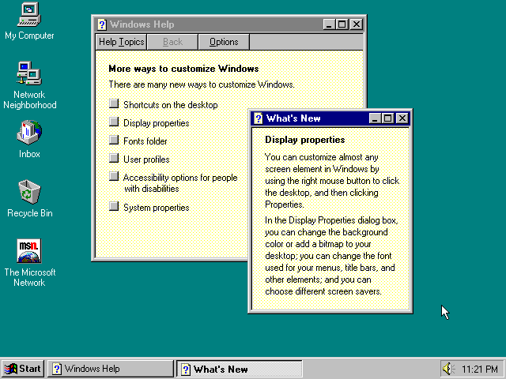

<!-- .slide: data-state="title-page" -->

# Let's web dev like it's 1999!

 

## Ben Ilegbodu

 

[@benmvp](https://twitter.com/benmvp) | [benmvp.com](/) | [@nejsconf](https://twitter.com/nejsconf)

 

July 27, 2018

NOTES:
- Welcome!

=====

<!-- .slide: data-background="url(../../img/giphy/stand-up-kevin-durant.gif) no-repeat center" data-background-size="cover" -->

  

    <h1 style="font-size: 5em">Stand Up!</h1>
  

NOTES:
- But first, would like everyone to stand up!
- Squats counting down from 10 to 1
- Now turn to your neighbors, fist bump & say hi

/////

## me.json

	

		
	

	

		<pre class="large"><code class="lang-json">
{
  "name": "Ben Ilegbodu",
  "priorities": [
    "Jesus", "family", "work"
  ],
  "location": "Pittsburg, CA",
  "work": "Eventbrite",
  "role": "Principal Frontend Engineer",
  "hobbies": [
    "basketball", "DIY", "movies"
  ]
}
			</code></pre>
	

NOTES:
- I'm a Principal Frontend Engineer at Eventbrite
- Been working on FE infra writing shell scripts in Node
- Been using some of these JS features I'm showing

=====

# TI-83 image

NOTES:
- My first programming language I learned was `BASIC`
  * Summer program in '98
- Used that to build "apps" for my TI-83 calc in high school
- Would type out code in Notepad
- Print it out
- Then type out by hand using T-9 keypad on calculator
  * Wasn't a way to get code from comp to calc originally
- I would've stuffed my ownself in a locker

/////

NOTES:
- Started sharing my apps online, and folks would ask how to write TI apps
- So I started writing TI calculator tutorials
- Initially I wrote them as Windows Help Applications
  * Kind of like a hypercard system where you can link screens
  * Generated a `.hlp` file
  * Hard to distribute
- Quickly realized the web...

/////

# Geocities site screenshot

https://web.archive.org/web/20010405113755/http://www.geocities.com/basicguruonline/index.html

NOTES:
- Built "Basic Guru Online" as a Geocities website
  * (because apparently I was a "guru")
  * Geocities was like THE hosting service of the day
  * There was also Angelfire
  * Talking early 2000
- BGO was like a full web application
  * Geocities handled all the backend
  * FTP'd individual files from computer to their server
- **FIRST:** Overall page layout was frame-based using `<frameset>`
  * The bottom frame was fixed height
  * Main section filed rest of the window
  * Didn't get this functionality until recently with flexbox
- **SECOND:** 2 column layout using `<table>`
  * Still "responsive" nearly 20 years later!
- **THIRD:** Definitely created the logo in MS Paint using PowerPoint clip-art + Comic Sans
- **FOURTH:** Trusty-dusty hit counter (broken)
- **FIFTH:** I suggest using AOL to view the page
  * "Should be okay" using Internet Explorer or Netscape Navigator
  * Best viewed on an 800x600 res monitor!
- **SIXTH:** Weekly poll asks about internet connect speed

/////

# Yahoo site screenshot

https://web.archive.org/web/20010601021654/http://www.yahoo.com:80/

/////

# Amazon site screenshot

https://web.archive.org/web/20010601111711/http://www.amazon.com:80/exec/obidos/subst/home/home.html

/////

# Gatsby blog screenshot

NOTES:
- Fast forward nearly 2 decades
- Just updated my blog: benmvp.com
- Uses Gatsby for static site generation
  * Basically to generate the static HTML pages I did by hand way back when
- Written all in React
  * Uses Redux, GraphQL, JSS, Material-UI, Algolia, Webpack, Babel & more!
  * All to build a blog!

/////

# Berkeley Coding Boot Camp

- HTML5
- CSS3
- JavaScript
- jQuery
- Python/Django
- Bootstrap
- Express.js
- React.js
- Node.js
- AJAX/REST
- Database Theory
- Bookshelf.js
- MongoDB
- MySQL
- Command Line
- Git

NOTES:
- Friend of mine recently graduated from a boot camp
- They learned all of this in the 12-week course

/////

# High bar

NOTES:
- The bar for what's "minimally-viable" is so high now
- We go to conferences/meetups to hear from industry leaders about all the things we **should** be doing

=====

# HTML

=====

# CSS

======

# JavaScript

======

# Server-side

=====

# Debugging

=====

# Source control

=====

# Dev tooling

=====

# Deployment / Hosting

=====

# Shoutout to bootcamp

=====

# THANKS!

<!-- .element: style="width: 35%" -->

## Ben Ilegbodu

[benmvp.com](/) | [@benmvp](https://twitter.com/benmvp) | [ben@benmvp.com](mailto:ben@benmvp.com)  
[github/benmvp](https://github.com/benmvp)
  

Ask me anything! [benmvp.com/ama](http://www.benmvp.com/ama/)

NOTES:
- So that's it!
- Ask questions on Twitter, via email or AMA!
- Thanks!
