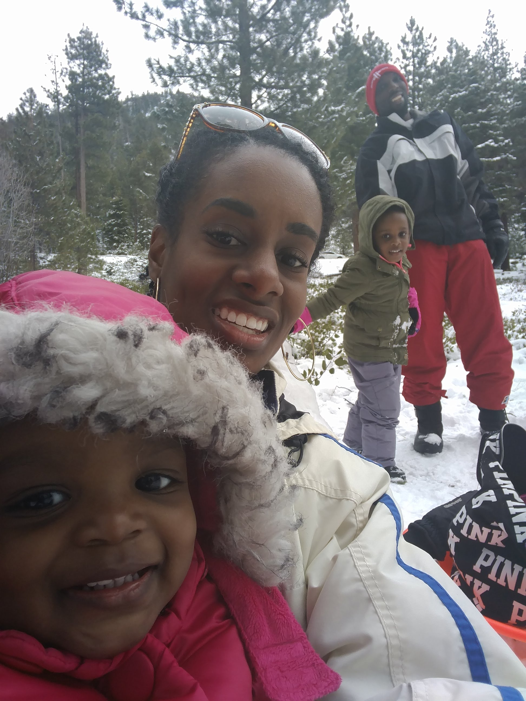

<!-- .slide: data-state="title-page" -->

# Let's web dev like it's 1999!

 

## Ben Ilegbodu

 

[@benmvp](https://twitter.com/benmvp) | [benmvp.com](/) | [@nejsconf](https://twitter.com/nejsconf)

 

July 27, 2018

NOTES:
- Welcome!

=====

<!-- .slide: data-background="url(../../img/giphy/stand-up-kevin-durant.gif) no-repeat center" data-background-size="cover" -->

  

    <h1 style="font-size: 5em">Stand Up!</h1>
  

NOTES:
- But first, would like everyone to stand up!
- Squats counting down from 10 to 1
- Now turn to your neighbors, fist bump & say hi

/////

## me.json

	

		
	

	

		<pre class="large"><code class="lang-json">
{
  "name": "Ben Ilegbodu",
  "priorities": [
    "Jesus", "family", "work"
  ],
  "location": "Pittsburg, CA",
  "work": "Eventbrite",
  "role": "Principal Frontend Engineer",
  "hobbies": [
    "basketball", "DIY", "movies"
  ]
}
			</code></pre>
	

NOTES:
- I'm a Principal Frontend Engineer at Eventbrite
- Been working on FE infra writing shell scripts in Node
- Been using some of these JS features I'm showing

=====

=====

# THANKS!

<!-- .element: style="width: 35%" -->

## Ben Ilegbodu

[benmvp.com](/) | [@benmvp](https://twitter.com/benmvp) | [ben@benmvp.com](mailto:ben@benmvp.com)  
[github/benmvp](https://github.com/benmvp)
  

Ask me anything! [benmvp.com/ama](http://www.benmvp.com/ama/)

NOTES:
- So that's it!
- Ask questions on Twitter, via email or AMA!
- Thanks!
