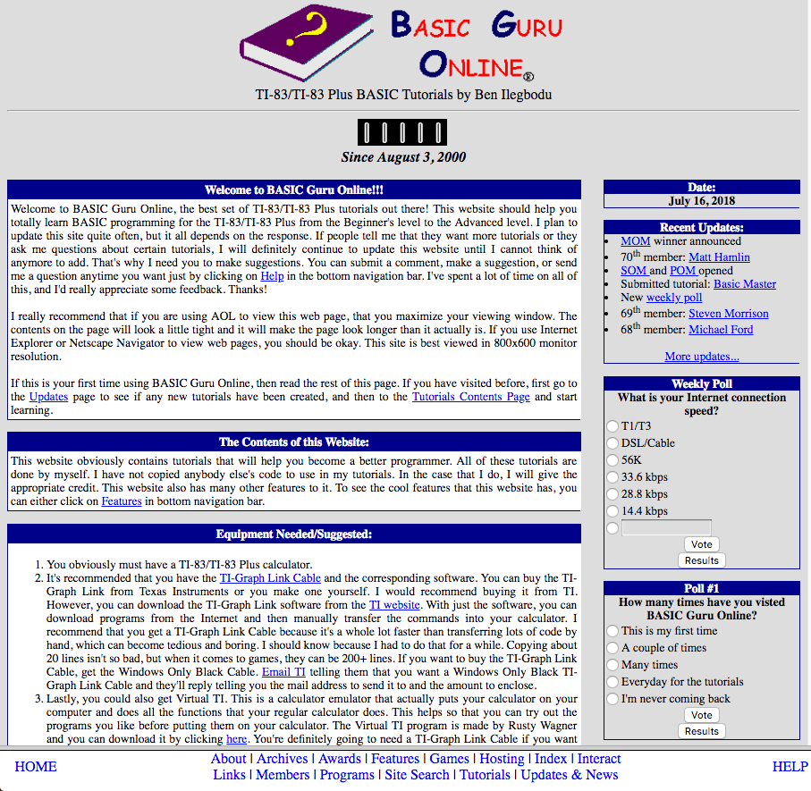
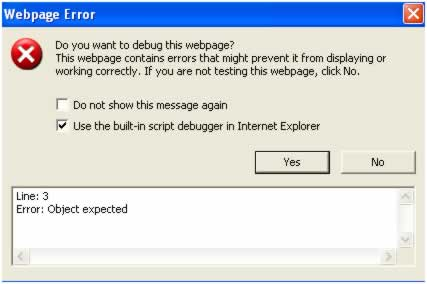

<!-- .slide: data-state="title-page" -->

# Let's web dev like it's 1999!

<br />

## Ben Ilegbodu

<br />

[@benmvp](https://twitter.com/benmvp) | [benmvp.com](/) | [@nejsconf](https://twitter.com/nejsconf)

<br />

July 27, 2018

NOTES:
- Welcome!
- Before we get started, how many of you were developing in 1999?
- Hoping to share a little about my dev story and walk down memory lane
  * Or take a history lesson for most of you

=====

<!-- .slide: data-background="url(../../img/giphy/stand-up-kevin-durant.gif) no-repeat center" data-background-size="cover" -->

<div style="display:flex; justify-content: center">
  <div class="overlay-light">
    <h1 style="font-size: 5em">Stand Up!</h1>
  </div>
</div>

NOTES:
- But first, would like everyone to stand up!
- Squats counting down from 10 to 1
- Now turn to your neighbors, fist bump & say hi

/////
<!-- .slide: data-background="url(../../img/family-naima-wedding.png) no-repeat center" data-background-size="contain" -->

NOTES:
- I'm a Principal Frontend Engineer at Eventbrite
- Work on our Frontend Platform team


=====
<!-- .slide: data-background="url(../../img/webdev/aid109294-v4-900px-Find-the-Minimum-and-Maximum-Points-Using-a-Graphing-Calculator-Step-1.jpg) no-repeat center" data-background-size="contain" -->

NOTES:
- My first programming language I learned was `BASIC`
  * Summer program in '98
- Used that to build "apps" for my TI-83 calc in high school
- Would type out code in Notepad
- Print it out
- Then type out by hand using T-9 keypad on calculator
  * Wasn't a way to get code from comp to calc originally
- I would've stuffed my ownself in a locker

/////
<!-- .slide: data-background="url(../../img/webdev/win95help.png) no-repeat center" data-background-size="contain" -->

NOTES:
- Started sharing my apps online, and folks would ask how to write TI apps
- So I started writing TI calculator tutorials
- Initially I wrote them as Windows Help Applications
  * Kind of like a hypercard system where you can link screens
  * Generated a `.hlp` file
  * Hard to distribute
- Quickly realized the web...

/////

[](https://web.archive.org/web/20010405113755/http://www.geocities.com/basicguruonline/index.html)

NOTES:
- Built "Basic Guru Online" as a Geocities website
  * (because apparently I was a "guru")
  * Geocities was like THE hosting service of the day
  * There was also Angelfire
  * Talking early 2000
- BGO was like a full web application
  * Geocities handled all the backend
  * FTP'd individual files from computer to their server
- **FIRST:** Overall page layout was frame-based using `<frameset>`
  * The bottom frame was fixed height
  * Main section filed rest of the window
  * Didn't get this functionality until recently with flexbox
- **SECOND:** 2 column layout using `<table>`
  * Still "responsive" nearly 20 years later!
- **THIRD:** Definitely created the logo in MS Paint using PowerPoint clip-art + Comic Sans
- **FOURTH:** Trusty-dusty hit counter (broken)
- **FIFTH:** I suggested using AOL to view the page
  * "Should be okay" using Internet Explorer or Netscape Navigator
  * Best viewed on an 800x600 res monitor!
- **SIXTH:** Weekly poll asks about internet connect speed

/////
<!-- .slide: data-background="url(../../img/webdev/yahoo-2001-screenshot.png) no-repeat center" data-background-size="contain" -->

NOTES:
- For fun...
- Here's what yahoo.com looked like at the time
- https://web.archive.org/web/20010601021654/http://www.yahoo.com:80/

/////
<!-- .slide: data-background="url(../../img/webdev/amazon-2001-screenshot.png) no-repeat center" data-background-size="contain" -->

NOTES:
- And amazon.com
- https://web.archive.org/web/20010601111711/http://www.amazon.com:80/exec/obidos/subst/home/home.html

/////
<!-- .slide: data-background="url(../../img/webdev/gatsby-blog-screenshot.png) no-repeat center" data-background-size="contain" -->

NOTES:
- Fast forward nearly 2 decades
- Just updated my blog: benmvp.com
- Uses Gatsby for static site generation
  * Basically to generate the static HTML pages I did by hand way back when
- Written all in React
  * Uses Redux, GraphQL, JSS, Material-UI, Algolia, Webpack, Babel & more!
  * All to build a blog!

/////
<!-- .slide: data-background="url(../../img/webdev/uc-berkeley-coding-bootcamp.jpg) no-repeat center" data-background-size="cover" -->

<div style="display:flex; justify-content: center">
  <div class="overlay-light">
    <h1>Berkeley Coding Boot Camp</h1>

<div style="-webkit-columns:3;-moz-columns:3;columns:3;margin-bottom:1em;margin-top: 1em">
  HTML5   
  CSS3  
  JavaScript  
  jQuery  
  Python/Django  
  Bootstrap  
  Express.js  
  React.js  
  Node.js  
  AJAX/REST  
  Database Theory  
  Bookshelf.js  
  MongoDB  
  MySQL  
  Command Line  
  Git  
</div>

  </div>
</div>

NOTES:
- Friend of mine recently graduated from a boot camp
- They learned all of this in the 12-week course
- https://bootcamp.berkeley.edu/coding/

/////
<!-- .slide: data-background="url(../../img/webdev/justyn-warner-551353-unsplash.jpg) no-repeat center" data-background-size="cover" -->

NOTES:
- The bar for what's "minimally-viable" is so high now
- We go to conferences/meetups to hear from industry leaders about all the things we **should** be doing
- A true "full stack" developer would have to be an expert in everything to create a modern website


- So I wanted to take a look at various aspects of how we built sites back in the day

=====

# Page Layout

NOTES:
- Before CSS3, flexbox & grid we needed ways to lay out our pages
- And many times we had some navigation that we wanted fixed
  * Either a header menu on top
  * Left nav
  * Or in the case of my site I thought a fixed nav footer was a good idea
- Now you may think I'm talking about using `<table>`s, but no!
- I'm talking about page layouts that pre-dated `<table>`

/////

```html
<FRAMESET ROWS="150px,*">
  <FRAME NORESIZE SRC="header.html" MARGINHEIGHT=15>
  <FRAMESET COLS="20%,*,20%">
    <FRAME SRC="nav.html" FRAMEBORDER=0>
    <FRAME SRC="home.html" FRAMEBORDER=0 NAME=content>
    <FRAME SRC="ads.html" FRAMEBORDER=0>
  </FRAMESET>
</FRAMESET>
```
<!-- .element: class="large" -->


NOTES:
- Talking about `<frameset>`
- Before I even try to explain the code, take a look at this HTML!
- It's in ALL-CAPS
- Attributes like `MARGINHEIGHT` & `FRAMEBORDER` aren't even quoting the values
- `<FRAME>` isn't even self-closing
  * Dunno how the browser figured out that one!
- Fun times!

/////
<!-- .slide: data-background="url(../../img/webdev/frameset-borders-margins.jpg) no-repeat center" data-background-size="contain" -->

NOTES:
- This is the layout this contrived example is building
- Got a "frame" that span the top
- Then 3 frames in a column
  * Outer ones are fixed and the middle one flexes
- So lets say "Frame 1" is your global header
- "Frame 2" would be a left nav
- "Frame 4" would be a right-side ads column maybe
- And "Frame 3" would actually be the main contents


/////

site.html
```html
<FRAMESET ROWS="150px,*">
  <FRAME NORESIZE SRC="header.html" MARGINHEIGHT=15>
  <FRAMESET COLS="20%,*,20%">
    <FRAME SRC="nav.html" FRAMEBORDER=0>
    <FRAME SRC="home.html" FRAMEBORDER=0 NAME=content>
    <FRAME SRC="ads.html" FRAMEBORDER=0>
  </FRAMESET>
</FRAMESET>
```
<!-- .element: class="large" -->


NOTES:
- Back to the code
- **ONE:** Each `<FRAME>` pointed to a separate actual page
  * An HTML page with just the header, just the nav, etc.
- **TWO:** The `<FRAMESET>` can be aligned in either `ROWS` or `COLUMNS`
  * **THREE:** And they can be nested
  * **FOUR:** Notice the `*` syntax to signal that the column takes up remaining space
- Got visual styling mixed right in the markup
- **FIVE:** Frames by default had borders so they needed to be turned off
- If you left the borders on, they could be resized
  * **SIX:** So there was an attribute to turn those off
- **SEVEN:** So what about that `NAME` attribute? What's that for

/////

nav.html
```html
<HTML>
  <BODY>
    <UL>
      <LI><A HREF="home.html" TARGET=content>Home</A></LI>
      <LI><A HREF="about.html" TARGET="content">About</A></LI>
      <LI><A HREF="help.html" TARGET="content">Help</A></LI>
    </UL>
  </BODY>
</HTML>
```
<!-- .element: class="large" -->

NOTES:
- Well in addition to having our grid layout, we also don't want to have to refresh the whole page
- The header, nav & ads are staying fixed
- So w/in `nav.html`, we just have our links target the `content` frame
  * You've probably always just done `target="_blank"` for a new window right?
  * It had a purpose!
- BTW, `<frameset>` was actually deprecated in HTML5, so...

/////

<div style="display:flex;align-items:center;justify-content:space-between">
	<div style="flex:0 0 35%;">
    <pre class="large"><code class="lang-html">&lt;body>
  <header> ... </header>
  <main> ... </main>
  <nav> ... </nav>
  <aside> ... </aside>
&lt;/body></code></pre>
	</div>
	<div style="flex:0 0 60%;">
		<pre><code class="lang-css">header { grid-area: header; }
main { grid-area: main; }
nav { grid-area: nav; }
aside { grid-area: ads; }
body {
  display: grid;
  grid-template-areas: "header"
                       "nav" 
                       "main" 
                       "ads";
  grid-template-columns: 100%;
  grid-template-rows: 150px 50px 1fr 30px;
}
@media screen and (min-height: 600px) {
  body {
    grid-template-areas: "header header header"
                        "nav main ads";
    grid-template-columns: 20% 1fr 20%;
    grid-template-rows: 150px 1fr;

  }
}</code></pre>
	</div>
</div>

NOTES:
- If you've been keeping up with the latest in CSS-land
  * This sounds awfully similar to CSS Grid that's becoming progressively more available in browsers
- Here's how we could implement the same thing now
- Notice how `<main>` actually comes before `<nav>` in the markup
  * For SEO
  * But Grid layout puts it where we want visually!

=====

# 1x1.gif

NOTES:
- What's the 1x1.gif you ask?
- Well...

/////

<div style="display:flex;align-items:center;justify-content:space-between">
	<div style="flex:0 0 35%;text-align:left">
    <h3>June 22</h3>
    <p style="margin-left:40px">Low Earth Orbit (LEO)</p>
    <h3>July 1</h3>
    <p style="margin-left:40px">Medium Earth Orbit (MEO)</p>
    <h3>July 8</h3>
    <p style="margin-left:40px">High Earth Orbit (HEO)</p>
    <h3>July 10</h3>
    <p style="margin-left:40px">Decaying Orbit</p>
    <h3>July 27</h3>
    <p style="margin-left:40px">NEJS CONF!</p>
	</div>
  <div style="flex:0 0 65%">
    <pre class="large"><code class="lang-html"><style type="text/css">
<!--
p { margin-left: 40px; }
-->
</style>

<h3>June 22</h3>
<p>Low Earth Orbit (LEO)</p>

<h3>July 1</h3>
<p>Medium Earth Orbit (MEO)</p></code></pre>
  </div>
</div>

NOTES:
- So let's say we have these list of dates from the NEJS website
- We just want to indent those descriptions in by 40 pixels
- Naturally we'd just use some CSS selector to add `margin-left`
- Simple right?
- But what do you do if CSS doesn't exist?
  * Or at least it's not guaranteed to be in all of your user's browsers?

/////

<div style="display:flex;align-items:center;justify-content:space-between">
	<div style="flex:0 0 35%;text-align:left">
    <h3>June 22</h3>
    <p style="margin-left:40px">Low Earth Orbit (LEO)</p>
    <h3>July 1</h3>
    <p style="margin-left:40px">Medium Earth Orbit (MEO)</p>
    <h3>July 8</h3>
    <p style="margin-left:40px">High Earth Orbit (HEO)</p>
    <h3>July 10</h3>
    <p style="margin-left:40px">Decaying Orbit</p>
    <h3>July 27</h3>
    <p style="margin-left:40px">NEJS CONF!</p>
	</div>
  <div style="flex:0 0 65%">
    <pre class="large"><code class="lang-html"><H3>June 22</H3>
<P>Low 
Earth Orbit (LEO)</P>

<H3>July 1</H3>
<P>Medium 
Earth Orbit (MEO)</P></code></pre>
  </div>
</div>

NOTES:
- Well you use a 1x1.gif!
- It's known as a "spacer gif"
- And yes I say "gif" not "jif" 😀
- It was 100% transparent, so it was see-thru
  * Used to do "pixel perfect" spacing before CSS
- Would work in both horizontal & vertical direction
- Used all over the place!

/////

<div style="display:flex;align-items:center;justify-content:space-between">
	<div style="flex:0 0 35%;text-align:left">
    <h3>June 22</h3>
    <p style="margin-left:40px">Low Earth Orbit (LEO)</p>
    <h3>July 1</h3>
    <p style="margin-left:40px">Medium Earth Orbit (MEO)</p>
    <h3>July 8</h3>
    <p style="margin-left:40px">High Earth Orbit (HEO)</p>
    <h3>July 10</h3>
    <p style="margin-left:40px">Decaying Orbit</p>
    <h3>July 27</h3>
    <p style="margin-left:40px">NEJS CONF!</p>
	</div>
  <div style="flex:0 0 65%">
    <pre class="large"><code class="lang-html"><H3>June 22</H3>
<P>&NBSP;&NBSP;&NBSP;&NBSP;Low 
Earth Orbit (LEO)</P>

<H3>July 1</H3>
<P>&NBSP;&NBSP;&NBSP;&NBSP;Medium 
Earth Orbit (MEO)</P></code></pre>
  </div>
</div>

NOTES:
- For this could use a whole bunch of `&nbsp;` entities
- But the spacing is dependent on the font
  * Wouldn't be exact if needed to line things up

=====

# Hooray for CSS!

NOTES:
- And then CSS became a thing!
- Awesome!

/////

```html
<BODY
  BGCOLOR="#DDDDDD"
  TEXT="#000000" 
  LINK="#0000FF"
  VLINK="#0000FF" 
  ALINK="#FF0000"
>
```
<!-- .element: class="large" -->

NOTES:
- No longer did we have to put text, link or background colors directly on `<body>`

/////


```html
<FONT FACE="COMIC SANS MS" COLOR="#FF0000" SIZE="-1">
  Weekly Poll
</FONT>
```
<!-- .element: class="large" -->

NOTES:
- No longer did we have to use the `<FONT>` tag for styling

/////


```html
<TABLE RULES="NONE" WIDTH="100%" BORDERCOLOR="#00008B" BORDER="1">
  <TR ALIGN="CENTER" BGCOLOR="#00008B">

  </TR>
</TABLE>

```
<!-- .element: class="large" -->

NOTES:
- Still using `<table>` for layout, but no longer need all the styling in the markup

- However...
- You know what we ended up using CSS most for????

/////

<style>
<!--
a.oldStyle { color: red; text-decoration: none; }
a.oldStyle:hover  { color: black; text-decoration: underline; }
-->
</style>

<a class="oldStyle" href="#">Dynamic links!</a>

<br />

```css
a       { color: red;   text-decoration: none; }
a:hover { color: black; text-decoration: underline; }
```
<!-- .element: class="large" -->

NOTES:
- To screw with the default link styling
- Make default links a different color; no underline
- Change color/underline on hover
- Look how dynamic it is!

=====
<!-- .slide: data-background="url(../../img/webdev/rodolfo-mari-81201-unsplash.jpg) no-repeat center" data-background-size="cover" -->

NOTES:
- You know how BE engineers are always saying JS is a toy language
- And we get mad saying it's legit
  * Especially since ES6+
- Well 2 decades ago it really was a toy language
  * We did silly things with it

/////

```html
<head>
  <script language="javascript">
    function sayHello() {
      alert("Welcome to BASIC Guru Online!")
    }
  </script>
</head>
<body onload="sayHello()">
```
<!-- .element: class="large" -->

NOTES:
- Things like display an alert message whenever someone visited my site! 🤦🏾‍♂️
- Soooo many things we wouldn't do today
- Including a `<script>` in the `<head>` is bad because it slows down render
- Just defining `sayHello` on the global scope instead of in a module
- Just calling the function in `onload` instead of "unobstrusive JS" using `addEventListener`
  * But we didn't have jQuery
  * Had to check for both `attachEvent` (IE) & `addEventListener` (standard)

- Imagine debugging and having that `alert()` pop up every time!

/////

```js
alert('start');
var num = getNum(new Date());

alert(num);

if (num > 42) {
  alert('here?????');
  num = 42;
}

for (var i = 0; i < num; i++) {
  document.getElementById('val').innerHTML = num;
  alert(document.getElementById('val').innerHTML);
}
```
<!-- .element: class="large" -->

NOTES:
- Speaking of debugging, we had no debugging tools!
- `alert()` debugging is all we had
  * Not even `console` debugging, which now is consider sub-par
- And don't accidentally put an `alert()` in a loop or endless loop!
  * Had to just quit the browser

/////


NOTES:
- Do remember IE gave some super meager way of debugging
- Whenever an error would happen everyone get this cryptic message
- It'd show for **every** error

/////



NOTES:
- But if you went into the settings and turned on debugging
- Get the option to debug using built-in script debugger
- It was pretty rough though

/////

# Firebug screenshot

NOTES:
- The Firebug came along and it changed the game in 2006/2007
- May never have even heard of it
- It was a Firefox extension
  * The reason I moved from IE to FF at the time
  * And let you *see* the CSS and debug the JS!
- Paved the way for our amazing web inspectors today
- I don't think "Web 2.0" with AJAX happens w/o the debugging from Firebug

/////

- Github
- SASS/PostCSS
- TypeScript
- Uglify
- Webpack
- ESLint
- Travis
- Netlify

NOTES:
- And these days we have all this dev tooling to make our lives easier
  * Ensure we don't ship broken code
- **Github:** Like table stakes now, but we didn't have version control
  * It existed but only w/in the biggest of companies
  * We had our desktop & FTP to transfer the files
  * Imagine just 2 people working on the site at the same person
  * Would work directly on the server and break all sorts of things on Production
  * _Dangling commas were my arch nemesis!_
- **Travis:** Continuous integration env automatically kicked off w/ git commits!
  * Can run tests
  * Even automatically deploy
- **Netlify:** Allows previewing PRs before they even merge!
- **Uglify:** Optimizes our code for us
  * Used to write terse JS/CSS to keep file sizes down
  * Friend at AOL wasn't allowed to write comments!

=====
<!-- .slide: data-background="url(../../img/webdev/sydney-rae-408416-unsplash.jpg) no-repeat center" data-background-size="cover" -->


NOTES:
- Many "thought leaders" today have been around a while
  * Some around my timeframe of about 2 decades
  * Some older
  * Some later
- But there are some that feel you have to learn web dev the way they did
  * You have to learn the hard way so you can appreciate what you've got
- I imagine this can be pretty stressful if you're new to the industry
  * Especially if you only had a 3- or 6-month accelerated program to learn
- So I wan to encourage you
  * Don't stress!
  * You're not less than / subpar
  * There are many ways to learn
  * I know many folks from bootcamps who are flat out killing it
  * Some I've had the pleasure of mentoring/training
  * Others who I didn't even know they were bootcamp grads until they told me
- Even if you just graduated yesterday
  * You can be just as integral as those of us who were there near the beginning or w/ a traditional background
- YOU GOT THIS!

=====

# THANKS!


<!-- .element: style="width: 35%" -->

## Ben Ilegbodu

[benmvp.com](/) | [@benmvp](https://twitter.com/benmvp) | [ben@benmvp.com](mailto:ben@benmvp.com)  
[github/benmvp](https://github.com/benmvp)
<br /><br />

Ask me anything! [benmvp.com/ama](http://www.benmvp.com/ama/)

NOTES:
- So that's it!
- Ask questions on Twitter, via email or AMA!
- Thanks!
