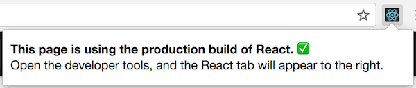
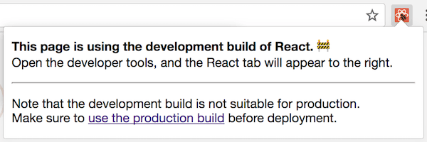

<!-- .slide: data-state="title-page" data-background="url(../../img/webdev/jason-leung-479251-unsplash.jpg) no-repeat center" data-background-size="cover" -->

<div style="display: flex; align-items:center; justify-content: flex-end">
	<div style="width: 45%;" class="overlay-light">
  
  <h1>Help! My React app is slowwwww! 🐢</h1>

  <br />

  <h2>Ben Ilegbodu</h2>

  <br />

  <p>[@benmvp](https://twitter.com/benmvp) | [benmvp.com](/) | [#ReactAlicante](https://twitter.com/hashtag/reactalicante)</p>

  <br />

  <p>14 September 2018</p>
  
  
  </div>
</div>

NOTES:
- Buenas tardes!
- Excited to be here at React Alicante
- Excited to be in Spain; it's my first time!
- Had a fun React/Redux testing workshop yesterday
- But talking about something totally different now


- Was speaking at Chain React in Portland, Oregon last year
- Spoke about React Native + ES.next
- But an attendee came up to me asking me to help diagnose a slow app
- Then 2 days later, Trey Huffine talked about React performance at SF React meetup
- Those plus experience reviewing code were the motivation for this talk

/////
<!-- .slide: data-background="url(../../img/react-perf/george-brynzan-720804-unsplash.jpg) no-repeat center" data-background-size="cover" -->

<div style="display:flex; justify-content: flex-start">
  <div class="overlay-light">
    <h1 style="font-size: 4em">React<br />Reconciliation</h1>
  </div>
</div>


NOTES:
- Internally, React uses several clever techniques to minimize the number of costly DOM operations required to update the UI
  * The `reconciler` makes this possible
  * Keeps a copy of the render tree and compares with new render
- For most apps, using React will lead to a fast user interface
- Don't have to optimize for performance
- But not a silver bullet
  * Number of ways to speed up your React app
  * If you’re noticing a slowdown, might wanna fix these
  * OR in a situation where you need to squeeze every ounce of performance

=====
<!-- .slide: data-background="url(../../img/giphy/stand-up-kevin-durant.gif) no-repeat center" data-background-size="cover" -->

<div style="display:flex; justify-content: center">
  <div class="overlay-light">
    <h1 style="font-size: 5em">Stand Up!</h1>
  </div>
</div>

NOTES:
- But first, would like everyone to stand up!
- Squats counting from in español
- Now turn to your neighbors, fist bump & say hi

/////
<!-- .slide: data-background="#000 url(../../img/family-naima-wedding.png) no-repeat center" data-background-size="contain" -->

NOTES:
- Christian, Husband, Father

/////
<!-- .slide: data-background="#000" -->


<!-- .element: class="plain" -->


<!-- .element: class="plain fragment" style="width: 60%" -->

NOTES: 
- I'm a Principal Frontend Engineer at Eventbrite
- Work on our Frontend Platform team
  * Doing FE infra + design system work
- **ONE:** Recently added Ticketea to the family

/////
<!-- .slide: data-background="#000 url(../../img/bball/gasol-brothers.jpg) no-repeat center" data-background-size="contain" -->

NOTES:
- I love basketball; playing and watching
- My favorite team is the Houston Rockets
- But since I'm in Spain, giving love to the hometown guys

=====

# Use production builds!

`NODE_ENV=production` + Uglify

372KB (before) → 43KB (after) = 88% reduction

NOTES:
- Let's just get this one out of the way
- Use `NODE_ENV=production` + uglify
- Because `PropType` & other helpful warnings in DEV
- Also decreases the bundle size

/////


<!-- .element: class="plain" style="width: 75%" -->


<!-- .element: class="plain" style="width: 75%" -->

[React Developer Tools for Chrome](https://chrome.google.com/webstore/detail/react-developer-tools/fmkadmapgofadopljbjfkapdkoienihi)

NOTES:
- Can tell whether your app is running in Production mode with React Dev Tools icon

=====

# Avoiding unnecessary DOM updates

NOTES:
- Touching the DOM is the most expensive thing we can do!

=====

## 1. Impact of `key`

/////

## Animation of index as key from React exposed

NOTES:
- Here's very simple example of a list
- And as we add something to the beginning of the list
- All of the elements are getting updated

/////

index as key 😢

```js
const List = ({items}) => {
  const listItems = items.map(({name}, index) => (
    <li key={index}>{name}</li>
  ))

  return (<ul>{listItems}</ul>)
}
```
<!-- .element: class="large" -->

<div class="code-highlight" style="height: 70px; top: 247px;"></div>


NOTES:
- This is because it's using "index as key"
- React uses `key` to associate items between render
- When we add a new item to the list, what was previously index 0 is now index 1
- And since new 1 is different than old 1, it updates the DOM
- And continues down the list
- It ends up adding a new element **at the end**

/////

Unique value as key 😄

```js
const List = ({items}) => {
  const listItems = items.map(({name, value}) => (
    <li key={value}>{name}</li>
  ))

  return (<ul>{listItems}</ul>)
}
```
<!-- .element: class="large" -->

<div class="code-highlight" style="height: 70px; top: 247px;"></div>

/////

## Animation of unique value as key from React exposed

NOTES:
- As a result, React can optimize better and _just_ add new item to the beginning
- Saves lot of unnecessary DOM manipulations which are slow
- Extrapolate this to a bigger list or bigger an app and it can get sluggish

=====

## 2. Impact of HOCs in `render()`

NOTES:

/////

Definition:
```js
const withTitle = (Component) => (
  ({title, ...props}) => (
    <div>
      <h3>{title}</h3>
      <Component {...props} />
    </div>
  )
)
```
<!-- .element: class="large" -->

Creation:
```js
const ListWithTitle = withTitle(List)
```
<!-- .element: class="large" -->

NOTES:
- Let's say we had this made up HOC called `withTitle`
- It will enhance the component passed to it to take a `label` prop
  * Wrap the component in a `<div>`
  * Include a `<label>`
- What it does doesn't matter, but how it is used does...

/////

HOC created in `render()` 👎🏾

```js
class Emails extends React.Component {
  render() {
    const ListWithTitle = withTitle(List)
    const {emails} = this.props

    return (
      <section>
        <header> ... </header>
        <ListWithTitle items={emails} title="Your Emails" />
        <footer> ... </footer>
      </section>
    )
  }
}
```
<!-- .element: class="large" -->

<div class="code-highlight" style="height: 70px; top: 247px;"></div>

NOTES:
- Initial thought may be to create the HOC w/in `render()`
- But this has big consequences!
- It's creating a new component time every time `Emails` is re-rendered
  * Even though the have the same name
- As a result, the previous `<ListWithTitle />` keeps completely unmounted
  * And the new one is mounted
- Even worse than index-as-key because the whole UI gets blown away and recreated

/////

HOC created outside 👍🏾

```js
const ListWithTitle = withTitle(List)

class Emails extends React.Component {
  render() {
    const {emails} = props

    return (
      <section>
        <header> ... </header>
        <ListWithTitle items={emails} title="Your Emails" />
        <footer> ... </footer>
      </section>
    )
  }
}
```
<!-- .element: class="large" -->

<div class="code-highlight" style="height: 70px; top: 132px;"></div>

NOTES:
- Instead define the HOC **outside** of render
- There'll only be a single definition of the enhanced component
- Re-renders of `Emails` will work as normal with reconcilation

=====

## 3. Impact of lots of data

NOTES:
- Let's look at a slighly different type of problem

/////

## Screenshot of list from react-virtualized

NOTES:
- What if you have a different type of list
- A list that has hundreds, even thousands of items to display/edit
- Your typical SASS platform, and the app the guy I mentioned in the beginning had
- React is fast, but the sheer number of DOM elements will make the app sluggish
- Can fix this by having a traditional paginated list to limit number of items displayed at a time
  * But jumping across pages can lead to a subar UX

/////

"windowing" FTW!

## Animated gif of react-virtualized in action

[`react-virtualized`](https://bvaughn.github.io/react-virtualized/)

NOTES:
- There's a technique called "windowing" where you only render a small subset of the items
  * typically just the ones that visible
  * everything else isn't rendered
  * an idea from video game development
- Windowing is tricky to implement because you need to keep the correct scroll position as things move off screen and are replaced
- Brian Vaughn, been really pushing React perf lately, created `react-virtualized`

=====

# Avoiding unnecessary reconciliation

NOTES:
- Reconciliation is React going down the component hierarchy calling `render()` and seeing if any rendered DOM has changed
- Even if nothing in the DOM changes, the reconciliation calculation itself can be costly for large apps
- So after we avoid actually updating the DOM unnecessarily
  * Work on avoiding unnecessary reconciliation
  * These are all super-micro optimizations
  * Don't have to do anything of them
  * But some of them are easy to implement if you're thinking ahead

=====

## 4. Impact of `shouldComponentUpdate()`

/////

Default `shouldComponentUpdate()`

```js
class DataTable extends React.Component {
  shouldComponentUpdate(nextProps, nextState) {
    return true;
  }

  render() {
    // gets called every time props/state update
    // even if they have same values
  }
}
```
<!-- .element: class="large" -->

NOTES:
- `shouldComponentUpdate()` allows finer control over reconciliation
- By default it returns `true` which is what `React.Component` does
- And that means reconciliation will happen every time
  * even if the props/state are the exactly the same

/////

Shallow compare in `shouldComponentUpdate()`

```js
class DataTable extends React.Component {
  shouldComponentUpdate(nextProps, nextState) {
    const {props, state} = this
    
    return !shallowEqual(props, nextProps)
      || !shallowEqual(state, nextState)
  }

  render() {
    // only gets called if next props OR state
    // don't shallow equal previous versions
  }
}
```
<!-- .element: class="large" -->

NOTES:
- However, if you know that in some situations your component doesn’t need to update
  * you can return `false` to skip `render()`
- In this case we'll `render()` if:
  * next `props` doesn't shallow equal previous props **OR**
  * next `state` doesn't shallow equal previous state
  * Basically when anything changes
- This works as long as you don't mutate objects in `props` or `state`
  * Because the only way to change the data is to create a new version
  * And that won't shallow equal

/////

Use `PureComponent` instead!

```js
class DataTable extends React.PureComponent {
  render() {
    // only gets called if next props OR state
    // don't shallow equal previous versions
  }
}
```
<!-- .element: class="large" -->

<div class="code-highlight" style="height: 70px; top: 132px;"></div>

NOTES:
- But there's really no reason to write that
  * Because that's exactly what `React.PureComponent` does!

/////

🚨 Stateless functional components work like `React.Component` 🚨

```js
const DataTable = (props) => {
  // gets called every time props update
  // even if it has same values
}
```
<!-- .element: class="large" -->

NOTES:
- FYI - stateless functional components work like `React.Component`
  * Not like `PureComponent`
- There's always been this idea that they'll be optimized
  * But it hasn't happened yet

=====

## 5. Impact of negating shallow comparison

/////

Array & object literals undo shallow compare

```js
class Page extends React.Component {
  render() {
    return (
      <DataTable
        pageSizes={[5, 10, 25, 50]}
        footerInfo={{label: 'Settings'}}
      />
    )
  }
}
```
<!-- .element: class="large" -->

NOTES:
- Creating array literals & object literals with every render is cheap
- But if `DataTable` is `PureComponent`...
  * `props.pageSizes` doesn't shallow compare to `nextProps.pageSizes`
  * Even though they do have the same values (deep comparison)

/////

Store in constants!

```js
const PAGE_SIZES = [5, 10, 25, 50]
const FOOTER_INFO = {label: 'Settings'}

class Page extends React.Component {
  render() {
    return (
      <DataTable
        pageSizes={PAGE_SIZES}
        footerInfo={FOOTER_INFO}
      />
    )
  }
}
```
<!-- .element: class="large" -->

NOTES:
- Instead put those literals in a `const` outside the class
- That way for every render of `Page`
  * passing the same values for `pageSizes` & `footerInfo`
- Now `props.footerInfo` does shallow compare to `nextProps.footerInfo`

/////

One-off functions undo shallow compare too

```js
class Page extends React.Component {
  _handleItemSelect() { ... }
  _handleItemDelete() { ... }

  render() {
    return (
      <DataTable
        onItemSelect={(id) => this._handleItemSelect(id)}
        onItemDelete={this._handleItemDelete.bind(this)}
      />
    )
  }
}
```
<!-- .element: class="large" -->

NOTES:
- Arrow functions or calling `.bind()` also undoes shallow comparison
  * They create a new function on each `render()`
  * This is so that when the function is called it has the right `this` scope
  * Which will not match the previous value too
- People say that creating these functions every `render()` is poor-performing
  * I think the bigger issue is undoing `PureComponent`
  * Because now the code is...
  * doing the shallow comparison (fails)
  * doing the reconciliation (nothing changes)
  * all unnecessary

/////

Pre-bind functions!

```js
class Page extends React.Component {
  constructor() {
    this._handleItemSelect = this._handleItemSelect.bind(this)
  }
  _handleItemSelect() { ... }
  _handleItemDelete = () => { ... }

  render() {
    return (
      <DataTable
        onItemSelect={this._handleItemSelect}
        onItemDelete={this._handleItemDelete}
      />
    )
  }
}
```
<!-- .element: class="large" -->

<div class="code-highlight fragment current-visible" style="height: 70px; top: 246px;"></div>
<div class="code-highlight fragment current-visible" style="height: 70px; top: 420px;"></div>

NOTES:
- The fix is to just bind `this` only once
- There are two ways to do this
- **ONE:** Override the method with a bound function property in the `constructor`
- **TWO:** Using Stage 3 future JavaScript define a bound arrow function property
- In either case, the function we pass to the handlers will have the correct `this`
  * And we only had to bind one time

/////

Derived data in `render()` doesn't shallow compare

```js
class Page extends React.Component {
  render() {
    const {items} = this.props
    const {query} = this.state
    const newItems = items.filter((item) => item.contains(query))

    return (<List items={newItems} />)
  }
}
```
<!-- .element: class="large" -->

<div class="code-highlight" style="height: 70px; top: 363px;"></div>

NOTES:
- Derived arrays/objects in `render()` inherently are new each `render()`
- Here we're filtering the `items` in `props` by the `query` in `state`
- There's no simple fix for this
  * Just know that even if `List` was a `PureComponent`
  * And items had the same values
  * It would still `render()` every time because they don't shallow compare
- May be considering making `List` do a *deep*-comparison instead of shallow
  * That would work, and prevent reconciliation
  * But it's likely that the deep comparison would take longer than reconciliation itself

=====

## 6. Impact of big `render()`

/////

Huge component renders cannot break reconciliation

```js
class Page extends React.Component {
  return (
    <main>
      <nav className="nav">
        { /* 300 lines of left nav markup */ }
      <nav>

      <SearchForm query={this.state.query} onChange={this._handleSearchChange} />

      <section className="data-table">
        { /* 200 lines of data-table markup */ }
      </section>

      <aside className="stuff">
        { /* 400 lines of more stuff! */ }
      </aside>
    </main>
  );
)
```

NOTES:
- Let's say you have a big component with hundreds of lines in `render()`
  * This is already bad for readability, but let's go with it 😄
- If the `<SearchQuery />` triggers a change which updates `this.state.query`
  * All of `render()` will happen
  * We'll render the hundreds of lines of markup
- Reconciliation will of course figure out nothing has changed and not touched DOM
  * But it's unnecessary reconciliation
- There are no component boundaries to even have a `PureComponent`

/////

Leverage helper components to break things up

```js
import DataTable from './DataTable';

class Nav extends React.PureComponent { ... }
class Stuff extends React.PureComponent { ... }

class Page extends React.Component {
  return (
    <main>
      <Nav navItems={NAV_ITEMS} />

      <SearchForm query={this.state.query} onChange={this._handleSearchChange} />

      <DataTable rows={this.props.data} />

      <Stuff type="blue" />
    </main>
  );
)
```

NOTES:
- By componentizing the markup, create component boundaries
  * The can implement `PureComponent` to stop reconciliation when props don't change
- Also just makes sense to break things up logically
- And you can even put the helper components in the same file so things aren't spread out

=====

## 7. Impact of multiple `setState()` calls

=====

# Avoid unnecessary calculations

NOTES:
- At this point, getting to just normal JavaScript code
- Probably won't matter unless you're building a DNA design tool, a rich-text editor, full-feature spreadsheet app, etc
- These calculations Could be the code to determine whether or not to prevent reconciliation
  * It’s just better to just let reconciliation happen
- Could just be code to calculate new state

=====

## 8. Impact of copying objects/arrays via spread

=====

## 9. Impact of recomputing derived state

=====

# Debugging tools

=====

# Recap

NOTES:
- All these can help your app run faster
- But don't prematurely optimize!
- Go and build things!!!

=====

# Resources

- [Optimizing Performance](https://reactjs.org/docs/optimizing-performance.html)
- [Performance Tools](https://reactjs.org/docs/perf.html)
- [Debugging React Performance with React 16 and Chrome Devtools](https://building.calibreapp.com/debugging-react-performance-with-react-16-and-chrome-devtools-c90698a522ad)
- [Optimizing React: Virtual DOM explained](https://evilmartians.com/chronicles/optimizing-react-virtual-dom-explained)

=====
<!-- .slide: data-background="url(../../img/webdev/matt-jones-42954-unsplash.jpg) no-repeat center" data-background-size="cover"  -->

<div style="display: flex; align-items:center; justify-content: flex-start">
	<div style="width: 40%" class="overlay-light">
  
  <h1>Ben Ilegbodu</h1>

  <p><a href="https://twitter.com/benmvp" target="_blank">@benmvp</a> | <a href="/" target="_blank">benmvp.com</a></p>
  <p><a href="mailto:ben@benmvp.com">ben@benmvp.com</a></p>
  <p><a href="https://github.com/benmvp" target="_blank">github/benmvp</a></p>

  <br />

  <p>Ask me anything!<br /><a href="http://www.benmvp.com/ama/" target="_blank">benmvp.com/ama</a></p>
  
  </div>
</div>

NOTES:
- I hope you enjoyed our ride in the wayback machine
  * Hopefully it gives us all appreciation for where we've come from
  * Next time we wanna complain about the current situation
- Ask questions on Twitter, via email or AMA!
- Wanna thank **conference** and **YOU!**
- Thanks!
