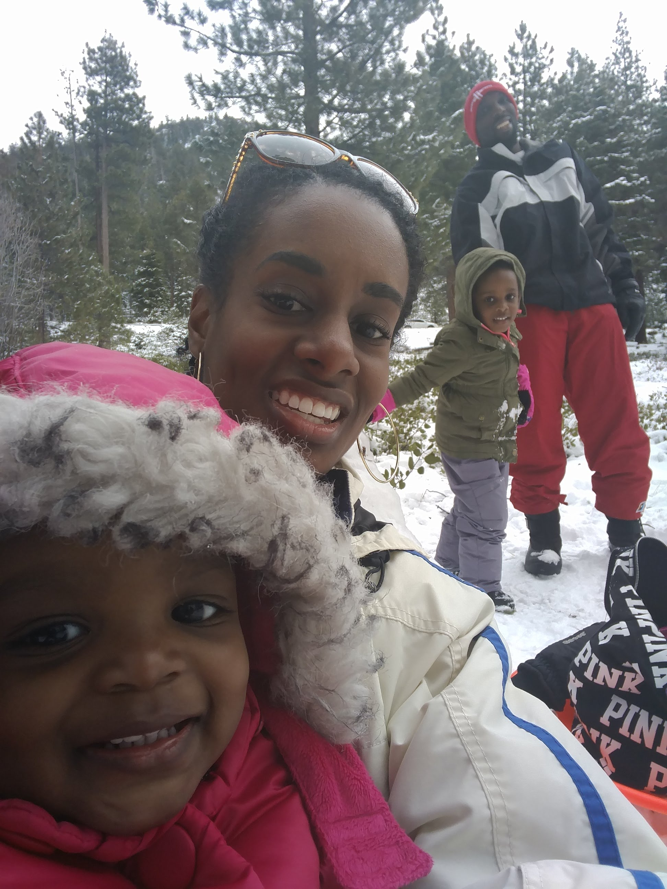
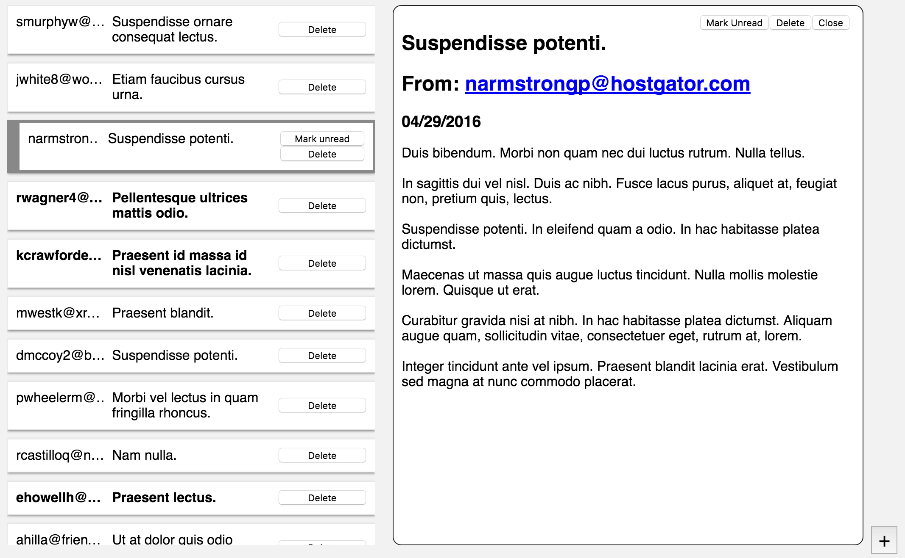

# React FUNdamentals Workshop

 

## Ben Ilegbodu

 

[@benmvp](https://twitter.com/benmvp) | [benmvp.com](/) | [#reactathon](https://twitter.com/hashtag/reactathon)  

 

March 19, 2018  

 

## http://bit.ly/react-fun-setup

NOTES:
- Who's done React before??

=====

## me.json

	

		
	

	

		<pre class="large"><code class="lang-json">
{
  "name": "Ben Ilegbodu",
  "priorities": [
    "Jesus", "family", "work"
  ],
  "location": "Pittsburg, CA",
  "work": "Eventbrite",
  "role": "Principal UI Engineer",
  "hobbies": [
    "basketball", "DIY", "movies"
  ]
}
			</code></pre>
	

NOTES:

/////

<!-- .element: style="border: 0; background: none; margin: 0; box-shadow: none;" -->

NOTES:
- Currently a Principal UI Engineer at Eventbrite
- Eventbrite is an online ticketing & events platform
- I work on the Frontend Platform team and right now we're in the midst of a transition from Backbone/Marionette to React
- Was an engineer, became a manager for about a year, returning back to dev

=====

# SETUP

 

# http://bit.ly/react-fun-setup

NOTES:
- Last chance to get setup before begin

/////

## Agenda

1. [JSX](https://github.com/benmvp/react-workshop/blob/master/src/01-jsx/)
1. [Components](https://github.com/benmvp/react-workshop/blob/master/src/02-components/)
1. [Lists](https://github.com/benmvp/react-workshop/blob/master/src/03-lists/)
1. [Email View](https://github.com/benmvp/react-workshop/blob/master/src/04-email-view/)
1. [Email Form](https://github.com/benmvp/react-workshop/blob/master/src/05-email-form/)
1. [Submit email form](https://github.com/benmvp/react-workshop/blob/master/src/06-submit-email-form/)
1. [Delete email](https://github.com/benmvp/react-workshop/blob/master/src/07-delete-email/)
1. [Interacting with APIs](https://github.com/benmvp/react-workshop/blob/master/src/08-api/)
1. [Styling](https://github.com/benmvp/react-workshop/blob/master/src/09-styling/)
1. [Mark unread/read](https://github.com/benmvp/react-workshop/blob/master/src/10-mark-unread/)

NOTES:
- Here's our agenda
- Gonna to be learn React by building a "real" application
- Hoping to Step 4 before lunch, and knock out the remaining 6 afterwards
- Step 4 is where a lot of the meat is
- We'll start off real slow and the progressively pick up the pace
- There are actually more steps in the Github workshop which you can do on your own afterwards

/////

## FUNdamental Concepts

- Using JSX syntax ([Step 1](https://github.com/benmvp/react-workshop/blob/master/src/01-jsx/))
- Writing readable, reusable and composable components ([Step 2](https://github.com/benmvp/react-workshop/blob/master/src/02-components/))
- Maintaining component state ([Step 4](https://github.com/benmvp/react-workshop/blob/master/src/04-email-view/))
- Handling user interaction ([Step 4](https://github.com/benmvp/react-workshop/blob/master/src/04-email-view/))
- Handling HTML forms & form elements ([Step 5](https://github.com/benmvp/react-workshop/blob/master/src/05-email-form/))
- Leveraging ES6+ to maintain application state ([Step 6](https://github.com/benmvp/react-workshop/blob/master/src/06-submit-email-form/))
- Making API calls ([Step 8](https://github.com/benmvp/react-workshop/blob/master/src/08-api/))
- Hooking into the component lifecycle ([Step 8](https://github.com/benmvp/react-workshop/blob/master/src/08-api/))
- Applying component styling with CSS classes ([Step 9](https://github.com/benmvp/react-workshop/blob/master/src/09-styling/))

NOTES:
- With these steps, we'll learn these FUNdamentals React concepts
- These are all you need in order to build anything in React
- Everything else is just more sophisticated applications of these core concepts

/////

NOTES:
- FYI - I'll be using ES6 / ES2015 syntax throughout our time together
- React & ES6 go really well together
- I'll do my best to explain the syntax; so maybe you'll learn ES6 + React
- If something doesn't make sense, ask questions!

/////

# Follow along

### --or--

# Code along

NOTES:
- There are many different ways that people learn
- I actually learn best with written tutorials because I can go at my own pace and follow links
- Live workshops like these help me because I can ask questions and here explanations
- I'm going to live code building a fake email app and explain React as I go
- I will go slowly enough that you can code along with me; some people like to do that
- But in order to cover what we need to cover, I'm going to move w/ pace so it _may_ be hard to type & grasp
- Alternatively you can just watch and follow along
- The nice thing is that you can switch back and forth because you have the opportunity to start from any given step

/////

# Questions?

NOTES:
Any questions so far?

=====

# DEMO

<!-- .element: style="width:65%" -->

/////

## Diagram Component Hierarchy

<!-- .element: style="width:65%" -->

/////

# Questions?

NOTES:
Any more questions?

=====

# Let's get started!

=====

## More functionality

- Redux
- Testing
- Routing
- Animation
- Form validation
- Server rendering

=====

<!-- .element: style="width:75%" -->

NOTES:
- Do me a solid and and star the repo

/////

<!-- .element: style="width: 50%" -->

## Feedback: [bit.ly/react-fun-feedback]()

/////

<!-- .element: style="width: 50%" -->

## Ben Ilegbodu

[benmvp.com](/) | [@benmvp](https://twitter.com/benmvp) | [ben@benmvp.com](mailto:ben@benmvp.com)  
 

Ask me anything! [benmvp.com/ama](http://www.benmvp.com/ama/)

 

Feedback: [bit.ly/react-fun-feedback]()

NOTES:
- So that's it!
- Ask questions on Twitter, via email or AMA!
- Thanks!
