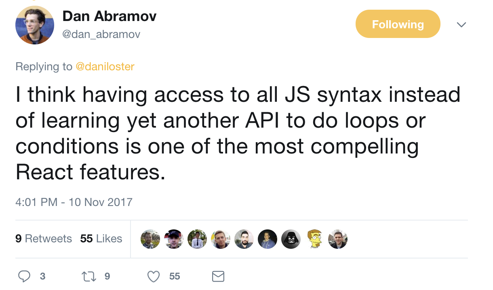
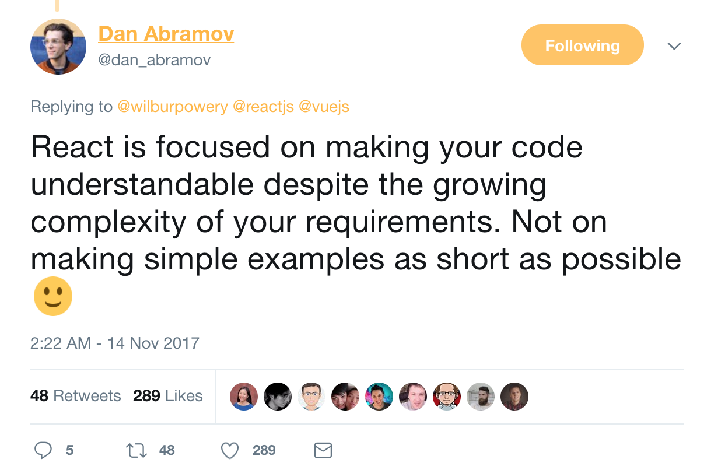
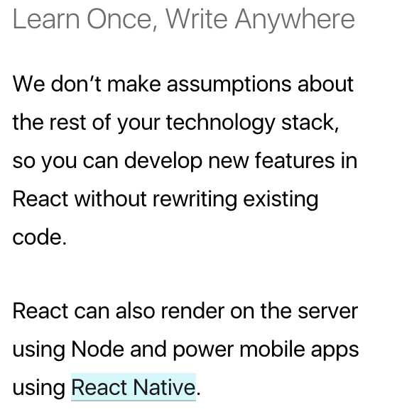
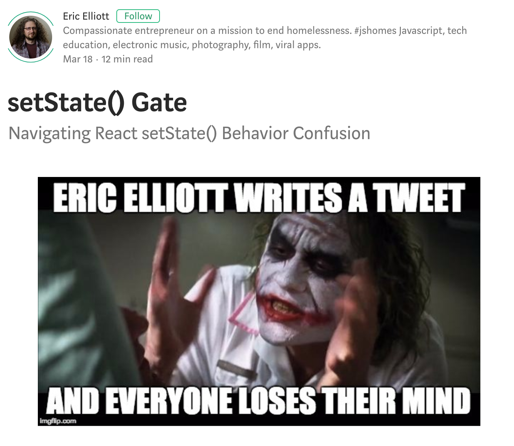
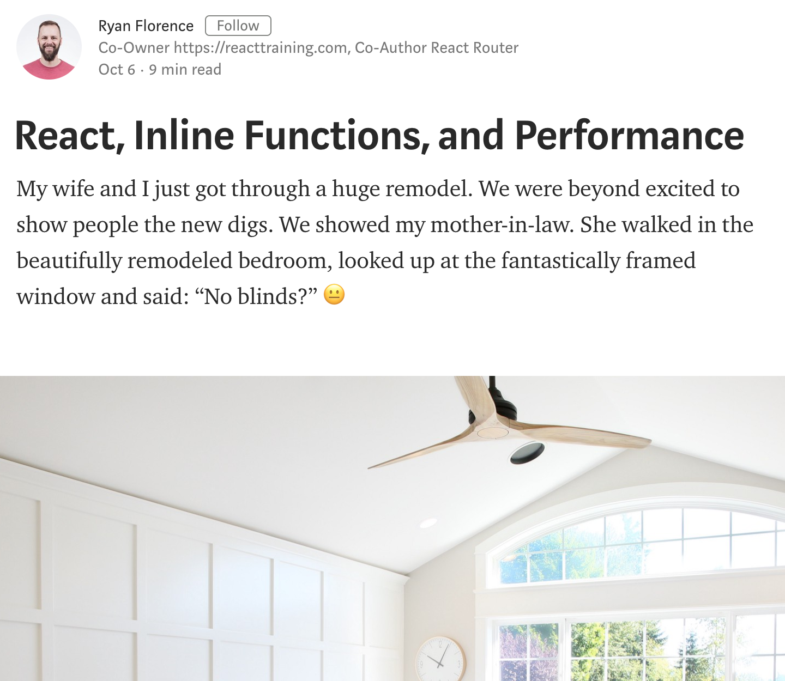
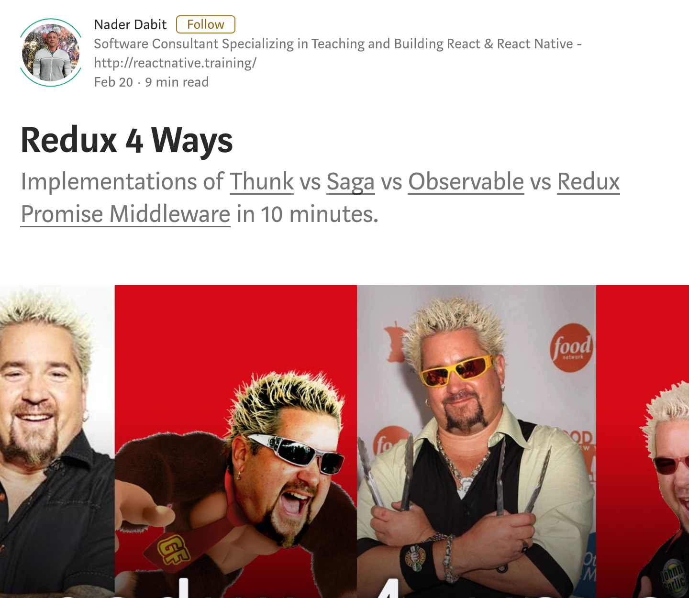
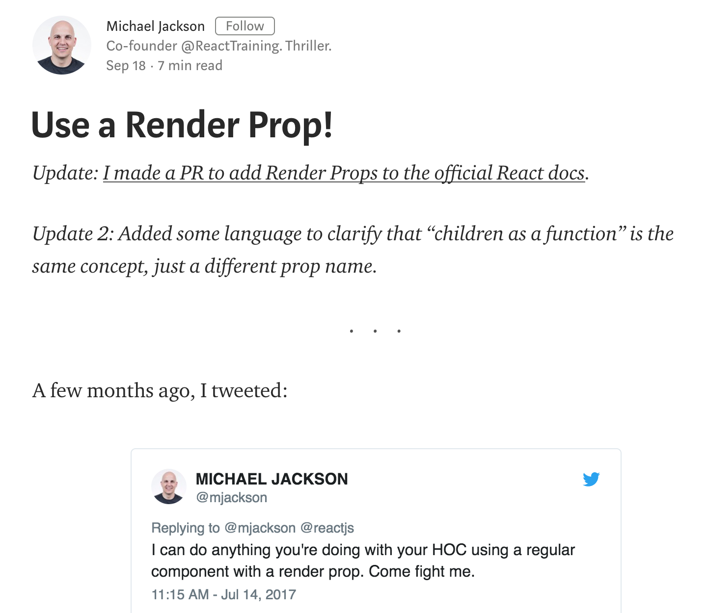

# Why React?

<br />

## Ben Ilegbodu

<br />

[@benmvp](https://twitter.com/benmvp) | [benmvp.com](/) | [#reactathon](https://twitter.com/hashtag/reactathon)  

<br />

March 20, 2018  

NOTES:
- My name is Ben Ilegbodu
- Super excited to be kicking of Reactathon and the Fundamentals conference
- Wanna introduce you to React and warm you up to many of the concepts you will hear the rest of today
- Called this talk "Why React?"...
- But another title for the talk could've been...

/////

# 10 Reason Why I ❤️ React!
### (just wait 'til you hear #6!)

<br />

## Ben Ilegbodu

<br />

[@benmvp](https://twitter.com/benmvp) | [benmvp.com](/) | [#reactathon](https://twitter.com/hashtag/reactathon)  

<br />

March 20, 2018  

NOTES:
- It was 2 years ago that we (Eventbrite) embarked on the journey of transitioning our frontend from Backbone to React
- And a small group of us had to covince everyone else that it was a good idea 😀
- Gonna pull back the covers on the rationales we used to make that switch
- And in doing so introduce you to how React works
- Not really planning to teach React; did that yesterday in a full-day workshop
- But you'll get to see a lot of what React is
- BTW - posted link to slides on twitter if you want to follow along

=====

<!-- .slide: data-background="url(../../img/giphy/stand-up-kevin-durant.gif) no-repeat center" data-background-size="cover" -->

# Stand Up!
<!-- .element: style="-webkit-text-stroke: black 10px; color: white; font-size: 5em" -->

NOTES:
- But first, would like everyone to stand up!
- Squats counting down from 10 to 1
- Now turn to your neighbors, introduce yourself & say hi

/////

## me.json

<div style="display:flex;align-items:center;justify-content:space-between">
	<div style="flex:0 0 35%;">
		
	</div>
	<div style="flex:0 0 60%;">
		<pre class="large"><code class="lang-json">
{
  "name": "Ben Ilegbodu",
  "priorities": [
    "Jesus", "family", "work"
  ],
  "location": "Pittsburg, CA",
  "work": "Eventbrite",
  "role": "Principal UI Engineer",
  "hobbies": [
    "basketball", "DIY", "movies"
  ]
}
			</code></pre>
	</div>
</div>

NOTES:
/////


<!-- .element: style="border: 0; background: none; margin: 0; box-shadow: none;" -->

NOTES:
- I'm a Principal Frontend Engineer at Eventbrite
- Eventbrite is an online ticketing & events platform
- Probably heard of us before; apparently Reactathon organizers haven't because they used one of our competitors
- Part of our Frontend Platform team
- We don't typically work on end-user features, but building the frontend platform that other devs build on top of
- Two main objectives: frontend infrastructure & component library

/////

<!-- .slide: data-background="url(../../img/giphy/james-harden-wesley-johnson-ankles.gif) no-repeat center" data-background-size="contain"-->

NOTES:
- Even though I've now lived in the Bay Area for over 15 years, I was born and raised in Houston, Texas
- So I'm a die-hard Rockets fan
- And this is gonna be our year

=====

# CORE STUFF
<!-- .element: class="title" -->

NOTES:
- Split this up into 2 main sections:
- Core Stuff & More Stuff
- Core ones will apply to everyone using React
- Part of the core React lib

=====
<!-- .slide: data-background="#ddd" -->

# 1. Declarative JSX


<!-- .element: style="border: 0; background: none; margin: 0; box-shadow: none; width: 60%" -->

NOTES:
- First let's talk about React & the way we declare our UI

/////

## JSX

```js
<div>
  <span className="val">{this.state.value}</span>
  <button onClick={this._handleClick}>+</button>
</div>
```
<!-- .element: class="large" -->

NOTES:
- Here is some JSX
- Got a `<div>` wrapping a `<span>` display and a `<button>`
- Looks much like HTML and lives right w/in our JavaScript app
- React actually existed before JSX
- Many people didn't like the syntax at first
- But I find it very approachable for defining the UI
- What you may not realize is that this JSX gets converted into JavaScript so that the browser can understand it

/////

## Transpiled JSX

```js
React.createElement(
  'div',
  null,
  React.createElement('span', {className: 'val'}, value),
  React.createElement('button', {onClick: this._handleClick}, '+'),
)
```
<!-- .element: class="large" -->

([Babel REPL](https://babeljs.io/repl/))

NOTES:
- Here it is transpiled; it's just JavaScript ultimately
- Thanks to the power of build tooling (aka Babel)
- We can write our code in friendly JSX
- But out comes normal JS
- I couldn't imagine building my React components like this

/////

## Collocated markup & logic (& data)

```js
class Incrementer extends React.Component {
  state = {value: 0}

  _handleClick = () => {
    this.setState((prevState) => ({value: prevState.value + 1}))
  }

  render() {
    return (
      <div>
        <span className="val">{this.state.value}</span>
        <button onClick={this._handleClick}>+</button>
      </div>
    )
  }
}
```
<!-- .element: class="large" -->

NOTES:
- Here's the JSX in the context of a full component
- We'll go into the details of what the component does in following sections
- But we're returning the JSX w/in `render()` as if it's a regular object
- So markup is in the JavaScript right there with the logic

/////

## JSX is not HTML!

```
class Label extends React.Component {
  render() {
    return (
      <label className="is-hidden" htmlFor={this.props.inputId}>
        {this.props.children}
      </label>
    )
  }
}
```

<!-- .element: class="large" style="margin-bottom: 1em" -->

React JSX props mirror HTML DOM properties!

```
let labelNode = document.getElementById('label')
labelNode.className = 'is-hidden'
labelNode.htmlFor = this.props.inputId
```
<!-- .element: class="large" -->

NOTES:
- One other thing, is that although JSX looks like HTML, it's not
- We're creating a custom `<Label>` component
- The `className` & `htmlFor` props should make it clear that this isn't HTML
- React chose to mirror the JS DOM API for its props which are all camelCase
- And that's why its `className` & `htmlFor` instead of the HTML `class` & `for`
- It's also why it's `onClick`, `onChange`, etc.
- React is pretty good at giving great warnings if you forget or mess up
- Especially with React 16

/////

  <!-- .element: style="width: 500px" -->  
Jay Phelps

<br />

## Why I love JSX!

(Coming up next!)

NOTES:
- So that's a brief overview of JSX
- There's so much more I'd like to cover
- But luckily Jay is going to go more into JSX in his talk "Why I love JSX"
- He's pretty pumped about it. It's got an exclamation point!
- He's right after me, so you can't leave
- No bathroom breaks; you're just gonna have to hold it

=====
<!-- .slide: data-background="#ddd" -->

<div style="display:flex;align-items:center;justify-content:space-around;">
    <div style="flex: 0 0 50%">
      
    </div>
    <div>
      <h1>2. Component-driven</h1>
    </div>
</div>

NOTES:
- The next motivation for the transition was React's component-based architecture

/////

## Everything is a component!

```js
export default class FormField extends React.Component {
  render() {
    const name = this.props.name
    return (
      <div>
        <Label inputId={name}>{this.props.label}</Label>
        <TextInput
          id={name}
          value={this.props.value}
          onChange={this.props.onChange}
        />
      </div>
    )
  }
}
```
<!-- .element: class="large" -->

NOTES:
- The sole way you build your UI in React is with "custom" components
- Everything is a component!
- And you build bigger components by combining smaller components w/ markup
- One way we create components is by creating a `class` and extending from `React.Component`
- The component has a `render()` method which is where you define the UI & return JSX
- Here we have a `FormField` component made up of existing `Label` & `TextInput` components
- It defines 4 `props` (`name`, `label`, `value` & `onChange`), which are how the component is configured
- It lays out the `Label` & `TextInput` w/in `<div>` and then passes along those props as configuration

/////

## Everything is a component!

```js
import FormField from './FormField'
export default class NameForm extends React.Component {
  render() {
    return (
      <form onSubmit={this._handleSubmit}>
        <FormField
          name="fName"
          label="First"
          value={this.props.fields.fName}
          onChange={this.props.onFieldChange.bind(null, 'fName')}
        />
        <FormField name="lName" ... />
      </form>
    )
  }
}
```
<!-- .element: class="large" -->

NOTES:
- We include the component by importing it and then using it in `render()` like an HTML tag
- And we configure the props by passing them in via attributes, just like HTML
- Although we're in Javascript using JSX, the HTML-like syntax should feel familiar
- Then you can combine one or more `FormField` components to create a bigger `Form` component

/////

## Everything is a component!

```js
import NameForm from './NameForm'

export default class App extends React.Component {
  _handleFieldChange = (fieldName) => {
    // Do something
  }

  render() {
    return (
      <NameForm
        fields={ {fName: 'Ben', lName: 'Ilegbodu'} }
        onFieldChange={this._handleFieldChange}
      />
    )
  }
}
```
<!-- .element: class="large" -->

NOTES:
- And keep doing that until you have a full-fledged app

/////

## Explicitly passing data DOWN the tree

`App.js`
```
<NameForm fields={ ... } />
```
<!-- .element: class="large" style="margin-bottom: 1.5em" -->

`NameForm.js`
```
<FormField name="fName" value={props.fields.fName} />
```
<!-- .element: class="large" style="margin-bottom: 1.5em" -->

`FormField.js`
```
<TextInput value={props.value} />
```
<!-- .element: class="large" style="margin-bottom: 1.5em" -->

`TextInput.js`
```
<input type="text" value={props.value} />
```
<!-- .element: class="large" -->

NOTES:
- It's not all sunshine & roses; at least not for everyone
- If in my `App` I want to set the value of the HTML input for the first name...
- I pass it from `App` -> `NameForm` -> `FormField` -> `TextInput` that reners `<input>`
- This is _very_ explicit; you can clearly see how data flows down the component hierarchy
- I personally don't have a problem with it because I prefer the clarity; especially in code reviews
- But some find it verbose. If they could, they'd rather jump levels of the hierarchy to get it where it should
- But I've seen that introduce other gnarliness

/////

## Explicitly passing data UP the tree 

`App.js`
```
<NameForm onFieldChange={this._handleFieldChange} />
```
<!-- .element: class="large" style="margin-bottom: 1.5em" -->

`NameForm.js`
```
<FormField onChange={props.onFieldChange.bind(null, 'first')} />
```
<!-- .element: class="large" style="margin-bottom: 1.5em" -->

`FormField.js`
```
<TextInput onChange={props.onChange} />
```
<!-- .element: class="large" style="margin-bottom: 1.5em" -->

`TextInput.js`
```
<input type="text" onChange={props.onChange} />
```
<!-- .element: class="large" -->

NOTES:
- Similarly getting data back **up** the tree is also explicit
- Let's say the top-level App wants to react to changes in the `<input>` field
- Well we have to pass callback handlers down the tree as props
- So when `onChange` happens on `TextInput` -> `FormField` -> `NameForm` -> `App`
- In Backbone/Marionette we had global "radios" & components could register channels
- But no enforcement on who was sending/receiving

/////

## `<App />`

## ↓ &nbsp;&nbsp;&nbsp;&nbsp;&nbsp;&nbsp; ↑

## `<NameForm />`

## ↓ &nbsp;&nbsp;&nbsp;&nbsp;&nbsp;&nbsp; ↑

## `<FormField />`

## ↓ &nbsp;&nbsp;&nbsp;&nbsp;&nbsp;&nbsp; ↑

## `<TextInput />`

## ↓ &nbsp;&nbsp;&nbsp;&nbsp;&nbsp;&nbsp; ↑

## `<input />`


NOTES:
- This one-way circular data flow is a completely different way of thinking than traditional MVC
- It's probably the hardest thing to grasp in React, but one you do everything else falls into place

=====
<!-- .slide: data-background="#ddd" -->

<div style="display:flex;align-items:center;justify-content:space-around;">
    <div>
      <h1>3. All JavaScript*</h1>
    </div>
    <div style="flex: 0 0 50%">
      
    </div>
</div>

NOTES:
- The 3rd reason was React being exclusively JavaScript based
- I have the asterisk there because obviously we're building web apps so CSS is obviously involved
- But I'm conveniently ignoring that for now 😀

/////

## "Markup-centric" libraries/frameworks

```html
<section className="section">
  {{#if headingText}}
    <h1>{{headingText}}</h1>
  {{/if}}
  <p>{{contents}}</p>
</section>
```
<!-- .element: class="large" -->

NOTES:
- Traditional UI frameworks, like Backbone, are markup-centric
- You create your markup templates separately and then layer interactivity in JS with the framework
- Here's a simple Handlebars template that's conditionally rendering the `<h1>` 
- As a consequence though, the templates need to have a robust language of their own for conditionals, loops, functions, etc.
- If not, using the templating language can be a pain
- Handlebars was so simplistic in its language that it made Backbone a pain to use

/////

## Conditional Rendering

```
class Section extends React.Component {
  render() {
    const headingText = this.props.headingText

    return (
      <section className="section">
        { if (headingText) { }
          <h1>{headingText}</h1>
        { } }
        <p>{this.props.children}</p>
      </section>
    )
  }
}
```
<!-- .element: class="large" -->

NOTES:
- As we start with React, we see that JSX looks like HTML, so we may be tempted to do something like this
- Or... more likely just wonder how to accomplish conditionally including code
- Cuz this obviously looks like broken syntax
- One again trying to include the `<h1>` only if `headingText` is defined
- This is a syntax error

/////

## "Logic-centric" React

```
class Section extends React.Component {
  render() {
    const headingText = this.props.headingText
    let headingElem

    if (headingText) {
      headingElem = (<h1>{headingText}</h1>)
    }
    return (
      <section className="section">
        {headingElem}
        <p>{this.props.children}</p>
      </section>
    )
  }
}
```
<!-- .element: class="large" -->

NOTES:
- React doesn't have any special API to do loops or conditionals
- It just piggybacks on JavaScript
- Here's how I would do the conditional
- We can use normal JS to do conditionals instead of muddying up our JSX
- Conditionally assign a variable, and put that in our JSX
- React is logic-centric; you're primarily doing JS logic with a little bit of rendering

/////

## Conditional Rendering

```
class Section extends React.Component {
  render() {
    const headingText = this.props.headingText
    let headingElem

    if (headingText) {
      headingElem = React.createElement('h1', null, headingText)
    }
    return React.createElement(
      'section',
      {className: 'section'},
      headingElem,
      React.createElement('p', null, children)
    )
  }
}
```
<!-- .element: class="large" -->

NOTES:
- This is what the JSX would be transformed into
- So it really **is** all JavaScript
- It seems like a lot more code, so...

/////

## Conditional Rendering

```
class Section extends React.Component {
  render() {
    const headingText = this.props.headingText

    return (
      <section className="section">
        {headingText && <h1>{headingText}</h1>}
        <p>{this.props.children}</p>
      </section>
    )
  }
}
```
<!-- .element: class="large" -->

NOTES:
- Many people use expressions in JSX for this to keep things short
- But at Eventbrite we strive to keep the JSX as "clean" as possible
- This might be "okay", but would get out of hand quickly
- I've seen these spanning 10+ lines

/////

[](https://twitter.com/dan_abramov/status/929136989085093890)

(...but [StackOverflow](https://stackoverflow.com/questions/22876978/loop-inside-react-jsx) 😞)

NOTES:
- Dan tweeted this in response to a request to add conditionals and loops into JSX
- I ❤️ JavaScript so the more I can do in JS the better
- I'm glad that I don't have to learn a new API to do conditionals/loops in React
- Because it's JS, I can do whatever JS can do
- But for some though, this is a drawback because you _have_ to know JS pretty well to be effective
- Before if you were solid at HTML/CSS, you could throw in some jQuery & do really well
- Looping and conditionals in JSX is not intuitive
- That's a StackOveflow question about loops that has > 300k views and 520 upvotes!
- Now it's JS or bust, which takes some getting used to

=====
<!-- .slide: data-background="#ddd" -->

<div style="display:flex;align-items:center;justify-content:space-around;">
    <div style="flex: 0 0 50%">
      
    </div>
    <div>
      <h1>4. State-driven</h1>
    </div>
</div>

NOTES:
- So far we've talked about (1) JSX, (2) Component-driven & (3) JavaScript
- And so far we've basically been creating static user-interfaces; not user interaction
- To do that the state of the UI has to change over time
- So React components are state-driven instead event-driven, which is more familiar
- This is the hardest thing to wrap your head around if you're new to React
- It's just a different way of building UIs
- But I've found it to be very compelling
- So let's look at how React is state-driven

/////

## Event-driven jQuery

```html
<div>
  <span class="val">0</span>
  <button class="btnUp">+</button>
</div>
```
<!-- .element: class="large" -->

```js
$('.btnUp').click(function() {
  var $val = $('.val'),
      currentValue = parseInt($val.html(), 10)

  $val.html(currentValue + 1)
})
```
<!-- .element: class="large" -->

<div>
	<span class="val" style="font-size: 2em;text-align: center;margin: 0 1em">0</span>
	<button class="btnUp" style="font-size: 2em" onclick="$('.val').html(+$('.val').html() + 1)">&nbsp;&nbsp;+&nbsp;&nbsp;</button>
</div>

NOTES:
- Here's some event-driven jQuery code that should be pretty familiar
- Click a button and update `<span>`
- The driver is the event
- This is _really_ easy to follow (imperative), but as app grows in complexity, code turns into crazy spaghetti

/////

## State-driven React

```js
class Incrementer extends React.Component {
  state = {value: 0}

  _handleClick = () => {
    this.setState((prevState) => ({value: prevState.value + 1}))
  }

  render() {
    return (
      <div>
        <span className="val">{this.state.value}</span>
        <button onClick={this._handleClick}>+</button>
      </div>
    )
  }
}
```
<!-- .element: class="large" -->

<div class="code-highlight fragment current-visible" style="height: 80px; top: 197px"></div>
<div class="code-highlight fragment current-visible" style="height: 80px; top: 704px"></div>
<div class="code-highlight fragment current-visible" style="height: 80px; top: 764px"></div>
<div class="code-highlight fragment current-visible" style="height: 190px; top: 313px"></div>
<div class="code-highlight fragment current-visible" style="height: 80px; top: 704px"></div>

NOTES:
_click through code highlights_

- Contrast this with the React code equivalent
- Simplest example of reactivity in React
- **First:** Start off with initial state
- **Second:** Then we render UI based on state (and props)
- **Third:** Handle user click of `+` button
- **Fourth:** Take the previous value of the state (`0`), increment by 1 and then update the state (`setState`)
- It's the handler that does the logic of incrementing the value; separation of concerns!
- And since `value` is already in `state` we don't have to get it from the DOM
- **Fifth:** Then calling `setState` causes `render` to be called again
- Click again and the cycle continues
- In the old world `_handleClick` would've directly manipulated the DOM
- But instead we update the state and that will indirectly update the DOM
- Layer of indirection is hard to wrap head around

/////

## React dev work can be boiled down to...

1. `render()` based on `props` & `state`
1. `onEvent` transform data → `setState()`
1. Profit 🎉

<!-- .element: style="font-size: 1.5em; margin-top: 1.5em" -->

NOTES:
- So basically we do work in two main areas:
- 1/ Define what we're going to `render()` based on `props` & `state`
- Can have conditional logic, loops, other sophisticated logic to determine what to render
- Skill: Ability to build layouts with HTML & CSS
- 2/ When events happen, do stuff to transform data to generate new `state` (and `render` again)
- Can also do async transformation by making API calls
- Skill: Ability to transform data efficiently; algorithms are really handy
- And the loop continues

/////

[](https://twitter.com/dan_abramov/status/930380316463726593)

NOTES:
- When folks look at simple examples of "reactivity" in React, they find it to be too verbose; and it is
- But with React trades conciseness for predictability
- So you end up spending more time explicitly wiring things up together
- Buuuut... structure of your code can more or less stay the same as complexity grows
- Certainly not the case with jQuery or Backbone; things got cray
- So if an app grew organically, it never was rearchitected
- But prepare yourself for the fact that it'll feel like you're writing "more code" in the beginning

/////

  <!-- .element: style="width: 500px" -->  
Feather Knee

<br />

## From Imperative to Declarative

(Right after Jay!)

NOTES:
- That was suuuper quick overview of how reactivity in React works in a declarative way
- It's really the crux of how React works
- It's also probably the biggest mental shift when developing in React
- Luckily Feather's gonna go into way more detail about how it all works
- And she's speaking right after Jay!
- So that pee you were holding? You'll be holding it for a while! 😉

=====
<!-- .slide: data-background="#ddd" -->

<div style="display:flex;align-items:center;justify-content:space-around;">
    <div>
      <h1>5. Sophisticated reconciler</h1>
      <h2>(aka Virtual DOM)</h2>
    </div>
    <div style="flex: 0 0 50%">
      
    </div>
</div>

NOTES:
- Let's talk about our 5th reason for the transition:
- The killer feature of React: the Reconciler aka Virtual DOM
- Whenever anyone talks about React it's the cool feature they talk about
- Technically "Virtual DOM" is a misnomer


- So up until this point, it's looked like `render()` was rendering to the DOM
- But it's not...

/////

## React reconciler makes efficient updates easy 💯

```js
class Incrementer extends React.Component {
  state = {value: 0}

  _handleClick = () => {
    this.setState((prevState) => ({value: prevState.value + 1}))
  }

  render() {
    return (
      <div>
        <span className="val">{this.state.value}</span>
        <button onClick={this._handleClick}>+</button>
      </div>
    )
  }
}
```
<!-- .element: class="large" -->

<div class="code-highlight fragment current-visible" style="height: 70px; top: 370px"></div>
<div class="code-highlight fragment current-visible" style="height: 240px; top: 655px"></div>
<div class="code-highlight fragment current-visible" style="height: 70px; top: 715px; left: 875px; width: 530px"></div>

NOTES:
_click through code highlights_

- Let's take our example from before...
- **First:** When we call `setState`...
- **Second:** React calls `render()` w/ updated state
- So it looks like are re-rendering the `<div>` + children each time
- **Third:** When we know all we _really_ are updating is _just_ the `innerHTML` of `<span>`
- `render()` is **not** updating DOM, but building up element hierarchy
- Basically a _new_ virtual representation of the DOM
- The reconciler (aka "Virtual DOM") keeps a copy of DOM, compares w/ newly rendered DOM and only updates changes
- So we don't have to do the hard work of figuring out how to make the "micro updates"
- We can just write our code the easy way: like it re-renders everything
- And React does the hard work of figuring out micro updates
- This is _really_ _really_ nice

/////

## Lin Clark - A Cartoon Intro to Fiber

<iframe width="1333" height="750" src="https://www.youtube.com/embed/ZCuYPiUIONs" frameborder="0" allowfullscreen></iframe>

### React Conf 2017

NOTES:
- React has a brand new reconciler called the "Fiber reconciler" which is opening up the door to even more sophistication
- Lin did an amazing job at last year's React Conference explaining what it is and how it all works
- Highly suggest you check that out later!

=====

# MORE STUFF
<!-- .element: class="title" -->

NOTES:
- So that was the Core Stuff
- The ones that will apply to everyone because they are part of the core lib
- Now let's move on to "More Stuff"
- See what I did there? "Core Stuff" / "More Stuff"?
- I spent a dispproportionate amount of time on that
- These are extra things that may or may not apply to you

=====
<!-- .slide: data-background="#ddd" -->

<div style="display:flex;align-items:center;justify-content:space-around;">
    <div style="flex: 0 0 50%">
      
    </div>
    <div>
      <h1>6. Server-side rendering</h1>
      <h2>(aka "Isomorphic React")</h2>
    </div>
</div>

NOTES:
- Let's talk about server-side rendering or "Isomorphic React"
- "Isomorphic JavaScript" or "Isomorphic React" is the idea of using the same templates rendered client-side on **initial** server render

/////

## Isomorphic React

<div style="display:flex;align-items:center;justify-content:space-around;">
    
    <div>
		  <h2>Performance</h2>
      <h2>SEO</h2>
      <h2>Open Graph</h2>
    </div>
</div>

NOTES:
- Three reasons:
- Performance: initial page render
- SEO: Google doesn't have to execute your JS to get meaningful data + they includes page render speed in ranking algorithm
- Open Graph: media previews
- React, unlike other JS frameworks/libraries, is setup to render server-side, as we'll see
- Want to emphasize that I'm talking about the _initial_ render

/////

## React components only define **WHAT** to render!

```js
class Incrementer extends React.Component {
  state = {value: 0}

  _handleClick = () => {
    this.setState((prevState) => ({value: prevState.value + 1}))
  }

  render() {
    return (
      <div>
        <span className="val">{this.state.value}</span>
        <button onClick={this._handleClick}>+</button>
      </div>
    )
  }
}
```
<!-- .element: class="large" -->

NOTES:
- Let's return to our old friend the `Incrementer` component
- Up until this point I've kind of made it seem like `render()` after reconciliation was rendering to the DOM
- But event that's not true!
- `render()` just informs _what_ elements & child components should be rendered
- It doesn't dictate _how_ they should be rendered

/////

## DOM rendering happens at the root

```js
import React from 'react'
import ReactDOM from 'react-dom'
import App from './App'

const props = window.__SERVER_DATA__ || {}

ReactDOM.hyrdate(
  <App {..props} />,
  document.getElementById('root')
)
```
<!-- .element: class="large" -->

([`ReactDOM.hydrate`](https://reactjs.org/docs/react-dom.html#hydrate) is new in React 16)

<div class="code-highlight fragment current-visible" style="height: 70px; top: 201px"></div>
<div class="code-highlight fragment current-visible" style="height: 240px; top: 487px"></div>

NOTES:
_click through code highlights_

- Rendering to the DOM typically happens in the entry point of your app
- **First:** You'll import from `react-dom`
- **Second:** Then use it's `hydrate()` function (new to React 16)
- Inserts your app into the DOM location
- When your app updates, it produces a new component hierarchy
- `react-dom` is what takes that difference from reconciler and applies it to the DOM
- I bring up that distinction because that separation between building your UI and rendering to DOM...


/////

## Render to string server-side!

```js
import React from 'react'
import ReactDOMServer from 'react-dom/server'
import App from './App'

const props = {
  // Data coalesced from DB / API calls
  // Data coalesced from Express GET/POST params
  // Data coalesced from other environment params
}

const markup = ReactDOMServer.renderToString(<App {...props} />)

// return `markup` in HTML response
// assign `props` to `window.__SERVER_DATA__` in HTML response
```
<!-- .element: class="large" -->

<div class="code-highlight" style="height: 70px; top: 711px"></div>

NOTES:
- Allows for us to render the _exact same_ UI server-side to a string!
- Take that string and include it in HTML response
- This is such a huge feature!
- Before this, all UI libraries just assumed the DOM and browser
- So getting your templates to run server-side was at best a pain; at worst in possible
- But now React allows us to do isomorphic javascript

/////

  <!-- .element: style="width: 500px" -->  
Tanmai Gopal

<br />

## Lightning Talk: awesome-react-fullstack

(Stay for Day 3!)

NOTES:
- If you're gonna be here for the Advanced Conference as well, Tanmai will be giving a lightning talk on this very subject

=====
<!-- .slide: data-background="#ddd" -->

<div style="display:flex;align-items:center;justify-content:space-around;">
    <div>
      <h1>7. Testing</h1>
    </div>
    <div style="flex: 0 0 50%">
      
    </div>
</div>

NOTES:
- Who hear likes testing?!?!
- The same component-based architecture that makes server-side rendering easy, also makes testing React components "minimally-painful
- Many other frameworks directly manipulate the DOM, making UI also hard to test
- Pretty much have to run tests in a browser or headless browser which brought a host of issues

/////

## Test public API only!

```js
class Incrementer extends React.Component {
  state = {value: 0}

  _handleClick = () => {
    this.setState((prevState) => ({value: prevState.value + 1}), () => {
      this.props.onIncrement(this.state.value)
    })
  }

  render() {
    return (
      <div>
        <span className="val">{this.state.value}</span>
        <button onClick={this._handleClick}>+</button>
      </div>
    )
  }
}
```

<div class="code-highlight" style="height: 60px; top: 353px"></div>

```
<Incrementer onIncrement={this._handleIncrement} />
```
<!-- .element: class="large" -->


NOTES:
- Again we have ol' faithful the `Incrementer` component
- Except this time after we click and update state, we also call `onIncrement` event handler prop
- We pass it `this.state.value` as a parameter
- At the bottom is an example of how you would call it
- We want to test the component's **public** API only:
- The markup that it renders and the callback handlers it calls
- That's it! Want to avoid testing implementation details like `state` changes

/////

## Testing Render

```js
import {shallow} from 'enzyme'

it('renders a `.val`', () => {
  const wrapper = shallow(<Incrementer />)

  expect(wraper.find('.val')).toBePresent()
  expect(wrapper.find('.val')).toHaveText('0')
})
```
<!-- .element: class="large" -->

[Jest](https://facebook.github.io/jest/) + [Enzyme](http://airbnb.io/enzyme/) +
[`jest-enzyme`](https://yarnpkg.com/en/package/jest-enzyme) = 😍

<div class="code-highlight fragment current-visible" style="height: 70px; top: 430px"></div>
<div class="code-highlight fragment current-visible" style="height: 70px; top: 485px"></div>

NOTES:
_click through code highlights_

- We can test `Incrementer` using Enzyme to test the public API
- Enzyme has a jQuery-like interface for manipulating React components _all without a browser_
- "Rendering" is creating an enzyme wrapper
- We use Jest as the test framework & assertion lib; also created by Facebook
- `jest-enzyme` provides additional enzyme-specific assertions to Jest
- **First:** Here we're asserting that `Incremener` renders an element with `.val` class
- **Second:** And that that `.val` element has the text "0" inside of it

/////

## Testing callbacks

```js
import {shallow} from 'enzyme'

it('calls `onIncrement` prop with current value', () => {
  const onIncrement = jest.fn()
  const wrapper = shallow(<Incrementer onIncrement={onIncrement} />)
  const button = wrapper.find('button')

  // simulate clicking twice
  button.simulate('click')
  button.simulate('click')

  expect(onIncrement).toHaveBeenCalledTimes(2)
  expect(onIncrement).toHaveBeenLastCalledWith(2)
  expect(wrapper.find('.val')).toHaveText('2')
})
```
<!-- .element: class="large" -->

NOTES:
- If you recall, when we click the button we call our `onIncrement` handler
- We want to verify that when we click the button that `onIncrement` gets called w/ the right parameter
- Well with enzyme we can simulate clicking the button w/o running in a browser!
- And with Jest we can provide a mock function using `jest.fn()`
- Then we can assert things on that mock:
- How many times it was called (twice for 2 clicks)
- What arguments it was last called with (2)
- Again: we shouldn't inspect the `state` of the component (which would be 2)
- Instead we assert on the value in the handler (the public API)
- Being able to unit test like this is a game-changer

/////

  <!-- .element: style="width: 500px" -->  
Rachel Ralston

<br />

## Testing your React Components with Jest

(This afternoon @ 1:15p!)

NOTES:
- Hopefully I haven't stolen too much of Rachel's thunder cuz she's going to show us how to properly test our React components

=====
<!-- .slide: data-background="#ddd" -->

<div style="display:flex;align-items:center;justify-content:space-around;">
    <div style="flex: 0 0 50%">
      
    </div>
    <div>
      <h1>8. React Native</h1>
      <h2>(...and other renderers)</h2>
    </div>
</div>

NOTES:
- Let's jump right into our 8th topic: React Native
- Eventbrite has 4 native apps: 2 on iOS & 2 on Android
- One set for people running events (organizer) / other set for people attending (attendee)
- We don't have any plans to replace our apps with React Native
- But should we need other native apps, being able to use React Native is appealing

/////


<!-- .element: style="width: 50%" -->

NOTES:
- One of the benefits React mentions on its home page is that you can "Learn Once, Write Anywhere"
- Basically saying that once you learn React and its paradigms, you can build apps for _any_ environment
- Not just the web

/////

## React for the Web

```js
class Incrementer extends React.Component {
  state = {value: 0}

  _handleClick = () => {
    this.setState((prevState) => ({value: prevState.value + 1}))
  }

  render() {
    return (
      <div>
        <span className="val">{this.state.value}</span>
        <button onClick={this._handleClick}>+</button>
      </div>
    )
  }
}
```
<!-- .element: class="large" -->

<div class="code-highlight" style="height: 240px; top: 655px"></div>


NOTES:
- Let's bring back our good friend the `Incrementer` component one more time
- Here's what it looks like if we were writing for React in the web
- We're using HTML elements: `<div>`, `<span>` & `<button>`
- But...

/////

## React Native 😄

```js
import {View, Text, TouchableOpacity} from 'react-native'
class Incrementer extends React.Component {
  state = {value: 0}
  _handlePress = () => {
    this.setState((prevState) => ({value: prevState.value + 1}))
  }
  render() {
    return (
      <View>
        <Text style={...}>{this.state.value}</Text>
        <TouchableOpacity onPress={this._handlePress}>+</TouchableOpacity>
      </View>
    )
  }
}
```
<!-- .element: class="large" -->

<div class="code-highlight" style="height: 70px; top: 143px"></div>
<div class="code-highlight" style="height: 240px; top: 603px"></div>


NOTES:
- If replaced `<div>`, `<span>` & `<button>` w/ `View`, `Text` & `TouchableOpacity` components from
  `react-native`
- You've got the makings of a native app!
- I remember when I went to a React Native workshop and was blown away
- Everything I learned building React web apps, I could leverage in React Native
- Just like w/ the web there are special considerations for native of course
- For instance, layout engine is different
- But there are a bunch more pre-built components
- And React is not just for mobile devices...

/////

## React exists in many environments

<div style="columns:3;-webkit-columns:3;-moz-columns:3;margin: 2em 0">
  [`ink`](https://github.com/vadimdemedes/ink)  
  [`noop-renderer`](https://github.com/facebook/react/blob/master/src/renderers/noop/ReactNoop.js)  
  [`rax`](https://github.com/alibaba/rax)  
  [`react-art`](https://github.com/reactjs/react-art)  
  [`react-blessed`](https://github.com/Yomguithereal/react-blessed)  
  [`react-canvas`](https://github.com/Flipboard/react-canvas)  
  [_**`react-dom`**_](https://github.com/facebook/react/tree/master/packages/react-dom)  
  [`react-fs-renderer`](https://github.com/ericvicenti/react-fs-renderer)  
  [`React-Gibbon`](http://techblog.netflix.com/2017/01/crafting-high-performance-tv-user.html)  
  [`React-GL`](https://github.com/PixelsCommander/React-GL)  
  [`react-hardware`](https://github.com/iamdustan/react-hardware)  
  [`react-html-email`](https://github.com/chromakode/react-html-email)  
  [`react-konsul`](https://github.com/mohebifar/konsul)  
  [_**`react-native`**_](https://github.com/facebook/react-native)  
  [`react-pdf`](https://github.com/diegomura/react-pdf)  
  [_**`react-sketchapp`**_](https://github.com/airbnb/react-sketchapp)  
  [_**`react-test-renderer`**_](https://www.npmjs.com/package/react-test-renderer)  
  [`react-three`](https://github.com/Izzimach/react-three)  
  [`react-titanium`](https://github.com/yuchi/react-titanium)  
  [`react-tvml`](https://github.com/ramitos/react-tvml)  
  [_**`react-vr`**_](https://github.com/facebookincubator/react-vr)  
  [`react-worker-dom`](https://github.com/web-perf/react-worker-dom)  
  [`react-x11`](https://github.com/sidorares/react-x11)  
  [`ReactLiberty`](https://github.com/LibertyGlobal/ReactLiberty)  
</div>

Source: [`awesome-react-renderer`](https://github.com/chentsulin/awesome-react-renderer)

NOTES:
- React is everywhere! Got 24 renderers listed here!
- And the new Fiber architecture should make building new renderers easier
- Remember the Reconciler determines what in the UI should change on re-render
- The renderer actually applies the changes in the environment
- We're pretty excited about `react-sketchapp` from Airbnb
- Just discovered `react-html-email`; need to look into that one!
- These are all links so feel free to check them out!

/////

  <!-- .element: style="width: 500px" -->  
Harry Tormey

<br />

## An iOS Developer's Opinion of React Native

(This afternoon @ 2:55p!)

NOTES:
- So Harry is a recovering iOS Devleoper
- And this afternoon he's gonna tell us about how awesome React Native is
- I actually don't know if that's true or not
- But I've seen how some of our iOS developers build UIs in Swtift and I know React is better at that
- Being an iOS developer, he'll really be able to give us a solid comparison

=====
<!-- .slide: data-background="#ddd" -->

# 9. Unopinionated


<!-- .element: style="border: 0; background: none; margin: 0; box-shadow: none; width: 60%" -->

NOTES:
- Honestly this 9th reason can be seen as a pro or con depending on how you look at it
- React is pretty unopinionated on how your apps should be built

/////

## Decisions decisions...

<div style="display:flex;align-items:flex-start;justify-content:space-between;margin:2em 0">
    <div>
        <a href="https://medium.com/javascript-scene/setstate-gate-abc10a9b2d82" target="_blank"></a>
    </div>
    <div>
        <a href="https://cdb.reacttraining.com/react-inline-functions-and-performance-bdff784f5578" target="_blank"></a>
    </div>
    <div>
        <a href="https://medium.com/react-native-training/redux-4-ways-95a130da0cdc" target="_blank"></a>
    </div>
    <div>
        <a href="https://cdb.reacttraining.com/use-a-render-prop-50de598f11ce" target="_blank"></a>
    </div>
</div>

There's no **React way™** 🤷🏾‍♂️

NOTES:
- There are all these debates about the "right way" to do things
- Do you always use component classes or should you use stateless functions until you need state?
- "`setState` gate"
- Debate about the performance of inline functions for props
- 4 different ways to do Redux side-effects: thunk, sagas, observables & promise middleware
- HOCs vs render props
- How can you decide if you're new to React and don't even know what I just said? So it seems likek a "con"
- But can be a "pro" because you can look at the team and make decisions based on the skillset


- This is how you go can from one team to another doing React and it'll be done completely differently

/////

## Styling Decisions

<div style="display:flex;align-items:flex-end;justify-content:space-around;margin: 2em 0">
	<div style="flex:0 0 18%;">
        
		Global CSS
  </div>
	<div style="flex:0 0 18%;">
        
		Modular CSS
  </div>
	<div style="flex:0 0 18%;">
        <a href="https://github.com/css-modules/css-modules" style="background: #fff; display: block"></a>
		<a href="https://github.com/css-modules/css-modules">CSS Modules</a>
  </div>
	<div style="flex:0 0 18%;">
        
		Inline styles
  </div>
	<div style="flex:0 0 18%;">
        
    CSS-in-JS 🔥
  </div>
</div>

NOTES:
- Digging a little further, there are different ways you can solve styling your components
- **Global CSS:** Traditional styling, what we're used, completely separate
- **Modular CSS:** Each React component imports the CSS it needs, need to have namespacing scheme, ultimately gets bundled
- **CSS Modules:** Takes it step further and figures out namespacing for you
- **Inline styles:** Says screw it, if everyting is a component and driven by JS, just style the elements directly
- **CSS-in-JS:** Super popular, extension of inline styles that allows for full spectrum of CSS
- How do you choose? Most likely based on your current infrastructure
- Even within CSS-in-JS there's `emotion`, `glamorous`, `styled-components`, `radium`, `aphrodite`

/////

  <!-- .element: style="width: 500px" -->  
Joe Seifi

<br />

## CSS in React

(Right after luch, no napping!)

NOTES:
- Luckily for us even though React is unopinionated, we've got a number of speakers today with a lot of opinions!
- I work with Joe at Eventbrite, he's gonna share several different ways to style our React components and their tradeoffs

/////

## State Decisions

<div style="display:flex;align-items:flex-end;justify-content:space-around;margin: 2em 0">
	<div style="flex:0 0 30%;">
        
		<code>setState</code>
  </div>
	<div style="flex:0 0 30%;">
        <a href="http://redux.js.org/" target="_blank"></a>
		<a href="http://redux.js.org/" target="_blank">Redux</a>
  </div>
	<div style="flex:0 0 30%;">
        <a href="http://mobxjs.github.io/mobx/" target="_blank"></a>
		<a href="http://mobxjs.github.io/mobx/" target="_blank">MobX</a>
  </div>
</div>

NOTES:
- Then there are decisions about how you wanna manage your application state
- Do you wanna just use `setState()` from the React API that I showed earlier
- How about Redux? That's super popular
- There's MobX too!

/////

  <!-- .element: style="width: 500px" -->  
Mark Erikson

<br />

## The Fundamentals of Redux

(Today @ 2:15p!)

NOTES:
- Guess what? We've got someone who can help us out!
- Mark here is a maintainer of Redux, so you know he's got opinions about Redux
- He's gonna teach us the fundamentals of Redux!

/////

## API Decisions

<div style="display:flex;align-items:flex-end;justify-content:space-around;margin: 2em 0">
	<div style="flex:0 0 22%;">
    <a href="https://developer.mozilla.org/en-US/docs/Web/API/Fetch_API/Using_Fetch"></a>
		<a href="https://developer.mozilla.org/en-US/docs/Web/API/Fetch_API/Using_Fetch">Fetch API</a>
  </div>
	<div style="flex:0 0 22%;">
    <a href="https://facebook.github.io/relay/"></a>
		<a href="https://facebook.github.io/relay/">Relay</a>
  </div>
	<div style="flex:0 0 22%;">
    <a href="http://dev.apollodata.com/"></a>
		<a href="http://dev.apollodata.com/">Apollo</a>
  </div>
	<div style="flex:0 0 22%;">
    <a href="http://netflix.github.io/falcor/"></a>
		<a href="http://netflix.github.io/falcor/" style="display:block">Falcor</a>
  </div>
</div>

NOTES:
- An app isn't anything without data, and we get that data by requesting it from an API
- But what sort of API do we interact with?
- Most of us are probably familiar with interacting with REST APIs (`GET`, `POST`, `PUT` & `DELETE`)
- We can use the new Fetch API
- But GraphQL is alternative (and easier) way to interact with an API
- Relay & Apollo are 2 React clients to interface with GraphQL backeneds
- Falcor is from Netflix and is a client and server-server side solution for doing pretty much the same thing

/////

  <!-- .element: style="width: 500px" -->  
Jon Wong

<br />

## An Introduction to GraphQL

(Today @ 3:30p!)

NOTES:
- If you haven't gotten the trend yet, we have someone who will introduce GraphQL to us as well
- My buddy Jon is going to give us a gentle introduction 

=====
<!-- .slide: data-background="#ddd" -->

<div style="display:flex;align-items:center;justify-content:space-around;">
    <div style="flex: 0 0 50%">
      
    </div>
    <div>
      <h1>10. Miscellaneous</h1>
    </div>
</div>

NOTES:
- Ok, this final one is a sort of catch-all
- There are many other reason for going for React
- Don't really deserve their own section (and I don't have hours), but still important...

/////

## Other considerations

<div style="columns:2;-webkit-columns:2;-moz-columns:2;margin: 2em 0">
  <h3>Deep commitment by Facebook</h3>
  <h3>Dedicated Facebook dev staff</h3>
  <h3>Rapid feedback loop</h3>
  <h3>Huge ecosystem</h3>
  <h3>Simple API</h3>
  <h3>Popular</h3>
  <h3>Stable</h3>
  <h3>Evolving</h3>
  <h3>Codemods</h3>
  <h3>Developer Tools</h3>
  <h3>Browser compatibility</h3>
  <h3>Composable with existing apps</h3>
</div>

Thanks [Cory House 🏠](https://twitter.com/housecor/status/909145686498775040)!

NOTES:
- **Commitment**: Facebook uses it in their own products so less likely to go away
- **Staff**: is a big reason; it's not just some folks doing it in their spare time
- **Popular**: not a good enough reason by itself but doesn't hurt for recruiting/perception
- **Simple API**: I rarely have to go to the docs (except for prop types)
- **Ecosystem**: Similarly the eco-system is huge so if you need to do something probably already exists
- **Feedback**: React + webpack makes developing a sync with webpack dev server
- **Evolving + Stable**: React continues to grow greatly (React 16, new context API, Suspense) but few breaking changes & there are long deprecations
- **Codemods**: enable switching code when features are deprecated
- **Existing apps**: React _can_ be used with other libs like Backbone for a gradual transition (what we're doing)
- This list was lifted from a tweet from Cory, so thanks!

=====

## Additional resources

- [The Beginner's Guide to ReactJS](https://egghead.io/courses/the-beginner-s-guide-to-reactjs) 📺
- [Advanced React Component Patterns](https://egghead.io/courses/advanced-react-component-patterns) 📺
- [Eventbrite React coding styleguide](https://github.com/eventbrite/javascript/tree/master/react)
- [Eventbrite ES6+ coding styleguide](https://github.com/eventbrite/javascript/tree/master/es6)
- [Eventbrite React Testing Best Practices](https://github.com/eventbrite/javascript/blob/master/react/testing.md)
- [React/Redux Links](https://github.com/markerikson/react-redux-links)


NOTES:
- Mark (w/ help) has collection a bazillion links to resources covering React, Redux, ES6 and more!

=====


<!-- .element: style="width: 50%" -->

## Ben Ilegbodu

[benmvp.com](/) | [@benmvp](https://twitter.com/benmvp) | [ben@benmvp.com](mailto:ben@benmvp.com)  
[github/benmvp](https://github.com/benmvp)
<br /><br />

Ask me anything! [benmvp.com/ama](http://www.benmvp.com/ama/)

NOTES:
- Before I got, wanted to share some appreciations
- **Reactathon:**
  * Facebook is no longer able/willing to put on their React Conf
  * Continuation of Bay Area React conference
  * For inviting me to kick off the conference
- **Eventbrite:** 
  * Sponsoring the conference
  * Sending 25(!!!) folks so we can level-up our skills in the midst of company-wide initiative
  * We're hiring, come by the booth
  * If you're w/ coworkers and don't wanna put yourself on blast, find one of us
  * Head nod, left wink, right handshake
- **YOU!**
  * For attending and taking the time outta busy work/school week to grow your skills
  * Got a great lineup of talks and speakers after me so it's a worthwhile investment
- Hopefully this gave you a solid intro to what React's about and warmed you up for the rest of today's talks
- My goal is for you to learn at least one thing you can take away to be a better dev
- Would love to hear from you about things that were unclear, wanna know more about or general questions
- Ask on Twitter or via AMA 
- Slides are available on Twitter and Blog
- So that's all I have for you!
- I hope you enjoy the rest of Reactathon!
