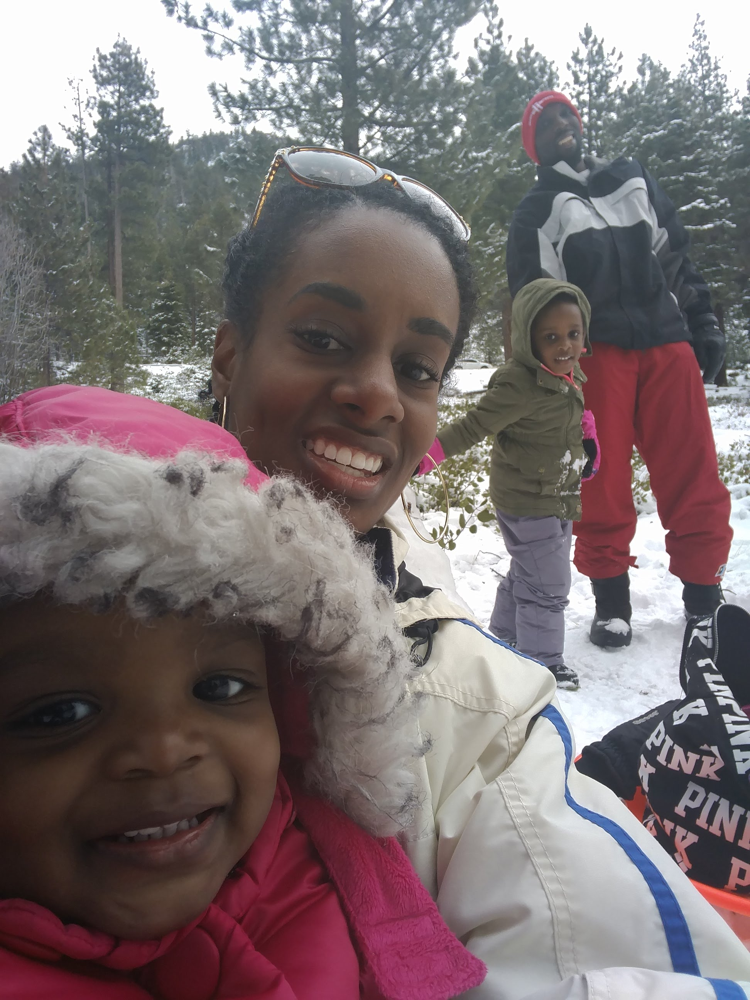

# React FUNdamentals Workshop

 

## Ben Ilegbodu

 

[@benmvp](https://twitter.com/benmvp) | [benmvp.com](/) | [@WeSabio](https://twitter.com/WeSabio) 

 

January 23, 2018  

 

## http://bit.ly/react-fun-setup

NOTES:
- Almost didn't make it to this workshop
- Who's done React before??

=====

## me.json

	

		
	

	

		<pre class="large"><code class="lang-json">
{
  "name": "Ben Ilegbodu",
  "priorities": [
    "Jesus", "family", "work"
  ],
  "location": "Pittsburg, CA",
  "work": "Eventbrite",
  "role": "Principal UI Engineer",
  "hobbies": [
    "basketball", "DIY", "movies"
  ]
}
			</code></pre>
	

NOTES:

/////

<!-- .element: style="border: 0; background: none; margin: 0; box-shadow: none;" -->

NOTES:
- Currently a Principal UI Engineer at Eventbrite
- Eventbrite is an online ticketing & events platform
- I work on the Frontend Platform team and right now we're in the midst of a transition from Backbone/Marionette to React
- Was an engineer, became a manager for about a year, returning back to dev

=====

# SETUP

 

# http://bit.ly/react-fun-setup

NOTES:
- Last chance to get setup before begin

/////

<!-- .element: style="width:50%" -->

NOTES:
- We've got a lot of people here in the workshop
- For sure as we go along you're going run into syntax bugs or other reason your app isn't working
- We've only got limited time, so I won't be able to stop and debug
- The workshop is setup so that there are **Tasks** that we can live-code together and then **Exercises** that you do on your own to reinforce learning
- Going to power thru some of the exercises
- **Please ask questions though!**

/////

## Agenda

1. [JSX](https://github.com/benmvp/react-workshop/blob/master/01-jsx/)
1. [Components](https://github.com/benmvp/react-workshop/blob/master/02-components/)
1. [Lists](https://github.com/benmvp/react-workshop/blob/master/03-lists/)
1. [Email View](https://github.com/benmvp/react-workshop/blob/master/04-email-view/)
1. [Email Form](https://github.com/benmvp/react-workshop/blob/master/05-email-form/)
1. [Submit email form](https://github.com/benmvp/react-workshop/blob/master/06-submit-email-form/)
1. [Delete email](https://github.com/benmvp/react-workshop/blob/master/07-delete-email/)
1. [Interacting with APIs](https://github.com/benmvp/react-workshop/blob/master/08-api/)

NOTES:
- Likely only gonna make it to Step 4
- That's ok, because that's the bare minimum you need to know to build interactivity in React apps
- Everything is just layers on top of the foundation
- I'm really hoping we'll get to Step 6 because forms have some uniqueness
- If we somehow made it to Stpe 8, I'd be seriously amazed
- There are actually more steps in the Github workshop which you can do on your own afterwards

/////

# Follow along

### --or--

# Code along

NOTES:
- There are many different ways that people learn
- I actually learn best with written tutorials because I can go at my own pace and follow links
- Live workshops like these help me because I can ask questions and here explanations
- I'm going to live code building a fake email app and explain React as I go
- I will go slowly enough that you can code alogn with me; some people like to do that
- But in order to cover what we need to cover, I'm going to move w/ pace so it _may_ be hard to type & grasp
- Alternatively you can just watch and follow along
- The nice thing is that you can switch back and forth because you have the opportunity to start from any given step

/////

# Questions?

NOTES:
Any questions so far?

=====

# DEMO

<!-- .element: style="width:65%" -->

/////

## Diagram Component Hierarchy

<!-- .element: style="width:65%" -->

=====

# Let's get started!

=====

# More functionality

- Redux
- Testing
- Routing
- Animation
- Form validation
- Server rendering

=====

<!-- .element: style="width: 50%" -->

## Ben Ilegbodu

[benmvp.com](/) | [@benmvp](https://twitter.com/benmvp) | [ben@benmvp.com](mailto:ben@benmvp.com)  
[github/benmvp](https://github.com/benmvp)
  

Ask me anything! [benmvp.com/ama](http://www.benmvp.com/ama/)

NOTES:
- So that's it!
- Slides are available on Twitter and Blog
- Ask questions on Twitter, via email or AMA!
- Better yet, just come up to me during the breaks - it can be awkward or cool, it doesn't matter
- Just not awkward in the bathroom; that's off limits
- And don't let me know you're a Jazz fan
- Thanks!
