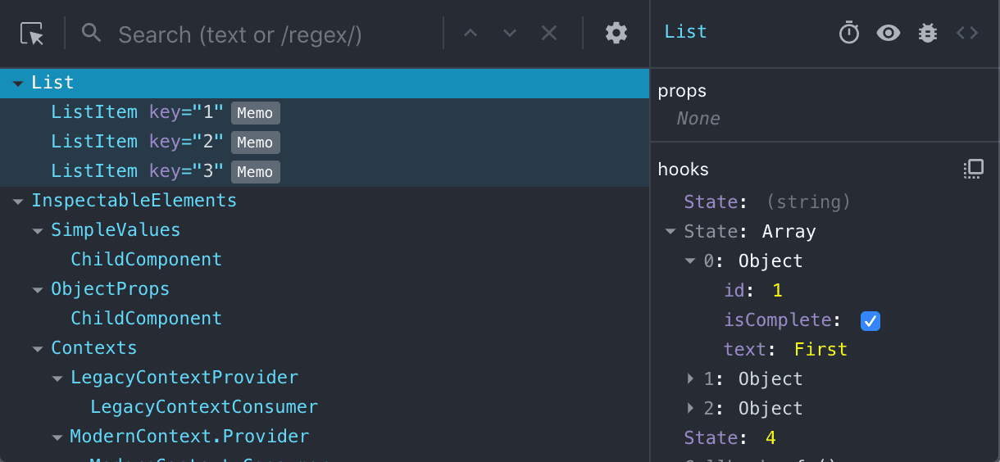
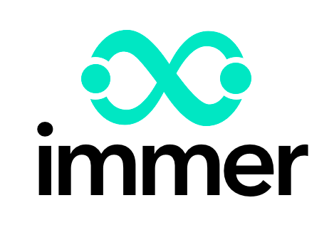

<!-- .slide: data-background="url(../../img/nav-react/james-thornton-741535-sea-anemone-unsplash.jpg) no-repeat center" data-background-size="cover" -->

	

  <h1>Navigating the React Ecosystem</h1>

   

  <h2>Ben Ilegbodu</h2>

   

  
[@benmvp](https://twitter.com/benmvp) | [benmvp.com](/) | [#AllThingsOpen](https://twitter.com/hashtag/AllThingsOpen)

   

  
October 14, 2019

  

NOTES:
**RESTART THE TIMER!!!!**

- If you're new to React you might hear that on top of learning React
  * You need to know Redux, css-in-js, server-side rendering, etc.
  * All at the same time
  * It can be so overwhelming
- React is still just a UI library
  * Need to pick libraries for fetching data, managing, data, etc. for full framework
  * How can you pick the right thing, if you've never used it before?
- So I want to walk through the different libs in the React ecosystem
  * 1/ Provide my opinion of which category of libs you should prioritize first
  * 2/ I'll also try to give a list of options for each category and my preference
- For those of you who have been doing React for a while
  * Hopefully there will be a thing or two that'll be new for you
  * If not, you can use the info I provide when your coworkers ask you why you picked a lib
  * Have a better argument than just "Because... I liked it?"

=====
<!-- .slide: data-background="url(../../img/nav-react/craig-lovelidge-362228-yellow-fish-unsplash.jpg) no-repeat center" data-background-size="cover" -->

  

    <h1>React</h1>
  

NOTES:
- Before we jump in the ecosystem
  * Lemme quickly chat about React first

/////
<!-- .slide: data-background="url(../../img/nav-react/craig-lovelidge-362228-yellow-fish-unsplash.jpg) no-repeat center" data-background-size="cover" -->

  

    

      
      

        <h2><a href="https://egghead.io/courses/advanced-react-component-patterns">Component patterns</a></h2>
        <h2><a href="https://reactjs.org/docs/error-boundaries.html">Error boundaries</a> 16</h2>
        <h2><a href="https://reactjs.org/docs/optimizing-performance.html#profiling-components-with-the-chrome-performance-tab">Performance</a> 16.5</h2>
        <h2><a href="https://reactjs.org/docs/fragments.html">Fragments</a> 16.2</h2>
        <h2><a href="https://reactjs.org/docs/code-splitting.html#reactlazy">Suspense</a> 16.6</h2>
        <h2><a href="https://reactjs.org/docs/hooks-intro.html">Hooks</a>🔥 16.8</h2>
        <h2><a href="https://reactjs.org/docs/context.html">Context</a> 16.3</h2>
      

    

  

NOTES:
- For those just starting out, learn React and learn it _really_ well
  * Sounds like an obvious statement
  * But it's important to focus on this first
  * Learn how to maintain state properly & leverage reconciler (aka "virtual DOM")
  * If you're coming from MVC model, one-way data flow can be counter-intuitive
- After the basics, keep up with the latest features...
  * React continues to evolve
- Advanced component patterns
  * Presentational vs. container components
  * Sharing component logic with higher-order components / render props / hooks
- Implementing error boundaries (v16)
- Using Fragments (v16.2) & Context API (v16.3)
- We can monitor and optimize performance (v16.5)
- Leveraging new Suspense system with auto-code splitting (v16.6)
- And then there are hooks that landed in v16.8 back in February

/////
<!-- .slide: data-background="url(../../img/nav-react/craig-lovelidge-362228-yellow-fish-unsplash.jpg) no-repeat center" data-background-size="cover" -->

  

    <h2>Interactivity in React (classes)</h2>

    <pre class="large"><code class="lang-javascript">class Incrementer extends React.Component {
  state = {val: 0}

  _handleClick = () => {
    this.setState((state) => ({val: state.val + 1}))
  }
  render() {
    return (
      

        &lt;input defaultValue={this.state.val} />
        &lt;button onClick={this._handleClick}>+&lt;/button>
      

    )
  }
}</code></pre>

    

    

    

    

    

  

  <input type="text" class="valueBox" value="0" size="1" style="font-size: 2em;text-align: center" />
  <button class="btnUp" style="font-size: 2em" onclick="$('.valueBox').val(+$('.valueBox').val() + 1)">&nbsp;&nbsp;+&nbsp;&nbsp;</button>

NOTES:
- Simplest example of interactivity in React
  * First using "legacy" classes
- _Play around with the counter_
- **ONE:** Initialize the `state` to have `value` which starts off at `0`
- **TWO:** Render out the UI, specifically the `<input>` with the `state`
  * Initial value is `0` cuz that's the value of `this.state.value`
- **THREE:** Click the button which calls `_handleClick` handler
- **FOUR:** Call `setState()` which updates `state` to be previous value `+ 1`
- **FIVE:** As a result, `render()` is called again
  * New value is back in input field
  * Updating state causes an optimized re-render via the reconciler (aka "Virtual DOM")
  * Even though it looks like we would re-render the entire UI, only the part that changes updates the DOM
- This is the cyclical, one-way data flow

/////

<!-- .slide: data-background="url(../../img/nav-react/craig-lovelidge-362228-yellow-fish-unsplash.jpg) no-repeat center" data-background-size="cover" -->

  

    <h2>Interactivity in React (hooks)</h2>

    <pre class="large"><code class="lang-javascript">import React, {useState} from 'react';

const Incrementer = () => {
  const [val, setVal] = useState(0)
  const _handleClick = () => { setVal(val + 1) }

  return (
    

      &lt;input defaultValue={val} />
      &lt;button onClick={_handleClick}>+&lt;/button>
    

  )
}</code></pre>

    

    

    

    

    

    

    

  

  <input type="text" class="valueBox" value="0" size="1" style="font-size: 2em;text-align: center" />
  <button class="btnUp" style="font-size: 2em" onclick="$('.valueBox').val(+$('.valueBox').val() + 1)">&nbsp;&nbsp;+&nbsp;&nbsp;</button>

NOTES:
- With hooks we can now use a functional component to maintain state!
  * There's no real reason to use classes anymore
  * Same one-way data flow, but now with functions
- **ONE:** React provides the `useState` hook for maintaining component state
- **TWO:** We then use it to declare our state value with the initial value `0`
  * We receive back the state value as a variable and a function to update it
- **THREE:** Render out the same UI
  * Value comes from local variable `val` instead of `this.state.val`
- **FOUR:** Click the button which calls `_handleClick` handler
- **FIVE:** `_handleClick` is a closure defined within functional component
  * Call `setVal()` updater function given to us by `useState`
  * We update `val` to be current `val + 1`
- **SIX:** As a result, functional component is magically rendered again
  * `useState` gives the new `val` of `1` & same state updater function
  * That's why it's called `useState` instead of `createState`
  * The state is only created the first time
- **SEVEN:** We render that new value back into the UI
  * Cycle continues

/////
<!-- .slide: data-background="url(../../img/nav-react/craig-lovelidge-362228-yellow-fish-unsplash.jpg) no-repeat center" data-background-size="cover" -->

  

    

      
       
      Justin Reock
    

    <h2>Intro to React</h2>

    
Today @ 4:15p (306A)

  

NOTES:
- That was a quick 2-minute overview...
- If you wanna know more of the basics of building React components
  * **Justin** is giving an intro to React later this afternoon
- UI / UX / Design track

/////
<!-- .slide: data-background="url(../../img/nav-react/craig-lovelidge-362228-yellow-fish-unsplash.jpg) no-repeat center" data-background-size="cover" -->

  

    

      
       
      Anthony Garritano
    

    <h2>React Under the Hood</h2>

    
Today @ 4:15p (306C)

  

NOTES:
- At this same time in the FE track
- If you wanna know more about how React's efficient rendering engine works
- **Anthony** is explaining the Virtual "DOM", reconciliation and more

=====

<!-- .slide: data-background="url(../../img/giphy/stand-up.gif) no-repeat center" data-background-size="cover" -->

  

    <h1 style="font-size: 5em">Stand Up!</h1>
  

NOTES:
- Before we continue can I get everyone to stand up?

/////
<!-- .slide: data-background="#000 url(../../img/family/ilegbodu-family-photo-2019.jpg) no-repeat center" data-background-size="cover" -->

NOTES:
- My name is Ben Ilegbodu
- Christian, Husband, Father
- _Family introductions_
- We live in Pittsburg, CA (far east bay)
- Also a Google Developer Expert & Microsoft MVP in Web Technologies

/////

<!-- .element: class="plain" style="width: 75%" -->

NOTES:
- So in exactly 2 weeks I'll be starting a new role at Stitch Fix
  * As a Frontend Architect
  * Which I'm super excited about
- Stitch Fix is a fashion retailer
  * Combines technology & data science
  * With an actual human stylist
  * To deliver a personalized shopping experience

/////

<!-- .element: class="plain" style="width: 85%" -->

NOTES:
- But technically I'm still employed by Eventbrite
  * So this is a little awkward
  * But I've already communicated I'm leaving so we're good there
- I'm a Principal Frontend Engineer based in San Francisco
- We're an online Events & Ticketing platform
  * Should be well aware since you purchased your ticket with us
- We've been using React since early 2016
  * Migrated from Backbone and have never looked back
  * This talk came from having to set up our React "framework"

=====
<!-- .slide: data-background="url(../../img/nav-react/james-thornton-741535-sea-anemone-unsplash.jpg) no-repeat center" data-background-size="cover" -->

NOTES:
- Ok, enough about me
- Let's talk about the React ecosystem
- Going to be *a lot* of stuff covered
  * Not going to be able to teach you how to use any given lib
  * Instead my goal is to expose you to the libs so you can investigate
  * Will also give my preferences
- Tweeted a link to slides cuz there will be **a lot** of resources

=====
<!-- .slide: data-background="url(../../img/nav-react/erin-simmons-382355-sea-life-unsplash.jpg) no-repeat center" data-background-size="cover" -->

  

    <h1>1. Tooling</h1>
  

NOTES:
- Probably the biggest complaint w/ React isn't React itself
  * But the tooling needed to get set up
- I think the problem is that there's so much choice in this area
  * You need to know how the tools work before you could get up and running

/////
<!-- .slide: data-background="url(../../img/nav-react/erin-simmons-382355-sea-life-unsplash.jpg) no-repeat center" data-background-size="cover" -->

  

    <h2>React Dev Tools</h2>
    
Help debug React props & state

    

    
Available for <a href="https://chrome.google.com/webstore/detail/react-developer-tools/fmkadmapgofadopljbjfkapdkoienihi?hl=en" target="_blank">Chrome</a> and <a href="https://addons.mozilla.org/en-US/firefox/addon/react-devtools/" target="_blank">Firefox</a>

    
(Performance debugging in v16.5)

  

NOTES:
- Let's start easy
- The React Dev Tools are super helpful in debugging React components
- You browse the React component tree just like the DOM tree
  * And you can look at the component props as well as the state
  * Keeps improving to provide more debugging capability
  * Just recently with the release of React 16.5 enabling performance debugging
- Available for Chrome, Firefox, and now Chromium-based Edge

/////
<!-- .slide: data-background="url(../../img/nav-react/erin-simmons-382355-sea-life-unsplash.jpg) no-repeat center" data-background-size="cover" -->

  

    <h2>Bundlers</h2>
    
Help gather dependencies, transpile ES6+, etc.

    

      

        
        <a href="https://webpack.github.io/" target="_blank">Webpack</a>
      

      

        
        <a href="http://rollupjs.org/" target="_blank">Rollup</a>
      

      

        
        <a href="https://parceljs.org/" target="_blank">Parcel</a>
      

      

        
        <a href="http://prepack.io/" target="_blank">Prepack*</a>
      

      

        
        <a href="https://www.pika.dev/blog/pika-web-a-future-without-webpack/" target="_blank"><code>@pika/web</code></a>
      

    

  

NOTES:
- If you're building out your own custom stack there's a lot to think about

- First you have to figure out which bundling system you'll use
  * This is space has a lot of players
- **Webpack** is the prevailing bundler right now
  * But you have to add loaders and other configurations to make it do what you need
  * It has its own huge ecosystem
- **Rollup** works specifically with EcmaScript modules
  * Introduced the concept of "tree-shaking" feature that results in less generated code
  * But instead of bundling the code into one file, it transpiles individual files
  * Good for libraries
- **Parcel** is a newer tool that boasts blazing fast build times
  * It also is "zero-config" so it has a lot of functionality out of the box
- **Prepack** is yet another new tool for making JS code run faster
  * From Facebook
  * Computations that can be done at compile-time instead of run-time get eliminated
  * Still in early DEV stage so not quite ready for production
  * It's been that way for a while now
- **`@pika/web`** is relatively new
  * Installs modern npm dependencies in a way that lets them run natively in the browser
  * **Without** a bundler like webpack
  * Even if they have dependencies themselves
  * Like Rollup, works with ESM packages
- I'd say go with Webpack
  * It's still constantly evolving
  * Webpack has "tree-shaking" too
  * There's a whole ecosystem around it
- It's at this step where the "JavaScript fatigue" really kicks in
  * Your typical JS developer doesn't want to or know how to configure these bundlers
  * Just work please

/////
<!-- .slide: data-background="url(../../img/nav-react/erin-simmons-382355-sea-life-unsplash.jpg) no-repeat center" data-background-size="cover" -->

  

    

      
       
      Drew Powers
    

    <h2>@pika/web and a Brief History of ES Modules</h2>

    
Tomorrow @ 4:15p (306C)

  

NOTES:
- I'm pretty intrigued by `@pika/web`
- **Drew** is going to be talking about it
  * And the ES modules it depends on
- Tomorrow afternoon in the FE track

/////
<!-- .slide: data-background="url(../../img/nav-react/erin-simmons-382355-sea-life-unsplash.jpg) no-repeat center" data-background-size="cover" -->

  

    <h2>Task runners</h2>
    
Help execute shell commands, generate files, etc.

    

      

        
        <a href="http://gruntjs.com/" target="_blank">Grunt</a>
      

      

        
        <a href="http://gulpjs.com/" target="_blank">Gulp</a>
      

      

        
        <a href="https://docs.npmjs.com/misc/scripts" target="_blank">NPM</a>
      

    

  

NOTES:
- Continuing on we have task runners
  * Build files, run shell scripts, etc.
- **Grunt** was the original & dominant
  * Then because Grunt files became so unmanageable
- **Gulp** approached it with streams in a functional way
  * But still can have large Gulp files
- But with "building fatigue" and the fact that webpack could do so much of this for us
- **NPM scripts** have lately become the most popular
  * Essentially wrappers around command line calls
- If things are simple, use npm scripts.
- If things are complex, use Gulp since it's functional

/////
<!-- .slide: data-background="url(../../img/nav-react/erin-simmons-382355-sea-life-unsplash.jpg) no-repeat center" data-background-size="cover" -->

  

    <h2>Static Analyzers</h2>
    
Help catch errors in written code before runtime

    

      

        
        <a href="http://eslint.org/" target="_blank">ESLint</a>
      

      

        
        <a href="https://flowtype.org/" target="_blank">Flow</a>
      

	    

        
		    <a href="https://www.typescriptlang.org/" target="_blank">TypeScript</a>
      

    

  

NOTES:
- The static analyzers help you catch errors in your code before it ever executes
  * Can add these to your editor to get feedback in realtime
- **ESLint:** originally just for stylistic code preferences
  * Can catch common errors, including in JSX
- Flow & Typescript are both static _type_ checkers
- **Flow** is exclusively for type checking
- **TypeScript** is a superset of JavaScript that includes type checking plus future JavaScript:
  * It introduced classes before they were in ES2015
  * It has interfaces and enums which JS does not
- 2018 seemed to be the "Year of TypeScript"
  * Excitement continues to grow now in 2019
  * The industry has seemed to have selected TypeScript
  * The integration with VSCode is 👍🏾

/////
<!-- .slide: data-background="url(../../img/nav-react/erin-simmons-382355-sea-life-unsplash.jpg) no-repeat center" data-background-size="cover" -->

  

    <h2>Create React App</h2>
    
Create React apps with no build configuration

    <pre class="large" style="margin:5% 0"><code>$> npx create-react-app ato

$> cd ato

$> yarn start

### For production

$> yarn build</code></pre>

    
<a href="https://reactjs.org/blog/2018/10/01/create-react-app-v2.html" target="_blank">CRA 2.0</a>: Babel 7, Webpack 4, TypeScript, CSS Modules, etc.

  

NOTES:
- So that was everything you need to set up your React app!
  * And I didn't even go into a bunch of nitty gritty details
- This had been the biggest complaint about React
  * How to get started

-----

- If you are just getting started or don't need highly custom stack, you can use Create React App
  * Created by the React team
  * Allows you to bootstrap super quick w/ zero-config
  * Can still configure it a great deal
  * And if you need to config something it doesn't support you can "eject"
- Creates an optimized bundle you can ship to production
- Much better than the (bloated) boilerplates / starter-kits
- v2 shipped a year ago with lots of updated infra

/////
<!-- .slide: data-background="url(../../img/nav-react/erin-simmons-382355-sea-life-unsplash.jpg) no-repeat center" data-background-size="cover" -->

  

    <h2>Tooling resources</h2>

    <ul>
      <li><a href="https://www.youtube.com/watch?v=QFKZmBMgvus" target="_blank">What's New with React Dev Tools 4</a> ⏯️</li>
      <li><a href="https://github.com/joshwcomeau/guppy" target="_blank">Guppy</a></li>
      <li><a href="https://github.com/zkat/npx" target="_blank">`npx`</a></li>
      <li><a href="https://github.com/creationix/nvm" target="_blank">Node Version Manager</a></li>
      <li><a href="https://www.youtube.com/watch?v=-wBNV7i_b9o" target="_blank">TypeScript & React</a> ⏯️</li>
      <li><a href="https://github.com/sindresorhus/awesome-npm" target="_blank">Awesome npm resources and tips</a></li>
      <li><a href="https://github.com/jamiebuilds/scritch" target="_blank">`scritch`</a></li>
      <li><a href="https://blog.risingstack.com/yarn-vs-npm-node-js-package-managers/" target="_blank">Yarn vs NPM</a></li>
      <li><a href="https://webpack.js.org/configuration/dev-server/" target="_blank">`webpack-dev-server`</a></li>
      <li><a href="https://flow.org/en/docs/react/" target="_blank">Flow + React</a></li>
    </ul>
  

NOTES:
- Here are some miscellaneous resources regarding all the tools we talked about
- Guppy is a GUI for managing React app infra and running tasks

=====
<!-- .slide: data-background="url(../../img/nav-react/shaun-low-498556-blue-gray-coral-unsplash.jpg) no-repeat center" data-background-size="cover" -->

  

    <h1>2. Styling</h1>
  

NOTES:
- Now that we can build an app, we need to make it look good
  * Because visuals are just as important as interaction
- There are _at least_ **5 ways** to tackle the styling problem

/////
<!-- .slide: data-background="url(../../img/nav-react/shaun-low-498556-blue-gray-coral-unsplash.jpg) no-repeat center" data-background-size="cover" -->

  

    <h2>Global CSS</h2>
    
Use CSS that exists on the page outside of React

    <pre class="large"><code class="lang-javascript">const Card = ({title, imageUrl, message}) => (
  &lt;div className="card">
    &lt;h2 className="card\__title">{title}&lt;/h2>
    &lt;img src={imageUrl} className="card\__image" />
    &lt;p className="card\__message">{message}&lt;/p>
  &lt;/div>
)</code></pre>
  

NOTES:
- You'd use the **Global CSS** option if you are transitioning to React
  * Already have your CSS being built by some other process
  * Create new React components with existing CSS classes
- Bootstrap or Foundation would fall under this as well

/////
<!-- .slide: data-background="url(../../img/nav-react/shaun-low-498556-blue-gray-coral-unsplash.jpg) no-repeat center" data-background-size="cover" -->

  

    <h2>Global CSS</h2>

    <pre class="large"><code class="lang-css">
/\* global.scss \*/

/\* lots of other styles before \*/

.card { }
.card\__title { }
.card\__image { }
.card\__message { }

/\* lots of other styles after \*/</code></pre>

  

    <a href="http://getbem.com/" target="_blank">BEM</a>,
    <a href="https://smacss.com/" target="_blank">SMACSS</a> or
    <a href="https://github.com/stubbornella/oocss/wiki">OOCSS</a> for class name-spacing
  

  

NOTES:
- You can use BEM syntax as a convention to prevent name collisions

/////
<!-- .slide: data-background="url(../../img/nav-react/shaun-low-498556-blue-gray-coral-unsplash.jpg) no-repeat center" data-background-size="cover" -->

  

    <h2>Component CSS</h2>
    
Associate React components with CSS snippet

    <pre class="large"><code class="lang-javascript">import './Card.scss'

const Card = ({title, imageUrl, message}) => (
  &lt;div className="card">
    &lt;h2 className="card\__title">{title}&lt;/h2>
    &lt;img src={imageUrl} className="card\__image" />
    &lt;p className="card\__message">{message}&lt;/p>
  &lt;/div>
)</code></pre>

    

  

NOTES:
- Next way is **Component CSS**
- Component CSS is the exact same as Global CSS
  * Except the CSS is imported by the Component
  * Instead of some external process that bundles everything
  * Therefore if the Component isn't used in the app the CSS won't be included in the bundle
- Need a bundler that can handle bundling CSS
  * Processing SASS in our case

/////
<!-- .slide: data-background="url(../../img/nav-react/shaun-low-498556-blue-gray-coral-unsplash.jpg) no-repeat center" data-background-size="cover" -->

  

    <h2>Component CSS</h2>
    
Associate React components with CSS snippet

    <pre class="large"><code class="lang-css">/\* Card.scss \*/

.card { }
.card\__title { }
.card\__image { }
.card\__message { }</code></pre>

    
(name-spacing still needed)

  

NOTES:
- Same BEM style CSS class names convention
  * Eventually it'll all be merged into a bundle
  * Without the convention is broken you could still have collisions
- Hopefully your global CSS was already modularized
  * So this transition shouldn't be tough

/////
<!-- .slide: data-background="url(../../img/nav-react/shaun-low-498556-blue-gray-coral-unsplash.jpg) no-repeat center" data-background-size="cover" -->

  

    <h2>CSS Modules</h2>
    
Automatically scope CSS class names to the component

    <pre class="large"><code class="lang-javascript">import css from './Card.scss'

const Card = ({title, imageUrl, message}) => (
  &lt;div className={css.root}>
    &lt;h2 className={css.title}>{title}&lt;/h2>
    &lt;img src={imageUrl} className={css.image} />
    &lt;p className={css.message}>{message}&lt;/p>
  &lt;/div>
)</code></pre>

    

  

NOTES:
- 3rd option is **CSS Modules**
  * There's lots to like about CSS Modules
- CSS Modules are similar to Component CSS
  * except the import of the CSS will return an object lookup with a generated class name

/////
<!-- .slide: data-background="url(../../img/nav-react/shaun-low-498556-blue-gray-coral-unsplash.jpg) no-repeat center" data-background-size="cover" -->

  

    <h2>CSS Modules</h2>
    
Automatically scope CSS class names to the component

    <pre class="large"><code class="lang-css">/\* Card.scss (source) \*/

.root { }
.title { }
.image { }
.message { }</code></pre>
  

NOTES:
- No need for naming conventions
- Just name the classes what they are w/o worry about collision

/////
<!-- .slide: data-background="url(../../img/nav-react/shaun-low-498556-blue-gray-coral-unsplash.jpg) no-repeat center" data-background-size="cover" -->

  

    <h2>CSS Modules</h2>
    
Automatically scope CSS class names to the component

    <pre class="large"><code class="lang-css">/\* Card.css (generated) \*/

.Card\__root\__\_d74hQ { }
.Card\__title\__\_37fhU { }
.Card\__image\__\_ndh2e { }
.Card\__message\__\_84QQj { }</code></pre>
  

NOTES:
- The generated CSS classes will be unique so there's no way they can collide
- These class names are the same one passed into the object lookup
- Similarly, you'll need a bundler that can process CSS modules
  * There are webpack loaders

/////
<!-- .slide: data-background="url(../../img/nav-react/shaun-low-498556-blue-gray-coral-unsplash.jpg) no-repeat center" data-background-size="cover" -->

  

    <h2>Inline styles</h2>
    
Forgo CSS classes in favor of inline styles

    <pre class="large"><code class="lang-javascript">import styles from './Card.styles'

const Card = ({title, imageUrl, message}) => (
  &lt;div style={styles.root}>
    &lt;h2 style={styles.title}>{title}&lt;/h2>
    &lt;img src={imageUrl} style={styles.image} />
    &lt;p style={styles.message}>{message}&lt;/p>
  &lt;/div>
)</code></pre>

    

  

NOTES:
- So far we've had global CSS, component CSS & CSS modules
  * They all leverage CSS: cascading style sheets

-----

- The folks who choose the **Inline Styles** option are in the "screw CSS" camp
  * Tired of dealing with specificity wars, unexpected cascade, etc.
  * Were adding `!important` everywhere
  * Having lots of dynamic styles which can be challenging with CSS
- There was a big huge push for this early in React when React Native came out
  * it doesn't support CSS, only inline styles
  * If you want to share components across React & React Native you can't use CSS

/////
<!-- .slide: data-background="url(../../img/nav-react/shaun-low-498556-blue-gray-coral-unsplash.jpg) no-repeat center" data-background-size="cover" -->

  

    <h2>Inline styles</h2>
    
Forgo CSS classes in favor of inline styles

    <pre class="large"><code class="lang-javascript">// Card.styles.js
export default {
  root: {
    display: 'flex',
    flexDirection: 'row'
  },
  title: {
    fontWeight: 'bold',
    fontSize: '2em'
  },
  ...
}</code></pre>
  

NOTES:
- Inline styles use `camelCase` version of the property names
  * instead of `kebab-case`
  * this is the form of the JavaScript CSS DOM API
- Problem with inline styles in React...
  * it only supports what inline styles support
  * No media queries, pseudo-selectors, keyframe animations, etc

/////
<!-- .slide: data-background="url(../../img/nav-react/shaun-low-498556-blue-gray-coral-unsplash.jpg) no-repeat center" data-background-size="cover" -->

  

    <h2>`css-in-js`</h2>
    
Define your CSS using JavaScript

    

      

        
        <a href="https://emotion.sh/" target="_blank">Emotion</a>
      

      

        
        <a href="http://cssinjs.org/react-jss/" target="_blank">JSS</a>
      

      

        
        <a href="https://formidable.com/open-source/radium/" target="_blank">Radium</a>
      

      

        
        <a href="http://styled-components.com/" target="_blank">styled components</a>
      

    

  

NOTES:
- New libraries have popped up to try to solve that issue in various clever ways
  * Most take what's defined as inline styles but map to unique CSS classes
  * Get the best of both worlds: JavaScript-scoped styling + full CSS functionality
- Emotion is the newest and super popular
  * It's taken learnings from all the others to create a flexible API

-----

- So if you're starting out, you may wanna start with Component CSS
  * Because `css-in-js` libs are yet another API to learn
  * But as you start bumping up against problems w/ CSS
  * Try out `css-in-js` solution like Emotion
  * And once you get comfortable with a `css-in-js` library then you can use it all the time

/////
<!-- .slide: data-background="url(../../img/nav-react/shaun-low-498556-blue-gray-coral-unsplash.jpg) no-repeat center" data-background-size="cover" -->

  

    <h2>Emotion</h2>

    <pre class="large"><code class="lang-javascript">import styled from '@emotion/styled'

const Root = styled.div({display: 'flex'})
const Title = styled.h2({fontWeight: 'bold'})
const Image = styled.img({ ... })
const Message = styled.p({ ... })

const Card = ({title, imageUrl, message}) => (
  &lt;Root>
    &lt;Title>{title}&lt;/Title>
    &lt;Image src={imageUrl} />
    &lt;Message>{message}&lt;/Message>
  &lt;/Root>
)</code></pre>
  

NOTES:
- Quick look at how Emotion works
- Create a custom elements/components with the styling you want
  * The `render()` ends up looking very semantic
- Supports all CSS syntax including media queries, keyframe animations & pseudo-selectors!
  * There's also theming support as well
- There's another mode where you can specify a `css` prop and just pass styling to the object
  * No need to create these "styled components"
  * I prefer that API

/////
<!-- .slide: data-background="url(../../img/nav-react/shaun-low-498556-blue-gray-coral-unsplash.jpg) no-repeat center" data-background-size="cover" -->

  

    <h2>Emotion</h2>
    
Auto-generated class names

    <pre class="large"><code class="lang-html">

  <h2 class="css-1un7ufz">Card Title</h2>
  
  
Card message

</code></pre>
  

NOTES:
- Here's what the generated markup will look like

/////
<!-- .slide: data-background="url(../../img/nav-react/shaun-low-498556-blue-gray-coral-unsplash.jpg) no-repeat center" data-background-size="cover" -->

  

    <h2>Styling Resources</h2>

    <ul>
      <li><a href="https://medium.com/seek-blog/a-unified-styling-language-d0c208de2660" target="_blank">_A Unified Styling Language_</a></li>
      <li><a href="https://github.com/gajus/react-css-modules" target="_blank">React CSS Modules</a></li>
      <li><a href="https://github.com/nairinarinyan/react-scoped-styles" target="_blank">`react-scoped-styles`</a></li>
      <li><a href="http://www.material-ui.com/" target="_blank">Material UI</a></li>
      <li><a href="https://react.foundation/" target="_blank">React + Foundation</a></li>
      <li><a href="https://react-bootstrap.github.io/" target="_blank">React-Bootstrap</a></li>
      <li><a href="https://github.com/JedWatson/classnames" target="_blank">`classnames`</a></li>
      <li><a href="https://polished.js.org/" target="_blank">polished</a></li>
      <li><a href="http://postcss.org/" target="_blank">PostCSS</a></li>
    </ul>
  

NOTES:
- Here are some miscellaneous resources regarding styling
- `react-scoped-styles` is similar to CSS Modules but you don't have to import the CSS module
  * Works on file naming convention

=====
<!-- .slide: data-background="url(../../img/nav-react/ishan-seefromthesky-798062-school-fish-unsplash.jpg) no-repeat center" data-background-size="cover" -->

  

    <h1>3. Single-Page Apps</h1>
  

NOTES:
- Moving along to libraries needed for Single Page Apps
- Two main subcategories

/////
<!-- .slide: data-background="url(../../img/nav-react/ishan-seefromthesky-798062-school-fish-unsplash.jpg) no-repeat center" data-background-size="cover" -->

  

    <h2>Data fetching</h2>
    
Retrieve data to populate your app

   

      

        <a href="https://developer.mozilla.org/en-US/docs/Web/API/Fetch_API/Using_Fetch" target="_blank">Fetch API</a>
      

      

        <a href="https://github.com/axios/axios" target="_blank">axios</a>
      

    

  

NOTES:
- Your favorite batteries-included JS framework (like Angular) has a mechanism for making AJAX requests
  * React does not come with one because it's just the UI side
  * So the second you need to make an AJAX request, you need to figure out how to do it
- You could use jQuery, but that could lead you to to using it improperly with React
- Two main options for data fetching: native browser Fetch API & `axios` library
- **Fetch API**
  * Native to the browser
  * Promise-based
  * Need to polyfill for unsupported browsers
- **`axios`**
  * Existed before Fetch API
  * A way to do requests w/o jQuery
  * Also promised-based
  * Has IE11 support
  * Also includes request aliases like `get`, `post`, `delete`, etc.
  * Supports cancelling requests too
- Actually never used `axios`, always used Fetch API

/////
<!-- .slide: data-background="url(../../img/nav-react/ishan-seefromthesky-798062-school-fish-unsplash.jpg) no-repeat center" data-background-size="cover" -->

  

    <h2>Fetch API</h2>
    
Handle AJAX natively

    <pre class="large"><code class="lang-javascript">import React, {useState, useEffect} from 'react';

const Posts = () => {
  const [posts, setPosts] = useState([])

  useEffect(() => {
    window.fetch('api.benmvp.com', {method: 'GET'})
      .then((response) => {
        setPosts(response.posts)
      })
  })
  // render UI</code></pre>

    

  

NOTES:
- Example using the native fetch API
  * There's a polyfill for older browsers
- There's also an implementation for Node called `node-fetch`
  * `isomorphic-fetch` so your code can run in both environments
- `useEffect` which basically replaces `componentDidMount` & `componentDidUpdate` lifecycle methods

/////
<!-- .slide: data-background="url(../../img/nav-react/ishan-seefromthesky-798062-school-fish-unsplash.jpg) no-repeat center" data-background-size="cover" -->

  

    <h2>Fetch Resources</h2>

    <ul>
      <li><a href="https://developer.mozilla.org/en-US/docs/Web/API/Fetch_API/Using_Fetch" target="_blank">Using Fetch</a></li>
      <li><a href="http://www.benmvp.com/learning-es6-promises/" target="_blank">Learning ES6: Promises</a></li>
      <li><a href="https://github.com/github/fetch" target="_blank">`window.fetch` polyfill</a></li>
      <li><a href="https://reactjs.org/docs/hooks-effect.html#tip-optimizing-performance-by-skipping-effects" target="_blank">Using the Effect Hook</a></li>
      <li><a href="https://github.com/benmvp/react-workshop/blob/master/04-fetch/" target="_blank">React Fundamentals Workshop - Fetch</a></li>
    </ul>
  

NOTES:

/////
<!-- .slide: data-background="url(../../img/nav-react/ishan-seefromthesky-798062-school-fish-unsplash.jpg) no-repeat center" data-background-size="cover" -->

  

    <h2>Routing</h2>
    
Keep your UI in sync with the URL

   

      

        
        <a href="https://reacttraining.com/react-router/" target="_blank">React Router</a>
      

      

        
        <a href="https://reach.tech/router" target="_blank">Reach Router</a>
      

    

  

NOTES:
- Then there's routing to keep your UI in sync w/ the URL
- **React Router** is the main router
  * v4 was a complete API change which had drawbacks
  * Most prevalent in use
- **Reach Router** was a complete rethink
  * Intended to be accessible by default
  * Manages focus of your app on route transitions
  * Has ambiguous path ranking algorithm
  * Relative links, "not found" default components, etc.
- They are going to merge together  (hooks-based API)
  * Into `react-router`, but the API will be similar to `@reach/router`
  * If you have a few routes use `@reach/router` (easier to migrate in a commit)
  * If you have lots of routes use `react-router` (fully backwards compatible w/ iterative migration)

/////
<!-- .slide: data-background="url(../../img/nav-react/ishan-seefromthesky-798062-school-fish-unsplash.jpg) no-repeat center" data-background-size="cover" -->

  

    <h2>Reach Router</h2>

    <pre><code class="lang-javascript">import {Router, Link} from '@reach/router'

const Home = () => (
  &lt;div>
    &lt;h1>Home&lt;/h1>
    &lt;nav>
      &lt;Link to="/">Home&lt;/Link> |
      &lt;Link to="dashboard">Dashboard&lt;/Link>
    &lt;/nav>
  &lt;/div>
)
const Dash = () => (&lt;div>Dash&lt;/div>)
const App = () => (
  &lt;Router>
    &lt;Home path="/" />
    &lt;Dash path="dashboard" />
  &lt;/Router>
)</code></pre>
    

  

NOTES:
- Can set up your routes with the same JSX syntax
  * Within the `<Router>` just have your normal child components
  * Just add special `path` prop (similar to special `key` prop)
  * `<Home>` is a component we created with `path` prop
- Then you can `<Link>` to different sections using relative paths too

=====
<!-- .slide: data-background="url(../../img/nav-react/tomoe-steineck-787193-blue-coral-unsplash.jpg) no-repeat center" data-background-size="cover" -->

  

    <h1>4. Forms</h1>
  

NOTES:
- Let's be real, no one _really_ likes forms
  * Forms are not that hard
  * But forms **with validation** are definitely hard
  * And in React, it's no different
- The validation requirements are always different
  * Form level errors
  * Form element level errors
  * Synchronous validation
  * Async validation via AJAX
  * Validation that depends on the values of multiple fields
  * Errors that should show immediately (used username)
  * Errors that should wait until form submission
- React has a guide on Forms
  * But speaks mostly about how to maintain form state
  * Nothing about form validation & the complications

/////
<!-- .slide: data-background="url(../../img/nav-react/tomoe-steineck-787193-blue-coral-unsplash.jpg) no-repeat center" data-background-size="cover" -->

  

    <h2>Form state managers</h2>

    

      

        
        <a href="http://final-form.org/" target="_blank" style="display: block">Final Form</a>
      

      

        
        <a href="https://jaredpalmer.com/formik/" target="_blank" style="display: block">Formik</a>
      

      

        
        <a href="https://redux-form.com/" target="_blank">Redux Form</a>
      

    

  

NOTES:
- The original is **Redux Form**
  * But relied on having Redux (we haven't gotten to)
  * It's also a pretty big lib for simple forms
  * Kept adding on feature requests
- Erik decided to do a rebuild
  * Created **React Final Form**
  * No dependencies (Redux independent); small footprint
  * In fact there's a base `Final Form` which is framework agnostic
  * New features are added via plugins
  * React version is hooks compatible
  * Battle-proven with all of the existing features of Redux Form
  * Has 30+ examples/recipes
- While React Final Form was happening
  * Jared created **Formik**
  * Also wanted a Redux-free form implementation
  * Basically built at the same time
  * More or less feature parity
- If you've used Redux Form, React Final Form has similar API

/////

<!-- .slide: data-background="url(../../img/nav-react/tomoe-steineck-787193-blue-coral-unsplash.jpg) no-repeat center" data-background-size="cover" -->

  

    <h2>Form Resources</h2>

    <ul>
      <li><a href="https://github.com/rmolinamir/react-formalized" target="_blank">`react-formalized`</a></li>
      <li><a href="https://upmostly.com/tutorials/form-validation-using-custom-react-hooks/" target="_blank">Form Validation using Custom React Hooks</a></li>
      <li><a href="https://reactjs.org/docs/forms.html" target="_blank">Forms in React</a></li>
      <li><a href="https://github.com/benmvp/react-workshop/tree/master/src/react/05-email-form" target="_blank">React FUNdamentals Workshop - Forms</a></li>
    </ul>
  

NOTES:
- `react-formalized` is a collection of pre-styled HTML form elements

=====
<!-- .slide: data-background="url(../../img/nav-react/jong-marshes-452773-sea-turtle-unsplash.jpg) no-repeat center" data-background-size="cover" -->

  

    <h1>5. Testing</h1>
  

NOTES:
- Testing is super important for the integrity of your app
- It's funny, none of us _really_ enjoy writing tests
  * But we wish there were a lot of tests when we're refactoring
  * Like bumping packages

/////
<!-- .slide: data-background="url(../../img/nav-react/jong-marshes-452773-sea-turtle-unsplash.jpg) no-repeat center" data-background-size="cover" -->

  

    <h2>Testing Utilities</h2>

    

      

        
        <a href="https://cypress.io" target="_blank">Cypress</a>
      

      

        <a href="http://airbnb.io/enzyme" target="_blank" style="display:block">Enzyme</a>
      

      

        
        <a href="https://testing-library.com/react" target="_blank">React Testing Library</a>
      

    

  

NOTES:
- **Cypress**
  * Predominantly used for end-to-end testing
  * Runs in a browser, but isn't slow Selenium or Webdriver
  * But can also used a development platform for TDD
  * Becoming increasingly popular
- **Enzyme** is probably most common
  * Been around basically since the beginning of React
  * Has a very jQuery-like interface for inspecting & interacting w/ components
  * We use it at Eventbrite
  * Provides lots of utility methods
  * But a lot of the utilities you really shouldn't use in unit testing
  * Too easy to write tests that assume implementation details of your components
- `react-testing-library`
  * Created by Kent C. Dodds in response to Enzyme problem
  * Gaining a popularity
  * Encourages writing tests that use your components as end users use them
  * Best used as component integration tests
  * In between traditional unit tests and E2E tests
  * Wanna try it out on my next projects
- All work in your favorite test runner: Jest, Mocha + Chai, etc.

/////
<!-- .slide: data-background="url(../../img/nav-react/jong-marshes-452773-sea-turtle-unsplash.jpg) no-repeat center" data-background-size="cover" -->

  

    <h2>Jest + React Testing Library</h2>

    <pre class="large"><code class="lang-javascript">import {render, fireEvent} from '@testing-library/react'
import Button from './Button'

test('toggles active state on click', () => {
  const {getByTestId} = render(
    &lt;Button style="primary">Go&lt;/Button>
  )
  const button = getByTestId('button')

  fireEvent.click(button)

  expect(button).toHaveClass('btn--active')
})</code></pre>

    

  

NOTES:
- This is how we can unit test a component
  * In this case a reusable `<Button>` component (maybe in design system?)
- It still blows my mind that we can do this **without** a browser
- When unit testing React components, you want to test the logic in the component
  * But only via its public API
  * What it renders, and the callback handler props it calls

/////
<!-- .slide: data-background="url(../../img/nav-react/jong-marshes-452773-sea-turtle-unsplash.jpg) no-repeat center" data-background-size="cover" -->

  

    

      
       
      Gleb Bahmutov
    

    <h2>Write Blissful Tests With Cypress</h2>

    
Today @ 4:15p (Ballroom C)

  

NOTES:
- If you wanna know more about Cypress
- **Gleb**, VP of Engineering at Cypress
- Teach us how we can Drive development & increase velocity with Cypress
- Later today in this room

/////
<!-- .slide: data-background="url(../../img/nav-react/jong-marshes-452773-sea-turtle-unsplash.jpg) no-repeat center" data-background-size="cover" -->

  

    <h2>Testing Resources</h2>

    <ul>
      <li><a href="https://github.com/testing-library/jest-dom" target="_blank">`jest-dom`</a> / <a href="https://github.com/FormidableLabs/enzyme-matchers" target="_blank">`jest-enzyme`</a></li>
      <li><a href="https://kentcdodds.com/blog/making-your-ui-tests-resilient-to-change" target="_blank"><em>Making your UI tests resilient to change</em></a></li>
      <li><a href="https://www.youtube.com/watch?v=5XQOK0v_YRE" target="_blank">Intro to Cypress</a> ⏯️</li>
      <li><a href="https://medium.com/@nitinpatel_20236/unit-testing-custom-react-hooks-caa86f58510" target="_blank"><em>Unit Testing Custom React Hooks</em></a></li>
      <li><a href="https://github.com/Raathigesh/majestic/" target="_blank">Majestic</li>
      <li><a href="https://github.com/benmvp/react-workshop/tree/master/src/testing" target="_blank">React Testing FUNdamentals Workshop</a></li>
      <li><a href="https://github.com/eventbrite/javascript/blob/master/react/testing.md" target="_blank">Eventbrite React Testing Best Practices</a></li>
      <li><a href="https://facebook.github.io/jest/blog/2016/07/27/jest-14.html" target="_blank">React Tree Snapshot Testing</a></li>
      <li><a href="https://github.com/avajs/ava/blob/master/docs/recipes/react.md" target="_blank">Ava + React</a></li>
    </ul>
  

NOTES:
- `jest-dom` & `jest-enzyme` have collections of Jest matchers for `react-testing-library` & enzyme objects
- Majestic is a zero-config GUI for Jest

=====
<!-- .slide: data-background="url(../../img/nav-react/james-thornton-741535-sea-anemone-unsplash.jpg) no-repeat center" data-background-size="cover" -->

NOTES:
- At this point we actually have everything we need to build Production-level apps
  * 0/ React (obviously)
  * 1/ Tooling w/ CRA that creates production builds
  * 2/ Styling
  * 3/ Single Page-Apps
  * 4/ Forms
  * 5/ Testing
- But there's more to cover
- Moving into the needs of large-scale apps

=====
<!-- .slide: data-background="url(../../img/nav-react/eva-tillmann-677057-clown-fish-unsplash.jpg) no-repeat center" data-background-size="cover" -->

  

    <h1>6. App Data Management</h1>
  

NOTES:
- Everybody's favorite topic!
- Up until this point, we've implicitly been using components to store application data
  * Possibly using Context API to pass data down to various components
- Once the data becomes too complex or too many components want to modify that data
  * _THEN_ it maybe time for a data management library!

/////
<!-- .slide: data-background="url(../../img/nav-react/eva-tillmann-677057-clown-fish-unsplash.jpg) no-repeat center" data-background-size="cover" -->

  

    <h2>State Managers</h2>
    
Make application state mutations predictable

    

      

        
        <a href="https://reactjs.org/docs/hooks-intro.html" target="_blank">Hooks</a> + <a href="https://reactjs.org/docs/context.html" target="_blank">Context</a>
      

	    

        
		    <a href="http://redux.js.org/" target="_blank">Redux</a>
      

	    

        
		    <a href="http://mobxjs.github.io/mobx/" target="_blank">MobX</a>
      

    

  

NOTES:
- Look we're talking about Redux at Step 6!
  * This is when I think it makes sense to learn and add it in
- Most people use **Redux**
  * Been a bit of a backlash
  * I know the maintainers have felt that
  * Mainly because people have been using it before they need it and w/o understanding it
  * Or using a lib (like `redux-form`) that's forcing them
  * Their data isn't really changing, just need it passed to multiple components
  * Then there's questions of where component state should go
- **Redux** uses the concept of reducers where you generate new state on actions
  * Immutability is key!
  * Helps separate update of data from actions that cause them
- **Mobx** uses Observables that subscribe to mutations to state
  * Get to change the state with traditional methods
- Quite possible that with React **Context & Hooks** we won't even need Redux or MobX
  * We reach for Redux to easily get data to multiple components
  * Or to abstract manipulations of data into easily-testable utilities (reducers)
  * Can accomplish that with `useReducer` hook + context API

/////
<!-- .slide: data-background="url(../../img/nav-react/eva-tillmann-677057-clown-fish-unsplash.jpg) no-repeat center" data-background-size="cover" -->

  

    <h2>Standard Redux reducer</h2>

    <pre class="large"><code class="lang-javascript">const todos = (state = [], action) => {
  if (action.type === 'ADD_TODO') {
    return [
      ...state,
      {
        id: action.id,
        text: action.text,
        completed: false,
      }
    ]
  }

  return state
}</code></pre>

    

  

NOTES:
- While on the subject of mutating state...
- By default, JavaScript arrays, objects and other collections are mutable
- With Redux you cannot mutate the state
- This leads to a lot of copying with the spread operator to generate new state
- Making lots of copies can hurt performance at scale...

/////
<!-- .slide: data-background="url(../../img/nav-react/eva-tillmann-677057-clown-fish-unsplash.jpg) no-repeat center" data-background-size="cover" -->

  

    <h2>Immutability</h2>
    
Provide immutable collections for JavaScript

    

	    

        
      

	    

        <a href="https://github.com/rtfeldman/seamless-immutable" target="_blank">`seamless-immutable`</a>
      

	    

        
      

    

  

NOTES:
- Instead you can use a libraries to have true immutable objects
- **`Immutable`** is the big player, yet another library from Facebook
  * Only used it a bit
  * Found the API a bit cumbersome
  * Has its own set of objects: Collections, Dictionaries, etc.
  * Constantly going to and from Immutable and native objects
  * Don't _really_ want my React components to have to care, just Redux
- **`seamless-immutable`**
  * Alternative that has data structures that are backwards-compatible
  * They work just like Arrays/Objects except they don't mutate & have extra functionality
  * A lot lighter than `Immutable`
- **`immer`** takes a completely different approach
  * It doesn't use objects at all
  * It's a newer solution

/////
<!-- .slide: data-background="url(../../img/nav-react/eva-tillmann-677057-clown-fish-unsplash.jpg) no-repeat center" data-background-size="cover" -->

  

    <h2>`immer` reducer</h2>

    <pre class="large"><code class="lang-javascript">import produce from 'immer'

const todos = (state = [], action) => (
  produce(state, (draft) => {
    if (action.type === 'ADD_TODO') {
      draft.push({
        id: action.id,
        text: action.text,
        completed: false,
      })
    }
  })
)</code></pre>

    

  

NOTES:
- Instead of creating a whole new set of immutable objects with their own API
- It provides a `produce()` helper
- You give `produce()` the object you want to mutate
  * and a function that performs the mutation
- Get to write the mutations in "normal" JavaScript
- It efficiently batches up the mutations
  * Returns the "next state" of the object
- Huge pro is that it works w/ normal JS objects/arrays
- You can do even more fanciness with currying with `produce()`
  * Makes **it** your reducer
  * Check out the docs

/////
<!-- .slide: data-background="url(../../img/nav-react/eva-tillmann-677057-clown-fish-unsplash.jpg) no-repeat center" data-background-size="cover" -->

  

    <h2>App Data Management Resources</h2>

    <ul>
      <li><a href="https://kentcdodds.com/blog/application-state-management-with-react" target="_blank"><em>Application State Management with React</em></a></li>
      <li><a href="https://github.com/zalmoxisus/redux-devtools-extension" target="_blank">Redux DevTools Extension</a></li>
      <li><a href="https://redux-starter-kit.js.org/" target="_blank">Redux Starter Kit</a></li>
      <li><a href="https://github.com/jamiebuilds/unstated" target="_blank">Unstated</a></li>
      <li><a href="https://github.com/jamiebuilds/reduxxx" target="_blank">Reduxxx</a></li>
      <li><a href="https://github.com/markerikson/redux-ecosystem-links" target="_blank">Redux Ecosystem</li>
      <li><a href="https://github.com/xgrommx/mobx-ecosystem" target="_blank">MobX Ecosystem</li>
      <li><a href="https://medium.com/octopus-labs-london/replacing-redux-with-react-hooks-and-context-part-1-11b72ffdb533" target="_blank"><em>Replace Redux with React Hooks + Context</em></a></li>
    </ul>
  

NOTES:
- Redux Starter Kit - batteries-include toolset for making using Redux easier
  * Helpers for creating actions, reducers, selectors, etc
- Unstated is a Redux alternative to get rid of the boilerplate
  * Manage app state, much like component state
- Reduxxx - eliminates implicit dependencies by having components subscribe directly to app state
  * "Redux, explicit" hence the XXX
  * Makes code-splitting a lot easier because you don't have to try to inject new reducers
  * Designed as an API change to React itself

=====
<!-- .slide: data-background="url(../../img/nav-react/francisco-jesus-navarro-hernandez-534560-yellow-purple-starfish-unsplash.jpg) no-repeat center" data-background-size="cover" -->

  

    <h1>7. Server-side Rendering</h1>
  

NOTES:
- Chances are if you're building an app of significant size...
  * SEO & initial render speed will matter
- Rendering server-side can help both
  * This is called "Isomorphic/Universal React"
- Rendering the same components server-side improves initial startup performance
  * Because content is already there
- Google includes rendering speed in their ranking algorithm which affects SEO
  * Even though now they execute JavaScript
- There's also SMO (social media optimization) as well
  * Having content for social media sites like Twitter, Slack
  * They can use for richer previews
  * They're likely not executing JavaScript
- React provides a method that will render the component tree to a string
  * You can then include in server response

/////
<!-- .slide: data-background="url(../../img/nav-react/francisco-jesus-navarro-hernandez-534560-yellow-purple-starfish-unsplash.jpg) no-repeat center" data-background-size="cover" -->

  

    <h2>Server-side rendering</h2>

    

      

        
        <a href="https://nextjs.org/">Next.js</a>
      

      

        
        <a href="https://www.gatsbyjs.org/" style="display:block">Gatsby</a>
      

      

        
        <a href="https://github.com/jaredpalmer/razzle" style="display:block">Razzle</a>
      

      

        
        <a href="https://nodejs.org">Node</a>
      

    

  

NOTES:
- A couple of different options for server-side rendering
- **Next.js**
  * A minimalist framework for server-rendered React applications
  * Has built-in routing, code-splitting, CSS support, data fetching, etc
- **Gatsby** is an amazing static-site generator
  * Use it for my site benmvp.com
  * Basically does similar things as Next.js but does it all at build time
  * It's all static pages: HTML, CSS & JS
  * Creates a progressive web app, with data-prefetching for performance
  * Uses GraphQL to retrieve data for components
- **Razzle** is a library for bootstrapping server-side rendering
  * Works with Vue, Angular & other libs as well
  * You still figure out your routing, data fetching, etc
- Lastly, you can roll your own solution
  * When you have a **Node** backend
  * Using Node server library, like _Express_ or _Koa_
  * Hook in one of the routers (`reach-router` / `react-router`)
  * Data fetching with `isomorphic-fetch`

/////
<!-- .slide: data-background="url(../../img/nav-react/francisco-jesus-navarro-hernandez-534560-yellow-purple-starfish-unsplash.jpg) no-repeat center" data-background-size="cover" -->

  

    <h2><a href="http://www.benmvp.com/slides/2017/render/iso-react.html" target="_blank">SSR without a Node back-end...</a></h2>

    

    
RenderConf 2017

  

NOTES:
- If your backend is in Django / Rails / .Net / etc. it's a bit more challenging
- But I have a 2-yr old talk that explains it all!
  * It's how we solved it at Eventbrite cuz our backend is Django

/////
<!-- .slide: data-background="url(../../img/nav-react/francisco-jesus-navarro-hernandez-534560-yellow-purple-starfish-unsplash.jpg) no-repeat center" data-background-size="cover" -->

  

    <h2>Server-side Rendering Resources</h2>

    <ul>
      <li><a href="https://tylermcginnis.com/react-router-server-rendering/" target="_blank">_Server Rendering with React Router_</a>
      <li><a href="https://github.com/brillout/awesome-ssr" target="_blank">Awesome SSR</a>
      <li><a href="https://expressjs.com/" target="_blank">Express</a> / <a href="https://koajs.com/" target="_blank">Koa</a></li>
      <li><a href="https://github.com/bitinn/node-fetch" target="_blank">`node-fetch`</a> / <a href="https://github.com/matthew-andrews/isomorphic-fetch" target="_blank">`isomorphic-fetch`</a></li>
      <li><a href="https://github.com/nfl/react-helmet" target="_blank">`react-helmet`</a></li>
    </ul>
  

NOTES:
- Traditionally your React app sits within a `
` in the HTML doc
  * Doesn't have access to anything in the `<head>`
  * `react-helmet` (by the NFL) provides and API to update it
  * server-side too

=====
<!-- .slide: data-background="url(../../img/nav-react/vlad-tchompalov-446902-brown-pepper-fish-unsplash.jpg) no-repeat center" data-background-size="cover" -->

  

    <h1>8. API Optimization</h1>
  

NOTES:
- As your app grows larger you may find that you're making lots of REST API requests
- A single user action can result in 3+ AJAX requests
  * ...because of how the micro-services are divided
  * Managing sequential or parallel requests can get tricky
  * Also can create sluggish UI
- We sometimes solve this with rest by creating "uber APIs"
  * But then we're requesting a whole bunch of data we're not using
  * Bad for mobile
- There are cutting-edge technologies to tackle this problem

/////
<!-- .slide: data-background="url(../../img/nav-react/vlad-tchompalov-446902-brown-pepper-fish-unsplash.jpg) no-repeat center" data-background-size="cover" -->

  

    <h2>API Optimization</h2>
    
Retrieve only the data you need

    

      

        
        <a href="https://facebook.github.io/relay/">Relay</a>
      

      

        
        <a href="http://dev.apollodata.com/">Apollo</a>
      

      

        
        <a href="http://netflix.github.io/falcor/" style="display:block">Falcor</a>
      

    

  

NOTES:
- Facebook & Netflix tackled the same problem with different approaches
- In both cases you get only the data you want, nothing more, nothing less
- Can no longer use your traditional REST APIs
  * However, you can start by putting this in front of backend REST APIs
- Facebook came up with **GraphQL**, a generic query language for APIs
- **Relay** & **Apollo** are connections of React to GraphQL on the client
  * You have to build out your GraphQL server
- **Falcor** is both a client & server solution
  * models all backend data as a single Virtual JSON object
  * Clients request a subset of the model on-demand
  * It has a JavaScript API
- Be aware that **Apollo** will basically take over your app
  * Can be good or bad
  * _Good_ in the sense that it basically reducers your need for Redux
  * _Bad_ if you already have Redux and you need to move things around

/////
<!-- .slide: data-background="url(../../img/nav-react/vlad-tchompalov-446902-brown-pepper-fish-unsplash.jpg) no-repeat center" data-background-size="cover" -->

  

    <h2>API Optimization Resources</h2>

    <ul>
      <li><a href="https://www.howtographql.com/" target="_blank">How to GraphQL</a></li>
      <li><a href="https://www.youtube.com/watch?v=F_M8v6MK0Sc" target="_blank">GraphQL in 3 Components</a> ⏯️</li>
      <li><a href="https://github.com/apollographql/apollo-client-devtools" target="_blank">Apollo Client Devtools</a></li>
      <li><a href="https://www.prisma.io/" target="_blank">Prisma</a></li>
      <li><a href="https://www.graph.cool/" target="_blank">Graphcool</a></li>
      <li><a href="https://github.com/chentsulin/awesome-graphql" target="_blank">Awesome GraphQL</a></li>
    </ul>
  

NOTES:
- How to GraphQL is a full-stack tutorial for GraphQL
- _GraphQL in 3 Components_ is a talk from Eve Porcello from React Rally 2018

=====
<!-- .slide: data-background="url(../../img/esnext/simon-rae-221560-unsplash.jpg) no-repeat center" data-background-size="cover" -->

  

    <h1>Quick Recap</h1>
  

NOTES:
- _Deep breath_
- So that was a lot
  * Let's be real, you probably didn't catch everything
  * Chances are you got distracted by Slack or text
  * Or the squats wore you out
- Here's a quick tl;dr if you just want the answers

/////
<!-- .slide: data-background="url(../../img/esnext/simon-rae-221560-unsplash.jpg) no-repeat center" data-background-size="cover" -->

  

    

	    

        
0. React

        
      

      

        
1. Tooling

        <a href="https://github.com/facebook/create-react-app" target="_blank" style="margin-top: 1em;display: block">Create React App</a>
      

      

        
2. Styling

        
      

      

        
3. Single-Page Apps

        
      

      

        
4. Forms

        
      

      

        
5. Testing

        
      

      

        
6. App Data Management

        
      

      

        
7. Server-side Rendering

        
      

      

        
8. API Optimization

        
      

    

  

NOTES:
- Here are all the categories and my opinions
  * **Cool thing:** Can tailor your stack to your team and existing codebase
- 0/ Learn **React** _really well_
  * Especially hooks which are the future
- 1/ Use **Create React App** to get bootstrapped
  * eject when necessary
- 2/ Try out **Emotion** from styling
  * But probably start off with Component CSS
- 3/ Use **`@react/router`** for your routes
  * Or **`react-router`** if you have lots
- 4/ Use **`react-final-form`** for form validation w/o Redux
- 5/ Use **React Testing Library** for testing components w/o a browser
  * But you'll probably want **Cypress** too for happy path E2E tests
- 6/ See how far you can go with Hooks + Contet
  * Only reach for **Redux** as a last resort
- 7/ Try out **Next.js** if you need server-side rendering
- 8/ Go ahead and use **Apollo** when you're requesting lots of data

=====
<!-- .slide: data-background="url(../../img/webdev/matt-jones-42954-unsplash.jpg) no-repeat center" data-background-size="cover"  -->

	

  <h1>Ben Ilegbodu</h1>

  
<a href="https://twitter.com/benmvp" target="_blank">@benmvp</a> | <a href="/" target="_blank">benmvp.com</a>

  
<a href="mailto:ben@benmvp.com">ben@benmvp.com</a>

  
<a href="https://github.com/benmvp" target="_blank">github/benmvp</a>

   

  
Ask me anything! <a href="http://www.benmvp.com/ama/" target="_blank">benmvp.com/ama</a>

  

NOTES:
- So that's it!
- Just flooded you with a lot of information
  * Reminder; slides are available online
- Hopefully 1, 2 or all 8 of these suggestions will prove useful to you
  * You've got some notes scribbled to go check things out later
  * You don't need to be overwhelmed and try to learn at once
  * Get good at one thing and build on it
- **Conference:** Inviting me to share my knowledge/experience with y'all
  * **Danny, Todd & the rest of the crew**
  * Organizing such a great conference
  * I love the tracks so you can focus or dabble in something new
  * _Applause_
- **YOU!** For being such an engaged audience after lunch
  * There were also 24 other talks going and you chose to _stay_ here
  * If you've got questions, feel free to find me during the conference
  * But if you're introverted or miss the opportunity, ping me in Twitter or my AMA
- Thank you so much and enjoy the rest of the conference!
