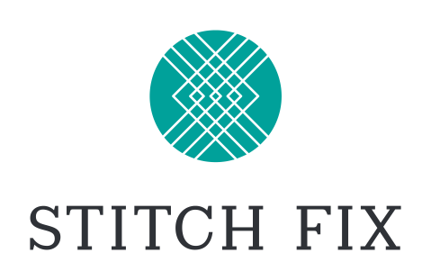
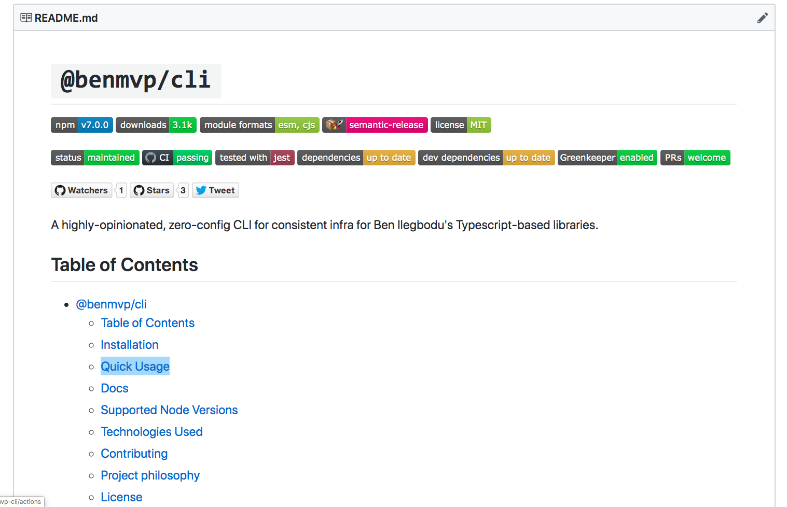
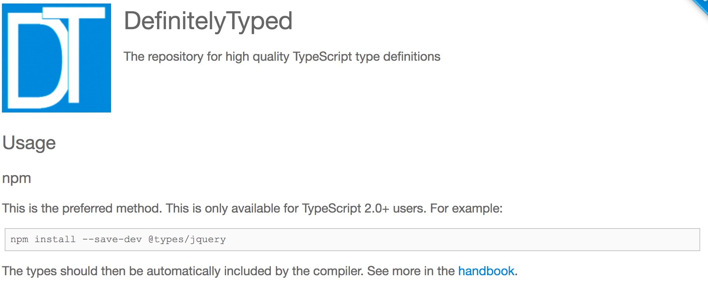
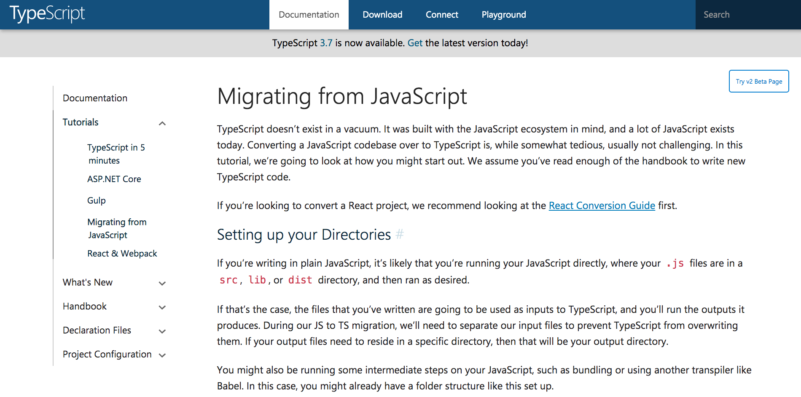
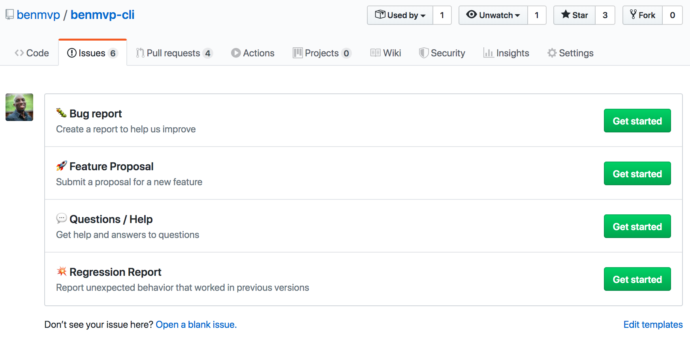
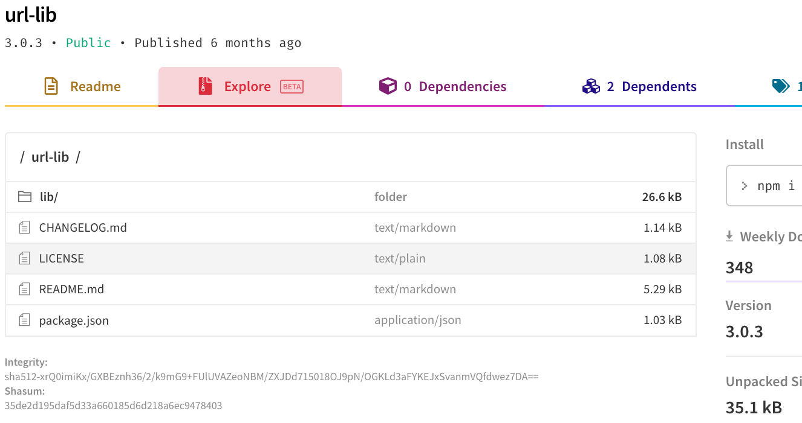
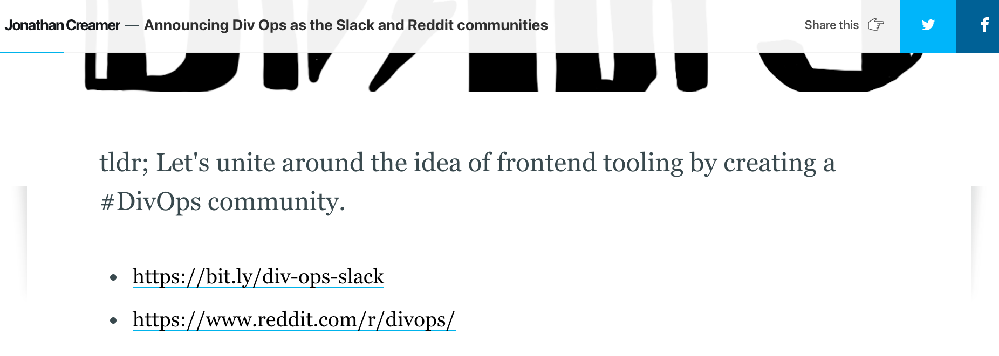

<!-- .slide: data-background="url(../../img/perfect-lib/jeshoots-com-VdOO4_HFTWM-tools-unsplash.jpg) no-repeat center" data-background-size="cover" -->

	

  <h1>The “perfect” library tooling</h1>

   

  <h2>Ben Ilegbodu</h2>

   

  
[@benmvp](https://twitter.com/benmvp) | [benmvp.com](https://www.benmvp.com/?utm_source=benmvp&utm_medium=slides&utm_campaign=ato-2020) | [#AllThingsOpen](https://twitter.com/hashtag/AllThingsOpen)

   

  
October 20, 2020

  

NOTES:
**RESTART THE TIMER!!!!**

- Hello everyone!
- It's the "perfect" (in quotes) JavaScript library tooling because it's obviously highly subjective
  * These are naturally my own opinions
- But it's the talk I would've liked to have heard when I was starting building libraries
  * Because **libraries** for developers have different concerns than **apps** for users
- So these are learnings over the years doing tooling-type things
  * Both in open-source & on the job
  * As well as watching how other more prolific folks have done it

- **RESTART THE TIMER!!!!**
- **TWEETED OUT THE SLIDES!**
- Gonna try to pay attention to the chat to make it somewhat engaging

=====
<!-- .slide: data-background="url(../../img/perfect-lib/alessandra-caretto-cAY9X4rPG3g-bicycle-unsplash.jpg) no-repeat center" data-background-size="cover" -->

  

    
    

      <a href="https://kentcdodds.com/blog/why-users-care-about-how-you-write-code" target="_blank">
        <em>Why users care about how you write code</em>
      </a>
    

  

NOTES:
- Whenever we're talking about non-end-user features like tooling
  * We need to ask ourselves what exactly is the benefit?
  * Does this even matter?
- Because if it's **not** a feature for the end user
  * Then it **needs** to be a feature for the developer
  * So that _they_ can build faster/better for end user
- Otherwise, we find ourselves bike-shedding
- Kent C. Dodds wrote a blog post says exactly that
  * We should always to measure **success** based on how well we can deliver what the user wants
  * Our choice of tooling should be based on that goal (and no more)

=====
<!-- .slide: data-background="url(../../img/perfect-lib/nesa-by-makers-kwzWjTnDPLk-black-developers-unsplash.jpg) no-repeat center" data-background-size="cover" -->

  

    <h1>Users === Developers</h1>
  

NOTES:
- In this case, our "focus on the user" principle still applies
  * Except, this time the "user" **is** the developer
  * The libraries we build will be used by other developers
- And instead of talking about how to write the code...
  * We're gonna focus on **everything else**
  * Everything that enables developers to build user experiences with our library

=====

<!-- .slide: data-background="url(../../img/giphy/stand-up-steph-curry.gif) no-repeat center" data-background-size="cover" -->

  

    <h1 style="font-size: 5em">Stand Up!</h1>
  

NOTES:
- Before we continue can I get everyone to stand up?

/////
<!-- .slide: data-background="#000" -->

  

    
  

NOTES:

- My name is Ben Ilegbodu
- Christian, Husband, Father
- _Family introductions_
- We live in Pittsburg, CA (SF Bay Area)
- Also a Google Developer Expert & Microsoft MVP in Web Technologies

/////

<!-- .element: class="plain" style="width: 75%" -->

NOTES:

- I'm a Principal Frontend Engineer at Stitch Fix
  * Customer-facing organization
  * Work on building out our React Design System
  * Also focus on frontend infrastructure to allow devs to focus on features
- Stitch Fix is an online personal styling service
  * Take the effort out of shopping by providing a selection of clothes picked just for you
  * And sent to your door on a frequency that you choose
  * Combines technology & data science
  * With an actual human stylist
- We're hiring!
  * US-only unfortunately
  * Headquarters is in SF
  * And we had remote engineers all over the country even before COVID

=====
<!-- .slide: data-background="url(../../img/perfect-lib/jeshoots-com-VdOO4_HFTWM-tools-unsplash.jpg) no-repeat center" data-background-size="cover" -->

NOTES:
_[5 minutes]_

- Ok, enough about me
- Let's talk about making this perfect JavaScript library
  * This info applies for an **open-source** package or **internal** to your company
- Remember we're shifting are focus to what our users need (the developers)
  * Not necessarily what we care about
  * Those developers could be just those w/in your company
  * Or any developer in the world who would want to use your package
- So let's jump in!

=====
<!-- .slide: data-background="url(../../img/perfect-lib/calle-macarone-15wIddvL5dU-emergency-instructions-guide-unsplash.jpg) no-repeat center" data-background-size="cover" -->

  

    <h1>1. Helpful docs</h1>
  

NOTES:
- The first thing we need are Helpful Docs
- Docs that explain:
  * How to install the library
  * Examples of how to use the library
  * Full API spec once I already know how to use the library
- Question for us: **So what makes Helpful Docs possible?**

/////
<!-- .slide: data-background="url(../../img/perfect-lib/calle-macarone-15wIddvL5dU-emergency-instructions-guide-unsplash.jpg) no-repeat center" data-background-size="cover" -->

  

    <h1>Write docs first!</h1>
  

NOTES:
- My suggestion is to write the docs first **before** implementation
- Why? Because actually writing **good** docs is hard
  * So writing docs first makes it a bit easier
- 1/ We're more likely to have a cohesive docs
  * The formatting, inclusion of examples will all be the same
- 2/ We will write the docs when we know how it works **the least**
  * We're able to better put ourselves in the shoes of a newcomer
- 3/ We can get feedback from others **before** implementation
  * And it's in a format that's much more approachable than an implementation spec

/////
<!-- .slide: data-background="url(../../img/perfect-lib/calle-macarone-15wIddvL5dU-emergency-instructions-guide-unsplash.jpg) no-repeat center" data-background-size="cover" -->

  

    

      

        <h3>References</h3>
        <ul>
          <li>is <strong>information-oriented</strong></li>
          <li>describes the machinery</li>
          <li>is accurate and complete</li>
        </ul>
      

      

        <h3>How-to guides</h3>
        <ul>
          <li>is <strong>goal-oriented</strong></li>
          <li>shows how to solve a problem</li>
          <li>is a series of steps</li>
        </ul>
      

      

        <h3>Explanations</h3>
        <ul>
          <li>is <strong>understanding-oriented</strong></li>
          <li>explains</li>
          <li>provides background &amp; context</li>
        </ul>
      

	    

        <h3>Tutorials</h3>
        <ul>
          <li>is <strong>learning-oriented</strong></li>
          <li>allows newcomer to get started</li>
          <li>is a lesson</li>
        </ul>
      

    

    

      <a href="https://documentation.divio.com/" target="_blank">The documentation system</a>
    

  

NOTES:
- So what sort of docs should you write?
- Keep in mind there are at least **four types** of docs
- Tutorials, How-to guides, Explanations & References
  * Let's use `lodash` as an example
- **References** would be the traditional API docs for `lodash`
  * Here are the parameters `pick()` takes and its return value
  * These are great for those who already know how to use `lodash` in general and need specifics
- **How-to guides** are examples showing common use cases for `lodash` functions
  * These are typically paired with API docs
  * More complex ones are recipes or sample repos of how to use one or multiple functions together
- **Explanations** are blogs/talks/videos to explain why using `_.chain` may be a bad idea
  * They clarify and illuminate a particular topic
  * They go more in depth than the API doc's coverage of a topic
- **Tutorials** would be `lodash` workshops we'd find **Egghead** or **Frontend Masters** or online
  * Lessons that take the reader by the hand to build an app with `lodash`
  * These are perfect for newcomers who may not even know what `lodash` is
- For your "perfect" library, you should have **References** & **How-to guides**
  * API docs & examples

/////
<!-- .slide: data-background="url(../../img/perfect-lib/calle-macarone-15wIddvL5dU-emergency-instructions-guide-unsplash.jpg) no-repeat center" data-background-size="cover" -->

  

    

      

        
      

      

        <ul>
          <li>Badges</li>
          <li>Description</li>
          <li>Installation</li>
          <li>Quick Guide</li>
          <li>API</li>
          <li>Tech Details</li>
          <li>Contributing</li>
          <li>License</li>
        </ul>

        
Check out <a href="https://github.com/SaraVieira/fiddly" target="_blank"><code>fiddly</code></a>

      

  

NOTES:
- So based that, here's my suggestion for what the repo's `README.md` should look like
  * **In this order**
- 1/ Add ALL the badges you can think of
  * Package version, build statuses, # of downloads, etc.
- 2/ A short description of the library's purpose
- 3/ Installation instructions, _including any necessary peer dependencies_
  * Still need to include both `npm` & `yarn` instructions, unfortunately
- 4/ Quick guide on how to do common things
- 5/ Full API docs
  * May link to other Markdown files
  * Each function or configuration should include a **real-world example**
  * Please no `foo`/`bar` because they can be confusing to newcomers
- 6/ Then at the bottom: Technical details
  * How it's faster, tech used, etc.
  * I hate when this is up top for multiple page scrolls!
- 7/ Contribution Guidelines
  * Likely a link to `CONTRIBUTING.md`
- 8/ License info
- One last thing...
  * Check out this package call `fiddly` by Sara Vieira
  * It builds static HTML pages from your README.md
  * So now your package can look "official" hosted on Netlify

=====
<!-- .slide: data-background="url(../../img/perfect-lib/pop-zebra-wp81DxKUd1E-safety-helmets-unsplash.jpg) no-repeat center" data-background-size="cover" -->

  

    <h1>2. TypeScript types</h1>
  

NOTES:
_[10 minutes]_

- Now with the Helpful Docs you've provided
  * I can develop my app using your lib
- But the very next thing I'll need are TypeScript types
- TypeScript is a typed superset of JavaScript that compiles to plain JavaScript
- Now this suggestion may be be bit controversial
  * It's certainly my own bias
  * But the numbers back me up (from the State of JavaScript survey)

/////
<!-- .slide: data-background="url(../../img/perfect-lib/pop-zebra-wp81DxKUd1E-safety-helmets-unsplash.jpg) no-repeat center" data-background-size="cover" -->

  

    <h2>TypeScript adoption</h2>

    

      

      

        21%
        <a href="http://2016.stateofjs.com/2016/flavors/" target="_blank">2016</a>
      

      

        33%
        <a href="https://2017.stateofjs.com/2017/flavors/results/" target="_blank">2017</a>
      

      

        47%
        <a href="https://2018.stateofjs.com/javascript-flavors/overview/" target="_blank">2018</a>
      

      

        59%
        <a href="https://2019.stateofjs.com/javascript-flavors/" target="_blank">2019</a>
      

      

        80%
        (<a href="https://2019.stateofjs.com/javascript-flavors/" target="_blank">2019</a>)
      

    

  

NOTES:
- TypeScript has become super popular
- 2018 was the year everyone "discovered" TypeScript
- Only 1/3 of devs had used TypeScript in 2017
- In 2018, it was 47%
- In 2019, it was nearly 60%
  * If we add in those devs that are interested in learning TS: **80%**
- 8 out of every 10 developers will need **TypeScript definitions** from your lib
  * In order to write their TypeScript app that uses your lib
- Question for us: **So what makes it possible to make TypeScript definitions available?**

/////
<!-- .slide: data-background="url(../../img/perfect-lib/pop-zebra-wp81DxKUd1E-safety-helmets-unsplash.jpg) no-repeat center" data-background-size="cover" -->

  

    
    

      <a href="http://definitelytyped.org/" target="_blank">DefinitelyTyped</a>
    

  

NOTES:
- One option is build your lib in regular JavaScript
  * And then add TypeScript type declaration files to `DefinitelyTyped`
  * A repo of high quality TypeScript type definitions
- Nearly 7000 library type definition files are in the repo
  * `React`, `lodash`, `node`, etc
- The drawback is that you have to know quite a bit of TypeScript to generate these files manually
- Therefore, my suggestion is...

/////
<!-- .slide: data-background="url(../../img/perfect-lib/pop-zebra-wp81DxKUd1E-safety-helmets-unsplash.jpg) no-repeat center" data-background-size="cover" -->

  

    
    

      <a href="https://code.visualstudio.com/docs/languages/typescript" target="_blank">VS Code + TypeScript = ❤️</a>
    

  

NOTES:
- Write your library in TypeScript of course!
- There's definitely a learning curve to TypeScript, no doubt
- But in the interest of serving your users (the developers)
  * Writing in TypeScript is the best way to provide those type definition files
  * Because they can be auto-generated
  * (more on how they make it into your package later)
- It's also difficult to write types for un-typed JS code
  * When code is untyped, we can make shortcut assumptions
  * These aren't allowed in TypeScript
  * So writing types could be challenging or impossible
- TypeScript also gives us modern JavaScript
  * So it's a win for us in our library development too!

=====
<!-- .slide: data-background="url(../../img/perfect-lib/katka-pavlickova-Sf5Q7Ljjf58-volkswagen-beetles-unsplash.jpg) no-repeat center" data-background-size="cover" -->

  

    <h1>3. Bug-free</h1>
  

NOTES:
_[15 minutes]_

- Let's start to get a bit tactical now
- So now I know how your lib works w/ the Helpful Docs
  * I have my TypeScript Types to develop with
  * So I'm good
- While developing, there's nothing more frustrating than coming across a library bug
- I'm really trusting initially, and think it's me
  * And spend countless hours debugging trying to figure out why it isn't working
- So for our library to be "perfect"
  * Need to do our absolute best to prevent 100% of bugs
- The question of course for us is...
  * **What makes our library as Bug-free possible?**

/////
<!-- .slide: data-background="url(../../img/perfect-lib/katka-pavlickova-Sf5Q7Ljjf58-volkswagen-beetles-unsplash.jpg) no-repeat center" data-background-size="cover" -->

  

    

	    

        
		    Type checking
      

      

        
        Linting
      

      

        
        Testing + Coverage
      

  

NOTES:
- The 3-headed monster of
  * Unit Testing w/ Coverage (Jest)
  * Linting (eslint)
  * Type checking (Typescript)
- **Type checking** comes with TypeScript
  * So not only is developing w/ TypeScript good for providing types for our users
  * It's **also** good for our users because it helps us avoid bugs!
  * Those edge cases where things are unexpectedly `undefined`
  * Or you refactor the props of your component and forget to update some places
  * With VS Code type-checking can happen _as you develop_
- **Linting** comes via ESLint
  * This also can happen _as you develop_ in your favorite editor
  * So TypeScript catches a lot of the non-stylistic errors that ESLint also catches
  * But ESLint can warn us of _likely_ or _potential_ errors (bad practices)
  * And then there are additional plugins for environments like React
- **Testing + Coverage** comes with Jest
  * Allows you to write unit tests
  * Test the public API of your library
  * Can also check what percentage of your code has been tested
  * The goal with coverage is to make sure you cover edge case branches
  * Unit testing is huge in keeping your lib bug-free
  * Especially as you add new features or refactor code
  * So you actually have to write some tests

/////
<!-- .slide: data-background="url(../../img/perfect-lib/katka-pavlickova-Sf5Q7Ljjf58-volkswagen-beetles-unsplash.jpg) no-repeat center" data-background-size="cover" -->

  

    <h2>Jest Projects</h2>
    
Run typing, linting & tests all within Jest

    <pre class="large"><code class="lang-javascript">{
  "projects": [
    { "displayName": "test" },
    {
      "displayName": "lint",
      "runner": "jest-runner-eslint",
      "testMatch": ["&lt;rootDir>/\*\*/\*.ts"]
    }, {
      "displayName": "type",
      "runner": "jest-runner-tsc",
      "testMatch": ["&lt;rootDir>/\*\*/\*.ts"]
    }
  ]
}</code></pre>
  

NOTES:
- I'm guessing most of you already knew a lot of that
  * More interested in taking it to the next level
- Typically you'd run typing, linting & testing with 3 separate commands
  * But with Jest projects, you can run them **all** through Jest
- Jest is a platform that's broken up into 3 main parts
  * The **"file collector"** in the beginning that determines which files to run on
  * The **"error reporter"** at the end that displays success or failure
  * A **"runner"** in the middle which runs whatever we're validating
- Instead of running the Jest test runner, we can run `eslint` or `tsc` for Typescript
- This enables linting in **watch mode**, which `eslint` command doesn't support
  * Also allows them to be run in **parallel**
  * But w/ consistent and **grouped error messaging**
- Simply call `jest` as the `"test"` script in `package.json`

/////
<!-- .slide: data-background="url(../../img/perfect-lib/katka-pavlickova-Sf5Q7Ljjf58-volkswagen-beetles-unsplash.jpg) no-repeat center" data-background-size="cover" -->

  

    <pre class="large"><code class="lang-yaml">name: CI
on: [push, pull_request]
jobs:
  main:
    strategy:
      matrix:
        node: [10, 12, 14]
    steps:
      - uses: actions/checkout@v2
      - uses: actions/setup-node@v1
        with:
          node-version: ${{ matrix.node }}
      - run: npm ci
      - run: npm test
        env:
          CI: true</code></pre>

    

  

NOTES:
- Can take the `"test"` script and run it in continuous integration (CI) env
  * There are many CI services out there (Travis CI, Circle CI, etc.)
  * But lately I've been using **Github actions** and loving it
  * Can use Github actions w/o registering for another service
  * If you didn't catch it, make sure you watch Sue's talk from early on Github Actions
- Here's an example Github workflow to run the tests on Node 10, 12 & 14
  * It's important that you test on all versions your lib supports!

/////
<!-- .slide: data-background="url(../../img/perfect-lib/katka-pavlickova-Sf5Q7Ljjf58-volkswagen-beetles-unsplash.jpg) no-repeat center" data-background-size="cover" -->

  

    <h2>Resources</h2>

    <ul>
      <li><a href="https://www.youtube.com/watch?v=ZJ43STkmK-4" target="_blank">Jest as a Platform</a> ⏯️</li>
      <li><a href="https://github.com/typescript-eslint/typescript-eslint/tree/master/packages/eslint-plugin" target="_blank"><code>@typescript-eslint/eslint-plugin</code></a></li>
      <li><a href="https://github.com/jest-community/jest-runner-eslint" target="_blank"><code>jest-runner-eslint</code></a> + <a href="https://github.com/azz/jest-runner-tsc" target="_blank"><code>jest-runner-tsc</code></a></li>
      <li><a href="https://github.com/jest-community/jest-watch-typeahead" target="_blank"><code>jest-watch-typeahead</code></a></li>
      <li><a href="https://github.com/yannickcr/eslint-plugin-react" target="_blank"><code>eslint-plugin-react</code></a></li>
      <li><a href="https://www.npmjs.com/package/eslint-plugin-react-hooks" target="_blak"><code>eslint-plugin-react-hooks</code></a></li>
      <li><a href="https://github.com/jsx-eslint/eslint-plugin-jsx-a11y" target="_blank"><code>eslint-plugin-jsx-a11y</code></a></li>
      <li><a href="https://github.com/features/actions" target="_blank">Github Actions</a></li>
    </ul>
  

NOTES:
- Really wanna spend more time unpacking all of that
  * But I have more things to share
- Here are resources that dive deeper into what I just talked about

=====
<!-- .slide: data-background="url(../../img/perfect-lib/russ-ward-18MJRuL4tUE-plasma-cutter-unsplash.jpg) no-repeat center" data-background-size="cover" -->

  

    <h1>4. Changes come quickly</h1>
  

NOTES:
_[20 minutes]_

- We've discussed: **Helpful docs**, **TypeScript types** & **Bug free**
  * Let's bring it home
- No matter how hard you test and test, there will inevitably still be bugs
- Or even if you write perfect code...
  - Your users (the developers) will have requests for nice features you haven't thought of
- So you want to be able to get those changes to your users ASAP
  - From initial request, to published in the npm registry
- The question for us is: **What makes Quick Changes possible?**

/////
<!-- .slide: data-background="url(../../img/perfect-lib/russ-ward-18MJRuL4tUE-plasma-cutter-unsplash.jpg) no-repeat center" data-background-size="cover" -->

  

    
  

NOTES:
- Well it first starts with the issue itself
- Whether it's a bug or a feature request we want _as much details as possible_
- With Github issue templates you can guide the developer into a flow based on their situation
  - Bug report
  - Feature proposal
  - Question / Help
  - Regression Report
- And you can tie a label w/ each type so that your issues are pre-classified

/////
<!-- .slide: data-background="url(../../img/perfect-lib/russ-ward-18MJRuL4tUE-plasma-cutter-unsplash.jpg) no-repeat center" data-background-size="cover" -->

  

    <pre class="large"><code>&gt; npx envinfo --system --binaries

System:
  OS: macOS High Sierra 10.13.6
  CPU: (4) x64 Intel(R) Core(TM) i5-5257U CPU @ 2.70GHz
  Memory: 47.79 MB / 8.00 GB
  Shell: 3.2.57 - /bin/bash
Binaries:
  Node: 12.14.1 - ~/.nvm/versions/node/v12.14.1/bin/node
  Yarn: 1.15.2 - /usr/local/bin/yarn
  npm: 6.13.4 - ~/.nvm/versions/node/v12.14.1/bin/npm
  Watchman: 4.9.0 - /usr/local/bin/watchman</code></pre>

    <a href="https://github.com/tabrindle/envinfo#readme" target="_blank"><code>envinfo</code></a>
  

NOTES:
- BTW - for bugs you can have the developer run the `envinfo` package & include the results
- It's a quick way to get helpful system information

/////
<!-- .slide: data-background="url(../../img/perfect-lib/russ-ward-18MJRuL4tUE-plasma-cutter-unsplash.jpg) no-repeat center" data-background-size="cover" -->

  

    <h2>Development Experience files</h2>

    <ul>
      <li><a href="https://github.com/benmvp/benmvp-cli/blob/master/CONTRIBUTING.md" target="_blank"><code>CONTRIBUTING.md</code></a></li>
      <li><a href="https://github.com/nvm-sh/nvm#nvmrc" target="_blank"><code>.nvmrc</code></a></li>
      <li><a href="https://prettier.io/" target="_blank"><code>.prettierrc.json</code></a></li>
      <li><a href="https://help.github.com/en/enterprise/2.19/user/github/building-a-strong-community/creating-a-pull-request-template-for-your-repository" target="_blank"><code>.github/pull_request_template.md</code></a></li>
      <li><a href="https://www.contributor-covenant.org/" target="_blank"><code>CODE_OF_CONDUCT.md</code></a></li>
    </ul>
  

NOTES:
- Let's say I'm willing to help with fixes or adding a feature
  - What can you do to make that go fastest for me?
- **`CONTRIBUTING.md`** - Provides clear guidelines on how I can contribute to the library (PRs are welcome! 😂)
- **`.nvmrc`** - Locks down the version of Node with NVM so that everyone's using the same version
- **`.prettierrc.json`** - Prettier provides consistent formatting for everyone
  * No time wasted arguing of code format
  * Also makes developing faster cuz your editor can auto-format with Prettier
  * There's an eslint plugin so that you can integrate Prettier as an eslint rule
- **`pull_request_template.md`** - Ensures that the correct format is followed for PRs and includes necessary info
- **`CODE_OF_CONDUCT.md`** - Covers everything to make sure everyone is behaving properly
- These are all various communication files to streamline the process

/////
<!-- .slide: data-background="url(../../img/perfect-lib/russ-ward-18MJRuL4tUE-plasma-cutter-unsplash.jpg) no-repeat center" data-background-size="cover" -->

  

    <h2>Library Starter Commands</h2>
    <pre class="large"><code>npx license mit > LICENSE.md
npx gitignore node
npx covgen ben@benmvp.com
git init
npm init -y</code></pre>

    <a href="https://www.swyx.io/writing/oss-repo-setup/" target="_blank">Best Practice Open Source Repo Setup</a>
  

NOTES:
- In fact, if you're starting out the library there are a couple of scripts you can run
  - Setup license (MIT)
  - Setup `.gitignore` for Node files
  - Generate the `CODE_OF_CONDUCT.md` we talked about
  - Initialize `git`
  - And initialize your `package.json`
  - And you're off to the races!

/////
<!-- .slide: data-background="url(../../img/perfect-lib/russ-ward-18MJRuL4tUE-plasma-cutter-unsplash.jpg) no-repeat center" data-background-size="cover" -->

  

    <pre class="large"><code class="lang-json">{
  "main": "lib/cjs/index.js",
  "module": "lib/esm/index.js",
  "jsnext:main": "lib/esm/index.js",
  "sideEffects": false,
  "types": "lib/types/index.d.ts",
  "files": ["lib"],
  "scripts": {
    "build:cjs": "babel src -d lib/cjs --presets cjs.js",
    "build:esm": "babel src -d lib/esm --presets esm.js",
    "build:types": "tsc -d --declarationDir lib/types",
    "build": "npx npm-run-all build:**"
  }
}</code></pre>
    

    

    

    

    

    

    

  

NOTES:
- After the code is written, the PR is created, passes CI & merged
  * We need to get the code out ASAP to the npm registry
- First step is ensuring we're generating the correct formats of transpiled code
  * We don't wanna ship source code
  * These days for modern JS you need ESM (tree-shaking) & CJS (standard Node)
  * **ONE**: `"main"` field for CJS
  * **TWO**: `"module"`, `"jsnext:main"` & `"sideEffects"` fields for ESM
  * **THREE**: `"types"` for TypeScript definition types (from Part 2)
  * **FOUR**: `"files"` tells which files to include in package (instead of using `.npmignore`)
- **FIVE**: We use `babel` for transpiling TypeScript to vanilla JS
  * There's a Babel plugin for TS that allows us to transpile TS
  * I don't use Webpack or Rollup because they are better suited for creating bundles
- **SIX**: Use `tsc` for generating TypeScript definition files
- **SEVEN**: Wrap it all up in a nice `"build"` script using `npm-run-all`

/////
<!-- .slide: data-background="url(../../img/perfect-lib/russ-ward-18MJRuL4tUE-plasma-cutter-unsplash.jpg) no-repeat center" data-background-size="cover" -->

  

    <pre class="large"><code class="lang-yaml">name: Release
on:
  push:
    branches: [master]
jobs:
  main:
    steps:
      # Setup & install
      - name: Build package
        run: npm run build

      - name: Release new version
        run: npx semantic-release</code></pre>

    <a href="https://github.com/semantic-release/semantic-release" target="_blank"><code>semantic-release</code></a>

    

    

  

NOTES:
- With the `build` script in place, we can achieve continuous delivery (CD)
- **ONE**: First we run the `build` script to generate all the files
- **TWO**: Then we run the `semantic-release` package to release
- Meant to be executed in CI env after every successful build on release branch
- Makes releases "unromantic & unsentimental"
- I can merge a PR on my phone and it get automatically pushed to npm in 5 mins
- No more having to manually push a version commit or run a script locally

/////
<!-- .slide: data-background="url(../../img/perfect-lib/russ-ward-18MJRuL4tUE-plasma-cutter-unsplash.jpg) no-repeat center" data-background-size="cover" -->

  

    
  

NOTES:
- The releases show up in the Github releases tab
- So detailed a changelog is automatically generated

/////
<!-- .slide: data-background="url(../../img/perfect-lib/russ-ward-18MJRuL4tUE-plasma-cutter-unsplash.jpg) no-repeat center" data-background-size="cover" -->

  

    

    
<a href="https://www.npmjs.com/package/url-lib" target="_blank">npm</a> (beta) | <a href="https://unpkg.com/browse/url-lib@3.0.3/" target="_blank">unpkg</a> | <a href="https://www.jsdelivr.com/package/npm/url-lib" target="_blank">jsDelivr</a>

  

NOTES:
- Lastly, you can browse the package to make sure everything was released properly
  * With unkpg, jsDelivr, and now on the npm site itself

/////
<!-- .slide: data-background="url(../../img/perfect-lib/russ-ward-18MJRuL4tUE-plasma-cutter-unsplash.jpg) no-repeat center" data-background-size="cover" -->

  

    <h2>Resources</h2>

    <ul>
      <li><a href="https://github.com/benmvp/benmvp-cli/tree/master/.github/ISSUE_TEMPLATE" target="_blank">Example Issue templates</li>
      <li><a href="https://raw.githubusercontent.com/benmvp/benmvp-cli/master/.github/pull_request_template.md" target="_blank">Example PR template</li>
      <li><a href="https://github.com/benmvp/benmvp-cli/blob/master/.github/workflows/validate-pr.yml" target="_blank">Example PR Validator</a></li>
      <li><a href="https://github.com/benmvp/benmvp-cli/blob/master/src/commands/build/babel-config-cjs.js" target="_blank">Example <code>babel-cjs.js</code></a>  / <a href="https://github.com/benmvp/benmvp-cli/blob/master/src/commands/build/babel-config-esm.js" target="_blank"><code>babel-esm.js</code></a></li>
      <li><a href="https://babeljs.io/docs/en/babel-preset-typescript" target="_blank"><code>@babel/preset-typescript</code></a></li>
      <li><a href="https://github.com/prettier/eslint-plugin-prettier" target="_blank"><code>eslint-plugin-prettier</code></a></li>
      <li><a href="https://github.com/typescript-eslint/typescript-eslint/tree/master/packages/eslint-plugin" target="_blank"><code>@typescript-eslint/eslint-plugin</code></a></li>
      <li><a href="https://webpack.js.org/guides/tree-shaking/#mark-the-file-as-side-effect-free" target="_blank"><code>sideEffects</code> in <code>package.json</code></a></li>
      <li><a href="https://dev.to/iggredible/what-the-heck-are-cjs-amd-umd-and-esm-ikm" target="_blank"><em>What are CJS, AMD, UMD, and ESM in Javascript?</em></a></li>
      <li><a href="https://medium.com/@jdxcode/for-the-love-of-god-dont-use-npmignore-f93c08909d8d" target="_blank"><em>For the love of god, don’t use .npmignore</em></a></li>
      <li><a href="https://medium.com/@vcarl/problems-with-npm-link-and-an-alternative-4dbdd3e66811" target="_blank"><em>Testing npm packages before publishing</em></a></li>
    </ul>
  

NOTES:
- Tons more resources on little details I wasn't able to cover

=====
<!-- .slide: data-background="url(../../img/esnext/simon-rae-221560-unsplash.jpg) no-repeat center" data-background-size="cover" -->

  

    <h1>Recap</h1>
  

NOTES:
_[30 minutes]_

- Wow! That was a lot of stuff!
- Chances are you missed something when you responded to that Slack/Discord message 😉
- Let's quickly recap what we discussed
- But instead of grouping by user need
- Let's group it by how you'll be implementing the infra
- As we'll see the "perfect" repo is a mix of technical and communication things
- Just like the "perfect" developer should also be a mix of technical and comm skills

/////
<!-- .slide: data-background="url(../../img/esnext/simon-rae-221560-unsplash.jpg) no-repeat center" data-background-size="cover" -->

  

    

      

        <h3>Development</h3>
        <ul>
          <li><a href="https://www.javascript.com/" target="_blank">Modern JS</a></li>
          <li><a href="https://prettier.io/" target="_blank">Prettier</a></li>
          <li><a href="https://eslint.org/" target="_blank">ESLint</a></li>
          <li><a href="https://www.typescriptlang.org/" target="_blank">Type checking</a></li>
          <li><a href="https://code.visualstudio.com/" target="_blank">Editor integrations</a></li>
        </ul>
      

      

        <h3>Repo files</h3>
        <ul>
          <li>API & example docs</li>
          <li>Badges</li>
          <li><a href="https://github.com/benmvp/benmvp-cli/blob/master/CONTRIBUTING.md" target="_blank">Contributing</a> & <a href="https://github.com/simonv3/covenant-generator" target="_blank">Code of Conduct</a></li>
          <li><a href="https://www.npmjs.com/package/license" target="_blank"><code>LICENSE</code></a></li>
          <li><a href="https://help.github.com/en/github/building-a-strong-community/about-issue-and-pull-request-templates" target="_blank">Issue & PR templates</a></li>
        </ul>
      

      

        <h3>Test / CI</h3>
        <ul>
          <li><a href="https://github.com/features/actions" target="_blank">Github actions</a></li>
          <li><a href="https://www.typescriptlang.org/" target="_blank">Type checking</a></li>
          <li><a href="https://eslint.org/" target="_blank">Linting</a></li>
          <li><a href="https://jestjs.io/" target="_blank">Unit testing + coverage</a></li>
          <li><a href="https://www.youtube.com/watch?v=ZJ43STkmK-4" target="_blank">Jest as a platform</a></li>
        </ul>
      

	    

        <h3>Build / CD</h3>
        <ul>
          <li><a href="https://babeljs.io/docs/en/babel-cli" target="_blank">Transpilation targets</a></li>
          <li><a href="https://docs.npmjs.com/files/package.json" target="_blank"><code>package.json</code> metadata</a></li>
          <li><a href="https://medium.com/@vcarl/problems-with-npm-link-and-an-alternative-4dbdd3e66811" target="_blank">Library verification</a></li>
          <li><a href="https://github.com/semantic-release/semantic-release" target="_blank">Semantic release</a> & <a href="https://github.com/SaraVieira/fiddly" target="_blank"><code>fiddly</code></a></li>
          <li><a href="https://unpkg.com/" target="_blank">Package browsing</a></li>
        </ul>
      

  

NOTES:
- Here it all is in one slide!
- Your **development experience** starts with getting to write in modern JS (via TypeScript)
- And with a nice editor like VS Code...
  * Can get prettier formatting, eslint & type checking in the editor
- There are lots of other **repo files**
  * Docs for your users to figure out how to use your library
  * Other files to make communication with you easy & safe
- For **testing & continuous integration (CI)**, try using the new Github actions
- And with Jest as a platform...
  * You can run type checking, linting, unit tests & code coverage all at once
- **Build & continuous delivery (CD)** are key IMO
- Use Babel for transpiling (TypeScript for type-checking)
  * Probably only need to target CommonJS & ES Module formats
  * And there are a plethora of `package.json` fields to set
- You'll want to your CI service to auto release new versions from commits merged to `master`
  * And auto-publish to your docs site (w/ `fiddly`)
- And we now have ways to ensure that what we release looks good

=====
<!-- .slide: data-background="url(../../img/perfect-lib/annie-spratt-rx1iJ59jRyU-gift-box-unsplash.jpg) no-repeat center" data-background-size="cover" -->

  

    <h1><code>@benmvp/cli</code></h1>
  

NOTES:
_[32 minutes]_

- So that was **all** the info I wanted to know 4+ years ago when I was starting
  * But to be honest, it probably would've been too overwhelming
  * I count over **20** different things!
  * I wanted to have the right tooling, but I was more interested in building my lib
- Even for me, now knowing it all...
  * I still don't wanna try to set those up each time
- So I created a zero-config CLI tool, called `@benmvp/cli` to abstract all that work
  * Everything but the docs (and the source code)
- The CLI has some options, so you _could_ totally use it
  * But I built it for myself, so don't expect any PRs to make it more configurable!

/////
<!-- .slide: data-background="url(../../img/perfect-lib/annie-spratt-rx1iJ59jRyU-gift-box-unsplash.jpg) no-repeat center" data-background-size="cover" -->

  

    <h2><code>@benmvp/cli</code></h2>
    <ul>
      <li><a href="https://github.com/benmvp/benmvp-cli/blob/master/docs/cli/create.md" target="_blank"><code>npx @benmvp/cli create</code></a></li>
      <li><a href="https://github.com/benmvp/benmvp-cli/blob/master/docs/cli/test.md" target="_blank"><code>benmvp test</code></a></li>
      <li><a href="https://github.com/benmvp/benmvp-cli/blob/master/docs/cli/start.md" target="_blank"><code>benmvp start</code></a></li>
      <li><a href="https://github.com/benmvp/benmvp-cli/blob/master/docs/cli/build.md" target="_blank"><code>benmvp build</code></a></li>
      <li><a href="https://github.com/benmvp/benmvp-cli/blob/master/docs/cli/integrate.md" target="_blank"><code>benmvp integrate</code></a></li>
    </ul>
  

NOTES:
- It works a lot like `react-scripts` if you've ever used Create React App before
- You run `npx @benmvp/cli create` (with name of app) and it initializes an app for you
  * Includes everything
  * Github actions CI/CD, repo files, sets all the `package.json` fields
  * Adds `@benmvp/cli` as a dev dependency
  * Adds scripts for the other commands
- `test` & `build` do what we've already described
- `start` is for dev, it runs `test` in watch mode based on any `git` changes
- `integrate` is something pretty cool that ideally deserves some devoted time
  * Basically packages up the library just like it'll be in the registry
  * Then run "integration" tests on it to make sure the lib can be used just like user would
  * Catches cases where all unit tests pass but I forgot to `export`
- It uses itself to dev, test & build itself
  * It itself is the "perfect" repo to help create other "perfect" repos

/////
<!-- .slide: data-background="url(../../img/perfect-lib/annie-spratt-rx1iJ59jRyU-gift-box-unsplash.jpg) no-repeat center" data-background-size="cover" -->

  

    
    

      <a href="https://www.jonathancreamer.com/announcing-div-ops/" target="_blank">Announcing Div Ops as the Slack and Reddit communities</a>
    

  

NOTES:

- If you find any of this stuff interesting like I do
- My friend Jonathan Creamer is also passionate about Frontend tooling
- It's becoming more of a thing and even a role at companies
- He's wanting to build a community around this skillset
- He coined the term **"DivOps"** for this community
- There's a Slack group & sub-Reddit to join
- We've been having monthly meetings where we share our divops setups at our companies

/////
<!-- .slide: data-background="url(../../img/perfect-lib/annie-spratt-rx1iJ59jRyU-gift-box-unsplash.jpg) no-repeat center" data-background-size="cover" -->

  

    

      

        
      

      

       <ul>
        <li><a href="https://www.benmvp.com/minishops/typescript-for-react-developers/?utm_source=benmvp&utm_medium=slides&utm_campaign=ato-2020" target="_blank">TypeScript for React Developers</a></li>
        <li><a href="https://www.benmvp.com/minishops/zero-to-react-with-hooks/?utm_source=benmvp&utm_medium=slides&utm_campaign=ato-2020" target="_blank">Zero to React with Hooks</a></li>
        <li><a href="https://www.benmvp.com/minishops/migrating-to-react-hooks/?utm_source=benmvp&utm_medium=slides&utm_campaign=ato-2020" target="_blank">Migrating to React Hooks</a></li>
        <li><a href="https://www.benmvp.com/minishops/sharing-react-component-logic/?utm_source=benmvp&utm_medium=slides&utm_campaign=ato-2020" target="_blank">Sharing React Component Logic</a></li>
      </ul>
    

  

NOTES:
- One last thing
- I periodically host a series of short, 3-hour remote React workshops
  * I call them "minishops"
- One of them is called "TypeScript for React Developers"
  * Happening next week!
  * As well as the others listed
- I'm doing a free giveaway for conference attendees
  * Go to my site (benmvp.com) and check out the minishops page
  * Find **one** you like AND can attend
  * Send out a tweet w/ the link and tag me in
  * I'll pick one and give you a free ticket

=====

<!-- .slide: data-background="url(../../img/perfect-lib/kelly-sikkema-fvpgfw3IF1w-thanks-unsplash.jpg) no-repeat center" data-background-size="cover"  -->

	

  <h1 class="closing">Ben Ilegbodu</h1>

   

  
<a href="https://twitter.com/benmvp" target="_blank">@benmvp</a> | <a href="https://www.benmvp.com/?utm_source=benmvp&utm_medium=slides&utm_campaign=ato-2020" target="_blank">benmvp.com</a>

  
<a href="mailto:ben@benmvp.com">ben@benmvp.com</a>

  
<a href="https://github.com/benmvp" target="_blank">github/benmvp</a>

  

NOTES:
- So that's it!
- Just flooded you with a lot of information
  * **Reminder: slides are available online**
- Hopefully there are a few new things you've learned
  * Things you can apply right away in your libraries
  * I've also likely forgotten some things so I'd love your feedback!
- Thank **YOU** for attending my talk
  * There were definitely lots of options going on right now
- If you've got questions, reach out to me on Twitter (**@benmvp**)
- Thank you so much and enjoy the remaining hours of the conference!
  * (I'm imagining a rousing round of applause 😂)
