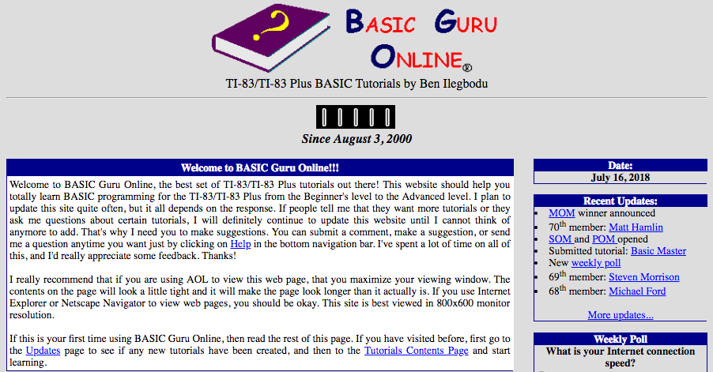
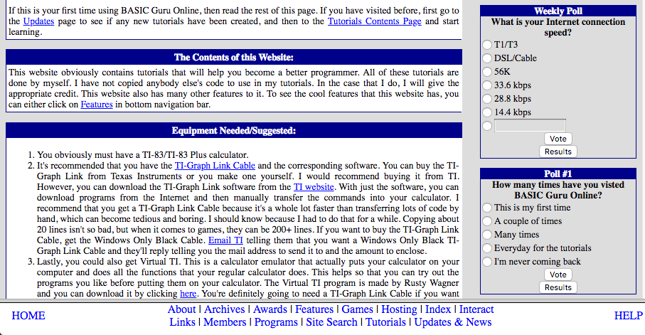
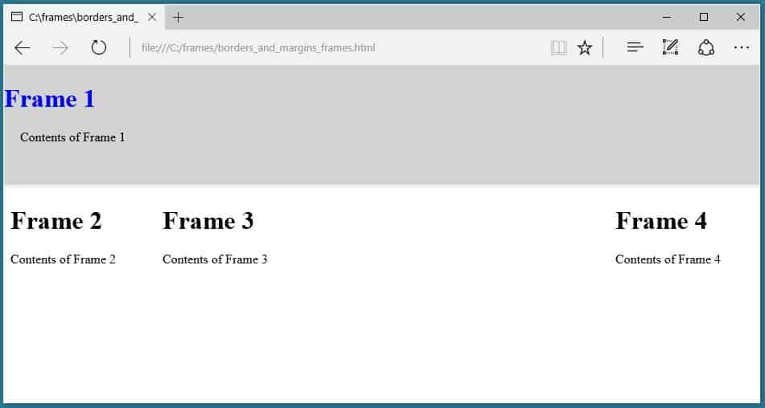
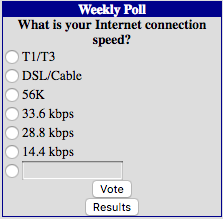
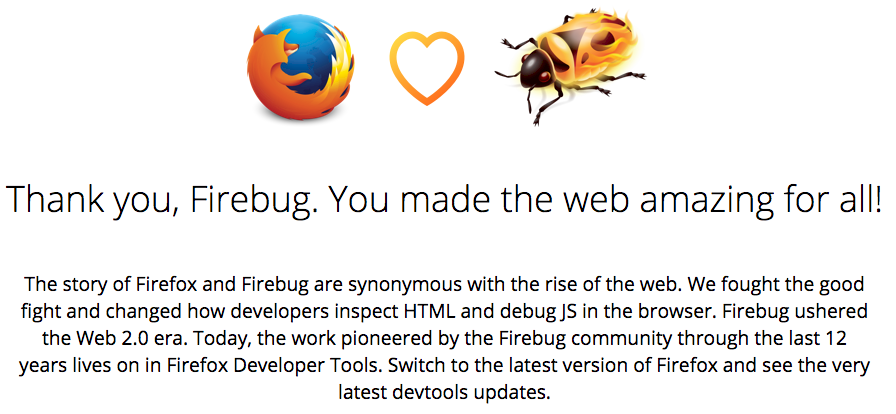

<!-- .slide: data-state="title-page" data-background="url(../../img/webdev/jason-leung-479251-unsplash.jpg) no-repeat center" data-background-size="cover" -->

 

  <h1>Let's web dev like it's 1999!</h1>

   

  <h2>Ben Ilegbodu</h2>

   

  
[@benmvp](https://twitter.com/benmvp) | [benmvp.com](/) | [#FlashbackConf](https://twitter.com/hashtag/FlashbackConf)

   

  
February 10, 2020

  

NOTES:
**RESTART THE TIMER!!!!**

- Welcome back from lunch!
- **QUESTION: So how many of you were developing back in 1999?**
- Hoping to share a little about my dev story and walk down memory lane
  - Or have a history lesson for most of you
- We'll hopefully learn some new things along the way
  - And appreciate where we are, based on where we've come from
- Not try to wreck your brain too much right after lunch

- **Slides are available online**

=====

<!-- .slide: data-background="url(../../img/giphy/stand-up-steph-curry.gif) no-repeat center" data-background-size="cover" -->

  

    <h1 style="font-size: 5em">Stand Up!</h1>
  

NOTES:

- Before we continue can I get everyone to stand up?

/////
<!-- .slide: data-background="#000" -->

  

    
  

NOTES:

- My name is Ben Ilegbodu
- Christian, Husband, Father
- _Family introductions_
- We live in Pittsburg, CA (SF Bay Area)
- Also a Google Developer Expert & Microsoft MVP in Web Technologies

/////

<!-- .element: class="plain" style="width: 75%" -->

NOTES:

- I'm a Principal Frontend Engineer at Stitch Fix
- Stitch Fix is an online personal styling service
  - Combines technology & data science
  - With an actual human stylist
  - Take the effort out of shopping by providing a selection of clothes picked just for you
  - And sent to your door on a frequency that you choose
- We're hiring!
  - Headquarters is in SF
  - But we have remote engineers all over the country

/////
<!-- .slide: data-background="url(../../img/giphy/james-harden-wesley-johnson-ankles.gif) no-repeat center" data-background-size="cover" -->

NOTES:

- Also a huge basketball / NBA fan
- Originally from Houston, so a huge Rockets fan
- And y'all have a team here too...
  - Moving right along!

=====

<!-- .slide: data-background="url(../../img/webdev/nikita-kostrykin-JmUl_t_v3dw-ps1-unsplash.jpg) no-repeat center" data-background-size="cover" -->

NOTES:

- But I don't wanna talk about me now
  - Wanna talk about me 20 years ago

/////
<!-- .slide: data-background="url(../../img/webdev/aid109294-v4-900px-Find-the-Minimum-and-Maximum-Points-Using-a-Graphing-Calculator-Step-1.jpg) no-repeat center" data-background-size="cover" -->

NOTES:

- My first programming language I learned was `BASIC`
  - Summer program in '98
- Used that skill to build "apps" for my TI-83 calc in high school
  - Would type is manually on the calculator using T9
  - Built math apps to help check answers on math homework & tests
  - That's not cheating right?

/////
<!-- .slide: data-background="url(../../img/webdev/win95help.png) no-repeat center" data-background-size="cover" -->

NOTES:

- Started sharing my apps online
  - No Github, no App store
- Folks would ask how to write TI apps
- So I started writing TI calculator tutorials
- Initially I wrote them as Windows Help Applications
  - Kind of like a hypercard system where you can link screens
  - Generated a `.hlp` file
  - Hard to distribute
- Quickly realized the web was a better way to distribute...

/////

NOTES:

- So naturally I created a website
- Went into the Wayback Machine and found my very first site
  - Isn't it beautiful
- Built "Basic Guru Online" as a Geocities website
  - (because apparently I was a "guru" at 16)
  - Geocities was like THE hosting service of the day
  - There was also Angelfire & Tripod
  - Talking early 2000
- BGO was like a full web application
  - Geocities handled all the backend
- Now we have sophisticated deployment processes
  - But back the, I pushed new static files directly to their servers
  - Using FTP (File Transfer Protocol)
  - No source control
- **ONE:** Definitely created the logo in Microsoft Paint using PowerPoint clip-art + Comic Sans
  - Comic Sans was 🔥 back then
- **TWO:** Trusty-dusty hit counter (broken)
  - No need for Google Analytics! 😂
- **THREE:** Current date display still works
  - For some reason I thought that was necessary
  - This is why JS is backwards compatible - so my 20yo site still works
- **FOUR:** According to the Recent Updates
  - I had at least 70 members!
- **FIVE:** I suggested using AOL to view the page
  - "Should be okay" using Internet Explorer or Netscape Navigator
  - Best viewed on an 800x600 res monitor!
  - Used `<table>` for 2-column layout
    - Still "responsive" nearly 20 years later!

/////

NOTES:

- **ONE:** Weekly poll asks about internet connect speed
  - Wish I had the results
- **TWO:** The bottom frame was fixed height
  - Main section filled rest of the window
  - More on this in a bit
- Surprisingly, I didn't use `<marquee>` or `<blink>` tags
- I was going through my backup hard drive the other day
  - Found a version of the old code
  - Put it on Github and hosted it on Netlify
  - No building necessary 😂
  - At <http://bgo.benmvp.com/>

/////
<!-- .slide: data-background="#000 url(../../img/webdev/yahoo-2001-screenshot.png) no-repeat center" data-background-size="contain" -->

NOTES:

- For fun...
- Here's what yahoo.com looked like at the time
- "Powered by Compaq" at the bottom
- <https://web.archive.org/web/20010601021654/http://www.yahoo.com:80/>

/////
<!-- .slide: data-background="#000 url(../../img/webdev/amazon-2001-screenshot.png) no-repeat center" data-background-size="contain" -->

NOTES:

- And amazon.com
- "Microsoft XP is now shipping!" at the bottom
- <https://web.archive.org/web/20010601111711/http://www.amazon.com:80/exec/obidos/subst/home/home.html>

/////
<!-- .slide: data-background="#000 url(../../img/webdev/gatsby-blog-screenshot.png) no-repeat center" data-background-size="contain" -->

NOTES:

- Fast forward nearly 2 decades
- Have my blog: benmvp.com
- Uses Gatsby for static site generation
  - Written all in React
  - It generates the static HTML pages I did by hand way back when
  - Uses Redux, GraphQL, css-in-js, Algolia, Webpack, Babel & more!
  - All to build a blog!
- **NEXT SLIDE!**

/////
<!-- .slide: data-background="url(../../img/webdev/uc-berkeley-coding-bootcamp.jpg) no-repeat center" data-background-size="cover" -->

  

    <h1>Berkeley Coding Boot Camp</h1>

      

        
HTML5

        
CSS3

        
JavaScript

        
jQuery

        
Python/Django

        
Bootstrap

        
Express.js

        
React.js

        
Node.js

        
AJAX/REST

        
Database Theory

        
Bookshelf.js

        
MongoDB

        
MySQL

        
Command Line

        
Git

      

  

NOTES:

- Which reminds me of a friend of mine
- He graduated from UC Berkeley coding boot camp not too long ago
- Look at all these skills they learned in just 12 weeks
  - Not just HTML, CSS & JavaScript
  - Command Line & Git (table stakes)
  - jQuery, Bootstrap, React
  - Django, Express & MongoDB
- And it's _just_ enough to get an junior-level job

/////
<!-- .slide: data-background="#000 url(../../img/webdev/justyn-warner-551353-unsplash.jpg) no-repeat center" data-background-size="cover" -->

NOTES:

- I mean, wow!
- The bar for the "minimally-viable" skills to build a site is so high now
- And we go to meetups & conferences like this to hear about all the things we **should** be doing
  - All to stay current

-----

- But the bar wasn't always so high
  - In fact it was really, really low
  - To be honest, it probably non-existent
  - We were making things up as we went
- So I wanted to take a look at various aspects of how we built sites back in the day
  - And compare them to how things work now

=====
<!-- .slide: data-background="#000 url(../../img/webdev/rawpixel-487103-unsplash.jpg) no-repeat center" data-background-size="cover" -->

NOTES:

- Before CSS3 flexbox & grid we needed ways to lay out our pages
- And many times we had some navigation that we wanted fixed
  - Either a header menu on top
  - Left nav
  - Or in the case of my site I thought a fixed nav footer was a good idea
- Now you may think I'm talking about using `<table>`s, but no!
- I'm talking about page layouts that pre-dated `<table>`

/////
<!-- .slide: data-background="url(../../img/webdev/rawpixel-487103-unsplash.jpg) no-repeat center" data-background-size="cover" -->

 

    <pre class="large"><code class="lang-html">&lt;FRAMESET ROWS="150px,\*">
  &lt;FRAME NORESIZE SRC="header.html" MARGINHEIGHT=15>
  &lt;FRAMESET COLS="20%,\*,20%">
    &lt;FRAME SRC="nav.html" FRAMEBORDER=0>
    &lt;FRAME SRC="home.html" FRAMEBORDER=0 NAME=content>
    &lt;FRAME SRC="ads.html" FRAMEBORDER=0>
  &lt;/FRAMESET>
&lt;/FRAMESET></code></pre>
  

NOTES:

- Talking about `<frameset>`!
- Before I even try to explain the code, take in this HTML!
  - No it's not React 😂
- It's in ALL-CAPS
- Attributes like `MARGINHEIGHT` & `FRAMEBORDER` aren't even quoting the values
- `<FRAME>` isn't even self-closing
  - Dunno how the browser figured out that one!
- The web was wild!

/////
<!-- .slide: data-background="url(../../img/webdev/rawpixel-487103-unsplash.jpg) no-repeat center" data-background-size="cover" -->

 

    
  

NOTES:

- This is the layout that this contrived example is building
- Got a "frame" that span the top
- Then 3 frames in a column
  - Outer ones are fixed and the middle one flexes
- So lets say "Frame 1" is your global header
- "Frame 2" would be a left nav
- "Frame 4" would be a right-side ads column maybe
- And "Frame 3" would actually be the main contents

/////
<!-- .slide: data-background="url(../../img/webdev/rawpixel-487103-unsplash.jpg) no-repeat center" data-background-size="cover" -->

 

    
site.html

    <pre class="large"><code class="lang-html">&lt;FRAMESET ROWS="150px,\*">
  &lt;FRAME NORESIZE SRC="header.html" MARGINHEIGHT=15>
  &lt;FRAMESET COLS="20%,\*,20%">
    &lt;FRAME SRC="nav.html" FRAMEBORDER=0>
    &lt;FRAME SRC="home.html" FRAMEBORDER=0 NAME=content>
    &lt;FRAME SRC="ads.html" FRAMEBORDER=0>
  &lt;/FRAMESET>
&lt;/FRAMESET></code></pre>

    

    

    

    

    

    

    

  

NOTES:

- Back to the code
- **ONE:** Each `<FRAME>` pointed to a separate actual HTML page
  - A page with just the header, just the nav, etc.
- **TWO:** The `<FRAMESET>` can be aligned in either `ROWS` or `COLUMNS`
  - **THREE:** And they can be nested
  - **FOUR:** Notice the `*` syntax to signal that the column takes up remaining space
  - Pretty fancy for 20 years ago right?
- Got visual styling mixed right in the markup
- **FIVE:** Frames by default had ugly borders so they needed to be turned off
- If you left the borders on, they could be resized
  - **SIX:** So there was an attribute to turn prevent resizing
- **SEVEN:** So what about that `NAME=content`? What's that for?
  - Lemme explain

/////
<!-- .slide: data-background="url(../../img/webdev/rawpixel-487103-unsplash.jpg) no-repeat center" data-background-size="cover" -->

 

    
nav.html

    <pre class="large"><code class="lang-html">&lt;HTML>
  &lt;BODY>
    &lt;UL>
      &lt;LI>&lt;A HREF="home.html" TARGET=content>Home&lt;/A>
      &lt;LI>&lt;A HREF="about.html" TARGET="content">About&lt;/A>
      &lt;LI>&lt;A HREF="help.html" TARGET="content">Help&lt;/A>
    &lt;/UL>
  &lt;/BODY>
&lt;/HTML></code></pre>
  

NOTES:

- Well in addition to providing a grid-like layout
  - We also don't want to have to refresh the whole page
- The header, nav & ads are staying fixed
- So w/in `nav.html`, we just have our links target the `content` frame
  - You've probably always just done `target="_blank"` for a new window right?
  - But `target` has other purposes!
- For some reason we liked to not close our `<LI>` tags either
  - Or maybe it was just me 😂
- BTW, `<frameset>` was actually deprecated in HTML5
  - Browsers still display it, but...

/////
<!-- .slide: data-background="url(../../img/webdev/rawpixel-487103-unsplash.jpg) no-repeat center" data-background-size="cover" -->

 

    

      

        <pre class="large"><code class="lang-html">&lt;body>
  <header> ... </header>
  <main> ... </main>
  <nav> ... </nav>
  <aside> ... </aside>
&lt;/body></code></pre>
      

      

        <pre><code class="lang-css">header { grid-area: header; }
main { grid-area: main; }
nav { grid-area: nav; }
aside { grid-area: ads; }
body {
  display: grid;
  grid-template-areas: "header" "nav" "main" "ads";
  grid-template-columns: 100%;
  grid-template-rows: 150px 50px 1fr 30px;
}
@media screen and (min-height: 600px) {
  body {
    grid-template-areas: "header header header"
                         "nav main ads";
    grid-template-columns: 20% 1fr 20%;
    grid-template-rows: 150px 1fr;

  }
}</code></pre>
      

    

  

NOTES:

- If you've been keeping up with the latest in CSS-land
  - This sounds awfully similar to CSS Grid
- Here's how we could implement the same thing now
- Notice how `<main>` actually comes before `<nav>` in the markup
  - For SEO purposes
  - But Grid layout puts it where we want visually!
  - And has a responsive, mobile-first layout as well

=====
<!-- .slide: data-background="url(../../img/webdev/celso-405219-unsplash.jpg) no-repeat center" data-background-size="cover" -->

NOTES:

- But CSS Grid is wayyy too modern for us
- Let's rewind 2 decades again...

/////
<!-- .slide: data-background="url(../../img/webdev/celso-405219-unsplash.jpg) no-repeat center" data-background-size="cover" -->

 

    

      

        <h3>11:35</h3>
        
Ayşegül Yönet

        <h3>12:15</h3>
        
Lunch

        <h3>1:30</h3>
        
Ben Ilegbodu

        <h3>2:15</h3>
        
Helena McCabe

      

      

        <pre class="large"><code class="lang-html">

<h3>12:15</h3>

Lunch Break

<h3>1:30</h3>

Ben Ilegbodu
</code></pre>
      

    

  

NOTES:

- So let's say we have the schedule for Flashback Conference
- We just want to indent the speaker name by 40 pixels
- Naturally we'd just use some CSS selector to add `margin-left`
- Simple enough right?
- Or maybe use Bootstrap's grid system
  - Burn columns with offset
- But what do you do if CSS doesn't exist?
  - Or at least it's not guaranteed to be available in all browsers?
  - Yeah there was a time when CSS didn't exist!

/////
<!-- .slide: data-background="url(../../img/webdev/celso-405219-unsplash.jpg) no-repeat center" data-background-size="cover" -->

 

    

      

        <h3>11:35</h3>
        
Ayşegül Yönet

        <h3>12:15</h3>
        
Lunch Break

        <h3>1:30</h3>
        
Ben Ilegbodu

        <h3>2:30</h3>
        
Helena McCabe

      

      

        <pre class="large"><code class="lang-html"><H3>12:15</H3>

Lunch
  Break

<H3>1:30</H3>

Ben
  Ilegbodu
</code></pre>
      

    

  

NOTES:

- Well you use `1x1.gif`!
- It's known as a "spacer gif"
- And yes I say "gif" not "jif" 😀
- It was 100% transparent, so it was see-thru
  - It was teeny tiny in size
  - Used to do "pixel perfect" spacing before CSS
- Would work in both horizontal & vertical direction
- Used all over the place!
  - Here we set the pixel to be 40px in width to indent
- Again, responsive design & development wasn't a thing

/////
<!-- .slide: data-background="url(../../img/webdev/celso-405219-unsplash.jpg) no-repeat center" data-background-size="cover" -->

 

    

      

        <h3>11:35</h3>
        
Ayşegül Yönet

        <h3>12:15</h3>
        
Lunch Break

        <h3>1:30</h3>
        
Ben Ilegbodu

        <h3>2:30</h3>
        
Helna McCabe

      

      

        <pre class="large"><code class="lang-html"><H3>12:15</H3>

&NBSP;&NBSP;&NBSP;&NBSP;Lunch
  Break

<H3>1:30</H3>

&NBSP;&NBSP;&NBSP;&NBSP;Ben
  Ilegbodu
</code></pre>
      

    

  

NOTES:

- For this, we could use a whole bunch of `&nbsp;` entities
  - This was also used heavily
  - Because HTML ignores multiple whitespace characters
- But the spacing is dependent on the font
  - Wouldn't be exact if needed to line things up
- So the spacer gif was the solution
- And then...

=====
<!-- .slide: data-background="url(../../img/webdev/greg-rakozy-129733-unsplash.jpg) no-repeat center" data-background-size="cover" -->

NOTES:

- CSS became a thing!
- We had HTML **AND** CSS!
- So awesome!

/////
<!-- .slide: data-background="url(../../img/webdev/greg-rakozy-129733-unsplash.jpg) no-repeat center" data-background-size="cover" -->

 

    <pre class="large"><code class="lang-html">&lt;BODY
  BGCOLOR="#DDDDDD"
  TEXT="#000000"
  LINK="#0000FF"
  VLINK="#0000FF"
  ALINK="#FF0000"
></code></pre>
  

NOTES:

- No longer did we have to put text, link or background colors directly on `<body>`

/////
<!-- .slide: data-background="url(../../img/webdev/greg-rakozy-129733-unsplash.jpg) no-repeat center" data-background-size="cover" -->

 

    <pre class="large"><code class="lang-html">&lt;FONT FACE="COMIC SANS MS" COLOR="#FF0000" SIZE="-1">
  Weekly Poll
&lt;/FONT></code></pre>
  

NOTES:

- No longer did we have to use the `` tag for styling everything
- Yep, that was definitely a thing I used **a lot**
  - No `` just ``, ``, ``
- Now obsolete

/////
<!-- .slide: data-background="url(../../img/webdev/greg-rakozy-129733-unsplash.jpg) no-repeat center" data-background-size="cover" -->

 

    <pre class="large"><code class="lang-html">&lt;TABLE RULES="NONE" WIDTH="95" BORDERCOLOR="#00008B" BORDER="1">
  &lt;TR ALIGN="CENTER" BGCOLOR="#00008B">
    ...
  &lt;/TR>
&lt;/TABLE></code></pre>
  

NOTES:

- Still using `<table>` for layout then of course
  - But we no longer needed all the styling **in** the markup
  - Could put it in a separate CSS file

-----

- However...
- You know what we ended up using CSS most for in the beginning????

/////
<!-- .slide: data-background="url(../../img/webdev/greg-rakozy-129733-unsplash.jpg) no-repeat center" data-background-size="cover" -->

 

    <pre class="large"><code class="lang-css">a, a:visited { color: red;   text-decoration: none; }
a:hover      { color: black; text-decoration: underline; }</code></pre>
  

NOTES:

- To screw with the default link styling
- Make default links a different color; no underline
- Visited links used to look different by default; undo that
- Change color/underline on hover
- Look how dynamic it is!
- Really, CSS originally was just about taking styling out of HTML
  - It didn't really do anything _cool_ initially
  - No animations, transformations and the like
  - So this was about the coolest thing we could do

=====
<!-- .slide: data-background="url(../../img/webdev/valentin-gautier-bEbwgH6wP6Y-rounded-building-unsplash.jpg) no-repeat center" data-background-size="cover" -->

NOTES:

- So we've talked about
  - `<FRAMESET>` - building page layouts
  - spacer.gif - "pixel-perfect" spacing
  - And link styling - rudimentary CSS
- Now I wanna share something near dear to my heart

/////
<!-- .slide: data-background="url(../../img/webdev/valentin-gautier-bEbwgH6wP6Y-rounded-building-unsplash.jpg) no-repeat center" data-background-size="cover" -->

<!-- .element: style="width:50%" -->

NOTES:

- This was the poll I had on the right-hand-side of my site
- Asking about connection speed
- It has hard corners

/////
<!-- .slide: data-background="url(../../img/webdev/valentin-gautier-bEbwgH6wP6Y-rounded-building-unsplash.jpg) no-repeat center" data-background-size="cover" -->

  <aside style="border-radius:75px;width:50%;background:#ddd;overflow:hidden;border:10px solid #00008b">
    <header style="background:#00008b">
      <h3>Weekly Poll</h3>
    </header>
    <main style="height:750px">
    </main>
  </aside>

NOTES:

- But I really wanted to have rounded corners
  - But I didn't really know how to that at the time
- These "pods" w/ rounded corners were starting to be a thing
- I think Yahoo! popularized it
- Then rounded corners went out of fashion in the late 2000s with Material Design
  - Everything was flat!
- But now they're coming back!
- It's all cyclical

/////
<!-- .slide: data-background="url(../../img/webdev/valentin-gautier-bEbwgH6wP6Y-rounded-building-unsplash.jpg) no-repeat center" data-background-size="cover" -->

 

    

      

        <pre class="large"><code class="lang-html">&lt;section>
  <header>
    <h1>Weekly Poll</h1>
  </header>
  <main> ... </main>
&lt;/section></code></pre>
      

      

        <pre class="large"><code class="lang-css">section {
  border-radius: 3px;
  border: 2px solid #00000b;
  background: #ddd;
  overflow: hidden;
}
header {
  background: #00000b;
}</code></pre>
      

    

  

NOTES:

- You would think you could just throw `border-radius` on it and be done with it
- But `border-radius` wasn't introduced into CSS until 2005
  - And wasn't widely supported 'til years later
- So what did we do?

/////
<!-- .slide: data-background="url(../../img/webdev/valentin-gautier-bEbwgH6wP6Y-rounded-building-unsplash.jpg) no-repeat center" data-background-size="cover" -->

  <aside style="border-radius:75px;width:50%;background:#ddd;overflow:hidden;border:10px solid #00008b;box-sizing:border-box">
    <header style="background:#00008b;">
      <h3>Weekly Poll</h3>
    </header>
    <main style="height:750px">
    </main>
  </aside>

  <table style="width:50%;height:860px;position:absolute;border-collapse:separate;border-spacing:2px;border-color:#000;border:5px dashed #fff">
    <tr>
      <td style="width:75px;height:75px;padding:0;border:5px dashed #fff;border-width:0 5px 5px 0"></td>
      <td style="width:calc(100% - 75px - 75px);height:75px;padding:0;border:5px dashed #fff;border-width:0 0 5px 0"></td>
      <td style="width:75px;height:75px;padding:0;border:5px dashed #fff;border-width:0 0 5px 5px"></td>
    </tr>
    <tr>
      <td style="width:75px;padding:0;border:5px dashed #000;border-width:0 5px 0 0"></td>
      <td style="width:calc(100% - 75px - 75px);padding:0;border:5px dashed #000;border-width:0 0 0 0"></td>
      <td style="width:75px;padding:0;border:5px dashed #000;border-width:0 0 0 5px"></td>
    </tr>
    <tr>
      <td style="width:75px;height:75px;padding:0;border:5px dashed #000;border-width:5px 5px 0 0"></td>
      <td style="width:calc(100% - 75px - 75px);height:75px;padding:0;border:5px dashed #000;border-width:5px 0 0 0"></td>
      <td style="width:75px;height:75px;padding:0;border:5px dashed #000;border-width:5px 0 0 5px"></td>
    </tr>
  </table>

NOTES:

- Back then, to make a "pod" with rounded corners...
  - I would cut it up into a 3x3 grid
- The corners would be the rounder cornerimages exported from Photoshop or equivalent
  - `blue-top-left-5px.gif`, `gray-bottom-right-5px.gif`, etc
  - Web didn't support it, so we had to resort to images
- And what HTML element did we use to build this?

/////
<!-- .slide: data-background="url(../../img/webdev/valentin-gautier-bEbwgH6wP6Y-rounded-building-unsplash.jpg) no-repeat center" data-background-size="cover" -->

 

    <pre class="large"><code class="lang-html">&lt;table>
  &lt;tr>
    &lt;td class="pod--top-left">&lt;/td>
    &lt;td class="pod--header">Weekly Poll&lt;/td>
    &lt;td class="pod--top-right">&lt;/td>
  &lt;/tr>
  &lt;tr>
    &lt;td class="pod--left">&lt;/td>
    &lt;td class="pod--content"> ... &lt;/td>
    &lt;td class="pod--right">&lt;/td>
  &lt;/tr>
  &lt;tr>
    &lt;td class="pod--bottom-left">&lt;/td>
    &lt;td class="pod--bottom">&lt;/td>
    &lt;td class="pod--bottom-right">&lt;/td>
  &lt;/tr>
&lt;/table></code></pre>
  

NOTES:

- HTML `<table>`s of course
- Header could be styled all in HTML but had to line up in height with the images
  - Same with the footer
- To create a "pod" took at least 4 images!
  - Imagine the web performance of the pages 😂
  - But also imagine... anytime the border radius or color changed
  - Had to export new images
  - No iterating going on here
- There _was_ a small amount of time where `<table>`-based layouts were shunned, but `border-radius` couldn't be used yet
  - We don't talk about those times 😭

=====
<!-- .slide: data-background="url(../../img/webdev/rodolfo-mari-81201-unsplash.jpg) no-repeat center" data-background-size="cover" -->

NOTES:

- You know how BE engineers are always saying JavaScript is a toy language
- And we get mad saying it's legit
  - Especially since ES6+
- We use JS to build:
  - Highly-concurrent / low-latency servers in Node
  - Super-sophisticated web apps w/ service workers on the client
  - Power CLIs and build tooling as well
- Well 2 decades ago it really was a toy language
  - And we did silly things with it

/////
<!-- .slide: data-background="url(../../img/webdev/rodolfo-mari-81201-unsplash.jpg) no-repeat center" data-background-size="cover" -->

 

    <pre class="large"><code class="lang-html">&lt;head>
  &lt;script language="javascript">
    function sayHello() {
      alert("Welcome to BASIC Guru Online!")
    }
  &lt;/script>
&lt;/head>
&lt;body onload="sayHello()"></code></pre>
  

NOTES:

- Things like display an alert message whenever someone visited my site! 🤦🏾‍♂️
  - Kinda similar to those permission to send Notifications or read Location pop-ups
  - Like I said, it's all cyclical
- Soooo many things we wouldn't do today
- Like including a `<script>` in the `<head>` is bad because it blocks down render
- Using `document.writeln` to dynamically write content to the page
- Unobstrusive JS wasn't a thing yet
  - Instead of calling the function in `<body onload>` here, we should use `addEventListener`
  - But we didn't have jQuery yet (2006)
  - Had to check for both `attachEvent` (IE) & `addEventListener` (standard)

- Imagine debugging and having that `alert()` pop up every time!

/////
<!-- .slide: data-background="url(../../img/webdev/rodolfo-mari-81201-unsplash.jpg) no-repeat center" data-background-size="cover" -->

 

    <pre class="large"><code class="lang-javascript">alert('start');
var num = getNum(new Date());

alert(num);

if (num < 42) {
  alert('here?????');
  num = 42;
}

for (var i = 0; i < num; i++) {
  document.getElementById('val').innerHTML = num;
  alert(document.getElementById('val').innerHTML);
}</code></pre>
  

NOTES:

- Speaking of debugging, we had no debugging tools either!
- `alert()` debugging is all we had
  - Not even `console` debugging, because there was no console
  - And even console debugging is considered sub-par
- And don't accidentally put an `alert()` in a loop or endless loop!
  - Had to just `Ctrl`+`Alt`+`Delete` to quit the browser

/////
<!-- .slide: data-background="url(../../img/webdev/rodolfo-mari-81201-unsplash.jpg) no-repeat center" data-background-size="cover" -->

 

    
  

NOTES:

- In IE, whenever an error would happen **everyone** get this cryptic message
  - "An error has occurred in this script, do you want to continue running scripts?"
  - Our users would see this!
  - And this is before people were even somewhat web-savvy
- It'd show for **every** error
  - Usability nightmare
  - That's some motivation to write bug-free code

/////
<!-- .slide: data-background="url(../../img/webdev/rodolfo-mari-81201-unsplash.jpg) no-repeat center" data-background-size="cover" -->

 

    
  

NOTES:

- Then Firebug came along and it changed the game in 2006/2007
- May never have even heard of it
- It was originally a extension to Firefox
  - Got me to move from IE to FF at the time
  - And it let you **see** the CSS and **debug** the JS!
  - Could change CSS values w/o refreshing the page!
  - Truly revolutionary!
  - Paved the way for our amazing web inspectors today
- I don't think "Web 2.0" with the AJAX revolution happens w/o the debugging from Firebug

/////
<!-- .slide: data-background="url(../../img/webdev/rodolfo-mari-81201-unsplash.jpg) no-repeat center" data-background-size="cover" -->

  

    

      
      
      
      
      
      
      
      
      
      
    

  

NOTES:

- And these days we have all this dev tooling to make our lives easier
  - To ensure we don't ship broken code
  - _Past:_ All we had was our desktop & FTP to transfer the files
  - Would work directly on the server and break all sorts of things on Production
  - _One dangling commas would break **everything** in IE_
- Our code goes thru an incredible journey from idea to Production
- **VSCode:** Editors like VSCode that make writing code so much easier
  - Intellisense, unused code warning, integrations with TypeScript, other extensions
- **Github:** Like table stakes now, but we didn't have version control
  - VC existed but only w/in the biggest of companies
  - Imagine just 2 people working on the site at the same time w/o VC
- **Travis:** Continuous integration env automatically kicked off w/ git commits!
  - Can run tests (written in Jest)
  - Even automatically deploy
- **Gulp:** Run build scripts (minification)
  - Yahoo: Intentionally used to write terse JS/CSS to keep file sizes down
  - Friend at AOL wasn't allowed to write any comments!
- **Netlify:** Allows previewing PRs before they even merge!

=====
<!-- .slide: data-background="url(../../img/perfect-lib/kelly-sikkema-fvpgfw3IF1w-thanks-unsplash.jpg) no-repeat center" data-background-size="cover"  -->

 

  <h1 class="closing">Ben Ilegbodu</h1>

   

  
<a href="https://twitter.com/benmvp" target="_blank">@benmvp</a> | <a href="/" target="_blank">benmvp.com</a>

  
<a href="mailto:ben@benmvp.com">ben@benmvp.com</a>

  
<a href="https://github.com/benmvp" target="_blank">github/benmvp</a>

   

  
Ask me anything! <a href="http://www.benmvp.com/ama/" target="_blank">benmvp.com/ama</a>

  

NOTES:

- That's it!
- Wanted to thank the organizers (**Brian** + team)
  - Inviting me to speak
  - Putting on such a great and novel conference
  - _Applause_
- Ask questions on Twitter (@benmvp) or find me at the conference
- I hope you enjoyed our ride in the wayback machine
  - Hopefully it gives us all appreciation for where we've come from
  - Next time we wanna complain about flexbox & weird property names
  - Remember the spacer.gif
- Thanks!
- Enjoy the rest of the conference
