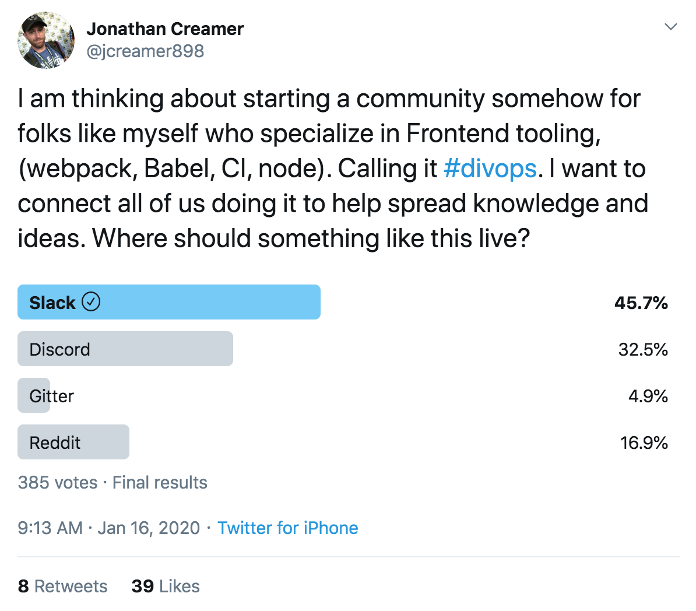

<!-- .slide: data-background="url(../../img/perfect-lib/jeshoots-com-VdOO4_HFTWM-tools-unsplash.jpg) no-repeat center" data-background-size="cover" -->

	

  <h1>The “perfect” library tooling</h1>

   

  <h2>Ben Ilegbodu</h2>

   

  
[@benmvp](https://twitter.com/benmvp) | [benmvp.com](/) | [@jsconfhi](https://twitter.com/jsconfhi)

   

  
February 5, 2020

  

NOTES:
**RESTART THE TIMER!!!!**

- It's "perfect" (in quotes) because it's obviously highly subjective
  * These are naturally my opinions
- But they're birthed out building and consuming hundreds of libraries
- I'm always obsessed with doing things the "best way"
  * Even when I'm just starting
- So these are learnings over the years doing platform-y things
  * In open-source & on the job
  * As well as watch how more prolific folks have done it

=====
<!-- .slide: data-background="url(../../img/perfect-lib/alessandra-caretto-cAY9X4rPG3g-bicycle-unsplash.jpg) no-repeat center" data-background-size="cover" -->

NOTES:
- Whenever we're talking about non-end-user features
  * We need to ask ourselves what exactly is the benefit
  * Does this even matter?
- If it's not a feature for the end user
  * Then it needs to be a feature for the dev
  * So that they can build faster/better for end user
- Otherwise, we find ourselves bike-shedding

/////
<!-- .slide: data-background="url(../../img/perfect-lib/alessandra-caretto-cAY9X4rPG3g-bicycle-unsplash.jpg) no-repeat center" data-background-size="cover" -->

  

    
    

      <a href="https://kentcdodds.com/blog/why-users-care-about-how-you-write-code" target="_blank">
        <em>Why users care about how you write code</em>
      </a>
    

  

NOTES:
- Kent C. Dodds wrote a blog post entitled _Why users care about how you write code_
- He asserts: "The only thing that matters in software is the experience of the user."
- But: "The experience of the user is indirectly, but strongly coupled to how we build software"
- Therefore the post can be summed up as:
  * "Our measure of success should be how well we deliver what the user wants (and no more)"
  * So "our choice of tools should be based on that fundamental goal"

=====
<!-- .slide: data-background="url(../../img/perfect-lib/nesa-by-makers-kwzWjTnDPLk-black-developers-unsplash.jpg) no-repeat center" data-background-size="cover" -->

  

    <h1>Users === Developers</h1>
  

NOTES:
- In this case of our "perfect" library the "focus on the user" principle still applies too
  * Except, this time the "user" **is** the developer
- The library should provide the functionality it's designed to provide
  * In a well thought out API
  * I **won't** be talking about any of that today
- Everything else related to the repo has to also enable developers to build better user experiences
  * It's all the "other stuff" that we'll be talking about today

=====

<!-- .slide: data-background="url(../../img/giphy/stand-up-steph-curry.gif) no-repeat center" data-background-size="cover" -->

  

    <h1 style="font-size: 5em">Stand Up!</h1>
  

NOTES:
- Before we continue can I get everyone to stand up?

/////
<!-- .slide: data-background="#000" -->

  

    
  

NOTES:

- My name is Ben Ilegbodu
- Christian, Husband, Father
- _Family introductions_
- We live in Pittsburg, CA (far east bay)
- Also a Google Developer Expert & Microsoft MVP in Web Technologies

/////

<!-- .element: class="plain" style="width: 75%" -->

NOTES:

- Just recently started working at Stitch Fix
  * As a Frontend Architect
  * Which I'm super excited about
- Stitch Fix is an online personal styling service
  * Take the effort out of shopping by providing a selection of clothes picked just for you
  * And sent to your door on a frequency that you choose
  * Combines technology & data science
  * With an actual human stylist
- We're hiring!
  * Headquarters is in SF
  * But we have remote engineers all over the country
  * Colleagues **James** & **Nathan** are here!

=====
<!-- .slide: data-background="url(../../img/perfect-lib/jeshoots-com-VdOO4_HFTWM-tools-unsplash.jpg) no-repeat center" data-background-size="cover" -->

NOTES:
- Ok, enough about me
- Let's talk about making this perfect repo
- Remember we're shifting are perspective to what our users, the developers, need

=====
<!-- .slide: data-background="url(../../img/perfect-lib/calle-macarone-15wIddvL5dU-emergency-instructions-guide-unsplash.jpg) no-repeat center" data-background-size="cover" -->

  

    <h1>1. Helpful docs</h1>
  

NOTES:
- The first thing we need are helpful docs
- Docs that explain:
  * How to install the library
  * Examples of how to use the library
  * Full API spec once I know how to use the library
- Question: **So what makes this possible?**

/////
<!-- .slide: data-background="url(../../img/perfect-lib/calle-macarone-15wIddvL5dU-emergency-instructions-guide-unsplash.jpg) no-repeat center" data-background-size="cover" -->

  

    <h1>Write docs first!</h1>
  

NOTES:
- My suggestion is to write the docs first **before** implementation
- Why? Becase writting docs is hard
- It ensures that the docs actually get written!
  * There's nothing fun or exiciting about writing docs
  * We don't really wanna write them after we have a working implementation
- **NEXT SLIDE**

/////
<!-- .slide: data-background="url(../../img/perfect-lib/calle-macarone-15wIddvL5dU-emergency-instructions-guide-unsplash.jpg) no-repeat center" data-background-size="cover" -->

  

    
  

NOTES:
- How many times have you seen repo with no docs?
  * I see this happen a lot with monorepo packages
- **NEXT SLIDE**

/////
<!-- .slide: data-background="url(../../img/perfect-lib/calle-macarone-15wIddvL5dU-emergency-instructions-guide-unsplash.jpg) no-repeat center" data-background-size="cover" -->

  

    <h1>Write docs first!</h1>
  

NOTES:
- We write the docs when we know how it works the least
  * After we've implemented, it's much harder to explain
  * It's harder to put yourself in the shoes of a newbie
  * We're more likely to add examples to tell **ourselves** how it should work
- We're more likely to have a cohesive API
  * As we try to make the API easy to use
  * We may need to revise functions we've already documented
  * But not a big deal cuz it's just Markdown files
- We can get feedback from others before implementation
  * In a format that's much better than an implementation spec

/////
<!-- .slide: data-background="url(../../img/perfect-lib/calle-macarone-15wIddvL5dU-emergency-instructions-guide-unsplash.jpg) no-repeat center" data-background-size="cover" -->

  

    

      

        <h3>References</h3>
        <ul>
          <li>is <strong>information-oriented</strong></li>
          <li>describes the machinery</li>
          <li>is accurate and complete</li>
        </ul>
      

      

        <h3>How-to guides</h3>
        <ul>
          <li>is <strong>goal-oriented</strong></li>
          <li>shows how to solve a problem</li>
          <li>is a series of steps</li>
        </ul>
      

      

        <h3>Explanations</h3>
        <ul>
          <li>is <strong>understanding-oriented</strong></li>
          <li>explains</li>
          <li>provides background &amp; context</li>
        </ul>
      

	    

        <h3>Tutorials</h3>
        <ul>
          <li>is <strong>learning-oriented</strong></li>
          <li>allows newbie to get started</li>
          <li>is a lesson</li>
        </ul>
      

    

    

      <a href="https://www.divio.com/blog/documentation/" target="_blank"><em>What nobody tells you about documentation</em></a></a>
    

  

NOTES:
- So what sort of docs should you write?
- Turns out that there are at least **four types** of docs
- Tutorials, How-to guides, Explanation & Reference
  * Let's use `lodash` as an example
- **References** would be the API docs
  * Here are the parameters `pick()` takes and its return value
  * These are great for those who already know how to use `lodash`
- **How-to guides** are examples showing common use cases for lodash functions
  * These are typically paired with API docs
  * More complex ones are recipes or sample repos of how to use one or multiple functions
- **Explanations** are blogs/talks/videos to explain why using `_.chain` is bad
  * They clarify and illuminate a particular topic
  * They go more in depth than the API doc's coverage of a topic
- **Tutorials** would be `lodash` workshops we'd find **Egghead** or **Frontend Masters** or online
  * Lessons that take the reader by the hand to build an app with `lodash`
  * These are perfect newbies who may not even know what `lodash` is
- For your "perfect" library, you should have **References** & **How-to guides**

/////
<!-- .slide: data-background="url(../../img/perfect-lib/calle-macarone-15wIddvL5dU-emergency-instructions-guide-unsplash.jpg) no-repeat center" data-background-size="cover" -->

  

    
  

NOTES:
- So in summary, my suggestion for the repo's `README` is:
- First, ALL the badges you can think of
  * Package version, build states, downloads, etc.
- Short description of the library's purpose
- Installation instructions, _including any necessary peer dependencies_
  * Need to include both `npm` & `yarn` instructions
- Quick guide on how to do common things
- Full API docs
  * May link to other Markdown files
  * Each function or configuration should include a **real-world example**
- Technical details
  * How it's faster, tech used, etc.
  * I hate when this is up top for multiple page scrolls!
- Contribution Guidelines
- License info

=====
<!-- .slide: data-background="url(../../img/perfect-lib/pop-zebra-wp81DxKUd1E-safety-helmets-unsplash.jpg) no-repeat center" data-background-size="cover" -->

  

    <h1>2. TypeScript types</h1>
  

NOTES:
- Maybe be bit controversial
  * My own bias

/////
<!-- .slide: data-background="url(../../img/perfect-lib/pop-zebra-wp81DxKUd1E-safety-helmets-unsplash.jpg) no-repeat center" data-background-size="cover" -->

  

  

NOTES:

=====
<!-- .slide: data-background="url(../../img/perfect-lib/katka-pavlickova-Sf5Q7Ljjf58-volkswagen-beetles-unsplash.jpg) no-repeat center" data-background-size="cover" -->

  

    <h1>3. Bug-free</h1>
  

NOTES:

/////
<!-- .slide: data-background="url(../../img/perfect-lib/katka-pavlickova-Sf5Q7Ljjf58-volkswagen-beetles-unsplash.jpg) no-repeat center" data-background-size="cover" -->

  

  

NOTES:

=====
<!-- .slide: data-background="url(../../img/perfect-lib/russ-ward-18MJRuL4tUE-plasma-cutter-unsplash.jpg) no-repeat center" data-background-size="cover" -->

  

    <h1>4. Fixes come quickly</h1>
  

NOTES:

/////
<!-- .slide: data-background="url(../../img/perfect-lib/russ-ward-18MJRuL4tUE-plasma-cutter-unsplash.jpg) no-repeat center" data-background-size="cover" -->

  

  

NOTES:

=====
<!-- .slide: data-background="url(../../img/esnext/simon-rae-221560-unsplash.jpg) no-repeat center" data-background-size="cover" -->

  

    <h1>Recap</h1>
  

NOTES:

/////
<!-- .slide: data-background="url(../../img/esnext/simon-rae-221560-unsplash.jpg) no-repeat center" data-background-size="cover" -->

  

  

NOTES:

=====
<!-- .slide: data-background="url(../../img/perfect-lib/annie-spratt-rx1iJ59jRyU-gift-box-unsplash.jpg) no-repeat center" data-background-size="cover" -->

  

    <h1><code>@benmvp/cli</code></h1>
  

NOTES:

/////
<!-- .slide: data-background="url(../../img/perfect-lib/annie-spratt-rx1iJ59jRyU-gift-box-unsplash.jpg) no-repeat center" data-background-size="cover" -->

  

  

NOTES:

/////
<!-- .slide: data-background="url(../../img/perfect-lib/annie-spratt-rx1iJ59jRyU-gift-box-unsplash.jpg) no-repeat center" data-background-size="cover" -->

  

    
    

      <a href="https://bit.ly/div-ops-slack" target="_blank">Slack</a>
      | <a href="https://www.reddit.com/r/divops/" target="_blank">Subreddit</a>
    

  

NOTES:
- My friend Jonathan Creamer is passionate about Frontend tooling
- He's coined the term "divops" for the industry
-

=====

<!-- .slide: data-background="url(../../img/webdev/matt-jones-42954-unsplash.jpg) no-repeat center" data-background-size="cover"  -->

	

  <h1>Ben Ilegbodu</h1>

  
<a href="https://twitter.com/benmvp" target="_blank">@benmvp</a> | <a href="/" target="_blank">benmvp.com</a>

  
<a href="mailto:ben@benmvp.com">ben@benmvp.com</a>

  
<a href="https://github.com/benmvp" target="_blank">github/benmvp</a>

   

  
Ask me anything! <a href="http://www.benmvp.com/ama/" target="_blank">benmvp.com/ama</a>

  

NOTES:

- So that's it!
- Just flooded you with a lot of information
  * Reminder: slides are available online
- Hopefully 1, 2 or all 8 of these suggestions will prove useful to you
  * You've got some notes scribbled to go check things out later
  * You don't need to be overwhelmed and try to learn at once
  * Get good at **one thing** and build on it
- **Conference:** Inviting me to share my knowledge/experience with y'all (**Gray**)
- **YOU!** For being such an engaged audience
  * Not going to take any questions
  * But if you've got questions, feel free to find me afterwards
  * I also have swag to give away!
  * But if you're introverted or miss the opportunity, ping me in Twitter or my AMA
- Thank you so much and enjoy the rest of the conference!
