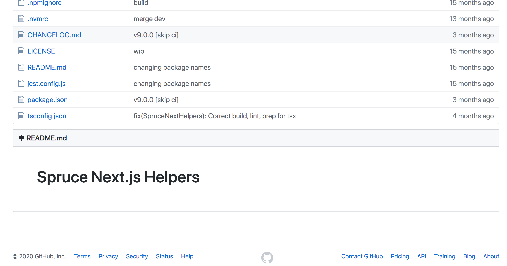
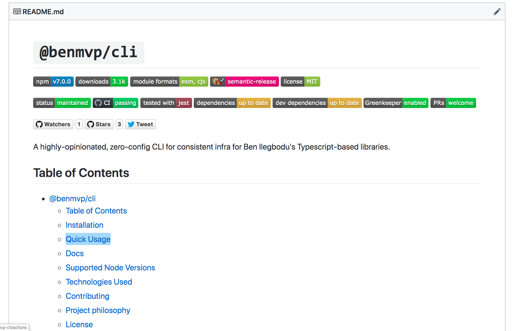
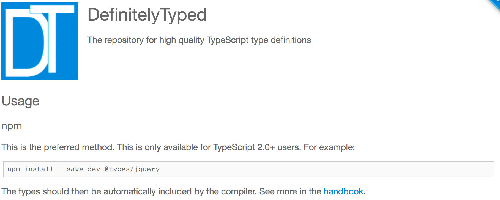
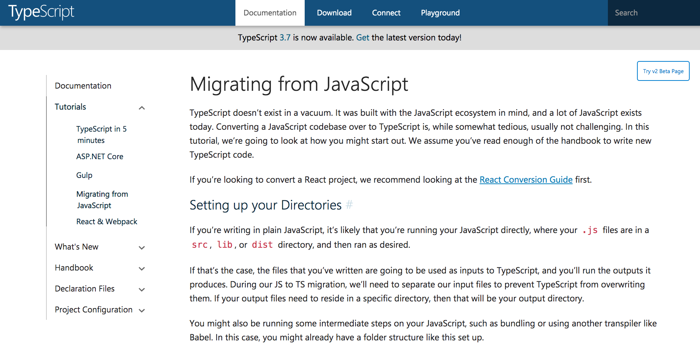
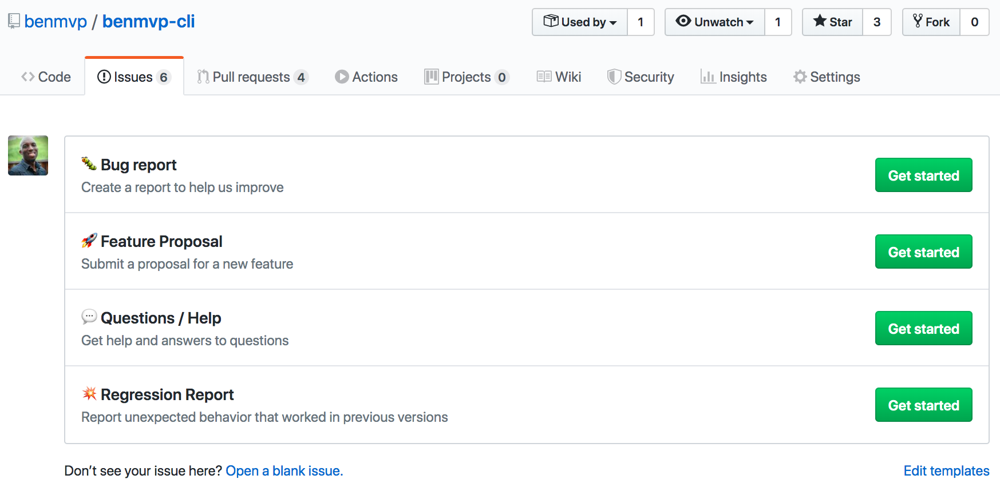
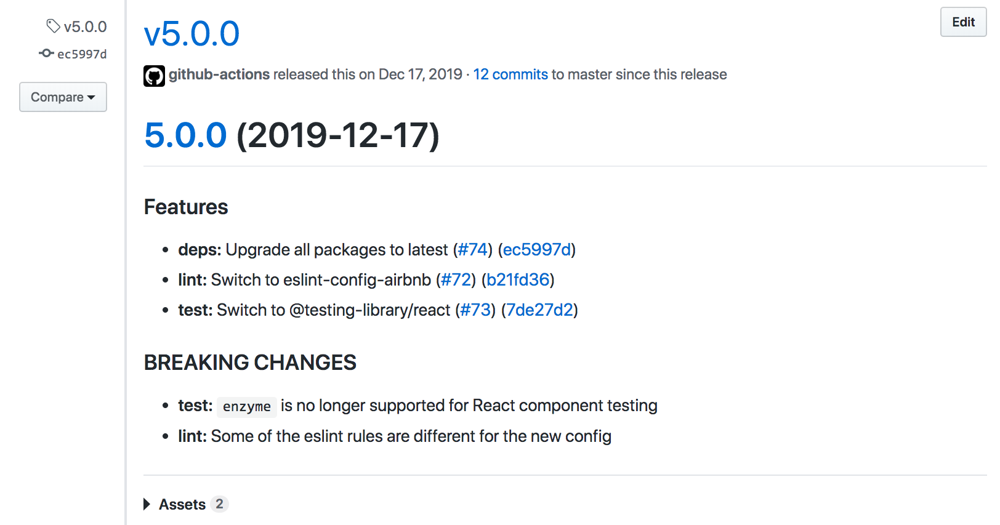
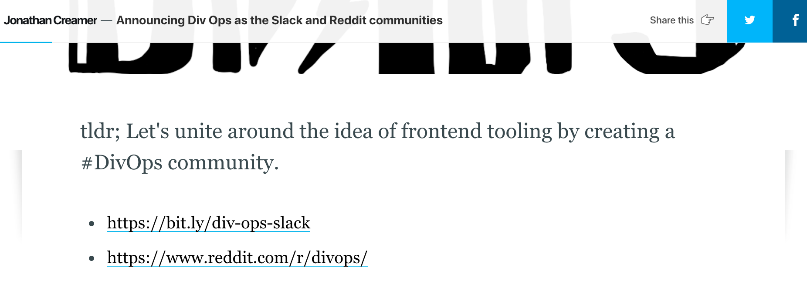

<!-- .slide: data-background="url(../../img/perfect-lib/jeshoots-com-VdOO4_HFTWM-tools-unsplash.jpg) no-repeat center" data-background-size="cover" -->

	

  <h1>The “perfect” library tooling</h1>

   

  <h2>Ben Ilegbodu</h2>

   

  
[@benmvp](https://twitter.com/benmvp) | [benmvp.com](/) | [@jsconfhi](https://twitter.com/jsconfhi)

   

  
February 5, 2020

  

NOTES:
**RESTART THE TIMER!!!!**

- **Aloha!**
- It's "perfect" (in quotes) because it's obviously highly subjective
  * These are naturally my opinions
- But they're birthed out building and consuming hundreds of libraries
- I'm always obsessed with doing things the "best way"
  * Even when I'm just starting
- So these are learnings over the years doing platform-y things
  * In open-source & on the job
  * As well as watch how more prolific folks have done it

=====
<!-- .slide: data-background="url(../../img/perfect-lib/alessandra-caretto-cAY9X4rPG3g-bicycle-unsplash.jpg) no-repeat center" data-background-size="cover" -->

NOTES:
- Whenever we're talking about non-end-user features
  * We need to ask ourselves what exactly is the benefit
  * Does this even matter?
- If it's not a feature for the end user
  * Then it needs to be a feature for the dev
  * So that they can build faster/better for end user
- Otherwise, we find ourselves bike-shedding

/////
<!-- .slide: data-background="url(../../img/perfect-lib/alessandra-caretto-cAY9X4rPG3g-bicycle-unsplash.jpg) no-repeat center" data-background-size="cover" -->

  

    
    

      <a href="https://kentcdodds.com/blog/why-users-care-about-how-you-write-code" target="_blank">
        <em>Why users care about how you write code</em>
      </a>
    

  

NOTES:
- Kent C. Dodds wrote a blog post entitled _Why users care about how you write code_
- He asserts: "The only thing that matters in software is the experience of the user."
- But: "The experience of the user is indirectly, but strongly coupled to how we build software"
- Therefore the post can be summed up as:
  * "Our measure of success should be how well we deliver what the user wants (and no more)"
  * So "our choice of tools should be based on that fundamental goal"

=====
<!-- .slide: data-background="url(../../img/perfect-lib/nesa-by-makers-kwzWjTnDPLk-black-developers-unsplash.jpg) no-repeat center" data-background-size="cover" -->

  

    <h1>Users === Developers</h1>
  

NOTES:
- In this case of our "perfect" library the "focus on the user" principle still applies too
  * Except, this time the "user" **is** the developer
- The library should provide the functionality it's designed to provide
  * In a well thought out API
  * I **won't** be talking about any of that today
- Everything else related to the repo has to also enable developers to build better user experiences
  * It's all the "other stuff" that we'll be talking about today

=====

<!-- .slide: data-background="url(../../img/giphy/stand-up-steph-curry.gif) no-repeat center" data-background-size="cover" -->

  

    <h1 style="font-size: 5em">Stand Up!</h1>
  

NOTES:
- Before we continue can I get everyone to stand up?

/////
<!-- .slide: data-background="#000" -->

  

    
  

NOTES:

- My name is Ben Ilegbodu
- Christian, Husband, Father
- _Family introductions_
- We live in Pittsburg, CA (far east bay)
- Also a Google Developer Expert & Microsoft MVP in Web Technologies

/////

<!-- .element: class="plain" style="width: 75%" -->

NOTES:

- Just recently started working at Stitch Fix
  * As a Frontend Architect
  * Which I'm super excited about
- Stitch Fix is an online personal styling service
  * Take the effort out of shopping by providing a selection of clothes picked just for you
  * And sent to your door on a frequency that you choose
  * Combines technology & data science
  * With an actual human stylist
- We're hiring!
  * Headquarters is in SF
  * But we have remote engineers all over the country
  * Colleagues **James** & **Nathan** are here!

=====
<!-- .slide: data-background="url(../../img/perfect-lib/jeshoots-com-VdOO4_HFTWM-tools-unsplash.jpg) no-repeat center" data-background-size="cover" -->

NOTES:
- Ok, enough about me
- Let's talk about making this perfect repo
- Remember we're shifting are perspective to what our users, the developers, need

=====
<!-- .slide: data-background="url(../../img/perfect-lib/calle-macarone-15wIddvL5dU-emergency-instructions-guide-unsplash.jpg) no-repeat center" data-background-size="cover" -->

  

    <h1>1. Helpful docs</h1>
  

NOTES:
- The first thing we need are helpful docs
- Docs that explain:
  * How to install the library
  * Examples of how to use the library
  * Full API spec once I know how to use the library
- Question: **So what makes this possible?**

/////
<!-- .slide: data-background="url(../../img/perfect-lib/calle-macarone-15wIddvL5dU-emergency-instructions-guide-unsplash.jpg) no-repeat center" data-background-size="cover" -->

  

    <h1>Write docs first!</h1>
  

NOTES:
- My suggestion is to write the docs first **before** implementation
- Why? Becase writting docs is hard
- It ensures that the docs actually get written!
  * There's nothing fun or exiciting about writing docs
  * We don't really wanna write them after we have a working implementation
- **NEXT SLIDE**

/////
<!-- .slide: data-background="url(../../img/perfect-lib/calle-macarone-15wIddvL5dU-emergency-instructions-guide-unsplash.jpg) no-repeat center" data-background-size="cover" -->

  

    
  

NOTES:
- How many times have you seen repo with no docs?
  * I see this happen a lot with monorepo packages
- **NEXT SLIDE**

/////
<!-- .slide: data-background="url(../../img/perfect-lib/calle-macarone-15wIddvL5dU-emergency-instructions-guide-unsplash.jpg) no-repeat center" data-background-size="cover" -->

  

    <h1>Write docs first!</h1>
  

NOTES:
- We write the docs when we know how it works the least
  * After we've implemented, it's much harder to explain
  * It's harder to put yourself in the shoes of a newbie
  * We're more likely to add examples to tell **ourselves** how it should work
- We're more likely to have a cohesive API
  * As we try to make the API easy to use
  * We may need to revise functions we've already documented
  * But not a big deal cuz it's just Markdown files
- We can get feedback from others before implementation
  * In a format that's much better than an implementation spec

/////
<!-- .slide: data-background="url(../../img/perfect-lib/calle-macarone-15wIddvL5dU-emergency-instructions-guide-unsplash.jpg) no-repeat center" data-background-size="cover" -->

  

    

      

        <h3>References</h3>
        <ul>
          <li>is <strong>information-oriented</strong></li>
          <li>describes the machinery</li>
          <li>is accurate and complete</li>
        </ul>
      

      

        <h3>How-to guides</h3>
        <ul>
          <li>is <strong>goal-oriented</strong></li>
          <li>shows how to solve a problem</li>
          <li>is a series of steps</li>
        </ul>
      

      

        <h3>Explanations</h3>
        <ul>
          <li>is <strong>understanding-oriented</strong></li>
          <li>explains</li>
          <li>provides background &amp; context</li>
        </ul>
      

	    

        <h3>Tutorials</h3>
        <ul>
          <li>is <strong>learning-oriented</strong></li>
          <li>allows newbie to get started</li>
          <li>is a lesson</li>
        </ul>
      

    

    

      <a href="https://www.divio.com/blog/documentation/" target="_blank"><em>What nobody tells you about documentation</em></a></a>
    

  

NOTES:
- So what sort of docs should you write?
- Turns out that there are at least **four types** of docs
- Tutorials, How-to guides, Explanation & Reference
  * Let's use `lodash` as an example
- **References** would be the API docs
  * Here are the parameters `pick()` takes and its return value
  * These are great for those who already know how to use `lodash`
- **How-to guides** are examples showing common use cases for lodash functions
  * These are typically paired with API docs
  * More complex ones are recipes or sample repos of how to use one or multiple functions
- **Explanations** are blogs/talks/videos to explain why using `_.chain` is bad
  * They clarify and illuminate a particular topic
  * They go more in depth than the API doc's coverage of a topic
- **Tutorials** would be `lodash` workshops we'd find **Egghead** or **Frontend Masters** or online
  * Lessons that take the reader by the hand to build an app with `lodash`
  * These are perfect newbies who may not even know what `lodash` is
- For your "perfect" library, you should have **References** & **How-to guides**

/////
<!-- .slide: data-background="url(../../img/perfect-lib/calle-macarone-15wIddvL5dU-emergency-instructions-guide-unsplash.jpg) no-repeat center" data-background-size="cover" -->

  

    
  

NOTES:
- So in summary, my suggestion for the repo's `README` is:
- First, ALL the badges you can think of
  * Package version, build states, downloads, etc.
- Short description of the library's purpose
- Installation instructions, _including any necessary peer dependencies_
  * Need to include both `npm` & `yarn` instructions
- Quick guide on how to do common things
- Full API docs
  * May link to other Markdown files
  * Each function or configuration should include a **real-world example**
- Technical details
  * How it's faster, tech used, etc.
  * I hate when this is up top for multiple page scrolls!
- Contribution Guidelines
- License info

=====
<!-- .slide: data-background="url(../../img/perfect-lib/pop-zebra-wp81DxKUd1E-safety-helmets-unsplash.jpg) no-repeat center" data-background-size="cover" -->

  

    <h1>2. TypeScript types</h1>
  

NOTES:
- With helpful docs, the dev can develop their app
- In which case they'll need and want TypeScript types
- TypeScript is a typed superset of JavaScript that compiles to plain JavaScript.
- Now this may be be bit controversial
  * It's certainly my own bias
  * But the numbers back me up (from State of JS survey)

/////
<!-- .slide: data-background="url(../../img/perfect-lib/pop-zebra-wp81DxKUd1E-safety-helmets-unsplash.jpg) no-repeat center" data-background-size="cover" -->

  

    <h2>TypeScript adoption</h2>

    

      

      

        21%
        <a href="http://2016.stateofjs.com/2016/flavors/" target="_blank">2016</a>
      

      

        33%
        <a href="https://2017.stateofjs.com/2017/flavors/results/" target="_blank">2017</a>
      

      

        47%
        <a href="https://2018.stateofjs.com/javascript-flavors/overview/" target="_blank">2018</a>
      

      

        59%
        <a href="https://2019.stateofjs.com/javascript-flavors/" target="_blank">2019</a>
      

    

  

NOTES:
- TypeScript has become super popular
- 2018 was the year everyone "discovered" TypeScript
- Only 1/3 of devs had used TypeScript in 2017
- In 2018, it was 47%
- In 2019, it was nearly 60%
  * Add in those that are interested in learning: **80%**
- 8 out of every 10 developer will need TypeScript definitions from your lib
  * In order to build their app using your lib
- Question: **So what makes it possible to make TypeScript definitions available?**

/////
<!-- .slide: data-background="url(../../img/perfect-lib/pop-zebra-wp81DxKUd1E-safety-helmets-unsplash.jpg) no-repeat center" data-background-size="cover" -->

  

    
    

      <a href="http://definitelytyped.org/" target="_blank">DefinitelyTyped</a>
    

  

NOTES:
- One option is build your app in JavaScript
  * And then add TypeScript type declaration files to DefinitelyTyped
  * A repo of high quality TypeScript type definitions
- Nearly 7000 library type definition files are in the repo
  * `React`, `lodash`, `node`, etc
- The drawback is that you have to know quite a bit of TypeScript to generate these files manually
- And as your library updates, you'll have to keep the types in sync
- This can be a lot of work, so my suggestion is...

/////
<!-- .slide: data-background="url(../../img/perfect-lib/pop-zebra-wp81DxKUd1E-safety-helmets-unsplash.jpg) no-repeat center" data-background-size="cover" -->

  

    
    

      <a href="https://code.visualstudio.com/docs/languages/typescript" target="_blank">VS Code + TypeScript = ❤️</a>
    

  

NOTES:
- Write your library in TypeScript of course!
- There's definitely a learning curve to TypeScript, no doubt
- But in the interest of serving your users (the developers)
  * Writing in TypeScript is the best way to provide type definition files
  * Because they will be auto-generated
  * (more on how they make it into your package later)
- Written definition files are often buggy
  * It's almost better to have no definitions, than buggy ones
- It's also difficult to write types for code written un-typed
  * When code is untyped, we can make shortcut assumptions
  * These aren't allowed in TypeScript
  * So writing types could be challenging or impossible
- Visual Studio Code has great integrations with TypeScript too!
- TypeScript also gives us modern JavaScript so it's a win for us too!

=====
<!-- .slide: data-background="url(../../img/perfect-lib/katka-pavlickova-Sf5Q7Ljjf58-volkswagen-beetles-unsplash.jpg) no-repeat center" data-background-size="cover" -->

  

    <h1>3. Bug-free</h1>
  

NOTES:
- Let's start to get a bit tactical
- So now I know how it works w/ the docs & have my TypeScript types to develop with
- While developing, there's nothing more frustrating than coming across a library bug
- Because we're pretty trusting initially, and think it's us
  * And spend countless hours debugging trying to figure out why it isn't working
- So for our library to be "perfect"
  * Need to do our absolute best to prevent 100% of bugs
- The question of course is
  * **What makes this possible?**

/////
<!-- .slide: data-background="url(../../img/perfect-lib/katka-pavlickova-Sf5Q7Ljjf58-volkswagen-beetles-unsplash.jpg) no-repeat center" data-background-size="cover" -->

  

    

	    

        
		    Type checking
      

      

        
        Linting
      

      

        
        Testing + Coverage
      

  

NOTES:
- The 3-headed monster of Type checking, Linting & Testing + Coverage
- **Type checking** comes with developing in TypeScript, which we just discussed
  * So not only is developing w/ TypeScript good for providing types for our users
  * It's also good for our users because it helps us avoid bugs!
  * The kind of bugs where things are unexpectedly `undefined`
  * Or you refactor a function and forget to update it somewhere
  * With VS Code this can happen _as you develop_
- **Linting** comes via ESLint
  * This also can happen _as you develop_ in your favorite editor
  * TypeScript catches a lot of the non-stylist errors ESLint catches
  * There are still some that are _likely_ errors
  * And then there are additional plugins for environments like React
- **Testing + Coverage** comes with Jest
  * Allows you to write unit tests
  * Can also check what percentage of your code has been tested
  * Unit testing is huge in keeping your lib bug-free
  * But of course it depends on you actually writing tests

/////
<!-- .slide: data-background="url(../../img/perfect-lib/katka-pavlickova-Sf5Q7Ljjf58-volkswagen-beetles-unsplash.jpg) no-repeat center" data-background-size="cover" -->

  

    <h2>Jest Projects</h2>
    
Run typing, linting & tests all within Jest

    <pre class="large"><code class="lang-javascript">{
  "projects": [
    { "displayName": "test" },
    {
      "displayName": "lint",
      "runner": "jest-runner-eslint",
      "testMatch": ["&lt;rootDir>/**/*.ts"]
    }, {
      "displayName": "type",
      "runner": "jest-runner-tsc",
      "testMatch": ["&lt;rootDir>/**/*.ts"]
    }
  ]
}</code></pre>
  

NOTES:
- Typically you'd run typing, linting & testing with 3 separate commands
  * But with Jest projects, you can run them all through Jest
- Jest is a platform that's broken up into 3 main parts
  * The "file collector" in the beginning that determines which files to run on
  * The "error reporter" at the end that displays success or failure
  * The "runner" in the middle which runs what we're validating
- Instead of running the Jest test runner, we can run eslint or `tsc` for Typescript
- This enables to run linting in watch mode, which `eslint` command doesn't support
  * Allows them to be run in parallel
  * But w/ consistent and grouped error messaging
- Simply call `jest` as the `"test"` script in `package.json`

/////
<!-- .slide: data-background="url(../../img/perfect-lib/katka-pavlickova-Sf5Q7Ljjf58-volkswagen-beetles-unsplash.jpg) no-repeat center" data-background-size="cover" -->

  

    <pre class="large"><code class="lang-yaml">name: CI
on: [push, pull_request]
jobs:
  main:
    strategy:
      matrix:
        node: [10, 12, 13]
    steps:
      - uses: actions/checkout@v2
      - uses: actions/setup-node@v1
        with:
          node-version: ${{ matrix.node }}
      - run: npm ci
      - run: npm test
        env:
          CI: true</code></pre>
  

NOTES:
- Lastly, it's not enough that we run our tests locally
  * Need to ensure that all code pushed to origin is validated
- It's vital that you have continuous integration (CI) setup
  * There are many CI tools out there
  * But lately I've been using Github actions and loving it
  * Can use it Github actions w/o registering for another service
- Here's a Github workflow to run tests on Node 10, 12 & 13
  * I always run on the even versions (LTS) and latest odd
  * It's important that you test on multiple Node versions!

/////
<!-- .slide: data-background="url(../../img/perfect-lib/katka-pavlickova-Sf5Q7Ljjf58-volkswagen-beetles-unsplash.jpg) no-repeat center" data-background-size="cover" -->

  

    <h2>Resources</h2>

    <ul>
      <li><a href="https://www.youtube.com/watch?v=ZJ43STkmK-4" target="_blank">Jest as a Platform</a> ⏯️</li>
      <li><a href="https://github.com/typescript-eslint/typescript-eslint/tree/master/packages/eslint-plugin" target="_blank"><code>@typescript-eslint/eslint-plugin</code></a></li>
      <li><a href="https://github.com/jest-community/jest-runner-eslint" target="_blank"><code>jest-runner-eslint</code></a> + <a href="https://github.com/azz/jest-runner-tsc" target="_blank"><code>jest-runner-tsc</code></a></li>
      <li><a href="https://github.com/jest-community/jest-watch-typeahead" target="_blank"><code>jest-watch-typeahead</code></a></li>
      <li><a href="https://github.com/features/actions" target="_blank">Github Actions</a></li>
    </ul>
  

NOTES:
- Here's a video to talk by Rogelio Guzman on "Jest as a Platform"
- Miscellaneous packages for setting up TypeScript + Eslint + Jest
- All about Github actions

=====
<!-- .slide: data-background="url(../../img/perfect-lib/russ-ward-18MJRuL4tUE-plasma-cutter-unsplash.jpg) no-repeat center" data-background-size="cover" -->

  

    <h1>4. Changes come quickly</h1>
  

NOTES:
- Discussed: **Helpful docs**, **TypeScript types** & **Bug free**
  * Let's bring it home
- No matter how hard you test and test, there will inevitably still be bugs
- Or even if you write perfect code...
  - Your users (the developers) will have requests for features you haven't thought of
- So you want to be able to get those changes to your users ASAP
  - From initial request, to up in the npm registry
- **What makes this possible?**

/////
<!-- .slide: data-background="url(../../img/perfect-lib/russ-ward-18MJRuL4tUE-plasma-cutter-unsplash.jpg) no-repeat center" data-background-size="cover" -->

  

    
    <h1>🤦🏾‍♂️</h1>
  

NOTES:
- Well it first starts with the issue itself
- Whether it's a bug or a feature request we want as much details as possible
  - Cryptic issues w/ just some console text are totally unhelpful

/////
<!-- .slide: data-background="url(../../img/perfect-lib/russ-ward-18MJRuL4tUE-plasma-cutter-unsplash.jpg) no-repeat center" data-background-size="cover" -->

  

    
    <h1>👏🏾</h1>
  

NOTES:
- Instead with issue templates you can guide the developer into a flow based on their situation
  - Bug report
  - Feature propsoal
  - Question / Help
  - Regression Report
- And you can tie an issue label w/ each type so that your issues are pre-classified

/////
<!-- .slide: data-background="url(../../img/perfect-lib/russ-ward-18MJRuL4tUE-plasma-cutter-unsplash.jpg) no-repeat center" data-background-size="cover" -->

  

    <pre class="large"><code>&gt; npx envinfo --system --binaries

System:
  OS: macOS High Sierra 10.13.6
  CPU: (4) x64 Intel(R) Core(TM) i5-5257U CPU @ 2.70GHz
  Memory: 47.79 MB / 8.00 GB
  Shell: 3.2.57 - /bin/bash
Binaries:
  Node: 12.14.1 - ~/.nvm/versions/node/v12.14.1/bin/node
  Yarn: 1.15.2 - /usr/local/bin/yarn
  npm: 6.13.4 - ~/.nvm/versions/node/v12.14.1/bin/npm
  Watchman: 4.9.0 - /usr/local/bin/watchman</code></pre>

    <a href="https://github.com/tabrindle/envinfo#readme" target="_blank"><code>envinfo</code></a>
  

NOTES:
- With each template you can have the dev run `envinfo` and include the results
- It's a quick way to get helpful system information
- There are many more CLI options, check out the docs
- There's plenty more advanced things you can do with issues
  - Including bots that respond to messages
  - But this is the bare minimum for a good user experience
- I've got a link to the actual issue templates at the end

/////
<!-- .slide: data-background="url(../../img/perfect-lib/russ-ward-18MJRuL4tUE-plasma-cutter-unsplash.jpg) no-repeat center" data-background-size="cover" -->

  

    <h2>Development Experience files</h2>

    <ul>
      <li><a href="https://github.com/benmvp/benmvp-cli/blob/master/CONTRIBUTING.md" target="_blank"><code>CONTRIBUTING.md</code></a></li>
      <li><a href="https://github.com/nvm-sh/nvm#nvmrc" target="_blank"><code>.nvmrc</code></a></li>
      <li><a href="https://prettier.io/" target="_blank"><code>.prettierrc.json</code></a></li>
      <li><a href="https://help.github.com/en/enterprise/2.19/user/github/building-a-strong-community/creating-a-pull-request-template-for-your-repository" target="_blank"><code>.github/pull_request_template.md</code></a></li>
      <li><a href="https://www.contributor-covenant.org/" target="_blank"><code>CODE_OF_CONDUCT.md</code></a></li>
    </ul>
  

NOTES:
- So now you're making the fix or development the new feature
  - What makes that go fastest?
- **`CONTRIBUTING.md`** - Provides clear guidelines on how to developers can contribute to the library
- **`.nvmrc`** - Locks down your version of Node with NVM so that everyone's using the same version
- **`.prettierrc.json`** - Prettier formats your code the same way for everyone so no arguments
- **`pull_request_template.md`** - Ensures that the correct format is followed for PRs, including necessary info
- **`CODE_OF_CONDUCT.md`** - Covers everything to make sure everyone is behaving properly
- These are all basically communication files to streamline the process

/////
<!-- .slide: data-background="url(../../img/perfect-lib/russ-ward-18MJRuL4tUE-plasma-cutter-unsplash.jpg) no-repeat center" data-background-size="cover" -->

  

    <h2>Library Starter Commands</h2>
    <pre class="large"><code>npx license mit > LICENSE.md
npx gitignore node
npx covgen ben@benmvp.com
git init
npm init -y</code></pre>

    <a href="https://www.swyx.io/writing/oss-repo-setup/" target="_blank">Best Practice Open Source Repo Setup</a>
  

NOTES:
- In fact, if you're starting out the library there are a couple of scripts you can run
- Setup MIT license
- Setup `.gitignore` for Node files
- Generate the `CODE_OF_CONDUCT.md` we talked about
- Initialize `git`
- And initialize your `package.json`

/////
<!-- .slide: data-background="url(../../img/perfect-lib/russ-ward-18MJRuL4tUE-plasma-cutter-unsplash.jpg) no-repeat center" data-background-size="cover" -->

  

    <pre class="large"><code class="lang-json">{
  "main": "lib/cjs/index.js",
  "module": "lib/esm/index.js",
  "jsnext:main": "lib/esm/index.js",
  "sideEffects": false,
  "types": "lib/types/index.d.ts",
  "files": ["lib"],
  "scripts": {
    "build:cjs": "babel src --out-dir lib/cjs --presets babel-cjs.js",
    "build:esm": "babel src --out-dir lib/esm --presets babel-esm.js",
    "build:types": "tsc --declaration --declarationDir lib/types",
    "build": "npx npm-run-all build:**"
  }
}</code></pre>
  

NOTES:
- After the code is written, the PR is created, passes CI & merged
  * We need to get the code out ASAP
- First step is ensuring we're generating the correct formats that can be consumed
  * These days for modern JS you need ESM (tree-shaking) & CJS (standard Node)
  * `"main"` field for CJS
  * `"module"`, `"jsnext:main"` & `"sideEffects"` fields for ESM
  * `"types"` for TypeScript types
  * `"files"` tells which files to include in package instead of using `.npmignore`
- Use `babel` for transpiling TypeScript to vanilla JS
- Use TypeScript for generating TypeScript definition files

/////
<!-- .slide: data-background="url(../../img/perfect-lib/russ-ward-18MJRuL4tUE-plasma-cutter-unsplash.jpg) no-repeat center" data-background-size="cover" -->

  

    <pre class="large"><code class="lang-yaml">name: Release
on:
  push:
    branches: [master]
jobs:
  main:
    steps:
      # Setup & install
      - name: Build package
        run: npm run build

      - name: Release new version
        run: npx semantic-release</code></pre>

    <a href="https://github.com/semantic-release/semantic-release" target="_blank"><code>semantic-release</code></a>
  

NOTES:
- With building in place, we can achieve continuous deployment with `semantic-release`
  * Meant to be executed in CI env after every successful build on release branch
  * Makes releases "unromantic & unsentimental"
  * I can merge a PR on my phone and it get automatically pushed to npm in 5 mins
  * No having to manually push a version commit or run a script locally
- Follows Angular Commit Message Conventions to determine whether it's major, minor or patch release

/////
<!-- .slide: data-background="url(../../img/perfect-lib/russ-ward-18MJRuL4tUE-plasma-cutter-unsplash.jpg) no-repeat center" data-background-size="cover" -->

  

    
  

NOTES:
- The releases show up in the Github releases tab
- But the `package.json` in git is never updated

/////
<!-- .slide: data-background="url(../../img/perfect-lib/russ-ward-18MJRuL4tUE-plasma-cutter-unsplash.jpg) no-repeat center" data-background-size="cover" -->

  

    

    
<a href="https://www.npmjs.com/package/url-lib" target="_blank">npm</a> (beta) | <a href="https://unpkg.com/browse/url-lib@3.0.3/" target="_blank">unpkg</a> | <a href="https://www.jsdelivr.com/package/npm/url-lib" target="_blank">jsDelivr</a>

  

NOTES:
- Lastly, you can browse the package to make sure everything was released properly

/////
<!-- .slide: data-background="url(../../img/perfect-lib/russ-ward-18MJRuL4tUE-plasma-cutter-unsplash.jpg) no-repeat center" data-background-size="cover" -->

  

    <h2>Resources</h2>

    <ul>
      <li><a href="https://github.com/benmvp/benmvp-cli/tree/master/.github/ISSUE_TEMPLATE" target="_blank">Example Issue templates</li>
      <li><a href="https://raw.githubusercontent.com/benmvp/benmvp-cli/master/.github/pull_request_template.md" target="_blank">Example PR template</li>
      <li><a href="https://github.com/benmvp/benmvp-cli/blob/master/.github/workflows/validate-pr.yml" target="_blank">Example PR Validator</a></li>
      <li><a href="https://github.com/benmvp/benmvp-cli/blob/master/src/commands/build/babel-config-cjs.js" target="_blank">Example <code>babel-cjs.js</code></a>  / <a href="https://github.com/benmvp/benmvp-cli/blob/master/src/commands/build/babel-config-esm.js" target="_blank"><code>babel-esm.js</code></a></li>
      <li><a href="https://github.com/prettier/eslint-plugin-prettier" target="_blank"><code>eslint-plugin-prettier</code></a></li>
      <li><a href="https://github.com/typescript-eslint/typescript-eslint/tree/master/packages/eslint-plugin" target="_blank"><code>@typescript-eslint/eslint-plugin</code></a></li>
      <li><a href="https://webpack.js.org/guides/tree-shaking/#mark-the-file-as-side-effect-free" target="_blank"><code>sideEffects</code> in <code>package.json</code></a></li>
      <li><a href="https://medium.com/@jdxcode/for-the-love-of-god-dont-use-npmignore-f93c08909d8d" target="_blank"><em>For the love of god, don’t use .npmignore</em></a></li>
      <li><a href="https://medium.com/@vcarl/problems-with-npm-link-and-an-alternative-4dbdd3e66811" target="_blank"><em>Testing npm packages before publishing</em></a></li>
      <li><a href="https://greenkeeper.io/" target="_blank">Greenkeeper</li>
    </ul>
  

NOTES:
- Tons more resources on little details I wasn't able to cover

=====
<!-- .slide: data-background="url(../../img/esnext/simon-rae-221560-unsplash.jpg) no-repeat center" data-background-size="cover" -->

  

    <h1>Recap</h1>
  

NOTES:
- Wow! That was a lot of stuff!
- Chances are you responded to that Slack message 😉
- Let's quickly recap what we discussed
- But instead of grouping by user need
- Let's group it by how you'll be implementing the infra
- As we'll see it's a mix of technical things and communication things
- Just like the "perfect" developer is a mix of technical skills and comm skills

/////
<!-- .slide: data-background="url(../../img/esnext/simon-rae-221560-unsplash.jpg) no-repeat center" data-background-size="cover" -->

  

    

      

        <h3>Development</h3>
        <ul>
          <li><a href="https://www.typescriptlang.org/" target="_blank">Modern JS</a></li>
          <li><a href="https://prettier.io/" target="_blank">Prettier</a></li>
          <li><a href="https://eslint.org/" target="_blank">ESLint</a></li>
          <li><a href="https://www.typescriptlang.org/" target="_blank">Type checking</a></li>
          <li><a href="https://code.visualstudio.com/" target="_blank">Editor integrations</a></li>
        </ul>
      

      

        <h3>Test / CI</h3>
        <ul>
          <li><a href="https://github.com/features/actions" target="_blank">Github actions</a></li>
          <li><a href="https://jestjs.io/" target="_blank">Unit testing + coverage</a></li>
          <li><a href="https://eslint.org/" target="_blank">Linting</a></li>
          <li><a href="https://www.typescriptlang.org/" target="_blank">Type checking</a></li>
          <li><a href="https://www.youtube.com/watch?v=ZJ43STkmK-4" target="_blank">Jest as a platform</a></li>
        </ul>
      

	    

        <h3>Build / CD</h3>
        <ul>
          <li><a href="https://github.com/features/actions" target="_blank">Github actions</a></li>
          <li><a href="https://babeljs.io/" target="_blank">Transpilation targets</a></li>
          <li><a href="https://docs.npmjs.com/files/package.json" target="_blank"><code>package.json</code> metadata</a></li>
          <li><a href="https://medium.com/@vcarl/problems-with-npm-link-and-an-alternative-4dbdd3e66811" target="_blank">Library verification</a></li>
          <li><a href="https://github.com/semantic-release/semantic-release" target="_blank">Semantic release</a></li>
          <li><a href="https://unpkg.com/" target="_blank">Package browsing</a></li>
        </ul>
      

      

        <h3>Repo files</h3>
        <ul>
          <li>API & example docs</li>
          <li>Badges</li>
          <li><a href="https://github.com/benmvp/benmvp-cli/blob/master/CONTRIBUTING.md" target="_blank"><code>CONTRIBUTING.md</code></a></li>
          <li><a href="https://github.com/simonv3/covenant-generator" target="_blank"><code>CODE_OF_CONDUCT.md</code></a></li>
          <li><a href="https://www.npmjs.com/package/license" target="_blank"><code>LICENSE</code></a></li>
          <li><a href="https://help.github.com/en/github/building-a-strong-community/about-issue-and-pull-request-templates" target="_blank">Issue & PR templates</a></li>
        </ul>
      

  

NOTES:
- Here it all is in one slide!
- Your **development experience** starts with getting to write in modern JS (via TypeScript)
- And with a nice editor like VS Code...
  * Can get prettier formatting, eslint & type checking in the editor
- For **testing & continuous integration (CI)**, try use the new Github actions
- And with Jest as a platform...
  * You can run Unit test, linting & type checking all at once
- **Build & continuous delivery (CD)** are key
- Use Babel for transpiling (TypeScript for type-checking)
  * Probably only need to target CommonJS & ES Module formats
  * And there are a plethora of `package.json` fields to set
- You'll wanna your CI tool to automatically release new versions from commits merged to `master`
- And we now have ways to ensure that what we release looks good
- Lastly there are lots of other **repo files**
  * Docs for your users to figure out how to use your library
  * Other files to make communication with you easy & safe

=====
<!-- .slide: data-background="url(../../img/perfect-lib/annie-spratt-rx1iJ59jRyU-gift-box-unsplash.jpg) no-repeat center" data-background-size="cover" -->

  

    <h1><code>@benmvp/cli</code></h1>
  

NOTES:
- Sooooo that's a lot of things to try to do
  * Especially if you haven't set up some of them before
  * I count over **20** different things!
- Even for me I don't wanna try to set those up each time
- So I created a zero-config CLI tool, called `@benmvp/cli` to abstract all that work
  * Everything but the docs
- The CLI has some options, so you could totally use it
  * But I built it for myself, so don't expect any PRs to make it more configurable!

/////
<!-- .slide: data-background="url(../../img/perfect-lib/annie-spratt-rx1iJ59jRyU-gift-box-unsplash.jpg) no-repeat center" data-background-size="cover" -->

  

    <h2><code>@benmvp/cli</code></h2>
    <ul>
      <li><a href="https://github.com/benmvp/benmvp-cli/blob/master/docs/cli/create.md" target="_blank"><code>npx @benmvp/cli create</code></a></li>
      <li><a href="https://github.com/benmvp/benmvp-cli/blob/master/docs/cli/test.md" target="_blank"><code>benmvp test</code></a></li>
      <li><a href="https://github.com/benmvp/benmvp-cli/blob/master/docs/cli/start.md" target="_blank"><code>benmvp start</code></a></li>
      <li><a href="https://github.com/benmvp/benmvp-cli/blob/master/docs/cli/build.md" target="_blank"><code>benmvp build</code></a></li>
      <li><a href="https://github.com/benmvp/benmvp-cli/blob/master/docs/cli/integrate.md" target="_blank"><code>benmvp integrate</code></a></li>
    </ul>
  

NOTES:
- It works a lot like `react-scripts` if you've ever used Create React App before
- You run `npx @benmvp/cli create` (with name of app) and it initializes an app for you
  * Includes everything
  * Github actions CI/CD, repo files, sets all the `package.json` fields
  * Adds `@benmvp/cli` as a dev dependency & adds scripts for the other commands
- `test` runs unit tests, linting & type checking with Jest
- `start` is for dev, it runs `test` in watch mode based on any changes
- `build` transpiles into the module targets & generates type definitions
- `integrate` is something pretty cool that ideally deserves some devoted time
  * Basically packages up the library just like it'll be in the registry
  * Then run "integration" tests on it to make sure the lib can be used just like user would
  * Catches cases where all unit tests pass but I forgot to `export`
- It uses itself to dev, test & build itself
  * The "perfect" repo creating other "perfect" repos

/////
<!-- .slide: data-background="url(../../img/perfect-lib/annie-spratt-rx1iJ59jRyU-gift-box-unsplash.jpg) no-repeat center" data-background-size="cover" -->

  

    
    

      <a href="https://www.jonathancreamer.com/announcing-div-ops/" target="_blank">Announcing Div Ops as the Slack and Reddit communities</a>
    

  

NOTES:
- One last thing...
- If you find this stuff interesting
- My friend Jonathan Creamer is also passionate about Frontend tooling
- It's becoming more of a thing and even a role at companies
- He's wanting to build a community around this skillset
- He coined the term **"DivOps"** for this community
- There's a Slack group & sub-Reddit to join

=====

<!-- .slide: data-background="url(../../img/webdev/matt-jones-42954-unsplash.jpg) no-repeat center" data-background-size="cover"  -->

	

  <h1>Ben Ilegbodu</h1>

  
<a href="https://twitter.com/benmvp" target="_blank">@benmvp</a> | <a href="/" target="_blank">benmvp.com</a>

  
<a href="mailto:ben@benmvp.com">ben@benmvp.com</a>

  
<a href="https://github.com/benmvp" target="_blank">github/benmvp</a>

   

  
Ask me anything! <a href="http://www.benmvp.com/ama/" target="_blank">benmvp.com/ama</a>

  

NOTES:

- So that's it!
- Just flooded you with a lot of information
  * Reminder: slides are available online
- Hopefully there are a few new things you've learned
  * I've also likely forgotten some things so I'd love your feedback!
- **Conference:** Inviting me to share my knowledge/experience with y'all (**Kelly** + crew)
- **YOU!** For coming to the talk
  * The "hallway track" is always an option
  * And it is Hawaii, so you've got lots of options!
  * Not going to take any questions
  * But if you've got questions, feel free to find me afterwards
  * I also have **swag** to give away!
  * But if you're introverted or miss the opportunity, ping me in Twitter or my AMA
- Thank you so much and enjoy the rest of the conference!
- **Mahalo!**
