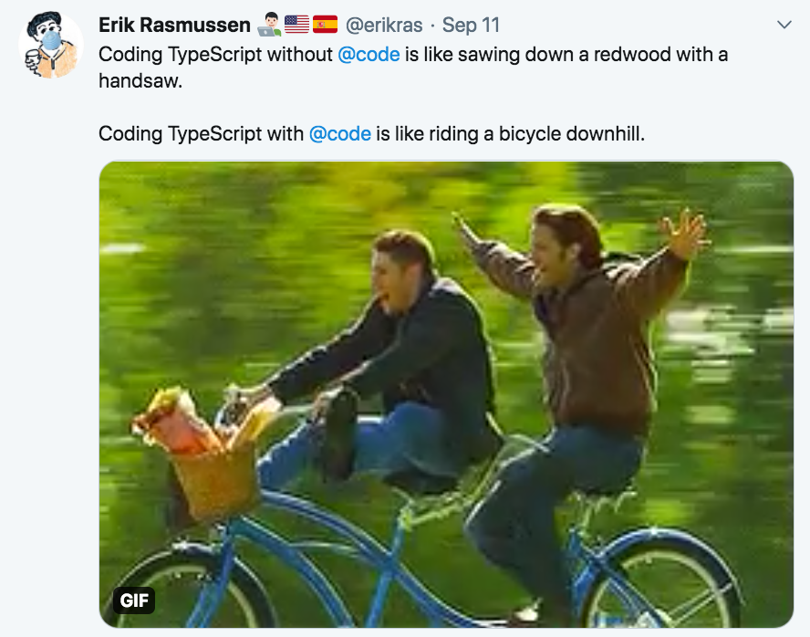
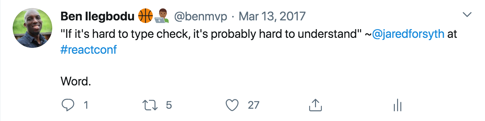

<!-- .slide: data-state="title-page" data-background="url(../../img/ts-react/typewriter-james-pond-Z0uzZSM5i4M-unsplash.jpg) no-repeat center" data-background-size="cover" -->

	

  <h1>TypeScript + React = ❤️</h1>

   

  <h2>Ben Ilegbodu</h2>

   

  
[@benmvp](https://twitter.com/benmvp) | [benmvp.com](https://www.benmvp.com/?utm_source=benmvp&utm_medium=slides&utm_campaign=tsconf-2020) | [#TSConf](https://twitter.com/hashtag/TSConf)

   

  
October 9, 2020

  

NOTES:
**RESTART THE TIMER!!!!**

- Hello there!
- Welcome to "TypeScript + React = ❤️"
  * Kinda wish I had used 🔥 instead
  * Because that's how awesome I think the partnership is
- So TSConf is intended to be framework agnostic
  - Where we get to learn all the nitty gritty about TS
- But they still felt that this content would be valuable
  * So they asked me to do a deep dive into React + TS
  * And I'm excited to share with you!

- **Slides are available online**
- I include lots of links in my slides so you'll definitely wanna grab them

=====
<!-- .slide: data-background="url(../../img/perfect-lib/alessandra-caretto-cAY9X4rPG3g-bicycle-unsplash.jpg) no-repeat center" data-background-size="cover" -->

	

    
  

NOTES:
- I hear people ask “Why do I need to learn TypeScript when I already am productive with JavaScript”
- Especially since there will be a somewhat steep learning curve
- I argue it’s a matter of perspective

/////
<!-- .slide: data-background="url(../../img/perfect-lib/alessandra-caretto-cAY9X4rPG3g-bicycle-unsplash.jpg) no-repeat center" data-background-size="cover" -->

	

    
  

NOTES:
- Why do people who are productive in making apps with jQuery decide to learn something like React?

/////
<!-- .slide: data-background="url(../../img/perfect-lib/alessandra-caretto-cAY9X4rPG3g-bicycle-unsplash.jpg) no-repeat center" data-background-size="cover" -->

	

    
  

NOTES:
- They’ll find themselves struggling to do things in React that they can already do easily w/ jQuery
  * Manipulating the DOM, for instance
  * They’ll be “fighting” React instead of actually building the app in the beginning
- But once they pass the learning curve
  * They’ll be able to build bigger and more sophisticated apps
  * AND likely less buggy apps too because they’re not maintaining state in the DOM triggered by events
- The early struggle is because they already knew how to web dev with jQuery
- If they learned web dev from the start with React that sense of “is this necessary?” likely wouldn't be there

/////
<!-- .slide: data-background="url(../../img/perfect-lib/alessandra-caretto-cAY9X4rPG3g-bicycle-unsplash.jpg) no-repeat center" data-background-size="cover" -->

  

    

	    

        
      

      

        
      

    

  

NOTES:
- It’s the same for JavaScript vs TypeScript
- Because you already know how to build React apps in JavaScript, jumping to TypeScript may not seem worth it
- But if you were learning TypesScript from the beginning your perspective would be different

/////
<!-- .slide: data-background="url(../../img/perfect-lib/alessandra-caretto-cAY9X4rPG3g-bicycle-unsplash.jpg) no-repeat center" data-background-size="cover" -->

  

    

	    

        
      

      

        
      

    

  

NOTES:
- So most talks on React + TypeScript just teach how to use TypeScript w/ React
- They are assuming you already wanna use TS and just want to know the details

/////
<!-- .slide: data-background="url(../../img/perfect-lib/alessandra-caretto-cAY9X4rPG3g-bicycle-unsplash.jpg) no-repeat center" data-background-size="cover" -->

  

    
    

      <a href="https://kentcdodds.com/blog/why-users-care-about-how-you-write-code" target="_blank">
        <em>Why users care about how you write code</em>
      </a>
    

  

NOTES:
- But whenever we're talking about non-end-user features such as the coding language
  * We need to ask ourselves what exactly is the benefit?
  * Does this even matter?
- Because if it's **not** a feature for the end user
  * Then it **needs** to be a feature for the developer
  * So that _they_ can build faster, better or more reliably for the end user
- Otherwise, we find ourselves bike-shedding
- Kent C. Dodds wrote a blog post that says exactly that
  * We need to measure success based on how well we can deliver what the user wants
  * Our choice of tooling should be based on that goal (and no more)

/////
<!-- .slide: data-background="url(../../img/perfect-lib/alessandra-caretto-cAY9X4rPG3g-bicycle-unsplash.jpg) no-repeat center" data-background-size="cover" -->

	

    
  

NOTES:
- Users definitely don’t want a buggy experience and of course, neither do we
- Most errors don’t occur when we're writing initially
  - But usually when making changes (i.e. refactoring)
  - This can be 2 **minutes** later or 2 **months** later
  - That's when bugs get introduced
- Common errors or classes of bugs are:
  - `undefined` is not object
  - Variable `x` is not a function
  - Then there's changing interfaces
    - Like deprecating features
    - Or changing the types of parameters
- I'm gonna spend rest of our time showing TS features that can prevent these bugs
- But I also hope to show you that you can prevent errors w/o writing too much TS
- There's lots TS can do, which is the purpose of the whole conference
  * But I am going to focus on TS for the React world
- So as a heads up, I'm assuming that you have developed in React before
  * But you know little to know TypeScript
  * Even if you know lots of TS you'll get tons out of this
  * But for those that don't know TS I will be explaining the concepts

=====

<!-- .slide: data-background="#000" -->

  

    
  

NOTES:

- My name is Ben Ilegbodu
- Christian, Husband, Father
- _Family introductions_
- We live in Pittsburg, CA (SF Bay Area)
- Also a Google Developer Expert & Microsoft MVP in Web Technologies

/////

<!-- .element: class="plain" style="width: 75%" -->

NOTES:

- I'm a Principal Frontend Engineer at Stitch Fix
- Stitch Fix is an online personal styling service
  * Combines technology & data science
  * With an actual human stylist
  * Take the effort out of shopping by providing a selection of clothes picked just for you
  * And sent to your door on a frequency that you choose
- We're hiring!
  * Headquarters is in SF
  * But we have remote engineers all over the country

/////

  

    

      

        
      

      

       <ul>
        <li><a href="https://www.benmvp.com/minishops/typescript-for-react-developers/?utm_source=benmvp&utm_medium=slides&utm_campaign=tsconf-2020" target="_blank">TypeScript for React Developers</a></li>
        <li><a href="https://www.benmvp.com/minishops/zero-to-react-with-hooks/?utm_source=benmvp&utm_medium=slides&utm_campaign=tsconf-2020" target="_blank">Zero to React with Hooks</a></li>
        <li><a href="https://www.benmvp.com/minishops/migrating-to-react-hooks/?utm_source=benmvp&utm_medium=slides&utm_campaign=tsconf-2020" target="_blank">Migrating to React Hooks</a></li>
        <li><a href="https://www.benmvp.com/minishops/sharing-react-component-logic/?utm_source=benmvp&utm_medium=slides&utm_campaign=tsconf-2020" target="_blank">Sharing React Component Logic</a></li>
      </ul>
    

  

NOTES:
- I periodically host a series of short, 3-hour remote React workshops
  * I call them "minishops"
- One of them is called "TypeScript for React Developers"
  * So if you're interested in hands-on learning of using TS + React you should check it out
  * As well as the others listed
- I'm doing a free giveaway for conference attendees
  * Go to my site (benmvp.com) and check out the minishops page
  * Find **one** you like AND can attend
  * Send out a tweet w/ the link and tag me in
  * I'll pick one and give you a free ticket
  * Bonus points if you include a selfie of you watching this talk 😄

=====
<!-- .slide: data-background="url(../../img/ts-react/grass-field-ales-krivec-4miBe6zg5r0-unsplash.jpg) no-repeat center" data-background-size="cover" -->

  

    <h2>TypeScript React function component</h2>

    <pre class="large"><code class="lang-typescript">interface AppProps {
  // define props and types
}

const App = (props: AppProps) => {
  // use props and render UI
}</code></pre>

    

    

  

NOTES:
- But enough about me
  * Let's dive into React + TS
- One thing I want to make clear as we begin...
- A React component is just a function
- There's nothing _really_ special about it
- Takes props in and returns JSX
- Can be treated & typed like any other TS function
- To start off, you use an `interface` to define the props
  * and is the type of the `props` argument
- You can name `AppProps` anything you like
- You _can_ define class components in TS, but I'm only gonna show functions
- Hooks are the future, so we should be moving that way anyway

=====
<!-- .slide: data-background="url(../../img/ts-react/mixing-console-abigail-keenan-QdEn9s5Q_4w-unsplash.jpg) no-repeat center" data-background-size="cover" -->

  

    <h1>1. Props</h1>
  

NOTES:
- Let's talk all about how props typing works in TS

/////
<!-- .slide: data-background="url(../../img/ts-react/mixing-console-abigail-keenan-QdEn9s5Q_4w-unsplash.jpg) no-repeat center" data-background-size="cover" -->

  

    <h2>I) Props must be listed</h2>

    <pre class="large"><code class="lang-typescript">interface AppProps {
  message: string
}

const App = (props: AppProps) => {
  if (props.loading) {
    return Loading...
  }

  return 
{props.message}

}</code></pre>
    <pre class="large"><code class="lang-shell">Property 'loading' does not exist on type 'Props'</code></pre>
    

  

NOTES:
- With TS, props cannot be used within a component without a definition
- How many times have you had props in a component used w/o any `PropTypes` definition?
- There are ESLint rules to catch this sort of thing, but they are limited

/////
<!-- .slide: data-background="url(../../img/ts-react/mixing-console-abigail-keenan-QdEn9s5Q_4w-unsplash.jpg) no-repeat center" data-background-size="cover" -->

  

    <h2>I) Props must be listed</h2>

    <pre class="large"><code class="lang-typescript">
&lt;App message="hi" count={5} /&gt;

</code></pre>
    <pre class="large"><code class="lang-shell">Property 'count' does not exist on type
'IntrinsicAttributes & AppProps'</code></pre>
  

NOTES:
- Similarly, you can't pass a prop if it hasn't been defined
- How many times have you seen a prop being passed to a component
  * And it's not in the `PropTypes`
  * And it doesn't _seem_ to be used in the code
  * But you're afraid to remove it because... you're just not sure
  * TypeScript gives you the confidence because it wouldn't allow it
- The error message can seem a bit cryptic to be honest
  * But as you encounter them more often you'll get used to them

/////
<!-- .slide: data-background="url(../../img/ts-react/mixing-console-abigail-keenan-QdEn9s5Q_4w-unsplash.jpg) no-repeat center" data-background-size="cover" -->

  

    <h2>II) Props are required by default</h2>

    <pre class="large"><code class="lang-typescript">interface AppProps {
  players: string[]
  count: number
}

const App = (props: AppProps) => {
  const topPlayers = props.players.slice(0, props.count)

  // render topPlayers in UI
}</code></pre>
  

NOTES:
- React `PropTypes` are optional by default
- I see lots of examples where `PropTypes` are defined
  * But none of them are marked with `isRequired`
  * But if you look at the code, the props are _definitely_ required
  * They are bugs waiting to happen
- TypeScript interface properties are **required** by default
  * So without doing anything special you're guaranteed that the values will exist
  * Nice!

/////
<!-- .slide: data-background="url(../../img/ts-react/mixing-console-abigail-keenan-QdEn9s5Q_4w-unsplash.jpg) no-repeat center" data-background-size="cover" -->

  

    <h2>II) Props are required by default</h2>

    <pre class="large"><code class="lang-typescript">
&lt;App
  names={['Bron', 'Kawhi', 'KD', 'Giannis', 'AD']}
/&gt;

</code></pre>
    <pre class="large"><code class="lang-shell">Property 'count' is missing in type '{ names: string[]; }'
but required in type 'AppProps'</code></pre>
  

NOTES:
- So If I call the component, leaving off a required prop (`count` here)
- It will yell at me, and again not compile

/////
<!-- .slide: data-background="url(../../img/ts-react/mixing-console-abigail-keenan-QdEn9s5Q_4w-unsplash.jpg) no-repeat center" data-background-size="cover" -->

  

    <h2>II) Props are required by default</h2>

    <pre class="large"><code class="lang-typescript">interface AppProps {
  players: string[]
  count?: number
}

const App = ({ players, count = 2 }: AppProps) => {
  const topPlayers = players.slice(0, count)

  // render topPlayers in UI
}</code></pre>
    

  

NOTES:
- You can use `?` to denote a prop is optional
- Which means of course its value is `undefined` when not passed
- You can then use object destructuring + defaulting to replace `defaultProps`
- Now if I omit `count` when rendering `<App />`
  * There's no error and it'll default to `2`
- This is typically how TS React function components look

/////
<!-- .slide: data-background="url(../../img/ts-react/mixing-console-abigail-keenan-QdEn9s5Q_4w-unsplash.jpg) no-repeat center" data-background-size="cover" -->

  

    <h2>III) Prop refactors are caught</h2>

    <pre class="large"><code class="lang-typescript">
&lt;App
  id={2}
  players={['Bron', 'Kawhi', 'KD', 'Giannis', 'AD']}
/&gt;

</code></pre>
    <pre class="large"><code class="lang-shell">Type 'number' is not assignable to type 'string'.</code></pre>
    

  

NOTES:
- How about those times where you've changed the type of a prop?
  * Like `id` going from a `number` to a `string`
  * And now you have to search & replace to fix all the places
  * But did you get them all? How can you be 100% sure?
- In TS all the places using it **must** be updated
  * Otherwise, you get this error

/////
<!-- .slide: data-background="url(../../img/ts-react/mixing-console-abigail-keenan-QdEn9s5Q_4w-unsplash.jpg) no-repeat center" data-background-size="cover" -->

  

    <h2>III) Prop refactors are caught</h2>

    <pre class="large"><code class="lang-typescript">
&lt;App
  id="2"
  names={['Bron', 'Kawhi', 'KD', 'Giannis', 'AD']}
/&gt;

</code></pre>
    <pre class="large"><code class="lang-shell">Property 'names' does not exist on type
'IntrinsicAttributes & AppProps'.</code></pre>
    

  

NOTES:
- If you change the name of a prop, all the places using it must be updated
  * Let's say the prop was originally `names` and I changed it to `players`
  * But I forgot to change this place
  * TS will complain
- A derivative of this is when you mistype a prop
  * TS will complain immediately as well

/////
<!-- .slide: data-background="url(../../img/ts-react/mixing-console-abigail-keenan-QdEn9s5Q_4w-unsplash.jpg) no-repeat center" data-background-size="cover" -->

  

    <h2>IV) Can't avoid defining complex objects</h2>

    <pre class="large"><code class="lang-typescript">const App = ({ user }) => {
  const { city, isPrimary } = user.addresses.shipping

  // render UI using city and isPrimary
}</code></pre>
    

  

NOTES:
- Typically if we're getting data from an API, its deeply nested data
- Without prop types, it's just this huge object w/ undocumented properties

/////
<!-- .slide: data-background="url(../../img/ts-react/mixing-console-abigail-keenan-QdEn9s5Q_4w-unsplash.jpg) no-repeat center" data-background-size="cover" -->

  

    <h2>IV) Can't avoid defining complex objects</h2>

    <pre class="large"><code class="lang-typescript">const App = ({ user }) => {
  const { city, isPrimary } = user.addresses.shipping

  // render UI using city and isPrimary
}
App.propTypes = {
  user: PropTypes.shape({}).isRequired
}</code></pre>
    

  

NOTES:
- We try to put in lint rules to force definitions of object prop types
  * But we'll do `PropTypes.object` or `PropTypes.shape({})`
  * It's a lot of work to define a deeply nested shape
  * And then it gets out of date as new stuff gets added
  * There's no enforcement that it's fully up-to-date, `eslint` can only do so much

/////
<!-- .slide: data-background="url(../../img/ts-react/mixing-console-abigail-keenan-QdEn9s5Q_4w-unsplash.jpg) no-repeat center" data-background-size="cover" -->

  

    <h2>IV) Can't avoid defining complex objects</h2>

    <pre class="large"><code class="lang-typescript">interface Address { /\* city, isPrimary, etc \*/ }

interface User {
  name: string
  addresses: {
    shipping: Address
    billing?: Address
  }
}

interface AppProps {
  user: User
}</code></pre>
  

NOTES:
- TS is now getting in your way and preventing you from being lazy
  * But also saving you because you have to define _exactly_ what's available
  * You can't access properties off the `user` prop unless you define what they are
- In this example, the `Address` interface may also be a type defined in a shared place
  * So if we decide to rename `isPrimary` to `primary` in `Address`
  * We'll get TS errors in the `App` component
- So TS is very beneficial in refactors

/////
<!-- .slide: data-background="url(../../img/ts-react/mixing-console-abigail-keenan-QdEn9s5Q_4w-unsplash.jpg) no-repeat center" data-background-size="cover" -->

  

    <h2>V) Function props have explicit signature</h2>

    <pre class="large"><code class="lang-typescript">const Input = ({ name, value, onChange }) => {
  // do input-y stuff & call onChange
}

Input.propTypes = {
  variant: PropTypes.enum(['filled', 'outlined']).isRequired,
  value: PropTypes.string.isRequired,
  onChange: PropTypes.func.isRequired,
}</code></pre>
    

  

NOTES:
- This one is probably my favorite
- With prop types it's just `PropTypes.func`
- There's nothing that tells the user of the component what parameters it'll pass when called
  * Or if it expects anything returned

/////
<!-- .slide: data-background="url(../../img/ts-react/mixing-console-abigail-keenan-QdEn9s5Q_4w-unsplash.jpg) no-repeat center" data-background-size="cover" -->

  

    <h2>V) Function props have explicit signature</h2>

    <pre class="large"><code class="lang-typescript">interface Props {
  variant: 'filled' | 'outlined'
  value: string
  onChange: (newValue: string) => void
}

const Input = ({ name, value, onChange }: Props) => {
  // do input-y stuff & call onChange
}</code></pre>
    

  

NOTES:
- Now with TS you have to define both the args as well as return value
  * Typically callback functions don't have return values (`void`)
  * But in certain cases, you may
- And once again, if we decide to add a 2nd param to `onChange`
  * Or change the types
  * TS will error unless we fix **all** the places
- How many times have you forgotten to change a function handler in some places?
  * And they are usually called as a result of user interaction
  * Meaning you're much less likely to hit the error while manually testing
  * You have to rely on great test coverage
  * And we all know how that goes...

/////
<!-- .slide: data-background="url(../../img/ts-react/mixing-console-abigail-keenan-QdEn9s5Q_4w-unsplash.jpg) no-repeat center" data-background-size="cover" -->

  

    <h2>V) Function props have explicit signature</h2>

    <pre class="large"><code class="lang-typescript">interface Props {
  users: User[]
  children: (user: User) => React.ReactNode
}

const UsersList = ({ users, children }: Props) => (
  <aside>
    {users.map((user) => (
      
{children(user)}

    ))}
  </aside>
)</code></pre>
    

    

  

NOTES:
- By the way this is also really great for render props
  * You get to see everything that render prop is passing you
  * The `children` prop takes a `user` object and returns back React UI
  * The use of a `<UsersList />` component will be fully type-safe as well
- We'll talk even more about lists in a little bit

/////
<!-- .slide: data-background="url(../../img/ts-react/mixing-console-abigail-keenan-QdEn9s5Q_4w-unsplash.jpg) no-repeat center" data-background-size="cover" -->

  

    <h2>VI) Rest props are also typed</h2>

    <pre class="large"><code class="lang-typescript">interface Props {
  type: 'button' | 'submit'
  disabled?: boolean
  onClick: () => void
  children: React.ReactNode
}

const Button = ({ type, ...buttonProps }: Props) => {
  // buttonProps has \*only\* disabled/onClick/children

  return &lt;button type={type} {...buttonProps} /&gt;
}</code></pre>
    

  

NOTES:
- Rest props are also typed
- We typically use rest props as a kitchen sink hole for pass-thru props
- But since we're defining the full interface
  * TS knows exactly what these props can be
- As long as the types match w/ the underlying element/component
  * We can spread those props onward

/////
<!-- .slide: data-background="url(../../img/ts-react/mixing-console-abigail-keenan-QdEn9s5Q_4w-unsplash.jpg) no-repeat center" data-background-size="cover" -->

  

    <h2>VI) Rest props are also typed</h2>

    <pre class="large"><code class="lang-typescript">
&lt;Button
  disabled={true}
  onClick={() => console.log('clicked')}
  title="Extra description"
&gt;
  Label
&lt;/Button&gt;

</code></pre>
    <pre class="large"><code class="lang-shell">Property 'title' does not exist on type
'IntrinsicAttributes & Props'.</code></pre>
    

  

NOTES:
- But we still can't pass extra props through, even with rest
  * We know that the underlying `<button>` element accepts `title`
  * But the `Button` component still has to define it
  * Even though we're just passing through a whole bunch of props
- We'll talk about a way around this later in advanced patterns

/////
<!-- .slide: data-background="url(../../img/ts-react/mixing-console-abigail-keenan-QdEn9s5Q_4w-unsplash.jpg) no-repeat center" data-background-size="cover" -->

  

    <h2>VII) VS Code integration 🔥</h2>

    

    <a href="https://code.visualstudio.com/" target="_blank">Visual Studio Code</a>
  

NOTES:
- The Visual Studio Code integration for Typescript is 🔥
  * VS Code is a free, open-source code editor that runs on all platforms
- Auto-completes as you type
  * They call it "IntelliSense"
- Shows errors inline without even having to leave the editor
  * So it shortens the feedback loop
- I couldn't imagine writing TS without VS Code

/////
<!-- .slide: data-background="url(../../img/ts-react/mixing-console-abigail-keenan-QdEn9s5Q_4w-unsplash.jpg) no-repeat center" data-background-size="cover" -->

  

    <h2>VII) VS Code integration 🔥</h2>

    
  

NOTES:
- Provides auto-completion for prop names
  * Even indicates whether or not the prop is optional w/ the `?`
- Notice `key` prop there at the bottom
  * The `key` prop is always a valid prop to be passed to components/elements
  * So it shows up even though the component itself doesn't define it

/////
<!-- .slide: data-background="url(../../img/ts-react/mixing-console-abigail-keenan-QdEn9s5Q_4w-unsplash.jpg) no-repeat center" data-background-size="cover" -->

  

    <h2>VII) VS Code integration 🔥</h2>

    
  

NOTES:
- It also provides auto-completion for prop values (enums / booleans)
- In this case the `status` prop is an enum / union of `failed` & `success`

/////
<!-- .slide: data-background="url(../../img/ts-react/mixing-console-abigail-keenan-QdEn9s5Q_4w-unsplash.jpg) no-repeat center" data-background-size="cover" -->

  

    <h2>VII) VS Code integration 🔥</h2>

    
  

NOTES:
- Provides auto-completion for object property values
- So if you have a deeply-nested prop like we saw earlier
  * You can easily see what properties are inside and their types
  * All **as you type**!

/////
<!-- .slide: data-background="url(../../img/ts-react/mixing-console-abigail-keenan-QdEn9s5Q_4w-unsplash.jpg) no-repeat center" data-background-size="cover" -->

  

    <h2>VII) VS Code integration 🔥</h2>

    
  

NOTES:
- It also shows inline errors for everything on hover
  * I usually catch type errors before I even go over to the app
- I really can't do the developer experience justice with just these screenshots
  * You'll have to grab VS Code and start coding to see
  * I've converted over many vim users who wanna use TS over to VS Code 😉

/////
<!-- .slide: data-background="url(../../img/ts-react/mixing-console-abigail-keenan-QdEn9s5Q_4w-unsplash.jpg) no-repeat center" data-background-size="cover" -->

  

    
  

NOTES:
- You may be thinking...
  - "Wait... React already has `PropTypes` right?"
  - What exactly is the difference?
- Well `PropTypes` are runtime checks
  - So you either have to render the component locally in your dev environment
  - Or render it as part of a test
- Also failed validation does not prevent the component from rendering
  - A component _may_ have runtime errors as a result of failing prop types
  - But the actual errors may be in corner cases
  - It's the responsibility of the dev to notice in the console and care enough to fix
- On the other hand, TypeScript is compile-time
  - The App won't even run if there are errors
  - It gets in your way, which will be **really** annoying at the start
  - We've already seen some and will see even more examples of that as we continue

=====
<!-- .slide: data-background="url(../../img/ts-react/anchor-hooks-chuttersnap-f2LYxnmnKxI-unsplash.jpg) no-repeat center" data-background-size="cover" -->

  

    <h1>2. Hooks</h1>
  

NOTES:
- The biggest unique difference with TS + React is with props
  * Because that's the biggest unique aspect of React
  * And for React function components everything I described is basically standard for typing functions
  * Those functions just happen to be React components
  * Therefore the error reporting happens in JSX
- The rest of React is really just regular TS vs JS
- But let's talk about some hooks

/////
<!-- .slide: data-background="url(../../img/ts-react/anchor-hooks-chuttersnap-f2LYxnmnKxI-unsplash.jpg) no-repeat center" data-background-size="cover" -->

  

    <h2>I) <code>useState</code></h2>

    <pre class="large"><code class="lang-typescript">const App = () => {
  const [count, setCount] = useState(0)

  const add = () => {
    setCount(
      (prevCount) => prevCount + 1
    )
  }

  return &lt;button onClick={add}&gt;Add&lt;/button&gt;
}</code></pre>
    

    

  

NOTES:
- Our props are now fully type-safe so it's important that our state is too
  * So when types are refactored, we can ensure that everything is still correct
- **ONE:** Generally you don't need to do any special typing with `useState`
  * It can infer the type from the initial value
  * This is what's called **type inference**
- In this case TS infers that `count` is a `number` from the value `0`
  * **TWO:** `setCount` is a function that accepts a `number`
  * So you can't accidentally pass in a `string` or `boolean`
  * Here I'm using an updater function in `setCount` because the next value depends on the previous value
  * Even the updater function is typed such that `prevCount` is a number
  * And the return value also **must** be a `number` as well
- If I pass anything that's not a number or try to do non numeric operations on the state
  * I get an error of course

/////
<!-- .slide: data-background="url(../../img/ts-react/anchor-hooks-chuttersnap-f2LYxnmnKxI-unsplash.jpg) no-repeat center" data-background-size="cover" -->

  

    <h2>I) <code>useState</code></h2>

    <pre class="large"><code class="lang-typescript">const App = () => {
  const [value, setValue] = useState('')

  return (
    &lt;Input
      variant="filled"
      value={value}
      onChange={setValue}
    /&gt;
  )
}</code></pre>
    

  

NOTES:
- And the great part is we can pass around the state `set` function around
  * And as long as the types match it Just Works™
  * In this case, we're guaranteed that the child component will pass the right type when calling the `onChange` handler

/////
<!-- .slide: data-background="url(../../img/ts-react/anchor-hooks-chuttersnap-f2LYxnmnKxI-unsplash.jpg) no-repeat center" data-background-size="cover" -->

  

    <h2>I) <code>useState</code></h2>

    <pre class="large"><code class="lang-typescript">const App = () => {
  const [user, setUser] = useState&lt;User | null&gt;(null)

  useEffect(() => {
    getUserApi().then((data) => {
      setUser(data.user)
    })
  }, [])
}

return user ? &lt;User user={user} /&gt; : null</code></pre>
    
<a href="https://www.youtube.com/watch?v=nePDL5lQSE4" target="_blank">What are TypeScript Generics?</a> ⏯️

    

  

NOTES:
- However if the initial value is `null` you'll need to declare the type
  * Same situation if the initial value is one type of a union of types
- We specify the type of the state using the angle bracket syntax for Generics
  * The type can either be a `User` object or `null`
  * If you're unfamiliar with Generics, I included a link to a great video from Harry Wolff

/////
<!-- .slide: data-background="url(../../img/ts-react/anchor-hooks-chuttersnap-f2LYxnmnKxI-unsplash.jpg) no-repeat center" data-background-size="cover" -->

  

    <h2>II) <code>useEffect</code></h2>

    <pre class="large"><code class="lang-typescript">const App = () => {
  const [user, setUser] = useState&lt;User | null&gt;(null)

  useEffect(() => (
    getUserApi().then((data) => {
      setUser(data.user)
    })
  ), [])
}</code></pre>
    <pre class="large"><code class="lang-shell">Type 'Promise&lt;void&gt;' provides no match for the
signature '(): void | undefined'.</code></pre>
    

  

NOTES:
- There's not too much type with `useEffect` since it just takes in a function
- But it does ensure you only return a clean-up function
  * And don't accidentally return something else
  * This example looks almost similar to before
  * Except it's using an implicit return (parentheses vs. curly braces)
  * Which means we're returning a `Promise`
  * We'll get a compilation error like you see here
  * React does also warn about this a run-time & there's an eslint rule to catch it

/////
<!-- .slide: data-background="url(../../img/ts-react/anchor-hooks-chuttersnap-f2LYxnmnKxI-unsplash.jpg) no-repeat center" data-background-size="cover" -->

  

    <h2>III) <code>useReducer</code></h2>

    <pre class="large"><code class="lang-typescript">interface State {
  status: 'loading' | 'failed' | 'success'
  items?: Item[]
  message?: string
}

type Action =
  | { type: 'loading' }
  | { type: 'failed', error: Error }
  | { type: 'success', payload: Item[] }</code></pre>
    
<a href="https://www.typescriptlang.org/docs/handbook/unions-and-intersections.html#discriminating-unions" target="_blank">Discriminating Unions</a>

    

    

  

NOTES:
- Let's take a quick look at `useReducer`
- A reducer is a function that takes the current state + action
  * Returns new state
- So we first define the types in our `State` & valid actions
- **ONE:** The `State` type
  * Has 3 valid statuses (union type)
  * Optional `items` for when the status is `'success'`
  * Optional `message` for when the status is `'failed'`
- **TWO:** The `Action` type
  * Uses what's called a "discriminated union"
  * We define each action w/ it's `type` property & whatever other properties
  * And then an action can only have one of these shapes
  * You couldn't have an action with both `error` & `payload`
  * We'll see how that benefits us in the `reducer`

/////
<!-- .slide: data-background="url(../../img/ts-react/anchor-hooks-chuttersnap-f2LYxnmnKxI-unsplash.jpg) no-repeat center" data-background-size="cover" -->

  

    <h2>III) <code>useReducer</code></h2>

    <pre class="large"><code class="lang-typescript">const reducer = (state: State, action: Action): State => {
  switch(action.type) {
    case 'loading':
      return {status: 'loading'}
    case 'failed':
      return {status: 'failed', message: action.error.message}
    case 'success':
      return {status: 'success', items: action.payload}
  }
}</code></pre>
    

    

    

    

    

  

NOTES:
- Now looking at our reducer
  * **ONE:** Takes `state` & `action` as parameter, returning new `State`
- **TWO:** TypeScript knows what the valid action types are in the `switch`
  * VS Code will even auto-complete each `case` statement for me
- **THREE:** Also knows that for the `'loading'` type there are no other properties on `action`
  * **FOUR:** But for `'failed'` type it also has an `error` property
  * **FIVE:** And for `'success'` there is `payload` property
- And TS also knows I've handled all cases of `action.type`
  * So I technically don't even need a `default` case
- So... up until now I've really just been showing you TS
  * There's been nothing React-specific yet

/////
<!-- .slide: data-background="url(../../img/ts-react/anchor-hooks-chuttersnap-f2LYxnmnKxI-unsplash.jpg) no-repeat center" data-background-size="cover" -->

  

    <h2>III) <code>useReducer</code></h2>

    <pre class="large"><code class="lang-typescript">type State =
  | {status: 'loading'}
  | {status: 'failed', message: string}
  | {status: 'success', items: Item[]}

type Action =
  | {type: 'loading'}
  | {type: 'failed', error: Error}
  | {type: 'success', payload: Item[]}</code></pre>
    
<a href="https://www.typescriptlang.org/docs/handbook/unions-and-intersections.html#discriminating-unions" target="_blank">Discriminating Unions</a>

    

  

NOTES:
- In fact we can change `State` to be a discriminating union too
- That way `items` will **really* only exist when `status` is `'success'`
  * Before even when `status` was `'success'`, `items` would technically still be "optional"
- This ensures that we cannot get into odd states
  * Where both the `status` is `'success'` but there's an error `message`

/////
<!-- .slide: data-background="url(../../img/ts-react/anchor-hooks-chuttersnap-f2LYxnmnKxI-unsplash.jpg) no-repeat center" data-background-size="cover" -->

  

    <h2>III) <code>useReducer</code></h2>

    <pre class="large"><code class="lang-typescript">const Items = () => {
  const [state, dispatch] = useReducer(
    reducer,
    {status: 'loading'}
  )

  useEffect(() => {
    getItems().then(
      (data) => dispatch({type: 'success', payload: data}),
      (error) => dispatch({type: 'failed', error})
    )
  }, [])
}</code></pre>
    

    

  

NOTES:
- **ONE:** The `useReducer` hook looks at the type of the value returned by the `reducer`
  * It uses that to determine the type of the `state` variable
  * It also validates that the shape of initial state is correct
- **TWO:** `dispatch` can only take valid `Action` types from that discriminated union
  * If I tried to add `payload` to `type: 'failed'` it'd be a TS error
- So below this I'd actually use `state` to render out the UI
  * But I'd first have to check `state.status`
  * Before accessing `state.items` or `state.message`
- As you can see there are a lot of moving parts working together for `useReducer`
  * Now imagine adding or a changing an action
  * Or even just mistyping a property in state
  * TS will catch all of that for us, whereas without it...
  * Who knows

/////
<!-- .slide: data-background="url(../../img/ts-react/anchor-hooks-chuttersnap-f2LYxnmnKxI-unsplash.jpg) no-repeat center" data-background-size="cover" -->

  

    <h2>IV) Custom hooks</h2>

    <pre class="large"><code class="lang-typescript">const useUser = (initUsername?: string) => {
  const [username, setUsername] = useState(initUsername)
  const [user, setUser] = useState&lt;User | null&gt;(null)

  useEffect(() => {
    getUser(username).then(setUser)
  }, [username])

  return [user, setUsername] as const
  // want tuple: [User, (username: string) => void]
  // not array: (User | (username: string) => void)[]
}</code></pre>
    
<a href="https://www.typescriptlang.org/docs/handbook/release-notes/typescript-3-4.html#const-assertions" target="_blank"><code>const</code> assertions</a>

    

  

NOTES:
- In general custom hooks are just regular functions
  * So you would type them like any TS function
- However it's common in hooks to return a tuple just like `useState`
- In which case you'll want to use an `as const` assertion
  * Otherwise type inference will incorrect guess the type
- We are returning a 2-element array
  * Where the first element is a `User` object
  * And the second element is a `function` that takes a `string` returns `void`
- By default TS will infer an array of strings or functions
  * When we use array destructuring after calling `useUser`
  * Our types wouldn't be what we expect
- But with our `const` assertion in place
  * We get all the similar type safety we get from `useState`

=====
<!-- .slide: data-background="url(../../img/ts-react/electric-cables-john-barkiple-l090uFWoPaI-unsplash.jpg) no-repeat center" data-background-size="cover" -->

  

    <h1>3. Advanced Patterns</h1>
  

NOTES:
- Phew...
- Things were starting to get more advanced there towards the end
- As things get more complex, we're less able to rely on TS inference
  * We have to be a bit more explicit about what we're trying to do
  * But the nice thing is that once we do, TS protects us from ourselves
- So I wanna return back to discussing props
  * But talk about some advanced patterns that can be really helpful
  * They of course require writing more TS types
  * Let's jump in!

/////
<!-- .slide: data-background="url(../../img/ts-react/electric-cables-john-barkiple-l090uFWoPaI-unsplash.jpg) no-repeat center" data-background-size="cover" -->

  

    <h2>I) One with the other</h2>

    
Valid configurations

    <pre class="large"><code class="lang-html">&lt;Text&gt;not truncated&lt;Text&gt;
&lt;Text truncate&gt;truncated&lt;Text&gt;
&lt;Text truncate showExpand&gt;truncated w/ expand&lt;Text&gt;</code></pre>

    
Invalid configurations

    <pre class="large"><code class="lang-html">&lt;Text truncate={false} showExpand&gt;not truncated&lt;Text&gt;
&lt;Text showExpand&gt;only expand&lt;Text&gt;</code></pre>
    <pre class="large"><code class="lang-shell">Property 'truncate' is missing in type
'{ children: Element; showExpanded: true; }' but required in type
'{ truncate: true; showExpanded?: boolean | undefined; }'.</code></pre>
  

NOTES:
- Sometimes you have a component with dependent props
- Let's say you have `<Text>` component that allows you to truncate text with a `truncate` prop
- It also has a `showExpand` prop to provide a link to click to expand the truncated text
- The `showExpand` prop doesn't make sense w/o the `truncate` prop
  * So you want to make that configuration an error right?
  * It's a much better developer experience for users of the `<Text>` component
- So how do we make this happen?

/////
<!-- .slide: data-background="url(../../img/ts-react/electric-cables-john-barkiple-l090uFWoPaI-unsplash.jpg) no-repeat center" data-background-size="cover" -->

  

    <h2>I) One with the other</h2>

    <pre class="large"><code class="lang-typescript">interface CommonProps {
  children: React.ReactNode,
  // other props...
}
type TruncateProps =
  | { truncate?: false, showExpanded: undefined }
  | { truncate: true, showExpanded?: boolean }
type Props = CommonProps & TruncateProps

const Text = (props: Props) => {
  // props.truncate = boolean | undefined
  // props.showExpanded = boolean | undefined
}</code></pre>
    

    

    

    

    

    

  

NOTES:
- There are a couple of ways you can set this up
  * This is my preferred approach
- **ONE:** First you define your `CommonProps`
  * This has all the props that will always exist
- **TWO:** Then `TruncateProps` type is another "discriminated union"
- **THREE:** First is for when the `truncate` prop is `false` or `undefined` (i.e. unspecified)
  * In this case, you set `showExpanded` to be `undefined`
  * Translation: `showExpanded` cannot be set when `truncate` is `false` or `undefined`
- **FOUR:** Second is for when the `truncate` prop is specifically set to `true` and only `true`
  * And in this case `showExpanded` is an optional `boolean`
  * We're allowed to make this extra configuration
- **FIVE:** Then `Props` is the intersection or combination of `CommonProps` & `TruncateProps`
- **SIX:** And finally in the code both `truncate` & `showExpanded` are typed as optional booleans
  * But you don't really have to guard against the case where `showExpanded` is `true` but `truncate` is `false`
  * TypeScript prevents it from happening!

/////
<!-- .slide: data-background="url(../../img/ts-react/electric-cables-john-barkiple-l090uFWoPaI-unsplash.jpg) no-repeat center" data-background-size="cover" -->

  

    <h2>I) One with the other</h2>

    <pre class="large"><code class="lang-shell">Type '{ children: Element; truncate: false;
showExpanded: true; }' is not assignable to type
'(IntrinsicAttributes & CommonProps & { truncate?:
false | undefined; showExpanded: undefined; }) |
(IntrinsicAttributes & CommonProps & { ...; })'.
  Type '{ children: Element; truncate: false; showExpanded:
  true; }' is not assignable to type '{ truncate: true;
  showExpanded?: boolean | undefined; }'.
    Types of property 'truncate' are incompatible.
      Type 'false' is not assignable to type 'true'.</code></pre>
    

    

    

  

NOTES:
- Quick tip on understanding TypeScript errors
- As you create more advanced or sophisticated types for more complex situations
  * Your error messages will get more complicated to read
- This is the error when `truncate` is set to `false` but `showExpanded` is `true`
  * An invalid combination based on how we defined the props
- What I've found easiest is to read the errors from **bottom** to top
  * Until you get enough information to understand what the problem is
- I was going to add some spacing to try to make the error message a bit easier to read
  * But this is what it actually looks like!
- **ONE:** `Type 'false' is not assignable to type 'true'.` is probably not enough info so lets go up
- **TWO:** `Types of property 'truncate' are incompatible.`
  * Ok.
  * This with the last error tells me `truncate` is being passed as `false` but expected to be `true`
- This may be enough for me to understand the problem, but let's say it wasn't
  * I would go up one more frame
- **THREE:** `Type '{ children: Element; truncate: false; showExpanded: true; }' is not assignable to type '{ truncate: true; showExpanded?: boolean | undefined; }'.`
  * `Type '{ children: Element; truncate: false; showExpanded: true; }'` is what the code is doing
  * `'{ truncate: true; showExpanded?: boolean | undefined; }'` is what the types expect
  * Because I've set `showExpanded` to `true`, it matches on this part of the "discriminated union"
- As you go up the errors get more macro and you have full context, which _can_ be confusing
  * As you go down the errors get more micro, but you lose context
  * You'll likely need multiple frames to successfully debug

/////
<!-- .slide: data-background="url(../../img/ts-react/electric-cables-john-barkiple-l090uFWoPaI-unsplash.jpg) no-repeat center" data-background-size="cover" -->

  

    <h2>II) Extending HTML components</h2>

    <pre class="large"><code class="lang-html">&lt;Button
  variant="primary"
  size="large"

  type="button"
  onClick={() => { /\* ... \*/ }}
  disabled
  id="main_btn"
&gt;
  Go
&lt;/Button&gt;</code></pre>
  

NOTES:
- Let's look at another advanced pattern
- It's possible to have a fully type-checked component
  * That "extends" an underlying HTML element
- Let's say I've got my `<Button>` component that's a wrapper over HTML `<button>`
- It has some props to control the visual design (`variant` & `size`)
  * But I also want to support all of the `<button>` props
  * Like `type`, `onClick`, `disabled`, etc.
  * And of course have them all type checked
- We already do this sort of thing without TS
  * Pass along unknown props to the underlying `<button>` element
- But there's no validation in vanilla JS
  * So I could pass any prop
  * Relying on the runtime error from React to tell me whether or not this prop is invalid on `<button>`

/////
<!-- .slide: data-background="url(../../img/ts-react/electric-cables-john-barkiple-l090uFWoPaI-unsplash.jpg) no-repeat center" data-background-size="cover" -->

  

    <h2>II) Extending HTML components</h2>

    <pre class="large"><code class="lang-typescript">interface NewProps {
  variant: 'primary' | 'secondary'
  size: 'default' | 'small' | 'large'
}

type Props = NewProps
  & Omit&lt;React.ComponentProps&lt;"button"&gt;, keyof NewProps&gt;

const Button = ({ variant, size, ...buttonProps }: Props) => {
  // do stuff with variant & size
  return &lt;button {...buttonProps} /&gt;
}</code></pre>
    
<a href="https://www.typescriptlang.org/docs/handbook/utility-types.html#omittype-keys" target="_blank">Utility types</a>

    

    

    

    

    

  

NOTES:
- Instead, this is what the TypeScript definitions could look like
  * Aagain, there are several ways to accomplish this
- **ONE:** You first define whatever are the new props as `NewProps`
  * In this case, `variant` & `size`
- **TWO:** Then we want to define `Props` as the intersection of `NewProps` & `<button>` element props
  * But there may be a chance that the `<button>` element already has `variant` or `size` props
  * In which case we want to override those props
  * We want all the `<button>` element props **except** the new ones we're defining
  * **THREE:** We use `keyof` to get all the prop names of `NewProps`
  * Remove or omit those props using the `Omit<>` utility generic
  * **FOUR:** Then we merge in our `NewProps`
  * If we don't `Omit<>` and have a name collision, weird things happen in TS
- **FIVE:** Then in the component code we can spread `buttonProps` like we always do
  * Except again `buttonProps` is fully typed
  * So users of `<Button>` wouldn't be able to specify an `href` prop for instance
  * But we'll get auto-completion for `disabled`, `type`, and other props

/////
<!-- .slide: data-background="url(../../img/ts-react/electric-cables-john-barkiple-l090uFWoPaI-unsplash.jpg) no-repeat center" data-background-size="cover" -->

  

    <h2>III) Parameterized props</h2>

    

	    

        <pre class="large"><code class="lang-html">&lt;List
  items={['ball', 'bat', 'hat']}
&gt;
  {(item) => (
    

      {item.length}
    

  )}
&lt;List&gt;</code></pre>
      

      

        <pre class="large"><code class="lang-html">&lt;List
  items={[23, 45, 62, 13]}
&gt;
  {(item) => (
    

      {item.toFixed(2)}
    

  )}
&lt;List&gt;</code></pre>
      

    

  

  

NOTES:
- Last advanced prop set-up I wanna show you
- Remember when we were talking about `<UsersList>`
  * When talking about typing render props?
  * Let's take it a step further
- Let's say you have a `<List>` that has a render prop for each item
- But `<List>` is generic so it doesn't know what sort of items it's getting
  * Doesn't care about the items themselves just displaying them (dividers, etc)
  * The render prop does the work of rendering the UI of the items
- My biggest beef with render props is that I literally have no idea what data I'm getting
  * And in this case `<List>` needs to be able to handle different types
  * On the left we pass an array of `string`s and call `.length` on the data
  * On the right we pass an array of `number`s and call `.toFixed(2)` on the data
- We want to be able to know the type of the `item` param in the render prop
  * Based on the type of the `items` prop
  * You can imagine if `items` were arrays of objects how much more necessary this would be

/////
<!-- .slide: data-background="url(../../img/ts-react/electric-cables-john-barkiple-l090uFWoPaI-unsplash.jpg) no-repeat center" data-background-size="cover" -->

  

    <h2>III) Parameterized props</h2>

    <pre class="large"><code class="lang-typescript">interface Props&lt;T&gt; {
  items: T[]
  children: (item: T) => React.ReactNode
}
const List = &lt;T,&gt;({ items, children }: Props&lt;T&gt;) => (
  <ul className="list">
    {items.map((item) => (
      &lt;li key={item} className="item">
        {children(item)}
      &lt;/li>
    ))}
  </ul>
)</code></pre>
    
<a href="https://ts.chibicode.com/generics" target="_blank"><em>TypeScript Generics for People Who Gave Up on Understanding Generics</em></a>

    

    

    

    

    

  

NOTES:
- Like I mentioned, a render prop is just a special function prop
  * That happens to return React
  * But it can be typed just like any other prop function
- And with the power of **generics**, it can be _generically_ typed
  * **ONE:** The `List` component defines a generic parameter type `T`
  * **TWO:** It's passed to `Props<T>`
  * **THREE:** Which says that the `items` are an array of `T` types
  * **FOUR:** And the render prop is gonna be passed an item of type `T`
- Type inference also works with generics
  * Therefore when I render a `<List>` and pass strings, `T` is now a `string`
  * When I render a `<List>` and pass numbers, `T` is now a `number`
  * So `<List>` is generic, or parameterized as I call it
- It adds more flexibility to the component
  * To enable the sorts of flexible use cases and still be strongly typed
  * So when I pass in numbers, I'll get an error when trying to call `.indexOf` for instance
- **FIVE:** One thing I want to note is the `<T,>` bit
  * The comma is necessary when defining the component using arrow functions
  * Otherwise the parser can't tell if it's JSX or an arrow function
- Generics are pretty mind-bending at first
  * But they're also used a lot in shareable code
  * So I've included another link to a resource for you
  * _TypeScript Generics for People Who Gave Up on Understanding Generics_ 😄

=====
<!-- .slide: data-background="url(../../img/ts-react/tools-todd-quackenbush-IClZBVw5W5A-unsplash.jpg) no-repeat center" data-background-size="cover" -->

  

    <h1>4. Setup</h1>
  

NOTES:
- Let's wrap up talking about how you can get setup

/////
<!-- .slide: data-background="url(../../img/ts-react/tools-todd-quackenbush-IClZBVw5W5A-unsplash.jpg) no-repeat center" data-background-size="cover" -->

  

    <h2>Create React App</h2>

    

    <pre class="large"><code class="lang-shell">npx create-react-app my-app --template typescript</code></pre>

    
<a href="https://create-react-app.dev/docs/adding-typescript/" target="_blank">Adding TypeScript to Create React App</a>

  

NOTES:
- Easiest way of getting set up as always is with Create React App
- Use the `typescript` template with `npx` & the `create-react-app` package
  * This adds a basic `tsconfig.json` for you
- There's also a way to add TS to an existing CRA app
  * Just follow the docs

/////
<!-- .slide: data-background="url(../../img/ts-react/tools-todd-quackenbush-IClZBVw5W5A-unsplash.jpg) no-repeat center" data-background-size="cover" -->

  

    <h2>Without Create React App</h2>

    

	    

        
      

      

        
      

    

    
<a href="https://babeljs.io/docs/en/babel-preset-typescript" target="_blank"><code>@babel/preset-typescript</code></a>

  

NOTES:
- For non-CRA apps, it's fairly straightforward
- In the past, you had to ditch Babel and use TS for JS transpiling & type checking
- Now TS & Babel work together
  * Add `@babel/preset-typescript` to your Babel config
  * It handles understanding TS and transpiling to JS with your other presets like `@babel/preset-react`
- You only use the TS compiler for type-checking, while Babel handles transpiling
  * IMO Babel does a better job of transpiling
  * Its ecosystem around plugins is much more robust than what TS offers

/////
<!-- .slide: data-background="url(../../img/ts-react/tools-todd-quackenbush-IClZBVw5W5A-unsplash.jpg) no-repeat center" data-background-size="cover" -->

  

    <h2><code>tsc</code> in CI</h2>

    

	    

        
      

      

        
      

    

    <pre class="large"><code class="lang-shell">tsc --noEmit</code></pre>
    
<a href="https://www.typescriptlang.org/docs/handbook/compiler-options.html" target="_blank">Using the TypeScript CLI</a>

  

NOTES:
- You're likely not building the entire app in CI for each pull request
  * You wanna make the checks as fast as possible
  * But without building the app, you won't catch all the type errors we've been discussing
- Therefore, you _should_ add a type check step in addition to tests & lint
  * Using the TypeScript compiler, `tsc`
  * Running it in "no emit" mode will just run type-checking without trying to generate files

/////
<!-- .slide: data-background="url(../../img/ts-react/tools-todd-quackenbush-IClZBVw5W5A-unsplash.jpg) no-repeat center" data-background-size="cover" -->

  

    
    

      <a href="http://definitelytyped.org/" target="_blank">DefinitelyTyped</a>
    

  

NOTES:
- In order for you to be able to accurately type your React code
  * Your dependencies need to be typed as well
- Some of your dependencies may be written in TS
  * In which case TS definition files will come with the package
- Other dependencies aren't written in TS
- But `DefinitelyTyped` is an amazing repository of type definitions
  * Has all of your favorite packages, including React
  * This way you don't have to write the definitions yourself

/////
<!-- .slide: data-background="url(../../img/ts-react/tools-todd-quackenbush-IClZBVw5W5A-unsplash.jpg) no-repeat center" data-background-size="cover" -->

  

    <h2>Do I have to switch over all at once?</h2>
  

NOTES:
- One question I always get
  * Do I have to switch over all at once?
- The answer: NO! Not at all
- I always advise against big rewrites anyway
  * Again, the whole purpose is to deliver a better quality app for your users
  * You spending weeks/months rewritting in TS is not providing value
- I suggest taking it component by component
  * With a Babel setup, a JS component can import a TS component no-problem
  * But you'll want to try to avoid the reverse, however
  * A TS component won't be able to get any type information from a JS component
- There are many schools of thought
  * But my opinion is that if you're gonna bother using TS you should go **all in**
  * So be _as strict as possible_, don't allow the `any` type
  * There are many settings in the TS config and I suggest the highest level of strictness
- Also I suggest starting with migrating utilities/helpers first
  * Those with little to no dependencies
  * Then work your way outwards
  * The top-level App component would likely be last

=====
<!-- .slide: data-background="url(../../img/ts-react/curved-library-susan-yin-2JIvboGLeho-unsplash.jpg) no-repeat center" data-background-size="cover" -->

  

    <h2>Resources</h2>

    <ul>
      <li><a href="https://react-typescript-cheatsheet.netlify.app/" target="_blank">React TypeScript Cheatsheet</li>
      <li><a href="https://www.typescriptlang.org/tsconfig" target="_blank"><code>tsconfig.json</code></a></li>
      <li><a href="https://www.typescriptlang.org/docs/handbook/babel-with-typescript.html" target="_blank">Using Babel with TypeScript</a></li>
      <li><a href="https://github.com/typescript-eslint/typescript-eslint/tree/master/packages/eslint-plugin" target="_blank"><code>@typescript-eslint/eslint-plugin</code></a></li>
      <li><a href="https://www.benmvp.com/blog/react-prop-types-with-typescript/?utm_source=benmvp&utm_medium=slides&utm_campaign=tsconf-2020" target="_blank"><em>React PropTypes with TypeScript</em></a></li>
      <li><a href="https://fettblog.eu/typescript-react/" target="_blank"><em>TypeScript and React</em></a></li>
      <li><a href="https://github.com/antonjb/TypeScript-Learning-Plan" target="_blank">TypeScript Learning Plan</a></li>
    </ul>
  

NOTES:
- I included links to lots of resources throughout the slides
  * But I've got some additional ones here for you
- The most useful will likely be the first one
  * The **React TypeScript Cheatsheet**
  * Provides a lot of recipes for common situations
- Also, I only talked about function components
  * Like I mentioned, you can use TS w/ class components too but hooks w/ functions are the future
  * However if you need class examples, some of the resources have them

=====
<!-- .slide: data-background="url(../../img/ts-react/medicine-pills-wengang-zhai-BFB7ydn1-DI-unsplash.jpg) no-repeat center" data-background-size="cover" -->

  

    <h2>TypeScript is not a cure-all!</h2>
  

NOTES:
- I know I've been super excited about TS
  * How it catches & prevents so many errors
  * And how it'll solves lots of problems
  * But it's not a cure-all
- It's just a tool like anything else
  * So you'll still need code review
  * Still need tests for run-time things
  * But hopefully you'll need less of both

/////
<!-- .slide: data-background="url(../../img/ts-react/medicine-pills-wengang-zhai-BFB7ydn1-DI-unsplash.jpg) no-repeat center" data-background-size="cover" -->

  

    
  

NOTES:
- Another heads up!
- You may find yourself _fighting_ TypeScript
  * You're trying to type some code, but it just isn't working
  * You "know" it works, but TS is complaining
  * This is definitely going to happen
  * Remember with TS you're signing up for it to make your code more strict
  * Some people at this point suggest just making your types loose
  * But again I say stick to it being very strict
- So I want you to keep in mind this thought from Jared from 3 years ago at ReactConf
  * Maybe if your code is really hard to type check, the code itself is hard to understand

=====
<!-- .slide: data-background="url(../../img/perfect-lib/kelly-sikkema-fvpgfw3IF1w-thanks-unsplash.jpg) no-repeat center" data-background-size="cover"  -->

	

  <h1 class="closing">Ben Ilegbodu</h1>

   

  
<a href="https://twitter.com/benmvp" target="_blank">@benmvp</a> | <a href="https://www.benmvp.com/?utm_source=benmvp&utm_medium=slides&utm_campaign=tsconf-2020" target="_blank">benmvp.com</a>

  
<a href="mailto:ben@benmvp.com">ben@benmvp.com</a>

  
<a href="https://github.com/benmvp" target="_blank">github/benmvp</a>

  

NOTES:
- So that's it!
- I know I just flooded you with a whole bunch of information
- Hopefully you found it all insightful
  * And it's motivated you to use TS in your next (or current) React project
- I want to thank the **TSConf** team for finding an opportunity for me to share w/ you
- And also want to thank **YOU** for taking the time to watch & listen
- Ask questions on Twitter (@benmvp)
- Thanks!
- Hope you enjoy the conference!
