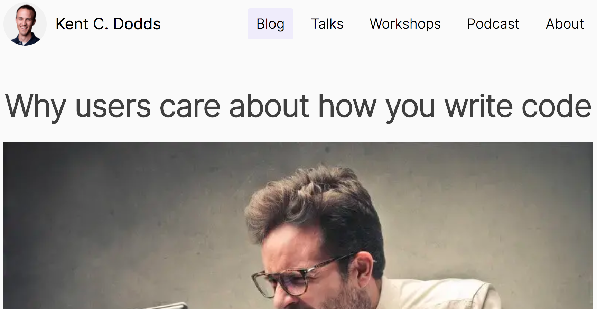
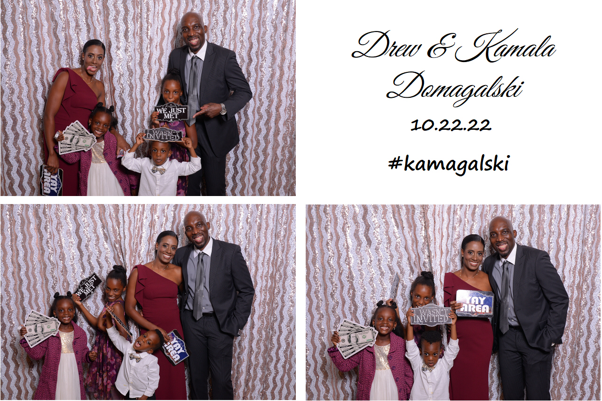
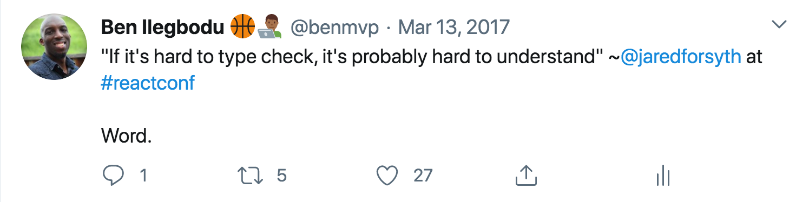

<!-- .slide: data-state="title-page" data-background="url(../../img/ts-react/typewriter-james-pond-Z0uzZSM5i4M-unsplash.jpg) no-repeat center" data-background-size="cover" -->

	

  <h1>TypeScript + React = ❤️</h1>

   

  <h2>Ben Ilegbodu</h2>

   

  
[@benmvp](https://twitter.com/benmvp) | [benmvp.com](https://www.benmvp.com/?utm_source=benmvp&utm_medium=slides&utm_campaign=connecttech-2022) | [@connect_js](https://twitter.com/connect_js)

   

  
November 8, 2022

  

NOTES:
**RESTART THE TIMER!!!!**

- Hello everybody!
- I am excited and honored to be a part of the 10th anniversary of Connect.Tech
  - So happy to be in person and see friends and hopefully make new ones
- And welcome to "TypeScript + React = ❤️"
  - Kinda wish I had used 🔥 instead
  - Because that's how awesome I think the partnership is

/////

  <a href="https://benmvp.com/ct-ts-react?utm_source=benmvp&utm_medium=slides&utm_campaign=connecttech-2022" target="_blank">
    benmvp.com/ct-ts-react
  </a>

NOTES:

- **Slides are available online**

=====
<!-- .slide: data-background="url(../../img/perfect-lib/alessandra-caretto-cAY9X4rPG3g-bicycle-unsplash.jpg) no-repeat center" data-background-size="cover" -->

  

    
    

      <a href="https://kentcdodds.com/blog/why-users-care-about-how-you-write-code" target="_blank">
        <em>Why users care about how you write code</em>
      </a>
    

  

NOTES:

- But whenever we're talking about non-end-user features such as the coding language or even the framework
  - We need to ask ourselves what exactly is the benefit?
  - Does this even matter?
- Because _IF_ it's **not** a direct feature **for** the end user
  - Then it **needs** to be a feature for the developer
  - So that _they_ can build faster, better or more reliably for the end user
- Otherwise, we find ourselves bike-shedding, right?
- So Kent C. Dodds wrote a blog post awhile back that says exactly that
  - We need to measure success based on how well we can deliver what the user wants
  - Our choice of tooling should be based on that goal, and no more

/////
<!-- .slide: data-background="url(../../img/perfect-lib/alessandra-caretto-cAY9X4rPG3g-bicycle-unsplash.jpg) no-repeat center" data-background-size="cover" -->

	

    
  

NOTES:

- Users definitely don’t want a buggy experience
  - And of course, neither do we
- Most errors don’t occur when we're writing initially though
  - But usually creep in when we're making changes (i.e. refactoring)
  - This can be 2 **minutes** later or 2 **months** later
  - That's when bugs get introduced

/////
<!-- .slide: data-background="url(../../img/perfect-lib/alessandra-caretto-cAY9X4rPG3g-bicycle-unsplash.jpg) no-repeat center" data-background-size="cover" -->

  

    

	    

        
      

      

        
      

    

  

NOTES:

- So I'm gonna spend rest of our time showing TypeScript features that can prevent these bugs
- There's lots TS can do
  - But I am going to focus on TypeScript specifically for the React world
- So as a heads up, I'm assuming that you have developed in React before
  - But you know little to no TypeScript
  - I will be explaining various concepts as we go
  - But even if you know lots of TS I think you'll get tons out of this

=====

<!-- .slide: data-background="url(../../img/giphy/stand-up-steph-curry.gif) no-repeat center" data-background-size="cover" -->

  

    <h1 style="font-size: 5em">Stand Up!</h1>
  

NOTES:
- But before we continue can I get everyone to stand up?

/////
<!-- .slide: data-background="#000" -->

  

    
  

NOTES:

- My name is Ben Ilegbodu
- Christian, Husband, Father
- _Family introductions_
- We live in Pittsburg, CA (SF Bay Area)
  - But we're moving back home to Houston in 6 weeks!

/////

  

    
  

  

    
  

NOTES:

- I'm a Google Developer Expert & currently a Frontend Architect at Stitch Fix
- Stitch Fix is an online personal styling service
  - Combines technology & data science
  - With an actual human stylist
  - Take the effort out of shopping by providing a selection of clothes picked just for you
  - And sent to your door on a frequency that you choose

/////
<!-- .slide: data-background="url(../../img/giphy/trae-young-cold.gif) no-repeat center" data-background-size="contain"-->

NOTES:

- I love playing and watching basketball
- I really wanted to go to the game against the Bucks last night
  - But we had a speaker's dinner
  - Plus State Farm arena isn't close by
  - If it were at where the Braves play I would've been all in
- But the Houston Rockets are my team!
  - We're driving the struggle bus right now
  - But we'll be back soon enough

=====
<!-- .slide: data-background="url(../../img/ts-react/mixing-console-abigail-keenan-QdEn9s5Q_4w-unsplash.jpg) no-repeat center" data-background-size="cover" -->

  

    <h1>1. Props</h1>
  

NOTES:

- But you didn't come to hear about me
  - You came for React & TypeScript
- So... lemme give it to you
- In our first section, we'll start with how props typing works in TS

/////
<!-- .slide: data-background="url(../../img/ts-react/mixing-console-abigail-keenan-QdEn9s5Q_4w-unsplash.jpg) no-repeat center" data-background-size="cover" -->

  

    <h2>TypeScript React function component</h2>

    <pre class="large"><code class="lang-typescript">interface AppProps {
  // define props and types
}

const App = (props: AppProps) => {
  // use props and render UI
}</code></pre>

    

    

  

NOTES:

- One thing I want to make clear as we begin...
  - A React component is just a function
- There's nothing _really_ special about it
  - It takes props in and returns JSX
  - So it can be treated & typed like any other TS function
- To start off, we can use an `interface` to define the props
  - An `interface` is a way that we use to define the shape of an object
  - And it becomes the TS type of the `props` argument
- We can name `AppProps` anything we like
  - I usually go with just `Props` but used `AppProps` here for even greater clarity

/////
<!-- .slide: data-background="url(../../img/ts-react/mixing-console-abigail-keenan-QdEn9s5Q_4w-unsplash.jpg) no-repeat center" data-background-size="cover" -->

  

    <h2>I) Props must be listed</h2>

    <pre class="large"><code class="lang-typescript">interface AppProps {
  message: string
}

const App = (props: AppProps) => {
  if (props.loading) {
    return Loading...
  }

  return 
{props.message}

}</code></pre>
    <pre class="large"><code class="lang-shell">Property 'loading' does not exist on type 'AppProps'</code></pre>
    

  

NOTES:

- Ok, so the first benefit...
- With TS, props **cannot** be used within a component without a definition
- How many times have we had props in a component used w/o any `PropTypes` definition?
- Here we're defining the `AppProps` interface w/ 1 property called `message` (a string)
  - This prop will be the only prop available to use in the `App` component
- But in this case we're trying to use `props.loading`
  - Without defining it in the `AppProps` interface
  - So it fails the type checker
- There are ESLint rules to catch this sort of thing
  - But they can only do so much

/////
<!-- .slide: data-background="url(../../img/ts-react/mixing-console-abigail-keenan-QdEn9s5Q_4w-unsplash.jpg) no-repeat center" data-background-size="cover" -->

  

    <h2>I) Props must be listed</h2>

    <pre class="large"><code class="lang-typescript">
&lt;App message="hi" count={5} /&gt;

</code></pre>
    <pre class="large"><code class="lang-shell">Property 'count' does not exist on type
'IntrinsicAttributes & AppProps'</code></pre>
  

NOTES:

- Similarly, we can't pass a prop if it hasn't been defined either
- How many times have we seen a prop being passed to a component
  - And it's not in the `PropTypes`?
  - And it doesn't _seem_ to be used in the component code
  - But we're afraid to remove it because... we're just not sure
- TypeScript gives us the confidence to remove it
  - Because it wouldn't have allowed it in the first place
- Now, the error message can seem a bit cryptic to be honest
  - But as you encounter them more often, you'll get used to parsing them

/////
<!-- .slide: data-background="url(../../img/ts-react/mixing-console-abigail-keenan-QdEn9s5Q_4w-unsplash.jpg) no-repeat center" data-background-size="cover" -->

  

    <h2>II) Props are required by default</h2>

    <pre class="large"><code class="lang-typescript">interface AppProps {
  names: string[]
  count: number
}</code></pre>

    <pre class="large"><code class="lang-typescript">&lt;App
  names={['Bron', 'Jokic', 'Embiid', 'Luka', 'Giannis']}
/&gt;</code></pre>
    <pre class="large"><code class="lang-shell">Property 'count' is missing in type '{ names: string[]; }'
but required in type 'AppProps'</code></pre>
  

NOTES:

- Okay, #2
- React `PropTypes` are optional by default
- I used to see plenty of examples where `PropTypes` _are_ defined
  - But none of them are marked with `isRequired`
  - But if you look at the code and how they're used, the props are _definitely_ required
  - These are bugs waiting to happen
- TypeScript interface properties are **required** by default
  - So without doing anything special, we're guaranteed that the values will exist
  - Super nice!
- Here we're defining the `AppProps` props w/ 2 properties:
  - `names` is a string array (think `PropTypes.arrayOf()`)
  - `count` which is a number
- So if I call the component, leaving off a required prop (`count` in this case)
  - The type checker will yell at me, and again not compile

/////
<!-- .slide: data-background="url(../../img/ts-react/mixing-console-abigail-keenan-QdEn9s5Q_4w-unsplash.jpg) no-repeat center" data-background-size="cover" -->

  

    <h2>II) Props are required by default</h2>

    <pre class="large"><code class="lang-typescript">interface AppProps {
  names: string[]
  count?: number
}

const App = ({ names, count = 2 }: AppProps) => {
  const topPlayers = names.slice(0, count)

  // render topPlayers in UI
}</code></pre>
    

    

  

NOTES:

- However, we can use `?` to denote that a prop is optional
  - Which means its value is `undefined` when not passed
- So based on how `App` is defined now...
  - If I omit `count` when rendering the `<App />` component
  - There's no error this time and it's value will default to `2`
- That's how we do `defaultProps` in TypeScript

/////
<!-- .slide: data-background="url(../../img/ts-react/mixing-console-abigail-keenan-QdEn9s5Q_4w-unsplash.jpg) no-repeat center" data-background-size="cover" -->

  

    <h2>III) Prop refactors are caught</h2>

    <pre class="large"><code class="lang-typescript">
&lt;App
  id="2"
  names={['Bron', 'Jokic', 'Embiid', 'Luka', 'Giannis']}
/&gt;

</code></pre>
    <pre class="large"><code class="lang-shell">Property 'names' does not exist on type
'IntrinsicAttributes & AppProps'.</code></pre>
    

  

NOTES:

- Let's move on to our 3rd prop example
- If we change the name of a prop, all the places using it **must** be updated
- This is kind of related to the first feature
- So let's say the prop was originally `names`...
  - But we later changed the `interface` definition **within** the `App` component to `players`
  - i.e We refactored `App`
- We can search & replace to try to fix all the places
  - But did we get them all? How can we be 100% sure?
  - Well, TS will complain if we miss a spot
  - It'll look something like this error below
  - And this is something ESLint just can't do
  - It doesn't do cross-module typing
- A derivative of this is when we simply mistype a prop
  - TS will complain immediately as well

/////
<!-- .slide: data-background="url(../../img/ts-react/mixing-console-abigail-keenan-QdEn9s5Q_4w-unsplash.jpg) no-repeat center" data-background-size="cover" -->

  

    <h2>IV) Can't avoid defining complex objects</h2>

    <pre class="large"><code class="lang-typescript">interface Address { /\* city, isPrimary, etc \*/ }

interface User {
  name: string
  addresses: {
    shipping: Address
    billing?: Address
  }
}

interface AppProps {
  user: User
}</code></pre>
  

NOTES:

- Okay, so far we've seen that
  - I) Prop types are forced to be defined
  - II) Prop types are required by default
  - III) Prop refactors are easily caught
- Let's look at the fourth prop-related feature
- It's a lot of work to define a deeply nested shape
  - Even with eslint rules to prevent `PropTypes.object`, we can still find ways to "cheat"
  - There's nothing really forcing the `PropTypes` to be 100% accurate
  - And typically we use `PropTypes.shape`
  - When really we should use `PropTypes.exact` to warn on extra properties
- Here `AppProps` has one property: an object called `user`
  - But `user` itself is a complex object called `User`
  - It has 2 properties: `name` (a string) and `address` (yet another complext object)
  - `Address` will no doubt have many properties like `city`, `state`, etc
  - And maybe `Address` itself will have properties w/ complex objects
  - So this `User` object is very deeply nested

/////
<!-- .slide: data-background="url(../../img/ts-react/mixing-console-abigail-keenan-QdEn9s5Q_4w-unsplash.jpg) no-repeat center" data-background-size="cover" -->

  

    <h2>IV) Can't avoid defining complex objects</h2>

    <pre class="large"><code class="lang-typescript">
&lt;App
  user={{
    user: { id: '1234', name: 'Ben', addresses: { } }
  }}
/&gt;

</code></pre>
    <pre class="large"><code class="lang-shell">Property 'id' does not exist on type
'IntrinsicAttributes & User'.</code></pre>
    

  

NOTES:

- So we can't pass properties of the `user` prop
  - Unless we define them in `AppProps`
- So if we try to pass extra props that don't exist
  - We'll get TS errors
  - In this case `id` doesn't exist w/in `User`
  - Maybe we _removed_ `id` and now it fails
- So TS continues to be very beneficial in refactors
- By forcing us to define the entire nested object...
  - TS is now getting in our way
- I wanna keep it real
  - It can be a pain and sometimes; we'd rather be lazy
- But after doing this over and over and getting used to it
  - We also get used to the safety it provides
  - Going back to a JavaScript-only project starts to feel "unsafe"

/////
<!-- .slide: data-background="url(../../img/ts-react/mixing-console-abigail-keenan-QdEn9s5Q_4w-unsplash.jpg) no-repeat center" data-background-size="cover" -->

  

    <h2>V) Function props have explicit signature</h2>

    <pre class="large"><code class="lang-typescript">const Input = ({ name, value, onChange }) => {
  // do input-y stuff & call onChange
}

Input.propTypes = {
  variant: PropTypes.enum(['filled', 'outlined']).isRequired,
  value: PropTypes.string.isRequired,
  onChange: PropTypes.func.isRequired,
}</code></pre>
    

  

NOTES:

- Ok, this last one is probably my favorite
  - So listen in carefully
- Let's say one of our props is a function
  - Typically these are callback functions that are called after a user event
  - Here ours is called `onChange`
- With React prop types, all we get is `PropTypes.func` for functions
  - And we can use `.isRequired` if we're really diligent
- There's nothing that tells the consumer of the component...
  - What parameters the function will pass when called
  - Or if it expects anything returned

/////
<!-- .slide: data-background="url(../../img/ts-react/mixing-console-abigail-keenan-QdEn9s5Q_4w-unsplash.jpg) no-repeat center" data-background-size="cover" -->

  

    <h2>V) Function props have explicit signature</h2>

    <pre class="large"><code class="lang-typescript">interface Props {
  variant: 'filled' | 'outlined'
  value: string
  onChange: (newValue: string) => void
}

const Input = ({ name, value, onChange }: Props) => {
  // do input-y stuff & call onChange
}</code></pre>
    

  

NOTES:

- Now with TS we have to define both the arguments as well as return value of a function
- Here we're defining `onChange` not only to be a function
  - But It'll also give the consumer a single parameter, a `string` (that's `newValue`)
  - AND that function **must not** return anything
  - That's signified by the `void` type
- And once again, if we decide to add a 2nd param to `onChange`
  - Or change the types
  - TS will error unless we fix **all** the places
- How many times have we forgotten to change a function handler in some places?
  - And they usually are called as a result of user interaction
  - Meaning we're much less likely to hit the error while manually testing
  - We have to rely on great test coverage
  - And we all know how that goes...
- Also if you're wondering about the strange syntax for the `variant` prop...
  - The pipe creates what is called a **union type**
  - But we can think of it as `PropTypes.oneOf()`
  - `variant` can either be `'filled'` or `'outlined'`

/////
<!-- .slide: data-background="url(../../img/ts-react/mixing-console-abigail-keenan-QdEn9s5Q_4w-unsplash.jpg) no-repeat center" data-background-size="cover" -->

  

    <h2>VI) VS Code integration 🔥</h2>

    

    <a href="https://code.visualstudio.com/" target="_blank">Visual Studio Code</a>
  

NOTES:

- The Visual Studio Code integration for Typescript is 🔥
  - VS Code is a free, open-source code editor that runs on all platforms
- It auto-completes props & prop values as you type
  - They call it "IntelliSense"
- It shows errors inline without even having to leave the editor
  - So it shortens the feedback loop
- It also has the refactor option
  - So when we want to change the name of the prop
  - It'll update all the use cases for us!
- I couldn't imagine writing TS without VS Code
- I really can't do the developer experience justice with screenshots
  - So you'll have to grab VS Code and start coding in TS to see
  - I've converted over many vim users over to VS Code 😉

=====
<!-- .slide: data-background="url(../../img/ts-react/anchor-hooks-chuttersnap-f2LYxnmnKxI-unsplash.jpg) no-repeat center" data-background-size="cover" -->

  

    <h1>2. Hooks</h1>
  

NOTES:

- So the biggest unique difference with TS + React is with props
  - Because that's the biggest unique aspect of React
- And for React function components, everything I described is basically standard for typing functions in general
  - Those functions just happen to be React components
  - Therefore the error reporting happens in JSX
- The rest of React is really just totally regular JS vs TS
- But let's talk about some hooks

/////
<!-- .slide: data-background="url(../../img/ts-react/anchor-hooks-chuttersnap-f2LYxnmnKxI-unsplash.jpg) no-repeat center" data-background-size="cover" -->

  

    <h2>I) <code>useState</code></h2>

    <pre class="large"><code class="lang-typescript">const App = () => {
  const [count, setCount] = useState(0)

  const add = () => {
    setCount(
      (prevCount) => prevCount + 1
    )
  }

  return &lt;button onClick={add}&gt;Add&lt;/button&gt;
}</code></pre>
    

    

  

NOTES:

- Our props are now fully type-safe so it's important that our state is too
  - So when types are refactored, we can ensure that everything is still correct
- **ONE:** Generally you don't need to do any special typing with `useState`
  - It can infer the type from the initial value that we pass in
  - This is what's called **type inference**
- In this case, TS infers that `count` is a `number` from the initial value `0`
  - **TWO:** `setCount` is the second value from `useState`
  - It is a function that accepts a `number`
  - So we can't accidentally pass in a `string` or `boolean` or some other type
- Here we're using an updater function in `setCount`
  - Because the next value depends on the previous value
- Even the updater function is typed such that the `prevCount` param is also a number
  - And the return value also **must** be a `number` as well
- If I pass anything that's not a number or try to do non numeric operations on the state
  - I get an error of course
- But take one more look at this code for a second
  - **There area no Typescript types**
  - Yet it's fully type-safe 🤯

/////
<!-- .slide: data-background="url(../../img/ts-react/anchor-hooks-chuttersnap-f2LYxnmnKxI-unsplash.jpg) no-repeat center" data-background-size="cover" -->

  

    <h2>I) <code>useState</code></h2>

    <pre class="large"><code class="lang-typescript">const App = () => {
  const [user, setUser] = useState&lt;User | null&gt;(null)

  useEffect(() => {
    getUserApi().then((data) => {
      setUser(data.user)
    })
  }, [])
}

return user ? &lt;User user={user} /&gt; : null</code></pre>
    
<a href="https://www.youtube.com/watch?v=nePDL5lQSE4" target="_blank">What are TypeScript Generics?</a> ⏯️

    

  

NOTES:

- However if the initial value is `null`, we'll need to declare the state type
  - Same situation if the initial value is one type of a union of types
- We specify the type of the state using the angle bracket syntax for **TS Generics**
  - We're sating that the type can either be a `User` object or `null`
 - If you're unfamiliar with Generics, I included a link to a great video from Harry Wolff

/////
<!-- .slide: data-background="url(../../img/ts-react/anchor-hooks-chuttersnap-f2LYxnmnKxI-unsplash.jpg) no-repeat center" data-background-size="cover" -->

  

    <h2>II) <code>useEffect</code></h2>

    <pre class="large"><code class="lang-typescript">const App = () => {
  const [user, setUser] = useState&lt;User | null&gt;(null)

  useEffect(() => (
    getUserApi().then((data) => {
      setUser(data.user)
    })
  ), [])
}</code></pre>
    <pre class="large"><code class="lang-shell">Type 'Promise&lt;void&gt;' provides no match for the
signature '(): void | undefined'.</code></pre>
    

  

NOTES:

- I know `useEffect` is considered taboo now by some
  - But we all still use it, right?
- There's not too much type with `useEffect`...
  - Since it just takes in a function with no args
- But it does ensure we only return a clean-up function
  - And don't accidentally return something else
  - This example looks almost similar to the example we just saw
- Except it's using an implicit return (parentheses vs. curly braces)
  - Which means we're accidentally returning a `Promise`
  - So we'll get a compilation error like we see here
  - React does also warn about this a run-time & there's an eslint rule to catch it

/////
<!-- .slide: data-background="url(../../img/ts-react/anchor-hooks-chuttersnap-f2LYxnmnKxI-unsplash.jpg) no-repeat center" data-background-size="cover" -->

  

    <h2>IV) Custom hooks</h2>

    <pre class="large"><code class="lang-typescript">const useUser = (initUsername?: string) => {
  const [username, setUsername] = useState(initUsername)
  const [user, setUser] = useState&lt;User | null&gt;(null)

  useEffect(() => {
    getUser(username).then(setUser)
  }, [username])

  return [user, setUsername] as const
  // want tuple: [User, (username: string) => void]
  // not array: (User | (username: string) => void)[]
}</code></pre>
    
<a href="https://www.typescriptlang.org/docs/handbook/release-notes/typescript-3-4.html#const-assertions" target="_blank"><code>const</code> assertions</a>

    

  

NOTES:

- In general custom hooks are just regular functions
  - So you would type them like any TS function
- However it's common in hooks to return a tuple just like `useState`
  - In which case you'll want to use what's called a **`const` assertion**
  - Otherwise type inference will incorrect infer the type
- Lemme see if I can try to explain this w/o being in the editor itself
- We are returning a 2-item array
  - Where the first item is a `User` object
  - And the second item is a `function` that takes a `string` returns `void`
- By default TS will infer this as an array of strings or functions
  - Any item can be an `string` and any item can be a `function`
  - When we use array destructuring in the component after calling `useUser`
  - Our types wouldn't be what we expect
  - A string first and an array second
- But with our `const` assertion in place
  - We get all the similar type safety we get from `useState`
- We _could_ define a return type for `useUser`
  - And in this case the type would be rather simple actually
  - But when complex objects are returned,  that _could_ get really cumbersome

=====
<!-- .slide: data-background="url(../../img/ts-react/electric-cables-john-barkiple-l090uFWoPaI-unsplash.jpg) no-repeat center" data-background-size="cover" -->

  

    <h1>3. Advanced Patterns</h1>
  

NOTES:

- Phew...
- So I wanna use our remaining time & return back to discussing props
  - But this time, talk about some advanced patterns that can be really helpful
  - They are more complex, so they do require deeper TS understand
- If you've been like "yeah, yeah, I know this stuff"
  - These patterns may pique your interest
  - They are cases you may find yourself in
  - Let's jump in!

/////
<!-- .slide: data-background="url(../../img/ts-react/electric-cables-john-barkiple-l090uFWoPaI-unsplash.jpg) no-repeat center" data-background-size="cover" -->

  

    <h2>I) One with the other</h2>

    
Valid configurations

    <pre class="large"><code class="lang-html">&lt;Text&gt;not truncated&lt;Text&gt;
&lt;Text truncate&gt;truncated&lt;Text&gt;
&lt;Text truncate showExpand&gt;truncated w/ expand&lt;Text&gt;</code></pre>

    
Invalid configurations

    <pre class="large"><code class="lang-html">&lt;Text truncate={false} showExpand&gt;not truncated&lt;Text&gt;
&lt;Text showExpand&gt;only expand&lt;Text&gt;</code></pre>
    <pre class="large"><code class="lang-shell">Property 'truncate' is missing in type
'{ children: Element; showExpanded: true; }' but required in type
'{ truncate: true; showExpanded?: boolean | undefined; }'.</code></pre>
  

NOTES:

- Sometimes we have a component with dependent props
- Let's say we have `<Text>` component that allows us to truncate text with a `truncate` prop
- It also has a `showExpand` prop to provide a link to click to expand the truncated text
- The `showExpand` prop doesn't make sense w/o the `truncate` prop
  - So we want to make that configuration an error right?
  - It's a much better developer experience for users of the `<Text>` component
  - We want invalid combinations to be caught as early as possible
- Now we _could_ combine these two props into an object
  - But IMO from a developer experience specifying flat props is easier
- So how do we make this setup happen?

/////
<!-- .slide: data-background="url(../../img/ts-react/electric-cables-john-barkiple-l090uFWoPaI-unsplash.jpg) no-repeat center" data-background-size="cover" -->

  

    <h2>I) One with the other</h2>

    <pre class="large"><code class="lang-typescript">interface CommonProps {
  children: React.ReactNode,
  // other props...
}
type TruncateProps =
  | { truncate?: false, showExpanded: undefined }
  | { truncate: true, showExpanded?: boolean }
type TextProps = CommonProps & TruncateProps

const Text = (props: TextProps) => {
  // props.truncate = boolean | undefined
  // props.showExpanded = boolean | undefined
}</code></pre>
    
<a href="https://www.typescriptlang.org/docs/handbook/unions-and-intersections.html#discriminating-unions" target="_blank">Discriminating Unions</a>

    

    

    

    

    

    

  

NOTES:

- Well I'm glad you asked!
- There are a couple of ways we can set this up
  - This is my preferred approach
- **ONE:** First we define our `CommonProps`
  - This has all the props that will always exist
  - Basically the normal props we talked about earlier
- **TWO:** Then the `TruncateProps` type is what's called a **discriminating union**
  - Basically it means a bunch of object unions
- **THREE:** The first part is when the `truncate` prop is `false` or `undefined` (i.e. unspecified)
  - In this case, we set `showExpanded` to be `undefined`
  - Translation: `showExpanded` cannot be set when `truncate` is `false` or `undefined`
- **FOUR:** The second is when the `truncate` prop is specifically set to `true` and only `true`
  - And in this case, `showExpanded` is an optional `boolean` (the `?` remember)
  - We're allowed to make this extra configuration with `showExpaned`
- **FIVE:** Then `TextProps` type is the **intersection** (or merge) of `CommonProps` & `TruncateProps`
- **SIX:** And finally in the code, both `truncate` & `showExpanded` are typed as optional booleans
- Don't worry if you didn't catch all of that
  - I have included a link to a blog post I wrote that walks through all of this
  - So you can read and learn at your leisure

/////
<!-- .slide: data-background="url(../../img/ts-react/electric-cables-john-barkiple-l090uFWoPaI-unsplash.jpg) no-repeat center" data-background-size="cover" -->

  

    <h2>II) Extending HTML components</h2>

    <pre class="large"><code class="lang-html">&lt;Button
  variant="primary"
  size="large"

  type="button"
  onClick={() => { /\* ... \*/ }}
  disabled
  id="main_btn"
&gt;
  Go
&lt;/Button&gt;</code></pre>
  

NOTES:

- Ok! On to the next one, shall we?
- Let's say we've got our `<Button>` component that's a wrapper over the HTML `<button>`
- It has some props to control the visual design (`variant` & `size`),
  - But we also want to support all of the underlying `<button>` props
  - Like `type`, `onClick`, `disabled`, etc.
  - And of course we want this to all be type checked 😀
- We already do this sort of thing without TS
  - We pass along unknown props to the underlying `<button>` element
- But there's no validation in vanilla JS
  - So we could pass any prop
  - And rely on the runtime error from React if we do something wrong...
  - To tell me whether or not this prop is invalid on `<button>`

/////
<!-- .slide: data-background="url(../../img/ts-react/electric-cables-john-barkiple-l090uFWoPaI-unsplash.jpg) no-repeat center" data-background-size="cover" -->

  

    <h2>II) Extending HTML components</h2>

    <pre class="large"><code class="lang-typescript">interface ExtraProps {
  variant: 'primary' | 'secondary'
  size: 'default' | 'small' | 'large'
}

type Props = ExtraProps
  & Omit&lt;React.ComponentProps&lt;"button"&gt;, keyof ExtraProps&gt;

const Button = ({ variant, size, ...buttonProps }: Props) => {
  // do stuff with variant & size
  return &lt;button {...buttonProps} /&gt;
}</code></pre>
    
<a href="https://www.typescriptlang.org/docs/handbook/utility-types.html#omittype-keys" target="_blank">Utility types</a>

    

    

    

    

    

  

NOTES:

- Instead, this is what the TypeScript definitions could look like
  - Again, there are several ways to accomplish this
- **ONE:** We first define the extra props as `ExtraProps`
  - In this case, `variant` & `size`
- **TWO:** Then, we want to define `Props` as the intersection of `ExtraProps` & `<button>` element props
  - But there may be a chance that the `<button>` element already has `variant` or `size` props
  - In which case we want to override those props
- But when there are name collisions, weird things happen in TS
  - I have yet to figure the reason for this
  - So if anyone knows, I'd love to find out!
- So we want all the `<button>` element props **except** the extra ones we're defining
  - **THREE:** We use TS `keyof` to get all the prop names of `ExtraProps`
  - Then we omit (aka remove) those props using the `Omit<>` TS utility generic
- **FOUR:** Next we merge in our `ExtraProps` with another intersection
- **FIVE:** Then finally in the component code we can spread `buttonProps` like we always do
  - Except now `buttonProps` is fully typed
- So consumers of the `<Button>`...
  - Wouldn't be able to accidentally specify an `href` prop for instance
  - But they'll get auto-completion for `disabled`, `type`, and `<button>` other props
- I've provided a link here to all the TS utility types w/ their descriptions & examples
- But also at the end I have a link to another blog post
  - That breaks this all down

=====
<!-- .slide: data-background="url(../../img/ts-react/medicine-pills-wengang-zhai-BFB7ydn1-DI-unsplash.jpg) no-repeat center" data-background-size="cover" -->

  

    <h2>TypeScript is not a cure-all!</h2>
  

NOTES:

- I know I've been super excited about TS
  - About how it catches & prevents so many errors
  - And how it'll solves lots of problems too
  - But it's not a cure-all
- It's just a tool like anything else
  - So we'll still need code review
  - And we'll still need to _write tests_ for run-time things like data APIs
- But hopefully we'll need less of them

/////
<!-- .slide: data-background="url(../../img/ts-react/medicine-pills-wengang-zhai-BFB7ydn1-DI-unsplash.jpg) no-repeat center" data-background-size="cover" -->

  

    <h2>Do I have to switch over all at once?</h2>
  

NOTES:

- One question I always get..
  - "Do I have to switch over to TS all at once?"
- Thankfully the answer: NO! Not at all
- I always advise against big rewrites anyway
  - Again, the whole purpose is to deliver a better quality app for our users
  - IMO us spending weeks/months rewritting in TS is not providing enough value
  - The ROI usually isn't there
- I suggest taking it component by component
  - With a Babel setup, an existing JS component _can_ import a TS component no-problem
  - But we'll want to try to avoid the reverse, however
  - A TS component won't be able to get any type information from a JS component
- There are many schools of thought on the TS configuration itself
  - But my opinion is that if we're gonna bother using TS, we should go **all in**
  - So being _as strict as possible_, don't allow the `any` type
  - There are many settings in the TS config and I suggest the highest level of strictness
- Also I suggest starting with migrating utilities/helpers first
  - Those with little to no dependencies
  - Then work our way outwards
  - The top-level App component would likely be last

/////
<!-- .slide: data-background="url(../../img/ts-react/medicine-pills-wengang-zhai-BFB7ydn1-DI-unsplash.jpg) no-repeat center" data-background-size="cover" -->

  

    
  

NOTES:

- Another heads up!
- You may find ourselves _fighting_ TypeScript
  - We're trying to type some code, but TS typing just isn't working
  - We just "know" it works, but TS is still complaining
  - This is definitely going to happen
- But remember with TS we're signing up for it to make our code more strict...
  - Even if at run-time a certain case will "never" happen
- Some people at this point suggest just making types loose...
  - And moving on
- At times, that's all we can do
  - But again I say for the vast majority of times stick to it being very strict
- So I want us to keep in mind this thought from Jared from over 5 years ago at ReactConf
  - Maybe if your code is really hard to type check, the code itself is hard to understand
- Depending on the quality (or lack thereof)...
  - The JS code itself will likely need to be written differently to be type-safe
  - It's rarely just a matter of adding types

/////
<!-- .slide: data-background="url(../../img/ts-react/medicine-pills-wengang-zhai-BFB7ydn1-DI-unsplash.jpg) no-repeat center" data-background-size="cover" -->

  

    

      
       
      Waller Goble
    

    <h2>Typescript Deep Dive</h2>

    
10:00a (Room ABE)

  

NOTES:

- Waller is going real deep into TS tomorrow at 10am in Room ABE
- So for those of you who already know TS
  - But were here to see how it connected to React
  - Circle his talk on your schedule
  - To learn even more about TS
- We'll be learning about conditional types, mapped types, and more!

=====
<!-- .slide: data-background="url(../../img/ts-react/curved-library-susan-yin-2JIvboGLeho-unsplash.jpg) no-repeat center" data-background-size="cover" -->

  

    <h2>Resources</h2>

    <ul>
      <li><a href="https://react-typescript-cheatsheet.netlify.app/" target="_blank">React TypeScript Cheatsheet</li>
      <li><a href="https://www.typescriptlang.org/tsconfig" target="_blank"><code>tsconfig.json</code></a></li>
      <li><a href="https://www.typescriptlang.org/docs/handbook/babel-with-typescript.html" target="_blank">Using Babel with TypeScript</a></li>
      <li><a href="https://github.com/typescript-eslint/typescript-eslint/tree/master/packages/eslint-plugin" target="_blank"><code>@typescript-eslint/eslint-plugin</code></a></li>
      <li><a href="https://www.benmvp.com/blog/react-prop-types-with-typescript/?utm_source=benmvp&utm_medium=slides&utm_campaign=connecttech-2022" target="_blank"><em>React PropTypes with TypeScript</em></a></li>
      <li><a href="https://www.benmvp.com/blog/typescript-react-props-interfaces-type-aliases/?utm_source=benmvp&utm_medium=slides&utm_campaign=connecttech-2022" target="_blank"><em>TypeScript React props: interfaces vs type aliases</em></a></li>
      <li><a href="https://www.benmvp.com/blog/type-checking-react-usereducer-typescript/?utm_source=benmvp&utm_medium=slides&utm_campaign=connecttech-2022" target="_blank"><em>Type-checking React useReducer in TypeScript</em></a></li>
      <li><a href="https://www.benmvp.com/blog/conditional-react-props-typescript/?utm_source=benmvp&utm_medium=slides&utm_campaign=connecttech-2022" target="_blank"><em>Conditional React props with TypeScript</em></a></li>
      <li><a href="https://www.benmvp.com/blog/polymorphic-react-components-typescript/?utm_source=benmvp&utm_medium=slides&utm_campaign=connecttech-2022" target="_blank"><em>Polymorphic React Components in TypeScript</em></a></li>
    </ul>
  

NOTES:

- I already included links to lots of resources throughout the slides
  - But like I mentioned, I've got some additional ones here for you
- Not to be self-seeking
  - But I have are a number of blog posts that go into more detail

=====
<!-- .slide: data-background="url(../../img/perfect-lib/kelly-sikkema-fvpgfw3IF1w-thanks-unsplash.jpg) no-repeat center" data-background-size="cover"  -->

	

  <h1 class="closing">Ben Ilegbodu</h1>

   

  
<a href="https://twitter.com/benmvp" target="_blank">@benmvp</a> | <a href="https://www.benmvp.com/?utm_source=benmvp&utm_medium=slides&https://www.benmvp.com/?utm_source=benmvp&utm_medium=slides&utm_campaign=connecttech-2022" target="_blank">benmvp.com</a>

  
<a href="mailto:ben@benmvp.com">ben@benmvp.com</a>

  
<a href="https://github.com/benmvp" target="_blank">github/benmvp</a>

  

NOTES:

- And that's it!
- Hopefully you found this quick tour on TypeScript in React insightful...
  - And that it's motivated you to use TS in your next (or current) React project
- I wanna give a shout out to Pratik & Vincent for continuing to put Connect.tech together
  - And of course for you all attending
- Again, the slides are already available online
- If you've got questions, feel free to find me throughout the rest of the conference
  - Or hit me up on Twitter (@benmvp)
- Thanks!
- And enjoy the rest conference!
