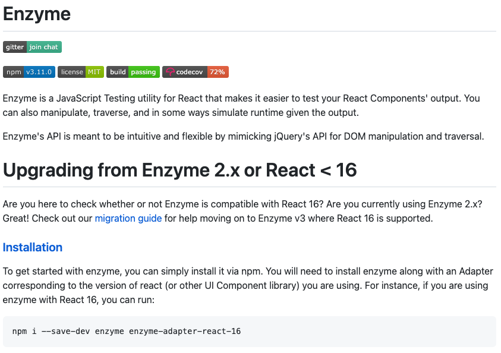
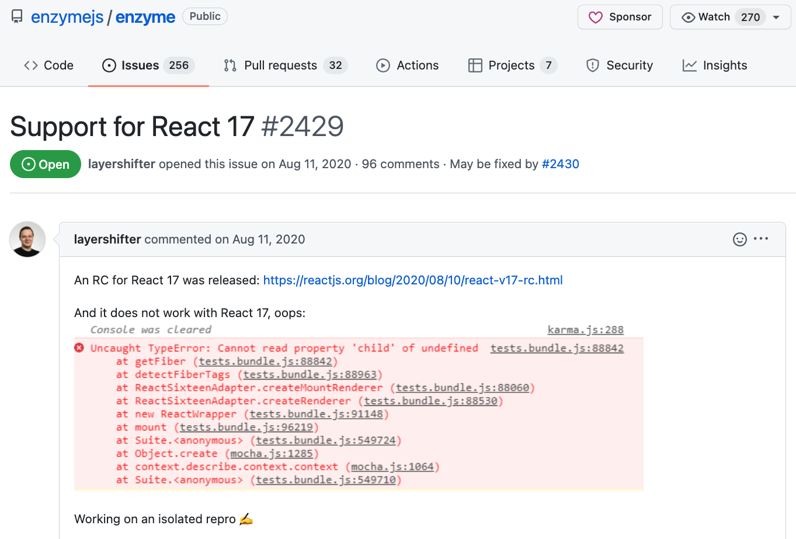
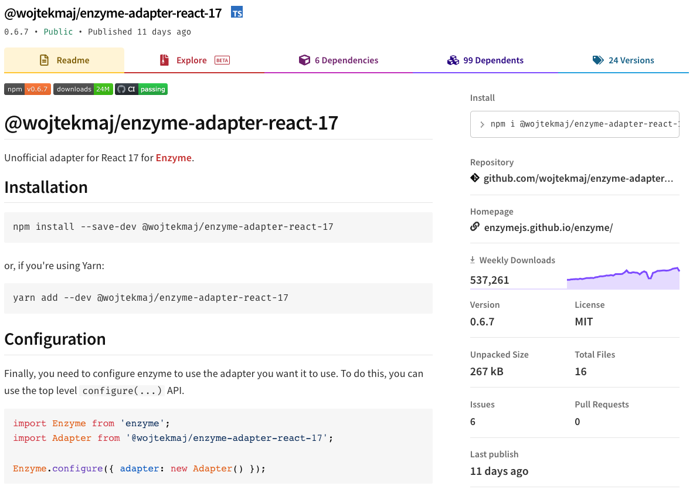
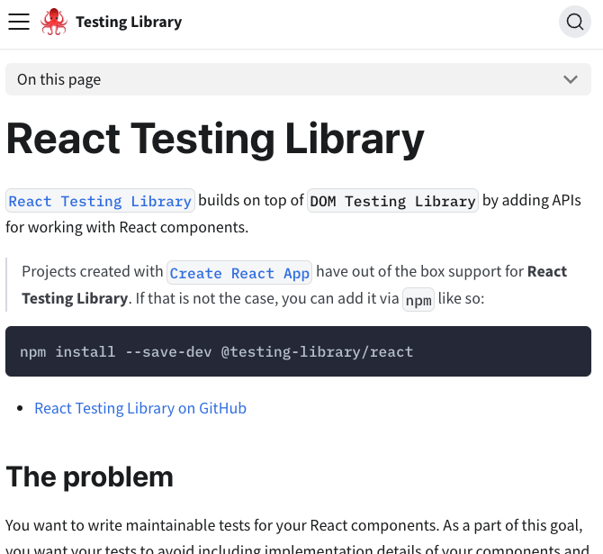

<!-- .slide: data-background="url(../../img/enzyme-to-rtl/mountain-pass-tom-wheatley-b6b5oXwdwzY-unsplash.jpeg) no-repeat center" data-background-size="cover" -->

	

  <h1>Migrating from Enzyme to React Testing Library</h1>

   

  <h2>Ben Ilegbodu</h2>

   

  
[@benmvp](https://twitter.com/benmvp) | [benmvp.com](https://www.benmvp.com/?utm_source=benmvp&utm_medium=slides&utm_campaign=reactmiami-2022) | [@ReactMiamiConf](https://twitter.com/ReactMiamiConf)

   

  
April 19, 2022

  

NOTES:
**RESTART THE TIMER!!!!**

- Hello everyone!
- I'm excited to be here in Miami
  - And speaking at my first in-person conf in 2+ years!
- I'm here to talk about migrating to React Testing Library from Enzyme
  - You may be wondering... why do we need to migrate?
  - Well, let's talk about it

- **RESTART THE TIMER!!!!**
- **TWEETED OUT THE SLIDES!**

=====
<!-- .slide: data-background="url(../../img/esnext/simon-rae-221560-unsplash.jpg) no-repeat center" data-background-size="cover" -->

  

    
  

NOTES:
_[1 minute]_

- Let's start w/ a quick history lesson
- Enzyme really changed the game for how we could unit test UIs
  - It's v1 came out late in 2015
  - It allowed us to render React components without needing a browser
  - Before React, testing UIs required running the unit tests in a headless browser
- **✋🏾 How many people are using Enzyme right now?**

/////
<!-- .slide: data-background="url(../../img/esnext/simon-rae-221560-unsplash.jpg) no-repeat center" data-background-size="cover" -->

  

    
  

NOTES:
_[2 minutes]_

- But in general everything was okay w/ Enzyme until React 17 came out
- When all of our Enzyme tests broke
- While React 17 didn't change any external features
  - A lot of its internals were rewritten to set the stage for React 18 & beyond
- And unfortunately the Enzyme adapters relied heavily on React internals
- This Github issue requesting a React 17 Enzyme adapter...
  - Was created nearly 2 years ago
  - And it has ~100 comments
  - ...And it's still open...
  - The official adapter never got created 😭
- Without its adapter Enzyme doesn't work

/////
<!-- .slide: data-background="url(../../img/esnext/simon-rae-221560-unsplash.jpg) no-repeat center" data-background-size="cover" -->

  

    

    
<a href="https://dev.to/wojtekmaj/enzyme-is-dead-now-what-ekl" target="_blank">Enzyme is dead. Now what?</a>

  

NOTES:
_[3 minutes]_

- However, shortly after that issue was filed...
- A kind soul created an "unofficial" React 17 adapter
  - The intention was for it to be a stopgap adapter until the official one was released
  - But nearly 2 years and 24 releases later
  - It's basically become the _official_ React 17 adapter
  - I mean... it gets **half a million** downloads a week
  - I use it now too
- When the React 18 beta was announced a year ago
  - He tried to create an "unofficial" React 18 adapter
  - But he quickly realized that it just wouldn't be possible
  - It would require a whole team to rewrite not only the adapter but also Enzyme itself
  - No React 18 adapter would be coming
- React 18 release last month
  - So Enzyme has reached **end-of-life**

/////
<!-- .slide: data-background="url(../../img/esnext/simon-rae-221560-unsplash.jpg) no-repeat center" data-background-size="cover" -->

  

    
  

NOTES:
_[4 minutes]_

- But it's not the end of the world
  - Because... _React Testing Library has entered the chat_
- Kent C. Dodds created React Testing Library just over 4 years ago
  - Even before React 17, RTL was becoming more popular
  - If not in raw downloads, then definitely in preference
  - Many people have already migrated over because of the better experience
- RTL's guiding principle is that React tests should resemble how the web page is used
  - It's API is designed to accomplish that and prevent us from testing internals
- It still works w/ newer versions of React because it doesn't rely on React internals
- **✋🏾 How many people here are using RTL?**

=====

<!-- .slide: data-background="url(../../img/giphy/stand-up-steph-curry.gif) no-repeat center" data-background-size="cover" -->

  

    <h1 style="font-size: 5em">Stand Up!</h1>
  

NOTES:
_[5 minutes]_

- Before we continue can I get everyone to stand up?

/////
<!-- .slide: data-background="#000" -->

  

    
  

NOTES:

- My name is Ben Ilegbodu
- Christian, Husband, Father
- _Family introductions_
- We live in Pittsburg, CA (SF Bay Area)

/////

<!-- .element: class="plain" style="width: 75%" -->

NOTES:

- I'm a Google Developer Expert & Microsoft MVP in Web Technologies
- And currently a Frontend Architect at Stitch Fix...
  - On our frontend platform team
  - Our teams focuses on frontend infrastructure to allow devs to focus on features
  - We maintain our React Design System
  - Right now we're building out a brand new web development platform on top of Next.js
- Stitch Fix is an online personal styling service
  - We combine technology, data science & human stylists to...
  - Take the effort out of shopping by providing a selection of clothes picked just for you
  - And sent to your door on a frequency that you choose or you can shop directly
- We're hiring!
  - My frontend platform team is hiring a Principal Frontend Engineer
  - Headquarters is in SF, but we're mostly remote
  - If you're interested at all, come find me and I'll tell you all about it

/////
<!-- .slide: data-background="url(../../img/bball/wade-lebron-alley-oop.jpeg) no-repeat center" data-background-size="cover" -->

NOTES:

- I'm a huge basketball fan
  - Love playing & watching the NBA
- I'm actually a Rockets fan
  - But I figured since I'm in Miami lemme give y'all some love
- I'm a huge LeBron fan
  - So I watched a lot of Heat basketball those 4 years
- I'm actually going to the Game 2 of the playoffs tonight!
  - My first playoff game
- I say all of that because all of my code examples involve basketball

=====
<!-- .slide: data-background="url(../../img/enzyme-to-rtl/mountain-pass-tom-wheatley-b6b5oXwdwzY-unsplash.jpeg) no-repeat center" data-background-size="cover" -->

NOTES:
_[9 minutes]_

- Enough about me!
- Let's get into transitioning from Enzyme to over React Testing Library
- Because of RTL's different strategy for testing
  - Migrating isn't just search and replace
- I'll also be covering some RTL best practices along the way too
  - So even if you're already using RTL...
  - My hope is that you'll learn some new nuggets of info

=====
<!-- .slide: data-background="url(../../img/enzyme-to-rtl/mountain-pass-tom-wheatley-b6b5oXwdwzY-unsplash.jpeg) no-repeat center" data-background-size="cover" -->

  

    <h1>Sync testing</h1>
  

NOTES:
_[10 minutes]_

- Let's look at our first example

/////
<!-- .slide: data-background="url(../../img/enzyme-to-rtl/mountain-pass-tom-wheatley-b6b5oXwdwzY-unsplash.jpeg) no-repeat center" data-background-size="cover" -->

  

    <pre class="large"><code class="lang-javascript">const TeamPage = (props) => {
  const { name, location } = props

  return (
    &lt;div>
      &lt;Text variant="title-large">{name}&lt;/Text>
      {location &&
        &lt;Text variant="body-medium">{location}&lt;/Text>}
    &lt;/div>
  )
}</code></pre>

    

    

  

NOTES:

- Here we have a `TeamPage` component that's rendering two `<Text>` components
- **ONE:** The `name` prop is required and always rendered
  - It renders the team name as "title", presumably an `<h1>`
- **TWO:** The `location` prop is optional and only rendered when it exists
  - The team's location is "body text" most likely a `
`

/////
<!-- .slide: data-background="url(../../img/enzyme-to-rtl/mountain-pass-tom-wheatley-b6b5oXwdwzY-unsplash.jpeg) no-repeat center" data-background-size="cover" -->

  

    <h2>Shallow rendering</h2>

    
Enzyme

    <pre><code class="lang-javascript">const wrapper = shallow(&lt;TeamPage name="Rockets" location="Houston, TX" />)

expect(wrapper.find(Text).at(0)).toHaveProp('children', 'Rockets')
expect(wrapper.find(Text).at(1)).toExist()
expect(wrapper.find(Text).at(1)).toHaveProp('children', 'Houston, TX')</code></pre>

    
React Testing Library

    <pre><code class="lang-javascript">render(&lt;TeamPage name="Rockets" location="Houston, TX" />)

expect(screen.getByRole('heading')).toHaveTextContent('Rockets')
expect(screen.getByText('Houston, TX')).toBeVisible()</code></pre>

    

    

    

    

    

    

  

NOTES:

- Now let's look at the tests for this component
  - And let's start with how we render in Enzyme vs. RTL
- Shallow rendering is super popular with Enzyme
  - **ONE:** `shallow()` forces "true" unit testing
  - It's almost like an "auto-mock" of `<Text>`
  - The goal is to ensure we're passing the right props to the `<Text>` components
  - **TWO:**  The first asserts `<Text>` gets the `children` prop w/ the `name` we passed
  - **THREE:** And the second asserts `<Text>` exists...
  - And its `children` prop is the `location`
- **FOUR:** RTL doesn't have a shallow rendering equivalent
  - `render()` is a full DOM render
- RTL pushes us to find things in an accessible way
  - So we find elements based on how user would interact w/ them
  - The most preferred way are these `*ByRole` queries
  - **FIVE:** We find the team name element by `heading` role and verify its text content
  - **SIX:** But we can also search for elements directly by their text content

/////
<!-- .slide: data-background="url(../../img/enzyme-to-rtl/mountain-pass-tom-wheatley-b6b5oXwdwzY-unsplash.jpeg) no-repeat center" data-background-size="cover" -->

  

    <h2>Full DOM rendering</h2>

    
Enzyme

    <pre><code class="lang-javascript">const wrapper = mount(&lt;TeamPage name="Rockets" location="Houston, TX" />)

expect(wrapper.find('h1')).toHaveText('Rockets')
expect(wrapper.find('.body-medium')).toExist()
expect(wrapper.find('[data-testid="location"]')).toHaveText('Houston, TX')</code></pre>

    
React Testing Library

    <pre><code class="lang-javascript">render(&lt;TeamPage name="Rockets" location="Houston, TX" />)

expect(screen.getByRole('heading')).toHaveTextContent('Rockets')
expect(screen.getByText('Houston, TX')).toBeVisible()</code></pre>

    

  

NOTES:

- **ONE:** Enzyme also has full DOM rendering w/ `mount()`
  - Personally, this is what I used mostly with Enzyme
- The tests kinda look the same
  - But RTL has a much narrower scope in how we can find elements
  - No searching by tag name, class name or generic HTML attribute

/////
<!-- .slide: data-background="url(../../img/enzyme-to-rtl/mountain-pass-tom-wheatley-b6b5oXwdwzY-unsplash.jpeg) no-repeat center" data-background-size="cover" -->

  

    <h2>Rendering overview</h2>

    

      

        <h3>Enzyme</h3>
        <ul>
          <li><code>shallow()</code></li>
          <li><code>mount()</code></li>
          <li><code>render()</code></li>
        </ul>
      

      

        <h3>React Testing Library</h3>
        <ul style="margin-top: 60px">
          <li><code>render()</code></li>
        </ul>
      

    

  

NOTES:
_[13 minutes]_

- So to quickly recap on rendering
- With Enzyme we had:
- **Shallow rendering** with `shallow()` where it only tested the component as a unit
  - Explicitly not testing rendering or behavior of child components
- **Full DOM rendering** with `mount()`
  - Where it rendered the whole component tree w/ DOM elements
- And finally **Static rendering** with `render()`
  - Where it rendered out just the resultant HTML w/o the DOM
- RTL gives us just `render()`
  - Which is most similar to Enzyme `mount()` (not `render()`)
  - Because of RTL's different testing philosophy
  - Full DOM rendering is the only way to go

/////
<!-- .slide: data-background="url(../../img/enzyme-to-rtl/mountain-pass-tom-wheatley-b6b5oXwdwzY-unsplash.jpeg) no-repeat center" data-background-size="cover" -->

  

    <h2>Finding missing elements</h2>

    
Enzyme

    <pre><code class="lang-javascript">const wrapper = shallow(&lt;TeamPage name="Rockets" />)

expect(wrapper.find(Text).at(0)).toHaveProp('children', 'Rockets')
expect(wrapper.find(Text).at(1)).not.toExist()</code></pre>

    
React Testing Library

    <pre><code class="lang-javascript">render(&lt;TeamPage name="Rockets" />)

expect(screen.getByRole('heading')).toHaveTextContent('Rockets')
expect(screen.queryByText('Houston, TX')).not.toBeInTheDocument()</code></pre>

    

    

  

NOTES:

- What if we want to see if an element _doesn't_ exist?
- **ONE:** In Enzyme, the `wrapper` is an object that always exists (like `jQuery`)
  - It can have 0, 1, or many elements within it
  - So we can use `.find()` whether we expect 1 element, many or even none
- RTL on contrast has a different flavor for each, depending on what we expect
- We've seen some `getBy\*` queries already...
- **TWO:** There's also `queryBy\*` as we see here
  - Just like `getBy\*` except it'll return `null` for no matches
  - Can be confusing at first (at least it was for me)
  - But returning `null` makes it useful for asserting if an element is not present

/////
<!-- .slide: data-background="url(../../img/enzyme-to-rtl/mountain-pass-tom-wheatley-b6b5oXwdwzY-unsplash.jpeg) no-repeat center" data-background-size="cover" -->

  

    <h2>Querying overview</h2>

    

      

        <h3>Enzyme (<code>.find()</code>)</h3>
        <ul>
          <li>CSS selector</li>
          <li>Component reference</li>
          <li>Component <code>displayName</code></li>
          <li>Object property selector</li>
        </ul>

        

          <a href="https://testing-library.com/docs/queries/about#priority" target="_blank">Query priority</a> in RTL
        

      

      

        <h3>React Testing Library</h3>
        <h5 style="margin: 0">Accessible to everyone</h5>
        <ul>
          <li><code>\*ByRole()</code></li>
          <li><code>\*ByLabelText()</code></li>
          <li><code>\*ByPlaceholderText()</code></li>
          <li><code>\*ByText()</code></li>
          <li><code>\*ByDisplayValue()</code></li>
        </ul>

        <h5 style="margin: 0">Semantic</h5>
        <ul>
          <li><code>\*ByAltText()</code></li>
          <li><code>\*ByTitle()</code></li>
        </ul>

        <h5 style="margin: 0">Test IDs</h5>
        <ul>
          <li><code>\*ByTestId()</code></li>
        </ul>
      

    

  

NOTES:

- So let's quickly compare querying in Enzyme to RTL
- With Enzyme we basically have the `.find()` method
  - There is also `.findWhere()` but it's far less prevalent
- With `.find()` there are 4 types of finding
  - By **CSS Selector**
  - By **Component reference**
  - By **Component `displayName`**
  - And By **object property selector**
  - RTL would argue that the last 3 are implementation details
  - And most CSS selectors are details as well
- With RTL we go from a single `.find()` to **8 different queries**
  - And these are in priority order
- **Accessible to Everyone** are queries that mimic the experience of all users
  - Both our visual and assistive technology users (like screen readers)
- **Semantic** are HTML5 & ARIA selectors
  - User experiences vary greatly across browsers & assistive technologies
- **Test IDs** are the escape hatch
  - They cannot be seen/heard by users
  - But are better than searching by classes
- We _could_ actually test in Enzyme using some RTL patterns
  - Once I learned RTL, I changed how I wrote Enzyme
  - But there are several queries (`getByRole` especially) that are unique

=====
<!-- .slide: data-background="url(../../img/enzyme-to-rtl/mountain-pass-tom-wheatley-b6b5oXwdwzY-unsplash.jpeg) no-repeat center" data-background-size="cover" -->

  

    <h1>Async testing</h1>
  

NOTES:
_[16 minutes]_

- That first example was standard Enzyme vs. RTL
- Things get more interesting when start talking about async testing
  - And most of our UIs are asynchronous in nature

/////
<!-- .slide: data-background="url(../../img/enzyme-to-rtl/mountain-pass-tom-wheatley-b6b5oXwdwzY-unsplash.jpeg) no-repeat center" data-background-size="cover" -->

  

    <pre class="large"><code class="lang-javascript">const Championships = (props) => {
  const [data, setData] = useState(null)

  useEffect(() => { /\* fetch + setData \*/ }, [props.id])

  if (!data) { /\* render "Loading" \*/ }
  if (data.length === 0) { /\* render empty state \*/ }
  render (
    &lt;div className="container">
      &lt;h4>Championship info&lt;/h4>
      {data.map((info) => (
        &lt;dl className="champ-info"> ... &lt;/dl>
      ))}
    &lt;/div>
  )
}</code></pre>

    

    

    

    

  

NOTES:

- Here we have a `Championships` component
  - It may be rendered on the `TeamPage` we just saw
  - It'll list information about each one of the championships the team has one
- **ONE:** When it initially renders, it displays a loading state (when `data` is `null`)
- **TWO:** Then in the `useEffect()` the info is fetched & the state is updated
- **THREE:** `data` then will either be empty if the team hasn't won any championships
- **FOUR:** Or we'll render the list by mapping over `data`
  - It'll render info like the year, opponent, the series record, etc

/////
<!-- .slide: data-background="url(../../img/enzyme-to-rtl/mountain-pass-tom-wheatley-b6b5oXwdwzY-unsplash.jpeg) no-repeat center" data-background-size="cover" -->

  

    <h2>Loading state</h2>

    
Enzyme

    <pre><code class="lang-javascript">const wrapper = shallow(&lt;Championships id="miami-heat" />)

expect(wrapper.find(Spinner)).toExist()
expect(wrapper.find(Spinner)).toHaveProp('label', 'Loading...')</code></pre>

    
React Testing Library

    <pre><code class="lang-javascript">render(&lt;Championships id="miami-heat" />)

expect(screen.getByText('Loading...')).toBeVisible()</code></pre>
  

NOTES:

- Verifying the loading state is what we've already done

_(skip if necessary)_

- In Enzyme we render w/ `shallow()`
  - And verify that our loading state child component (like a `<Spinner>`)...
  - Is rendered w/ the expected props (`label="Loading..."`)
- With RTL we can verify...
  - That we see the "Loading" message in an element on the page
  - It basically combines the Enzyme ones together

/////
<!-- .slide: data-background="url(../../img/enzyme-to-rtl/mountain-pass-tom-wheatley-b6b5oXwdwzY-unsplash.jpeg) no-repeat center" data-background-size="cover" -->

  

    <h2>Empty state</h2>

    
Enzyme (<a href="https://www.benmvp.com/blog/asynchronous-testing-with-enzyme-react-jest/" target="_blank">async guide</a>)

    <pre><code class="lang-javascript">const wrapper = mount(&lt;Championships id="utah-jazz" />)

await runAllPromises()
wrapper.update()
expect(wrapper.find(EmptyState)).toExist()
expect(wrapper.find(EmptyState)).toHaveProp('message', 'No championships found.')</code></pre>

    
React Testing Library (<a href="https://testing-library.com/docs/guide-disappearance/" target="_blank">async guide</a>)

    <pre><code class="lang-javascript">render(&lt;Championships id="utah-jazz" />)

expect(await screen.findByText('No championships found.')).toBeVisible()</code></pre>

    

    

    

    

    

  

NOTES:

- But here's where it gets tricky
- What about verifying **after** we've fetched the data?
- **ONE:** With Enzyme we have to switch to `mount()` in order for the `useEffect()` to run
- Let's assume we've mocked the `fetch()` request...
  - In this case, **no results**
- Now we need to wait to run our assertions until **after** the `fetch` has returned
  - **After** `setData` is called with the empty list
  - And **after** the component has rendered the `<EmptyState />`
- I've linked to a blog post I wrote on how to accomplish this w/ Enzyme
  - **TWO:** Basically we create a helper call `runAllPromises()`...
  - It will exhaust all the in-progress JS Promises
  - **THREE:** Then we call `wrapper.update()` cuz the UI has now re-rendered
  - **FOUR:** Then we can finally assert that **Utah Jazz have never won a championship**
- This is simplified with RTL
  - Take a step back..
  - As a user how would we know when we've got the empty state?
  - When we see **"No championships found."** for the Utah Jazz
  - **FIVE:** Well RTL has a third-style query...
  - It's called `findBy*`, which is asynchronous
  - It will wait until the element w/ this text is found
  - So the test waits for all the async stuff to happen and then continues once found
- RTL has async helpers like this built-in to make async testing much simpler

/////

<!-- .slide: data-background="url(../../img/enzyme-to-rtl/mountain-pass-tom-wheatley-b6b5oXwdwzY-unsplash.jpeg) no-repeat center" data-background-size="cover" -->

  

    <h2>Data state</h2>

    
Enzyme

    <pre><code class="lang-javascript">const wrapper = mount(&lt;Championships id="houston-rockets" />)

await runAllPromises()
wrapper.update()
expect(wrapper.find('.container')).toExist()
expect(wrapper.find('.champ-info')).toHaveLength(2)</code></pre>

    
React Testing Library

    <pre><code class="lang-javascript">render(&lt;Championships id="houston-rockets" />)

expect(await screen.findByRole('heading')).toBeVisible()
expect(screen.getAllByText('Year')).toHaveLength(2)</code></pre>

    

    

    

    

    

    

  

NOTES:
_[20 minutes]_

- Similarly we need to verify actual results to validate the UI
- With Enzyme
  - **ONE:** We `runAllPromises()` again to watch for after the `fetch()`
  - **TWO:** We call `wrapper.update` because the UI has updated behind the scenes
  - **THREE:** We'll likely validate that the container exists using a selector like class name
  - **FOUR:** And then we verify that the correct number of UIs have displayed
  - Since the Rockets have won 2 championships, we verify that we get 2 items back
- With RTL
  - **FIVE:** Again we have `findBy\*` at our disposal to wait for something to display
- Instead of waiting for the container (which is invisible to the user)
  - We wait for the `<h4>` "Championship info" header that's w/in the container
  - That's what the user actually sees
- Then afterward we can use normal `getBy\*` or `query\*` queries
  - We don't have to keep waiting
- **SIX:** Since we can't search by class name like we did with `.champ-info` for Enzyme...
  - We're using the "Year" headings as a proxy
  - We use `getALLByText` to select multiple

/////
<!-- .slide: data-background="url(../../img/enzyme-to-rtl/mountain-pass-tom-wheatley-b6b5oXwdwzY-unsplash.jpeg) no-repeat center" data-background-size="cover" -->

  

    <h2>Types of RTL queries</h2>

    <table>
      <thead>
        <th>Query type</th>
        <th>0 matches</th>
        <th>1 match</th>
        <th>&gt;1 matches</th>
        <th>Waits?</th>
      </thead>

      <tr>
        <th><code>getBy\*</code></th>
        <td>Throw error</td>
        <td>Return element</td>
        <td>Throw error</td>
        <td>No</td>
      </tr>
      <tr>
        <th><code>queryBy\*</code></th>
        <td>Return <code>null</code></td>
        <td>Return element</td>
        <td>Throw error</td>
        <td>No</td>
      </tr>
      <tr>
        <th><code>findBy\*</code></th>
        <td>Throw error</td>
        <td>Return element</td>
        <td>Throw error</td>
        <td>Yes</td>
      </tr>

      <tr>
        <th colspan="5" style="text-align: center">&nbsp;</th>
      </tr>
      <tr>
        <th><code>getAllBy\*</code></th>
        <td>Throw error</td>
        <td>Return array</td>
        <td>Return array</td>
        <td>No</td>
      </tr>
      <tr>
        <th><code>queryAllBy\*</code></th>
        <td>Return <code>[]</code></td>
        <td>Return array</td>
        <td>Return array</td>
        <td>No</td>
      </tr>
      <tr>
        <th><code>findAllBy\*</code></th>
        <td>Throw error</td>
        <td>Return array</td>
        <td>Return array</td>
        <td>Yes</td>
      </tr>
    </table>

    

      <a href="https://testing-library.com/docs/queries/about#types-of-queries" target="_blank">Types of queries</a> in RTL
    

  

NOTES:

- Here's the full list of queries
  - Broken up into 2 groups: selecting a single element vs selecting multiple
- So what does all this mean for migrating?
  - We lose the simplicity of one method with Enzyme `.find()` and its flexibility
  - We have to remember when & where to use each of these RTL queries
- But that loss of flexibility with RTL helps us test in a more accessible way
  - And avoid testing implementation details
  - And the result may be having to change our UI code
  - That's a win for the user
- BTW - there is an eslint plugin
  - It helps guide us to which query type we should use
  - I got a link to it coming up at the end

=====
<!-- .slide: data-background="url(../../img/enzyme-to-rtl/mountain-pass-tom-wheatley-b6b5oXwdwzY-unsplash.jpeg) no-repeat center" data-background-size="cover" -->

  

    <h1>Interaction testing</h1>
  

NOTES:
_[22 minutes]_

- Let's look at our quick final example

/////
<!-- .slide: data-background="url(../../img/enzyme-to-rtl/mountain-pass-tom-wheatley-b6b5oXwdwzY-unsplash.jpeg) no-repeat center" data-background-size="cover" -->

  

    <pre class="large"><code class="lang-javascript">const PlayerSearch = () => {
  const [query, setQuery] = useState('')
  const [players, setPlayers] = useState(null)
  const search = () => { /\* return fetch Promise \*/ }

  render (
    &lt;div className="container">
      &lt;Input label="Name" value={query}
        onChange={/\* setQuery \*/}
      />
      &lt;Button onClick={search}>Go&lt;/Button>
      {/\* render loading or empty or players data \*/}
    &lt;/div>
  )
}</code></pre>

    

    

    

  

NOTES:

- We've got a component for searching for players
- **ONE:** It renders an `<Input>` child component where we can search for a player
  - Our `<Input>` takes the typical `value` & `onChange`
  - But also takes a `label`
- **TWO:** Also renders a search `<Button>` child component to start the search
- **THREE:** There's a `search` event handler that makes the API request and updates state
  - But this is a bit different from before
  - But it also returns a `Promise` after we get & set the fetched data
  - All to make it easier to test async code in our tests

/////
<!-- .slide: data-background="url(../../img/enzyme-to-rtl/mountain-pass-tom-wheatley-b6b5oXwdwzY-unsplash.jpeg) no-repeat center" data-background-size="cover" -->

  

    
Enzyme

    <pre><code class="lang-javascript">const wrapper = shallow(&lt;PlayerSearch />)

wrapper.find(Input).invoke('onChange')('LeBron')
// resolve Promise returned by click handler
await wrapper.find(Button).invoke('onClick')()
wrapper.update()
// verify players list</code></pre>

    
React Testing Library

    <pre><code class="lang-javascript">render(&lt;PlayerSearch />)

await userEvent.type(screen.getByLabelText('Name'))
await userEvent.click(screen.getByRole('button'))
// verify players list with \`findBy\*\`</code></pre>

    

    

    

    

    

  
<a href="https://testing-library.com/docs/user-event/intro" target="_blank">User Interactions</a> in RTL

  

NOTES:

- **ONE:** With Enzyme, we can go back to using `shallow()` cuz there's no `useEffect()`
  - **TWO:** To simulate typing, we use `.invoke()` on the `Input` component
  - That grabs the `onChange` function prop and calls it with the string we pass
  - This is pure unit testing
- **THREE:** Similarly, to click the button we `.invoke()` on the `Button` component
  - But we do something different here
  - We `await` the `Promise` from the `search` click handler
  - Now our assertions after can assume that the UI has been updated
- The approach is **completely** different for RTL
  - Remember, we are testing how our users are using the component
- So to get the text field, we need to get the actual DOM element
  - **FOUR:** Because we provided the `Name` label to the `Input` component we can search by it
  - This assumes of course that `Input` is accessible w/ a `<label>` or `aria-label`
- What's cool is that RTL provides user event helpers like `.type`
  - It types each individual character
- **FIVE:** Similarly we find the button by role and click it with `userEvent.click()`
- Quick FYI for those already using `userEvent` in RTL
  - The API changed in v14
  - All interactions are now `async`
  - And there's more setup you have to do
  - I've linked to the new docs for ya

=====
<!-- .slide: data-background="url(../../img/ts-react/curved-library-susan-yin-2JIvboGLeho-unsplash.jpg) no-repeat center" data-background-size="cover" -->

  

    <h2>Resources</h2>

    <ul>
      <li><a href="https://github.com/testing-library/jest-dom" target="_blank"><code>@testing-library/jest-dom</code></a></li>
      <li><a href="(https://github.com/testing-library/eslint-plugin-testing-library" target="_blank"><code>eslint-plugin-testing-library</code></a></li>
      <li><a href="https://www.benmvp.com/blog/react-testing-library-best-practices/?utm_source=benmvp&utm_medium=slides&utm_campaign=reactmiami-2022" target="_blank">React Testing Library best practices</a></li>
      <li><a href="https://testing-library.com/docs/queries/about" target="_blank">Queries</a></li>
      <li><a href="https://testing-library.com/docs/queries/about/#debugging" target="_blank">Debugging queries</a></li>
      <li><a href="https://testing-library.com/docs/guide-disappearance/" target="_blank">Appearance & disappearance queries</a></li>
      <li><a href="https://testing-library.com/docs/dom-testing-library/api-within" target="_blank">Querying within elements</a></li>
      <li><a href="https://testing-library.com/docs/user-event/intro/" target="_blank">User Interactions</a></li>
      <li><a href="https://www.benmvp.com/blog/asynchronous-testing-with-enzyme-react-jest/?utm_source=benmvp&utm_medium=slides&utm_campaign=reactmiami-2022" target="_blank">Asynchronous testing with Enzyme & React in Jest</a></li>
      <li><a href="https://dev.to/wojtekmaj/enzyme-is-dead-now-what-ekl" target="_blank">Enzyme is dead. Now what?</a></li>
      <li><a href="https://testing-library.com/docs/react-testing-library/migrate-from-enzyme/" target="_blank">Migrate from Enzyme to RTL docs</a></li>
    </ul>
  

Notes:
_[25 minutes]_

- Here are a bunch of resources
  - I've aggregated all the links I had listed throughout the talk
- I really, really wanted to talk about **Debugging in RTL**
  - There are some key differences & cool features from Enzyme
  - But I just didn't have time in 25 minutes
  - So there's a link to the docs here
- If you're still on Enzyme, I specifically mentioned `runAllPromises` as an async solution
  - The **Asynchronous testing with Enzyme & React in Jest** blog post explains it all

=====
<!-- .slide: data-background="url(../../img/perfect-lib/kelly-sikkema-fvpgfw3IF1w-thanks-unsplash.jpg) no-repeat center" data-background-size="cover"  -->

	

  <h1 class="closing">Ben Ilegbodu</h1>

   

  
<a href="https://twitter.com/benmvp" target="_blank">@benmvp</a> | <a href="https://www.benmvp.com/?utm_source=benmvp&utm_medium=slides&utm_campaign=reactmiami-2022" target="_blank">benmvp.com</a>

  
<a href="mailto:ben@benmvp.com">ben@benmvp.com</a>

  
<a href="https://github.com/benmvp" target="_blank">github/benmvp</a>

  

NOTES:

- And that's it!
- I know I just flooded you with a whole bunch of information
- Hopefully you found it all helpful & insightful
- My goal was that...
  - If you're using Enzyme currently, you **1)** realize you have to migrate
  - And **2)** now you've got a jump start on what migrating looks like
  - And if you're already using RTL, you got to reminisce on the old days
  - ...Or if you've never used Enzyme before...
  - You've got a better understanding for RTL design decisions
- I wanna give a special thanks to the organizers of the first React Miami...
  - For inviting me to share my knowledge with y'all
  - To G2i & JS World
- Also thank **YOU** for attending my talk
  - You could've skipped to get a jump on the refreshments, but you stayed
- Speaking of which we've got a break after this
  - And I'll be here right after for any questions you've got
  - And I'll also be around throughout the day as well for feel free to grab me whenever
  - But you can always reach out to me on Twitter (**@benmvp**)
- **REMINDER:** You can also find a tweet w/ a link to the slides there
  - Or on my website: **benmvp.com**
- Thanks again & enjoy the rest of the conference!
