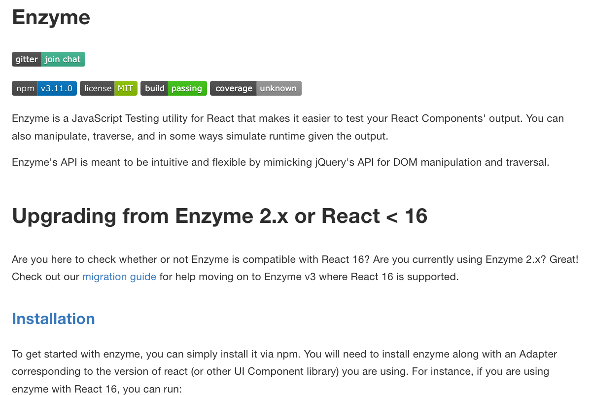
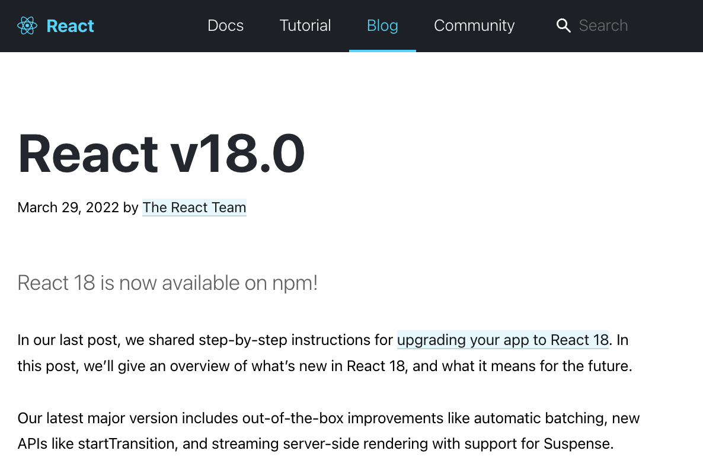

<!-- .slide: data-background="url(../../img/enzyme-to-rtl/mountain-pass-tom-wheatley-b6b5oXwdwzY-unsplash.jpeg) no-repeat center" data-background-size="cover" -->

	

  <h1>Migrating from Enzyme to React Testing Library</h1>

   

  <h2>Ben Ilegbodu</h2>

   

  
[@benmvp](https://twitter.com/benmvp) | [benmvp.com](https://www.benmvp.com/?utm_source=benmvp&utm_medium=slides&utm_campaign=reactmiami-2022) | [@ReactMiamiConf](https://twitter.com/ReactMiamiConf)

   

  
April 19, 2022

  

NOTES:
**RESTART THE TIMER!!!!**

- Hello everyone!

- **RESTART THE TIMER!!!!**
- **TWEETED OUT THE SLIDES!**

=====
<!-- .slide: data-background="url(../../img/esnext/simon-rae-221560-unsplash.jpg) no-repeat center" data-background-size="cover" -->

  

    
  

NOTES:

- Let's start w/ a quick history lesson
- Enzyme really changed the game for how we could unit test UIs
  - It's v1 came out latest in 2015
- Because React separates rendering from flushing to the DOM
  - We can render React components without needing a browser
  - Before React testing UIs required running the unit tests in a headless browser
- It's API Mimics jQuery's API for DOM manipulation & traversal
  - It has a element wrapper similar to jQuery (we'll see in a bit)
  - But it also dug into implementation details like inspecting state
  - Ultimately became its undoing
- **How many people are using Enzyme?**

/////
<!-- .slide: data-background="url(../../img/esnext/simon-rae-221560-unsplash.jpg) no-repeat center" data-background-size="cover" -->

  

    
  

NOTES:

- But in general everything was okay until React 17 came out
- For us consumers of React 17 it was probably the easiest React upgrade there had ever been
  - Just switched from React `16.14.0` to `17.0.2`
  - And our apps worked the same

/////
<!-- .slide: data-background="url(../../img/esnext/simon-rae-221560-unsplash.jpg) no-repeat center" data-background-size="cover" -->

  

    
  

NOTES:

- The same couldn't be said for our tests though
- While React 17 didn't change any features
  - A lot of its internals were rewritten to set the stage for React 18 & beyond
- And unfortunately the Enzyme adapters relied heavily on React internals
- This Github issue was opened nearly 2 years ago and has ~100 comments
  - And it's still open; the official adapter never got created 😭
- The questions of "is Enzyme dead" began
  - Enzyme the API was actually fine
  - But the fact there there wasn't a React 17 adapter made it unusable

/////
<!-- .slide: data-background="url(../../img/esnext/simon-rae-221560-unsplash.jpg) no-repeat center" data-background-size="cover" -->

  

    

    
<a href="https://dev.to/wojtekmaj/enzyme-is-dead-now-what-ekl" target="_blank">Enzyme is dead. Now what?</a>

  

NOTES:

- However, shortly after that issue was filed kind soul created an "unofficial" React 17 adapter
  - The intention was for it to be a stopgap adapter until the official one was released
  - But nearly 2 years and 24 releases later, it's basically become the official React 17 adapter
- I was hesitant to use it when React 17 first came out
  - But it now gets over 500k weekly downloads!
  - I've upgraded some apps w/ Enzyme tests over to it w/o a problem
  - It was just as easy as the main React 17 upgrade
- Turns out that the unofficial adapter helped prolong Enzyme's end-of-life
  - A year after releasing the adapter, the maintainer wrote a blog post claiming Enzyme's death
  - He regretted publishing the unofficial adapter because it gave devs hope that they could continue to use Enzyme
- When the React 18 beta was announced he tried to create a React 18 adapter to get ahead
  - But he quickly realized that it just wouldn't be possible
  - It would require a whole team to rewrite not only the adapter but Enzyme itself
  - No React 18 adapter would be coming

/////
<!-- .slide: data-background="url(../../img/esnext/simon-rae-221560-unsplash.jpg) no-repeat center" data-background-size="cover" -->

  

    
  

NOTES:

- Then guess what happened?!
  - React 18 finally released last month
  - Lots of excitement & anticipation (it's been a long time coming)
  - There are new Hooks, concurrent features, and more
- But that basically means Enzyme is officially end-of-life
  - We won't be able to upgrade apps to React 18 because of Enzyme
  - Event though React 18 provides gradual adoption

/////
<!-- .slide: data-background="url(../../img/esnext/simon-rae-221560-unsplash.jpg) no-repeat center" data-background-size="cover" -->

  

    
  

NOTES:

- But it's not the end of the world
  - Because React Testing Library has entered the chat
- Kent C. Dodds created React Testing Library just over 4 years ago
  - Even before these technical issues with Enzyme, RTL had already become more popular
  - If not in raw downloads, definitely in preference
  - Many people have already migrated over because of the better experience (which we'll talk about)
- RTL's guiding principle is that React tests should closely resemble how the web page is used
  - It's API is designed to accomplish that and almost prevent testing internals
- It works w/ newer versions of React because it renders the component to a DOM tree
- **How many people here are using RTL?**

=====

<!-- .slide: data-background="url(../../img/giphy/stand-up-steph-curry.gif) no-repeat center" data-background-size="cover" -->

  

    <h1 style="font-size: 5em">Stand Up!</h1>
  

NOTES:
- Before we continue can I get everyone to stand up?

/////
<!-- .slide: data-background="#000" -->

  

    
  

NOTES:

- My name is Ben Ilegbodu
- Christian, Husband, Father
- _Family introductions_
- We live in Pittsburg, CA (SF Bay Area)
- Also a Google Developer Expert & Microsoft MVP in Web Technologies

/////

<!-- .element: class="plain" style="width: 75%" -->

NOTES:

- I'm a Frontend Architect at Stitch Fix
  - On our frontend platform team
  - We work on building out our React Design System
  - Also focus on frontend infrastructure to allow devs to focus on features
- Stitch Fix is an online personal styling service
  - Take the effort out of shopping by providing a selection of clothes picked just for you
  - And sent to your door on a frequency that you choose or you can shop directly
  - Combines technology, data science & human stylists
- We're hiring!
  - US-only unfortunately
  - Headquarters is in SF
  - And we had remote engineers all over the country even before COVID

/////
<!-- .slide: data-background="url(../../img/bball/wade-lebron-alley-oop.jpeg) no-repeat center" data-background-size="cover" -->

NOTES:

- I'm a huge basketball fan; love playing & watching the NBA
- I'm actually a Rockets fan, but I figured since I'm in Miami lemme give y'all some love
- All of my code examples involve basketball

=====
<!-- .slide: data-background="url(../../img/enzyme-to-rtl/mountain-pass-tom-wheatley-b6b5oXwdwzY-unsplash.jpeg) no-repeat center" data-background-size="cover" -->

  

    <h1>Examples</h1>
  

NOTES:

- Enough about me!
- Let's talk about transitioning from Enzyme to React Testing Library
- Because of RTL's different strategy for testing, migrating isn't just search and replace
  - And that's the whole purpose of this talk!
- I'll be covering RTL best practices
  - So even if you're already using RTL...
  - My hope is that you'll learn something new
- Even though I'm biased to RTL, my goals isn't to convince you to switch
  - IMO that ship has sailed
  - We gotta move from Enzyme
  - But I hope that as we see the migration, you'll see how RTL is a nice change

=====
<!-- .slide: data-background="url(../../img/enzyme-to-rtl/mountain-pass-tom-wheatley-b6b5oXwdwzY-unsplash.jpeg) no-repeat center" data-background-size="cover" -->

  

    <h1>Sync testing</h1>
  

NOTES:

/////
<!-- .slide: data-background="url(../../img/enzyme-to-rtl/mountain-pass-tom-wheatley-b6b5oXwdwzY-unsplash.jpeg) no-repeat center" data-background-size="cover" -->

  

    <pre class="large"><code class="lang-javascript">const TeamPage = (props) => {
  const { name, location } = props

  return (
    &lt;div>
      &lt;Text variant="title-large">{name}&lt;/Text>
      {location && &lt;Text variant="body-medium">{location}&lt;/Text>}
    &lt;/div>
  )
}</code></pre>

  

NOTES:
- Basic example where `TeamPage` component is rendering two `<Text>` components
  - The `name` is required and always rendered
  - The `location` is optional and only rendered when it exists

/////
<!-- .slide: data-background="url(../../img/enzyme-to-rtl/mountain-pass-tom-wheatley-b6b5oXwdwzY-unsplash.jpeg) no-repeat center" data-background-size="cover" -->

  

    <h2>Shallow rendering</h2>

    
Enzyme

    <pre><code class="lang-javascript">const wrapper = shallow(&lt;TeamPage name="Rockets" location="Houston, TX" />)

expect(wrapper.find(Text).at(0)).toHaveProp('children', 'Rockets')
expect(wrapper.find(Text).at(1)).toExist()
expect(wrapper.find(Text).at(1)).toHaveProp('children', 'Houston, TX')</code></pre>

    
React Testing Library

    <pre><code class="lang-javascript">render(&lt;TeamPage name="Rockets" location="Houston, TX" />)

expect(screen.getByRole('heading')).toHaveTextContent('Rockets')
expect(screen.getByText('Houston, TX')).toBeVisible()</code></pre>

  

NOTES:

- Shallow rendering is super popular with Enzyme
  - With `shallow()` we won't see the resultant elements because they're w/in the `<Text>`
  - It forces true unit tests because we don't have to know how `<Text>` is implemented
  - It's almost like an "auto-mock" of `<Text>`
  - The goal of the test is to ensure we're passing the right props to the `<Text>` components
- RTL doesn't have a shallow rendering equivalent; everything is `render()`
  - It's a full DOM render
  - We _could_ mock `<Text>` but it's an RTL anti-pattern
  - Instead RTL provides a handful of "queries"

/////
<!-- .slide: data-background="url(../../img/enzyme-to-rtl/mountain-pass-tom-wheatley-b6b5oXwdwzY-unsplash.jpeg) no-repeat center" data-background-size="cover" -->

  

    <h2>Full DOM rendering</h2>

    
Enzyme

    <pre><code class="lang-javascript">const wrapper = mount(&lt;TeamPage name="Rockets" location="Houston, TX" />)

expect(wrapper.find('h1')).toHaveText('Rockets')
expect(wrapper.find('[data-testid="location"]')).toExist()
expect(wrapper.find('.body-medium')).toHaveText('Houston, TX')</code></pre>

    
React Testing Library

    <pre><code class="lang-javascript">render(&lt;TeamPage name="Rockets" location="Houston, TX" />)

expect(screen.getByRole('heading')).toHaveTextContent('Rockets')
expect(screen.getByText('Houston, TX')).toBeVisible()</code></pre>

  

NOTES:

- Enzyme full DOM rendering w/ `mount()` is most like RTL `render()`
  - Because we have **all** the DOM elements we can use CSS selector syntax similar to jQuery
  - Many ways to find an element; it's super flexible
  - In fact searching by component constructor or component display name still works
- RTL pushes us to find things in an accessible way
  - We find elements how user would interact w/ them
  - The most preferred way is `*ByRole`

/////
<!-- .slide: data-background="url(../../img/enzyme-to-rtl/mountain-pass-tom-wheatley-b6b5oXwdwzY-unsplash.jpeg) no-repeat center" data-background-size="cover" -->

  

    <h2>Rendering overview</h2>

    

      

        <h3>Enzyme</h3>
        <ul>
          <li><code>shallow()</code></li>
          <li><code>mount()</code></li>
          <li><code>render()</code></li>
        </ul>
      

      

        <h3>React Testing Library</h3>
        <ul>
          <li><code>render()</code></li>
        </ul>
      

    

  

NOTES:
- So to quickly recap
- With Enzyme we had:
  - Shallow rendering with `shallow()` where it only tested the component as a unit, explicitly not testing behavior of child components
  - Full DOM rendering with `mount()` where it rendered the whole component tree w/ DOM elements _(and components)_
  - Static rendering with `render()` where it rendered out just the resultant HTML w/o the DOM
- RTL gives us just `render()`, which is most similar to Enzyme `mount()`
  - RTL has a different testing philosophy
  - It's better to test the component how the user sees it
  - Not how it's implemented
  - So full DOM rendering is the only way to accomplish that

/////
<!-- .slide: data-background="url(../../img/enzyme-to-rtl/mountain-pass-tom-wheatley-b6b5oXwdwzY-unsplash.jpeg) no-repeat center" data-background-size="cover" -->

  

    <h2>Finding missing elements</h2>

    
Enzyme

    <pre><code class="lang-javascript">const wrapper = shallow(&lt;TeamPage name="Rockets" />)

expect(wrapper.find(Text).at(0)).toHaveProp('children', 'Rockets')
expect(wrapper.find(Text).at(1)).not.toExist()</code></pre>

    
React Testing Library

    <pre><code class="lang-javascript">render(&lt;TeamPage name="Rockets" />)

expect(screen.getByRole('heading')).toHaveTextContent('Rockets')
expect(screen.queryByText('Houston, TX')).not.toBeInTheDocument()</code></pre>

  

NOTES:

- What if we want to see if an element _doesn't_ exist?
- In Enzyme the `wrapper`, like jQuery, is always an object that exists
  - It can have 0, 1, or many elements within it
  - So we can use `.find()` whether we expect 1 element, many or even none
- RTL on contrast has a different flavor for each
- We've seen `getBy*` already and that is when we expect to find a single element
  - It'll throw an error if 0 elements match or multiple do
  - There's `getByRole`, `getByText`, and a number of others we'll see in a bit
- There's also `queryBy*` as we see here
  - It'll return the matching element or throw an error if it gets multiple, just like `getBy*`
  - But if there is no match, it'll return `null` instead
  - This makes it useful for asserting if an element is not present

/////
<!-- .slide: data-background="url(../../img/enzyme-to-rtl/mountain-pass-tom-wheatley-b6b5oXwdwzY-unsplash.jpeg) no-repeat center" data-background-size="cover" -->

  

    <h2>Querying overview</h2>

    

      

        <h3>Enzyme (<code>.find()</code>)</h3>
        <ul>
          <li>CSS selector</li>
          <li>Component constructor</li>
          <li>Component <code>displayName</code></li>
          <li>Object property selector</li>
        </ul>

        

          <a href="https://testing-library.com/docs/queries/about#priority" target="_blank">Query priority</a> in RTL
        

      

      

        <h3>React Testing Library</h3>
        <h5 style="margin: 0">Accessible to everyone</h5>
        <ul>
          <li><code>\*ByRole()</code></li>
          <li><code>\*ByLabelText()</code></li>
          <li><code>\*ByPlaceholderText()</code></li>
          <li><code>\*ByText()</code></li>
          <li><code>\*ByDisplayValue()</code></li>
        </ul>

        <h5 style="margin: 0">Semantic</h5>
        <ul>
          <li><code>\*ByAltText()</code></li>
          <li><code>\*ByTitle()</code></li>
        </ul>

        <h5 style="margin: 0">Test IDs</h5>
        <ul>
          <li><code>\*ByTestId()</code></li>
        </ul>
      

    

  

NOTES:

- So let's quickly compare querying in Enzyme to RTL
- With Enzyme we basically have `.find()`
  - There is `.findWhere()` but it's far less prevelant
  - With `.find()` there are 4 types of finding
  - By **CSS Selector**, **Component constructor**, **Component `displayName`**, and object property selector
  - RTL would argue that the last 3 are implementation details
  - And most CSS selectors are as well
- With RTL we go from single `.find()` to 8 different queries
  - And these are in priority order
  - **Accessible to Everyone** are queries that mimic the experience of both our visual and assistive technology users
  - **Semantic** are HTML5 & ARIA selectors. User experiences vary greatly across browsers & assistive technologies
  - **Test IDs** are the escape hatch. Cannot be seen/heard by users. Better than classes
- Could actually test in Enzyme using RTL patterns
  - But there are several queries (`getByRole` especially) that are unique

=====
<!-- .slide: data-background="url(../../img/enzyme-to-rtl/mountain-pass-tom-wheatley-b6b5oXwdwzY-unsplash.jpeg) no-repeat center" data-background-size="cover" -->

  

    <h1>Async testing</h1>
  

NOTES:

/////
<!-- .slide: data-background="url(../../img/enzyme-to-rtl/mountain-pass-tom-wheatley-b6b5oXwdwzY-unsplash.jpeg) no-repeat center" data-background-size="cover" -->

  

    <pre class="large"><code class="lang-javascript">const Championships = (props) => {
  const [data, setData] = useState(null)

  useEffect(() => { /\* fetch + setData \*/ }, [props.id])

  if (!data) { /\* render "Loading" \*/ }
  if (data.length === 0) { /\* render empty state \*/ }
  render (
    &lt;div className="container">
      &lt;h4>Championship info&lt;/h4>
      {data.map((info) => (
        &lt;dl className="champ-info"> ... &lt;/dl>
      ))}
    &lt;/div>
  )
}</code></pre>
  

NOTES:

- That first example was standard Enzyme vs. RTL
- Things get more interesting when start talking about async testing
- Here we have a `Championships` component that may be rendered on the `TeamPage`
  - It'll list information about each one of the championships the team has one
- When it initially renders, it displays a loading state (`data` is `null`)
- Then in the `useEffect()` the info is fetched & the state is updated
- `data` then will either be empty if the team hasn't won any championships
- Or we'll render the list by mapping over `data`
  - Render info like the year, opponent, the series record, etc

/////
<!-- .slide: data-background="url(../../img/enzyme-to-rtl/mountain-pass-tom-wheatley-b6b5oXwdwzY-unsplash.jpeg) no-repeat center" data-background-size="cover" -->

  

    <h2>Loading state</h2>

    
Enzyme

    <pre><code class="lang-javascript">const wrapper = shallow(&lt;Championships id="miami-heat" />)

expect(wrapper.find(Spinner)).toExist()
expect(wrapper.find(Spinner)).toHaveProp('label', 'Loading...')</code></pre>

    
React Testing Library

    <pre><code class="lang-javascript">render(&lt;Championships id="miami-heat" />)

expect(screen.getByText('Loading...')).toBeVisible()</code></pre>
  

NOTES:

- Verifying the loading state is what we've already done
- Enzyme we render w/ `shallow()` and verify that the `<Spinner>` child component is rendered
- RTL we can verify that we see the "Loading" message on the page

/////
<!-- .slide: data-background="url(../../img/enzyme-to-rtl/mountain-pass-tom-wheatley-b6b5oXwdwzY-unsplash.jpeg) no-repeat center" data-background-size="cover" -->

  

    <h2>Empty state</h2>

    
Enzyme (<a href="https://www.benmvp.com/blog/asynchronous-testing-with-enzyme-react-jest/" target="_blank">async guide</a>)

    <pre><code class="lang-javascript">const wrapper = mount(&lt;Championships id="utah-jazz" />)

await runAllPromises()
wrapper.update()
expect(wrapper.find(EmptyState)).toExist()
expect(wrapper.find(EmptyState)).toHaveProp('message', 'No championships found.')</code></pre>

    
React Testing Library (<a href="https://testing-library.com/docs/guide-disappearance/" target="_blank">async guide</a>)

    <pre><code class="lang-javascript">render(&lt;Championships id="utah-jazz" />)

expect(await screen.findByText('No championships found.')).toBeVisible()</code></pre>
  

NOTES:

- Here's where it gets tricky
- What about verifying after we've fetched the data?
- With Enzyme we have to switch to `mount()` in order for the `useEffect()` to run
  - There are workarounds with `jest-react-hooks-shallow` or manually running `useEffect()`
- Let's assume we've mocked the `fetch()` request with `jest-fetch-mock` or all the many other ways
- We need to tell the Jest test to wait to run our assertions until **after** the `fetch` has returned
  - Has called `setData` with the empty list (cuz the Utah Jazz have never, ever won)
  - And has re-rendered to render the `<EmptyState />`
- I've linked to a blog post I wrote on how to accomplish this w/ Enzyme
  - Need to create a helper call `runAllPromises()` that will exhaust all the in-progress JS Promises
  - `fetch` is Promise-based
  - Then call `wrapper.update()` cuz the UI has now re-rendered and updated
  - Then we can finally assert that Utah Jazz have never one a championship
- This is simplified with RTL
  - Take a step back... as a user how would we know when we've got the empty state?
  - When we see the "No championships found." message for the Utah Jazz
  - Well RTL has a third-style query called `findBy*`, which is asynchronous
  - It will wait until the text is found (and throw an Error if timeout is reached)
  - So the test waits for all the async stuff to happen and then continues once found
- RTL has async helpers build in which make async testing much simpler
  - It's more similar to browser-based, end-to-end utilities like Cypress or Selenium
  - Again it's wanting to test like users use the component

/////

<!-- .slide: data-background="url(../../img/enzyme-to-rtl/mountain-pass-tom-wheatley-b6b5oXwdwzY-unsplash.jpeg) no-repeat center" data-background-size="cover" -->

  

    <h2>Data state</h2>

    
Enzyme

    <pre><code class="lang-javascript">const wrapper = mount(&lt;Championships id="houston-rockets" />)

await runAllPromises()
wrapper.update()
expect(wrapper.find('.container')).toExist()
expect(wrapper.find('.champ-info')).toHaveLength(2)</code></pre>

    
React Testing Library

    <pre><code class="lang-javascript">render(&lt;Championships id="houston-rockets" />)

expect(await screen.findByRole('heading')).toBeVisible()
expect(screen.getAllByText('Year')).toHaveLength(2)</code></pre>
  

NOTES:

- Similarly we need to verify actual results to validate the UI
- With Enzyme
  - We `runAllPromises()` again to watch for after the `fetch()`
  - Update because the UI has updated behind the scenes
  - We'll probably validate that the entire container exists using a selector like class name
  - And then we'll want to verify that the correct number of championship UIs have displayed
  - Since the Rockets have won 2 championships, we verify that we get back 2 items
  - We'd probably go on to verify individual information, but you get the idea
- With RTL
  - Again we have `findBy*` at our disposal to wait for something to display
  - Instead of waiting by the container, which is invisible to the user
  - We wait for the `<h4>` "Championship header" that's w/in the container (what the user sees)
  - Then afterward we can use normal `getBy*`/`query*` queries because UI has fully rendered
  - Since we can't search by class name like we did with `.champ-info` for Enzyme...
  - Using "Year" as a proxy in searching by text
  - We could have added a `data-testid` attribute and searched `byTestId` like I mentioned
  - But the key here is that since we expect multiple items we use `getAllByText`

/////
<!-- .slide: data-background="url(../../img/enzyme-to-rtl/mountain-pass-tom-wheatley-b6b5oXwdwzY-unsplash.jpeg) no-repeat center" data-background-size="cover" -->

  

    <h2>Types of RTL queries</h2>

    <table>
      <thead>
        <th>Query type</th>
        <th>0 matches</th>
        <th>1 match</th>
        <th>&gt;1 matches</th>
        <th>Waits?</th>
      </thead>

      <tr>
        <th><code>getBy\*</code></th>
        <td>Throw error</td>
        <td>Return element</td>
        <td>Throw error</td>
        <td>No</td>
      </tr>
      <tr>
        <th><code>queryBy\*</code></th>
        <td>Return <code>null</code></td>
        <td>Return element</td>
        <td>Throw error</td>
        <td>No</td>
      </tr>
      <tr>
        <th><code>findBy\*</code></th>
        <td>Throw error</td>
        <td>Return element</td>
        <td>Throw error</td>
        <td>Yes</td>
      </tr>

      <tr>
        <th colspan="5" style="text-align: center">&nbsp;</th>
      </tr>
      <tr>
        <th><code>getAllBy\*</code></th>
        <td>Throw error</td>
        <td>Return array</td>
        <td>Return array</td>
        <td>No</td>
      </tr>
      <tr>
        <th><code>queryAllBy\*</code></th>
        <td>Return <code>[]</code></td>
        <td>Return array</td>
        <td>Return array</td>
        <td>No</td>
      </tr>
      <tr>
        <th><code>findAllBy\*</code></th>
        <td>Throw error</td>
        <td>Return array</td>
        <td>Return array</td>
        <td>Yes</td>
      </tr>
    </table>

    

      <a href="https://testing-library.com/docs/queries/about#types-of-queries" target="_blank">Types of queries</a> in RTL
    

  

NOTES:

- Here's the full list of queries
  - Broken up into 2 groups: ones for selecting a single element & ones for selecting multiple
- Single
  - When they all get the element, they return it
  - And when they all get more than 1 match they throw an error
  - The two main differences are for 0 matches `queryBy*` returns `null` instead of throwing an error
  - This is great for when we expect something to not be there
  - The other difference is that `findBy*` will wait until the element appears
  - This is great for async UIs where the element may not be immediately there
- Multiple is the same except it's for retrieving multiple
  - It returns an array when there's a single match or multiple matches
  - And `queryAllBy` returns an empty array
- We lose the simplicity of one method with Enzyme `.find()` and its flexibility
  - Have to remember when/where to use each of these queries
- But that lose of flexibility with RTL helps us test in a more accessible way
  - And the result may be you having to change your UI code in order to be tested
  - Normally that's a no-no; your test framework shouldn't require you to change your code
  - But many times the changes actually make our code more accessible
  - That's a good thing
- There is an eslint plugin that helps guides you to which one to use
  - Got a link to it at the end

=====
<!-- .slide: data-background="url(../../img/enzyme-to-rtl/mountain-pass-tom-wheatley-b6b5oXwdwzY-unsplash.jpeg) no-repeat center" data-background-size="cover" -->

  

    <h1>Interaction testing</h1>
  

NOTES:

/////
<!-- .slide: data-background="url(../../img/enzyme-to-rtl/mountain-pass-tom-wheatley-b6b5oXwdwzY-unsplash.jpeg) no-repeat center" data-background-size="cover" -->

  

    <pre class="large"><code class="lang-javascript">const PlayerSearch = () => {
  const [query, setQuery] = useState('')
  const [players, setPlayers] = useState(null)
  const search = () => { /\* return fetch Promise \*/ }

  render (
    &lt;div className="container">
      &lt;Input label="Name" value={query}
        onChange={/\* setQuery \*/}
      />
      &lt;Button onClick={search}>Search&lt;/Button>
      {/\* render loading or empty or players data \*/}
    &lt;/div>
  )
}</code></pre>
  

NOTES:

- Let's look at our quick final example
- We've got a player search component
- Renders an `<Input>` child component where we can type in a player
  - Our `<Input>` takes the typical `value` & `onChange`, but also takes a `label`
- A search `<Button>` child component to start the search
- A `search` event handler that makes the API request and updates state
  - And actually we would have this return the `Promise` from `fetch`
  - And the `onClick` would return that same `Promise` as well
  - All to make it possible to simulate async testing
- Then the players data is rendered similar to our async component from before

/////
<!-- .slide: data-background="url(../../img/enzyme-to-rtl/mountain-pass-tom-wheatley-b6b5oXwdwzY-unsplash.jpeg) no-repeat center" data-background-size="cover" -->

  

    
Enzyme

    <pre><code class="lang-javascript">const wrapper = shallow(&lt;PlayerSearch />)

wrapper.find(Input).invoke('onChange')('LeBron')
await wrapper.find(Button).invoke('onClick')()
wrapper.update()
// verify players list</code></pre>

    
React Testing Library

    <pre><code class="lang-javascript">render(&lt;PlayerSearch />)

await userEvent.type(screen.getByLabelText('Name'))
await userEvent.click(screen.getByRole('button'))
// verify players list with \`findBy\*\`</code></pre>

  
<a href="https://testing-library.com/docs/user-event/intro" target="_blank">User Interactions</a> in RTL

  

NOTES:

- With Enzyme we're back to using `shallow()`
  - As a result to simulate typing in search, we use `.invoke()` on the `Input` component
  - That grabs the `onChange` function prop and calls it with the string we pass
  - This is pure unit testing where we don't have to care how `Input` is implemented
- Similarly to click the button we `.invoke()` on the `Button` component
  - But we do something different here
  - Remember our `search` click handler makes the fetch & updates the UI
  - But it _also_ returns the `Promise` from the fetch, which `onClick` returns
  - So now here in the test we have access to that `Promise`
  - We don't necessarily care about the data, we just want to `await` it
  - Now our assertions after can _(usually)_ safely assume that the UI has been updated
- Then we can go on an verify our UI just like we've done before
- The approach is **completely** different for RTL
  - Remember we are testing how our users are using the component
  - We don't care how the component is implemented and that we're using `Input` & `Button` children
- So to get the text field, we need to get the actual DOM element
  - But RTL provides a convenience query called `getByLabelText`
  - Because we provided the `Name` label we can search by it
  - This assumes that `Input` is implemented in an accessible way with `<label>` or `aria-label`
  - If it wasn't, I'd have to fix it to write my tests
- What's cool is that RTL provides user event helpers like `.type`
  - It's different than `.invoke` or even `.simulate` because it types each individual character
  - With Enzyme we're kinda cheating and sending the last event
  - But RTL more closely mimics user behavior
- Similarly we find the button by role and click it with `userEvent.click()`
- And we can go and verify the players list
  - Using `findBy` because we need to wait until we know the UI has been updated

=====
<!-- .slide: data-background="url(../../img/ts-react/curved-library-susan-yin-2JIvboGLeho-unsplash.jpg) no-repeat center" data-background-size="cover" -->

  

    <h2>Resources</h2>

    <ul>
      <li><a href="https://github.com/testing-library/jest-dom" target="_blank"><code>@testing-library/jest-dom</code></a></li>
      <li><a href="(https://github.com/testing-library/eslint-plugin-testing-library" target="_blank"><code>eslint-plugin-testing-library</code></a></li>
      <li><a href="https://www.benmvp.com/blog/react-testing-library-best-practices/?utm_source=benmvp&utm_medium=slides&utm_campaign=reactmiami-2022" target="_blank">React Testing Library best practices</a></li>
      <li><a href="https://testing-library.com/docs/queries/about" target="_blank">Queries</a></li>
      <li><a href="https://testing-library.com/docs/queries/about/#debugging" target="_blank">Debugging queries</a></li>
      <li><a href="https://testing-library.com/docs/guide-disappearance/" target="_blank">Appearance & disappearance queries</a></li>
      <li><a href="https://testing-library.com/docs/dom-testing-library/api-within" target="_blank">Querying within elements</a></li>
      <li><a href="https://testing-library.com/docs/user-event/intro/" target="_blank">User Interactions</a></li>
      <li><a href="https://www.benmvp.com/blog/asynchronous-testing-with-enzyme-react-jest/?utm_source=benmvp&utm_medium=slides&utm_campaign=reactmiami-2022" target="_blank">Asynchronous testing with Enzyme & React in Jest</a></li>
      <li><a href="https://dev.to/wojtekmaj/enzyme-is-dead-now-what-ekl" target="_blank">Enzyme is dead. Now what?</a></li>
      <li><a href="https://testing-library.com/docs/react-testing-library/migrate-from-enzyme/" target="_blank">Migrate from Enzyme to RTL docs</a></li>
    </ul>
  

Notes:

- Here are a bunch of resources
- I've aggregated all the links I had listed throughout
- I also wanted to talk about **Debugging** in RTL, but I didn't have time so there's a link
- If you're still on Enzyme, I specifically mentioned `runAllPromises` as an async solution
  - The **Asynchronous testing with Enzyme & React in Jest** blog post explains it all

=====
<!-- .slide: data-background="url(../../img/perfect-lib/kelly-sikkema-fvpgfw3IF1w-thanks-unsplash.jpg) no-repeat center" data-background-size="cover"  -->

	

  <h1 class="closing">Ben Ilegbodu</h1>

   

  
<a href="https://twitter.com/benmvp" target="_blank">@benmvp</a> | <a href="https://www.benmvp.com/?utm_source=benmvp&utm_medium=slides&utm_campaign=reactmiami-2022" target="_blank">benmvp.com</a>

  
<a href="mailto:ben@benmvp.com">ben@benmvp.com</a>

  
<a href="https://github.com/benmvp" target="_blank">github/benmvp</a>

  

NOTES:

- That's it!
- I know I just flooded you with a whole bunch of information
- Hopefully you found it all insightful
- My goal was that...
  - If you're using Enzyme currently, you realize you have to migrate
  - And now you've got a jump start on what migrating looks like
  - And if you're already using RTL, you got to reminisce on the old days
  - Or if you've never used Enzyme before, a greater appreciation for RTL
- Special thanks to the organizers of the first React Miami
  - G2i & JS World
- Thank **YOU** for attending my talk
  - You could've skipped to get a jump on the refreshments, but you stayed
- We've got a break after this, and I'll be here right after for any questions you've got
  - And I'll be here throughout the day as well for feel free to grab me whenever
  - But you can always reach out to me on Twitter (**@benmvp**)
  - You can also find a tweet to the slides there or on my website: **benmvp.com**
- Enjoy the rest of the conference!
