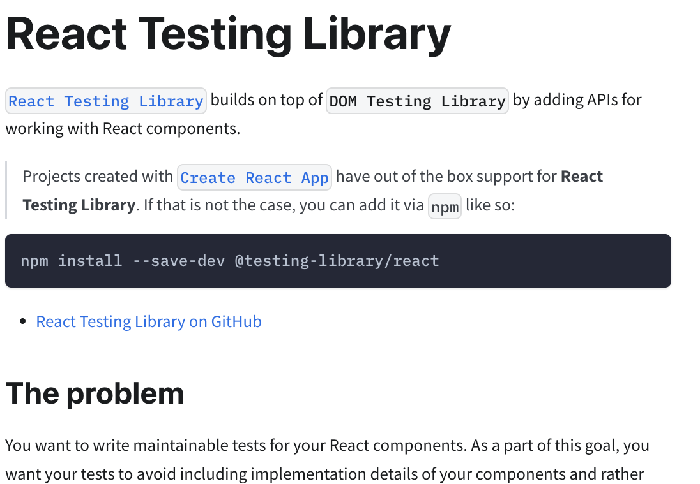

	

  <h1>Migrating from Enzyme to React Testing Library</h1>

   

  <h2>Ben Ilegbodu</h2>

   

  
[@benmvp](https://twitter.com/benmvp) | [benmvp.com](https://www.benmvp.com/?utm_source=benmvp&utm_medium=slides&utm_campaign=reactmiami-2022) | [@ReactMiamiConf](https://twitter.com/ReactMiamiConf)

   

  
April 19, 2022

  

NOTES:
**RESTART THE TIMER!!!!**

- Hello everyone!

- **RESTART THE TIMER!!!!**
- **TWEETED OUT THE SLIDES!**

=====
<!-- .slide: data-background="url(../../img/esnext/simon-rae-221560-unsplash.jpg) no-repeat center" data-background-size="cover" -->

  

    
  

NOTES:

- Let's start w/ a quick history lesson
- Enzyme really changed the game for how we could unit test UIs
  - It's v1 came out latest in 2015
- Because React separates rendering from flushing to the DOM
  - We can render React components without needing a browser
  - Before React testing UIs required running the unit tests in a headless browser
- It's API Mimics jQuery's API for DOM manipulation & traversal
  - It has a element wrapper similar to jQuery (we'll see in a bit)
  - But it also dug into implementation details like inspecting state
  - Ultimately became its undoing
- **How many people are using Enzyme?**

/////
<!-- .slide: data-background="url(../../img/esnext/simon-rae-221560-unsplash.jpg) no-repeat center" data-background-size="cover" -->

  

    
  

NOTES:

- But in general everything was okay until React 17 came out
- For us consumers of React 17 it was probably the easiest React upgrade there had ever been
  - Just switched from React `16.14.0` to `17.0.2`
  - And our apps worked the same

/////
<!-- .slide: data-background="url(../../img/esnext/simon-rae-221560-unsplash.jpg) no-repeat center" data-background-size="cover" -->

  

    
  

NOTES:

- The same couldn't be said for our tests though
- While React 17 didn't change any features
  - A lot of its internals were rewritten to set the stage for React 18 & beyond
- And unfortunately the Enzyme adapters relied heavily on React internals
- This Github issue was opened nearly 2 years ago and has ~100 comments
  - And it's still open; the official adapter never got created 😭
- The questions of "is Enzyme dead" began
  - Enzyme the API was actually fine
  - But the fact there there wasn't a React 17 adapter made it unusable

/////
<!-- .slide: data-background="url(../../img/esnext/simon-rae-221560-unsplash.jpg) no-repeat center" data-background-size="cover" -->

  

    

    
<a href="https://dev.to/wojtekmaj/enzyme-is-dead-now-what-ekl" target="_blank">Enzyme is dead. Now what?</a>

  

NOTES:

- However, shortly after that issue was filed kind soul created an "unofficial" React 17 adapter
  - The intention was for it to be a stopgap adapter until the official one was released
  - But nearly 2 years and 24 releases later, it's basically become the official React 17 adapter
- I was hesitant to use it when React 17 first came out
  - But it now gets over 500k weekly downloads!
  - I've upgraded some apps w/ Enzyme tests over to it w/o a problem
  - It was just as easy as the main React 17 upgrade
- Turns out that the unofficial adapter helped prolong Enzyme's end-of-life
  - A year after releasing the adapter, the maintainer wrote a blog post claiming Enzyme's death
  - He regretted publishing the unofficial adapter because it gave devs hope that they could continue to use Enzyme
- When the React 18 beta was announced he tried to create a React 18 adapter to get ahead
  - But he quickly realized that it just wouldn't be possible
  - It would require a whole team to rewrite not only the adapter but Enzyme itself
  - No React 18 adapter would be coming

/////
<!-- .slide: data-background="url(../../img/esnext/simon-rae-221560-unsplash.jpg) no-repeat center" data-background-size="cover" -->

  

    
  

NOTES:

- Then guess what happened?!
  - React 18 finally released last month
  - Lots of excitement & anticipation (it's been a long time coming)
  - There are new Hooks, concurrent features, and more
- But that basically means Enzyme is officially end-of-life
  - We won't be able to upgrade apps to React 18 because of Enzyme
  - Event though React 18 provides gradual adoption

/////
<!-- .slide: data-background="url(../../img/esnext/simon-rae-221560-unsplash.jpg) no-repeat center" data-background-size="cover" -->

  

    
  

NOTES:

- But it's not the end of the world
  - Because React Testing Library has entered the chat
- Kent C. Dodds created React Testing Library just over 4 years ago
  - Even before these technical issues with Enzyme, RTL had already become more popular
  - If not in raw downloads, definitely in preference
  - Many people have already migrated over because of the better experience (which we'll talk about)
- RTL's guiding principle is that React tests should closely resemble how the web page is used
  - It's API is designed to accomplish that and almost prevent testing internals
- It works w/ newer versions of React because it renders the component to a DOM tree
- **How many people here are using RTL?**

=====

<!-- .slide: data-background="url(../../img/giphy/stand-up-steph-curry.gif) no-repeat center" data-background-size="cover" -->

  

    <h1 style="font-size: 5em">Stand Up!</h1>
  

NOTES:
- Before we continue can I get everyone to stand up?

/////
<!-- .slide: data-background="#000" -->

  

    
  

NOTES:

- My name is Ben Ilegbodu
- Christian, Husband, Father
- _Family introductions_
- We live in Pittsburg, CA (SF Bay Area)
- Also a Google Developer Expert & Microsoft MVP in Web Technologies

/////

<!-- .element: class="plain" style="width: 75%" -->

NOTES:

- I'm a Frontend Architect at Stitch Fix
  - On our frontend platform team
  - We work on building out our React Design System
  - Also focus on frontend infrastructure to allow devs to focus on features
- Stitch Fix is an online personal styling service
  - Take the effort out of shopping by providing a selection of clothes picked just for you
  - And sent to your door on a frequency that you choose or you can shop directly
  - Combines technology, data science & human stylists
- We're hiring!
  - US-only unfortunately
  - Headquarters is in SF
  - And we had remote engineers all over the country even before COVID

=====
<!-- .slide: data-background="url(../../img/perfect-lib/annie-spratt-rx1iJ59jRyU-gift-box-unsplash.jpg) no-repeat center" data-background-size="cover" -->

NOTES:
- Enough about me!
- Let's talk about transitioning from Enzyme to React Testing Library
- I'll be covering RTL best practices
  - So even if you're already using RTL...
  - My hope is that you'll learn something new

=====
<!-- .slide: data-background="url(../../img/perfect-lib/annie-spratt-rx1iJ59jRyU-gift-box-unsplash.jpg) no-repeat center" data-background-size="cover" -->

# 1. Rendering

NOTES:

- Enzyme: `shallow`, `mount` & `render`
- RTL: full DOM render only
- compare render trees (Enzyme includes components in tree where RTL is strictly DOM)
- compare Enzyme "wrapper" vs RTL
- If you're using `mount()`, you're closest to RTL

=====
<!-- .slide: data-background="url(../../img/perfect-lib/annie-spratt-rx1iJ59jRyU-gift-box-unsplash.jpg) no-repeat center" data-background-size="cover" -->

# 2. Finding Elements

NOTES:
- Enzyme: uses "wrapper" to find by CSS selector, component constructors, component names or object property selector
  - https://enzymejs.github.io/enzyme/docs/api/ReactWrapper/find.html
  - Let's you dig too much into implementation details w/o focus on what the user is doing
  - Returns another "wrapper"
- RTL: uses accessibility-driven queries (also `data-testid`)
  - Search how user would use the component
  - Returns DOM elements w/ normal DOM attributes
  - Show [table of query types](https://testing-library.com/docs/queries/about/#types-of-queries)
  - Show [Priority](https://testing-library.com/docs/queries/about/#priority) based on guiding principles
- Could totally accomplish RTL-like querying w/ Enzyme
  - But it'd take diligence to avoid half of what Enzyme provides
  - And would have to write some helpers to accomplish the complicated ones (`*ByLabel`)

=====
<!-- .slide: data-background="url(../../img/perfect-lib/annie-spratt-rx1iJ59jRyU-gift-box-unsplash.jpg) no-repeat center" data-background-size="cover" -->

# 3. Assertions

NOTES:
- Enzyme: can assert on all sorts of things including internals like props & state
  - Hopefully already using [`jest-enzyme`](https://github.com/enzymejs/enzyme-matchers)
- RTL: assert on resultant DOM (`expect(screen.getByText('Katrina')).toBeVisible`)
  - Use [`@testing-library/jest-dom`](https://github.com/testing-library/jest-dom)

=====
<!-- .slide: data-background="url(../../img/perfect-lib/annie-spratt-rx1iJ59jRyU-gift-box-unsplash.jpg) no-repeat center" data-background-size="cover" -->

# 4. Firing events

NOTES:
- Enzyme: `simulate()`
  - For inputs, usually a single `'change'` event w/ final value
- RTL: `@testing-libray/user-event`
  - Provides helpers for common events
  - `userEvent.type` adds one key at a type so that multiple events are fired like real life

=====
<!-- .slide: data-background="url(../../img/perfect-lib/annie-spratt-rx1iJ59jRyU-gift-box-unsplash.jpg) no-repeat center" data-background-size="cover" -->

# 5. Common examples

NOTES:
- Text appears on a page
- Input field has the right value
- [Waiting for appearance / disapperance](https://testing-library.com/docs/guide-disappearance)
  - Async element shows up (click + AJAX + UI update)
- Querying within elements
- Debugging
- Snapshots
  - Not a fan, but can still do them

=====
<!-- .slide: data-background="url(../../img/ts-react/curved-library-susan-yin-2JIvboGLeho-unsplash.jpg) no-repeat center" data-background-size="cover" -->

# Resources

Notes:

- [Enzyme is dead. Now what?](https://dev.to/wojtekmaj/enzyme-is-dead-now-what-ekl)
- [Migrate from Enzyme to RTL docs](https://testing-library.com/docs/react-testing-library/migrate-from-enzyme/)
- [React Testing Library best practices](https://www.benmvp.com/blog/react-testing-library-best-practices/?utm_source=benmvp&utm_medium=slides&utm_campaign=reactmiami-2022)

=====

<!-- .slide: data-background="url(../../img/perfect-lib/kelly-sikkema-fvpgfw3IF1w-thanks-unsplash.jpg) no-repeat center" data-background-size="cover"  -->

	

  <h1 class="closing">Ben Ilegbodu</h1>

   

  
<a href="https://twitter.com/benmvp" target="_blank">@benmvp</a> | <a href="https://www.benmvp.com/?utm_source=benmvp&utm_medium=slides&utm_campaign=reactmiami-2022" target="_blank">benmvp.com</a>

  
<a href="mailto:ben@benmvp.com">ben@benmvp.com</a>

  
<a href="https://github.com/benmvp" target="_blank">github/benmvp</a>

  

NOTES:
