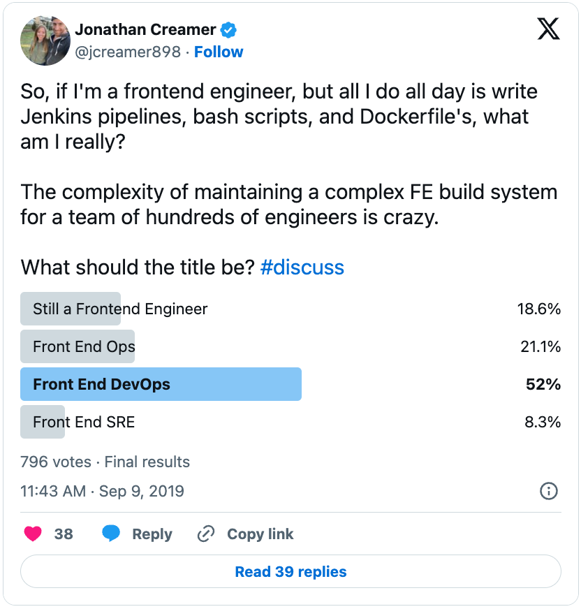
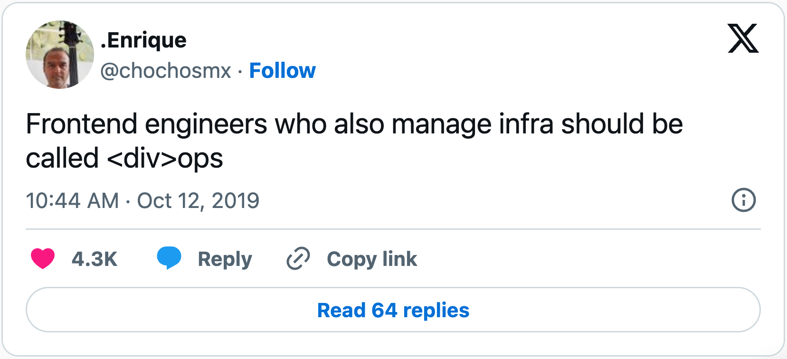

<!-- .slide: data-state="title-page" data-background="url(../../img/divops/tools-elena-rouame-9JU2CKqtw0M-unsplash.jpg) no-repeat center" data-background-size="cover" -->

 

  <h1>“DivOps” Engineering</h1>
  <h4>Unveiling the fusion of Frontend and DevOps</h4>

   

  <h3>Ben Ilegbodu</h3>

   

  
[@benmvp](https://twitter.com/benmvp) | [benmvp.com](https://www.benmvp.com/?utm_source=benmvp&utm_medium=slides&utm_campaign=connecttech-2023) | [@connect_js](@connect_js)

   

  
October 26, 2023

  

NOTES:
**RESTART THE TIMER!!!!**

- Good morning everyone!
  - Welcome to Day 2 of Connect.Tech
  - I hope everyone enjoyed Day 1 and are excited for what's to come today
- A few years ago I started to have a bit of an identify crisis
- I called myself a frontend engineer, but I wasn't really writing frontend code anymore
  - I wasn't writing any React
  - No semantic HTML or CSS
  - I could go days without visiting `localhost` in the browser
- I was doing everything _around_ frontend development
- I've always been on Frontend Platform teams...
  - So am I a frontend platform engineer?
  - Doesn't exactly roll of the tongue
- So I want to take you on a journey of my "self discovery"
  - Of who I truly am now 😆

/////

  <a href="https://benmvp.com/ct-divops?utm_source=benmvp&utm_medium=slides&utm_campaign=connecttech-2023" target="_blank">
    benmvp.com/ct-divops
  </a>

NOTES:

- I want to let you know that these slides are already available online
  - So if you want to follow along or can't see well from the back, I've got you covered
- You can use this handy dandy QR code that'll take you to the slides
- You can go to my website, `benmvp.com`, and find them there too
- You may be thinking "how do I know that I even want these slides, Ben?"
  - Well... you will
  - But if you're still doubtful, I've got a short URL at the bottom
  - So once you are convinced you've always got a link to follow
- So you're covered with **three** different ways to access the slides!

=====

# ✋🏾 Who's a (Frontend) Platform Engineer?

NOTES:

- Actually before I begin, who considers themselves a Frontend Platform Engineer?
- Not too many now, but let's see if that changes by the end of our time

=====
<!-- .slide: data-background="url(../../img/ts-react/grass-field-ales-krivec-4miBe6zg5r0-unsplash.jpg) no-repeat center" data-background-size="cover" -->

 

    <h2>Good ol' days</h2>

    <pre class="large"><code class="lang-html">&lt;HTML>&lt;HEAD>
    &lt;LINK rel="stylesheet" href="styles.css">
    &lt;SCRIPT src="script.js">
  &lt;/HEAD>&lt;BODY>
    &lt;IMG SRC="spacer.gif">
&lt;/BODY>&lt;/HTML>
</code></pre>
  

NOTES:

- My story begins 20 years ago when I started web dev
  - Since I was a teenager in high school
- And when I first started, we were using...
  - Literal, handwritten HTML pages using all caps
  - Manually including CSS using the `<link>`
  - And, if using JS, a blocking `<script>`
- If anyone coded with that "spacer gif" you're a real O.G.!
- It was really the wild west then

/////
<!-- .slide: data-background="url(../../img/nextjs/servers-ismail-enes-ayhan-lVZjvw-u9V8-unsplash.jpg) no-repeat center" data-background-size="cover" -->

 

    <h2>jQuery &amp; AJAX</h2>

    <pre class="large"><code class="lang-javascript">$.ajax({
  url: "/api/getWeather",
  data: {
    zip: 77578
  },
  success: function(result) {
    $("#weather-temp")
      .html("&lt;p>" + result + "&lt;/p> degrees");
  }
});</code></pre>
  

NOTES:

- Then jQuery and AJAX entered the chat
- And it was A LOT easier for me to write interactive pages
  - Because jQuery smoothed over the browser JS differences
- We complain about browsers moving slow to adopt awesome new features
  - But back then browsers didn't agree on how to make `fetch` requests
- In fact, `fetch` didn't exist back then
  - We had AJAX: Asynchronous JavaScript and XML
  - We quickly ditched the XML for JS but the name stuck
- jQuery was great, but not great enough
  - Which lead to...

/////
<!-- .slide: data-background="url(../../img/divops/soldier-British-trench-Western-F.png) no-repeat center" data-background-size="cover" -->

 

    <h2>Framework War I (FWI)</h2>

    

      
      
      
      
      
      
      
      
      
      
    

NOTES:

- The first framework war
  - It focused on making it easier to create browser interactivity
  - They were all "MVC" (Model, View, Controller) frameworks
  - Adapted from the backend frameworks
- ✋🏾 How many of these 10 can you name?
  - **AngularJS, EmberJS, BackboneJS, ExtJS, KnockoutJS**
  - **PolymerJS, MeteorJS, Bootstrap, Foundation, jQuery**
- There was no npm or Github
  - These were available my downloading zip files with minified JS
  - Then link to it as a `<script>` in the HTML
  - Unfathomable now

/////
<!-- .slide: data-background="url(../../img/divops/modern-home.jpg) no-repeat center" data-background-size="cover" -->

 

    <h2>Modernization of tooling</h2>

    

      
      
      
      
      
      
      
      
      
      
    

NOTES:

- Well the industry needed a way to manage all of this JavaScript and CSS
- We needed to store and retrieve it somewhere (npm & later yarn)
- We needed to bundle & minify it (Webpack & Prettier)
- We needed to verify it (ESLint & Jest)
- As we transitioned from ES5 to ES6...
  - We wanted to use new functionality earlier (Babel)
- We needed to be able to run all these tasks (Grunt & Gulp)
- **This is where I slowly started to move away from just UI**
  - Working in a Node environment as well

/////
<!-- .slide: data-background="url(../../img/divops/world-war-2-flag-raising.jpg) no-repeat center" data-background-size="cover" -->

 

    <h2>Framework War II (FWII)</h2>

    

      
      
      
      
      
      
      
      
      
      
    

NOTES:

- As if one framework war was enough, there was another one
- This was the second iteration of UI frameworks
  - But instead of all-in-one frameworks...
  - There were targeted libraries that I had to compose together
- The frontend is getting real complicated now
- ✋🏾 How many of these libraries can you name?
  - **Angular, React, Vue, Redux, MobX**
  - **RxJS, React Router, Relay, Apollo, Falcor**
- But these still focused on the UI...

/////
<!-- .slide: data-background="url(../../img/divops/zombie-apocalypse.jpg) no-repeat center" data-background-size="cover" -->

 

    <h2>(Meta) Framework War III (FWIII)</h2>

    

      
      
      
      
      
      
      
      
      
      
    

NOTES:

- Now we're in Framework War 3 where it's less about the UI...
  - And more about the development & deployment environments, i.e. meta frameworks
  - Next.js and others are making us full-stack engineers
- These frameworks are trying to abstract all the non-UI work that the previous frameworks created
- What I find interesting is that a lot of tooling is migrating to Rust
  - To make the tooling even faster
  - **SWC** is one of them: a Rust-based platform for the Web
- ✋🏾 These should be easier to identify since they're newer
  - **Create React App**, **Next.js**, **Gatsby**, **Astro**, **Remix**
  - **Nuxt**, **Vite**, **SWC**, **Vercel**, **Netlify**

/////
<!-- .slide: data-background="url(../../img/divops/gandini-juggling-guardian.jpg) no-repeat center" data-background-size="cover" -->

 

    <h2>DivOps Engineering</h2>

    

      

      
    

NOTES:

- Now I am a Frontend Engineer...
  - Who's not writing any UI code
  - But instead is focused on everything else besides the actual feature development
- As my good friend Jonathan points in this tweet...
  - Maintaining a complex FE build system is serious work
  - So what type of engineering is this?
- I call this fusion of Frontend & DevOps...
  - This new discipline of maintaining frontend-related infra is...
  - **"DivOps"**
  - It's Frontend engineers who are also (or exclusively) maintaining infra
- I can't take credit for the name DivOps though...
  - Technically, Enrique was the genesis
  - He tweeted this almost exactly 3 years ago
- But I've been pushing and broadcasting it wherever I go!

=====
<!-- .slide: data-background="url(../../img/giphy/stand-up-steph-curry.gif) no-repeat center" data-background-size="cover" -->

  

    <h1 style="font-size: 5em">Stand Up!</h1>
  

NOTES:

- But before we continue any further can I get everyone to stand up?

/////
<!-- .slide: data-background="#222" -->

  

    
  

NOTES:

- My name is Ben Ilegbodu
  - Christian, Husband, Father
- _Family introductions_
- We live in Houston (suburb called Manvel)
  - We just moved back

/////
<!-- .slide: data-background="#222" -->

  

    
  

NOTES:

- I love basketball
  - Both playing & watching
- Being from Houston, I'm a Rockets fan
  - But my daughter grew up in the Bay Area
  - So she's a Warriors fan
  - Gotta work on that one

/////
<!-- .slide: data-background="#222" -->

  

    
  

  

    
  

NOTES:

- I'm a Google Developer Expert in Web Technologies
- Also currently a Frontend Architect at Stitch Fix
- Stitch Fix is an online personal styling service
  - Combines technology & data science
  - With an actual human stylist
  - Take the effort out of shopping by providing a selection of clothes picked just for you
  - And sent to your door on a frequency that you choose

=====
<!-- .slide: data-background="url(../../img/divops/gandini-juggling-guardian.jpg) no-repeat center" data-background-size="cover" -->

 

    <h1 style="font-size: 5em">DivOps Engineering</h1>
  

NOTES:

- Okay, enough about me...
- Let's dig deeper into DivOps engineering
- And none of this will be about UI development
  - Just everything around it to make it happen

=====
<!-- .slide: data-background="url(../../img/perfect-lib/nesa-by-makers-kwzWjTnDPLk-black-developers-unsplash.jpg) no-repeat center" data-background-size="cover" -->

 

    <h1>Development</h1>
  

NOTES:

- Let's start with the development environment
- The foundation of any modern web dev environment is...
  - A JavaScript compiler/transpiler and a module bundler

/////
<!-- .slide: data-background="url(../../img/perfect-lib/nesa-by-makers-kwzWjTnDPLk-black-developers-unsplash.jpg) no-repeat center" data-background-size="cover" -->

 

    <h2>Compilers/transpilers</h2>

    

      
      
      
      
    

  

NOTES:

- _Transpiling_ transforms modern JS into code that JS engines (like the browser) can understand
- The most popular JS compiler/transpiler is still **Babel**
  - Since it's 6to5 days
  - It's got a huge config because of all the plugins it supports
- **TypeScript** technically is another transpiler
  - We can use its CLI to output vanilla JS
  - But these days it focuses mainly on its type system
  - I actually use a TS Babel plugin to type check with TS but transpile with Babel
- But the Rust-based **SWC** is on the come up
  - Next.js and other tools have switched from Babel to it
  - It claims to be 20x faster than Babel
- There's also **Closure** from Google...
  - But I haven't met any one using it
  - If you are, I'd like to meet you
  - You are the real unicorn developer 😆

/////
<!-- .slide: data-background="url(../../img/perfect-lib/nesa-by-makers-kwzWjTnDPLk-black-developers-unsplash.jpg) no-repeat center" data-background-size="cover" -->

 

    <h2>Bundlers</h2>

    

      
      
      
      
      
      
      
    

  

NOTES:

- Then there are the many bundlers
  - This space is more active because large & slow-to-build bundles are a huge problem for the ecosystem
- **Webpack** is the dominant player in this section
  - Has a crazy amount of configurations as well with all the loaders
- But **Vite**, **Turbopack** & **esbuild** are all promising speed and small sizes
- There also were Rome & Snowpack but they've dropped out of the space
  - We gotta be careful who we hitch are wagons to

/////
<!-- .slide: data-background="url(../../img/perfect-lib/nesa-by-makers-kwzWjTnDPLk-black-developers-unsplash.jpg) no-repeat center" data-background-size="cover" -->

 

    <h2>UI (Meta) Frameworks</h2>

    

      
      
      
      
    

  

NOTES:

- Because of the complexity & expertise needed to properly configure these low-level tools...
  - Many other tools wrap compilers & bundles to get them to work w/ particular frameworks
  - There are now **meta** frameworks to handle it for us as I mentioned at the beginning
  - "Frameworks of frameworks"
- **Next** for React, **Nuxt** for Vue, **Analog** for Angular...
  - Or can go the route of **Astro** which works with (almost) any framework
- They also support routing, styling, SSR, etc.
  - But one goal is to abstract the DivOps-y things

/////
<!-- .slide: data-background="url(../../img/perfect-lib/nesa-by-makers-kwzWjTnDPLk-black-developers-unsplash.jpg) no-repeat center" data-background-size="cover" -->

 

    <h2>API Integrations</h2>

    

      
      
      
    

  

NOTES:

- But there's even more once we get passed compilers and bundlers
- Frontend engineers may even have to setup API integrations like...
  - **Firebase** or **Apollo GraphQL** or **Prisma**
- _Maybe_ the DevOps engineers can set up Firestore or Firebase authentication
  - But I wouldn't be surprised if a Frontend Engineer does it either

/////
<!-- .slide: data-background="url(../../img/perfect-lib/nesa-by-makers-kwzWjTnDPLk-black-developers-unsplash.jpg) no-repeat center" data-background-size="cover" -->

 

    <h2>Multi-app orchestration</h2>

    

      
      
      
      
      
    

  

NOTES:

- If in addition to the primary site the company also has...
  - A marketing site or blog or other sub-domains...
  - All backed by a shared component library
  - A monorepo is super helpful to keep things centralized & in sync
- A monorepo allows for multiple projects (apps and/or libraries) to live in the same repo
  - Modern cloud platforms know to deploy these for multiple domains
- This is typically handle by workspaces where each project is a workspace
  - npm, yarn & pnpm all support them
- And then tools like **Lerna** & **Turborepo**...
  - Can be layered on top of them to help with orchestrating builds, tests, etc.
- A DevOps engineer is definitely not setting this up
  - So who does it fall to?
  - Us!

/////
<!-- .slide: data-background="url(../../img/perfect-lib/nesa-by-makers-kwzWjTnDPLk-black-developers-unsplash.jpg) no-repeat center" data-background-size="cover" -->

 

    <h2>Command-line scripts</h2>

    

      
      
      
      
    

  

NOTES:

- Lastly, FE engineers often write other kinds of JavaScript
  - It's not JS going into the browser
  - It's also not JS running on a Node server (like Express)
- These are scripts run from the command-line typically via npm scripts
  - They glue everything together
- They can run mock data environments like **Firebase Emulator Suite** or **Mock service worker**
- They can be **codemods** w/ Babel that rewrite/upgrade/refactor source code
- Others scripts run other tools like `serve` or `nodemon` for running the web app locally
- Once we know JS the possibilities are endless
- Some of us take running a development environment for granted
  - I know plenty of projects where devs can't even run the app locally because it hadn't been maintained

=====
<!-- .slide: data-background="url(../../img/divops/magnifying-glass-markus-winkler-afW1hht0NSs-unsplash.jpg) no-repeat center" data-background-size="cover" -->

 

    <h1>Static-analysis</h1>
  

NOTES:

- So we've talked about the **Development** & **Repo** environments...
- Let's get into the **Static-analysis** environment
- I don't know how it is with other communities...
  - But I'm a fan of the emphasis on static-analysis w/in the FE ecosystem
- These tools help us to keep our code style consistent...
  - But also catch issues in our code w/o ever running it

/////
<!-- .slide: data-background="url(../../img/divops/magnifying-glass-markus-winkler-afW1hht0NSs-unsplash.jpg) no-repeat center" data-background-size="cover" -->

 

    <h2>Linting</h2>

    

      
      
      
    

  

NOTES:

- **ESLint** for JavaScript & **Stylelint** for CSS are the main players in the linting game
  - Technically **StandardJS** is a linter in the JS space
  - But I haven't seen anyone using it lately
- If this were 5 years ago, maybe I'd mention StandardJS
  - Or **TSLint** or **JSLint**
  - But it's basically all **ESLint** now
- Each with their on configuration platform
  - And each with their own plugins ecosystems

/////
<!-- .slide: data-background="url(../../img/divops/magnifying-glass-markus-winkler-afW1hht0NSs-unsplash.jpg) no-repeat center" data-background-size="cover" -->

 

    <h2>Formatting</h2>

      

      
      <a href="https://typicode.github.io/husky/" target="_blank">
        🐶
      </a>
      
    

  

NOTES:

- And then there's code formatting
- It's a bit different than linting
  - It actually has similar qualities to compiling & linting
  - It changes your code like a compiler...
  - But more for code style like a linter
- Like ESLInt, **Prettier** is the main player here
  - (**StandardJs** is also a formatter BTW)
- Luckily the Prettier configuration is pretty small
  - I think that's which it was really successful
  - Unlike most tools where we have to decide what options to configure
  - It is very opinionated out of the box
- Oh and I use Husky + Lint Staged in order to lint before committing code
  - It's an annoying DevEx to linting rules in CI

-----

- I mentioned how static-analysis tools help validate our code before even running it
- Well I use Prettier + VS Code as immediate feedback
- I format on save...
  - So if I save and the code doesn't shift and format...
  - I know that there's something invalid with my code...
  - Like a missing curly brace or parenthesis such that the code is invalid

/////
<!-- .slide: data-background="url(../../img/divops/magnifying-glass-markus-winkler-afW1hht0NSs-unsplash.jpg) no-repeat center" data-background-size="cover" -->

 

    <h2>Type-checking</h2>

    

      
      
    

  

NOTES:

- And then there's **TypeScript**
  - Is there anything else doing type-checking?
- I guess there's technically **Flow**
  - But I'm not sure if that's even used outside of Meta/Facebook
- Whenever I have to go back to JS-only codebase
  - I just feel so... unsafe
  - Can this be `null`?
  - What properties are on this nested object?
- As I mentioned before, I use TypeScript with Babel
  - Babel does the transpiling of TypeScript to valid JS
  - TypeScript handles the type-checking
- And when combined with VS Code, I immediately have type errors/hint
  - To guide me to the correct code
- Learning TypeScript has a huge learning code...
  - In fact, I've been using it for 5 years and still learn new things

/////
<!-- .slide: data-background="url(../../img/divops/magnifying-glass-markus-winkler-afW1hht0NSs-unsplash.jpg) no-repeat center" data-background-size="cover" -->

 

    <h2><code>tsconfig.json</code></h2>

    <pre><code class="lang-json">{
  "compilerOptions": {
    "allowJs": true,
    "allowSyntheticDefaultImports": true,
    "declaration": false,
    "downlevelIteration": true,
    "esModuleInterop": true,
    "isolatedModules": true,
    "moduleResolution": "Node16",
    "noEmit": true,
    "noUnusedLocals": false,
    "resolveJsonModule": true,
    "skipLibCheck": true,
    "sourceMap": true,
    "strict": true,
    "target": "esnext",
    "types": ["node", "jest"]
  }
}</code></pre>

  

NOTES:

- But unlike Prettier, the configuration for a `tsconfig.json` is no joke!
- Your average FE Developer has no idea what this all means
  - And someone has to learn what each one of these configurations mean
  - Because when we don't stuff we expect to work, have type errors
  - And there's nothing worse than fighting the type system
- This is why DivOps Engineering is important
- I mean look at this thing
  - Even ChatGPT struggles!
- There's definitely someone right now looking at this configuration...
  - Pointing out stuff that's incorrect
  - And my response is... yep you're right! 😆

=====
<!-- .slide: data-background="url(../../img/divops/litmus-test.jpeg) no-repeat center" data-background-size="cover" -->

 

    <h1>Testing</h1>
  

NOTES:

- What do we have next?
  - Ah, yes. The testing environment
- FE Engineers also have to set up and maintain the various FE testing environments
  - Yes, there is more than unit testing
- But IMO, the earlier we can configure the testing platforms...
  - The healthier the code base remains
  - And that's basically what the testing infra is for
- So let's dive into what DivOps engineers have to do in the testing space

/////
<!-- .slide: data-background="url(../../img/divops/litmus-test.jpeg) no-repeat center" data-background-size="cover" -->

 

    <h2>Unit Testing</h2>

    

      
      
      
      
      
      
    

  

NOTES:

- So there are a number of unit testing platforms
  - **Jest**, **Vitest**, **Mocha/Chai**, **Ava** & **Tape**
- But there are only really 2 legit options
  - **Jest** & **Vitest**
- And just like **Babel**, **Webpack**, **ESLint**, **TypeScript** and everything else
  - They with it's own huge config options

/////
<!-- .slide: data-background="url(../../img/divops/litmus-test.jpeg) no-repeat center" data-background-size="cover" -->

 

    <h2><code>jest.config.json</code></h2>

    <pre><code class="lang-js">module.exports = {
  moduleNameMapper: { '\*\*/\*.modules.s?css': 'identity-obj-proxy' },
  modulePathIgnorePatterns: ['/\\built/'],
  setupFiles: ['&lt;rootDir>/jest.setupFiles.ts'],
  setupFilesAfterEnv: ['&lt;rootDir>/jest.setupFilesAfterEnv.ts'],
  testMatch: ['\*\*/\*.test.[jt]sx?'],
  transform: {
    '\\.[jt]sx?$': 'babel-jest'
  },
  verbose: true,
}</code></pre>

  

NOTES:

- Technically we can use Jest without a configuration file
  - But given all of the other things we've customized
  - There's no way we can go without one
- I counted over **70** configuration properties 🫨
  - And that doesn't all the various presets and transformers
- Testing is important, but configuring Jest is very different than writing tests
  - It takes skill set (and interest) to create and maintain these things

/////
<!-- .slide: data-background="url(../../img/divops/litmus-test.jpeg) no-repeat center" data-background-size="cover" -->

 

    <h2>End-to-end testing</h2>

    

      
      
      
      
    

  

NOTES:

- On one end of the spectrum is unit testing
  - These are tests that validate input/output functions
  - And with modern frameworks like React...
  - We can test markup and light UI interactions
- But if we really want to validate the browser UX...
  - We need to write end-to-end tests
- There are a number of options we can pick
  - **Webdriver.io** is the O.G. of the group built on Selenium
  - **Cypress** used to be the darling...
  - But now it seems like **Playwright** is the library of choice
- So once again, not only does someone have to decide which one to choose...
  - But they also have to configure & maintain the platform
  - And figure out how to have the proper test & CI environments
- And of course each platform has its own set of configurations

/////
<!-- .slide: data-background="url(../../img/divops/litmus-test.jpeg) no-repeat center" data-background-size="cover" -->

 

    <h2>Visual testing</h2>

    

      
      
      
      
    

  

NOTES:

- Finally there's visual testing
- First is **Storybook** that works for a number of UI frameworks...
  - Although it started off for React
  - It's all about testing UI components
  - But for component libraries it serves as documentation & even development environment as well
- **Chromatic** is a visual regression tool made by the Storybook folks
  - So now we can ensure that our components continue to look the way they should after code changes
  - The components are just as much as about their look & feel as their UI interactions
- But now the service needs to integrate with Github, set up tokens...
  - In addition to having to configure browsers, browser widths and all that jazz
- **Percy** is also a visual regression too
  - Probably the most popular one
  - **Browserstack** recently bought them
- Browserstack allow us to run tests on _real_ devices so there's no emulation
  - Couple that with Percy and one end-to-end frameworks...
  - And we've got a powerful way to ensure that our UIs are visually consistent on real browsers

=====
<!-- .slide: data-background="url(../../img/divops/highway-interchange-patrick-federi-WkAIAf3l4zg-unsplash.jpg) no-repeat center" data-background-size="cover" -->

 

    <h1>CI / CD</h1>
  

NOTES:

- Let's recap before we continue
  - We've already covered a lot:
  - **Development**, **Repo**, **Static-analysis**, and just now **Testing**
  - And now we've got Continuous Integration & Continuous Deployment/Delivery
- Quick aside, I got my first professional job in 2006
  - And we didn't have any testing or continuous deployment
  - We shipped once every 2 weeks
  - So manually testing running up to those 2 weeks was a nightmare

-----

- This is where I think FE engineers _really_ get out of the frontend space
  - Although since CI & Production apply for all sorts of projects & services
  - DevOps engineers are likely going to be the ones who set it up
- But typically they are trained in backend engineering
  - So they are less familiar in maintaining frontend toolchains in production
- As a result, the responsibility falls on FE (DivOps) engineers to...
  - Do what's necessary to get the web app to Production
  - OR the JS library to npm

/////
<!-- .slide: data-background="url(../../img/divops/highway-interchange-patrick-federi-WkAIAf3l4zg-unsplash.jpg) no-repeat center" data-background-size="cover" -->

 

    <h2>Continuous Integration</h2>

    

      
      
      
      
    

  

NOTES:

- Up until now, everything that the DivOps engineer has set up, configured, and maintained...
  - Has been local to the repo running on an individual developers' machine
- But once we get to Continuous Integration...
  - We're running in **Github Actions**, **GitLab CI**, **Circle CI**, **Jenkins**, and other CI tools
  - So that means we're writing YAML for Github Actions
  - Or YAML for Circle CI
  - Or YAML for Jenkins
  - Or YAML for... I don't know what the deal is with CI tools in YAML!
  - I still copy and paste YAML because I just don't quite get the format
- We're probably also writing more Node or even Bash scripts to orchestrate all of the previous tools...
  - ...but in a CI environment
  - Running static checks, running tests, building the app/library, etc
  - Figuring out pipelines, caching, test sharding, etc
  - Running end-to-end tests, sending snapshots for visual regression, everything!

/////
<!-- .slide: data-background="url(../../img/divops/highway-interchange-patrick-federi-WkAIAf3l4zg-unsplash.jpg) no-repeat center" data-background-size="cover" -->

 

    <h2>App deployment (DIY)</h2>

    

      
      
      
      
      
      
      
      
      
      
    

  

NOTES:

- Then comes the CD of CI/CD, **Continuous Deployment** of applications
- This is on the very fringes of my expertise or even desire to understand
  - The nice part is that this is what actual DevOps engineers do
  - So this is the hand-off point
- The tools I've listed here are just names I've heard of over the years 🤣
  - I don't know if they are a subset of each other or what
- I actually have had to write **Docker** & **NGINX** configs
- Then you've got the deployment platforms (?) like **AWS**, **GCP** & **Azure**
- Then **Kubernets** & **Terraform** are ways to deliver the code to the platforms (?)
- Lastly I've listed a couple of Content Delivery Networks (CDNs):
  - **Cloudflare**, **Akamai**, and **Fastly**
- I couldn't tell you how to configure any of those providers
  - That's the DevOps engineer's job

/////
<!-- .slide: data-background="url(../../img/divops/highway-interchange-patrick-federi-WkAIAf3l4zg-unsplash.jpg) no-repeat center" data-background-size="cover" -->

 

    <h2>App deployment (providers)</h2>

    

      
      
      
      
      
      
    

  

NOTES:

- However, in an environment where are there are no DevOps engineers
  - Or we're working on a different app (maybe internal, blog, marketing, etc)
  - A Frontend Engineer may end up still being responsible for deployment/delivery
- That's where these cloud providers come in
  - They layer on top of those previous platforms (AWS, Kubernetes, etc)...
  - To create a much easier experience
- Tools like **Vercel**, **Netlify**, **Firebase**, and others
  - And of course they have their own config files, like `vercel.json`
  - And of course that's set up and maintained by the DivOps engineers
- The promise with these is that you connect your Vercel project to a repo
  - So that whenever we commit to `main`, it'll run checks & build automatically
  - Then when everything passes it'll deploy to Production
- And many of these services offer what are called **branch previews**
  - We can push up a branch or create a PR and we can see what our update will look like in Production

/////
<!-- .slide: data-background="url(../../img/divops/highway-interchange-patrick-federi-WkAIAf3l4zg-unsplash.jpg) no-repeat center" data-background-size="cover" -->

 

    
<a href="https://2023.connect.tech/session/493179">Optimizing your development pipelines and workflows with CI/CD</a>

    

    
<strong>Jeremy Meiss</strong>

    
11:30 AM (Core/Advanced JS)

  

NOTES:

- If any of this CI/CD stuff sounds interesting to you
  - Jeremy is actually giving a talk about CI/CD later this morning
- The entire talk is just on CI/CD
  - That's how we know there's a lot there

/////
<!-- .slide: data-background="url(../../img/divops/highway-interchange-patrick-federi-WkAIAf3l4zg-unsplash.jpg) no-repeat center" data-background-size="cover" -->

 

    <h2>Package release</h2>

    

      
      
      
    

  

NOTES:

- Oh but we're not quite done yet when it comes to continuous delivery
- What if instead of trying to deploy an app to production...
  - We're trying to release a new package version to npm?
- The common practice is to queue up a bunch of changes
  - And then do a manually do a release
- But how many of you have filed a bug for a library...
  - They actually fix it...
  - But it doesn't get released for weeks...?
- This is where "continuous release" comes in for JS packages
- **`semantic-release`** is the primary tool for this
  - They say they by removing human involvement they make releases "unromantic and unsentimental"
- However, it doesn't work with monorepo setups
  - One alternative, especially if you're already using **Lerna** is to use it's releasing functionality
  - Or you can use the standalone **`changesets`** library

=====
<!-- .slide: data-background="url(../../img/divops/live-concert-tijs-van-leur-Qnlp3FCO2vc-unsplash.jpg) no-repeat center" data-background-size="cover" -->

 

    <h1>Production</h1>
  

NOTES:

- Ok, so we've configured our app to make it out to Production (continuously)
  - But we're not done yet 😅
  - Of course more happens while our apps are running live
- So let's jump into our final section

/////
<!-- .slide: data-background="url(../../img/divops/live-concert-tijs-van-leur-Qnlp3FCO2vc-unsplash.jpg) no-repeat center" data-background-size="cover" -->

 

    <h2>Analytics</h2>

    

      
      
      
      
    

  

NOTES:

- Analytics are key with pretty much any app...
  - Because we need to have insights into what are users are doing...
  - So that we can make business decisions with the data
- **Google Analytics** is the obvious big elephant in the room
  - But there are some alternatives too...
- **Cloudflare** has analytics too
- I added 2 companies I had never heard of, but seem highly recommended
  - **Plausible** & **Matomo**
- So these need setup and instrumentation of the pages in the app

/////
<!-- .slide: data-background="url(../../img/divops/live-concert-tijs-van-leur-Qnlp3FCO2vc-unsplash.jpg) no-repeat center" data-background-size="cover" -->

 

    <h2>Monitoring</h2>

    

      
      
      
      
      
      
    

  

NOTES:

- And then there's monitoring
  - Equally important if not more so that Analytics
- We also need to know about our users' experience
- We need to know when something's gone wrong...
  - **Bugsnag**, **Sentry** or **Firebase Crashlytics**
- Or if something's already gone wrong, debug the problem
  - **Datadog**, **Dynatrace** or **New Relic**
- It's quite possible that the traditional DevOps team will help here...
  - With setting up the services
  - But we'll likely need to do the integrations into the apps

/////
<!-- .slide: data-background="url(../../img/divops/live-concert-tijs-van-leur-Qnlp3FCO2vc-unsplash.jpg) no-repeat center" data-background-size="cover" -->

 

    <h2>Performance</h2>

    

      
      
      
      
      
      
    

  

NOTES:

- Lastly, we have performance
  - Performance is a feature
  - Data shows that speading up pages increases conversions
- We can run things manually with **Lighthouse** & **PageSpeed Insights**
  - In fact, there's Lighthouse CI which allows us to do regression tests in CI
- We could roll our own perf monitoring on top of **Core Web Vitals**
- Or we can go full Sass and use a tool like **SpeedCurve**...
  - It specifically does real-user monitoring
- All of the previous mega tools (Datadog, etc.) have their own RUM offerings too
- And because these run entirely on the frontend...
  - DivOps! 😅

=====
<!-- .slide: data-background="url(../../img/esnext/simon-rae-221560-unsplash.jpg) no-repeat center" data-background-size="cover" -->

  

    <h1>Recap</h1>

    

      
      
      
      
      
      
      
      
      
      
      
      
      
      
      
      
      
      
      
      
      
    

  

NOTES:

- Ok, wow that was a lot!
- I've picked options for each of the types of tools I mentioned
  - Most of them I've used...
  - Others seem like the latest and greatest
- There are 21 tools shown here
  - It'd be interesting to see how many logos we can recognize
- But not only do we have to learn how to configure & maintain each...
  - In many cases we have to first decide which one to pick 😔
- And this doesn't even include configuring UI frameworks...
  - Like **Nuxt**. **Tailwind**, **Material UI**, etc.

/////
<!-- .slide: data-background="url(../../img/esnext/simon-rae-221560-unsplash.jpg) no-repeat center" data-background-size="cover" -->

  

    <h1>✋🏾 Who is a Platform Engineer?</h1>
  

NOTES:

- So now based upon all that I said who's a platform engineer?

/////
<!-- .slide: data-background="url(../../img/esnext/simon-rae-221560-unsplash.jpg) no-repeat center" data-background-size="cover" -->

  

    <h1>✋🏾 Who is a DivOps Engineer?</h1>
  

NOTES:

- Or better said, a DivOps engineer?
- Even if you don't do this all day, every day...
  - You're at least doing **DivOps engineering** when you do
- If most of you work revolves around these tools, you're definitely a DivOps engineer
- Or if it's some hybrid, then you're a Full Stack engineer
  - It's just that the stack goes in a different direction 😆

=====
<!-- .slide: data-state="title-page" data-background="url(../../img/divops/tools-elena-rouame-9JU2CKqtw0M-unsplash.jpg) no-repeat center" data-background-size="cover" -->

  

    <h1 style="font-size: 5em">DivOps is legit!</h1>
  

NOTES:

- Personally, I was hesitant/afraid to get into this space
  - Wanted to stay in my FE bubble of comfort
- Didn't do it all at once
- But slowly started building experience and expertise
- I want to encourage you
  - It's not janitorial work
  - Don't have to feel like it's a tangent
  - It's a legit field of FE development
- That's why I'm trying to bring awareness to it
  - And really legitimize it
- I'm waiting for the time where I don't just see...
  - A FE job posting with these skills
  - But an actual "DivOps Engineer" role
  - One day...

/////
<!-- .slide: data-state="title-page" data-background="url(../../img/divops/tools-elena-rouame-9JU2CKqtw0M-unsplash.jpg) no-repeat center" data-background-size="cover" -->

  

    <h2>DivOps community ✊🏾</h2>

    

      <a href="https://twitter.com/hashtag/divops" target="_blank">
        
        #divops
      </a>
      <a href="https://www.reddit.com/r/divops/" target="_blank">
        
        r/divops
      </a>
      <a href="https://discord.gg/Vvk67JDX6t" target="_blank">
        
        Divops
      </a>
    

  

NOTES:

- There's a burgeoning community around DivOps
- We've got the *_Twitter_ hashtag
- Divops **subreddit**
- And the DivOps **Discord** server
  - We tools and solutions for various DivOps-y problems we're facing
- Feel free to join the party! 🎉

=====
<!-- .slide: data-background="url(../../img/perfect-lib/kelly-sikkema-fvpgfw3IF1w-thanks-unsplash.jpg) no-repeat center" data-background-size="cover"  -->

 

  <h1 class="closing">Ben Ilegbodu</h1>

   

  
<a href="https://twitter.com/benmvp" target="_blank">@benmvp</a> | <a href="https://www.benmvp.com/?utm_source=benmvp&utm_medium=slides&utm_campaign=connecttech-2023" target="_blank">benmvp.com</a>

  
<a href="mailto:ben@benmvp.com">ben@benmvp.com</a>

  
<a href="https://github.com/benmvp" target="_blank">github/benmvp</a>

   

  

  

NOTES:

- Wow! So that was a lot
- Hopefully you learned a thing or 2
  - Maybe I exposed to some new tools you hadn't heard of?
- I could use your help, though...
  - I highlighted tools that I was aware of
  - If there any other ones that you think should've been included
  - Hit me up on Twitter
- You can ask me questions on Twitter (@benmvp) or find me afterwards
- Thanks!
