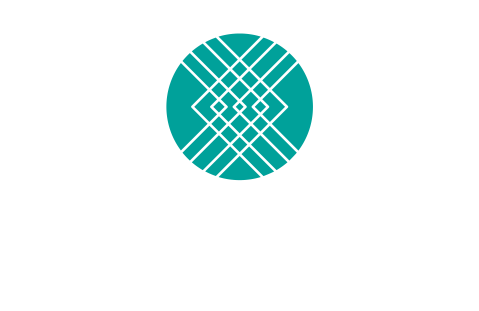

<!-- .slide: data-state="title-page" data-background="url(../../img/webdev/jason-leung-479251-unsplash.jpg) no-repeat center" data-background-size="cover" -->

 

  <h1>"DivOps" Engineering</h1>
  <h4>Unveiling the fusion of Frontend and DevOps</h4>

   

  <h3>Ben Ilegbodu</h3>

   

  
[@benmvp](https://twitter.com/benmvp) | [benmvp.com](https://www.benmvp.com/?utm_source=benmvp&utm_medium=slides&utm_campaign=connecttech-2023) | [@connect_js](@connect_js)

   

  
October 25, 2023

  

NOTES:
**RESTART THE TIMER!!!!**

-

/////

  <a href="https://benmvp.com/ct-divops?utm_source=benmvp&utm_medium=slides&utm_campaign=connecttech-2023" target="_blank">
    benmvp.com/ct-divops
  </a>

NOTES:

- I want to let you know that these slides are already available online
  - So if you want to follow along or can't see well from the back, I've got you covered
- You can use this handy dandy QR code that'll take you to the slides
- You can go to my website, `benmvp.com`, and find them there too
- So you're covered with **three** different ways to access the slides!

=====

# ✋🏾 Who's a Platform Engineer?

=====

# Good ol' days

/////

# jQuery / AJAX days

/////

# Framework wars (I)

/////

# Modernization of tooling

/////

# Framework wars (II)

/////

# Framework wars (III)

/////

# DivOps

NOTES:

- I call this fusion of Frontend & DevOps "DivOps"
- Typical DevOps engineers don't know frontend
- The "Frontend" is pushing further and further out

/////

NOTES:

- Can't take credit for the name

=====
<!-- .slide: data-background="url(../../img/giphy/stand-up-steph-curry.gif) no-repeat center" data-background-size="cover" -->

  

    <h1 style="font-size: 5em">Stand Up!</h1>
  

NOTES:

- But before we continue any further can I get everyone to stand up?

/////
<!-- .slide: data-background="#222" -->

  

    
  

NOTES:

- My name is Ben Ilegbodu
  - Christian, Husband, Father
- _Family introductions_
- We live in Manvel, TX (suburb of Houston)

/////
<!-- .slide: data-background="#222" -->

  

    
  

  

    
  

NOTES:

- I'm a Google Developer Expert in Web Technologies
- Also currently a Frontend Architect at Stitch Fix
- Stitch Fix is an online personal styling service
  - Combines technology & data science
  - With an actual human stylist
  - Take the effort out of shopping by providing a selection of clothes picked just for you
  - And sent to your door on a frequency that you choose

=====

# Development

=====

# Repo

NOTES:

- Dependency updates/wrangling

=====

# Static-analysis

=====

# Testing

=====

# CI / CD

NOTES:

- [optimizing your development pipelines and workflows with CI/CD](https://2023.connect.tech/session/493179)
- More Node scripts

=====

# Production

=====
<!-- .slide: data-background="url(../../img/esnext/simon-rae-221560-unsplash.jpg) no-repeat center" data-background-size="cover" -->

  

    <h1>Recap</h1>
  

NOTES:

/////
<!-- .slide: data-background="url(../../img/esnext/simon-rae-221560-unsplash.jpg) no-repeat center" data-background-size="cover" -->

  

    <h1>✋🏾 Who's a Platform Engineer?</h1>
  

=====
<!-- .slide: data-background="url(../../img/ts-react/curved-library-susan-yin-2JIvboGLeho-unsplash.jpg) no-repeat center" data-background-size="cover" -->

  

    <h1>Awareness & Legitimacy</h1>
  

=====
<!-- .slide: data-background="url(../../img/perfect-lib/kelly-sikkema-fvpgfw3IF1w-thanks-unsplash.jpg) no-repeat center" data-background-size="cover"  -->

 

  <h1 class="closing">Ben Ilegbodu</h1>

   

  
<a href="https://twitter.com/benmvp" target="_blank">@benmvp</a> | <a href="https://www.benmvp.com/?utm_source=benmvp&utm_medium=slides&utm_campaign=connecttech-2023" target="_blank">benmvp.com</a>

  
<a href="mailto:ben@benmvp.com">ben@benmvp.com</a>

  
<a href="https://github.com/benmvp" target="_blank">github/benmvp</a>

  

NOTES:

- And that's it!
- As the conference slowly wraps up
  - I wanted to take a moment to thank our organizer (Dylan)...
  - for inviting me to speak
  - But more importantly for continuing to put HalfStack conferences together
  - _Applause_
- You can ask me questions on Twitter (@benmvp) or find me afterwards
- I hope you enjoyed our ride in the wayback machine
  - Hopefully it gives us all an appreciation for where we've come from
- Next time we wanna complain about missing CSS features we wish would exist...
  - Remember the spacer gif
- Thanks!
