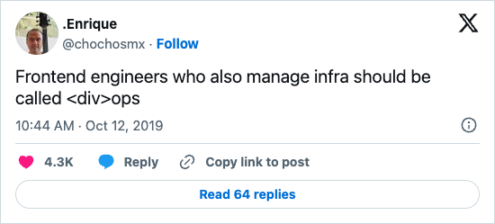

<!-- .slide: data-state="title-page" data-background="url(../../img/webdev/jason-leung-479251-unsplash.jpg) no-repeat center" data-background-size="cover" -->

 

  <h1>"DivOps" Engineering</h1>
  <h4>Unveiling the fusion of Frontend and DevOps</h4>

   

  <h3>Ben Ilegbodu</h3>

   

  
[@benmvp](https://twitter.com/benmvp) | [benmvp.com](https://www.benmvp.com/?utm_source=benmvp&utm_medium=slides&utm_campaign=connecttech-2023) | [@connect_js](@connect_js)

   

  
October 25, 2023

  

NOTES:
**RESTART THE TIMER!!!!**

-

/////

  <a href="https://benmvp.com/ct-divops?utm_source=benmvp&utm_medium=slides&utm_campaign=connecttech-2023" target="_blank">
    benmvp.com/ct-divops
  </a>

NOTES:

- I want to let you know that these slides are already available online
  - So if you want to follow along or can't see well from the back, I've got you covered
- You can use this handy dandy QR code that'll take you to the slides
- You can go to my website, `benmvp.com`, and find them there too
- So you're covered with **three** different ways to access the slides!

=====

# ✋🏾 Who's a Platform Engineer?

NOTES:

- Not too many now, but let's see if that changes by the end of our time

=====
<!-- .slide: data-background="url(../../img/ts-react/grass-field-ales-krivec-4miBe6zg5r0-unsplash.jpg) no-repeat center" data-background-size="cover" -->

 

    <h2>Good ol' days</h2>

    <pre class="large"><code class="lang-html">&lt;HTML>&lt;HEAD>
    &lt;LINK rel="stylesheet" href="styles.css">
    &lt;SCRIPT src="script.js">
  &lt;/HEAD>&lt;BODY>
    &lt;IMG SRC="spacer.gif">
&lt;/BODY>&lt;/HTML>
</code></pre>
  

NOTES:

- I've been developing on the web for over 20 years now
  - Since I was a teenager in high school
- And when I first started, we were using...
  - Literal, handwritten HTML pages using all caps
  - Manually including CSS using the `<link>`
  - And, if using JS, a blocking `<script>`
- If anyone coded with that "spacer gif" you're a real O.G.!
- It was really the wild west then

/////
<!-- .slide: data-background="url(../../img/nextjs/servers-ismail-enes-ayhan-lVZjvw-u9V8-unsplash.jpg) no-repeat center" data-background-size="cover" -->

 

    <h2>jQuery &amp; AJAX</h2>

    <pre class="large"><code class="lang-javascript">$.ajax({
  url: "/api/getWeather",
  data: {
    zip: 77578
  },
  success: function(result) {
    $("#weather-temp")
      .html("&lt;p>" + result + "&lt;/p> degrees");
  }
});</code></pre>
  

NOTES:

- Then jQuery and AJAX entered the chat
- And it was A LOT easier for me to write interactive pages
  - Because jQuery smoothed over the browser JS differences
- We complain about browsers moving slow to adopt awesome new features
  - But back then browsers didn't agree on how to make `fetch` requests
- In fact, `fetch` didn't exist back then
  - We had AJAX: Asynchronous JavaScript and XML
  - We quickly ditched the XML for JS but the name stuck
- jQuery was great, but not great enough
  - Which lead to...

/////
<!-- .slide: data-background="url(../../img/divops/soldier-British-trench-Western-F.png) no-repeat center" data-background-size="cover" -->

 

    <h2>Framework War I (FWI)</h2>

    

      
      
      
      
      
      
      
      
      
      
    

NOTES:

- The first framework war
  - Focused on making it easier to create browser interactivity
  - They were all "MVC" (Model, View, Controller) frameworks
  - Adapted from the backend frameworks
- ✋🏾 How many of these 10 can you name?
  - AngularJS, EmberJS, BackboneJS, ExtJS, KnockoutJS
  - PolymerJS, MeteorJS, Bootstrap, Foundation, jQuery
- There was no npm or Github
  - These were available my downloading zip files with minified JS
  - Link to it as a `<script>` in the HTML

/////
<!-- .slide: data-background="url(../../img/divops/modern-home.jpg) no-repeat center" data-background-size="cover" -->

 

    <h2>Modernization of tooling</h2>

    

      
      
      
      
      
      
      
      
      
      
    

NOTES:

- Well we need a way to manage all of this JavaScript and CSS
- We needed to store and retrieve it somewhere (npm & later yarn)
- We needed to bundle & minify it (Webpack & Prettier)
- We needed to verify it (ESLint & Jest)
- As we transitioned from ES5 to ES6...
  - We wanted to use new functionality earlier (Babel)
- Needed to be able to run all these tasks (Grunt & Gulp)
- **This is where FE engineers started to move away from just UI**
  - Working in a Node environment as well

/////
<!-- .slide: data-background="url(../../img/divops/world-war-2-flag-raising.jpg) no-repeat center" data-background-size="cover" -->

 

    <h2>Framework War II (FWII)</h2>

    

      
      
      
      
      
      
      
      
      
      
    

NOTES:

- As if one framework was enough, there was another one
- This was the second iteration of UI frameworks
  - But instead of all-in-one frameworks...
  - There were targeted libraries that had to be composed together
- The frontend is getting real complicated
  - We need tools like Create React App & Lerna to help manage it all
- ✋🏾 How many of these libraries can you name?
  - Angular, React, Vue, Redux, MobX
  - RxJS, React Router, Relay, Apollo, Falcor
- These still focused on the UI...

/////
<!-- .slide: data-background="url(../../img/divops/zombie-apocalypse.jpg) no-repeat center" data-background-size="cover" -->

 

    <h2>Framework War III (FWIII)</h2>

    

      
      
      
      
      
      
      
      
      
      
    

NOTES:

- In Framework War 3, it's less about the UI...
  - And more about the development & deployment environments
  - Next.js and others are making us full-stack engineers
- These frameworks are trying to abstract all the non-UI work that the previous frameworks created
- What's also interesting is that a lot of tooling is migrating to Rust
  - To make the tooling even faster
  - SWC is one of them: a Rust-based platform for the Web
- ✋🏾 These should be easier to identify since they're newer
  - Create React App, Next.js, Gatsby, Astro, Remix
  - Vite, SWC, Vercel, Netlify, AWS

/////
<!-- .slide: data-background="url(../../img/divops/gandini-juggling-guardian.jpg) no-repeat center" data-background-size="cover" -->

 

    <h1 style="font-size: 5em">DivOps Engineering</h1>
  

NOTES:

- Now enters the poor Frontend Engineer...
- All they want to do is write sophisticated UI code
  - But instead they have to first figure out what tools to use
  - And then figure out how to put them all together...
  - Just to deliver all of the UI code they have yet to write
- I call this fusion of Frontend & DevOps...
  - This new discipline of also (or exclusively) maintaining frontend-related infra...
  - "DivOps"
  - It's Frontend engineers who are also (or exclusively) managing infra
- Your typical DevOps engineers don't know frontend
  - So they are usually unfamiliar with all of this tooling
  - Including deployment platforms like Vercel
- As a result, the "Frontend" is pushing further & further out from UI
- We're DivOps Engineers

/////

NOTES:

- I can't take credit for the name DivOps
  - Enrique tweeted this almost exactly 3 years ago
- But I've been pushing and broadcasting it wherever I go!

=====
<!-- .slide: data-background="url(../../img/giphy/stand-up-steph-curry.gif) no-repeat center" data-background-size="cover" -->

  

    <h1 style="font-size: 5em">Stand Up!</h1>
  

NOTES:

- But before we continue any further can I get everyone to stand up?

/////
<!-- .slide: data-background="#222" -->

  

    
  

NOTES:

- My name is Ben Ilegbodu
  - Christian, Husband, Father
- _Family introductions_
- We live in Manvel, TX (suburb of Houston)

/////
<!-- .slide: data-background="#222" -->

  

    
  

  

    
  

NOTES:

- I'm a Google Developer Expert in Web Technologies
- Also currently a Frontend Architect at Stitch Fix
- Stitch Fix is an online personal styling service
  - Combines technology & data science
  - With an actual human stylist
  - Take the effort out of shopping by providing a selection of clothes picked just for you
  - And sent to your door on a frequency that you choose

/////
<!-- .slide: data-background="url(../../img/divops/gandini-juggling-guardian.jpg) no-repeat center" data-background-size="cover" -->

 

    <h1 style="font-size: 5em">DivOps Engineering</h1>
  

NOTES:

- Okay, enough about me...
- Let's dig deeper into DivOps engineering
- And none of this will be about UI development
  - Just everything around it to make it happen

=====
<!-- .slide: data-background="url(../../img/perfect-lib/nesa-by-makers-kwzWjTnDPLk-black-developers-unsplash.jpg) no-repeat center" data-background-size="cover" -->

 

    <h1>Development</h1>
  

NOTES:

- Let's start with the development environment
- The foundation of any modern web dev environment is...
  - A JavaScript compiler/transpiler and a module bundler

/////
<!-- .slide: data-background="url(../../img/perfect-lib/nesa-by-makers-kwzWjTnDPLk-black-developers-unsplash.jpg) no-repeat center" data-background-size="cover" -->

 

    <h2>Compilers/transpilers</h2>

    

      
      
      
      
    

  

NOTES:

- The most popular JS compiler/transpiler is still **Babel**
  - Since it's 6to5 days
- _Transpiling_ transforms modern JS into code that JS engines (like the browser) can understand
- TypeScript technically is another transpiler
  - We can use its CLI to output vanilla JS
  - But these days it focuses mainly on its type system
  - I actually use a TS Babel plugin to type check with TS but transpile with Babel
- But the Rust-based **SWC** is on the come up
  - Next.js and other tools have switched from Babel to it
  - It claims to be 20x faster than Babel
- There's also **Closure** from Google...
  - But I haven't met any one using it
  - If you are, I'd like to meet you
  - You are the real unicorn developer 😆

/////
<!-- .slide: data-background="url(../../img/perfect-lib/nesa-by-makers-kwzWjTnDPLk-black-developers-unsplash.jpg) no-repeat center" data-background-size="cover" -->

 

    <h2>Bundlers</h2>

    

      
      
      
      
      
      
    

  

NOTES:

- Then there are the many bundlers
  - This space is more active because large & slow-to-build bundles are a huge problem for the ecosystem
- Webpack is the dominant player in this section
- But Vite, Turbopack & esbuild are all promising speed and small sizes
- There also were Rome & Snowpack but they've dropped out of the space

/////
<!-- .slide: data-background="url(../../img/perfect-lib/nesa-by-makers-kwzWjTnDPLk-black-developers-unsplash.jpg) no-repeat center" data-background-size="cover" -->

 

    <h2>Configs, configs, configs!</h2>

    <pre class="large"><code class="lang-js">module.exports = {
  entry: './path/to/my/entry/file.js',
  module: {
    rules: [{
      test: /\.m?js$/,
      use: {
        loader: 'babel-loader',
        options: { presets: ['@babel/preset-env'] }
      }
    }]
  }
}</code></pre>

  

NOTES:

- Because Babel & Webpack are so powerful & have such large ecosystems
  - Configuring a `babel.config.js` or `webpack.config.js`...
  - Takes deep understanding of how the tools work
  - Gotta know how to set things up correctly to get the most optimized builds
- Because of the complexity & expertise needed to properly configure these low-level tools...
  - Many other tools wrap compilers & bundles to get them to work w/ particular frameworks
- I develop in React, and just w/in React there is...
  - Create React App, Next.js, Astro, Remix, and many others
  - Of course these frameworks do other things, but one goal is to abstract these DivOps-y things

/////
<!-- .slide: data-background="url(../../img/perfect-lib/nesa-by-makers-kwzWjTnDPLk-black-developers-unsplash.jpg) no-repeat center" data-background-size="cover" -->

 

    <h2>API Integrations</h2>

    

      
      
    

  

NOTES:

- But there's even more once we get passed compilers and bundlers
- Frontend engineers may even have to setup API integrations like Firebase or Apollo GraphQL
- _Maybe_ the DevOps engineers can set up Firestore or Firebase authentication
  - But I wouldn't be surprised if a Frontend Engineer does it either

/////
<!-- .slide: data-background="url(../../img/perfect-lib/nesa-by-makers-kwzWjTnDPLk-black-developers-unsplash.jpg) no-repeat center" data-background-size="cover" -->

 

    <h2>Command-line scripts</h2>

    

      
    

  

NOTES:

- Lastly, FE engineers often around other kinds of JavaScript
  - It's not JS going into the browser
  - It's also not JS running on a Node server (like Express)
- These are scripts run from the command-line typically via npm scripts
  - They glue everything together
- They can run mock data environments like Firebase's Emulator Suite
- They can be codemods that rewrite/upgrade/refactor source code
- Others scripts run other tools like `server` or `nodemon` for running the web app locally
- Once we know JS the possibilities are endless

=====
<!-- .slide: data-background="url(../../img/divops/filing-cabinet-maksym-kaharlytskyi-Q9y3LRuuxmg-unsplash.jpg) no-repeat center" data-background-size="cover" -->

 

    <h1>Repo</h1>
  

NOTES:

- So we've got our development environment
- But there's actually setup that needs to come before

/////
<!-- .slide: data-background="url(../../img/divops/filing-cabinet-maksym-kaharlytskyi-Q9y3LRuuxmg-unsplash.jpg) no-repeat center" data-background-size="cover" -->

 

    <h2>Dependency management</h2>

    

      
      
    

  

NOTES:

- First there's everyone's favorite topic
  - Dependency management
- If we don't keep things up-to-date...
  - Updating when we really need to becomes a pain
- I have first-hand experience
  - My website is using a 3-year old version of Gatsby (v1?)
- All the plugins worked when they were on Node 14
  - When I try to update to 18 or 20 I keep getting errors with the `sharp` package
- There are some tools to help us wrangle these dependencies
  - **Depandabot** which was acquired by Google
  - **Renovate**
- Each of them, of course, have their laundry list of config options & presets
  - And who gets to figure all of that out?
  - Us frontend developers! ✋🏾

/////
<!-- .slide: data-background="url(../../img/divops/filing-cabinet-maksym-kaharlytskyi-Q9y3LRuuxmg-unsplash.jpg) no-repeat center" data-background-size="cover" -->

 

    <h2>Multi-app orchestration</h2>

    

      
      
      
      
      
    

  

NOTES:

- If in addition to the primary site the company also has...
  - A marketing site or blog or other sub-domains...
  - All backed by a shared component library
  - A monorepo is super helpful to keep things centralized & in sync
- A monorepo allows for multiple projects (apps and/or libraries) to live in the same repo
  - Modern cloud platforms know to deploy these for multiple domains
- This is typically handle by workspaces where each project is a workspace
  - npm, yarn & pnpm all support them
- And then tools like **Lerna** & **Turborepo**...
  - Can be layered on top of them to help with orchestrating builds, tests, etc.
- A DevOps engineer is definitely not setting this up
  - So who does it fall to?
  - Us!

/////
<!-- .slide: data-background="url(../../img/divops/filing-cabinet-maksym-kaharlytskyi-Q9y3LRuuxmg-unsplash.jpg) no-repeat center" data-background-size="cover" -->

 

    <h2>Starter templates</h2>

    

      
      
    

  

NOTES:

- A company that is creating many apps or libraries...
  - May need to create starter templates to provide consistency and...
  - Ease the burden for creating greenfield projects
- Tools like **Yeoman** or **Plop** are open-source libraries for this
- Again, it's not frontend code, but tooling to make frontend development easier

=====
<!-- .slide: data-background="url(../../img/divops/magnifying-glass-markus-winkler-afW1hht0NSs-unsplash.jpg) no-repeat center" data-background-size="cover" -->

 

    <h1>Static-analysis</h1>
  

NOTES:

=====
<!-- .slide: data-background="url(../../img/divops/litmus-test.jpeg) no-repeat center" data-background-size="cover" -->

 

    <h1>Testing</h1>
  

NOTES:

=====
<!-- .slide: data-background="url(../../img/divops/highway-interchange-patrick-federi-WkAIAf3l4zg-unsplash.jpg) no-repeat center" data-background-size="cover" -->

 

    <h1>CI / CD</h1>
  

NOTES:

- [optimizing your development pipelines and workflows with CI/CD](https://2023.connect.tech/session/493179)
- More Node scripts

=====
<!-- .slide: data-background="url(../../img/divops/live-concert-tijs-van-leur-Qnlp3FCO2vc-unsplash.jpg) no-repeat center" data-background-size="cover" -->

 

    <h1>Production</h1>
  

=====
<!-- .slide: data-background="url(../../img/esnext/simon-rae-221560-unsplash.jpg) no-repeat center" data-background-size="cover" -->

  

    <h1>Recap</h1>
  

NOTES:

- I've picked one option for each of the types of tools I mentioned
  - See how many there are!

/////
<!-- .slide: data-background="url(../../img/esnext/simon-rae-221560-unsplash.jpg) no-repeat center" data-background-size="cover" -->

  

    <h1>✋🏾 Who's a Platform Engineer?</h1>
  

NOTES:

- So now based upon what I said who's a platform engineer?

/////
<!-- .slide: data-background="url(../../img/esnext/simon-rae-221560-unsplash.jpg) no-repeat center" data-background-size="cover" -->

  

    <h1>✋🏾 Who's a DivOps Engineer?</h1>
  

NOTES:

- Or better said, a DivOps engineer?

=====
<!-- .slide: data-background="url(../../img/ts-react/curved-library-susan-yin-2JIvboGLeho-unsplash.jpg) no-repeat center" data-background-size="cover" -->

  

    <h1>Awareness & Legitimacy</h1>
  

NOTES:

- Personally, I was hesitant/afraid to get into it
- Didn't do it all at once
- But slowly started building experience and expertise

=====
<!-- .slide: data-background="url(../../img/perfect-lib/kelly-sikkema-fvpgfw3IF1w-thanks-unsplash.jpg) no-repeat center" data-background-size="cover"  -->

 

  <h1 class="closing">Ben Ilegbodu</h1>

   

  
<a href="https://twitter.com/benmvp" target="_blank">@benmvp</a> | <a href="https://www.benmvp.com/?utm_source=benmvp&utm_medium=slides&utm_campaign=connecttech-2023" target="_blank">benmvp.com</a>

  
<a href="mailto:ben@benmvp.com">ben@benmvp.com</a>

  
<a href="https://github.com/benmvp" target="_blank">github/benmvp</a>

  

NOTES:

- And that's it!
- As the conference slowly wraps up
  - I wanted to take a moment to thank our organizer (Dylan)...
  - for inviting me to speak
  - But more importantly for continuing to put HalfStack conferences together
  - _Applause_
- You can ask me questions on Twitter (@benmvp) or find me afterwards
- I hope you enjoyed our ride in the wayback machine
  - Hopefully it gives us all an appreciation for where we've come from
- Next time we wanna complain about missing CSS features we wish would exist...
  - Remember the spacer gif
- Thanks!
